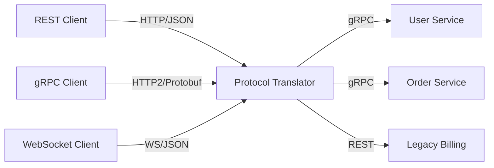
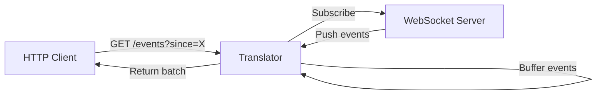
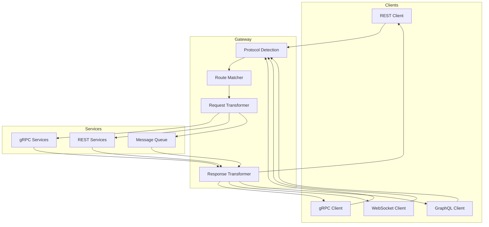

# How to Build Protocol Translation

Author: [nawazdhandala](https://github.com/nawazdhandala)

Tags: API Gateway, Protocol, Translation, Integration

Description: A practical guide to building protocol translation layers that convert between REST, gRPC, WebSocket, and different data formats in modern distributed systems.

---

Modern systems rarely speak the same language. Your frontend wants REST, your microservices prefer gRPC for speed, your real-time dashboards need WebSocket streams, and that legacy system only understands SOAP. Protocol translation bridges these gaps without forcing every team to rewrite their services.

This guide covers the patterns, code, and pitfalls of building translation layers that convert requests and responses across protocols.

## What Protocol Translation Actually Does

Protocol translation sits between clients and services, converting requests from one protocol to another. It handles three types of conversion:

1. **Transport translation**: HTTP/1.1 to HTTP/2, TCP to WebSocket
2. **Message format translation**: JSON to Protocol Buffers, XML to JSON
3. **Semantic translation**: REST resource operations to gRPC method calls



The translator becomes the universal adapter. Clients use whatever protocol they prefer, and backend services stay unchanged.

## REST to gRPC Translation

gRPC offers better performance than REST for internal service communication. Binary Protocol Buffers are smaller than JSON, HTTP/2 multiplexing reduces connection overhead, and strong typing catches errors at compile time. But browsers and mobile apps often need REST.

### Define Your Proto File

Start with a gRPC service definition:

```protobuf
// user.proto
syntax = "proto3";

package user;

service UserService {
  rpc GetUser(GetUserRequest) returns (User);
  rpc CreateUser(CreateUserRequest) returns (User);
  rpc ListUsers(ListUsersRequest) returns (ListUsersResponse);
  rpc UpdateUser(UpdateUserRequest) returns (User);
  rpc DeleteUser(DeleteUserRequest) returns (Empty);
}

message GetUserRequest {
  string user_id = 1;
}

message CreateUserRequest {
  string name = 1;
  string email = 2;
  string role = 3;
}

message User {
  string id = 1;
  string name = 2;
  string email = 3;
  string role = 4;
  int64 created_at = 5;
}

message ListUsersRequest {
  int32 page_size = 1;
  string page_token = 2;
}

message ListUsersResponse {
  repeated User users = 1;
  string next_page_token = 2;
}

message UpdateUserRequest {
  string user_id = 1;
  string name = 2;
  string email = 3;
}

message DeleteUserRequest {
  string user_id = 1;
}

message Empty {}
```

### Build the Translator in Node.js

Use grpc-js to connect to the gRPC service and Express to expose REST endpoints:

```javascript
const express = require('express');
const grpc = require('@grpc/grpc-js');
const protoLoader = require('@grpc/proto-loader');

// Load proto definition
const packageDef = protoLoader.loadSync('./user.proto', {
  keepCase: true,
  longs: String,
  enums: String,
  defaults: true,
});
const userProto = grpc.loadPackageDefinition(packageDef).user;

// Create gRPC client
const userClient = new userProto.UserService(
  process.env.USER_SERVICE_ADDR || 'localhost:50051',
  grpc.credentials.createInsecure()
);

// Promisify gRPC calls for cleaner async/await usage
function promisify(client, method) {
  return (request) => {
    return new Promise((resolve, reject) => {
      client[method](request, (err, response) => {
        if (err) reject(err);
        else resolve(response);
      });
    });
  };
}

const getUser = promisify(userClient, 'GetUser');
const createUser = promisify(userClient, 'CreateUser');
const listUsers = promisify(userClient, 'ListUsers');
const updateUser = promisify(userClient, 'UpdateUser');
const deleteUser = promisify(userClient, 'DeleteUser');

const app = express();
app.use(express.json());

// REST to gRPC mappings
// GET /users/:id -> GetUser
app.get('/users/:id', async (req, res) => {
  try {
    const user = await getUser({ user_id: req.params.id });
    res.json(user);
  } catch (err) {
    res.status(grpcToHttpStatus(err.code)).json({ error: err.message });
  }
});

// POST /users -> CreateUser
app.post('/users', async (req, res) => {
  try {
    const user = await createUser({
      name: req.body.name,
      email: req.body.email,
      role: req.body.role,
    });
    res.status(201).json(user);
  } catch (err) {
    res.status(grpcToHttpStatus(err.code)).json({ error: err.message });
  }
});

// GET /users -> ListUsers
app.get('/users', async (req, res) => {
  try {
    const response = await listUsers({
      page_size: parseInt(req.query.limit) || 20,
      page_token: req.query.cursor || '',
    });
    res.json({
      users: response.users,
      next_cursor: response.next_page_token,
    });
  } catch (err) {
    res.status(grpcToHttpStatus(err.code)).json({ error: err.message });
  }
});

// PUT /users/:id -> UpdateUser
app.put('/users/:id', async (req, res) => {
  try {
    const user = await updateUser({
      user_id: req.params.id,
      name: req.body.name,
      email: req.body.email,
    });
    res.json(user);
  } catch (err) {
    res.status(grpcToHttpStatus(err.code)).json({ error: err.message });
  }
});

// DELETE /users/:id -> DeleteUser
app.delete('/users/:id', async (req, res) => {
  try {
    await deleteUser({ user_id: req.params.id });
    res.status(204).send();
  } catch (err) {
    res.status(grpcToHttpStatus(err.code)).json({ error: err.message });
  }
});

// Map gRPC status codes to HTTP status codes
function grpcToHttpStatus(grpcCode) {
  const mapping = {
    0: 200,  // OK
    1: 499,  // CANCELLED
    2: 500,  // UNKNOWN
    3: 400,  // INVALID_ARGUMENT
    4: 504,  // DEADLINE_EXCEEDED
    5: 404,  // NOT_FOUND
    6: 409,  // ALREADY_EXISTS
    7: 403,  // PERMISSION_DENIED
    8: 429,  // RESOURCE_EXHAUSTED
    9: 400,  // FAILED_PRECONDITION
    10: 409, // ABORTED
    11: 400, // OUT_OF_RANGE
    12: 501, // UNIMPLEMENTED
    13: 500, // INTERNAL
    14: 503, // UNAVAILABLE
    15: 500, // DATA_LOSS
    16: 401, // UNAUTHENTICATED
  };
  return mapping[grpcCode] || 500;
}

app.listen(3000, () => {
  console.log('REST-to-gRPC translator running on port 3000');
});
```

### Using grpc-gateway for Automatic Translation

For Go services, grpc-gateway generates a reverse proxy from proto annotations:

```protobuf
// user.proto with HTTP annotations
syntax = "proto3";

package user;

import "google/api/annotations.proto";

service UserService {
  rpc GetUser(GetUserRequest) returns (User) {
    option (google.api.http) = {
      get: "/v1/users/{user_id}"
    };
  }

  rpc CreateUser(CreateUserRequest) returns (User) {
    option (google.api.http) = {
      post: "/v1/users"
      body: "*"
    };
  }

  rpc ListUsers(ListUsersRequest) returns (ListUsersResponse) {
    option (google.api.http) = {
      get: "/v1/users"
    };
  }

  rpc UpdateUser(UpdateUserRequest) returns (User) {
    option (google.api.http) = {
      put: "/v1/users/{user_id}"
      body: "*"
    };
  }

  rpc DeleteUser(DeleteUserRequest) returns (Empty) {
    option (google.api.http) = {
      delete: "/v1/users/{user_id}"
    };
  }
}
```

Generate the gateway code:

```bash
protoc -I . \
  --go_out=. --go_opt=paths=source_relative \
  --go-grpc_out=. --go-grpc_opt=paths=source_relative \
  --grpc-gateway_out=. --grpc-gateway_opt=paths=source_relative \
  user.proto
```

Run the gateway alongside your gRPC server:

```go
package main

import (
    "context"
    "net"
    "net/http"

    "github.com/grpc-ecosystem/grpc-gateway/v2/runtime"
    "google.golang.org/grpc"
    "google.golang.org/grpc/credentials/insecure"

    pb "yourmodule/user"
)

func main() {
    // Start gRPC server
    lis, _ := net.Listen("tcp", ":50051")
    grpcServer := grpc.NewServer()
    pb.RegisterUserServiceServer(grpcServer, &userServer{})
    go grpcServer.Serve(lis)

    // Start HTTP gateway
    ctx := context.Background()
    mux := runtime.NewServeMux()
    opts := []grpc.DialOption{grpc.WithTransportCredentials(insecure.NewCredentials())}

    pb.RegisterUserServiceHandlerFromEndpoint(ctx, mux, "localhost:50051", opts)

    http.ListenAndServe(":8080", mux)
}
```

## HTTP to WebSocket Translation

Sometimes clients need real-time updates but only support HTTP polling. A translation layer can convert polling requests into WebSocket subscriptions and push updates when data changes.



### Long Polling to WebSocket Bridge

```javascript
const express = require('express');
const WebSocket = require('ws');

const app = express();

// Event buffer per client
const clientBuffers = new Map();

// Connect to upstream WebSocket
function connectWebSocket(clientId, filters) {
  const ws = new WebSocket(process.env.WS_UPSTREAM || 'ws://localhost:8080/events');

  ws.on('open', () => {
    // Subscribe with filters
    ws.send(JSON.stringify({ type: 'subscribe', filters }));
  });

  ws.on('message', (data) => {
    const event = JSON.parse(data);
    const buffer = clientBuffers.get(clientId) || [];
    buffer.push(event);
    // Keep last 1000 events
    if (buffer.length > 1000) buffer.shift();
    clientBuffers.set(clientId, buffer);
  });

  ws.on('close', () => {
    // Reconnect after delay
    setTimeout(() => connectWebSocket(clientId, filters), 5000);
  });

  return ws;
}

// Long polling endpoint
app.get('/events', async (req, res) => {
  const clientId = req.query.client_id;
  const since = parseInt(req.query.since) || 0;
  const timeout = parseInt(req.query.timeout) || 30000;

  if (!clientId) {
    return res.status(400).json({ error: 'client_id required' });
  }

  // Initialize WebSocket connection if not exists
  if (!clientBuffers.has(clientId)) {
    clientBuffers.set(clientId, []);
    connectWebSocket(clientId, { types: req.query.types?.split(',') });
  }

  const buffer = clientBuffers.get(clientId);
  const newEvents = buffer.filter(e => e.timestamp > since);

  if (newEvents.length > 0) {
    return res.json({
      events: newEvents,
      last_timestamp: newEvents[newEvents.length - 1].timestamp,
    });
  }

  // Wait for new events or timeout
  const startTime = Date.now();
  const checkInterval = setInterval(() => {
    const buffer = clientBuffers.get(clientId);
    const newEvents = buffer.filter(e => e.timestamp > since);

    if (newEvents.length > 0 || Date.now() - startTime > timeout) {
      clearInterval(checkInterval);
      res.json({
        events: newEvents,
        last_timestamp: newEvents.length > 0
          ? newEvents[newEvents.length - 1].timestamp
          : since,
      });
    }
  }, 100);

  // Clean up on client disconnect
  req.on('close', () => clearInterval(checkInterval));
});

app.listen(3000);
```

### Server-Sent Events Bridge

For browsers that support SSE but not WebSocket (behind restrictive proxies), translate WebSocket to SSE:

```javascript
const express = require('express');
const WebSocket = require('ws');

const app = express();

app.get('/stream', (req, res) => {
  // Set SSE headers
  res.setHeader('Content-Type', 'text/event-stream');
  res.setHeader('Cache-Control', 'no-cache');
  res.setHeader('Connection', 'keep-alive');
  res.flushHeaders();

  // Connect to WebSocket upstream
  const ws = new WebSocket(process.env.WS_UPSTREAM || 'ws://localhost:8080/events');

  ws.on('open', () => {
    ws.send(JSON.stringify({
      type: 'subscribe',
      filters: { types: req.query.types?.split(',') }
    }));
  });

  ws.on('message', (data) => {
    const event = JSON.parse(data);
    // SSE format: event type, then data, then blank line
    res.write(`event: ${event.type}\n`);
    res.write(`data: ${JSON.stringify(event)}\n\n`);
  });

  ws.on('error', (err) => {
    res.write(`event: error\n`);
    res.write(`data: ${JSON.stringify({ message: err.message })}\n\n`);
  });

  // Clean up when client disconnects
  req.on('close', () => {
    ws.close();
  });
});

app.listen(3000);
```

## Format Conversion

Protocol translation often requires converting between data formats. JSON to Protocol Buffers, XML to JSON, or even custom binary formats.

### JSON to Protocol Buffers

```javascript
const protobuf = require('protobufjs');

// Load proto definition
const root = protobuf.loadSync('./messages.proto');
const UserMessage = root.lookupType('user.User');

function jsonToProtobuf(jsonData) {
  // Verify the JSON matches the schema
  const errMsg = UserMessage.verify(jsonData);
  if (errMsg) throw new Error(errMsg);

  // Create protobuf message
  const message = UserMessage.create(jsonData);

  // Encode to binary
  return UserMessage.encode(message).finish();
}

function protobufToJson(buffer) {
  // Decode binary to message
  const message = UserMessage.decode(buffer);

  // Convert to plain object
  return UserMessage.toObject(message, {
    longs: String,    // Convert Long to string
    enums: String,    // Convert enum to string name
    bytes: String,    // Convert bytes to base64
    defaults: true,   // Include default values
  });
}

// Express middleware for automatic conversion
function protobufMiddleware(MessageType) {
  return (req, res, next) => {
    const contentType = req.headers['content-type'];
    const accept = req.headers['accept'];

    // Parse protobuf request body
    if (contentType === 'application/x-protobuf') {
      const chunks = [];
      req.on('data', chunk => chunks.push(chunk));
      req.on('end', () => {
        const buffer = Buffer.concat(chunks);
        req.body = MessageType.decode(buffer);
        req.body = MessageType.toObject(req.body);
        next();
      });
    } else {
      next();
    }

    // Override res.json to support protobuf response
    const originalJson = res.json.bind(res);
    res.json = (data) => {
      if (accept === 'application/x-protobuf') {
        const message = MessageType.create(data);
        const buffer = MessageType.encode(message).finish();
        res.setHeader('Content-Type', 'application/x-protobuf');
        res.send(buffer);
      } else {
        originalJson(data);
      }
    };
  };
}
```

### XML to JSON Translation

For legacy SOAP services:

```javascript
const xml2js = require('xml2js');
const { create } = require('xmlbuilder2');

async function xmlToJson(xmlString) {
  const parser = new xml2js.Parser({
    explicitArray: false,      // Don't wrap single items in arrays
    ignoreAttrs: false,        // Include XML attributes
    mergeAttrs: true,          // Merge attributes into object
    explicitRoot: false,       // Don't include root element
    tagNameProcessors: [xml2js.processors.stripPrefix], // Remove namespaces
  });

  return parser.parseStringPromise(xmlString);
}

function jsonToXml(jsonData, rootName = 'root') {
  const doc = create({ version: '1.0', encoding: 'UTF-8' })
    .ele(rootName);

  function addNode(parent, obj) {
    for (const [key, value] of Object.entries(obj)) {
      if (value === null || value === undefined) continue;

      if (Array.isArray(value)) {
        value.forEach(item => {
          if (typeof item === 'object') {
            const child = parent.ele(key);
            addNode(child, item);
          } else {
            parent.ele(key).txt(String(item));
          }
        });
      } else if (typeof value === 'object') {
        const child = parent.ele(key);
        addNode(child, value);
      } else {
        parent.ele(key).txt(String(value));
      }
    }
  }

  addNode(doc, jsonData);
  return doc.end({ prettyPrint: true });
}

// SOAP to REST translation middleware
async function soapToRestMiddleware(req, res, next) {
  if (req.headers['content-type']?.includes('application/soap+xml')) {
    let body = '';
    req.on('data', chunk => body += chunk);
    req.on('end', async () => {
      try {
        const json = await xmlToJson(body);
        // Extract the SOAP body content
        req.body = json.Body || json;
        next();
      } catch (err) {
        res.status(400).json({ error: 'Invalid XML' });
      }
    });
  } else {
    next();
  }
}
```

## Building a Universal Protocol Gateway

A production gateway handles multiple protocols and routes based on configuration:



### Gateway Configuration

```yaml
# gateway-config.yaml
routes:
  - path: /api/v1/users
    methods: [GET, POST]
    upstream:
      protocol: grpc
      service: user-service:50051
      method_mapping:
        GET: ListUsers
        POST: CreateUser
    transforms:
      request:
        - type: json_to_protobuf
          proto: user.CreateUserRequest
      response:
        - type: protobuf_to_json
        - type: rename_field
          from: next_page_token
          to: next_cursor

  - path: /api/v1/users/:id
    methods: [GET, PUT, DELETE]
    upstream:
      protocol: grpc
      service: user-service:50051
      method_mapping:
        GET: GetUser
        PUT: UpdateUser
        DELETE: DeleteUser
    transforms:
      request:
        - type: path_param_to_field
          param: id
          field: user_id

  - path: /api/v1/events
    methods: [GET]
    upstream:
      protocol: websocket
      service: ws://event-service:8080/stream
    transforms:
      response:
        - type: sse_wrap

  - path: /legacy/orders
    methods: [POST]
    upstream:
      protocol: soap
      service: http://legacy-system:8080/OrderService
      action: CreateOrder
    transforms:
      request:
        - type: json_to_soap
          namespace: http://legacy.com/orders
      response:
        - type: soap_to_json
```

### Gateway Implementation

```javascript
const express = require('express');
const yaml = require('js-yaml');
const fs = require('fs');
const grpc = require('@grpc/grpc-js');
const protoLoader = require('@grpc/proto-loader');
const WebSocket = require('ws');

class ProtocolGateway {
  constructor(configPath) {
    this.config = yaml.load(fs.readFileSync(configPath, 'utf8'));
    this.grpcClients = new Map();
    this.app = express();
    this.app.use(express.json());
    this.setupRoutes();
  }

  setupRoutes() {
    for (const route of this.config.routes) {
      const methods = route.methods.map(m => m.toLowerCase());

      for (const method of methods) {
        const expressPath = route.path.replace(/:(\w+)/g, ':$1');

        this.app[method](expressPath, async (req, res) => {
          try {
            await this.handleRequest(route, method.toUpperCase(), req, res);
          } catch (err) {
            console.error('Gateway error:', err);
            res.status(500).json({ error: 'Internal gateway error' });
          }
        });
      }
    }
  }

  async handleRequest(route, method, req, res) {
    // Apply request transforms
    let requestData = { ...req.body, ...req.params, ...req.query };

    for (const transform of route.transforms?.request || []) {
      requestData = await this.applyTransform(transform, requestData, 'request');
    }

    // Route to upstream based on protocol
    let response;
    switch (route.upstream.protocol) {
      case 'grpc':
        response = await this.callGrpc(route.upstream, method, requestData);
        break;
      case 'websocket':
        response = await this.callWebSocket(route.upstream, requestData, res);
        return; // WebSocket handles its own response
      case 'soap':
        response = await this.callSoap(route.upstream, requestData);
        break;
      case 'rest':
        response = await this.callRest(route.upstream, method, requestData);
        break;
    }

    // Apply response transforms
    for (const transform of route.transforms?.response || []) {
      response = await this.applyTransform(transform, response, 'response');
    }

    res.json(response);
  }

  async callGrpc(upstream, method, data) {
    const client = this.getGrpcClient(upstream.service);
    const grpcMethod = upstream.method_mapping[method];

    return new Promise((resolve, reject) => {
      client[grpcMethod](data, (err, response) => {
        if (err) reject(err);
        else resolve(response);
      });
    });
  }

  getGrpcClient(service) {
    if (!this.grpcClients.has(service)) {
      // Load proto and create client
      // In production, you would configure proto paths per service
      const packageDef = protoLoader.loadSync('./protos/service.proto');
      const proto = grpc.loadPackageDefinition(packageDef);
      const client = new proto.Service(service, grpc.credentials.createInsecure());
      this.grpcClients.set(service, client);
    }
    return this.grpcClients.get(service);
  }

  async callWebSocket(upstream, data, res) {
    const ws = new WebSocket(upstream.service);

    res.setHeader('Content-Type', 'text/event-stream');
    res.setHeader('Cache-Control', 'no-cache');
    res.setHeader('Connection', 'keep-alive');

    ws.on('open', () => {
      ws.send(JSON.stringify(data));
    });

    ws.on('message', (message) => {
      res.write(`data: ${message}\n\n`);
    });

    ws.on('close', () => {
      res.end();
    });
  }

  async applyTransform(transform, data, direction) {
    switch (transform.type) {
      case 'rename_field':
        if (data[transform.from] !== undefined) {
          data[transform.to] = data[transform.from];
          delete data[transform.from];
        }
        return data;

      case 'path_param_to_field':
        return data; // Already merged in handleRequest

      case 'json_to_protobuf':
        // Protobuf conversion handled by gRPC client
        return data;

      case 'protobuf_to_json':
        // Already converted by gRPC client
        return data;

      default:
        return data;
    }
  }

  listen(port) {
    this.app.listen(port, () => {
      console.log(`Protocol gateway running on port ${port}`);
    });
  }
}

const gateway = new ProtocolGateway('./gateway-config.yaml');
gateway.listen(3000);
```

## Error Translation

Different protocols have different error conventions. Your translation layer must map errors consistently:

```javascript
// Error translation utilities

class TranslationError extends Error {
  constructor(message, code, details = {}) {
    super(message);
    this.code = code;
    this.details = details;
  }

  toRest() {
    return {
      status: this.code,
      body: {
        error: {
          message: this.message,
          code: this.restErrorCode(),
          details: this.details,
        },
      },
    };
  }

  toGrpc() {
    return {
      code: this.grpcCode(),
      message: this.message,
      details: this.details,
    };
  }

  toGraphQL() {
    return {
      message: this.message,
      extensions: {
        code: this.graphqlCode(),
        ...this.details,
      },
    };
  }

  restErrorCode() {
    const mapping = {
      400: 'BAD_REQUEST',
      401: 'UNAUTHORIZED',
      403: 'FORBIDDEN',
      404: 'NOT_FOUND',
      409: 'CONFLICT',
      429: 'RATE_LIMITED',
      500: 'INTERNAL_ERROR',
      503: 'UNAVAILABLE',
    };
    return mapping[this.code] || 'UNKNOWN_ERROR';
  }

  grpcCode() {
    const mapping = {
      400: 3,  // INVALID_ARGUMENT
      401: 16, // UNAUTHENTICATED
      403: 7,  // PERMISSION_DENIED
      404: 5,  // NOT_FOUND
      409: 6,  // ALREADY_EXISTS
      429: 8,  // RESOURCE_EXHAUSTED
      500: 13, // INTERNAL
      503: 14, // UNAVAILABLE
    };
    return mapping[this.code] || 2; // UNKNOWN
  }

  graphqlCode() {
    const mapping = {
      400: 'BAD_USER_INPUT',
      401: 'UNAUTHENTICATED',
      403: 'FORBIDDEN',
      404: 'NOT_FOUND',
      500: 'INTERNAL_SERVER_ERROR',
    };
    return mapping[this.code] || 'UNKNOWN_ERROR';
  }
}

// Convert gRPC error to TranslationError
function fromGrpcError(err) {
  const httpCode = grpcToHttpStatus(err.code);
  return new TranslationError(err.message, httpCode, err.metadata?.getMap());
}

// Convert REST error to TranslationError
function fromRestError(response) {
  return new TranslationError(
    response.data?.error?.message || 'Unknown error',
    response.status,
    response.data?.error?.details
  );
}
```

## Performance Considerations

Protocol translation adds latency. Here is how to minimize it:

### Connection Pooling

```javascript
const grpc = require('@grpc/grpc-js');

// Reuse gRPC channels instead of creating new connections
class GrpcPool {
  constructor() {
    this.channels = new Map();
  }

  getChannel(address) {
    if (!this.channels.has(address)) {
      const channel = new grpc.Channel(
        address,
        grpc.credentials.createInsecure(),
        {
          'grpc.keepalive_time_ms': 30000,
          'grpc.keepalive_timeout_ms': 10000,
          'grpc.max_receive_message_length': 50 * 1024 * 1024,
          'grpc.max_send_message_length': 50 * 1024 * 1024,
        }
      );
      this.channels.set(address, channel);
    }
    return this.channels.get(address);
  }
}
```

### Response Caching

```javascript
const NodeCache = require('node-cache');

const cache = new NodeCache({ stdTTL: 60 });

async function cachedTranslation(cacheKey, translationFn) {
  const cached = cache.get(cacheKey);
  if (cached) return cached;

  const result = await translationFn();
  cache.set(cacheKey, result);
  return result;
}

// Use in route handler
app.get('/users/:id', async (req, res) => {
  const cacheKey = `user:${req.params.id}`;

  const user = await cachedTranslation(cacheKey, async () => {
    return await getUser({ user_id: req.params.id });
  });

  res.json(user);
});
```

### Streaming for Large Payloads

```javascript
// Stream large responses instead of buffering
app.get('/reports/:id', async (req, res) => {
  const call = reportClient.StreamReport({ report_id: req.params.id });

  res.setHeader('Content-Type', 'application/json');
  res.write('[');

  let first = true;
  call.on('data', (chunk) => {
    if (!first) res.write(',');
    first = false;
    res.write(JSON.stringify(chunk));
  });

  call.on('end', () => {
    res.write(']');
    res.end();
  });

  call.on('error', (err) => {
    res.status(500).end();
  });
});
```

## Monitoring Translation Layers

Track translation-specific metrics:

```javascript
const prometheus = require('prom-client');

const translationLatency = new prometheus.Histogram({
  name: 'protocol_translation_duration_seconds',
  help: 'Time spent translating between protocols',
  labelNames: ['source_protocol', 'target_protocol', 'route'],
  buckets: [0.001, 0.005, 0.01, 0.05, 0.1, 0.5, 1],
});

const translationErrors = new prometheus.Counter({
  name: 'protocol_translation_errors_total',
  help: 'Number of translation errors',
  labelNames: ['source_protocol', 'target_protocol', 'error_type'],
});

const formatConversions = new prometheus.Counter({
  name: 'format_conversions_total',
  help: 'Number of format conversions performed',
  labelNames: ['from_format', 'to_format'],
});

// Middleware to track metrics
function metricsMiddleware(sourceProtocol) {
  return (req, res, next) => {
    const start = process.hrtime.bigint();

    res.on('finish', () => {
      const duration = Number(process.hrtime.bigint() - start) / 1e9;
      translationLatency.observe(
        {
          source_protocol: sourceProtocol,
          target_protocol: req.targetProtocol || 'unknown',
          route: req.route?.path || req.path,
        },
        duration
      );
    });

    next();
  };
}
```

## Summary

| Translation Type | Use Case | Key Consideration |
|-----------------|----------|-------------------|
| **REST to gRPC** | Internal microservices need performance | Map HTTP verbs to RPC methods, handle streaming |
| **HTTP to WebSocket** | Real-time for HTTP-only clients | Buffer events, handle reconnection |
| **JSON to Protobuf** | Reduce payload size and parsing | Schema must stay in sync |
| **XML/SOAP to JSON** | Legacy system integration | Handle namespaces and attributes |

Protocol translation unlocks interoperability without rewriting services. Start with the most painful integration point, build a focused translator, and expand from there. Keep transformations simple, errors consistent, and always measure the latency you add.
