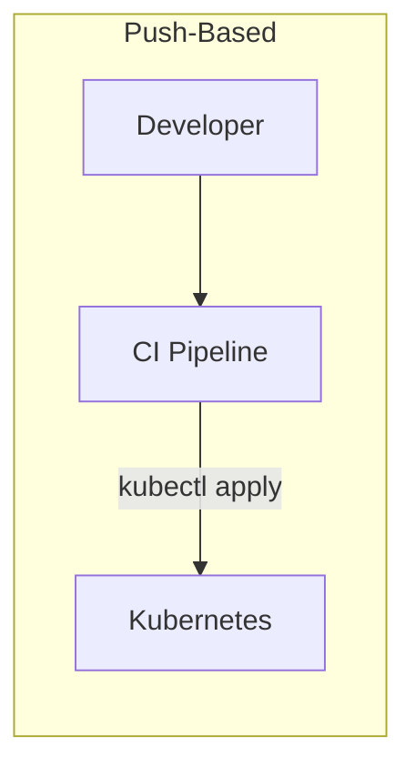
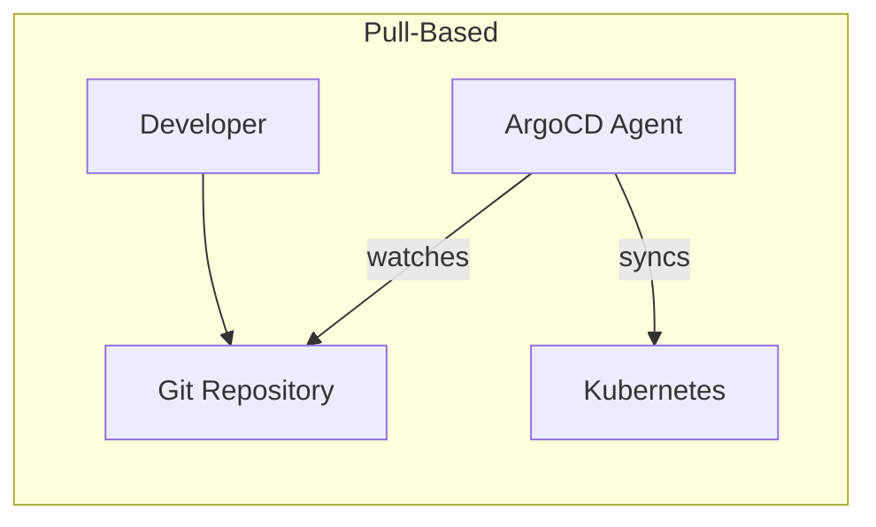
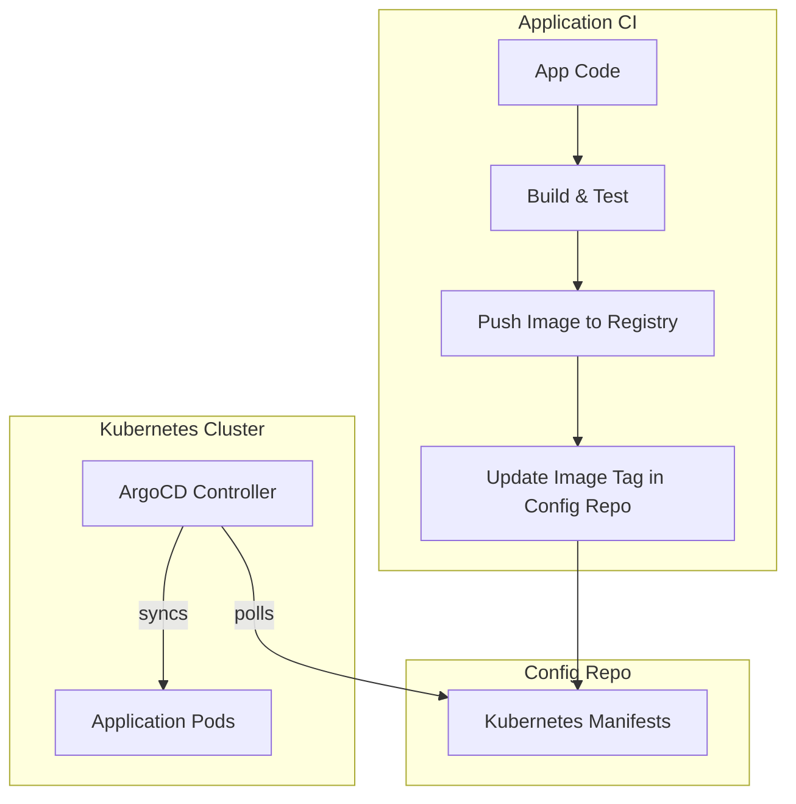
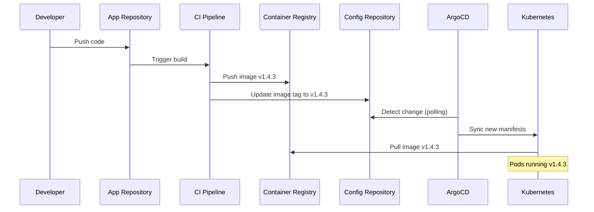

# How to Build Pull-Based Deployment

Author: [nawazdhandala](https://github.com/nawazdhandala)

Tags: GitOps, ArgoCD, Pull-Based, Kubernetes

Description: Learn to build pull-based deployment using GitOps with ArgoCD.

---

Push-based deployments have served us well for years. CI pipelines build images, then push manifests directly to clusters. Simple enough, but that simplicity hides security risks and operational headaches. Pull-based deployment flips the model: your cluster pulls its desired state from Git, and nothing outside the cluster has direct access to apply changes.

This guide walks through building a complete pull-based deployment pipeline using ArgoCD. You will understand the architecture, set up the components, and ship code without ever running `kubectl apply` from your laptop or CI server.

## Why Pull-Based Beats Push-Based

Traditional CI/CD pipelines push changes to Kubernetes clusters. This means your CI system needs cluster credentials, creating a security surface that grows with every pipeline.



Pull-based deployment inverts this relationship. The cluster runs an agent that watches Git and pulls changes when they appear.



The benefits become clear when you scale:

- **No external cluster access.** CI pipelines never touch Kubernetes directly. ArgoCD runs inside the cluster and only needs outbound access to Git.
- **Git as audit log.** Every deployment is a commit. Rolling back means reverting a commit.
- **Drift detection.** ArgoCD continuously compares cluster state to Git. Manual changes get flagged or automatically corrected.
- **Multi-cluster consistency.** One Git repo can drive deployments across dozens of clusters without maintaining credentials for each.

## Architecture Overview

A pull-based pipeline separates concerns cleanly. Your application CI builds and pushes images. A separate config repo holds Kubernetes manifests. ArgoCD bridges the two.



This separation means application developers commit code, CI handles builds, and ArgoCD handles deployment. No pipeline needs cluster credentials.

## Setting Up ArgoCD

Start by installing ArgoCD in your cluster. The following commands set up a production-ready installation using Helm.

```bash
# Add the ArgoCD Helm repository
helm repo add argo https://argoproj.github.io/argo-helm
helm repo update

# Install ArgoCD with sensible defaults
helm install argocd argo/argo-cd \
  --namespace argocd \
  --create-namespace \
  --set server.service.type=ClusterIP \
  --set configs.params."server\.insecure"=true
```

After installation, retrieve the initial admin password and set up CLI access.

```bash
# Get the auto-generated admin password
kubectl -n argocd get secret argocd-initial-admin-secret \
  -o jsonpath="{.data.password}" | base64 -d && echo

# Port forward to access the UI locally
kubectl port-forward svc/argocd-server -n argocd 8080:443

# Login via CLI (username is 'admin')
argocd login localhost:8080 --insecure
```

## Structuring Your Config Repository

A well-organized config repo makes GitOps maintainable. Separate base manifests from environment-specific overlays using Kustomize.

```
config-repo/
├── base/
│   ├── kustomization.yaml
│   ├── deployment.yaml
│   ├── service.yaml
│   └── configmap.yaml
└── overlays/
    ├── development/
    │   ├── kustomization.yaml
    │   └── replica-patch.yaml
    ├── staging/
    │   ├── kustomization.yaml
    │   └── replica-patch.yaml
    └── production/
        ├── kustomization.yaml
        └── replica-patch.yaml
```

The base deployment defines your application without environment specifics.

```yaml
# base/deployment.yaml
apiVersion: apps/v1
kind: Deployment
metadata:
  name: myapp
spec:
  replicas: 1
  selector:
    matchLabels:
      app: myapp
  template:
    metadata:
      labels:
        app: myapp
    spec:
      containers:
        - name: myapp
          # Image tag gets overridden per environment
          image: registry.example.com/myapp:latest
          ports:
            - containerPort: 8080
          resources:
            requests:
              memory: "128Mi"
              cpu: "100m"
            limits:
              memory: "256Mi"
              cpu: "200m"
```

Each environment overlay customizes the base. Here is a production overlay that scales up replicas and pins a specific image tag.

```yaml
# overlays/production/kustomization.yaml
apiVersion: kustomize.config.k8s.io/v1beta1
kind: Kustomization
namespace: production
resources:
  - ../../base
patches:
  - replica-patch.yaml
images:
  - name: registry.example.com/myapp
    newTag: v1.4.2
```

```yaml
# overlays/production/replica-patch.yaml
apiVersion: apps/v1
kind: Deployment
metadata:
  name: myapp
spec:
  replicas: 5
```

## Creating an ArgoCD Application

With your config repo structured, create an ArgoCD Application that watches it. This declarative YAML tells ArgoCD where to find manifests and where to deploy them.

```yaml
# argocd-application.yaml
apiVersion: argoproj.io/v1alpha1
kind: Application
metadata:
  name: myapp-production
  namespace: argocd
spec:
  project: default
  source:
    # Your config repository URL
    repoURL: https://github.com/myorg/myapp-config.git
    targetRevision: main
    path: overlays/production
  destination:
    # Deploy to the local cluster
    server: https://kubernetes.default.svc
    namespace: production
  syncPolicy:
    automated:
      # Remove resources deleted from Git
      prune: true
      # Revert manual cluster changes
      selfHeal: true
    syncOptions:
      # Create namespace if missing
      - CreateNamespace=true
```

Apply this to your cluster.

```bash
kubectl apply -f argocd-application.yaml
```

ArgoCD now watches your config repo. Any commit to the `overlays/production` path triggers a sync.

## Automating Image Tag Updates

The final piece connects your application CI to the config repo. When a new image builds successfully, your pipeline updates the image tag in the config repo.

Here is a GitHub Actions workflow that builds an image and updates the config repo.

```yaml
# .github/workflows/build.yaml
name: Build and Update Config

on:
  push:
    branches: [main]

jobs:
  build:
    runs-on: ubuntu-latest
    steps:
      - uses: actions/checkout@v4

      - name: Build and push image
        run: |
          # Build with commit SHA as tag
          docker build -t registry.example.com/myapp:${{ github.sha }} .
          docker push registry.example.com/myapp:${{ github.sha }}

      - name: Update config repo
        run: |
          # Clone config repo
          git clone https://x-access-token:${{ secrets.CONFIG_REPO_TOKEN }}@github.com/myorg/myapp-config.git
          cd myapp-config

          # Update image tag in production overlay
          cd overlays/production
          kustomize edit set image registry.example.com/myapp:${{ github.sha }}

          # Commit and push
          git config user.name "CI Bot"
          git config user.email "ci@example.com"
          git add .
          git commit -m "Deploy myapp ${{ github.sha }}"
          git push
```

This workflow never touches Kubernetes directly. It pushes an image, updates Git, and ArgoCD handles the rest.

## Enabling Self-Healing and Drift Detection

Pull-based deployment shines when things go wrong. ArgoCD can automatically detect and correct drift between Git and the cluster.

The `selfHeal: true` setting in your Application spec handles this automatically. When someone runs a manual `kubectl` command that changes your deployment, ArgoCD reverts it to match Git within seconds.

You can also configure ArgoCD to alert instead of auto-heal. This gives you visibility into drift without automatic correction.

```yaml
syncPolicy:
  automated:
    prune: true
    # Disable auto-heal to get alerts instead
    selfHeal: false
```

Pair this with ArgoCD notifications to get Slack or email alerts when drift occurs.

## Handling Secrets Safely

Secrets require special handling since you should not store them in plain text in Git. External Secrets Operator pulls secrets from your vault and creates Kubernetes Secrets.

```yaml
# external-secret.yaml
apiVersion: external-secrets.io/v1beta1
kind: ExternalSecret
metadata:
  name: myapp-secrets
spec:
  refreshInterval: 1h
  secretStoreRef:
    name: vault-backend
    kind: ClusterSecretStore
  target:
    name: myapp-secrets
  data:
    - secretKey: DATABASE_URL
      remoteRef:
        key: myapp/production
        property: database_url
```

This manifest lives in Git. The actual secret value stays in your vault. ArgoCD syncs the ExternalSecret resource, and External Secrets Operator creates the real Secret.

## The Complete Flow

With everything connected, deployments flow automatically from code commit to running pods.



Rollback is equally simple: revert the config repo commit, and ArgoCD syncs the previous state.

## Summary

Pull-based deployment removes the need for external cluster access while providing built-in audit trails, drift detection, and self-healing. ArgoCD watches your Git repository and keeps your cluster in sync automatically.

The key components are:

1. ArgoCD installed in your cluster
2. A config repository with Kustomize overlays per environment
3. Application CI that updates image tags in the config repo
4. ArgoCD Applications that watch config repo paths

This architecture scales from single clusters to hundreds. Each cluster runs its own ArgoCD instance, all watching the same Git repo. Add a new environment by creating an overlay and an ArgoCD Application. No credentials to distribute, no pipelines to update.

Start with one application. Once you see the benefits of Git-driven deployments, expanding to your entire fleet becomes straightforward.
