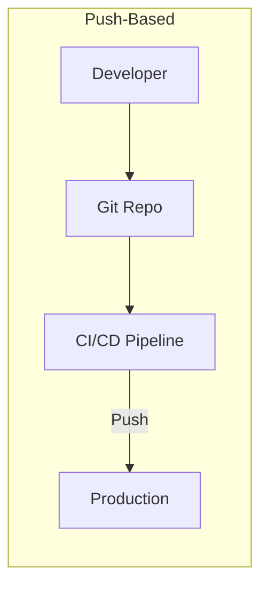
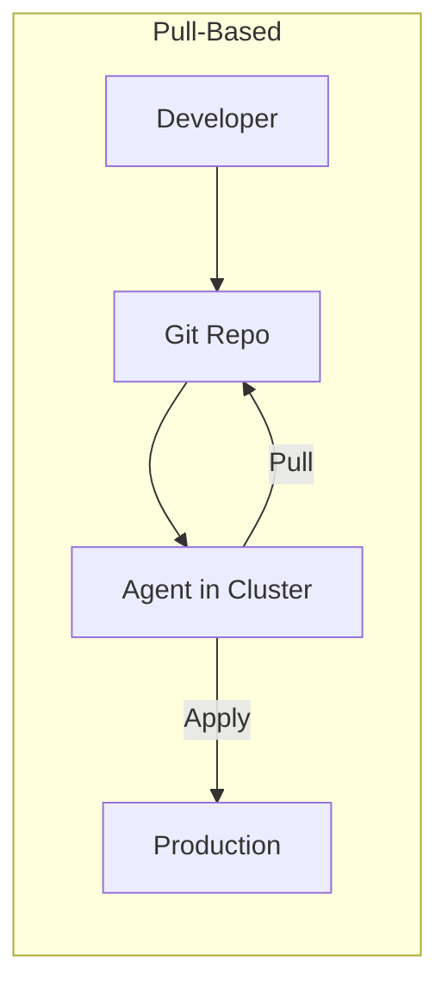
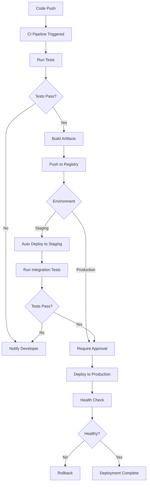

# How to Implement Push-Based Deployment

Author: [nawazdhandala](https://github.com/nawazdhandala)

Tags: CI/CD, Push-Based, Jenkins, GitHub Actions

Description: Learn to implement push-based deployment using CI/CD pipelines.

---

Push-based deployment is the traditional CI/CD model where your pipeline actively pushes changes to target environments. When code is merged, the pipeline builds, tests, and deploys directly to your servers or clusters. This approach gives you explicit control over when and how deployments happen.

## Push vs Pull Deployment Models

Before diving into implementation, let's understand the difference between push and pull deployment models.





In push-based deployment, the CI/CD system has credentials to access your production environment. It actively pushes changes when triggered. In pull-based deployment (like ArgoCD or Flux), an agent inside the cluster pulls changes from Git.

## When to Use Push-Based Deployment

Push-based deployment works well for:

- Traditional server deployments (VMs, bare metal)
- Smaller teams with simpler infrastructure
- Environments where you need immediate, synchronous feedback
- Legacy systems that cannot run in-cluster agents
- Scenarios requiring complex pre-deployment logic

## Basic Push Deployment with GitHub Actions

Here is a straightforward GitHub Actions workflow that deploys to a server via SSH.

```yaml
# .github/workflows/deploy.yml
name: Deploy to Production

on:
  push:
    branches:
      - main  # Trigger on pushes to main branch

jobs:
  build:
    runs-on: ubuntu-latest
    steps:
      # Check out the repository code
      - name: Checkout code
        uses: actions/checkout@v4

      # Set up Node.js environment for building
      - name: Setup Node.js
        uses: actions/setup-node@v4
        with:
          node-version: '20'
          cache: 'npm'

      # Install dependencies and run the build
      - name: Install and build
        run: |
          npm ci
          npm run build
          npm test

      # Upload the build artifacts for the deploy job
      - name: Upload artifacts
        uses: actions/upload-artifact@v4
        with:
          name: build-output
          path: dist/

  deploy:
    needs: build  # Wait for build to complete
    runs-on: ubuntu-latest
    environment: production  # Use production environment for secrets
    steps:
      # Download the build artifacts from previous job
      - name: Download artifacts
        uses: actions/download-artifact@v4
        with:
          name: build-output
          path: dist/

      # Deploy to server using rsync over SSH
      - name: Deploy via SSH
        uses: easingthemes/ssh-deploy@v5
        with:
          SSH_PRIVATE_KEY: ${{ secrets.SSH_PRIVATE_KEY }}
          REMOTE_HOST: ${{ secrets.DEPLOY_HOST }}
          REMOTE_USER: ${{ secrets.DEPLOY_USER }}
          SOURCE: "dist/"
          TARGET: "/var/www/myapp/"
          SCRIPT_AFTER: |
            cd /var/www/myapp
            pm2 restart myapp
```

This workflow builds the application, runs tests, and deploys to a server using SSH. The `environment: production` setting enables environment-specific secrets and optional approval gates.

## Push Deployment to Kubernetes

For Kubernetes deployments, the pipeline updates container images and applies manifests directly.

```yaml
# .github/workflows/k8s-deploy.yml
name: Deploy to Kubernetes

on:
  push:
    branches:
      - main

env:
  REGISTRY: ghcr.io
  IMAGE_NAME: ${{ github.repository }}

jobs:
  build-and-push:
    runs-on: ubuntu-latest
    outputs:
      image-tag: ${{ steps.meta.outputs.tags }}
    steps:
      - name: Checkout
        uses: actions/checkout@v4

      # Authenticate with GitHub Container Registry
      - name: Login to GHCR
        uses: docker/login-action@v3
        with:
          registry: ${{ env.REGISTRY }}
          username: ${{ github.actor }}
          password: ${{ secrets.GITHUB_TOKEN }}

      # Generate image tags based on Git metadata
      - name: Extract metadata
        id: meta
        uses: docker/metadata-action@v5
        with:
          images: ${{ env.REGISTRY }}/${{ env.IMAGE_NAME }}
          tags: |
            type=sha,prefix=
            type=ref,event=branch

      # Build and push the Docker image
      - name: Build and push
        uses: docker/build-push-action@v5
        with:
          context: .
          push: true
          tags: ${{ steps.meta.outputs.tags }}
          cache-from: type=gha
          cache-to: type=gha,mode=max

  deploy:
    needs: build-and-push
    runs-on: ubuntu-latest
    steps:
      - name: Checkout
        uses: actions/checkout@v4

      # Configure kubectl to access the cluster
      - name: Setup kubectl
        uses: azure/setup-kubectl@v3

      # Set up kubeconfig from secret
      - name: Configure kubeconfig
        run: |
          mkdir -p ~/.kube
          echo "${{ secrets.KUBECONFIG }}" | base64 -d > ~/.kube/config
          chmod 600 ~/.kube/config

      # Update the deployment with the new image tag
      - name: Deploy to cluster
        run: |
          kubectl set image deployment/myapp \
            myapp=${{ env.REGISTRY }}/${{ env.IMAGE_NAME }}:${{ github.sha }} \
            -n production

          # Wait for rollout to complete
          kubectl rollout status deployment/myapp -n production --timeout=300s
```

## Jenkins Pipeline Example

Jenkins remains popular for push-based deployments, especially in enterprise environments. Here is a declarative pipeline.

```groovy
// Jenkinsfile
pipeline {
    agent any

    environment {
        DOCKER_REGISTRY = 'registry.example.com'
        APP_NAME = 'myapp'
        DEPLOY_HOST = 'prod.example.com'
    }

    stages {
        stage('Build') {
            steps {
                // Install dependencies and compile
                sh 'npm ci'
                sh 'npm run build'
            }
        }

        stage('Test') {
            steps {
                // Run test suite with coverage
                sh 'npm test -- --coverage'
            }
            post {
                always {
                    // Publish test results regardless of outcome
                    junit 'test-results/*.xml'
                }
            }
        }

        stage('Build Image') {
            steps {
                script {
                    // Build Docker image with commit SHA tag
                    docker.build("${DOCKER_REGISTRY}/${APP_NAME}:${GIT_COMMIT}")
                }
            }
        }

        stage('Push Image') {
            steps {
                script {
                    // Push to container registry
                    docker.withRegistry("https://${DOCKER_REGISTRY}", 'registry-creds') {
                        docker.image("${DOCKER_REGISTRY}/${APP_NAME}:${GIT_COMMIT}").push()
                        docker.image("${DOCKER_REGISTRY}/${APP_NAME}:${GIT_COMMIT}").push('latest')
                    }
                }
            }
        }

        stage('Deploy') {
            // Require manual approval for production
            input {
                message "Deploy to production?"
                ok "Deploy"
            }
            steps {
                // Deploy using SSH and restart services
                sshagent(['deploy-key']) {
                    sh """
                        ssh deploy@${DEPLOY_HOST} '
                            docker pull ${DOCKER_REGISTRY}/${APP_NAME}:${GIT_COMMIT}
                            docker stop ${APP_NAME} || true
                            docker rm ${APP_NAME} || true
                            docker run -d --name ${APP_NAME} \
                                -p 8080:8080 \
                                ${DOCKER_REGISTRY}/${APP_NAME}:${GIT_COMMIT}
                        '
                    """
                }
            }
        }
    }

    post {
        success {
            // Notify team on successful deployment
            slackSend(color: 'good', message: "Deployed ${APP_NAME} (${GIT_COMMIT})")
        }
        failure {
            slackSend(color: 'danger', message: "Deployment failed for ${APP_NAME}")
        }
    }
}
```

## Deployment Flow Architecture

A robust push-based deployment pipeline follows this pattern.



## Implementing Rollback

Rollback capability is essential for push-based deployments. Here is how to implement automatic rollback on failure.

```yaml
# .github/workflows/deploy-with-rollback.yml
name: Deploy with Rollback

on:
  push:
    branches: [main]

jobs:
  deploy:
    runs-on: ubuntu-latest
    steps:
      - name: Checkout
        uses: actions/checkout@v4
        with:
          fetch-depth: 2  # Need previous commit for rollback

      - name: Setup kubectl
        uses: azure/setup-kubectl@v3

      - name: Configure kubeconfig
        run: |
          mkdir -p ~/.kube
          echo "${{ secrets.KUBECONFIG }}" | base64 -d > ~/.kube/config

      # Store the current image tag before deployment
      - name: Get current deployment
        id: current
        run: |
          CURRENT_IMAGE=$(kubectl get deployment myapp -n production \
            -o jsonpath='{.spec.template.spec.containers[0].image}')
          echo "image=$CURRENT_IMAGE" >> $GITHUB_OUTPUT

      # Deploy the new version
      - name: Deploy new version
        id: deploy
        run: |
          kubectl set image deployment/myapp \
            myapp=ghcr.io/${{ github.repository }}:${{ github.sha }} \
            -n production

          # Wait for rollout with timeout
          kubectl rollout status deployment/myapp \
            -n production --timeout=300s

      # Rollback if deployment failed
      - name: Rollback on failure
        if: failure() && steps.deploy.outcome == 'failure'
        run: |
          echo "Deployment failed, rolling back to ${{ steps.current.outputs.image }}"
          kubectl set image deployment/myapp \
            myapp=${{ steps.current.outputs.image }} \
            -n production
          kubectl rollout status deployment/myapp -n production
```

## Security Considerations

Push-based deployment requires careful secret management since your CI system needs production access.

Store credentials securely using your CI platform's secret management. For GitHub Actions, use encrypted secrets and environments.

```yaml
# Secure deployment with environment protection
deploy:
  runs-on: ubuntu-latest
  environment:
    name: production
    url: https://myapp.example.com
  steps:
    - name: Deploy
      env:
        # Secrets are masked in logs automatically
        DEPLOY_TOKEN: ${{ secrets.DEPLOY_TOKEN }}
      run: |
        # Use short-lived credentials when possible
        ./deploy.sh
```

For Kubernetes deployments, use service accounts with minimal permissions.

```yaml
# k8s-deployer-role.yaml
apiVersion: rbac.authorization.k8s.io/v1
kind: Role
metadata:
  name: ci-deployer
  namespace: production
rules:
  # Only allow updating deployments, not cluster-wide resources
  - apiGroups: ["apps"]
    resources: ["deployments"]
    verbs: ["get", "patch", "update"]
  - apiGroups: [""]
    resources: ["pods"]
    verbs: ["get", "list"]
```

## Monitoring Deployments

Integrate deployment tracking with your observability stack. Send deployment markers to track changes against metrics.

```yaml
# Add to your deploy job
- name: Record deployment
  run: |
    curl -X POST "https://oneuptime.example.com/api/deployment" \
      -H "Authorization: Bearer ${{ secrets.ONEUPTIME_TOKEN }}" \
      -H "Content-Type: application/json" \
      -d '{
        "service": "myapp",
        "version": "${{ github.sha }}",
        "environment": "production",
        "timestamp": "'$(date -u +%Y-%m-%dT%H:%M:%SZ)'"
      }'
```

## Conclusion

Push-based deployment provides direct control over your deployment process. It works especially well when you need synchronous feedback, complex deployment logic, or when deploying to non-Kubernetes environments. The key to success is implementing proper rollback mechanisms, securing your credentials, and monitoring each deployment.

For Kubernetes-native environments with multiple clusters, consider complementing push-based CI with pull-based GitOps tools. Many teams use push-based pipelines for building and testing, then let GitOps tools handle the final deployment to clusters.
