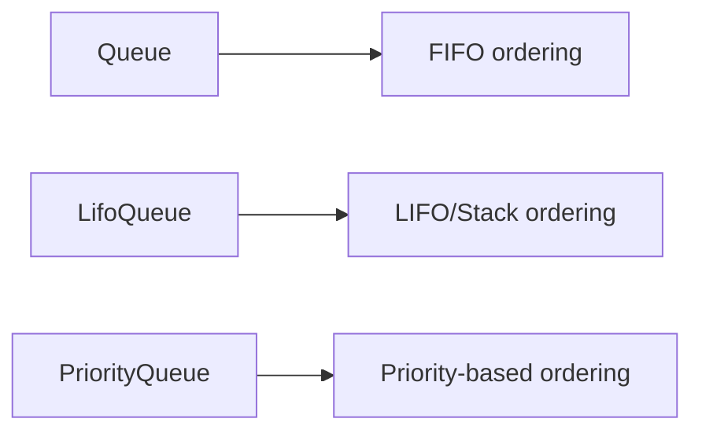

# How to Build Asyncio Queues in Python

Author: [nawazdhandala](https://www.github.com/nawazdhandala)

Tags: Python, Asyncio, Queues, Concurrency, Async Programming

Description: Master Python asyncio queues for producer-consumer patterns, task distribution, and backpressure handling in async applications.

---

If you have ever worked with async Python code, you have probably run into situations where you need to coordinate work between different parts of your application. Maybe you are processing data from multiple sources, distributing tasks to workers, or handling a stream of incoming requests. This is where asyncio queues come in.

Queues are one of those fundamental patterns that show up everywhere in concurrent programming. They let different parts of your code communicate without being tightly coupled, and they naturally handle the timing differences between producers and consumers. In this guide, we will build several practical examples using Python's asyncio queues.

## Understanding Asyncio Queue Types

Python's asyncio module provides three queue types, each suited for different scenarios:



The standard `Queue` processes items in the order they were added (first-in, first-out). `LifoQueue` works like a stack where the most recently added item comes out first. `PriorityQueue` lets you assign priorities to items so important work gets processed first.

## Basic Producer-Consumer Pattern

Let us start with the classic producer-consumer pattern. This is the foundation for most queue-based systems.

```python
import asyncio
import random

async def producer(queue: asyncio.Queue, producer_id: int) -> None:
    """
    Generates work items and puts them in the queue.
    Simulates variable production rates with random delays.
    """
    for i in range(5):
        # Create a work item with some metadata
        item = {"producer": producer_id, "item": i, "data": f"task_{producer_id}_{i}"}

        # Put the item in the queue - this will wait if queue is full
        await queue.put(item)
        print(f"Producer {producer_id} added: {item['data']}")

        # Simulate variable production time
        await asyncio.sleep(random.uniform(0.1, 0.5))

    print(f"Producer {producer_id} finished")


async def consumer(queue: asyncio.Queue, consumer_id: int) -> None:
    """
    Processes work items from the queue.
    Runs until it receives a None sentinel value.
    """
    while True:
        # Get an item from the queue - waits if queue is empty
        item = await queue.get()

        # Check for shutdown signal
        if item is None:
            queue.task_done()
            print(f"Consumer {consumer_id} shutting down")
            break

        # Process the item
        print(f"Consumer {consumer_id} processing: {item['data']}")
        await asyncio.sleep(random.uniform(0.2, 0.6))  # Simulate work

        # Mark the task as complete
        queue.task_done()


async def main() -> None:
    # Create a queue with a maximum size to enable backpressure
    queue: asyncio.Queue = asyncio.Queue(maxsize=10)

    # Start producers and consumers
    producers = [asyncio.create_task(producer(queue, i)) for i in range(2)]
    consumers = [asyncio.create_task(consumer(queue, i)) for i in range(3)]

    # Wait for all producers to finish
    await asyncio.gather(*producers)

    # Send shutdown signals to consumers
    for _ in consumers:
        await queue.put(None)

    # Wait for all items to be processed
    await queue.join()

    # Wait for consumers to finish
    await asyncio.gather(*consumers)

    print("All work completed")


if __name__ == "__main__":
    asyncio.run(main())
```

A few things to notice here. We use `queue.task_done()` to signal that each item has been processed. This pairs with `queue.join()` which blocks until all items have been marked as done. The sentinel value pattern (sending `None` to signal shutdown) is a clean way to stop consumers gracefully.

## Implementing Backpressure with Bounded Queues

When producers generate work faster than consumers can process it, you need backpressure. A bounded queue handles this naturally by blocking producers when the queue is full.

```python
import asyncio
import time

async def fast_producer(queue: asyncio.Queue, name: str) -> None:
    """
    A producer that generates items quickly.
    Will be slowed down by backpressure when queue fills up.
    """
    for i in range(20):
        start = time.monotonic()

        # This will block when queue is full, creating backpressure
        await queue.put(f"{name}_item_{i}")

        elapsed = time.monotonic() - start
        if elapsed > 0.01:  # Log when we had to wait
            print(f"{name}: waited {elapsed:.2f}s due to backpressure")
        else:
            print(f"{name}: added item {i}")

        await asyncio.sleep(0.05)  # Fast production rate


async def slow_consumer(queue: asyncio.Queue, name: str) -> None:
    """
    A consumer that processes items slowly.
    This creates the need for backpressure.
    """
    processed = 0
    while True:
        try:
            # Use wait_for to implement a timeout
            item = await asyncio.wait_for(queue.get(), timeout=2.0)
            print(f"{name}: processing {item}")
            await asyncio.sleep(0.3)  # Slow processing
            queue.task_done()
            processed += 1
        except asyncio.TimeoutError:
            print(f"{name}: no items for 2s, shutting down (processed {processed})")
            break


async def main() -> None:
    # Small queue size forces backpressure quickly
    queue: asyncio.Queue = asyncio.Queue(maxsize=5)

    producer_task = asyncio.create_task(fast_producer(queue, "FastProducer"))
    consumer_task = asyncio.create_task(slow_consumer(queue, "SlowConsumer"))

    await producer_task
    await queue.join()
    consumer_task.cancel()

    print("Demonstration complete")


if __name__ == "__main__":
    asyncio.run(main())
```

The key insight here is that backpressure happens automatically. When the queue hits its `maxsize`, the `put()` call blocks until space is available. This naturally slows down producers to match consumer throughput.

## Priority Queue for Task Scheduling

Sometimes not all tasks are equal. A priority queue lets you process important items first.

```python
import asyncio
import dataclasses
from typing import Any

@dataclasses.dataclass(order=True)
class PrioritizedTask:
    """
    Wrapper for tasks with priority.
    Lower priority numbers are processed first.
    The order=True makes this comparable for the priority queue.
    """
    priority: int
    task_id: str = dataclasses.field(compare=False)
    payload: Any = dataclasses.field(compare=False)


async def priority_producer(queue: asyncio.PriorityQueue) -> None:
    """
    Adds tasks with different priorities.
    In real applications, priority might come from request headers,
    user tier, or task type.
    """
    tasks = [
        PrioritizedTask(priority=3, task_id="low_1", payload="Background sync"),
        PrioritizedTask(priority=1, task_id="high_1", payload="User request"),
        PrioritizedTask(priority=3, task_id="low_2", payload="Analytics"),
        PrioritizedTask(priority=2, task_id="med_1", payload="Email notification"),
        PrioritizedTask(priority=1, task_id="high_2", payload="Payment processing"),
        PrioritizedTask(priority=2, task_id="med_2", payload="Cache refresh"),
    ]

    # Add tasks in mixed order
    for task in tasks:
        await queue.put(task)
        print(f"Added: {task.task_id} (priority {task.priority})")

    # Signal completion
    await queue.put(PrioritizedTask(priority=999, task_id="STOP", payload=None))


async def priority_consumer(queue: asyncio.PriorityQueue) -> None:
    """
    Processes tasks in priority order.
    Notice how high priority tasks (lower numbers) are processed first.
    """
    while True:
        task = await queue.get()

        if task.task_id == "STOP":
            queue.task_done()
            break

        print(f"Processing: {task.task_id} - {task.payload}")
        await asyncio.sleep(0.2)  # Simulate work
        queue.task_done()


async def main() -> None:
    queue: asyncio.PriorityQueue = asyncio.PriorityQueue()

    # Let producer add all items first
    await priority_producer(queue)

    print("\n--- Processing in priority order ---\n")

    # Now process them - they come out in priority order
    await priority_consumer(queue)


if __name__ == "__main__":
    asyncio.run(main())
```

Notice that we use a dataclass with `order=True` to make tasks comparable. The priority queue uses Python's standard comparison, so tasks with lower priority numbers come out first.

## Worker Pool Pattern

A common pattern is having a pool of workers pulling from a shared queue. This scales well because you can adjust the number of workers based on load.

```python
import asyncio
import random
from typing import Callable, Any

async def worker(
    name: str,
    queue: asyncio.Queue,
    result_queue: asyncio.Queue
) -> None:
    """
    A worker that processes tasks and reports results.
    Workers run until they receive a shutdown signal.
    """
    tasks_completed = 0

    while True:
        # Get work from the queue
        task = await queue.get()

        if task is None:
            queue.task_done()
            print(f"{name}: shutting down after {tasks_completed} tasks")
            break

        task_id, work_fn, args = task

        try:
            # Execute the work
            result = await work_fn(*args)
            await result_queue.put((task_id, "success", result))
        except Exception as e:
            await result_queue.put((task_id, "error", str(e)))

        queue.task_done()
        tasks_completed += 1


async def sample_work(x: int) -> int:
    """Simulates async work with variable duration."""
    await asyncio.sleep(random.uniform(0.1, 0.3))
    if random.random() < 0.1:  # 10% chance of failure
        raise ValueError(f"Random failure for {x}")
    return x * 2


async def result_collector(result_queue: asyncio.Queue, expected: int) -> dict:
    """Collects results from workers."""
    results = {"success": [], "error": []}

    for _ in range(expected):
        task_id, status, result = await result_queue.get()
        results[status].append((task_id, result))
        result_queue.task_done()

    return results


async def main() -> None:
    work_queue: asyncio.Queue = asyncio.Queue()
    result_queue: asyncio.Queue = asyncio.Queue()

    num_workers = 4
    num_tasks = 20

    # Start workers
    workers = [
        asyncio.create_task(worker(f"Worker-{i}", work_queue, result_queue))
        for i in range(num_workers)
    ]

    # Start result collector
    collector = asyncio.create_task(result_collector(result_queue, num_tasks))

    # Submit tasks
    for i in range(num_tasks):
        await work_queue.put((f"task_{i}", sample_work, (i,)))

    # Wait for all tasks to be processed
    await work_queue.join()

    # Shutdown workers
    for _ in workers:
        await work_queue.put(None)

    await asyncio.gather(*workers)

    # Get collected results
    results = await collector

    print(f"\nResults: {len(results['success'])} succeeded, {len(results['error'])} failed")


if __name__ == "__main__":
    asyncio.run(main())
```

This pattern separates concerns nicely. The main code just submits work; workers handle execution; and a collector gathers results. You can easily adjust the number of workers without changing other code.

## Handling Queue Timeouts

In production systems, you often need timeouts to prevent indefinite blocking.

```python
import asyncio

async def get_with_timeout(queue: asyncio.Queue, timeout: float) -> tuple[bool, Any]:
    """
    Attempts to get an item from queue with timeout.
    Returns (success, item) tuple.
    """
    try:
        item = await asyncio.wait_for(queue.get(), timeout=timeout)
        return True, item
    except asyncio.TimeoutError:
        return False, None


async def put_with_timeout(queue: asyncio.Queue, item: Any, timeout: float) -> bool:
    """
    Attempts to put an item in queue with timeout.
    Returns True if successful, False if timed out.
    """
    try:
        await asyncio.wait_for(queue.put(item), timeout=timeout)
        return True
    except asyncio.TimeoutError:
        return False


async def demo() -> None:
    queue: asyncio.Queue = asyncio.Queue(maxsize=2)

    # Fill the queue
    await queue.put("item1")
    await queue.put("item2")

    # This will timeout because queue is full
    success = await put_with_timeout(queue, "item3", timeout=1.0)
    print(f"Put with full queue: {'success' if success else 'timeout'}")

    # Drain the queue
    await queue.get()
    await queue.get()

    # This will timeout because queue is empty
    success, item = await get_with_timeout(queue, timeout=1.0)
    print(f"Get from empty queue: {'got ' + str(item) if success else 'timeout'}")


if __name__ == "__main__":
    asyncio.run(demo())
```

Wrapping queue operations with `asyncio.wait_for()` gives you control over how long to wait. This is important in production where you cannot let operations hang forever.

## Wrapping Up

Asyncio queues are a powerful tool for coordinating concurrent work in Python. The patterns we covered handle most common scenarios:

- Producer-consumer for basic task distribution
- Bounded queues for backpressure management
- Priority queues for task scheduling
- Worker pools for scalable processing
- Timeouts for production reliability

The key is understanding that queues decouple the timing between different parts of your system. Producers and consumers run at their own pace, and the queue handles the coordination. Start with a basic producer-consumer setup, then add complexity as your needs grow.
