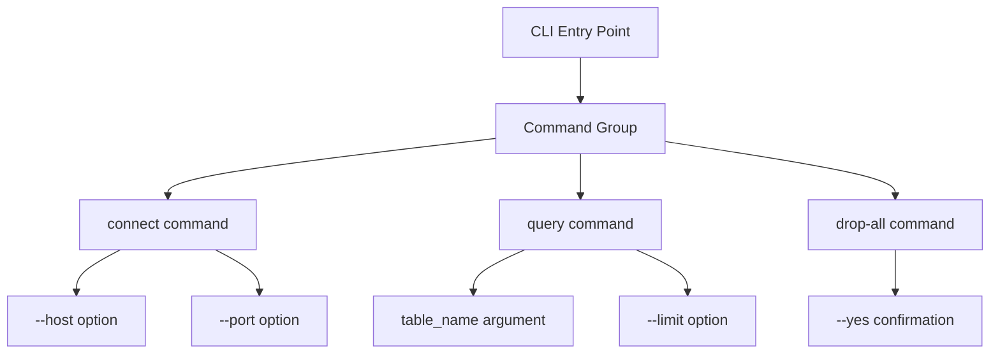

# How to Build CLI Applications with Click in Python

Author: [nawazdhandala](https://www.github.com/nawazdhandala)

Tags: Python, CLI, Click, Developer Tools

Description: Master building elegant command-line applications in Python using Click, from basic commands to complex nested groups with options, arguments, and validation.

---

Building command-line interfaces (CLIs) is a fundamental skill for any Python developer. While Python's built-in `argparse` module gets the job done, Click offers a more intuitive and powerful approach through decorators. In this guide, we will walk through building robust CLI applications with Click, covering everything from simple commands to complex nested command groups.

## Why Choose Click Over argparse?

Click was created by the team behind Flask, and it shows in its design philosophy. Here is what makes it stand out:

- **Decorator-based syntax** that keeps your code clean and readable
- **Automatic help page generation** from docstrings
- **Built-in support for file handling**, including lazy file opening
- **Composable commands** through command groups
- **Type validation** with helpful error messages
- **Testing support** with the CliRunner

## Getting Started

First, install Click using pip:

```bash
pip install click
```

## Your First Click Command

Let's start with the simplest possible CLI application - a greeting command.

```python
# greet.py
import click

# The @click.command() decorator turns a function into a CLI command
@click.command()
# @click.argument() defines a positional argument
@click.argument('name')
def greet(name):
    """Simple program that greets NAME."""
    click.echo(f'Hello, {name}!')

if __name__ == '__main__':
    greet()
```

Running this script produces:

```bash
$ python greet.py World
Hello, World!

$ python greet.py --help
Usage: greet.py [OPTIONS] NAME

  Simple program that greets NAME.

Options:
  --help  Show this message and exit.
```

Notice how Click automatically generated the help text from the docstring.

## Options vs Arguments

Click distinguishes between two types of parameters: arguments and options. Understanding when to use each is crucial for building intuitive CLIs.

```python
# fileprocessor.py
import click

@click.command()
# Arguments are positional and required by default
@click.argument('input_file', type=click.Path(exists=True))
@click.argument('output_file', type=click.Path())
# Options are prefixed with -- and are optional by default
@click.option('--verbose', '-v', is_flag=True, help='Enable verbose output')
@click.option('--format', '-f',
              type=click.Choice(['json', 'csv', 'xml']),
              default='json',
              help='Output format')
@click.option('--count', '-c',
              type=int,
              default=10,
              help='Number of records to process')
def process(input_file, output_file, verbose, format, count):
    """Process INPUT_FILE and write results to OUTPUT_FILE."""
    if verbose:
        click.echo(f'Processing {input_file}...')
        click.echo(f'Output format: {format}')
        click.echo(f'Record limit: {count}')

    # Your processing logic here
    click.echo(f'Results written to {output_file}')

if __name__ == '__main__':
    process()
```

## Building Command Groups

Real-world CLI applications typically have multiple related commands. Click handles this elegantly with command groups.

```python
# dbcli.py
import click

# Create a group to hold related commands
@click.group()
@click.option('--debug/--no-debug', default=False)
@click.pass_context
def cli(ctx, debug):
    """A database management CLI tool."""
    # ctx.obj stores data that can be passed to subcommands
    ctx.ensure_object(dict)
    ctx.obj['DEBUG'] = debug

# Add commands to the group using the @cli.command() decorator
@cli.command()
@click.option('--host', default='localhost', help='Database host')
@click.option('--port', default=5432, help='Database port')
@click.pass_context
def connect(ctx, host, port):
    """Connect to the database."""
    if ctx.obj['DEBUG']:
        click.echo(f'Debug mode is on')
    click.echo(f'Connecting to {host}:{port}...')

@cli.command()
@click.argument('table_name')
@click.option('--limit', '-l', default=100, help='Number of rows')
@click.pass_context
def query(ctx, table_name, limit):
    """Query a table and display results."""
    click.echo(f'Querying {table_name} (limit: {limit})')

@cli.command()
@click.confirmation_option(prompt='Are you sure you want to drop all tables?')
def drop_all():
    """Drop all tables in the database."""
    click.echo('Dropping all tables...')

if __name__ == '__main__':
    cli()
```

Usage examples:

```bash
$ python dbcli.py --help
Usage: dbcli.py [OPTIONS] COMMAND [ARGS]...

  A database management CLI tool.

Options:
  --debug / --no-debug
  --help                Show this message and exit.

Commands:
  connect   Connect to the database.
  drop-all  Drop all tables in the database.
  query     Query a table and display results.

$ python dbcli.py --debug connect --host myserver.com
Debug mode is on
Connecting to myserver.com:5432...
```

## Command Structure Overview

Here is how Click commands and groups work together:



## Input Validation and Custom Types

Click provides built-in types like `INT`, `FLOAT`, `STRING`, `Path`, and `Choice`. You can also create custom types for more complex validation.

```python
# validator.py
import click
import re

# Custom parameter type for email validation
class EmailType(click.ParamType):
    name = 'email'

    def convert(self, value, param, ctx):
        # Simple email regex pattern
        pattern = r'^[a-zA-Z0-9_.+-]+@[a-zA-Z0-9-]+\.[a-zA-Z0-9-.]+$'
        if not re.match(pattern, value):
            self.fail(f'{value} is not a valid email address', param, ctx)
        return value

EMAIL = EmailType()

@click.command()
@click.option('--email', '-e', type=EMAIL, required=True,
              help='User email address')
@click.option('--age', type=click.IntRange(0, 150),
              help='User age (0-150)')
@click.option('--role', type=click.Choice(['admin', 'user', 'guest'],
              case_sensitive=False),
              default='user')
def register(email, age, role):
    """Register a new user with validation."""
    click.echo(f'Registering user: {email}')
    if age:
        click.echo(f'Age: {age}')
    click.echo(f'Role: {role}')

if __name__ == '__main__':
    register()
```

## Working with Files

Click has excellent support for file handling, including stdin/stdout and automatic resource management.

```python
# fileops.py
import click

@click.command()
# click.File handles opening and closing files automatically
# Use '-' to read from stdin or write to stdout
@click.argument('input', type=click.File('r'))
@click.argument('output', type=click.File('w'))
@click.option('--uppercase', '-u', is_flag=True,
              help='Convert to uppercase')
def transform(input, output, uppercase):
    """Transform INPUT file content and write to OUTPUT."""
    for line in input:
        if uppercase:
            line = line.upper()
        output.write(line)
    click.echo('Transformation complete!', err=True)

if __name__ == '__main__':
    transform()
```

Usage with files and piping:

```bash
# Process a file
$ python fileops.py input.txt output.txt --uppercase

# Use stdin and stdout with pipes
$ echo "hello world" | python fileops.py - - --uppercase
HELLO WORLD
```

## Adding Progress Bars

For long-running operations, Click provides a simple way to add progress indicators.

```python
# progress.py
import click
import time

@click.command()
@click.option('--count', default=100, help='Number of items to process')
def process_items(count):
    """Process items with a progress bar."""
    items = range(count)

    # click.progressbar handles the progress display
    with click.progressbar(items, label='Processing') as bar:
        for item in bar:
            # Simulate work
            time.sleep(0.05)

    click.echo('Done!')

if __name__ == '__main__':
    process_items()
```

## Testing Your CLI

Click includes a CliRunner class that makes testing straightforward.

```python
# test_cli.py
from click.testing import CliRunner
from greet import greet

def test_greet():
    runner = CliRunner()

    # Invoke the command with arguments
    result = runner.invoke(greet, ['Alice'])

    # Check the output and exit code
    assert result.exit_code == 0
    assert 'Hello, Alice!' in result.output

def test_greet_help():
    runner = CliRunner()
    result = runner.invoke(greet, ['--help'])

    assert result.exit_code == 0
    assert 'Simple program that greets NAME' in result.output
```

## Packaging Your CLI

To make your CLI installable via pip, add an entry point in your `setup.py` or `pyproject.toml`:

```python
# setup.py
from setuptools import setup

setup(
    name='mycli',
    version='1.0.0',
    py_modules=['mycli'],
    install_requires=[
        'Click',
    ],
    entry_points={
        'console_scripts': [
            'mycli=mycli:cli',  # Maps 'mycli' command to cli function
        ],
    },
)
```

After installation, users can run your CLI directly:

```bash
$ pip install .
$ mycli --help
```

## Conclusion

Click transforms the often tedious task of building CLIs into something enjoyable. Its decorator-based approach keeps your code organized, while features like automatic help generation, file handling, and progress bars handle the boilerplate. Whether you are building a simple utility script or a complex tool with nested subcommands, Click provides the building blocks you need.

Start with simple commands, then gradually add options, validation, and command groups as your tool grows. The composable nature of Click means you can refactor and extend your CLI without rewriting existing code.

For more advanced features, check out the [Click documentation](https://click.palletsprojects.com/), which covers topics like lazy loading of subcommands, shell completion, and custom formatting.
