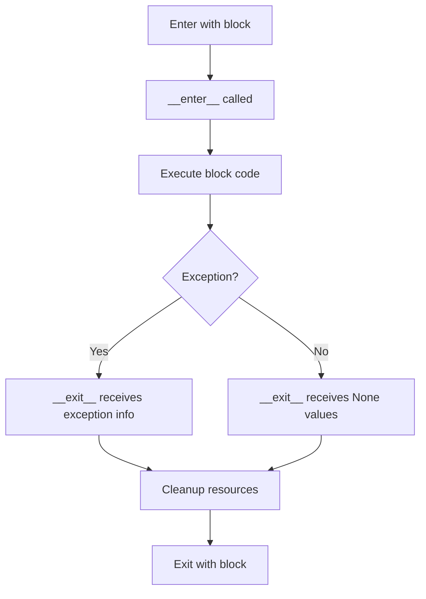

# How to Implement Custom Context Managers in Python

Author: [nawazdhandala](https://www.github.com/nawazdhandala)

Tags: Python, Context Managers, Resource Management, Best Practices, OOP

Description: Create custom context managers in Python using __enter__/__exit__ methods and the contextlib module for proper resource management.

---

Context managers are one of Python's most elegant features for handling resources safely. You have probably used them with files (`with open(...)`), but building your own context managers opens up powerful patterns for database connections, locks, timers, and any resource that needs setup and teardown.

This guide walks through two approaches to creating custom context managers: the class-based method using `__enter__` and `__exit__`, and the decorator-based approach using the `contextlib` module.

## Why Build Custom Context Managers?

Before diving into implementation, consider what problems context managers solve:

- **Guaranteed cleanup**: Resources are released even when exceptions occur
- **Cleaner code**: No need for explicit try/finally blocks everywhere
- **Reusable patterns**: Encapsulate setup/teardown logic once, use it anywhere
- **Self-documenting**: The `with` statement clearly marks resource scope



## The Class-Based Approach

The most flexible way to create a context manager is by implementing a class with `__enter__` and `__exit__` methods.

### Basic Structure

Here is the fundamental pattern every class-based context manager follows:

```python
class MyContextManager:
    def __enter__(self):
        # Setup code runs here
        # Return value becomes the 'as' variable
        return self

    def __exit__(self, exc_type, exc_val, exc_tb):
        # Cleanup code runs here, always
        # Return True to suppress exceptions, False to propagate
        return False
```

### Example: Database Connection Manager

This context manager handles database connections, ensuring connections are always closed and providing automatic rollback on errors:

```python
import sqlite3
from typing import Optional


class DatabaseConnection:
    """Context manager for SQLite database connections with automatic commit/rollback."""

    def __init__(self, db_path: str):
        self.db_path = db_path
        self.connection: Optional[sqlite3.Connection] = None
        self.cursor: Optional[sqlite3.Cursor] = None

    def __enter__(self) -> sqlite3.Cursor:
        # Establish the database connection
        self.connection = sqlite3.connect(self.db_path)
        self.cursor = self.connection.cursor()
        return self.cursor

    def __exit__(self, exc_type, exc_val, exc_tb) -> bool:
        # Handle transaction based on whether an exception occurred
        if exc_type is not None:
            # An exception happened, roll back changes
            self.connection.rollback()
            print(f"Transaction rolled back due to: {exc_val}")
        else:
            # No exception, commit the transaction
            self.connection.commit()

        # Always close resources
        self.cursor.close()
        self.connection.close()

        # Return False to propagate any exceptions
        return False


# Usage example
with DatabaseConnection("myapp.db") as cursor:
    cursor.execute("CREATE TABLE IF NOT EXISTS users (id INTEGER, name TEXT)")
    cursor.execute("INSERT INTO users VALUES (1, 'Alice')")
    # Connection commits automatically when block exits normally
```

### Example: Execution Timer

A practical context manager for measuring code execution time:

```python
import time
from typing import Optional


class Timer:
    """Context manager that measures and reports execution time."""

    def __init__(self, label: str = "Operation"):
        self.label = label
        self.start_time: Optional[float] = None
        self.elapsed: Optional[float] = None

    def __enter__(self) -> "Timer":
        # Record the start time
        self.start_time = time.perf_counter()
        return self

    def __exit__(self, exc_type, exc_val, exc_tb) -> bool:
        # Calculate elapsed time
        self.elapsed = time.perf_counter() - self.start_time

        # Report the timing
        status = "completed" if exc_type is None else "failed"
        print(f"{self.label} {status} in {self.elapsed:.4f} seconds")

        return False


# Usage with access to elapsed time
with Timer("Data processing") as t:
    # Simulate some work
    total = sum(range(1_000_000))

print(f"Exact time: {t.elapsed}")
```

## The contextlib Approach

For simpler cases, Python's `contextlib` module provides decorators that let you write context managers as generator functions. This approach requires less boilerplate.

### Using @contextmanager

The `@contextmanager` decorator converts a generator function into a context manager. Everything before `yield` is your setup, and everything after is your cleanup:

```python
from contextlib import contextmanager


@contextmanager
def temporary_directory():
    """Create a temporary directory that gets cleaned up automatically."""
    import tempfile
    import shutil

    # Setup: create the directory
    dirpath = tempfile.mkdtemp()
    print(f"Created temp directory: {dirpath}")

    try:
        # Yield control to the with block
        yield dirpath
    finally:
        # Cleanup: remove the directory and its contents
        shutil.rmtree(dirpath)
        print(f"Removed temp directory: {dirpath}")


# Usage
with temporary_directory() as tmpdir:
    # Work with the temporary directory
    filepath = f"{tmpdir}/data.txt"
    with open(filepath, "w") as f:
        f.write("temporary data")
```

### Example: Working Directory Changer

This context manager temporarily changes the working directory and restores it afterward:

```python
from contextlib import contextmanager
import os


@contextmanager
def working_directory(path: str):
    """Temporarily change the working directory."""
    # Save the current directory
    original_dir = os.getcwd()

    try:
        # Change to the target directory
        os.chdir(path)
        yield path
    finally:
        # Always restore the original directory
        os.chdir(original_dir)


# Usage
print(f"Current: {os.getcwd()}")

with working_directory("/tmp"):
    print(f"Inside with: {os.getcwd()}")
    # Do work in /tmp

print(f"After: {os.getcwd()}")  # Back to original
```

### Example: Suppressing Specific Exceptions

A context manager that catches and logs specific exceptions without crashing:

```python
from contextlib import contextmanager
from typing import Type, Tuple
import logging


logging.basicConfig(level=logging.WARNING)


@contextmanager
def suppress_and_log(*exceptions: Type[BaseException]):
    """Suppress specified exceptions and log them as warnings."""
    try:
        yield
    except exceptions as e:
        # Log the exception but do not re-raise
        logging.warning(f"Suppressed {type(e).__name__}: {e}")


# Usage
with suppress_and_log(FileNotFoundError, PermissionError):
    # This will not crash the program
    with open("/nonexistent/file.txt") as f:
        data = f.read()

print("Program continues normally")
```

## Advanced Patterns

### Reentrant Context Managers

Sometimes you need a context manager that can be entered multiple times. Here is a connection pool example:

```python
from contextlib import contextmanager
from typing import List, Any
import threading


class ConnectionPool:
    """A simple thread-safe connection pool."""

    def __init__(self, max_connections: int = 5):
        self.max_connections = max_connections
        self.pool: List[Any] = []
        self.lock = threading.Lock()

        # Pre-create connections
        for i in range(max_connections):
            self.pool.append(self._create_connection(i))

    def _create_connection(self, conn_id: int) -> dict:
        # Simulate a connection object
        return {"id": conn_id, "active": True}

    @contextmanager
    def get_connection(self):
        """Get a connection from the pool, return it when done."""
        connection = None

        with self.lock:
            if self.pool:
                connection = self.pool.pop()

        if connection is None:
            raise RuntimeError("No connections available")

        try:
            yield connection
        finally:
            # Return connection to the pool
            with self.lock:
                self.pool.append(connection)


# Usage
pool = ConnectionPool(max_connections=3)

with pool.get_connection() as conn:
    print(f"Using connection {conn['id']}")
    # Do database work
```

### Combining Multiple Context Managers

Python 3.10 and later supports cleaner syntax for multiple context managers:

```python
# Python 3.10+ syntax with parentheses
with (
    open("input.txt") as infile,
    open("output.txt", "w") as outfile,
    Timer("File copy") as timer,
):
    outfile.write(infile.read())
```

For earlier versions or dynamic contexts, use `contextlib.ExitStack`:

```python
from contextlib import ExitStack


def process_multiple_files(filenames: list):
    """Open and process multiple files safely."""
    with ExitStack() as stack:
        # Dynamically open all files
        files = [
            stack.enter_context(open(fname))
            for fname in filenames
        ]

        # Process all files
        for f in files:
            print(f.readline())

        # All files close automatically when exiting
```

## When to Use Each Approach

Choose the **class-based approach** when you need:

- Complex state management across enter and exit
- Access to exception details for custom handling
- A reusable object with additional methods
- Fine-grained control over exception suppression

Choose the **contextlib approach** when you need:

- Simple setup and teardown logic
- Quick prototyping
- Stateless or minimal state management
- Cleaner, more readable code for straightforward cases

## Common Pitfalls to Avoid

**Do not forget the try/finally in generator-based managers.** Without it, cleanup code will not run if an exception occurs:

```python
# Wrong - cleanup may not happen
@contextmanager
def bad_example():
    resource = acquire_resource()
    yield resource
    release_resource(resource)  # Skipped on exception!

# Correct - cleanup always happens
@contextmanager
def good_example():
    resource = acquire_resource()
    try:
        yield resource
    finally:
        release_resource(resource)
```

**Do not suppress exceptions by accident.** Returning `True` from `__exit__` suppresses exceptions, which can hide bugs:

```python
def __exit__(self, exc_type, exc_val, exc_tb):
    self.cleanup()
    return True  # Dangerous! All exceptions are silently swallowed
```

## Wrapping Up

Custom context managers are a powerful tool for writing clean, safe Python code. The class-based approach gives you full control over setup, teardown, and exception handling, while `contextlib` offers a more concise syntax for simpler cases.

Start by identifying repetitive try/finally patterns in your code. Each one is a candidate for a custom context manager that will make your code more readable and less error-prone.
