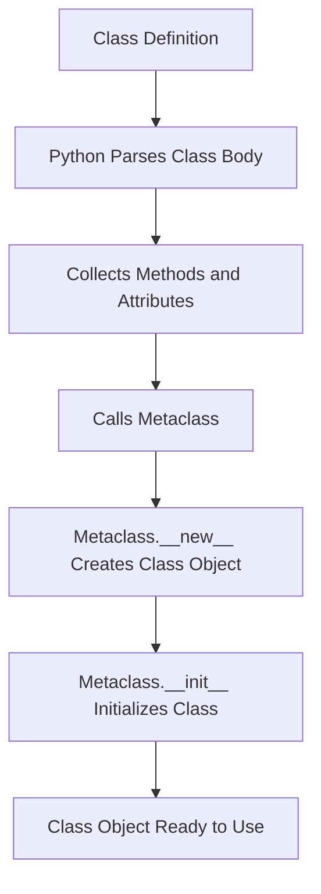

# How to Create Metaclasses in Python

Author: [nawazdhandala](https://www.github.com/nawazdhandala)

Tags: Python, Metaclasses, OOP, Advanced Python, Metaprogramming

Description: Master Python metaclasses for class creation control, automatic registration, singleton patterns, and API enforcement at the class level.

---

> Metaclasses are one of Python's most powerful features, yet they remain mysterious to many developers. Once you understand them, you gain the ability to customize how classes themselves are created, opening doors to elegant solutions for plugin systems, ORMs, and API enforcement.

In Python, everything is an object, including classes. When you define a class, Python creates an object that represents that class. The thing that creates class objects is called a metaclass. By default, Python uses `type` as the metaclass for all classes, but you can create your own metaclasses to customize class creation.

---

## Understanding the Class Creation Process

Before diving into metaclasses, let's understand how Python creates classes.



When you write `class Foo:`, Python executes the class body and then calls the metaclass to create the actual class object. This is where you can intercept and modify the class creation process.

---

## The Basics: type as a Metaclass

The built-in `type` function serves dual purposes: checking types and creating new classes dynamically.

```python
# metaclass_basics.py
# Demonstrating how type creates classes dynamically

# Normal class definition
class Dog:
    def bark(self):
        return "Woof!"

# Equivalent using type(name, bases, dict)
def bark(self):
    return "Woof!"

# Create the same class dynamically using type
DynamicDog = type('DynamicDog', (), {'bark': bark})

# Both work identically
dog1 = Dog()
dog2 = DynamicDog()
print(dog1.bark())  # Output: Woof!
print(dog2.bark())  # Output: Woof!

# Verify that type is the metaclass
print(type(Dog))        # Output: <class 'type'>
print(type(DynamicDog)) # Output: <class 'type'>
```

---

## Creating Your First Metaclass

A metaclass is simply a class that inherits from `type`. You override `__new__` or `__init__` to customize class creation.

```python
# simple_metaclass.py
# A metaclass that prints when classes are created

class LoggingMeta(type):
    """Metaclass that logs class creation"""

    def __new__(mcs, name, bases, namespace):
        # mcs is the metaclass (LoggingMeta)
        # name is the class name being created
        # bases is the tuple of base classes
        # namespace is the dict of class attributes and methods

        print(f"Creating class: {name}")
        print(f"  Base classes: {bases}")
        print(f"  Attributes: {list(namespace.keys())}")

        # Call type.__new__ to actually create the class
        cls = super().__new__(mcs, name, bases, namespace)
        return cls

# Use the metaclass
class Animal(metaclass=LoggingMeta):
    def speak(self):
        pass

class Dog(Animal):
    def speak(self):
        return "Woof!"

# Output when this code runs:
# Creating class: Animal
#   Base classes: ()
#   Attributes: ['__module__', '__qualname__', 'speak']
# Creating class: Dog
#   Base classes: (<class '__main__.Animal'>,)
#   Attributes: ['__module__', '__qualname__', 'speak']
```

---

## Practical Use Case: Automatic Class Registration

One of the most common uses for metaclasses is building plugin systems where classes register themselves automatically.

```python
# registry_metaclass.py
# Metaclass for automatic plugin registration

class PluginRegistry(type):
    """Metaclass that registers all subclasses in a central registry"""

    # Class-level registry shared by all classes using this metaclass
    _registry = {}

    def __new__(mcs, name, bases, namespace):
        cls = super().__new__(mcs, name, bases, namespace)

        # Skip registration of the base class itself
        if bases:  # Only register subclasses, not the base
            # Use the class name as the key, or a custom name if provided
            register_name = namespace.get('name', name.lower())
            mcs._registry[register_name] = cls
            print(f"Registered plugin: {register_name}")

        return cls

    @classmethod
    def get_plugin(mcs, name):
        """Retrieve a registered plugin by name"""
        return mcs._registry.get(name)

    @classmethod
    def list_plugins(mcs):
        """List all registered plugins"""
        return list(mcs._registry.keys())


# Base class for all plugins
class Plugin(metaclass=PluginRegistry):
    """Base class for plugins - not registered itself"""

    def execute(self):
        raise NotImplementedError


# These classes register automatically when defined
class JSONExporter(Plugin):
    name = "json"  # Custom registration name

    def execute(self):
        return "Exporting as JSON..."


class XMLExporter(Plugin):
    name = "xml"

    def execute(self):
        return "Exporting as XML..."


class CSVExporter(Plugin):
    # No custom name, uses class name lowercased
    def execute(self):
        return "Exporting as CSV..."


# Usage: dynamically load plugins by name
def export_data(format_name):
    plugin_class = PluginRegistry.get_plugin(format_name)
    if plugin_class:
        exporter = plugin_class()
        return exporter.execute()
    raise ValueError(f"Unknown format: {format_name}")

print(PluginRegistry.list_plugins())  # ['json', 'xml', 'csvexporter']
print(export_data("json"))            # Exporting as JSON...
```

---

## Enforcing API Contracts with Metaclasses

Metaclasses can validate that subclasses implement required methods or attributes.

```python
# interface_metaclass.py
# Metaclass that enforces interface contracts

class InterfaceMeta(type):
    """Metaclass that ensures subclasses implement required methods"""

    # Define required methods at the metaclass level
    required_methods = []

    def __new__(mcs, name, bases, namespace):
        cls = super().__new__(mcs, name, bases, namespace)

        # Skip validation for the base interface class
        if bases and hasattr(cls, 'required_methods'):
            missing = []

            for method in cls.required_methods:
                # Check if method exists and is callable
                if not callable(getattr(cls, method, None)):
                    missing.append(method)

            if missing:
                raise TypeError(
                    f"Class '{name}' must implement: {', '.join(missing)}"
                )

        return cls


class Repository(metaclass=InterfaceMeta):
    """Base repository interface - subclasses must implement these methods"""
    required_methods = ['save', 'find', 'delete']


class UserRepository(Repository):
    """Concrete implementation - must have save, find, and delete"""

    def save(self, user):
        print(f"Saving user: {user}")

    def find(self, user_id):
        print(f"Finding user: {user_id}")
        return {"id": user_id, "name": "John"}

    def delete(self, user_id):
        print(f"Deleting user: {user_id}")


# This would raise TypeError: Class 'BrokenRepository' must implement: delete
# class BrokenRepository(Repository):
#     def save(self, item):
#         pass
#     def find(self, id):
#         pass
#     # Missing delete method!
```

---

## The Singleton Pattern with Metaclasses

Metaclasses provide a clean way to implement the singleton pattern without modifying the class itself.

```python
# singleton_metaclass.py
# Implementing singleton pattern via metaclass

class SingletonMeta(type):
    """Metaclass that ensures only one instance of a class exists"""

    # Store instances keyed by class
    _instances = {}

    def __call__(cls, *args, **kwargs):
        # __call__ is invoked when you do ClassName()
        # This happens AFTER the class is created

        if cls not in cls._instances:
            # First instantiation - create the instance normally
            instance = super().__call__(*args, **kwargs)
            cls._instances[cls] = instance

        return cls._instances[cls]


class DatabaseConnection(metaclass=SingletonMeta):
    """Database connection that should only exist once"""

    def __init__(self, host="localhost", port=5432):
        # __init__ only runs once due to the metaclass
        self.host = host
        self.port = port
        self.connected = False
        print(f"Initializing connection to {host}:{port}")

    def connect(self):
        if not self.connected:
            print("Establishing connection...")
            self.connected = True
        return self


# Both variables reference the same instance
db1 = DatabaseConnection("prod-db.example.com", 5432)
db2 = DatabaseConnection()  # __init__ args ignored, returns existing instance

print(db1 is db2)  # Output: True
print(db2.host)    # Output: prod-db.example.com (from first instantiation)
```

---

## Adding Methods and Attributes Dynamically

Metaclasses can inject methods or attributes into classes at creation time.

```python
# injection_metaclass.py
# Metaclass that adds timestamps to all instances

from datetime import datetime

class TimestampMeta(type):
    """Metaclass that adds automatic timestamp tracking"""

    def __new__(mcs, name, bases, namespace):
        # Store the original __init__ if it exists
        original_init = namespace.get('__init__')

        def new_init(self, *args, **kwargs):
            # Add timestamps before calling original init
            self.created_at = datetime.utcnow()
            self.updated_at = datetime.utcnow()

            # Call original __init__ if it exists
            if original_init:
                original_init(self, *args, **kwargs)

        def touch(self):
            """Update the updated_at timestamp"""
            self.updated_at = datetime.utcnow()

        # Inject the modified __init__ and new method
        namespace['__init__'] = new_init
        namespace['touch'] = touch

        return super().__new__(mcs, name, bases, namespace)


class Document(metaclass=TimestampMeta):
    """Documents automatically get created_at and updated_at"""

    def __init__(self, title, content):
        self.title = title
        self.content = content


doc = Document("Hello", "World")
print(f"Created: {doc.created_at}")   # Automatically set
print(f"Updated: {doc.updated_at}")

doc.touch()  # Method was injected by metaclass
print(f"After touch: {doc.updated_at}")
```

---

## Using __init_subclass__ as a Simpler Alternative

Python 3.6 introduced `__init_subclass__`, which covers many metaclass use cases with simpler syntax.

```python
# init_subclass_example.py
# Simpler alternative to metaclasses for many use cases

class Plugin:
    """Base class using __init_subclass__ for registration"""

    _registry = {}

    def __init_subclass__(cls, name=None, **kwargs):
        super().__init_subclass__(**kwargs)
        # Register the subclass when it's defined
        register_name = name or cls.__name__.lower()
        Plugin._registry[register_name] = cls
        print(f"Registered: {register_name}")

    @classmethod
    def get(cls, name):
        return cls._registry.get(name)


# Subclasses are registered automatically
class JSONPlugin(Plugin, name="json"):
    pass

class XMLPlugin(Plugin, name="xml"):
    pass

print(Plugin._registry)  # {'json': <class 'JSONPlugin'>, 'xml': <class 'XMLPlugin'>}
```

For simple registration patterns, `__init_subclass__` is often cleaner than a full metaclass. Use metaclasses when you need more control over the class creation process itself.

---

## When to Use Metaclasses

Metaclasses are powerful but should be used sparingly. Consider using them for:

- **Plugin/Extension Systems**: Automatic registration of subclasses
- **ORM Frameworks**: Mapping classes to database tables (like Django models)
- **API Enforcement**: Ensuring subclasses implement required interfaces
- **Singleton Patterns**: Controlling instance creation
- **Attribute Validation**: Checking class-level constraints at definition time

Avoid metaclasses when simpler alternatives work:

- Class decorators for adding behavior to a single class
- `__init_subclass__` for basic subclass customization
- Descriptors for attribute-level control

---

## Conclusion

Metaclasses give you control over how classes are created in Python. While they can seem complex at first, they follow a logical pattern: intercept class creation, modify as needed, and return the class. Start with simple logging metaclasses to understand the flow, then progress to practical applications like registries and interface enforcement.

The key insight is that classes are objects created by metaclasses, just as instances are objects created by classes. Once this clicks, metaclasses become another tool in your Python toolkit rather than a mysterious black box.

---

*Building complex Python applications? [OneUptime](https://oneuptime.com) provides comprehensive observability for your Python services, with automatic tracing and metric collection via OpenTelemetry.*

**Related Reading:**
- [How to Implement Custom Descriptors in Python](https://oneuptime.com/blog/post/2026-01-30-how-to-implement-custom-descriptors-in-python/view)
- [How to Build Plugin Systems in Python](https://oneuptime.com/blog/post/2026-01-30-python-plugin-systems/view)
