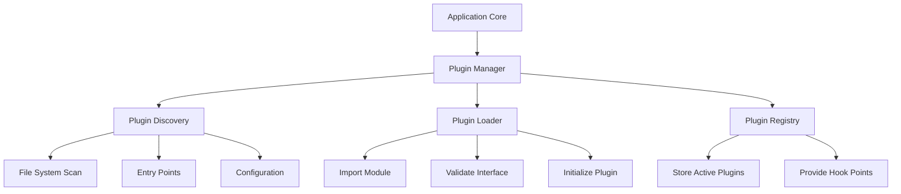
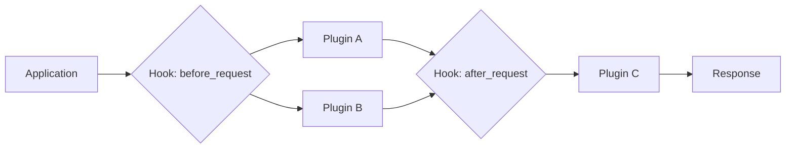

# How to Build Plugin Systems in Python

Author: [nawazdhandala](https://www.github.com/nawazdhandala)

Tags: Python, Plugins, Architecture, Extensibility, Design Patterns

Description: Design flexible plugin systems in Python with dynamic loading, discovery mechanisms, hooks, and lifecycle management for extensible applications.

---

> Plugin systems transform rigid applications into flexible platforms. Whether you are building a CLI tool, a web framework, or a data pipeline, understanding how to design extensible architectures will make your software more adaptable and maintainable.

A well-designed plugin system allows third parties to extend your application without modifying its core code. Python's dynamic nature makes it particularly well-suited for building plugin architectures. In this guide, we will explore several approaches to building plugin systems, from simple to sophisticated.

---

## Plugin System Architecture Overview

Before writing code, let's understand the key components of a plugin system.



The plugin manager coordinates discovery, loading, and registration. Plugins register themselves through a consistent interface, and the application invokes plugins through well-defined hook points.

---

## Approach 1: Simple Interface-Based Plugins

The most straightforward approach uses abstract base classes to define a plugin contract.

```python
# plugin_base.py
# Define the interface all plugins must implement

from abc import ABC, abstractmethod
from typing import Any, Dict

class PluginInterface(ABC):
    """Base class that all plugins must inherit from"""

    @property
    @abstractmethod
    def name(self) -> str:
        """Return the plugin's unique identifier"""
        pass

    @property
    @abstractmethod
    def version(self) -> str:
        """Return the plugin's version string"""
        pass

    @abstractmethod
    def initialize(self, config: Dict[str, Any]) -> None:
        """Called when the plugin is loaded"""
        pass

    @abstractmethod
    def execute(self, context: Dict[str, Any]) -> Any:
        """Main execution method"""
        pass

    def cleanup(self) -> None:
        """Optional cleanup when plugin is unloaded"""
        pass
```

Now create a plugin that implements this interface.

```python
# plugins/json_exporter.py
# A concrete plugin implementation

from plugin_base import PluginInterface
from typing import Any, Dict
import json

class JSONExporterPlugin(PluginInterface):
    """Plugin that exports data to JSON format"""

    @property
    def name(self) -> str:
        return "json_exporter"

    @property
    def version(self) -> str:
        return "1.0.0"

    def initialize(self, config: Dict[str, Any]) -> None:
        # Store configuration for later use
        self.indent = config.get("indent", 2)
        self.output_dir = config.get("output_dir", "./output")
        print(f"JSONExporter initialized with indent={self.indent}")

    def execute(self, context: Dict[str, Any]) -> str:
        # Export the data to JSON
        data = context.get("data", {})
        return json.dumps(data, indent=self.indent)

    def cleanup(self) -> None:
        print("JSONExporter cleanup complete")


# This is the hook for plugin discovery
# The plugin manager looks for this attribute
plugin_class = JSONExporterPlugin
```

---

## Approach 2: Dynamic Discovery with importlib

For applications that need to discover plugins at runtime, we can scan directories and load modules dynamically.

```python
# plugin_manager.py
# Handles plugin discovery, loading, and lifecycle

import importlib.util
import os
from pathlib import Path
from typing import Dict, List, Optional, Type
from plugin_base import PluginInterface

class PluginManager:
    """Manages plugin discovery, loading, and execution"""

    def __init__(self, plugin_dirs: List[str]):
        # Directories to scan for plugins
        self.plugin_dirs = [Path(d) for d in plugin_dirs]
        # Registry of loaded plugins keyed by name
        self._plugins: Dict[str, PluginInterface] = {}
        # Track plugin classes for reloading
        self._plugin_classes: Dict[str, Type[PluginInterface]] = {}

    def discover_plugins(self) -> List[str]:
        """Scan plugin directories and return list of discovered plugin paths"""
        discovered = []

        for plugin_dir in self.plugin_dirs:
            if not plugin_dir.exists():
                continue

            # Look for Python files in the plugin directory
            for file_path in plugin_dir.glob("*.py"):
                # Skip __init__.py and private modules
                if file_path.name.startswith("_"):
                    continue
                discovered.append(str(file_path))

        return discovered

    def load_plugin(self, plugin_path: str, config: Dict = None) -> Optional[str]:
        """Load a single plugin from a file path"""
        config = config or {}
        path = Path(plugin_path)
        module_name = path.stem

        try:
            # Load the module dynamically using importlib
            spec = importlib.util.spec_from_file_location(module_name, path)
            if spec is None or spec.loader is None:
                print(f"Could not load spec for {plugin_path}")
                return None

            module = importlib.util.module_from_spec(spec)
            spec.loader.exec_module(module)

            # Look for the plugin_class attribute
            if not hasattr(module, "plugin_class"):
                print(f"No plugin_class found in {plugin_path}")
                return None

            plugin_class = module.plugin_class

            # Validate it implements our interface
            if not issubclass(plugin_class, PluginInterface):
                print(f"Plugin {plugin_path} does not implement PluginInterface")
                return None

            # Instantiate and initialize the plugin
            plugin_instance = plugin_class()
            plugin_instance.initialize(config)

            # Register the plugin
            plugin_name = plugin_instance.name
            self._plugins[plugin_name] = plugin_instance
            self._plugin_classes[plugin_name] = plugin_class

            print(f"Loaded plugin: {plugin_name} v{plugin_instance.version}")
            return plugin_name

        except Exception as e:
            print(f"Error loading plugin {plugin_path}: {e}")
            return None

    def load_all_plugins(self, config: Dict = None) -> List[str]:
        """Discover and load all plugins"""
        loaded = []
        for plugin_path in self.discover_plugins():
            plugin_name = self.load_plugin(plugin_path, config)
            if plugin_name:
                loaded.append(plugin_name)
        return loaded

    def get_plugin(self, name: str) -> Optional[PluginInterface]:
        """Get a loaded plugin by name"""
        return self._plugins.get(name)

    def list_plugins(self) -> List[str]:
        """List all loaded plugin names"""
        return list(self._plugins.keys())

    def unload_plugin(self, name: str) -> bool:
        """Unload a plugin and call its cleanup method"""
        if name not in self._plugins:
            return False

        plugin = self._plugins[name]
        plugin.cleanup()
        del self._plugins[name]
        del self._plugin_classes[name]
        return True

    def execute_plugin(self, name: str, context: Dict) -> any:
        """Execute a specific plugin"""
        plugin = self.get_plugin(name)
        if plugin is None:
            raise ValueError(f"Plugin not found: {name}")
        return plugin.execute(context)
```

---

## Approach 3: Entry Points for Package-Based Plugins

For distributable plugins, Python's entry points system (via setuptools) provides a clean mechanism for plugin registration.

```python
# Using entry points from setup.py or pyproject.toml
# This allows plugins to be installed as separate packages

# In the plugin package's pyproject.toml:
# [project.entry-points."myapp.plugins"]
# json_exporter = "myapp_json_plugin:JSONExporterPlugin"

# entry_point_manager.py
# Load plugins registered via entry points

from importlib.metadata import entry_points
from typing import Dict, List
from plugin_base import PluginInterface

class EntryPointPluginManager:
    """Load plugins registered via package entry points"""

    # The entry point group name for our plugins
    ENTRY_POINT_GROUP = "myapp.plugins"

    def __init__(self):
        self._plugins: Dict[str, PluginInterface] = {}

    def discover_plugins(self) -> List[str]:
        """Find all plugins registered under our entry point group"""
        discovered = []

        # Get all entry points in our group
        # Python 3.10+ syntax
        eps = entry_points(group=self.ENTRY_POINT_GROUP)

        for ep in eps:
            discovered.append(ep.name)

        return discovered

    def load_plugin(self, name: str, config: Dict = None) -> bool:
        """Load a plugin by its entry point name"""
        config = config or {}

        eps = entry_points(group=self.ENTRY_POINT_GROUP)

        # Find the matching entry point
        for ep in eps:
            if ep.name == name:
                # Load the plugin class
                plugin_class = ep.load()

                # Instantiate and initialize
                plugin = plugin_class()
                plugin.initialize(config)

                self._plugins[name] = plugin
                return True

        return False

    def load_all_plugins(self, config: Dict = None) -> List[str]:
        """Load all discovered plugins"""
        loaded = []
        for name in self.discover_plugins():
            if self.load_plugin(name, config):
                loaded.append(name)
        return loaded
```

---

## Approach 4: Hook-Based Plugin System

For more complex applications, a hook system allows plugins to subscribe to specific events.



```python
# hooks.py
# A flexible hook system for plugin integration

from typing import Any, Callable, Dict, List
from functools import wraps

class HookRegistry:
    """Central registry for plugin hooks"""

    def __init__(self):
        # Hooks keyed by name, each containing list of callbacks
        self._hooks: Dict[str, List[Callable]] = {}
        # Priority ordering for each hook
        self._priorities: Dict[str, List[int]] = {}

    def register(self, hook_name: str, callback: Callable, priority: int = 50):
        """Register a callback for a specific hook

        Args:
            hook_name: The name of the hook to register for
            callback: Function to call when hook is triggered
            priority: Execution order (lower = earlier, default 50)
        """
        if hook_name not in self._hooks:
            self._hooks[hook_name] = []
            self._priorities[hook_name] = []

        # Insert maintaining priority order
        callbacks = self._hooks[hook_name]
        priorities = self._priorities[hook_name]

        # Find insertion point
        insert_idx = 0
        for i, p in enumerate(priorities):
            if priority < p:
                break
            insert_idx = i + 1

        callbacks.insert(insert_idx, callback)
        priorities.insert(insert_idx, priority)

    def trigger(self, hook_name: str, *args, **kwargs) -> List[Any]:
        """Trigger a hook and collect results from all registered callbacks"""
        results = []

        if hook_name in self._hooks:
            for callback in self._hooks[hook_name]:
                result = callback(*args, **kwargs)
                results.append(result)

        return results

    def trigger_chain(self, hook_name: str, initial_value: Any) -> Any:
        """Trigger a hook where each callback transforms the value"""
        value = initial_value

        if hook_name in self._hooks:
            for callback in self._hooks[hook_name]:
                value = callback(value)

        return value


# Global hook registry
hooks = HookRegistry()


def hook(hook_name: str, priority: int = 50):
    """Decorator to register a function as a hook handler"""
    def decorator(func: Callable) -> Callable:
        hooks.register(hook_name, func, priority)
        return func
    return decorator


# Example plugin using hooks
class LoggingPlugin:
    """Plugin that logs requests using hooks"""

    def __init__(self, hook_registry: HookRegistry):
        self.registry = hook_registry
        self._register_hooks()

    def _register_hooks(self):
        # Register for multiple hooks with different priorities
        self.registry.register("before_request", self.log_request, priority=10)
        self.registry.register("after_request", self.log_response, priority=90)

    def log_request(self, request: Dict) -> None:
        print(f"[LOG] Incoming request: {request.get('path')}")

    def log_response(self, response: Dict) -> Dict:
        print(f"[LOG] Response status: {response.get('status')}")
        return response


# Using the hook system in your application
def handle_request(request: Dict) -> Dict:
    """Example request handler using hooks"""

    # Trigger before_request hooks
    hooks.trigger("before_request", request)

    # Process the request
    response = {"status": 200, "body": "Hello, World!"}

    # Trigger after_request hooks (chained transformation)
    response = hooks.trigger_chain("after_request", response)

    return response
```

---

## Plugin Lifecycle Management

Production plugin systems need proper lifecycle management for initialization, health checks, and cleanup.

```python
# lifecycle.py
# Managing plugin states and lifecycle events

from enum import Enum
from typing import Dict, Optional
from datetime import datetime

class PluginState(Enum):
    """Possible states for a plugin"""
    DISCOVERED = "discovered"
    LOADING = "loading"
    ACTIVE = "active"
    ERROR = "error"
    DISABLED = "disabled"
    UNLOADING = "unloading"

class PluginLifecycle:
    """Tracks and manages plugin lifecycle"""

    def __init__(self, plugin_name: str):
        self.name = plugin_name
        self.state = PluginState.DISCOVERED
        self.loaded_at: Optional[datetime] = None
        self.error_message: Optional[str] = None
        self.execution_count = 0
        self.last_executed: Optional[datetime] = None

    def transition_to(self, new_state: PluginState, error: str = None):
        """Transition to a new state with validation"""
        # Define valid transitions
        valid_transitions = {
            PluginState.DISCOVERED: [PluginState.LOADING, PluginState.DISABLED],
            PluginState.LOADING: [PluginState.ACTIVE, PluginState.ERROR],
            PluginState.ACTIVE: [PluginState.UNLOADING, PluginState.ERROR, PluginState.DISABLED],
            PluginState.ERROR: [PluginState.LOADING, PluginState.DISABLED],
            PluginState.DISABLED: [PluginState.LOADING],
            PluginState.UNLOADING: [PluginState.DISCOVERED],
        }

        if new_state not in valid_transitions.get(self.state, []):
            raise ValueError(
                f"Invalid transition from {self.state} to {new_state}"
            )

        self.state = new_state

        if new_state == PluginState.ACTIVE:
            self.loaded_at = datetime.utcnow()
        elif new_state == PluginState.ERROR:
            self.error_message = error

    def record_execution(self):
        """Record that the plugin was executed"""
        self.execution_count += 1
        self.last_executed = datetime.utcnow()

    def get_status(self) -> Dict:
        """Return current plugin status"""
        return {
            "name": self.name,
            "state": self.state.value,
            "loaded_at": self.loaded_at.isoformat() if self.loaded_at else None,
            "execution_count": self.execution_count,
            "last_executed": self.last_executed.isoformat() if self.last_executed else None,
            "error": self.error_message,
        }
```

---

## Best Practices for Plugin Systems

When building plugin systems, keep these principles in mind:

1. **Define clear interfaces** - Use abstract base classes or protocols to specify what plugins must implement
2. **Isolate plugin failures** - Wrap plugin execution in try/except blocks so one bad plugin does not crash your application
3. **Version your plugin API** - Include API version checks so plugins built for older versions fail gracefully
4. **Document hook points** - Make it easy for plugin authors to understand where they can integrate
5. **Provide configuration validation** - Check plugin configs early and give helpful error messages

---

## Conclusion

Python offers multiple approaches for building plugin systems, from simple interface-based designs to sophisticated hook registries. The right choice depends on your application's needs. Start simple with interface-based plugins if you control all the plugin code. Move to entry points when you need third-party distribution. Add a hook system when plugins need to interact with multiple stages of your application's workflow.

The examples in this guide provide a foundation you can adapt for your specific use case. Remember that the best plugin system is one that your users can understand and extend without diving deep into your application's internals.

---

*Building extensible Python applications? [OneUptime](https://oneuptime.com) provides comprehensive monitoring and observability for your Python services, with OpenTelemetry integration to trace requests across your plugin architecture.*

**Related Reading:**
- [How to Create Metaclasses in Python](https://oneuptime.com/blog/post/2026-01-30-python-metaclasses/view)
- [How to Implement Custom Descriptors in Python](https://oneuptime.com/blog/post/2026-01-30-how-to-implement-custom-descriptors-in-python/view)
