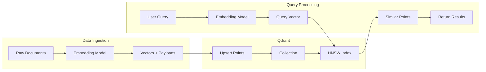
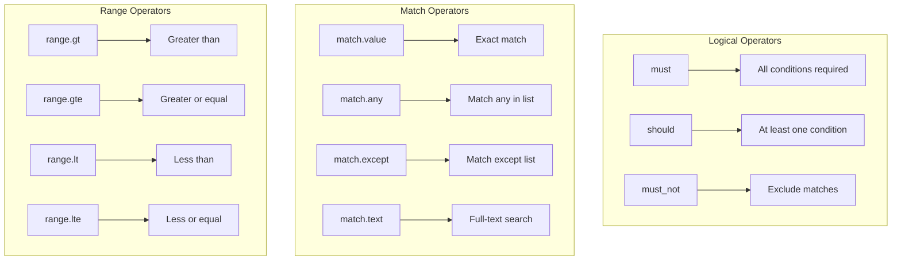
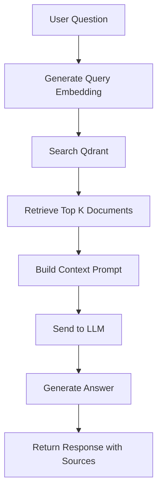

# How to Implement Qdrant Integration

Author: [nawazdhandala](https://github.com/nawazdhandala)

Tags: Vector Database, Qdrant, AI, RAG

Description: A comprehensive guide to integrating Qdrant vector database for semantic search, recommendation engines, and retrieval-augmented generation (RAG) applications.

---

Qdrant is an open-source vector database built for high-performance similarity search. Unlike managed services, Qdrant gives you the flexibility to self-host while providing features like filtering, payload storage, and distributed deployment out of the box.

This guide covers everything from basic setup to production-ready patterns for building AI-powered applications with Qdrant.

## Why Choose Qdrant?

Here is when Qdrant stands out:

| Use Case | How Qdrant Helps |
|----------|------------------|
| Semantic search | Find similar documents using vector embeddings |
| Recommendation systems | Surface related content based on user behavior |
| RAG pipelines | Retrieve context for LLM-powered applications |
| Image search | Find visually similar images using vision model embeddings |
| Anomaly detection | Identify outliers in high-dimensional data |
| Self-hosted requirements | Run on your own infrastructure with full control |

Qdrant offers several advantages over alternatives:
- Open source with no vendor lock-in
- Rust-based core for performance and memory efficiency
- Rich filtering capabilities with payload indexing
- Built-in clustering and replication
- REST and gRPC APIs

---

## Architecture Overview

Here is how Qdrant fits into a typical application:



The workflow follows a simple pattern:
1. Convert your data into vectors using an embedding model
2. Store vectors as "points" in a Qdrant collection
3. Query by converting search text to a vector and finding nearest neighbors

---

## Setting Up Qdrant

### Running Qdrant Locally

Start Qdrant using Docker for local development.

```bash
# Pull and run the Qdrant container
# Port 6333 is for REST API, 6334 is for gRPC
docker run -p 6333:6333 -p 6334:6334 \
    -v $(pwd)/qdrant_storage:/qdrant/storage \
    qdrant/qdrant
```

For persistent storage in production, mount a volume to `/qdrant/storage`.

### Installation

Install the Qdrant client library for your language.

```bash
npm install @qdrant/js-client-rest
```

For Python projects:

```bash
pip install qdrant-client
```

### Initialize the Client

Create a reusable client instance.

```typescript
// qdrant.ts
import { QdrantClient } from '@qdrant/js-client-rest';

// Initialize the Qdrant client
// For local development, use localhost:6333
// For production, use your Qdrant cluster URL
const qdrant = new QdrantClient({
  url: process.env.QDRANT_URL || 'http://localhost:6333',
  // Optional: API key for Qdrant Cloud or secured instances
  apiKey: process.env.QDRANT_API_KEY,
});

export default qdrant;
```

---

## Creating Collections

Collections are containers for your vectors. Each collection has a fixed vector dimension and distance metric.

```typescript
// create-collection.ts
import qdrant from './qdrant';

async function createCollection() {
  const collectionName = 'documents';

  // Check if collection already exists
  const collections = await qdrant.getCollections();
  const exists = collections.collections.some(
    (c) => c.name === collectionName
  );

  if (exists) {
    console.log(`Collection "${collectionName}" already exists`);
    return;
  }

  // Create a new collection
  // vectors.size: must match your embedding model output dimension
  // vectors.distance: Cosine works well for normalized embeddings
  await qdrant.createCollection(collectionName, {
    vectors: {
      size: 1536, // OpenAI text-embedding-ada-002 dimension
      distance: 'Cosine',
    },
    // Enable optimizers for better performance
    optimizers_config: {
      default_segment_number: 2,
    },
    // Configure HNSW index parameters
    hnsw_config: {
      m: 16, // Number of edges per node
      ef_construct: 100, // Size of dynamic candidate list during construction
    },
  });

  console.log(`Collection "${collectionName}" created successfully`);
}

createCollection();
```

### Understanding Distance Metrics

Choose the right distance metric based on your use case:

| Metric | Best For | Notes |
|--------|----------|-------|
| Cosine | Text embeddings | Normalized vectors, angle-based similarity |
| Euclid | Geographic data | Actual distance in vector space |
| Dot | Recommendation systems | Magnitude matters, not normalized |

---

## Generating Embeddings

You need an embedding model to convert text into vectors. Here is a setup using OpenAI's API.

```typescript
// embeddings.ts
import OpenAI from 'openai';

const openai = new OpenAI({
  apiKey: process.env.OPENAI_API_KEY,
});

// Generate embeddings for multiple texts in a single API call
// Batching is more efficient than individual calls
export async function generateEmbeddings(
  texts: string[]
): Promise<number[][]> {
  const response = await openai.embeddings.create({
    model: 'text-embedding-ada-002',
    input: texts,
  });

  // Extract embedding vectors from the response
  return response.data.map((item) => item.embedding);
}

// Convenience function for a single text
export async function generateEmbedding(text: string): Promise<number[]> {
  const embeddings = await generateEmbeddings([text]);
  return embeddings[0];
}
```

---

## Indexing Data

### Basic Upsert

Points are the fundamental unit in Qdrant. Each point has an ID, a vector, and an optional payload.

```typescript
// index-documents.ts
import qdrant from './qdrant';
import { generateEmbedding } from './embeddings';
import { v4 as uuidv4 } from 'uuid';

interface Document {
  id?: string;
  content: string;
  metadata: Record<string, any>;
}

// Index a single document as a point in Qdrant
// Points consist of: id, vector, and payload (metadata)
export async function indexDocument(doc: Document) {
  const embedding = await generateEmbedding(doc.content);

  // Upsert the point into the collection
  // If a point with the same ID exists, it gets updated
  await qdrant.upsert('documents', {
    wait: true, // Wait for operation to complete
    points: [
      {
        id: doc.id || uuidv4(),
        vector: embedding,
        payload: {
          content: doc.content,
          ...doc.metadata,
        },
      },
    ],
  });
}
```

### Batch Upsert

For bulk indexing, batch your upserts to maximize throughput.

```typescript
// batch-index.ts
import qdrant from './qdrant';
import { generateEmbeddings } from './embeddings';
import { v4 as uuidv4 } from 'uuid';

interface Document {
  id?: string;
  content: string;
  metadata: Record<string, any>;
}

// Batch size for upsert operations
// Qdrant handles large batches well, but 100-500 is a good balance
const BATCH_SIZE = 100;

// Index multiple documents efficiently
export async function indexDocuments(documents: Document[]) {
  // Process documents in batches
  for (let i = 0; i < documents.length; i += BATCH_SIZE) {
    const batch = documents.slice(i, i + BATCH_SIZE);

    // Generate embeddings for the entire batch
    // This reduces API calls compared to one-at-a-time
    const contents = batch.map((doc) => doc.content);
    const embeddings = await generateEmbeddings(contents);

    // Prepare points for upsert
    const points = batch.map((doc, idx) => ({
      id: doc.id || uuidv4(),
      vector: embeddings[idx],
      payload: {
        content: doc.content,
        ...doc.metadata,
      },
    }));

    // Upsert the batch
    await qdrant.upsert('documents', {
      wait: true,
      points,
    });

    console.log(
      `Indexed ${Math.min(i + BATCH_SIZE, documents.length)}/${documents.length} documents`
    );
  }
}
```

---

## Querying the Collection

### Basic Similarity Search

Search returns the most similar points to your query vector.

```typescript
// search.ts
import qdrant from './qdrant';
import { generateEmbedding } from './embeddings';

interface SearchResult {
  id: string | number;
  score: number;
  content: string;
  metadata: Record<string, any>;
}

// Search for documents similar to the query text
// limit: maximum number of results to return
export async function search(
  query: string,
  limit: number = 10
): Promise<SearchResult[]> {
  // Convert query to embedding vector
  const queryVector = await generateEmbedding(query);

  // Search the collection
  // with_payload: true returns the stored metadata
  // with_vectors: false saves bandwidth if you don't need the vectors
  const results = await qdrant.search('documents', {
    vector: queryVector,
    limit,
    with_payload: true,
    with_vectors: false,
  });

  // Transform results into a cleaner format
  return results.map((result) => ({
    id: result.id,
    score: result.score,
    content: (result.payload?.content as string) || '',
    metadata: result.payload || {},
  }));
}
```

### Filtered Search

Qdrant's filtering is one of its strongest features. You can filter on any payload field.

```typescript
// filtered-search.ts
import qdrant from './qdrant';
import { generateEmbedding } from './embeddings';

interface FilteredSearchOptions {
  query: string;
  limit?: number;
  filter?: Record<string, any>;
}

// Search with payload filters
// Filters are applied before vector similarity, making them efficient
export async function filteredSearch({
  query,
  limit = 10,
  filter,
}: FilteredSearchOptions) {
  const queryVector = await generateEmbedding(query);

  const results = await qdrant.search('documents', {
    vector: queryVector,
    limit,
    with_payload: true,
    filter,
  });

  return results;
}

// Example: Search within a specific category
async function searchByCategory(query: string, category: string) {
  return filteredSearch({
    query,
    filter: {
      must: [
        {
          key: 'category',
          match: { value: category },
        },
      ],
    },
  });
}

// Example: Search with multiple conditions
async function searchWithConditions(query: string) {
  return filteredSearch({
    query,
    filter: {
      must: [
        // Must be published
        { key: 'isPublished', match: { value: true } },
        // Must be in one of these categories
        {
          key: 'category',
          match: { any: ['engineering', 'product', 'design'] },
        },
      ],
      must_not: [
        // Exclude archived documents
        { key: 'isArchived', match: { value: true } },
      ],
      should: [
        // Boost if author is in preferred list
        { key: 'author', match: { any: ['alice', 'bob'] } },
      ],
    },
  });
}

// Example: Range filter for numeric fields
async function searchByDateRange(query: string, startDate: string, endDate: string) {
  return filteredSearch({
    query,
    filter: {
      must: [
        {
          key: 'createdAt',
          range: {
            gte: startDate,
            lte: endDate,
          },
        },
      ],
    },
  });
}
```

---

## Filter Operators Reference

Qdrant provides a rich set of filter operators:



---

## Building a RAG Pipeline

RAG (Retrieval-Augmented Generation) combines vector search with LLM generation for question answering.



### Complete RAG Implementation

```typescript
// rag.ts
import qdrant from './qdrant';
import { generateEmbedding } from './embeddings';
import OpenAI from 'openai';

const openai = new OpenAI({
  apiKey: process.env.OPENAI_API_KEY,
});

interface RAGResponse {
  answer: string;
  sources: Array<{
    id: string | number;
    content: string;
    score: number;
  }>;
}

// Main RAG function
// 1. Retrieves relevant context from Qdrant
// 2. Builds a prompt with the context
// 3. Generates an answer using the LLM
export async function askQuestion(question: string): Promise<RAGResponse> {
  // Step 1: Retrieve relevant documents
  const queryVector = await generateEmbedding(question);

  const searchResults = await qdrant.search('documents', {
    vector: queryVector,
    limit: 5,
    with_payload: true,
    // Only include results above a similarity threshold
    score_threshold: 0.7,
  });

  // Step 2: Build context from search results
  const context = searchResults
    .map((result) => result.payload?.content)
    .join('\n\n---\n\n');

  // Step 3: Build the prompt
  const systemPrompt = `You are a helpful assistant that answers questions based on the provided context.
If the context does not contain enough information to answer the question, say so.
Always cite which parts of the context you used to form your answer.`;

  const userPrompt = `Context:
${context}

Question: ${question}

Answer the question based on the context above.`;

  // Step 4: Generate answer using the LLM
  const completion = await openai.chat.completions.create({
    model: 'gpt-4',
    messages: [
      { role: 'system', content: systemPrompt },
      { role: 'user', content: userPrompt },
    ],
    temperature: 0.7,
    max_tokens: 1000,
  });

  // Return answer with source references
  return {
    answer: completion.choices[0].message.content || '',
    sources: searchResults.map((result) => ({
      id: result.id,
      content: (result.payload?.content as string) || '',
      score: result.score,
    })),
  };
}
```

### Streaming RAG Response

For better user experience, stream the response as it generates.

```typescript
// streaming-rag.ts
import qdrant from './qdrant';
import { generateEmbedding } from './embeddings';
import OpenAI from 'openai';

const openai = new OpenAI({
  apiKey: process.env.OPENAI_API_KEY,
});

// Generator function that yields answer chunks
// Use this for real-time streaming to the client
export async function* streamAnswer(
  question: string
): AsyncGenerator<string, void, unknown> {
  // Retrieve context
  const queryVector = await generateEmbedding(question);
  const searchResults = await qdrant.search('documents', {
    vector: queryVector,
    limit: 5,
    with_payload: true,
    score_threshold: 0.7,
  });

  const context = searchResults
    .map((result) => result.payload?.content)
    .join('\n\n---\n\n');

  // Stream the completion
  const stream = await openai.chat.completions.create({
    model: 'gpt-4',
    messages: [
      {
        role: 'system',
        content: 'Answer questions based on the provided context.',
      },
      {
        role: 'user',
        content: `Context:\n${context}\n\nQuestion: ${question}`,
      },
    ],
    stream: true,
  });

  // Yield each chunk as it arrives
  for await (const chunk of stream) {
    const content = chunk.choices[0]?.delta?.content;
    if (content) {
      yield content;
    }
  }
}
```

---

## Payload Indexing

For large collections, create payload indexes to speed up filtered queries.

```typescript
// create-indexes.ts
import qdrant from './qdrant';

// Create payload indexes for frequently filtered fields
// Indexes significantly improve filter performance on large collections
async function createPayloadIndexes() {
  const collectionName = 'documents';

  // Index for keyword filtering
  // Use 'keyword' for exact match fields like category, status, etc.
  await qdrant.createPayloadIndex(collectionName, {
    field_name: 'category',
    field_schema: 'keyword',
  });

  // Index for full-text search
  // Use 'text' for fields you want to search with match.text
  await qdrant.createPayloadIndex(collectionName, {
    field_name: 'content',
    field_schema: 'text',
  });

  // Index for numeric range queries
  // Use 'integer' or 'float' for numeric fields
  await qdrant.createPayloadIndex(collectionName, {
    field_name: 'timestamp',
    field_schema: 'integer',
  });

  // Index for boolean filtering
  await qdrant.createPayloadIndex(collectionName, {
    field_name: 'isPublished',
    field_schema: 'bool',
  });

  console.log('Payload indexes created successfully');
}

createPayloadIndexes();
```

---

## Multi-Tenancy with Partitions

For multi-tenant applications, you can use either separate collections or payload filtering.

### Using Payload Filtering

```typescript
// tenant-operations.ts
import qdrant from './qdrant';
import { generateEmbedding, generateEmbeddings } from './embeddings';
import { v4 as uuidv4 } from 'uuid';

// Index documents for a specific tenant
// All documents are stored in one collection with tenant_id in payload
export async function indexForTenant(
  tenantId: string,
  documents: Array<{ id?: string; content: string; metadata: Record<string, any> }>
) {
  const contents = documents.map((doc) => doc.content);
  const embeddings = await generateEmbeddings(contents);

  const points = documents.map((doc, idx) => ({
    id: doc.id || uuidv4(),
    vector: embeddings[idx],
    payload: {
      content: doc.content,
      tenant_id: tenantId, // Always include tenant_id
      ...doc.metadata,
    },
  }));

  await qdrant.upsert('documents', {
    wait: true,
    points,
  });
}

// Search within a tenant's data only
// Filter ensures no cross-tenant data leakage
export async function searchForTenant(
  tenantId: string,
  query: string,
  limit: number = 10
) {
  const queryVector = await generateEmbedding(query);

  const results = await qdrant.search('documents', {
    vector: queryVector,
    limit,
    with_payload: true,
    filter: {
      must: [
        {
          key: 'tenant_id',
          match: { value: tenantId },
        },
      ],
    },
  });

  return results;
}

// Delete all data for a tenant
export async function deleteTenantData(tenantId: string) {
  await qdrant.delete('documents', {
    wait: true,
    filter: {
      must: [
        {
          key: 'tenant_id',
          match: { value: tenantId },
        },
      ],
    },
  });
}
```

### Using Separate Collections

For strict isolation, create a collection per tenant.

```typescript
// tenant-collections.ts
import qdrant from './qdrant';

// Create a collection for a new tenant
export async function createTenantCollection(tenantId: string) {
  const collectionName = `tenant_${tenantId}`;

  await qdrant.createCollection(collectionName, {
    vectors: {
      size: 1536,
      distance: 'Cosine',
    },
  });

  return collectionName;
}

// Delete entire tenant collection
export async function deleteTenantCollection(tenantId: string) {
  const collectionName = `tenant_${tenantId}`;
  await qdrant.deleteCollection(collectionName);
}
```

---

## Managing Points

### Update and Delete Operations

```typescript
// manage-points.ts
import qdrant from './qdrant';
import { generateEmbedding } from './embeddings';

// Update a document's content and re-embed
export async function updateDocument(
  id: string | number,
  newContent: string,
  metadata: Record<string, any>
) {
  const embedding = await generateEmbedding(newContent);

  // Upsert replaces the existing point
  await qdrant.upsert('documents', {
    wait: true,
    points: [
      {
        id,
        vector: embedding,
        payload: {
          content: newContent,
          ...metadata,
          updatedAt: new Date().toISOString(),
        },
      },
    ],
  });
}

// Update only the payload without re-embedding
// Useful when metadata changes but content stays the same
export async function updatePayload(
  id: string | number,
  payload: Record<string, any>
) {
  await qdrant.setPayload('documents', {
    wait: true,
    points: [id],
    payload,
  });
}

// Delete a single point by ID
export async function deleteDocument(id: string | number) {
  await qdrant.delete('documents', {
    wait: true,
    points: [id],
  });
}

// Delete multiple points by IDs
export async function deleteDocuments(ids: (string | number)[]) {
  await qdrant.delete('documents', {
    wait: true,
    points: ids,
  });
}

// Delete points matching a filter
export async function deleteByFilter(filter: Record<string, any>) {
  await qdrant.delete('documents', {
    wait: true,
    filter,
  });
}

// Get collection statistics
export async function getCollectionInfo() {
  const info = await qdrant.getCollection('documents');

  return {
    pointsCount: info.points_count,
    vectorsCount: info.vectors_count,
    status: info.status,
    config: info.config,
  };
}
```

---

## Error Handling and Retries

Production code needs robust error handling.

```typescript
// resilient-client.ts
import qdrant from './qdrant';
import { generateEmbedding } from './embeddings';

// Retry configuration
const MAX_RETRIES = 3;
const INITIAL_DELAY_MS = 1000;

// Generic retry wrapper with exponential backoff
async function withRetry<T>(
  operation: () => Promise<T>,
  operationName: string
): Promise<T> {
  let lastError: Error | null = null;

  for (let attempt = 1; attempt <= MAX_RETRIES; attempt++) {
    try {
      return await operation();
    } catch (error: any) {
      lastError = error;

      // Do not retry on client errors (4xx)
      if (error.status && error.status >= 400 && error.status < 500) {
        throw error;
      }

      // Calculate delay with exponential backoff
      const delay = INITIAL_DELAY_MS * Math.pow(2, attempt - 1);

      console.warn(
        `${operationName} failed (attempt ${attempt}/${MAX_RETRIES}), ` +
        `retrying in ${delay}ms: ${error.message}`
      );

      await new Promise((resolve) => setTimeout(resolve, delay));
    }
  }

  throw lastError;
}

// Resilient search function
export async function resilientSearch(query: string, limit: number = 10) {
  return withRetry(async () => {
    const queryVector = await generateEmbedding(query);

    return qdrant.search('documents', {
      vector: queryVector,
      limit,
      with_payload: true,
    });
  }, 'Qdrant search');
}

// Resilient upsert with chunking
export async function resilientUpsert(
  points: Array<{
    id: string | number;
    vector: number[];
    payload: Record<string, any>;
  }>
) {
  const CHUNK_SIZE = 100;

  for (let i = 0; i < points.length; i += CHUNK_SIZE) {
    const chunk = points.slice(i, i + CHUNK_SIZE);

    await withRetry(
      () =>
        qdrant.upsert('documents', {
          wait: true,
          points: chunk,
        }),
      `Qdrant upsert (chunk ${Math.floor(i / CHUNK_SIZE) + 1})`
    );
  }
}
```

---

## Monitoring and Observability

Track your Qdrant operations with metrics.

```typescript
// metrics.ts
import { metrics } from '@opentelemetry/api';
import qdrant from './qdrant';

const meter = metrics.getMeter('qdrant-client');

// Create metrics for tracking Qdrant operations
const searchLatency = meter.createHistogram('qdrant_search_duration_ms', {
  description: 'Qdrant search latency in milliseconds',
  unit: 'ms',
});

const searchResultCount = meter.createHistogram('qdrant_search_results', {
  description: 'Number of results returned from searches',
});

const upsertCount = meter.createCounter('qdrant_upserts_total', {
  description: 'Total points upserted',
});

const errorCount = meter.createCounter('qdrant_errors_total', {
  description: 'Total Qdrant operation errors',
});

// Instrumented search function
export async function instrumentedSearch(
  collectionName: string,
  queryVector: number[],
  options: { limit: number; filter?: Record<string, any> }
) {
  const startTime = Date.now();
  const labels = { collection: collectionName };

  try {
    const results = await qdrant.search(collectionName, {
      vector: queryVector,
      ...options,
      with_payload: true,
    });

    // Record metrics
    searchLatency.record(Date.now() - startTime, labels);
    searchResultCount.record(results.length, labels);

    return results;
  } catch (error) {
    errorCount.add(1, { ...labels, operation: 'search' });
    throw error;
  }
}

// Instrumented upsert function
export async function instrumentedUpsert(
  collectionName: string,
  points: Array<{
    id: string | number;
    vector: number[];
    payload: Record<string, any>;
  }>
) {
  const labels = { collection: collectionName };

  try {
    await qdrant.upsert(collectionName, {
      wait: true,
      points,
    });
    upsertCount.add(points.length, labels);
  } catch (error) {
    errorCount.add(1, { ...labels, operation: 'upsert' });
    throw error;
  }
}
```

---

## Advanced: Scroll and Batch Processing

For processing large datasets, use scroll to iterate through all points.

```typescript
// scroll-processing.ts
import qdrant from './qdrant';

// Process all points in a collection using scroll
// Useful for migrations, exports, or batch updates
export async function processAllPoints(
  collectionName: string,
  processor: (point: any) => Promise<void>
) {
  let offset: string | number | null = null;
  const limit = 100;
  let processedCount = 0;

  // Scroll through all points in batches
  while (true) {
    const response = await qdrant.scroll(collectionName, {
      limit,
      offset,
      with_payload: true,
      with_vectors: false,
    });

    // Process each point in the batch
    for (const point of response.points) {
      await processor(point);
      processedCount++;
    }

    console.log(`Processed ${processedCount} points`);

    // Check if there are more points
    if (!response.next_page_offset) {
      break;
    }

    offset = response.next_page_offset;
  }

  console.log(`Finished processing ${processedCount} points`);
}

// Example: Export all documents to a file
async function exportCollection() {
  const documents: any[] = [];

  await processAllPoints('documents', async (point) => {
    documents.push({
      id: point.id,
      content: point.payload?.content,
      metadata: point.payload,
    });
  });

  return documents;
}
```

---

## Clustering and High Availability

For production deployments, Qdrant supports distributed mode with sharding and replication.

```typescript
// cluster-config.ts
import qdrant from './qdrant';

// Create a collection with explicit sharding configuration
// Use this for large-scale deployments
async function createDistributedCollection() {
  await qdrant.createCollection('documents', {
    vectors: {
      size: 1536,
      distance: 'Cosine',
    },
    // Shard data across multiple nodes
    shard_number: 4,
    // Replicate each shard for fault tolerance
    replication_factor: 2,
    // Write consistency level
    write_consistency_factor: 1,
  });
}

// Check cluster health
async function getClusterInfo() {
  try {
    const clusterInfo = await qdrant.api('cluster').clusterStatus();
    return clusterInfo;
  } catch (error) {
    // Cluster API not available in single-node mode
    console.log('Running in single-node mode');
    return null;
  }
}
```

---

## Summary

| Component | Purpose |
|-----------|---------|
| **Collection** | Container for vectors with fixed dimension and distance metric |
| **Point** | A vector with ID and payload (metadata) |
| **Payload** | Key-value metadata stored with each point |
| **Payload Index** | Speed up filtered queries on specific fields |
| **Filter** | Narrow search results using payload conditions |
| **Scroll** | Iterate through all points in a collection |
| **RAG** | Combine vector retrieval with LLM generation |

Qdrant provides a powerful foundation for vector search applications. Start with a single-node deployment for development, then scale to distributed mode as your needs grow. The combination of efficient HNSW indexing, rich filtering, and flexible deployment options makes it a solid choice for production AI applications.

---

**Related Reading:**

- [How to Implement Pinecone Integration](https://oneuptime.com/blog/post/2026-01-30-pinecone-integration/view)
- [Traces and Spans in OpenTelemetry](https://oneuptime.com/blog/post/2025-08-27-traces-and-spans-in-opentelemetry/view)
- [How to Structure Logs Properly in OpenTelemetry](https://oneuptime.com/blog/post/2025-08-28-how-to-structure-logs-properly-in-opentelemetry/view)

