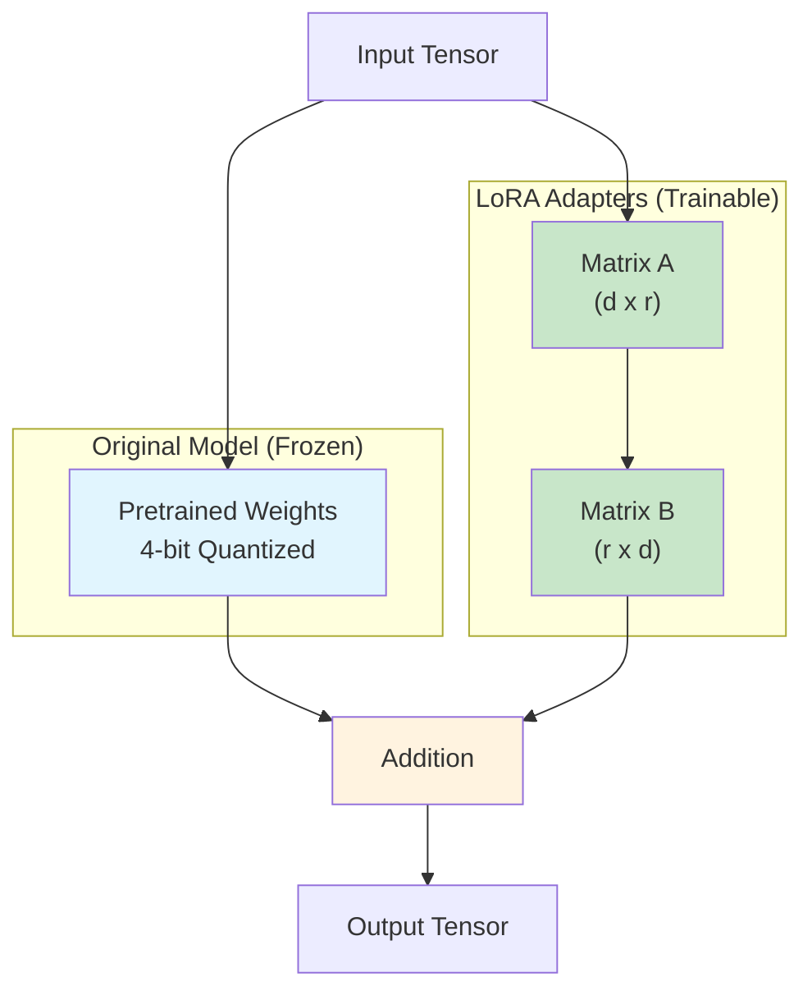
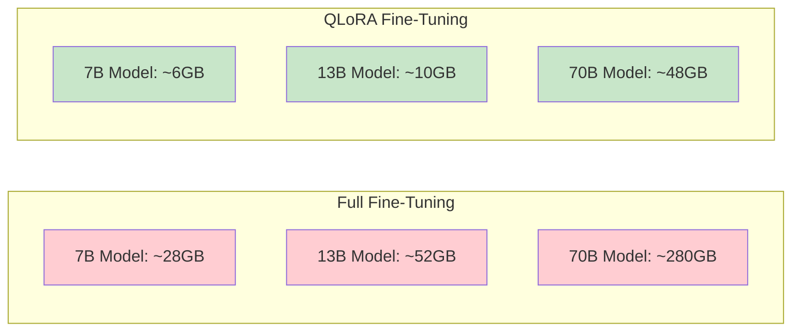
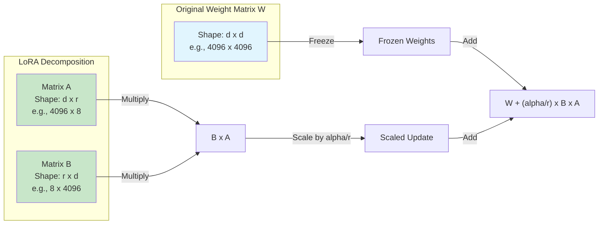
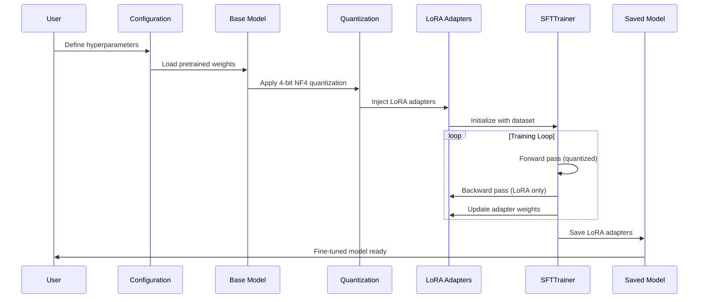
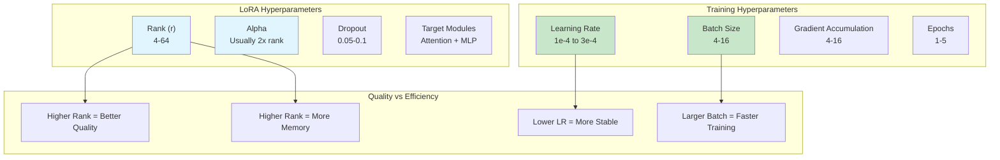

# How to Build QLoRA Fine-Tuning

Author: [nawazdhandala](https://github.com/nawazdhandala)

Tags: LLMOps, Fine-Tuning, QLoRA, Machine Learning

Description: Learn how to fine-tune LLMs efficiently with QLoRA quantization.

---

## Introduction

Fine-tuning large language models (LLMs) has traditionally required significant computational resources, often demanding multiple high-end GPUs with substantial VRAM. QLoRA (Quantized Low-Rank Adaptation) changes this paradigm by combining 4-bit quantization with Low-Rank Adaptation (LoRA), enabling efficient fine-tuning of billion-parameter models on consumer hardware.

In this guide, we will explore how to implement QLoRA fine-tuning using Hugging Face's PEFT (Parameter-Efficient Fine-Tuning) library, covering the core concepts, practical implementation, and optimization strategies.

## What is QLoRA?

QLoRA combines two powerful techniques:

1. **4-bit NormalFloat Quantization**: Reduces model weights from 16-bit or 32-bit to 4-bit precision
2. **Low-Rank Adaptation (LoRA)**: Trains small adapter layers instead of the full model

This combination allows you to fine-tune a 65B parameter model on a single 48GB GPU, or a 7B model on consumer GPUs with 16GB VRAM.

## Architecture Overview



## Memory Efficiency Comparison



## Setting Up the Environment

First, install the required dependencies:

```bash
# Install core libraries for QLoRA fine-tuning
pip install torch transformers accelerate
pip install bitsandbytes  # Required for 4-bit quantization
pip install peft          # Hugging Face PEFT library
pip install datasets      # For loading training data
pip install trl           # For supervised fine-tuning trainer
```

## Understanding 4-bit Quantization

QLoRA uses NormalFloat4 (NF4) quantization, which is specifically designed for normally distributed weights. Here is how it works:

```python
# quantization_config.py
# Configuration for 4-bit quantization using bitsandbytes

from transformers import BitsAndBytesConfig
import torch

def create_quantization_config():
    """
    Create a 4-bit quantization configuration for QLoRA.

    Key parameters:
    - load_in_4bit: Enable 4-bit quantization
    - bnb_4bit_quant_type: Use NF4 (NormalFloat4) for better accuracy
    - bnb_4bit_compute_dtype: Use bfloat16 for computation stability
    - bnb_4bit_use_double_quant: Enable nested quantization for memory savings
    """
    bnb_config = BitsAndBytesConfig(
        # Load model weights in 4-bit precision
        load_in_4bit=True,

        # NF4 is optimal for normally distributed weights
        # Alternative: "fp4" for uniform distribution
        bnb_4bit_quant_type="nf4",

        # Compute dtype for 4-bit base models
        # bfloat16 provides better numerical stability than float16
        bnb_4bit_compute_dtype=torch.bfloat16,

        # Enable double quantization to reduce memory footprint
        # Quantizes the quantization constants for additional savings
        bnb_4bit_use_double_quant=True,
    )

    return bnb_config


# Example usage
if __name__ == "__main__":
    config = create_quantization_config()
    print(f"Quantization type: {config.bnb_4bit_quant_type}")
    print(f"Compute dtype: {config.bnb_4bit_compute_dtype}")
```

## Loading a Quantized Model

```python
# load_model.py
# Load a pretrained model with 4-bit quantization

from transformers import AutoModelForCausalLM, AutoTokenizer
import torch

def load_quantized_model(model_name: str, bnb_config):
    """
    Load a pretrained model with 4-bit quantization.

    Args:
        model_name: Hugging Face model identifier
        bnb_config: BitsAndBytesConfig for quantization

    Returns:
        Tuple of (model, tokenizer)
    """
    # Load tokenizer (not quantized)
    tokenizer = AutoTokenizer.from_pretrained(
        model_name,
        trust_remote_code=True,
    )

    # Set padding token if not present
    # Many models use EOS token as padding token
    if tokenizer.pad_token is None:
        tokenizer.pad_token = tokenizer.eos_token

    # Load model with quantization configuration
    model = AutoModelForCausalLM.from_pretrained(
        model_name,
        quantization_config=bnb_config,
        device_map="auto",  # Automatically distribute across GPUs
        trust_remote_code=True,
    )

    # Disable caching for gradient checkpointing compatibility
    model.config.use_cache = False

    # Enable gradient checkpointing for memory efficiency
    model.gradient_checkpointing_enable()

    return model, tokenizer


# Example: Load Llama 2 7B with 4-bit quantization
if __name__ == "__main__":
    from quantization_config import create_quantization_config

    model_name = "meta-llama/Llama-2-7b-hf"
    bnb_config = create_quantization_config()

    model, tokenizer = load_quantized_model(model_name, bnb_config)
    print(f"Model loaded with {model.get_memory_footprint() / 1e9:.2f} GB")
```

## Configuring LoRA Adapters

LoRA works by injecting trainable low-rank matrices into transformer layers. The key insight is that weight updates during fine-tuning have low intrinsic rank:



```python
# lora_config.py
# Configure LoRA adapters for efficient fine-tuning

from peft import LoraConfig, TaskType

def create_lora_config(
    rank: int = 8,
    alpha: int = 16,
    dropout: float = 0.1,
    target_modules: list = None,
):
    """
    Create a LoRA configuration for fine-tuning.

    Args:
        rank: Rank of the low-rank matrices (lower = less parameters)
        alpha: Scaling factor for LoRA updates
        dropout: Dropout probability for LoRA layers
        target_modules: Which modules to apply LoRA to

    Returns:
        LoraConfig object
    """
    # Default target modules for typical transformer architectures
    # These target the attention and MLP layers
    if target_modules is None:
        target_modules = [
            "q_proj",    # Query projection in attention
            "k_proj",    # Key projection in attention
            "v_proj",    # Value projection in attention
            "o_proj",    # Output projection in attention
            "gate_proj", # Gate projection in MLP (for Llama-style)
            "up_proj",   # Up projection in MLP
            "down_proj", # Down projection in MLP
        ]

    lora_config = LoraConfig(
        # Rank of LoRA update matrices
        # Higher rank = more parameters = more capacity
        # Typical values: 8, 16, 32, 64
        r=rank,

        # LoRA scaling factor
        # The update is scaled by alpha/r
        # Higher alpha = stronger LoRA influence
        lora_alpha=alpha,

        # Modules to apply LoRA to
        target_modules=target_modules,

        # Dropout for regularization
        lora_dropout=dropout,

        # Bias handling: "none", "all", or "lora_only"
        bias="none",

        # Task type for proper model wrapping
        task_type=TaskType.CAUSAL_LM,
    )

    return lora_config


def print_trainable_parameters(model):
    """
    Print the number of trainable parameters in the model.
    Useful for verifying LoRA is working correctly.
    """
    trainable_params = 0
    all_params = 0

    for _, param in model.named_parameters():
        all_params += param.numel()
        if param.requires_grad:
            trainable_params += param.numel()

    percentage = 100 * trainable_params / all_params
    print(f"Trainable parameters: {trainable_params:,}")
    print(f"All parameters: {all_params:,}")
    print(f"Trainable %: {percentage:.2f}%")


# Example configuration for different use cases
if __name__ == "__main__":
    # Minimal configuration (smallest memory footprint)
    minimal_config = create_lora_config(rank=4, alpha=8, dropout=0.05)

    # Balanced configuration (good trade-off)
    balanced_config = create_lora_config(rank=16, alpha=32, dropout=0.1)

    # High capacity configuration (best quality)
    high_capacity_config = create_lora_config(rank=64, alpha=128, dropout=0.1)

    print("LoRA configurations created successfully")
```

## Complete QLoRA Training Pipeline

Here is a complete example that ties everything together:

```python
# qlora_trainer.py
# Complete QLoRA fine-tuning pipeline using Hugging Face libraries

import torch
from datasets import load_dataset
from transformers import (
    AutoModelForCausalLM,
    AutoTokenizer,
    BitsAndBytesConfig,
    TrainingArguments,
)
from peft import (
    LoraConfig,
    get_peft_model,
    prepare_model_for_kbit_training,
    TaskType,
)
from trl import SFTTrainer


def setup_qlora_training(
    model_name: str,
    dataset_name: str,
    output_dir: str,
    max_seq_length: int = 512,
    lora_rank: int = 16,
    lora_alpha: int = 32,
    num_epochs: int = 3,
    batch_size: int = 4,
    gradient_accumulation_steps: int = 4,
    learning_rate: float = 2e-4,
):
    """
    Set up and run QLoRA fine-tuning.

    Args:
        model_name: Hugging Face model identifier
        dataset_name: Dataset to fine-tune on
        output_dir: Directory to save checkpoints
        max_seq_length: Maximum sequence length for training
        lora_rank: Rank of LoRA matrices
        lora_alpha: LoRA scaling factor
        num_epochs: Number of training epochs
        batch_size: Per-device batch size
        gradient_accumulation_steps: Steps to accumulate gradients
        learning_rate: Learning rate for training

    Returns:
        Trained model and tokenizer
    """

    # Step 1: Configure 4-bit quantization
    # This reduces memory usage by approximately 4x
    bnb_config = BitsAndBytesConfig(
        load_in_4bit=True,
        bnb_4bit_quant_type="nf4",
        bnb_4bit_compute_dtype=torch.bfloat16,
        bnb_4bit_use_double_quant=True,
    )

    # Step 2: Load tokenizer
    tokenizer = AutoTokenizer.from_pretrained(model_name)
    tokenizer.pad_token = tokenizer.eos_token
    tokenizer.padding_side = "right"  # Required for causal LM

    # Step 3: Load model with quantization
    model = AutoModelForCausalLM.from_pretrained(
        model_name,
        quantization_config=bnb_config,
        device_map="auto",
        trust_remote_code=True,
    )

    # Step 4: Prepare model for k-bit training
    # This handles gradient checkpointing and layer normalization
    model = prepare_model_for_kbit_training(model)

    # Step 5: Configure LoRA
    lora_config = LoraConfig(
        r=lora_rank,
        lora_alpha=lora_alpha,
        target_modules=[
            "q_proj", "k_proj", "v_proj", "o_proj",
            "gate_proj", "up_proj", "down_proj",
        ],
        lora_dropout=0.1,
        bias="none",
        task_type=TaskType.CAUSAL_LM,
    )

    # Step 6: Apply LoRA to model
    model = get_peft_model(model, lora_config)

    # Print trainable parameters
    model.print_trainable_parameters()

    # Step 7: Load and prepare dataset
    dataset = load_dataset(dataset_name, split="train")

    # Step 8: Configure training arguments
    training_args = TrainingArguments(
        output_dir=output_dir,
        num_train_epochs=num_epochs,
        per_device_train_batch_size=batch_size,
        gradient_accumulation_steps=gradient_accumulation_steps,
        learning_rate=learning_rate,

        # Memory optimization settings
        fp16=False,              # Disable fp16 (using bf16)
        bf16=True,               # Use bfloat16 for stability
        gradient_checkpointing=True,

        # Optimizer settings
        optim="paged_adamw_32bit",  # Memory-efficient optimizer
        weight_decay=0.01,
        warmup_ratio=0.03,
        lr_scheduler_type="cosine",

        # Logging and saving
        logging_steps=10,
        save_strategy="epoch",
        save_total_limit=3,

        # Performance settings
        max_grad_norm=0.3,
        group_by_length=True,    # Group similar lengths for efficiency
    )

    # Step 9: Initialize trainer
    trainer = SFTTrainer(
        model=model,
        args=training_args,
        train_dataset=dataset,
        tokenizer=tokenizer,
        max_seq_length=max_seq_length,
        dataset_text_field="text",  # Adjust based on your dataset
        packing=True,  # Pack multiple samples for efficiency
    )

    # Step 10: Train the model
    trainer.train()

    # Step 11: Save the final model
    trainer.save_model(f"{output_dir}/final_model")

    return model, tokenizer


# Run training
if __name__ == "__main__":
    model, tokenizer = setup_qlora_training(
        model_name="meta-llama/Llama-2-7b-hf",
        dataset_name="timdettmers/openassistant-guanaco",
        output_dir="./qlora_output",
        max_seq_length=512,
        lora_rank=16,
        lora_alpha=32,
        num_epochs=1,
        batch_size=4,
        gradient_accumulation_steps=4,
    )
```

## QLoRA Training Workflow



## Inference with QLoRA Model

After training, you can load and use the fine-tuned model:

```python
# inference.py
# Load and use a QLoRA fine-tuned model for inference

from transformers import AutoModelForCausalLM, AutoTokenizer, BitsAndBytesConfig
from peft import PeftModel
import torch


def load_qlora_model(base_model_name: str, adapter_path: str):
    """
    Load a QLoRA fine-tuned model for inference.

    Args:
        base_model_name: Original base model identifier
        adapter_path: Path to saved LoRA adapters

    Returns:
        Tuple of (model, tokenizer)
    """
    # Configure quantization (same as training)
    bnb_config = BitsAndBytesConfig(
        load_in_4bit=True,
        bnb_4bit_quant_type="nf4",
        bnb_4bit_compute_dtype=torch.bfloat16,
        bnb_4bit_use_double_quant=True,
    )

    # Load base model with quantization
    model = AutoModelForCausalLM.from_pretrained(
        base_model_name,
        quantization_config=bnb_config,
        device_map="auto",
    )

    # Load LoRA adapters
    model = PeftModel.from_pretrained(model, adapter_path)

    # Load tokenizer
    tokenizer = AutoTokenizer.from_pretrained(base_model_name)
    tokenizer.pad_token = tokenizer.eos_token

    return model, tokenizer


def generate_response(model, tokenizer, prompt: str, max_new_tokens: int = 256):
    """
    Generate a response using the fine-tuned model.

    Args:
        model: The QLoRA model
        tokenizer: The tokenizer
        prompt: Input prompt
        max_new_tokens: Maximum tokens to generate

    Returns:
        Generated text
    """
    # Tokenize input
    inputs = tokenizer(prompt, return_tensors="pt").to(model.device)

    # Generate response
    with torch.no_grad():
        outputs = model.generate(
            **inputs,
            max_new_tokens=max_new_tokens,
            temperature=0.7,
            top_p=0.9,
            do_sample=True,
            pad_token_id=tokenizer.eos_token_id,
        )

    # Decode and return response
    response = tokenizer.decode(outputs[0], skip_special_tokens=True)
    return response


# Example usage
if __name__ == "__main__":
    model, tokenizer = load_qlora_model(
        base_model_name="meta-llama/Llama-2-7b-hf",
        adapter_path="./qlora_output/final_model",
    )

    prompt = "### Human: What is machine learning?\n### Assistant:"
    response = generate_response(model, tokenizer, prompt)
    print(response)
```

## Merging LoRA Weights

For deployment, you can merge LoRA weights into the base model:

```python
# merge_weights.py
# Merge LoRA adapters with base model for deployment

from transformers import AutoModelForCausalLM, AutoTokenizer
from peft import PeftModel
import torch


def merge_lora_weights(
    base_model_name: str,
    adapter_path: str,
    output_path: str,
    push_to_hub: bool = False,
    hub_model_id: str = None,
):
    """
    Merge LoRA adapters with the base model.

    This creates a standalone model without needing PEFT at inference time.
    Note: The merged model will be in full precision (not quantized).

    Args:
        base_model_name: Original base model identifier
        adapter_path: Path to saved LoRA adapters
        output_path: Where to save the merged model
        push_to_hub: Whether to push to Hugging Face Hub
        hub_model_id: Model ID for the Hub
    """
    # Load base model in full precision for merging
    model = AutoModelForCausalLM.from_pretrained(
        base_model_name,
        torch_dtype=torch.float16,
        device_map="auto",
    )

    # Load tokenizer
    tokenizer = AutoTokenizer.from_pretrained(base_model_name)

    # Load LoRA adapters
    model = PeftModel.from_pretrained(model, adapter_path)

    # Merge LoRA weights into base model
    # This adds the LoRA matrices to the original weights
    model = model.merge_and_unload()

    # Save merged model locally
    model.save_pretrained(output_path)
    tokenizer.save_pretrained(output_path)

    print(f"Merged model saved to {output_path}")

    # Optionally push to Hugging Face Hub
    if push_to_hub and hub_model_id:
        model.push_to_hub(hub_model_id)
        tokenizer.push_to_hub(hub_model_id)
        print(f"Model pushed to Hub: {hub_model_id}")

    return model, tokenizer


# Example usage
if __name__ == "__main__":
    merge_lora_weights(
        base_model_name="meta-llama/Llama-2-7b-hf",
        adapter_path="./qlora_output/final_model",
        output_path="./merged_model",
        push_to_hub=False,
    )
```

## Hyperparameter Tuning Guide



| Parameter | Low Memory | Balanced | High Quality |
|-----------|------------|----------|--------------|
| LoRA Rank | 4 | 16 | 64 |
| LoRA Alpha | 8 | 32 | 128 |
| Batch Size | 2 | 4 | 8 |
| Grad Accum | 8 | 4 | 2 |
| Learning Rate | 3e-4 | 2e-4 | 1e-4 |

## Common Issues and Solutions

### Out of Memory Errors

```python
# memory_optimization.py
# Techniques to reduce memory usage during QLoRA training

# Solution 1: Reduce batch size and increase gradient accumulation
training_args = TrainingArguments(
    per_device_train_batch_size=1,  # Minimum batch size
    gradient_accumulation_steps=16,  # Accumulate more steps
    # ...
)

# Solution 2: Use gradient checkpointing
model.gradient_checkpointing_enable()

# Solution 3: Reduce sequence length
max_seq_length = 256  # Instead of 512 or 1024

# Solution 4: Use lower LoRA rank
lora_config = LoraConfig(
    r=4,  # Minimum rank
    # ...
)

# Solution 5: Target fewer modules
lora_config = LoraConfig(
    target_modules=["q_proj", "v_proj"],  # Only attention
    # ...
)
```

### Training Instability

```python
# stability_fixes.py
# Fixes for common training instability issues

# Solution 1: Use bfloat16 instead of float16
training_args = TrainingArguments(
    bf16=True,
    fp16=False,
    # ...
)

# Solution 2: Lower learning rate with warmup
training_args = TrainingArguments(
    learning_rate=1e-4,
    warmup_ratio=0.1,  # 10% warmup
    # ...
)

# Solution 3: Gradient clipping
training_args = TrainingArguments(
    max_grad_norm=0.3,  # Aggressive clipping
    # ...
)

# Solution 4: Use cosine scheduler
training_args = TrainingArguments(
    lr_scheduler_type="cosine",
    # ...
)
```

## Best Practices Summary

1. **Start with defaults**: Use rank=16, alpha=32 as a starting point
2. **Monitor memory**: Use `nvidia-smi` to track GPU memory usage
3. **Use bfloat16**: More stable than float16 for training
4. **Enable gradient checkpointing**: Essential for memory efficiency
5. **Pack sequences**: Use `packing=True` in SFTTrainer for efficiency
6. **Save checkpoints**: Always save intermediate checkpoints
7. **Evaluate regularly**: Track loss and validation metrics
8. **Start small**: Test with a small dataset before full training

## Conclusion

QLoRA represents a significant advancement in making LLM fine-tuning accessible. By combining 4-bit quantization with LoRA adapters, you can fine-tune models that would otherwise require enterprise-grade hardware on consumer GPUs.

Key takeaways:
- 4-bit NF4 quantization reduces memory by approximately 4x with minimal quality loss
- LoRA adapters train less than 1% of parameters while achieving near full fine-tuning performance
- The combination enables fine-tuning 7B models on 16GB GPUs
- Hugging Face PEFT makes implementation straightforward with just a few lines of code

Start with the examples in this guide, experiment with your own datasets, and join the growing community of practitioners democratizing LLM customization.

## Additional Resources

- [QLoRA Paper](https://arxiv.org/abs/2305.14314): Original research paper
- [PEFT Documentation](https://huggingface.co/docs/peft): Official Hugging Face PEFT docs
- [bitsandbytes](https://github.com/TimDettmers/bitsandbytes): Quantization library
- [TRL Library](https://huggingface.co/docs/trl): Training library for LLMs
