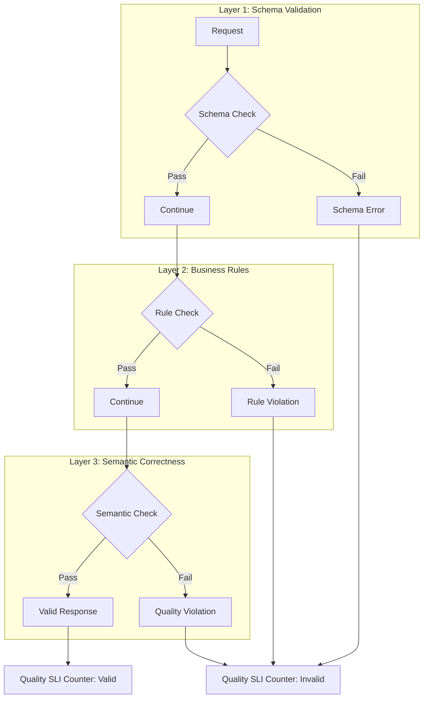
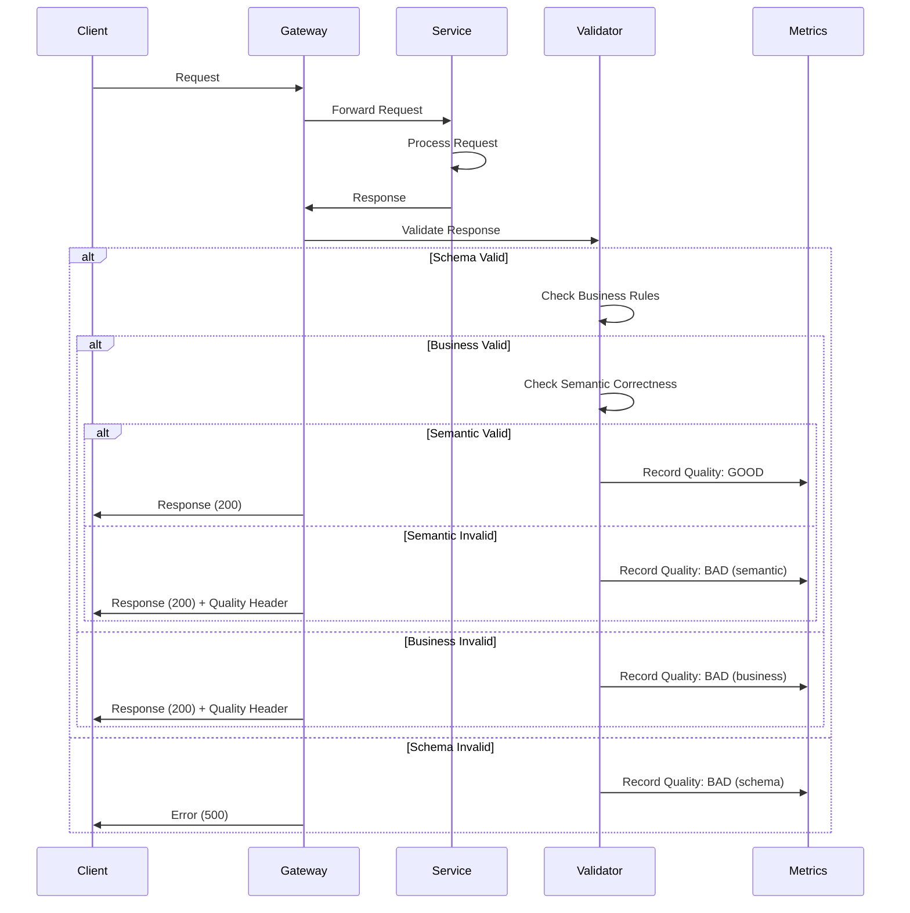
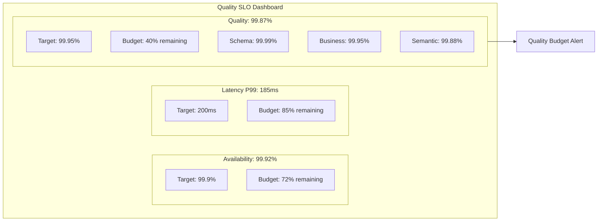

# How to Create Quality SLOs

Author: [nawazdhandala](https://github.com/nawazdhandala)

Tags: SRE, SLO, Quality, Reliability

Description: Define and measure correctness objectives that ensure your services return semantically valid results, not just fast responses.

---

## Why Quality SLOs Matter

Most SLOs focus on availability and latency. A service can return 200 OK in 50ms and still be broken if the response data is wrong. Quality SLOs measure correctness: did the service return the right answer?

Consider these scenarios:

- A pricing API returns stale prices from a failed cache refresh
- A search service returns empty results due to an index corruption
- A recommendation engine serves random items because a model failed to load
- A payment processor charges the wrong amount due to currency conversion bugs

All of these pass traditional availability checks. Quality SLOs catch them.

---

## Quality SLI Definition

A Quality SLI (Service Level Indicator) measures the proportion of responses that are semantically correct.

**Formula:**

```
Quality SLI = (Valid Responses / Total Responses) * 100
```

What counts as "valid" depends on your domain:

| Service Type | Validity Criteria |
|--------------|-------------------|
| Search | Results match query intent, no empty results for known terms |
| Pricing | Values within expected bounds, currency matches request |
| Inventory | Stock counts reflect actual warehouse state |
| ML Inference | Predictions have confidence above threshold |
| Data Pipeline | Output schema matches specification, no null required fields |

---

## Measuring Quality: The Three Layers

Quality measurement happens at three distinct layers, each catching different failure modes.



### Layer 1: Schema Validation

Check that responses conform to their contract.

```typescript
// Schema validation middleware
// Validates response structure before sending to client

import { z } from 'zod';

const PriceResponseSchema = z.object({
  productId: z.string().uuid(),
  price: z.number().positive(),
  currency: z.enum(['USD', 'EUR', 'GBP']),
  timestamp: z.string().datetime(),
});

function validateResponse(response: unknown): boolean {
  const result = PriceResponseSchema.safeParse(response);

  if (!result.success) {
    // Increment quality violation counter
    metrics.increment('quality.schema_violation', {
      endpoint: '/api/price',
      error: result.error.issues[0].code,
    });
    return false;
  }

  return true;
}
```

### Layer 2: Business Rule Validation

Check that values make sense within your business context.

```typescript
// Business rule validation
// Ensures prices fall within acceptable bounds for the product category

interface PriceResponse {
  productId: string;
  price: number;
  currency: string;
  category: string;
}

interface PriceBounds {
  min: number;
  max: number;
}

const PRICE_BOUNDS: Record<string, PriceBounds> = {
  electronics: { min: 1, max: 50000 },
  groceries: { min: 0.01, max: 500 },
  luxury: { min: 100, max: 1000000 },
};

function validateBusinessRules(response: PriceResponse): boolean {
  const bounds = PRICE_BOUNDS[response.category];

  if (!bounds) {
    metrics.increment('quality.unknown_category');
    return false;
  }

  // Check price is within reasonable bounds for category
  if (response.price < bounds.min || response.price > bounds.max) {
    metrics.increment('quality.price_out_of_bounds', {
      category: response.category,
      price: response.price,
    });
    return false;
  }

  return true;
}
```

### Layer 3: Semantic Correctness

Verify that the response is actually correct, not just well-formed.

```typescript
// Semantic validation using canary checks
// Compares live responses against known-good reference values

interface CanaryProduct {
  productId: string;
  expectedPrice: number;
  tolerance: number; // Percentage tolerance for price drift
}

// Products with known prices for validation
const CANARY_PRODUCTS: CanaryProduct[] = [
  { productId: 'prod-001', expectedPrice: 29.99, tolerance: 0.01 },
  { productId: 'prod-002', expectedPrice: 149.99, tolerance: 0.01 },
];

async function validateSemanticCorrectness(
  priceService: PriceService
): Promise<number> {
  let validCount = 0;

  for (const canary of CANARY_PRODUCTS) {
    const response = await priceService.getPrice(canary.productId);
    const drift = Math.abs(response.price - canary.expectedPrice) / canary.expectedPrice;

    if (drift <= canary.tolerance) {
      validCount++;
    } else {
      // Log for investigation but do not alert immediately
      metrics.increment('quality.semantic_drift', {
        productId: canary.productId,
        expected: canary.expectedPrice,
        actual: response.price,
        drift: drift,
      });
    }
  }

  // Return percentage of canaries passing
  return (validCount / CANARY_PRODUCTS.length) * 100;
}
```

---

## Error Rate and Success Rate Metrics

Quality metrics complement traditional error rates by adding a correctness dimension.

### Traditional vs Quality Metrics

| Metric Type | What It Measures | Blind Spots |
|-------------|------------------|-------------|
| Error Rate | HTTP 5xx / Total | Silent data corruption |
| Success Rate | HTTP 2xx / Total | Wrong but valid responses |
| Quality Rate | Correct / Total | None (when properly defined) |

### Implementing Combined Metrics

```python
# Combined quality and availability metrics
# Tracks both HTTP success and semantic correctness

from prometheus_client import Counter, Histogram
from dataclasses import dataclass
from typing import Optional
import time

# Availability metrics (traditional)
http_requests_total = Counter(
    'http_requests_total',
    'Total HTTP requests',
    ['method', 'endpoint', 'status']
)

# Quality metrics (correctness)
quality_checks_total = Counter(
    'quality_checks_total',
    'Total quality validation checks',
    ['endpoint', 'validation_layer', 'result']
)

# Combined SLI metric
sli_events_total = Counter(
    'sli_events_total',
    'SLI events for SLO calculation',
    ['sli_type', 'result']
)

@dataclass
class RequestResult:
    status_code: int
    response_body: dict
    latency_ms: float
    schema_valid: bool
    business_valid: bool
    semantic_valid: bool

def record_request(endpoint: str, result: RequestResult) -> None:
    """Record all SLI dimensions for a single request."""

    # Availability SLI: Was the request successful?
    is_available = 200 <= result.status_code < 500
    sli_events_total.labels(
        sli_type='availability',
        result='good' if is_available else 'bad'
    ).inc()

    # Latency SLI: Was the request fast enough?
    is_fast = result.latency_ms < 200  # 200ms threshold
    sli_events_total.labels(
        sli_type='latency',
        result='good' if is_fast else 'bad'
    ).inc()

    # Quality SLI: Was the response correct?
    is_correct = (
        result.schema_valid and
        result.business_valid and
        result.semantic_valid
    )
    sli_events_total.labels(
        sli_type='quality',
        result='good' if is_correct else 'bad'
    ).inc()

    # Detailed quality breakdown for debugging
    quality_checks_total.labels(
        endpoint=endpoint,
        validation_layer='schema',
        result='pass' if result.schema_valid else 'fail'
    ).inc()

    quality_checks_total.labels(
        endpoint=endpoint,
        validation_layer='business',
        result='pass' if result.business_valid else 'fail'
    ).inc()

    quality_checks_total.labels(
        endpoint=endpoint,
        validation_layer='semantic',
        result='pass' if result.semantic_valid else 'fail'
    ).inc()
```

---

## Quality Measurement Flow

The following diagram shows how quality validation integrates into the request lifecycle.



---

## Semantic Correctness Validation Strategies

Different services require different validation approaches.

### Strategy 1: Golden Dataset Testing

Compare responses against known-correct answers.

```python
# Golden dataset validation
# Uses pre-computed correct answers to validate live responses

import json
from typing import List, Dict, Any
from dataclasses import dataclass

@dataclass
class GoldenRecord:
    input_params: Dict[str, Any]
    expected_output: Dict[str, Any]
    tolerance: Dict[str, float]  # Field-level tolerances

class GoldenDatasetValidator:
    def __init__(self, golden_file: str):
        # Load golden dataset from file
        with open(golden_file, 'r') as f:
            data = json.load(f)
        self.golden_records = [
            GoldenRecord(**record) for record in data
        ]

    def validate(
        self,
        input_params: Dict[str, Any],
        actual_output: Dict[str, Any]
    ) -> tuple[bool, List[str]]:
        """
        Validate actual output against golden dataset.
        Returns (is_valid, list_of_violations).
        """
        violations = []

        # Find matching golden record
        golden = self._find_golden_record(input_params)
        if not golden:
            # No golden record for this input, skip validation
            return True, []

        # Compare each field with tolerance
        for field, expected in golden.expected_output.items():
            actual = actual_output.get(field)
            tolerance = golden.tolerance.get(field, 0)

            if not self._within_tolerance(expected, actual, tolerance):
                violations.append(
                    f"Field '{field}': expected {expected}, got {actual}"
                )

        return len(violations) == 0, violations

    def _find_golden_record(
        self,
        input_params: Dict[str, Any]
    ) -> GoldenRecord | None:
        for record in self.golden_records:
            if record.input_params == input_params:
                return record
        return None

    def _within_tolerance(
        self,
        expected: Any,
        actual: Any,
        tolerance: float
    ) -> bool:
        if isinstance(expected, (int, float)) and isinstance(actual, (int, float)):
            if expected == 0:
                return actual == 0
            return abs(expected - actual) / abs(expected) <= tolerance
        return expected == actual
```

### Strategy 2: Cross-Service Validation

Verify consistency across related services.

```python
# Cross-service validation
# Ensures data consistency between dependent services

from typing import Dict, Any
import asyncio

class CrossServiceValidator:
    def __init__(
        self,
        inventory_client: InventoryClient,
        pricing_client: PricingClient,
        catalog_client: CatalogClient
    ):
        self.inventory = inventory_client
        self.pricing = pricing_client
        self.catalog = catalog_client

    async def validate_product_consistency(
        self,
        product_id: str
    ) -> tuple[bool, Dict[str, Any]]:
        """
        Validate that product data is consistent across all services.
        """
        # Fetch data from all services concurrently
        inventory_data, pricing_data, catalog_data = await asyncio.gather(
            self.inventory.get_product(product_id),
            self.pricing.get_price(product_id),
            self.catalog.get_product(product_id),
            return_exceptions=True
        )

        violations = {}

        # Check product exists in all services
        if isinstance(catalog_data, Exception):
            violations['catalog'] = 'Product not found in catalog'
        if isinstance(pricing_data, Exception):
            violations['pricing'] = 'Product not found in pricing'
        if isinstance(inventory_data, Exception):
            violations['inventory'] = 'Product not found in inventory'

        if violations:
            return False, violations

        # Check category consistency
        if catalog_data['category'] != pricing_data.get('category'):
            violations['category_mismatch'] = {
                'catalog': catalog_data['category'],
                'pricing': pricing_data.get('category'),
            }

        # Check that inventory SKU matches catalog
        if inventory_data['sku'] != catalog_data['sku']:
            violations['sku_mismatch'] = {
                'inventory': inventory_data['sku'],
                'catalog': catalog_data['sku'],
            }

        return len(violations) == 0, violations
```

### Strategy 3: Statistical Validation

Detect anomalies using statistical methods.

```python
# Statistical validation
# Detects anomalous responses using distribution analysis

import numpy as np
from collections import deque
from dataclasses import dataclass
from typing import Optional

@dataclass
class StatisticalBounds:
    mean: float
    std: float
    lower_bound: float
    upper_bound: float

class StatisticalValidator:
    def __init__(
        self,
        window_size: int = 1000,
        num_std_devs: float = 3.0
    ):
        # Rolling window of recent values
        self.window_size = window_size
        self.num_std_devs = num_std_devs
        self.values: deque = deque(maxlen=window_size)
        self.bounds: Optional[StatisticalBounds] = None

    def add_value(self, value: float) -> None:
        """Add a value to the rolling window and update bounds."""
        self.values.append(value)

        if len(self.values) >= 100:  # Minimum samples for stats
            self._update_bounds()

    def _update_bounds(self) -> None:
        """Recalculate statistical bounds from current window."""
        values_array = np.array(self.values)
        mean = np.mean(values_array)
        std = np.std(values_array)

        self.bounds = StatisticalBounds(
            mean=mean,
            std=std,
            lower_bound=mean - (self.num_std_devs * std),
            upper_bound=mean + (self.num_std_devs * std),
        )

    def is_anomalous(self, value: float) -> tuple[bool, Optional[str]]:
        """Check if a value is statistically anomalous."""
        if self.bounds is None:
            # Not enough data yet, assume valid
            return False, None

        if value < self.bounds.lower_bound:
            return True, f"Value {value} below lower bound {self.bounds.lower_bound:.2f}"

        if value > self.bounds.upper_bound:
            return True, f"Value {value} above upper bound {self.bounds.upper_bound:.2f}"

        return False, None


# Example usage for price validation
price_validator = StatisticalValidator(window_size=1000, num_std_devs=3.0)

def validate_price_response(price: float) -> bool:
    """Validate a price against statistical norms."""
    is_anomaly, reason = price_validator.is_anomalous(price)

    if is_anomaly:
        metrics.increment('quality.statistical_anomaly', {
            'reason': reason,
            'value': price,
        })
        return False

    # Add valid price to window for future comparisons
    price_validator.add_value(price)
    return True
```

---

## Error Budget for Quality Violations

Quality SLOs consume error budget just like availability SLOs.

### Defining Quality Error Budget

```yaml
# SLO configuration with quality objectives
# Quality failures consume budget alongside availability failures

slos:
  - name: pricing-api
    description: Price lookup service

    objectives:
      # Traditional availability SLO
      - type: availability
        target: 99.9
        window: 30d

      # Traditional latency SLO
      - type: latency
        target: 99.0
        threshold_ms: 200
        window: 30d

      # Quality SLO for correctness
      - type: quality
        target: 99.95
        window: 30d
        validation_layers:
          - schema
          - business_rules
          - semantic

    error_budget_policy:
      # Budget thresholds trigger different responses
      thresholds:
        - remaining_percent: 50
          action: notify_team

        - remaining_percent: 25
          action: freeze_non_critical_deploys

        - remaining_percent: 10
          action: freeze_all_deploys

        - remaining_percent: 0
          action: incident_review_required
```

### Calculating Combined Error Budget

```python
# Combined error budget calculation
# Aggregates availability, latency, and quality into unified budget

from dataclasses import dataclass
from typing import Dict
from datetime import datetime, timedelta

@dataclass
class SLOStatus:
    target: float
    current: float
    budget_total: float
    budget_remaining: float
    budget_consumed_percent: float

@dataclass
class CombinedBudget:
    availability: SLOStatus
    latency: SLOStatus
    quality: SLOStatus
    overall_budget_remaining_percent: float
    most_constrained: str

def calculate_error_budget(
    metrics_client: MetricsClient,
    slo_config: Dict,
    window_days: int = 30
) -> CombinedBudget:
    """
    Calculate error budget across all SLO dimensions.
    The overall budget is limited by the most constrained dimension.
    """
    end_time = datetime.utcnow()
    start_time = end_time - timedelta(days=window_days)

    # Query current SLI values
    availability_sli = metrics_client.query(
        'sum(rate(sli_events_total{sli_type="availability",result="good"}[30d])) / '
        'sum(rate(sli_events_total{sli_type="availability"}[30d])) * 100'
    )

    latency_sli = metrics_client.query(
        'sum(rate(sli_events_total{sli_type="latency",result="good"}[30d])) / '
        'sum(rate(sli_events_total{sli_type="latency"}[30d])) * 100'
    )

    quality_sli = metrics_client.query(
        'sum(rate(sli_events_total{sli_type="quality",result="good"}[30d])) / '
        'sum(rate(sli_events_total{sli_type="quality"}[30d])) * 100'
    )

    # Calculate budget for each dimension
    def calc_budget(target: float, current: float) -> SLOStatus:
        budget_total = 100 - target  # e.g., 0.1% for 99.9% target
        budget_consumed = max(0, target - current)
        budget_remaining = max(0, budget_total - budget_consumed)

        return SLOStatus(
            target=target,
            current=current,
            budget_total=budget_total,
            budget_remaining=budget_remaining,
            budget_consumed_percent=(budget_consumed / budget_total) * 100 if budget_total > 0 else 100,
        )

    availability = calc_budget(
        slo_config['availability']['target'],
        availability_sli
    )
    latency = calc_budget(
        slo_config['latency']['target'],
        latency_sli
    )
    quality = calc_budget(
        slo_config['quality']['target'],
        quality_sli
    )

    # Find most constrained dimension
    budgets = {
        'availability': availability.budget_remaining / availability.budget_total * 100,
        'latency': latency.budget_remaining / latency.budget_total * 100,
        'quality': quality.budget_remaining / quality.budget_total * 100,
    }
    most_constrained = min(budgets, key=budgets.get)

    return CombinedBudget(
        availability=availability,
        latency=latency,
        quality=quality,
        overall_budget_remaining_percent=min(budgets.values()),
        most_constrained=most_constrained,
    )
```

---

## Quality SLO Dashboard

Visualize quality alongside traditional SLOs.



### Alerting on Quality Budget Burn

```yaml
# Prometheus alerting rules for quality SLOs
# Uses multi-window burn rate for early warning

groups:
  - name: quality-slo-alerts
    rules:
      # Fast burn: 14.4x budget consumption rate over 1 hour
      # Will exhaust 30-day budget in 2 days at this rate
      - alert: QualitySLOFastBurn
        expr: |
          (
            sum(rate(sli_events_total{sli_type="quality",result="bad"}[1h]))
            /
            sum(rate(sli_events_total{sli_type="quality"}[1h]))
          ) > (14.4 * 0.0005)
        for: 2m
        labels:
          severity: critical
        annotations:
          summary: "Quality SLO burning budget at 14.4x rate"
          description: "Quality violations consuming error budget rapidly. Check recent deployments and data sources."

      # Slow burn: 3x budget consumption rate over 6 hours
      # Will exhaust 30-day budget in 10 days at this rate
      - alert: QualitySLOSlowBurn
        expr: |
          (
            sum(rate(sli_events_total{sli_type="quality",result="bad"}[6h]))
            /
            sum(rate(sli_events_total{sli_type="quality"}[6h]))
          ) > (3 * 0.0005)
        for: 15m
        labels:
          severity: warning
        annotations:
          summary: "Quality SLO burning budget at 3x rate"
          description: "Sustained quality degradation detected. Review validation failures by layer."

      # Budget exhaustion warning
      - alert: QualityBudgetLow
        expr: |
          (
            1 - (
              sum(increase(sli_events_total{sli_type="quality",result="bad"}[30d]))
              /
              sum(increase(sli_events_total{sli_type="quality"}[30d]))
            )
          ) / 0.0005 < 0.25
        for: 5m
        labels:
          severity: warning
        annotations:
          summary: "Quality error budget below 25%"
          description: "Less than 25% of monthly quality error budget remaining."
```

---

## Practical Implementation Checklist

1. **Identify critical correctness requirements** for each service
2. **Define validation layers** (schema, business rules, semantic)
3. **Implement validation middleware** that runs on every response
4. **Create golden datasets** for semantic validation
5. **Set quality SLO targets** based on business impact
6. **Configure burn rate alerts** for early warning
7. **Build dashboards** showing quality alongside availability
8. **Review quality incidents** in postmortems
9. **Iterate on validation rules** as you discover new failure modes

---

## Key Takeaways

- Quality SLOs measure correctness, catching failures that availability SLOs miss
- Implement validation at three layers: schema, business rules, and semantic
- Quality consumes error budget just like availability failures
- Use multiple validation strategies: golden datasets, cross-service checks, and statistical methods
- Alert on quality budget burn rate, not just threshold breaches
- Treat quality incidents with the same rigor as availability incidents

A service that returns fast garbage is still broken. Quality SLOs ensure your users get correct answers, not just quick ones.

---

If you want a platform that unifies quality SLOs with availability, latency, and error budgets in a single view, OneUptime can help you build and monitor these objectives across your entire stack.
