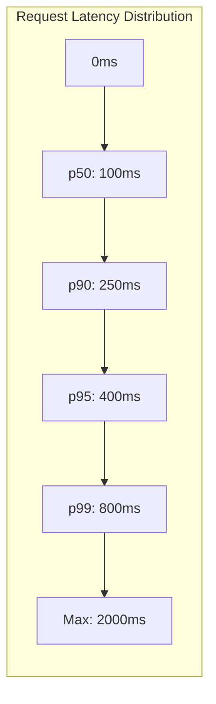
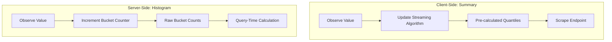
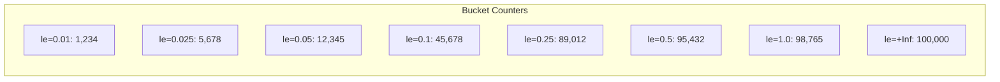
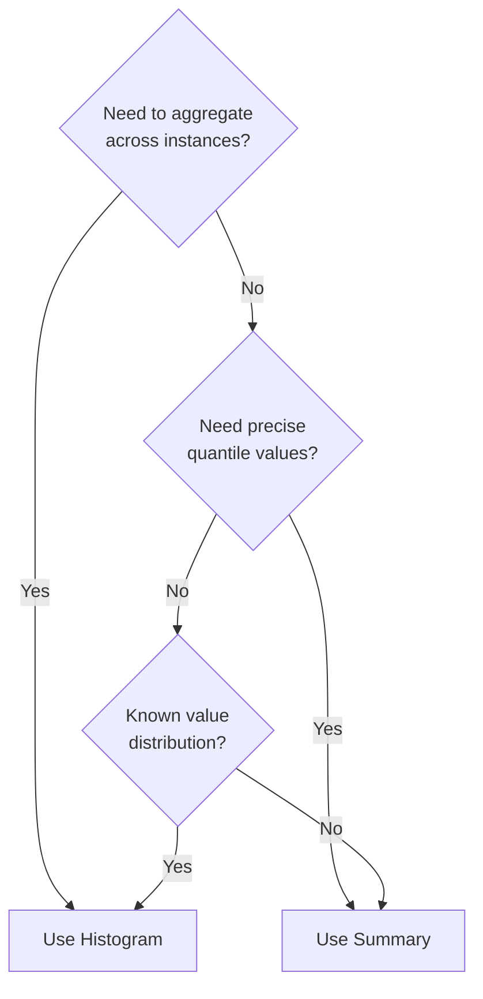
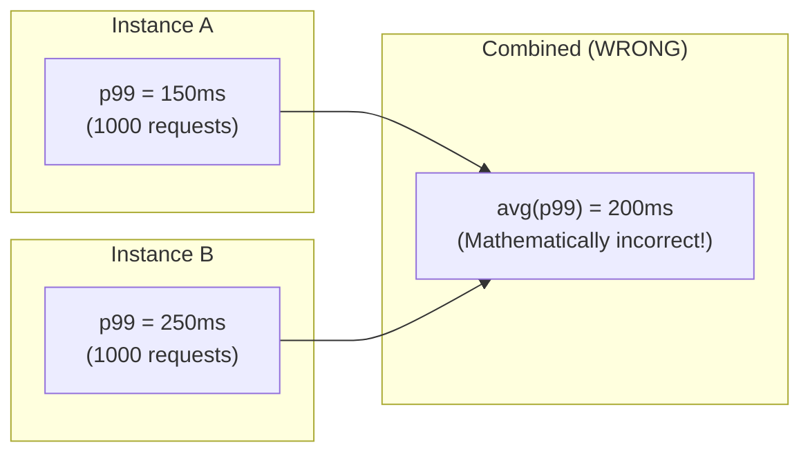
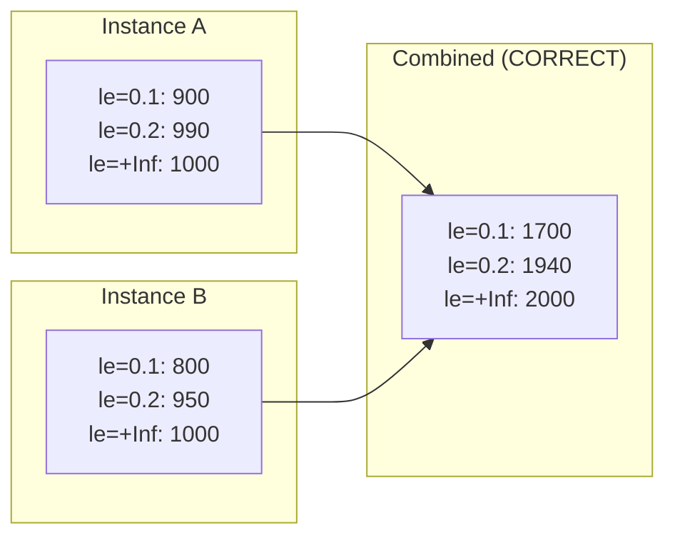
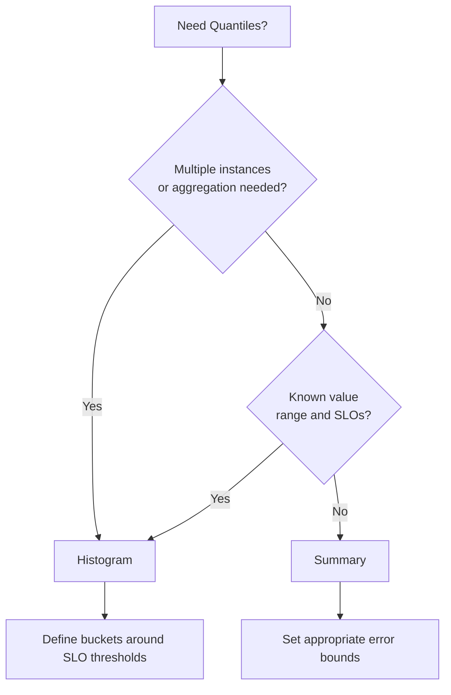

# How to Build Quantile Metrics

Author: [nawazdhandala](https://github.com/nawazdhandala)

Tags: Observability, Metrics, Monitoring, SRE

Description: Learn how to implement quantile-based metrics using summaries and histograms for distribution analysis.

---

## Introduction

When monitoring systems, averages often hide critical information. A service with a 200ms average response time might have 1% of requests taking 5 seconds, creating a terrible experience for those users. Quantile metrics solve this problem by showing the distribution of values, letting you answer questions like "What is the response time for the slowest 1% of requests?"

This guide covers how to build quantile metrics using two primary approaches: summaries (client-side calculation) and histograms (server-side calculation). Each has distinct trade-offs that affect accuracy, aggregation capabilities, and resource usage.

## What Are Quantiles?

A quantile represents the value below which a given percentage of observations fall. Common quantiles include:

- **p50 (median)**: 50% of values are below this threshold
- **p90**: 90% of values are below this threshold
- **p95**: 95% of values are below this threshold
- **p99**: 99% of values are below this threshold



## Two Approaches: Summary vs Histogram

There are two fundamental approaches to computing quantiles in monitoring systems:



### Summary (Client-Side Quantile Calculation)

Summaries calculate quantiles on the client (application) side using streaming algorithms. The application maintains a sliding time window and computes quantiles before exposing them to the monitoring system.

**How It Works:**

1. The application observes each value
2. A streaming algorithm (like t-digest or CKMS) maintains an approximate distribution
3. Pre-calculated quantile values are exposed at scrape time

**Example Implementation in Go:**

```go
package main

import (
    "net/http"
    "time"

    "github.com/prometheus/client_golang/prometheus"
    "github.com/prometheus/client_golang/prometheus/promhttp"
)

func main() {
    // Create a summary metric with specific quantile targets
    // The map keys are quantiles (0.5 = p50, 0.99 = p99)
    // The map values are acceptable errors for each quantile
    requestDuration := prometheus.NewSummary(prometheus.SummaryOpts{
        Name: "http_request_duration_seconds",
        Help: "HTTP request latency in seconds",

        // Define which quantiles to track and their acceptable error margins
        // Lower error = more memory usage but higher accuracy
        Objectives: map[float64]float64{
            0.5:  0.05,  // p50 with 5% error (actual p45-p55)
            0.9:  0.01,  // p90 with 1% error (actual p89-p91)
            0.95: 0.005, // p95 with 0.5% error
            0.99: 0.001, // p99 with 0.1% error
        },

        // Time window for the sliding window algorithm
        // Older observations are gradually removed
        MaxAge: 10 * time.Minute,

        // Number of buckets in the sliding window
        // More buckets = smoother decay but more memory
        AgeBuckets: 5,
    })

    // Register the metric with Prometheus
    prometheus.MustRegister(requestDuration)

    // Simulate observing request durations
    http.HandleFunc("/api", func(w http.ResponseWriter, r *http.Request) {
        // Record the start time
        start := time.Now()

        // ... handle the request ...

        // Observe the duration when the request completes
        // This updates the internal streaming algorithm
        requestDuration.Observe(time.Since(start).Seconds())
    })

    // Expose metrics endpoint for Prometheus to scrape
    http.Handle("/metrics", promhttp.Handler())
    http.ListenAndServe(":8080", nil)
}
```

**Exposed Metrics Format:**

```
# HELP http_request_duration_seconds HTTP request latency in seconds
# TYPE http_request_duration_seconds summary
http_request_duration_seconds{quantile="0.5"} 0.042
http_request_duration_seconds{quantile="0.9"} 0.087
http_request_duration_seconds{quantile="0.95"} 0.124
http_request_duration_seconds{quantile="0.99"} 0.351
http_request_duration_seconds_sum 8234.029
http_request_duration_seconds_count 147892
```

### Histogram (Server-Side Quantile Calculation)

Histograms count observations that fall into predefined buckets. Quantiles are calculated at query time by interpolating between bucket boundaries.

**How It Works:**

1. Define bucket boundaries upfront (e.g., 10ms, 25ms, 50ms, 100ms, ...)
2. For each observation, increment the counter for all buckets where value <= boundary
3. At query time, use bucket counts to estimate quantiles



**Example Implementation in Go:**

```go
package main

import (
    "net/http"
    "time"

    "github.com/prometheus/client_golang/prometheus"
    "github.com/prometheus/client_golang/prometheus/promhttp"
)

func main() {
    // Create a histogram metric with explicit bucket boundaries
    // Bucket selection is critical for accuracy
    requestDuration := prometheus.NewHistogram(prometheus.HistogramOpts{
        Name: "http_request_duration_seconds",
        Help: "HTTP request latency distribution in seconds",

        // Define bucket boundaries based on expected latency distribution
        // These boundaries should cover your SLO thresholds
        // Values are cumulative: le=0.1 counts all requests <= 100ms
        Buckets: []float64{
            0.005, // 5ms - very fast responses
            0.01,  // 10ms
            0.025, // 25ms
            0.05,  // 50ms
            0.1,   // 100ms - typical SLO threshold
            0.25,  // 250ms
            0.5,   // 500ms
            1.0,   // 1 second
            2.5,   // 2.5 seconds
            5.0,   // 5 seconds
            10.0,  // 10 seconds - timeout threshold
        },

        // Native histograms (Prometheus 2.40+) provide better accuracy
        // without predefined buckets using exponential bucketing
        // NativeHistogramBucketFactor: 1.1,
    })

    // Register with Prometheus
    prometheus.MustRegister(requestDuration)

    http.HandleFunc("/api", func(w http.ResponseWriter, r *http.Request) {
        start := time.Now()

        // ... handle the request ...

        // Observe the duration
        // This increments all bucket counters where value <= bucket boundary
        requestDuration.Observe(time.Since(start).Seconds())
    })

    http.Handle("/metrics", promhttp.Handler())
    http.ListenAndServe(":8080", nil)
}
```

**Exposed Metrics Format:**

```
# HELP http_request_duration_seconds HTTP request latency distribution
# TYPE http_request_duration_seconds histogram
http_request_duration_seconds_bucket{le="0.005"} 24054
http_request_duration_seconds_bucket{le="0.01"} 33444
http_request_duration_seconds_bucket{le="0.025"} 100392
http_request_duration_seconds_bucket{le="0.05"} 129389
http_request_duration_seconds_bucket{le="0.1"} 133988
http_request_duration_seconds_bucket{le="0.25"} 144320
http_request_duration_seconds_bucket{le="0.5"} 144789
http_request_duration_seconds_bucket{le="1"} 144823
http_request_duration_seconds_bucket{le="2.5"} 144860
http_request_duration_seconds_bucket{le="5"} 144869
http_request_duration_seconds_bucket{le="10"} 144870
http_request_duration_seconds_bucket{le="+Inf"} 144870
http_request_duration_seconds_sum 2693.042
http_request_duration_seconds_count 144870
```

**Querying Quantiles with PromQL:**

```promql
# Calculate p99 latency using histogram_quantile function
# This interpolates between bucket boundaries at query time
histogram_quantile(0.99, rate(http_request_duration_seconds_bucket[5m]))

# Calculate p99 latency aggregated across all instances
# sum() aggregates bucket counts, then histogram_quantile interpolates
histogram_quantile(
    0.99,
    sum by (le) (rate(http_request_duration_seconds_bucket[5m]))
)

# Calculate multiple quantiles for comparison
histogram_quantile(0.50, sum by (le) (rate(http_request_duration_seconds_bucket[5m])))
histogram_quantile(0.90, sum by (le) (rate(http_request_duration_seconds_bucket[5m])))
histogram_quantile(0.99, sum by (le) (rate(http_request_duration_seconds_bucket[5m])))
```

## Summary vs Histogram: Trade-offs

Understanding when to use each approach is crucial for building effective monitoring:



### Comparison Table

| Aspect | Summary | Histogram |
|--------|---------|-----------|
| **Quantile Calculation** | Client-side (application) | Server-side (query time) |
| **Aggregation** | Cannot aggregate quantiles | Can aggregate bucket counts |
| **Accuracy** | Configurable error bounds | Depends on bucket boundaries |
| **CPU Cost** | Higher on application | Higher on monitoring server |
| **Memory Cost** | Fixed per time window | Fixed per bucket count |
| **Flexibility** | Fixed quantiles at instrumentation | Any quantile at query time |
| **Bucket Configuration** | Not needed | Critical for accuracy |

### When to Use Summary

Choose summaries when:

1. **Single-instance applications**: No need to aggregate across multiple pods or instances
2. **Precise quantile requirements**: You need guaranteed error bounds on specific quantiles
3. **Unknown distributions**: You cannot predict bucket boundaries in advance
4. **Low cardinality**: Few label combinations

```go
// Good use case: Single-instance batch job with unpredictable durations
batchDuration := prometheus.NewSummary(prometheus.SummaryOpts{
    Name: "batch_job_duration_seconds",
    Help: "Duration of batch processing jobs",
    Objectives: map[float64]float64{
        0.5:  0.05,
        0.99: 0.001,
    },
})
```

### When to Use Histogram

Choose histograms when:

1. **Multi-instance deployments**: Need to aggregate quantiles across pods, instances, or regions
2. **SLO monitoring**: Bucket boundaries can align with SLO thresholds
3. **Flexible analysis**: Want to calculate any quantile at query time
4. **High cardinality**: Many label combinations where summary memory would be excessive

```go
// Good use case: Microservice with known SLO thresholds
// Bucket boundaries align with SLO: 100ms (good), 500ms (degraded), 1s (bad)
apiLatency := prometheus.NewHistogramVec(prometheus.HistogramOpts{
    Name:    "api_request_duration_seconds",
    Help:    "API request latency distribution",
    Buckets: []float64{0.01, 0.025, 0.05, 0.1, 0.25, 0.5, 1.0, 2.5},
}, []string{"method", "endpoint", "status_code"})
```

## Implementing Histogram Bucket Selection

Choosing appropriate bucket boundaries is one of the most important decisions when using histograms. Poor bucket selection leads to inaccurate quantile estimates.

### Linear Buckets

Use for distributions with a known, narrow range:

```go
// Linear buckets from 0 to 1 second in 100ms increments
// Good for: response times with predictable upper bounds
buckets := prometheus.LinearBuckets(
    0.0,  // Start value
    0.1,  // Width of each bucket
    10,   // Number of buckets
)
// Result: [0, 0.1, 0.2, 0.3, 0.4, 0.5, 0.6, 0.7, 0.8, 0.9]
```

### Exponential Buckets

Use for distributions spanning multiple orders of magnitude:

```go
// Exponential buckets from 1ms to ~8 seconds
// Good for: request latencies with high variance
buckets := prometheus.ExponentialBuckets(
    0.001, // Start value (1ms)
    2,     // Factor (each bucket is 2x the previous)
    14,    // Number of buckets
)
// Result: [0.001, 0.002, 0.004, 0.008, 0.016, 0.032, 0.064,
//          0.128, 0.256, 0.512, 1.024, 2.048, 4.096, 8.192]
```

### SLO-Aligned Buckets

Design buckets around your service level objectives:

```go
// Custom buckets aligned with SLO thresholds
// SLO: 99% of requests under 500ms, 99.9% under 1 second
buckets := []float64{
    0.005,  // 5ms - cache hits
    0.01,   // 10ms
    0.025,  // 25ms
    0.05,   // 50ms
    0.1,    // 100ms - typical target
    0.25,   // 250ms
    0.5,    // 500ms - SLO threshold
    1.0,    // 1s - hard SLO threshold
    2.5,    // 2.5s - degraded
    5.0,    // 5s - failing
}
```

### Native Histograms (Prometheus 2.40+)

Native histograms automatically determine bucket boundaries using exponential bucketing, eliminating the need for manual configuration:

```go
// Native histogram with automatic bucket boundaries
requestDuration := prometheus.NewHistogram(prometheus.HistogramOpts{
    Name: "http_request_duration_seconds",
    Help: "HTTP request latency with native histogram",

    // Enable native histogram with growth factor of 1.1
    // Each bucket boundary is 1.1x the previous
    // Provides consistent relative error across all values
    NativeHistogramBucketFactor: 1.1,

    // Maximum number of buckets (prevents memory explosion)
    NativeHistogramMaxBucketNumber: 100,

    // Minimum value to track (prevents tiny bucket creation)
    NativeHistogramMinResetDuration: time.Hour,
})
```

## Aggregating Quantiles Across Instances

One of the most important differences between summaries and histograms is aggregation capability.

### The Aggregation Problem with Summaries

Summaries expose pre-calculated quantiles. You **cannot** mathematically combine p99 values from multiple instances to get an accurate overall p99:



The actual combined p99 depends on the full distribution of both instances, which is lost when pre-calculating quantiles.

### Correct Aggregation with Histograms

Histograms store bucket counts, which can be summed correctly:



**PromQL for Aggregated Quantiles:**

```promql
# Aggregate bucket counts across all instances, then calculate quantile
histogram_quantile(
    0.99,
    sum by (le) (
        rate(http_request_duration_seconds_bucket[5m])
    )
)

# Aggregate by region for regional p99
histogram_quantile(
    0.99,
    sum by (le, region) (
        rate(http_request_duration_seconds_bucket[5m])
    )
)
```

## Building a Complete Monitoring Solution

Here is a complete example combining histograms for aggregatable metrics with practical patterns:

```go
package main

import (
    "context"
    "log"
    "math/rand"
    "net/http"
    "time"

    "github.com/prometheus/client_golang/prometheus"
    "github.com/prometheus/client_golang/prometheus/promhttp"
)

// MetricsCollector holds all application metrics
type MetricsCollector struct {
    // Request duration histogram for SLO monitoring
    // Using histogram enables aggregation across pods
    requestDuration *prometheus.HistogramVec

    // Request counter for throughput monitoring
    requestTotal *prometheus.CounterVec

    // In-flight requests gauge for concurrency monitoring
    requestsInFlight *prometheus.GaugeVec
}

// NewMetricsCollector creates and registers all metrics
func NewMetricsCollector(reg prometheus.Registerer) *MetricsCollector {
    m := &MetricsCollector{
        requestDuration: prometheus.NewHistogramVec(
            prometheus.HistogramOpts{
                Name: "http_request_duration_seconds",
                Help: "HTTP request latency distribution",
                // Buckets aligned with SLO thresholds:
                // - Target: 99% under 100ms
                // - Warning: 95% under 250ms
                // - Critical: 90% under 500ms
                Buckets: []float64{
                    0.005, 0.01, 0.025, 0.05,
                    0.1,   // SLO target threshold
                    0.25,  // Warning threshold
                    0.5,   // Critical threshold
                    1.0, 2.5, 5.0, 10.0,
                },
            },
            []string{"method", "path", "status"},
        ),

        requestTotal: prometheus.NewCounterVec(
            prometheus.CounterOpts{
                Name: "http_requests_total",
                Help: "Total HTTP requests processed",
            },
            []string{"method", "path", "status"},
        ),

        requestsInFlight: prometheus.NewGaugeVec(
            prometheus.GaugeOpts{
                Name: "http_requests_in_flight",
                Help: "Current number of HTTP requests being processed",
            },
            []string{"method", "path"},
        ),
    }

    // Register all metrics
    reg.MustRegister(m.requestDuration)
    reg.MustRegister(m.requestTotal)
    reg.MustRegister(m.requestsInFlight)

    return m
}

// InstrumentHandler wraps an HTTP handler with metrics
func (m *MetricsCollector) InstrumentHandler(
    path string,
    handler http.HandlerFunc,
) http.HandlerFunc {
    return func(w http.ResponseWriter, r *http.Request) {
        // Track in-flight requests
        m.requestsInFlight.WithLabelValues(r.Method, path).Inc()
        defer m.requestsInFlight.WithLabelValues(r.Method, path).Dec()

        // Record start time
        start := time.Now()

        // Wrap response writer to capture status code
        wrapped := &statusRecorder{ResponseWriter: w, status: 200}

        // Call the actual handler
        handler(wrapped, r)

        // Record metrics after request completes
        duration := time.Since(start).Seconds()
        status := http.StatusText(wrapped.status)

        m.requestDuration.WithLabelValues(r.Method, path, status).Observe(duration)
        m.requestTotal.WithLabelValues(r.Method, path, status).Inc()
    }
}

// statusRecorder wraps http.ResponseWriter to capture status code
type statusRecorder struct {
    http.ResponseWriter
    status int
}

func (r *statusRecorder) WriteHeader(code int) {
    r.status = code
    r.ResponseWriter.WriteHeader(code)
}

func main() {
    // Create a new registry (recommended over default global registry)
    reg := prometheus.NewRegistry()

    // Add Go runtime metrics
    reg.MustRegister(prometheus.NewGoCollector())
    reg.MustRegister(prometheus.NewProcessCollector(prometheus.ProcessCollectorOpts{}))

    // Create our application metrics
    metrics := NewMetricsCollector(reg)

    // Define handlers with instrumentation
    http.HandleFunc("/api/users", metrics.InstrumentHandler("/api/users", handleUsers))
    http.HandleFunc("/api/orders", metrics.InstrumentHandler("/api/orders", handleOrders))

    // Expose metrics endpoint
    http.Handle("/metrics", promhttp.HandlerFor(reg, promhttp.HandlerOpts{
        EnableOpenMetrics: true,
    }))

    log.Println("Starting server on :8080")
    log.Fatal(http.ListenAndServe(":8080", nil))
}

// Simulated handlers with realistic latency patterns
func handleUsers(w http.ResponseWriter, r *http.Request) {
    // Simulate variable latency (mostly fast, occasional slow)
    latency := time.Duration(rand.ExpFloat64()*50) * time.Millisecond
    time.Sleep(latency)
    w.WriteHeader(http.StatusOK)
}

func handleOrders(w http.ResponseWriter, r *http.Request) {
    // Simulate database-heavy endpoint with higher latency
    latency := time.Duration(rand.ExpFloat64()*150) * time.Millisecond
    time.Sleep(latency)
    w.WriteHeader(http.StatusOK)
}
```

## Common PromQL Queries for Quantile Analysis

Here are essential queries for monitoring quantile metrics:

```promql
# P99 latency over 5 minutes, aggregated across all instances
histogram_quantile(
    0.99,
    sum by (le) (rate(http_request_duration_seconds_bucket[5m]))
)

# P99 latency by endpoint
histogram_quantile(
    0.99,
    sum by (le, path) (rate(http_request_duration_seconds_bucket[5m]))
)

# SLO compliance: percentage of requests under 100ms
sum(rate(http_request_duration_seconds_bucket{le="0.1"}[5m]))
/
sum(rate(http_request_duration_seconds_count[5m]))
* 100

# Apdex score (satisfied < 100ms, tolerating < 500ms)
(
    sum(rate(http_request_duration_seconds_bucket{le="0.1"}[5m]))
    + sum(rate(http_request_duration_seconds_bucket{le="0.5"}[5m]))
      - sum(rate(http_request_duration_seconds_bucket{le="0.1"}[5m]))
    * 0.5
)
/
sum(rate(http_request_duration_seconds_count[5m]))

# Compare p50, p90, p99 to identify distribution shape
label_replace(
    histogram_quantile(0.50, sum by (le) (rate(http_request_duration_seconds_bucket[5m]))),
    "quantile", "p50", "", ""
)
or
label_replace(
    histogram_quantile(0.90, sum by (le) (rate(http_request_duration_seconds_bucket[5m]))),
    "quantile", "p90", "", ""
)
or
label_replace(
    histogram_quantile(0.99, sum by (le) (rate(http_request_duration_seconds_bucket[5m]))),
    "quantile", "p99", "", ""
)
```

## Best Practices

### 1. Choose the Right Metric Type



### 2. Align Buckets with SLOs

Your histogram buckets should include your SLO thresholds as boundaries. If your SLO is "99% of requests under 200ms", ensure 0.2 is a bucket boundary.

### 3. Monitor Bucket Overflow

Track how many observations fall into your highest bucket. If significant traffic lands in `+Inf`, you need higher bucket boundaries:

```promql
# Percentage of requests exceeding highest finite bucket (10s)
(
    sum(rate(http_request_duration_seconds_bucket{le="+Inf"}[5m]))
    - sum(rate(http_request_duration_seconds_bucket{le="10"}[5m]))
)
/
sum(rate(http_request_duration_seconds_count[5m]))
* 100
```

### 4. Use Labels Carefully

High cardinality labels multiply the cost of histograms. Each unique label combination creates a full set of bucket counters:

```go
// AVOID: High cardinality from user_id
histogram.WithLabelValues(method, path, userId) // Creates millions of series

// BETTER: Use bounded, low-cardinality labels
histogram.WithLabelValues(method, path, statusClass) // Creates hundreds of series
```

### 5. Consider Native Histograms

For new deployments using Prometheus 2.40+, native histograms provide better accuracy without manual bucket configuration. They use exponential bucketing with a configurable resolution factor.

## Conclusion

Quantile metrics are essential for understanding the real user experience in your systems. Averages hide outliers, but quantiles expose them. When implementing quantile metrics:

- Use **histograms** when you need to aggregate across instances or want flexibility in quantile selection at query time
- Use **summaries** for single-instance applications or when you need precise error bounds on specific quantiles
- Align histogram bucket boundaries with your SLO thresholds
- Consider native histograms for simpler configuration with automatic bucket selection

By following these patterns, you can build monitoring that accurately reflects user experience and enables data-driven SLO management.
