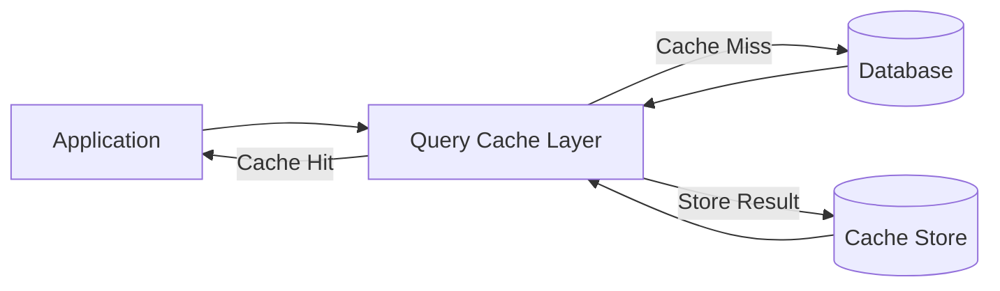
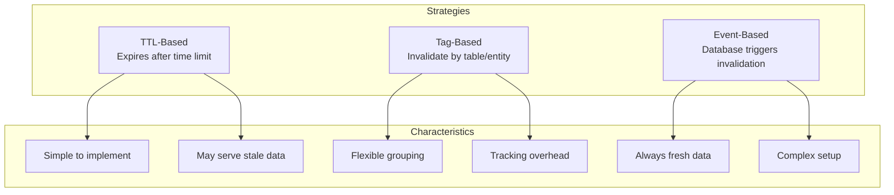
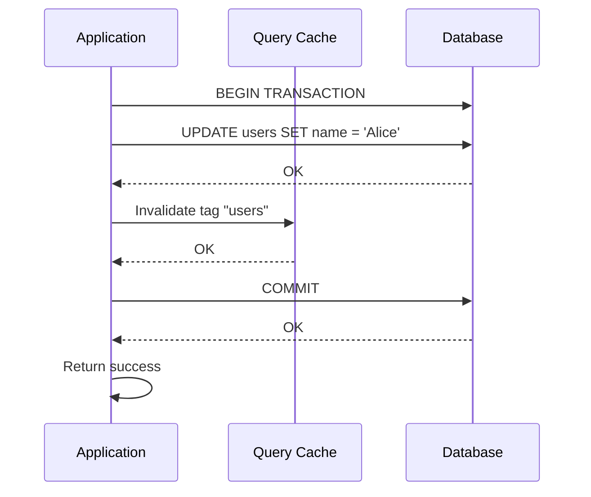

# How to Implement Query Cache Design

Author: [nawazdhandala](https://github.com/nawazdhandala)

Tags: Caching, Query, Database, Performance

Description: Learn to implement query cache design for caching SQL query results efficiently.

---

Database queries often become the bottleneck in application performance. Even with proper indexing, repeated identical queries consume database resources and add latency. Query caching stores the results of SQL queries so subsequent identical requests return cached data instead of hitting the database again.

This guide covers the core concepts, implementation patterns, and cache invalidation strategies for building an effective query cache.

## Why Query Caching?

Every database query involves parsing SQL, generating an execution plan, reading from disk or memory, and serializing results. For read-heavy workloads with repetitive queries, this work gets duplicated thousands of times.

Query caching eliminates this redundancy by storing query results keyed by the query itself. The benefits compound as traffic increases.

| Metric | Without Cache | With Query Cache |
|--------|---------------|------------------|
| Average latency | 50-200ms | 1-5ms |
| Database load | High | Reduced by 60-90% |
| Throughput | Limited by DB | Scales with cache |
| Cost | More DB replicas needed | Fewer DB resources |

## Architecture Overview

A query cache sits between your application and database. When a query arrives, the cache layer checks for existing results before forwarding to the database.



The cache key typically combines the SQL query text and its parameters. This ensures different parameter values produce different cache entries.

## Cache Key Generation

The foundation of query caching is generating consistent, unique keys for each query. Here is a Python implementation that handles parameterized queries.

```python
import hashlib
import json
from typing import Any, Dict, List, Optional, Tuple

class QueryCacheKey:
    def __init__(self, prefix: str = "qc"):
        # Prefix helps namespace cache keys across services
        self.prefix = prefix

    def generate(
        self,
        query: str,
        params: Optional[Tuple[Any, ...]] = None,
        context: Optional[Dict[str, Any]] = None
    ) -> str:
        # Normalize whitespace to match semantically identical queries
        normalized_query = " ".join(query.split())

        # Build the key components
        key_parts = {
            "query": normalized_query,
            "params": params or (),
            "context": context or {}
        }

        # Create deterministic JSON representation
        key_string = json.dumps(key_parts, sort_keys=True, default=str)

        # Hash to keep keys short and fixed length
        query_hash = hashlib.sha256(key_string.encode()).hexdigest()[:16]

        return f"{self.prefix}:{query_hash}"
```

The key generator normalizes whitespace in queries so that formatting differences do not create duplicate cache entries. Parameters and optional context (like user tenant ID) become part of the key.

## Basic Query Cache Implementation

This implementation wraps a database connection and intercepts queries to check the cache first.

```python
import asyncio
from typing import Any, Dict, List, Optional
import aioredis
import asyncpg

class QueryCache:
    def __init__(
        self,
        db_pool: asyncpg.Pool,
        redis_url: str,
        default_ttl: int = 300
    ):
        self.db_pool = db_pool
        self.redis_url = redis_url
        self.default_ttl = default_ttl
        self.cache = None
        self.key_generator = QueryCacheKey()

    async def connect(self):
        self.cache = await aioredis.from_url(self.redis_url)

    async def execute(
        self,
        query: str,
        params: tuple = (),
        ttl: Optional[int] = None,
        bypass_cache: bool = False
    ) -> List[Dict[str, Any]]:
        cache_key = self.key_generator.generate(query, params)
        ttl = ttl or self.default_ttl

        # Check cache first unless explicitly bypassed
        if not bypass_cache:
            cached = await self._get_cached(cache_key)
            if cached is not None:
                return cached

        # Cache miss: execute query against database
        async with self.db_pool.acquire() as conn:
            rows = await conn.fetch(query, *params)
            result = [dict(row) for row in rows]

        # Store result in cache for future requests
        await self._set_cached(cache_key, result, ttl)

        return result

    async def _get_cached(self, key: str) -> Optional[List[Dict]]:
        data = await self.cache.get(key)
        if data:
            return json.loads(data)
        return None

    async def _set_cached(self, key: str, data: List[Dict], ttl: int):
        await self.cache.set(key, json.dumps(data, default=str), ex=ttl)
```

## Cache Invalidation Strategies

The hardest part of query caching is knowing when to invalidate. Stale data causes bugs that are difficult to trace. Three main strategies exist, each with different trade-offs.



### Tag-Based Invalidation

Tag-based invalidation groups cache entries by the tables they depend on. When a table changes, all related cache entries get invalidated.

```python
import json
from typing import Any, Dict, List, Set
import aioredis

class TaggedQueryCache:
    def __init__(self, redis_url: str):
        self.redis_url = redis_url
        self.cache = None
        self.key_generator = QueryCacheKey()

    async def connect(self):
        self.cache = await aioredis.from_url(self.redis_url)

    async def set_with_tags(
        self,
        query: str,
        params: tuple,
        result: List[Dict],
        tags: Set[str],
        ttl: int = 300
    ):
        cache_key = self.key_generator.generate(query, params)

        # Store the result
        await self.cache.set(
            cache_key,
            json.dumps(result, default=str),
            ex=ttl
        )

        # Associate this key with each tag
        # Tags are typically table names like "users", "orders"
        for tag in tags:
            tag_key = f"tag:{tag}"
            await self.cache.sadd(tag_key, cache_key)
            await self.cache.expire(tag_key, ttl + 60)

    async def invalidate_by_tag(self, tag: str):
        tag_key = f"tag:{tag}"

        # Get all cache keys associated with this tag
        keys = await self.cache.smembers(tag_key)

        if keys:
            # Delete all associated cache entries
            await self.cache.delete(*keys)
            await self.cache.delete(tag_key)

    async def invalidate_by_tags(self, tags: Set[str]):
        # Invalidate multiple tags in parallel
        await asyncio.gather(*[
            self.invalidate_by_tag(tag) for tag in tags
        ])
```

Usage example showing how tags connect queries to tables.

```python
# Cache a query that joins users and orders
cache = TaggedQueryCache("redis://localhost:6379")
await cache.connect()

query = """
    SELECT u.name, o.total
    FROM users u
    JOIN orders o ON u.id = o.user_id
    WHERE u.id = $1
"""
result = await db.fetch(query, user_id)

# Tag with both tables this query depends on
await cache.set_with_tags(
    query,
    (user_id,),
    result,
    tags={"users", "orders"},
    ttl=600
)

# Later, when an order is updated
await cache.invalidate_by_tag("orders")
```

## Write-Through Pattern

For applications that need strong consistency, the write-through pattern updates the cache alongside the database in the same transaction.



Here is an implementation that wraps database writes with cache invalidation.

```python
from contextlib import asynccontextmanager
from typing import Set

class CachedDatabase:
    def __init__(self, db_pool, cache: TaggedQueryCache):
        self.db_pool = db_pool
        self.cache = cache

    @asynccontextmanager
    async def transaction(self, invalidate_tags: Set[str]):
        async with self.db_pool.acquire() as conn:
            async with conn.transaction():
                try:
                    yield conn
                    # Invalidate cache after successful commit
                    await self.cache.invalidate_by_tags(invalidate_tags)
                except Exception:
                    # Transaction rolled back, cache remains valid
                    raise

    async def update_user(self, user_id: int, name: str):
        # Specify which tags to invalidate on success
        async with self.transaction(invalidate_tags={"users"}) as conn:
            await conn.execute(
                "UPDATE users SET name = $1 WHERE id = $2",
                name, user_id
            )
```

## Performance Monitoring

Track cache effectiveness with these metrics to tune TTLs and identify problem queries.

| Metric | Target | Action if Off-Target |
|--------|--------|----------------------|
| Hit rate | Above 80% | Increase TTL or review query patterns |
| Latency P99 | Under 10ms | Check Redis connection pooling |
| Memory usage | Under 70% | Reduce TTL or enable eviction |
| Invalidation rate | Under 100/sec | Batch invalidations or use TTL |

Here is a decorator that adds metrics to cache operations.

```python
import time
from functools import wraps

class CacheMetrics:
    def __init__(self):
        self.hits = 0
        self.misses = 0
        self.latencies = []

    def record_hit(self):
        self.hits += 1

    def record_miss(self):
        self.misses += 1

    def record_latency(self, ms: float):
        self.latencies.append(ms)

    @property
    def hit_rate(self) -> float:
        total = self.hits + self.misses
        return self.hits / total if total > 0 else 0.0

def with_metrics(metrics: CacheMetrics):
    def decorator(func):
        @wraps(func)
        async def wrapper(*args, **kwargs):
            start = time.perf_counter()
            result = await func(*args, **kwargs)
            elapsed_ms = (time.perf_counter() - start) * 1000
            metrics.record_latency(elapsed_ms)
            return result
        return wrapper
    return decorator
```

## Common Pitfalls

Avoid these mistakes when implementing query caching.

**Caching user-specific data without context**: Always include user or tenant identifiers in cache keys when results vary by user.

**Over-aggressive TTLs**: Setting TTLs too high leads to stale data. Start with 5 minutes and adjust based on data change frequency.

**Ignoring cache stampedes**: When a popular cache entry expires, many requests hit the database simultaneously. Use probabilistic early expiration or locking to prevent this.

**Not handling serialization edge cases**: Dates, decimals, and custom types need explicit serialization handling.

## Conclusion

Query caching dramatically reduces database load and improves response times for read-heavy applications. Start with TTL-based expiration for simplicity, then add tag-based invalidation as your consistency requirements grow.

The key to successful query caching is thoughtful invalidation. Map your queries to the tables they depend on and invalidate aggressively. A cache miss is always better than serving stale data.

Monitor your hit rates and latencies from day one. The metrics will guide your TTL tuning and help identify queries that should not be cached at all.
