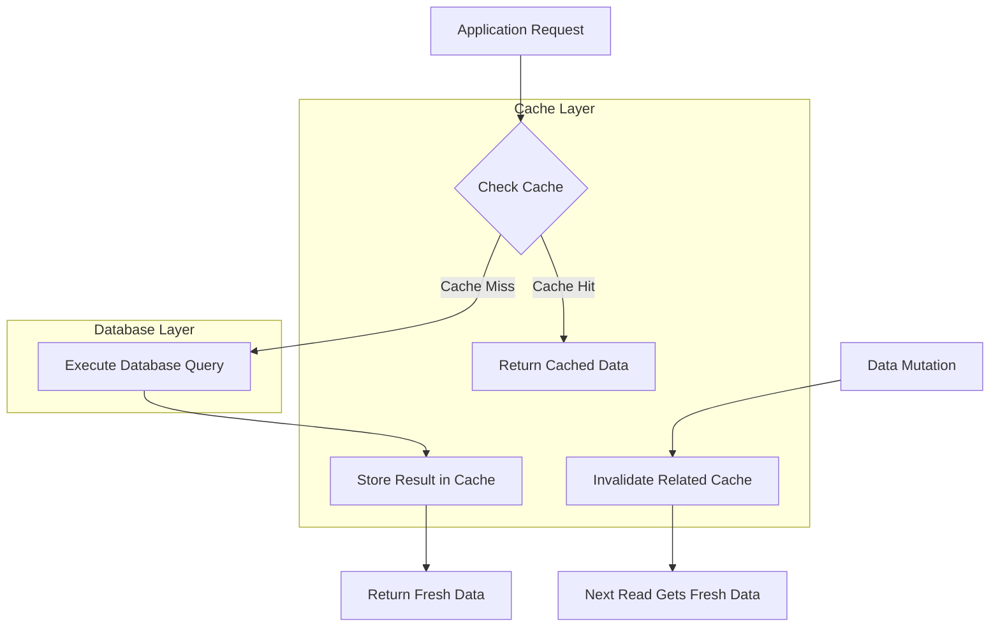
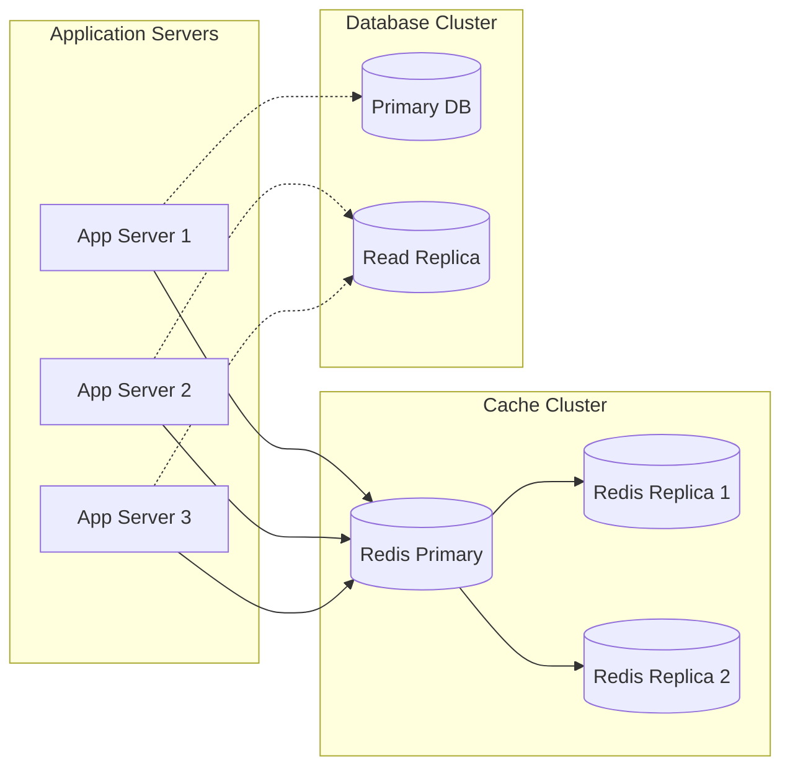

# How to Build Query Caching Strategies

Author: [nawazdhandala](https://github.com/nawazdhandala)

Tags: Database, Caching, Performance, Optimization

Description: Learn how to implement effective query caching strategies to dramatically improve database performance and reduce query latency.

---

Database performance is critical for modern applications. As your data grows and traffic increases, database queries can become a significant bottleneck. Query caching is one of the most effective techniques to improve performance by storing query results and serving them from memory instead of hitting the database repeatedly. In this guide, we will explore various query caching strategies, implementation patterns, and best practices.

## Why Query Caching Matters

Before diving into strategies, let us understand the problem. Consider a typical web application:

- A user requests a product page
- The application queries the database for product details
- The database parses the query, creates an execution plan, fetches data from disk, and returns results
- This process repeats for every user, even for identical queries

With caching, the first query result is stored in memory. Subsequent identical queries return the cached result instantly, bypassing the expensive database operations.

## Query Cache Types

### 1. Database-Level Query Cache

Many databases include built-in query caching mechanisms.

**MySQL Query Cache (Legacy)**

MySQL historically had a built-in query cache, though it was removed in MySQL 8.0 due to scalability issues with high-throughput workloads.

```sql
-- Check if query cache is enabled (MySQL 5.7 and earlier)
SHOW VARIABLES LIKE 'query_cache%';

-- Query cache configuration
query_cache_type = 1
query_cache_size = 64M
query_cache_limit = 2M
```

**PostgreSQL Shared Buffers**

PostgreSQL does not have a traditional query cache but uses shared buffers to cache data pages.

```sql
-- Check shared buffer configuration
SHOW shared_buffers;

-- View buffer cache hit ratio
SELECT
    sum(heap_blks_read) as heap_read,
    sum(heap_blks_hit) as heap_hit,
    sum(heap_blks_hit) / (sum(heap_blks_hit) + sum(heap_blks_read)) as ratio
FROM pg_statio_user_tables;
```

### 2. Application-Level Query Cache

Application-level caching gives you fine-grained control over what gets cached and for how long.

```typescript
// TypeScript example using a simple in-memory cache
interface CacheEntry<T> {
    data: T;
    expiry: number;
}

class QueryCache {
    private cache: Map<string, CacheEntry<any>> = new Map();

    // Generate a unique cache key from query and parameters
    private generateKey(query: string, params: any[]): string {
        return `${query}:${JSON.stringify(params)}`;
    }

    // Get cached result or execute query
    async get<T>(
        query: string,
        params: any[],
        ttlSeconds: number,
        executor: () => Promise<T>
    ): Promise<T> {
        const key = this.generateKey(query, params);
        const now = Date.now();

        // Check if cached and not expired
        const cached = this.cache.get(key);
        if (cached && cached.expiry > now) {
            console.log('Cache hit for:', key);
            return cached.data as T;
        }

        // Execute query and cache result
        console.log('Cache miss for:', key);
        const result = await executor();

        this.cache.set(key, {
            data: result,
            expiry: now + (ttlSeconds * 1000)
        });

        return result;
    }

    // Invalidate specific cache entry
    invalidate(query: string, params: any[]): void {
        const key = this.generateKey(query, params);
        this.cache.delete(key);
    }

    // Clear all cached entries
    clear(): void {
        this.cache.clear();
    }
}
```

### 3. Distributed Query Cache

For distributed systems, a centralized cache like Redis ensures consistency across multiple application instances.

```typescript
// Redis-based distributed query cache
import Redis from 'ioredis';

class DistributedQueryCache {
    private redis: Redis;
    private prefix: string = 'query_cache:';

    constructor(redisUrl: string) {
        this.redis = new Redis(redisUrl);
    }

    // Generate cache key with prefix
    private getKey(query: string, params: any[]): string {
        const hash = this.hashQuery(query, params);
        return `${this.prefix}${hash}`;
    }

    // Create a hash from query and parameters
    private hashQuery(query: string, params: any[]): string {
        const crypto = require('crypto');
        const data = `${query}:${JSON.stringify(params)}`;
        return crypto.createHash('sha256').update(data).digest('hex');
    }

    // Get or set cache with TTL
    async getOrSet<T>(
        query: string,
        params: any[],
        ttlSeconds: number,
        executor: () => Promise<T>
    ): Promise<T> {
        const key = this.getKey(query, params);

        // Try to get from cache
        const cached = await this.redis.get(key);
        if (cached) {
            return JSON.parse(cached) as T;
        }

        // Execute query and store result
        const result = await executor();
        await this.redis.setex(key, ttlSeconds, JSON.stringify(result));

        return result;
    }

    // Invalidate by pattern (useful for table-level invalidation)
    async invalidateByPattern(pattern: string): Promise<void> {
        const keys = await this.redis.keys(`${this.prefix}${pattern}*`);
        if (keys.length > 0) {
            await this.redis.del(...keys);
        }
    }
}
```

## Cache Flow Architecture

Here is how a typical query caching system works:



## Cache Invalidation Strategies

Cache invalidation is often called one of the hardest problems in computer science. Here are proven strategies to handle it.

### 1. Time-Based Expiration (TTL)

The simplest approach is to set a time-to-live for cached entries.

```typescript
// TTL-based cache configuration
interface CacheConfig {
    // Short TTL for frequently changing data
    userSessions: 300,      // 5 minutes

    // Medium TTL for moderately stable data
    productCatalog: 3600,   // 1 hour

    // Long TTL for rarely changing data
    staticContent: 86400    // 24 hours
}

// Implementation example
async function getCachedProducts(categoryId: string): Promise<Product[]> {
    const cacheKey = `products:category:${categoryId}`;
    const ttl = CacheConfig.productCatalog;

    return cache.getOrSet(cacheKey, ttl, async () => {
        return await db.query(
            'SELECT * FROM products WHERE category_id = $1',
            [categoryId]
        );
    });
}
```

### 2. Event-Based Invalidation

Invalidate cache entries when the underlying data changes.

```typescript
// Event-based cache invalidation system
class CacheInvalidator {
    private cache: DistributedQueryCache;
    private eventBus: EventEmitter;

    constructor(cache: DistributedQueryCache) {
        this.cache = cache;
        this.eventBus = new EventEmitter();
        this.setupListeners();
    }

    // Set up event listeners for data changes
    private setupListeners(): void {
        // When a product is updated
        this.eventBus.on('product:updated', async (productId: string) => {
            await this.cache.invalidateByPattern(`product:${productId}`);
            await this.cache.invalidateByPattern('products:category:');
            await this.cache.invalidateByPattern('products:search:');
        });

        // When a user is updated
        this.eventBus.on('user:updated', async (userId: string) => {
            await this.cache.invalidateByPattern(`user:${userId}`);
        });

        // When inventory changes
        this.eventBus.on('inventory:changed', async (productId: string) => {
            await this.cache.invalidateByPattern(`product:${productId}:stock`);
        });
    }

    // Emit events from your data access layer
    emitChange(event: string, entityId: string): void {
        this.eventBus.emit(event, entityId);
    }
}
```

### 3. Write-Through Cache

Update the cache immediately when data is written to the database.

```typescript
// Write-through caching pattern
class WriteThroughCache {
    private cache: DistributedQueryCache;
    private db: Database;

    async updateProduct(
        productId: string,
        updates: Partial<Product>
    ): Promise<Product> {
        // Update database first
        const updatedProduct = await this.db.query(
            'UPDATE products SET name = $1, price = $2 WHERE id = $3 RETURNING *',
            [updates.name, updates.price, productId]
        );

        // Immediately update cache with new data
        const cacheKey = `product:${productId}`;
        await this.cache.set(cacheKey, updatedProduct, 3600);

        return updatedProduct;
    }

    async getProduct(productId: string): Promise<Product> {
        const cacheKey = `product:${productId}`;

        return this.cache.getOrSet(cacheKey, 3600, async () => {
            return await this.db.query(
                'SELECT * FROM products WHERE id = $1',
                [productId]
            );
        });
    }
}
```

### 4. Cache Versioning

Use version numbers to invalidate entire cache namespaces.

```typescript
// Version-based cache invalidation
class VersionedCache {
    private cache: DistributedQueryCache;
    private versionKey: string = 'cache:version:';

    // Get current version for a namespace
    async getVersion(namespace: string): Promise<number> {
        const version = await this.cache.get(`${this.versionKey}${namespace}`);
        return version ? parseInt(version) : 1;
    }

    // Increment version to invalidate all entries in namespace
    async incrementVersion(namespace: string): Promise<void> {
        await this.cache.incr(`${this.versionKey}${namespace}`);
    }

    // Get cached data with version in key
    async getCached<T>(
        namespace: string,
        key: string,
        ttl: number,
        executor: () => Promise<T>
    ): Promise<T> {
        const version = await this.getVersion(namespace);
        const versionedKey = `${namespace}:v${version}:${key}`;

        return this.cache.getOrSet(versionedKey, ttl, executor);
    }
}

// Usage example
const cache = new VersionedCache(redisCache);

// Get products with versioned cache key
const products = await cache.getCached(
    'products',
    'category:electronics',
    3600,
    () => db.getProductsByCategory('electronics')
);

// Invalidate all product cache entries by incrementing version
await cache.incrementVersion('products');
```

## Distributed Query Caching Architecture

For large-scale applications, you need a distributed caching architecture.



### Implementing Distributed Cache with Redis Cluster

```typescript
// Redis Cluster configuration for distributed caching
import Redis from 'ioredis';

class RedisClusterCache {
    private cluster: Redis.Cluster;

    constructor() {
        // Configure Redis Cluster nodes
        this.cluster = new Redis.Cluster([
            { host: 'redis-node-1', port: 6379 },
            { host: 'redis-node-2', port: 6379 },
            { host: 'redis-node-3', port: 6379 }
        ], {
            // Retry strategy for resilience
            clusterRetryStrategy: (times) => {
                return Math.min(times * 100, 3000);
            },
            // Enable read from replicas for better performance
            scaleReads: 'slave'
        });
    }

    // Cache query with automatic sharding
    async cacheQuery<T>(
        queryId: string,
        params: any[],
        ttl: number,
        executor: () => Promise<T>
    ): Promise<T> {
        // Redis Cluster automatically shards based on key
        const key = `query:{${queryId}}:${JSON.stringify(params)}`;

        const cached = await this.cluster.get(key);
        if (cached) {
            return JSON.parse(cached);
        }

        const result = await executor();
        await this.cluster.setex(key, ttl, JSON.stringify(result));

        return result;
    }

    // Use hash tags for related keys to ensure same shard
    async cacheRelatedQueries(
        entityType: string,
        entityId: string,
        queries: Map<string, () => Promise<any>>
    ): Promise<void> {
        // Hash tag {entityType:entityId} ensures all related keys on same shard
        const pipeline = this.cluster.pipeline();

        for (const [queryName, executor] of queries) {
            const key = `{${entityType}:${entityId}}:${queryName}`;
            const result = await executor();
            pipeline.setex(key, 3600, JSON.stringify(result));
        }

        await pipeline.exec();
    }
}
```

## Application-Level Caching Patterns

### Repository Pattern with Caching

```typescript
// Repository pattern with integrated caching
interface User {
    id: string;
    email: string;
    name: string;
}

class UserRepository {
    private db: Database;
    private cache: DistributedQueryCache;
    private cacheTTL: number = 1800; // 30 minutes

    constructor(db: Database, cache: DistributedQueryCache) {
        this.db = db;
        this.cache = cache;
    }

    // Find user by ID with caching
    async findById(userId: string): Promise<User | null> {
        const cacheKey = `user:${userId}`;

        return this.cache.getOrSet(cacheKey, this.cacheTTL, async () => {
            const result = await this.db.query(
                'SELECT id, email, name FROM users WHERE id = $1',
                [userId]
            );
            return result.rows[0] || null;
        });
    }

    // Find users by IDs with batch caching
    async findByIds(userIds: string[]): Promise<User[]> {
        const users: User[] = [];
        const uncachedIds: string[] = [];

        // Check cache for each user
        for (const id of userIds) {
            const cached = await this.cache.get(`user:${id}`);
            if (cached) {
                users.push(cached);
            } else {
                uncachedIds.push(id);
            }
        }

        // Fetch uncached users from database
        if (uncachedIds.length > 0) {
            const result = await this.db.query(
                'SELECT id, email, name FROM users WHERE id = ANY($1)',
                [uncachedIds]
            );

            // Cache fetched users
            for (const user of result.rows) {
                await this.cache.set(`user:${user.id}`, user, this.cacheTTL);
                users.push(user);
            }
        }

        return users;
    }

    // Update user and invalidate cache
    async update(userId: string, updates: Partial<User>): Promise<User> {
        const result = await this.db.query(
            'UPDATE users SET email = $1, name = $2 WHERE id = $3 RETURNING *',
            [updates.email, updates.name, userId]
        );

        // Invalidate cached user
        await this.cache.delete(`user:${userId}`);

        return result.rows[0];
    }
}
```

### Query Result Caching with ORM

```typescript
// TypeORM custom caching integration
import { EntityManager, SelectQueryBuilder } from 'typeorm';

class CachedQueryBuilder<T> {
    private queryBuilder: SelectQueryBuilder<T>;
    private cache: DistributedQueryCache;

    constructor(
        queryBuilder: SelectQueryBuilder<T>,
        cache: DistributedQueryCache
    ) {
        this.queryBuilder = queryBuilder;
        this.cache = cache;
    }

    // Execute query with caching
    async cached(ttlSeconds: number): Promise<T[]> {
        // Generate cache key from query
        const query = this.queryBuilder.getQuery();
        const params = this.queryBuilder.getParameters();
        const cacheKey = this.generateCacheKey(query, params);

        return this.cache.getOrSet(cacheKey, ttlSeconds, async () => {
            return await this.queryBuilder.getMany();
        });
    }

    // Generate deterministic cache key
    private generateCacheKey(query: string, params: any): string {
        const crypto = require('crypto');
        const data = JSON.stringify({ query, params });
        return `orm:query:${crypto.createHash('md5').update(data).digest('hex')}`;
    }
}

// Usage example
const users = await new CachedQueryBuilder(
    userRepository
        .createQueryBuilder('user')
        .where('user.status = :status', { status: 'active' })
        .orderBy('user.createdAt', 'DESC')
        .limit(100),
    cache
).cached(600); // Cache for 10 minutes
```

## Cache Warming Strategies

Pre-populate cache to avoid cold start performance issues.

```typescript
// Cache warming service
class CacheWarmer {
    private cache: DistributedQueryCache;
    private db: Database;

    // Warm cache on application startup
    async warmOnStartup(): Promise<void> {
        console.log('Starting cache warm-up...');

        // Warm frequently accessed data in parallel
        await Promise.all([
            this.warmProductCategories(),
            this.warmPopularProducts(),
            this.warmConfigurationData()
        ]);

        console.log('Cache warm-up complete');
    }

    // Warm product categories
    private async warmProductCategories(): Promise<void> {
        const categories = await this.db.query(
            'SELECT * FROM categories WHERE active = true'
        );

        for (const category of categories.rows) {
            await this.cache.set(
                `category:${category.id}`,
                category,
                86400 // 24 hours
            );
        }
    }

    // Warm top 100 popular products
    private async warmPopularProducts(): Promise<void> {
        const products = await this.db.query(`
            SELECT p.* FROM products p
            JOIN product_stats ps ON p.id = ps.product_id
            ORDER BY ps.view_count DESC
            LIMIT 100
        `);

        for (const product of products.rows) {
            await this.cache.set(
                `product:${product.id}`,
                product,
                3600 // 1 hour
            );
        }
    }

    // Warm configuration and settings
    private async warmConfigurationData(): Promise<void> {
        const config = await this.db.query(
            'SELECT key, value FROM app_configuration'
        );

        const configMap = {};
        for (const row of config.rows) {
            configMap[row.key] = row.value;
        }

        await this.cache.set('app:config', configMap, 86400);
    }
}
```

## Monitoring and Metrics

Track cache performance to optimize your caching strategy.

```typescript
// Cache metrics collector
class CacheMetrics {
    private hits: number = 0;
    private misses: number = 0;
    private latencies: number[] = [];

    // Record cache hit
    recordHit(latencyMs: number): void {
        this.hits++;
        this.latencies.push(latencyMs);
    }

    // Record cache miss
    recordMiss(latencyMs: number): void {
        this.misses++;
        this.latencies.push(latencyMs);
    }

    // Calculate hit ratio
    getHitRatio(): number {
        const total = this.hits + this.misses;
        return total > 0 ? this.hits / total : 0;
    }

    // Get average latency
    getAverageLatency(): number {
        if (this.latencies.length === 0) return 0;
        const sum = this.latencies.reduce((a, b) => a + b, 0);
        return sum / this.latencies.length;
    }

    // Get metrics summary
    getSummary(): object {
        return {
            hits: this.hits,
            misses: this.misses,
            hitRatio: (this.getHitRatio() * 100).toFixed(2) + '%',
            averageLatencyMs: this.getAverageLatency().toFixed(2),
            totalRequests: this.hits + this.misses
        };
    }

    // Reset metrics
    reset(): void {
        this.hits = 0;
        this.misses = 0;
        this.latencies = [];
    }
}
```

## Best Practices

1. **Choose appropriate TTL values**: Balance between data freshness and cache efficiency. Use shorter TTLs for frequently changing data.

2. **Use cache tags or namespaces**: Group related cache entries together for easier invalidation.

3. **Implement circuit breakers**: Fallback to database if cache becomes unavailable.

4. **Monitor cache hit ratios**: Aim for 80% or higher hit ratio for optimal performance.

5. **Avoid caching large objects**: Cache references or IDs for large objects rather than full data.

6. **Handle cache stampede**: Use locking or stale-while-revalidate patterns to prevent multiple simultaneous cache rebuilds.

7. **Test cache invalidation thoroughly**: Ensure data consistency by testing all invalidation paths.

## Conclusion

Query caching is essential for building high-performance database applications. By implementing the right caching strategy for your use case, you can significantly reduce database load, improve response times, and scale your application more effectively. Start with simple TTL-based caching and evolve to more sophisticated patterns as your needs grow.

Remember that caching introduces complexity around data consistency. Always consider the trade-offs between performance gains and the overhead of maintaining cache coherence. With proper implementation and monitoring, query caching can be one of the most impactful optimizations for your database performance.
