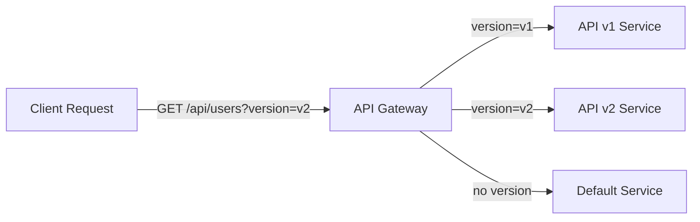
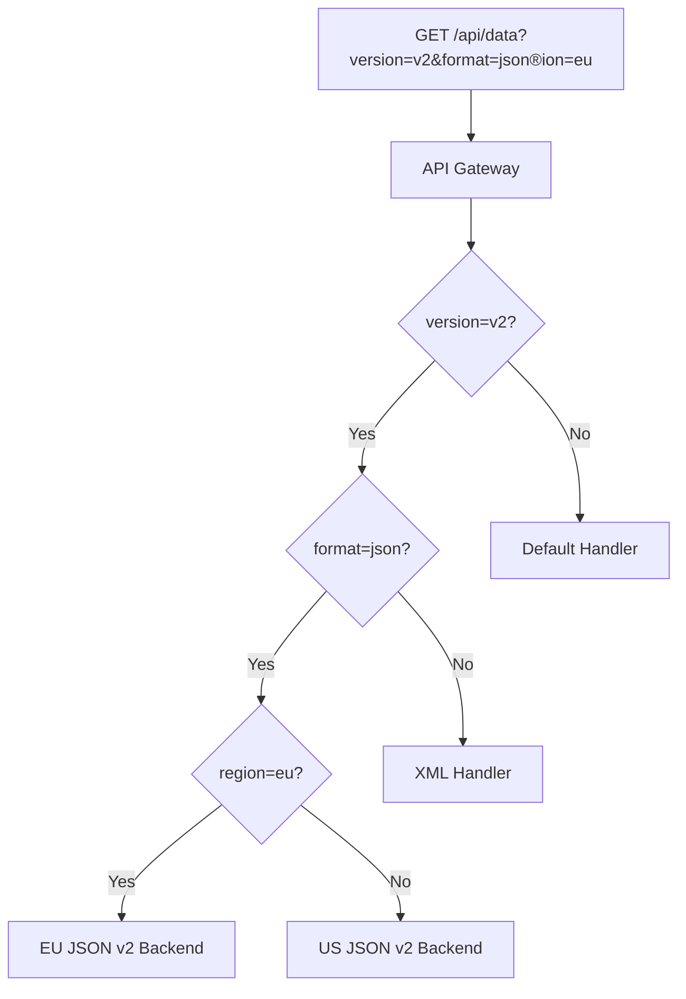
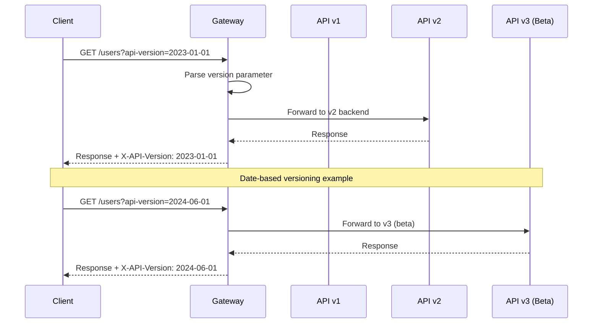
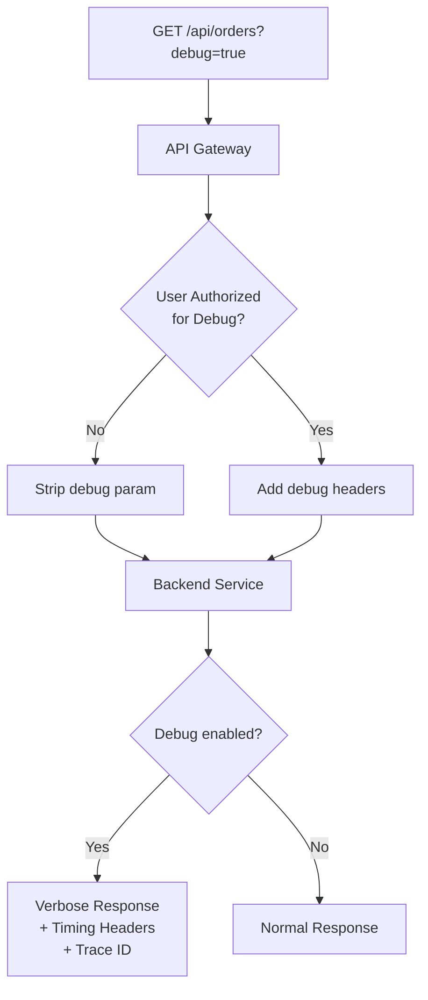
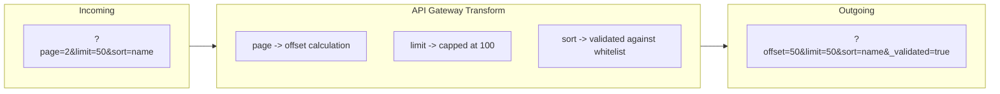
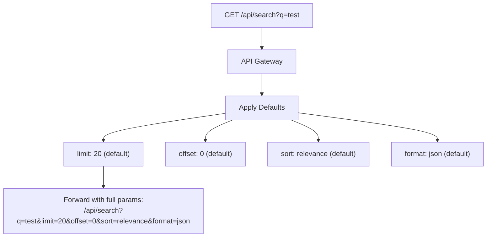
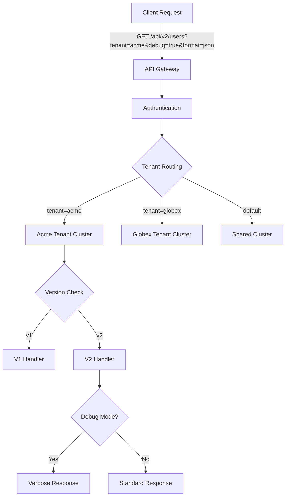

# How to Implement Query Parameter Routing

Author: [nawazdhandala](https://github.com/nawazdhandala)

Tags: API Gateway, Routing, Query Parameters, Traffic Management

Description: Learn how to route requests based on query parameters.

---

Query parameter routing is a powerful technique that allows API gateways to direct traffic based on URL query strings. Unlike path-based routing, query parameters provide flexible, non-breaking ways to control request handling - perfect for API versioning, A/B testing, feature flags, and debugging.

## Understanding Query Parameter Routing

Traditional routing matches on URL paths. Query parameter routing adds another dimension by inspecting the query string.



### When to Use Query Parameter Routing

- **API Versioning**: Route to different backends based on `?version=v2`
- **A/B Testing**: Split traffic using `?variant=b`
- **Debug Mode**: Enable verbose responses with `?debug=true`
- **Feature Flags**: Toggle features with `?feature=new-checkout`
- **Client Targeting**: Route mobile vs desktop with `?client=mobile`

## Query Parameter Matching

The most fundamental operation is matching a specific query parameter value.

### Basic Parameter Matching

```yaml
# Kong Gateway Configuration
services:
  - name: users-api-v2
    url: http://users-v2.internal:8080
    routes:
      - name: users-v2-route
        paths:
          - /api/users
        headers:
          x-api-version:
            - v2
        # Kong uses headers, transform query to header first
```

For NGINX-based gateways:

```nginx
# NGINX Configuration
map $arg_version $backend {
    "v1"    v1_backend;
    "v2"    v2_backend;
    default default_backend;
}

upstream v1_backend {
    server api-v1.internal:8080;
}

upstream v2_backend {
    server api-v2.internal:8080;
}

upstream default_backend {
    server api-default.internal:8080;
}

server {
    listen 80;

    location /api/users {
        proxy_pass http://$backend;
    }
}
```

### Envoy Proxy Configuration

```yaml
# Envoy Configuration
route_config:
  name: query_param_routes
  virtual_hosts:
    - name: api_service
      domains: ["*"]
      routes:
        # Route based on version query parameter
        - match:
            prefix: "/api/users"
            query_parameters:
              - name: version
                string_match:
                  exact: "v2"
          route:
            cluster: users_v2_cluster

        # Default route
        - match:
            prefix: "/api/users"
          route:
            cluster: users_default_cluster

clusters:
  - name: users_v2_cluster
    connect_timeout: 5s
    type: STRICT_DNS
    lb_policy: ROUND_ROBIN
    load_assignment:
      cluster_name: users_v2_cluster
      endpoints:
        - lb_endpoints:
            - endpoint:
                address:
                  socket_address:
                    address: users-v2.internal
                    port_value: 8080
```

## Multiple Parameter Conditions

Real-world routing often requires matching multiple parameters simultaneously.



### NGINX Multiple Parameter Matching

```nginx
# Composite key from multiple parameters
map "$arg_version:$arg_format:$arg_region" $api_backend {
    "v2:json:eu"    eu_json_v2;
    "v2:json:us"    us_json_v2;
    "v2:xml:~"      xml_v2;
    "v1:~:~"        legacy_v1;
    default         default_api;
}

upstream eu_json_v2 {
    server eu-api-v2.internal:8080;
}

upstream us_json_v2 {
    server us-api-v2.internal:8080;
}

upstream xml_v2 {
    server xml-api-v2.internal:8080;
}

upstream legacy_v1 {
    server legacy-api.internal:8080;
}

upstream default_api {
    server api.internal:8080;
}

server {
    listen 80;

    location /api/ {
        proxy_pass http://$api_backend;
        proxy_set_header Host $host;
        proxy_set_header X-Real-IP $remote_addr;
    }
}
```

### Envoy Multiple Parameters

```yaml
# Envoy - AND condition for multiple parameters
routes:
  - match:
      prefix: "/api/data"
      query_parameters:
        - name: version
          string_match:
            exact: "v2"
        - name: format
          string_match:
            exact: "json"
        - name: region
          string_match:
            exact: "eu"
    route:
      cluster: eu_json_v2_cluster

  # Fallback with fewer conditions
  - match:
      prefix: "/api/data"
      query_parameters:
        - name: version
          string_match:
            exact: "v2"
    route:
      cluster: v2_default_cluster
```

### AWS API Gateway (OpenAPI)

```yaml
# AWS API Gateway with OpenAPI
openapi: "3.0.1"
info:
  title: "Multi-Parameter Routing API"
  version: "1.0"

paths:
  /api/data:
    get:
      parameters:
        - name: version
          in: query
          required: false
          schema:
            type: string
        - name: format
          in: query
          required: false
          schema:
            type: string
      x-amazon-apigateway-integration:
        type: http_proxy
        httpMethod: GET
        uri:
          Fn::If:
            - IsV2Request
            - "https://api-v2.example.com/data"
            - "https://api-v1.example.com/data"
        requestParameters:
          integration.request.querystring.version: method.request.querystring.version
```

## Version Parameter Routing

API versioning via query parameters is cleaner than path versioning for many use cases.



### Date-Based Version Routing

```nginx
# NGINX date-based API versioning
map $arg_api_version $api_backend {
    # Specific versions
    "2023-01-01"    api_v1;
    "2023-06-01"    api_v2;
    "2024-01-01"    api_v3;

    # Version aliases
    "stable"        api_v2;
    "latest"        api_v3;
    "beta"          api_v3_beta;

    # Default to stable
    default         api_v2;
}

server {
    listen 80;

    location /api/ {
        # Add version header to response
        add_header X-API-Version $arg_api_version;

        proxy_pass http://$api_backend;
    }
}
```

### Semantic Version Routing with Envoy

```yaml
# Envoy with regex matching for semantic versions
routes:
  # Match v3.x versions
  - match:
      prefix: "/api/"
      query_parameters:
        - name: version
          string_match:
            safe_regex:
              google_re2: {}
              regex: "^v3\\.[0-9]+$"
    route:
      cluster: api_v3_cluster

  # Match v2.x versions
  - match:
      prefix: "/api/"
      query_parameters:
        - name: version
          string_match:
            safe_regex:
              google_re2: {}
              regex: "^v2\\.[0-9]+$"
    route:
      cluster: api_v2_cluster

  # Match v1.x versions (deprecated)
  - match:
      prefix: "/api/"
      query_parameters:
        - name: version
          string_match:
            safe_regex:
              google_re2: {}
              regex: "^v1\\.[0-9]+$"
    route:
      cluster: api_v1_cluster
    response_headers_to_add:
      - header:
          key: "X-API-Deprecated"
          value: "true"
      - header:
          key: "X-API-Sunset"
          value: "2025-01-01"
```

## Debug Parameter Handling

Debug parameters enable troubleshooting without code changes.



### NGINX Debug Mode Configuration

```nginx
# Map debug parameter with authorization check
map $arg_debug $debug_enabled {
    "true"  1;
    "1"     1;
    default 0;
}

# Check if user is authorized for debug (via header or cookie)
map $http_x_debug_token $debug_authorized {
    "secret-debug-token-12345"  1;
    default                      0;
}

# Combine checks
map "$debug_enabled:$debug_authorized" $final_debug {
    "1:1"   1;
    default 0;
}

server {
    listen 80;

    location /api/ {
        # Pass debug flag to backend if authorized
        proxy_set_header X-Debug-Enabled $final_debug;

        # Add timing headers for debug requests
        if ($final_debug = 1) {
            add_header X-Request-Start $msec;
            add_header X-Debug-Mode "enabled";
        }

        # Strip debug param if not authorized
        set $clean_args $args;
        if ($debug_authorized = 0) {
            set $clean_args $args;
            # Remove debug parameter
            rewrite ^(.*)$ $1?$clean_args break;
        }

        proxy_pass http://backend;
    }
}
```

### Envoy Debug Routing with Lua

```yaml
# Envoy with Lua filter for debug handling
http_filters:
  - name: envoy.filters.http.lua
    typed_config:
      "@type": type.googleapis.com/envoy.extensions.filters.http.lua.v3.Lua
      inline_code: |
        function envoy_on_request(request_handle)
          local debug = request_handle:headers():get(":path"):match("debug=true")
          local auth_token = request_handle:headers():get("x-debug-token")

          if debug and auth_token == "secret-token" then
            request_handle:headers():add("x-debug-enabled", "true")
            request_handle:headers():add("x-request-timestamp", os.time())
          else
            -- Strip debug param from unauthorized requests
            local path = request_handle:headers():get(":path")
            path = path:gsub("[?&]debug=true", "")
            request_handle:headers():replace(":path", path)
          end
        end

        function envoy_on_response(response_handle)
          local debug = response_handle:headers():get("x-debug-enabled")
          if debug == "true" then
            response_handle:headers():add("x-response-timestamp", os.time())
          end
        end

routes:
  - match:
      prefix: "/api/"
    route:
      cluster: api_cluster
```

## Parameter Transformation

Sometimes you need to transform query parameters before forwarding requests.



### NGINX Parameter Transformation

```nginx
# Transform pagination parameters
map $arg_page $calculated_offset {
    default 0;
    ~^[0-9]+$ $arg_page;
}

# Cap limit at 100
map $arg_limit $safe_limit {
    default 20;
    ~^[0-9]+$ $arg_limit;
}

# Whitelist sort fields
map $arg_sort $safe_sort {
    "name"       "name";
    "created_at" "created_at";
    "updated_at" "updated_at";
    "id"         "id";
    default      "id";
}

server {
    listen 80;

    location /api/items {
        # Calculate offset from page
        set $offset 0;
        set_by_lua_block $offset {
            local page = tonumber(ngx.var.arg_page) or 1
            local limit = tonumber(ngx.var.safe_limit) or 20
            return (page - 1) * limit
        }

        # Cap limit
        set_by_lua_block $capped_limit {
            local limit = tonumber(ngx.var.arg_limit) or 20
            if limit > 100 then return 100 end
            return limit
        }

        # Rewrite with transformed parameters
        set $transformed_args "offset=$offset&limit=$capped_limit&sort=$safe_sort";

        proxy_pass http://backend/api/items?$transformed_args;
    }
}
```

### Envoy Parameter Transformation

```yaml
# Envoy with header manipulation for parameter transformation
routes:
  - match:
      prefix: "/api/items"
    route:
      cluster: items_cluster
    request_headers_to_add:
      - header:
          key: "x-transformed"
          value: "true"
    typed_per_filter_config:
      envoy.filters.http.lua:
        "@type": type.googleapis.com/envoy.extensions.filters.http.lua.v3.PerRouteConfig
        source_code:
          inline_string: |
            function envoy_on_request(request_handle)
              local path = request_handle:headers():get(":path")

              -- Parse query parameters
              local params = {}
              for k, v in path:gmatch("([^&=?]+)=([^&=?]+)") do
                params[k] = v
              end

              -- Transform page to offset
              local page = tonumber(params["page"]) or 1
              local limit = math.min(tonumber(params["limit"]) or 20, 100)
              local offset = (page - 1) * limit

              -- Whitelist sort parameter
              local allowed_sorts = {name=true, created_at=true, id=true}
              local sort = allowed_sorts[params["sort"]] and params["sort"] or "id"

              -- Build new query string
              local base_path = path:match("([^?]+)")
              local new_path = string.format("%s?offset=%d&limit=%d&sort=%s",
                base_path, offset, limit, sort)

              request_handle:headers():replace(":path", new_path)
            end
```

## Default Value Handling

Proper default handling ensures consistent behavior when parameters are missing.



### NGINX Default Values

```nginx
# Define defaults with map
map $arg_limit $final_limit {
    ""      20;          # Empty - use default
    default $arg_limit;  # Use provided value
}

map $arg_offset $final_offset {
    ""      0;
    default $arg_offset;
}

map $arg_sort $final_sort {
    ""          "relevance";
    "date"      "date";
    "price"     "price";
    "relevance" "relevance";
    default     "relevance";  # Invalid values get default
}

map $arg_format $final_format {
    ""      "json";
    "json"  "json";
    "xml"   "xml";
    "csv"   "csv";
    default "json";
}

server {
    listen 80;

    location /api/search {
        # Build normalized query string with defaults applied
        set $normalized_args "q=$arg_q&limit=$final_limit&offset=$final_offset&sort=$final_sort&format=$final_format";

        # Forward with normalized parameters
        proxy_pass http://search_backend/search?$normalized_args;

        # Add header indicating defaults were applied
        add_header X-Defaults-Applied "limit=$final_limit,offset=$final_offset,sort=$final_sort,format=$final_format";
    }
}
```

### Kong Gateway Default Values Plugin

```yaml
# Kong declarative configuration
services:
  - name: search-service
    url: http://search.internal:8080
    routes:
      - name: search-route
        paths:
          - /api/search
    plugins:
      - name: request-transformer
        config:
          add:
            querystring:
              - "limit:20"
              - "offset:0"
              - "sort:relevance"
              - "format:json"
          replace:
            querystring:
              # Only replace if empty
              - "limit:$(query_params.limit or '20')"
```

### Express.js Middleware for Defaults

```javascript
// Node.js/Express middleware for query parameter defaults
const queryDefaults = (defaults) => {
  return (req, res, next) => {
    // Apply defaults for missing parameters
    Object.keys(defaults).forEach(key => {
      if (req.query[key] === undefined || req.query[key] === '') {
        req.query[key] = defaults[key];
      }
    });

    // Validate and sanitize
    if (req.query.limit) {
      req.query.limit = Math.min(parseInt(req.query.limit) || 20, 100);
    }
    if (req.query.offset) {
      req.query.offset = Math.max(parseInt(req.query.offset) || 0, 0);
    }

    // Add header for debugging
    res.set('X-Query-Defaults-Applied', 'true');

    next();
  };
};

// Usage
app.use('/api/search', queryDefaults({
  limit: 20,
  offset: 0,
  sort: 'relevance',
  format: 'json'
}));

app.get('/api/search', (req, res) => {
  // req.query now has defaults applied
  const { q, limit, offset, sort, format } = req.query;
  // ... handle search
});
```

## Complete Example: Multi-Tenant API Gateway

Here is a complete example combining all techniques for a production API gateway.



### Complete NGINX Configuration

```nginx
# /etc/nginx/nginx.conf

worker_processes auto;

events {
    worker_connections 4096;
}

http {
    # Logging
    log_format api_log '$remote_addr - $remote_user [$time_local] '
                       '"$request" $status $body_bytes_sent '
                       '"$http_referer" "$http_user_agent" '
                       'tenant=$arg_tenant version=$arg_version '
                       'debug=$final_debug rt=$request_time';

    access_log /var/log/nginx/api_access.log api_log;

    # Tenant routing
    map $arg_tenant $tenant_backend {
        "acme"    acme_cluster;
        "globex"  globex_cluster;
        "initech" initech_cluster;
        default   shared_cluster;
    }

    # Version routing
    map $arg_version $version_suffix {
        "v1"    "-v1";
        "v2"    "-v2";
        "v3"    "-v3";
        default "-v2";  # Default to v2
    }

    # Debug authorization
    map $arg_debug $debug_requested {
        "true"  1;
        "1"     1;
        default 0;
    }

    map "$debug_requested:$http_x_debug_token" $final_debug {
        "1:valid-debug-token"  1;
        default                0;
    }

    # Format handling
    map $arg_format $response_format {
        "xml"   "application/xml";
        "csv"   "text/csv";
        default "application/json";
    }

    # Default values
    map $arg_limit $safe_limit {
        ""      "20";
        ~^[0-9]+$ $arg_limit;
        default "20";
    }

    map $arg_offset $safe_offset {
        ""      "0";
        ~^[0-9]+$ $arg_offset;
        default "0";
    }

    # Upstream definitions
    upstream acme_cluster {
        server acme-api-1.internal:8080 weight=5;
        server acme-api-2.internal:8080 weight=5;
        keepalive 32;
    }

    upstream globex_cluster {
        server globex-api-1.internal:8080;
        server globex-api-2.internal:8080;
        keepalive 32;
    }

    upstream shared_cluster {
        server shared-api-1.internal:8080;
        server shared-api-2.internal:8080;
        server shared-api-3.internal:8080;
        keepalive 64;
    }

    # Rate limiting by tenant
    map $arg_tenant $rate_limit_key {
        ""      $binary_remote_addr;
        default $arg_tenant;
    }

    limit_req_zone $rate_limit_key zone=tenant_limit:10m rate=100r/s;

    server {
        listen 80;
        server_name api.example.com;

        # Security headers
        add_header X-Content-Type-Options nosniff always;
        add_header X-Frame-Options DENY always;

        location /api/ {
            # Rate limiting
            limit_req zone=tenant_limit burst=50 nodelay;

            # Apply content type based on format
            add_header Content-Type $response_format;

            # Debug headers (only if authorized)
            set $debug_headers "";
            if ($final_debug = 1) {
                add_header X-Debug-Mode "enabled";
                add_header X-Request-ID $request_id;
                add_header X-Tenant $arg_tenant;
                add_header X-Version $arg_version;
                add_header X-Backend $tenant_backend;
            }

            # Transform and forward
            set $clean_args "tenant=$arg_tenant&limit=$safe_limit&offset=$safe_offset";

            # Pass debug flag to backend
            proxy_set_header X-Debug $final_debug;
            proxy_set_header X-Tenant $arg_tenant;
            proxy_set_header X-Request-ID $request_id;
            proxy_set_header Host $host;
            proxy_set_header X-Real-IP $remote_addr;
            proxy_set_header X-Forwarded-For $proxy_add_x_forwarded_for;

            proxy_pass http://$tenant_backend$uri?$clean_args;

            # Timeouts
            proxy_connect_timeout 5s;
            proxy_read_timeout 30s;
            proxy_send_timeout 30s;
        }

        # Health check endpoint
        location /health {
            return 200 '{"status":"healthy"}';
            add_header Content-Type application/json;
        }
    }
}
```

## Testing Query Parameter Routing

### Unit Tests with curl

```bash
#!/bin/bash
# test-query-routing.sh

BASE_URL="http://localhost:8080"

echo "=== Testing Version Routing ==="
echo "Testing v1 routing..."
curl -s "$BASE_URL/api/users?version=v1" -w "\nStatus: %{http_code}\n"

echo -e "\nTesting v2 routing..."
curl -s "$BASE_URL/api/users?version=v2" -w "\nStatus: %{http_code}\n"

echo -e "\n=== Testing Tenant Routing ==="
echo "Testing acme tenant..."
curl -s "$BASE_URL/api/users?tenant=acme" -w "\nStatus: %{http_code}\n" -H "X-Tenant-Token: acme-token"

echo -e "\n=== Testing Debug Mode ==="
echo "Testing debug without auth (should strip)..."
curl -s -I "$BASE_URL/api/users?debug=true" | grep -i "x-debug"

echo -e "\nTesting debug with auth..."
curl -s -I "$BASE_URL/api/users?debug=true" -H "X-Debug-Token: valid-debug-token" | grep -i "x-debug"

echo -e "\n=== Testing Default Values ==="
echo "Testing without limit (should default to 20)..."
curl -s "$BASE_URL/api/search?q=test" | jq '.limit'

echo -e "\nTesting with limit=50..."
curl -s "$BASE_URL/api/search?q=test&limit=50" | jq '.limit'

echo -e "\nTesting with excessive limit (should cap at 100)..."
curl -s "$BASE_URL/api/search?q=test&limit=500" | jq '.limit'

echo -e "\n=== Testing Format Routing ==="
echo "Testing JSON format..."
curl -s -I "$BASE_URL/api/data?format=json" | grep "Content-Type"

echo -e "\nTesting XML format..."
curl -s -I "$BASE_URL/api/data?format=xml" | grep "Content-Type"
```

### Load Testing with k6

```javascript
// k6-query-param-test.js
import http from 'k6/http';
import { check, sleep } from 'k6';
import { Rate } from 'k6/metrics';

const errorRate = new Rate('errors');

export const options = {
  stages: [
    { duration: '30s', target: 50 },
    { duration: '1m', target: 100 },
    { duration: '30s', target: 0 },
  ],
};

const BASE_URL = 'http://localhost:8080';

export default function () {
  // Test version routing
  const versions = ['v1', 'v2', 'v3'];
  const version = versions[Math.floor(Math.random() * versions.length)];

  const versionRes = http.get(`${BASE_URL}/api/users?version=${version}`);
  check(versionRes, {
    'version routing status 200': (r) => r.status === 200,
    'correct version header': (r) => r.headers['X-Api-Version'] === version,
  });
  errorRate.add(versionRes.status !== 200);

  // Test tenant routing
  const tenants = ['acme', 'globex', 'initech'];
  const tenant = tenants[Math.floor(Math.random() * tenants.length)];

  const tenantRes = http.get(`${BASE_URL}/api/data?tenant=${tenant}`, {
    headers: { 'X-Tenant-Token': `${tenant}-token` },
  });
  check(tenantRes, {
    'tenant routing status 200': (r) => r.status === 200,
  });
  errorRate.add(tenantRes.status !== 200);

  // Test parameter transformation
  const page = Math.floor(Math.random() * 10) + 1;
  const transformRes = http.get(`${BASE_URL}/api/items?page=${page}&limit=25`);
  check(transformRes, {
    'transform status 200': (r) => r.status === 200,
  });

  sleep(0.1);
}
```

## Best Practices

### Security Considerations

1. **Validate all parameters**: Never trust user input
2. **Whitelist allowed values**: Especially for routing decisions
3. **Rate limit by parameter**: Prevent abuse of expensive routes
4. **Audit debug access**: Log who enables debug mode and when
5. **Strip sensitive parameters**: Remove debug flags for unauthorized users

### Performance Tips

1. **Use maps over if statements**: NGINX maps are compiled and faster
2. **Cache parameter parsing**: Avoid parsing the same query string multiple times
3. **Set reasonable limits**: Cap pagination to prevent expensive queries
4. **Use connection pooling**: Keep-alive connections to backends

### Monitoring

```yaml
# Prometheus metrics to track
- query_param_routing_total{version, tenant, route}
- query_param_validation_errors_total{param, error_type}
- query_param_defaults_applied_total{param}
- debug_mode_requests_total{authorized}
```

---

Query parameter routing transforms your API gateway from a simple proxy into an intelligent traffic controller. Start with version routing, add tenant isolation, implement debug modes, and always validate and transform parameters before forwarding. Your APIs will be more flexible, your debugging easier, and your infrastructure more maintainable.
