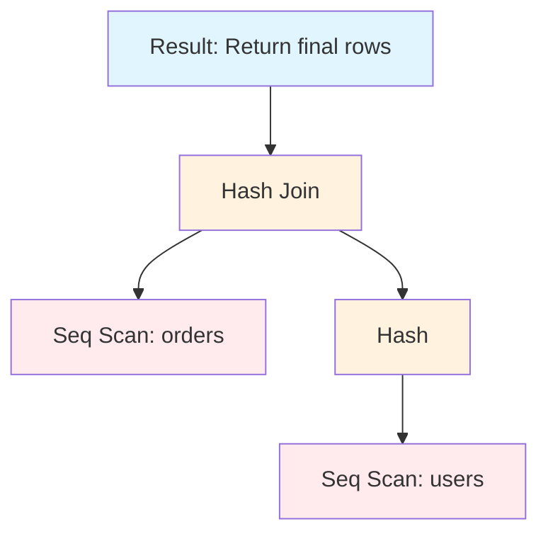
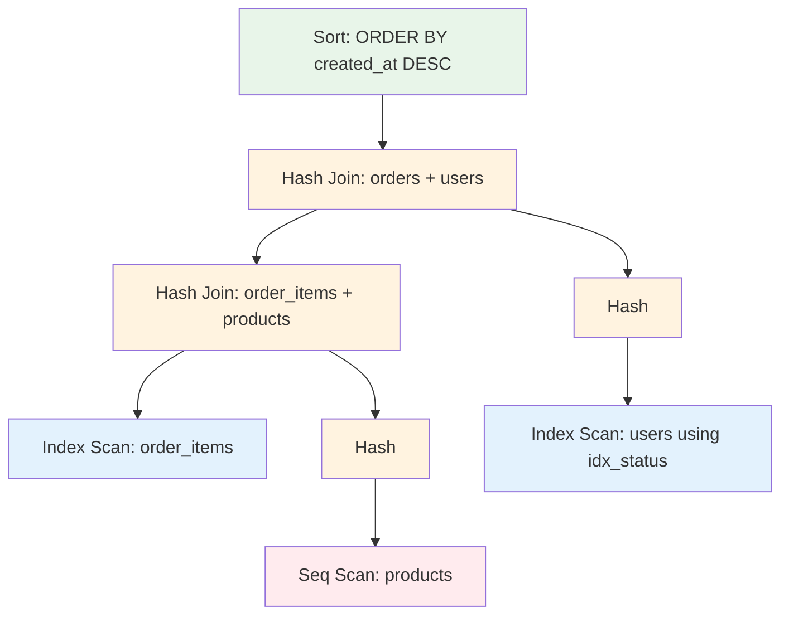
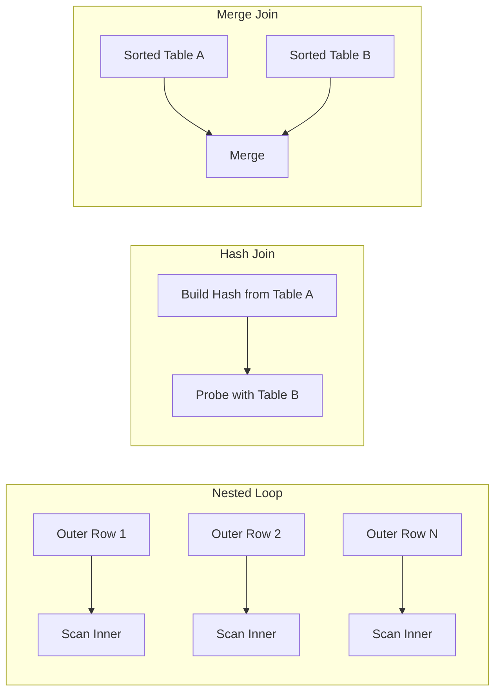
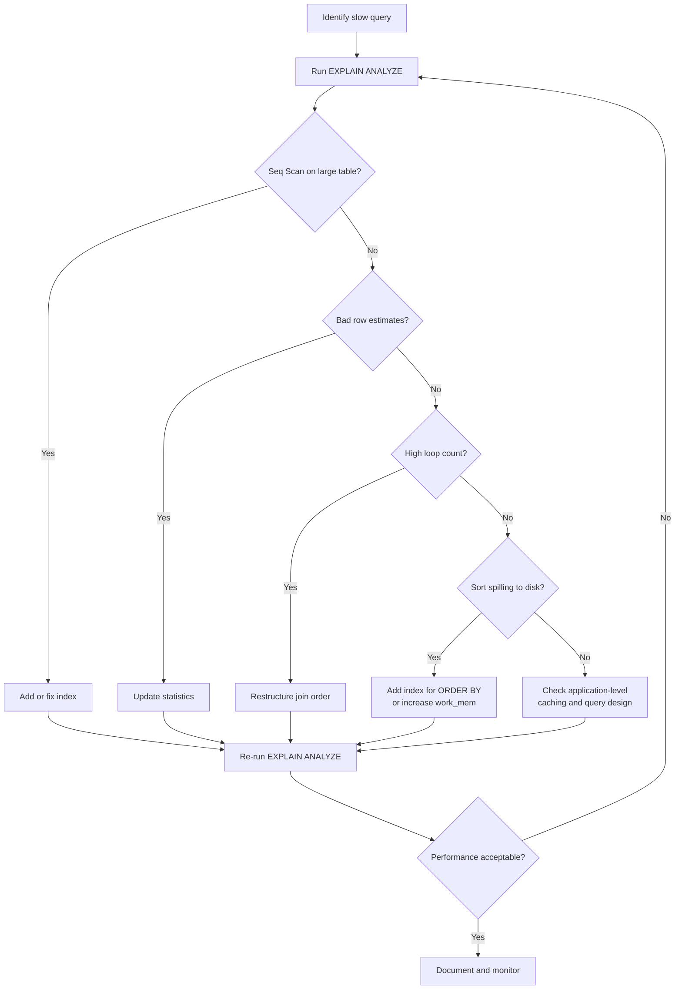

# How to Create Query Plan Analysis

Author: [nawazdhandala](https://github.com/nawazdhandala)

Tags: Database, SQL, Performance, Query Optimization

Description: A practical guide to reading and analyzing database query execution plans to identify bottlenecks and optimize SQL performance.

---

> A slow query isn't mysterious. The database tells you exactly what it's doing. You just have to read the execution plan.

When your API response times spike or your database CPU hits 100%, the answer usually lives in the query execution plan. Yet many developers treat `EXPLAIN` output as cryptic noise and skip straight to guessing. This guide shows you how to read execution plans like a database engineer, spot the expensive operations, and fix them systematically.

## 1. What Is a Query Execution Plan?

A query execution plan is the database's blueprint for retrieving your data. When you submit a SQL statement, the query planner evaluates many possible strategies and picks the one it estimates will be cheapest. The plan describes:

- **Which tables to access** and in what order
- **Which indexes to use** (or whether to scan the whole table)
- **How to join tables** (nested loops, hash joins, merge joins)
- **Where to apply filters** and aggregations
- **Estimated costs and row counts** at each step

Understanding the plan lets you see exactly where time and resources go. You stop guessing and start optimizing with evidence.

## 2. EXPLAIN vs EXPLAIN ANALYZE

Both PostgreSQL and MySQL offer variants of the `EXPLAIN` command, but they serve different purposes.

### PostgreSQL

**EXPLAIN** shows the planner's estimated plan without executing the query:

```sql
EXPLAIN SELECT u.name, o.total
FROM users u
JOIN orders o ON o.user_id = u.id
WHERE o.created_at > '2025-01-01'
  AND u.status = 'active';
```

Output:

```
Hash Join  (cost=12.50..45.80 rows=120 width=48)
  Hash Cond: (o.user_id = u.id)
  ->  Seq Scan on orders o  (cost=0.00..28.50 rows=450 width=16)
        Filter: (created_at > '2025-01-01'::date)
  ->  Hash  (cost=10.25..10.25 rows=180 width=36)
        ->  Seq Scan on users u  (cost=0.00..10.25 rows=180 width=36)
              Filter: (status = 'active'::text)
```

**EXPLAIN ANALYZE** actually runs the query and shows real execution times:

```sql
EXPLAIN ANALYZE SELECT u.name, o.total
FROM users u
JOIN orders o ON o.user_id = u.id
WHERE o.created_at > '2025-01-01'
  AND u.status = 'active';
```

Output:

```
Hash Join  (cost=12.50..45.80 rows=120 width=48) (actual time=0.85..2.14 rows=98 loops=1)
  Hash Cond: (o.user_id = u.id)
  ->  Seq Scan on orders o  (cost=0.00..28.50 rows=450 width=16) (actual time=0.02..0.95 rows=423 loops=1)
        Filter: (created_at > '2025-01-01'::date)
        Rows Removed by Filter: 1577
  ->  Hash  (cost=10.25..10.25 rows=180 width=36) (actual time=0.41..0.42 rows=156 loops=1)
        ->  Seq Scan on users u  (cost=0.00..10.25 rows=180 width=36) (actual time=0.01..0.28 rows=156 loops=1)
              Filter: (status = 'active'::text)
              Rows Removed by Filter: 44
Planning Time: 0.21 ms
Execution Time: 2.35 ms
```

### MySQL

**EXPLAIN** in MySQL shows the execution plan:

```sql
EXPLAIN SELECT u.name, o.total
FROM users u
JOIN orders o ON o.user_id = u.id
WHERE o.created_at > '2025-01-01'
  AND u.status = 'active';
```

Output:

```
+----+-------------+-------+------+---------------+---------+---------+-------------+------+-------------+
| id | select_type | table | type | possible_keys | key     | key_len | ref         | rows | Extra       |
+----+-------------+-------+------+---------------+---------+---------+-------------+------+-------------+
|  1 | SIMPLE      | u     | ref  | PRIMARY,idx_status | idx_status | 102 | const  |  180 | Using where |
|  1 | SIMPLE      | o     | ref  | idx_user_id   | idx_user_id | 4   | db.u.id     |   12 | Using where |
+----+-------------+-------+------+---------------+---------+---------+-------------+------+-------------+
```

**EXPLAIN ANALYZE** (MySQL 8.0.18+) runs the query and shows actual timing:

```sql
EXPLAIN ANALYZE SELECT u.name, o.total
FROM users u
JOIN orders o ON o.user_id = u.id
WHERE o.created_at > '2025-01-01'
  AND u.status = 'active';
```

Output:

```
-> Nested loop inner join  (cost=54.25 rows=120) (actual time=0.089..1.245 rows=98 loops=1)
    -> Index lookup on u using idx_status (status='active')  (cost=18.00 rows=180) (actual time=0.045..0.234 rows=156 loops=1)
    -> Filter: (o.created_at > '2025-01-01')  (cost=0.25 rows=1) (actual time=0.005..0.006 rows=1 loops=156)
        -> Index lookup on o using idx_user_id (user_id=u.id)  (cost=0.25 rows=12) (actual time=0.004..0.005 rows=3 loops=156)
```

**Key difference:** Use `EXPLAIN` for quick estimates during development. Use `EXPLAIN ANALYZE` when you need accurate measurements, but remember it actually executes the query (including writes for INSERT/UPDATE/DELETE).

## 3. Understanding the Query Plan Tree

Execution plans form a tree structure. The database executes from the leaves up to the root. Here's how to visualize a typical plan:



Reading this bottom-up:

1. Scan the `users` table and filter by `status = 'active'`
2. Build a hash table from those user rows
3. Scan the `orders` table and filter by `created_at`
4. Probe the hash table to find matching users
5. Return the joined result

A more complex join might look like this:



Each node in the tree has:
- **An operation type** (Seq Scan, Index Scan, Hash Join, etc.)
- **Cost estimates** (startup cost and total cost)
- **Row estimates** (how many rows the planner expects)
- **Actual values** (when using ANALYZE)

## 4. Key Operations and What They Mean

### Scan Operations

| Operation | Description | Performance Impact |
|-----------|-------------|-------------------|
| Seq Scan | Reads every row in the table | Expensive on large tables |
| Index Scan | Uses an index to find rows | Fast for selective queries |
| Index Only Scan | Returns data directly from the index | Fastest, no table access needed |
| Bitmap Index Scan | Combines multiple indexes | Good for OR conditions |

**Red flag:** A Seq Scan on a table with millions of rows when you're only fetching a few records almost always indicates a missing or unused index.

### Join Operations

| Operation | How It Works | Best When |
|-----------|--------------|-----------|
| Nested Loop | For each outer row, scan inner table | Small outer set, indexed inner |
| Hash Join | Build hash table, probe with other table | Medium/large tables, no useful index |
| Merge Join | Sort both sides, merge | Pre-sorted data or range joins |



**Red flag:** A nested loop join with a large outer table and no index on the inner table creates O(n*m) complexity.

### Other Important Operations

| Operation | Description | Watch For |
|-----------|-------------|-----------|
| Sort | Orders rows by specified columns | High memory usage, spills to disk |
| Aggregate | GROUP BY, COUNT, SUM operations | Full table processing |
| Limit | Stops after N rows | Can short-circuit expensive plans |
| Materialize | Stores intermediate results | Memory pressure on large sets |

## 5. Identifying Bottlenecks

When analyzing a query plan, look for these warning signs:

### Cost Spikes

The operation with the highest cost number is usually your bottleneck. In PostgreSQL, cost is measured in arbitrary units where sequential page reads = 1.0 by default.

```sql
EXPLAIN ANALYZE SELECT * FROM orders WHERE customer_email = 'test@example.com';

-- Bad plan:
Seq Scan on orders  (cost=0.00..125000.00 rows=1 width=120) (actual time=892.45..892.45 rows=1 loops=1)
  Filter: (customer_email = 'test@example.com'::text)
  Rows Removed by Filter: 4999999
```

This scanned 5 million rows to find 1 row. Adding an index fixes it:

```sql
CREATE INDEX idx_orders_email ON orders(customer_email);

-- Good plan:
Index Scan using idx_orders_email on orders  (cost=0.43..8.45 rows=1 width=120) (actual time=0.025..0.026 rows=1 loops=1)
  Index Cond: (customer_email = 'test@example.com'::text)
```

### Row Estimate Errors

When estimated rows differ wildly from actual rows, the planner made a bad choice. This often happens with:

- Stale statistics (run ANALYZE)
- Correlated columns
- Complex WHERE conditions

```sql
-- Estimated 10 rows, got 50,000
Hash Join  (cost=... rows=10) (actual ... rows=50000 loops=1)
```

Update statistics:

```sql
-- PostgreSQL
ANALYZE orders;

-- MySQL
ANALYZE TABLE orders;
```

### Loops Multiplier

The `loops` value shows how many times an operation ran. A high loop count with slow per-loop time compounds quickly:

```sql
->  Index Scan on order_items (actual time=0.05..0.08 rows=5 loops=10000)
```

Total time: 0.08ms * 10,000 = 800ms. Consider restructuring to a hash join or adding a covering index.

## 6. Cost Estimation Deep Dive

PostgreSQL calculates costs using several parameters:

| Parameter | Default | Meaning |
|-----------|---------|---------|
| seq_page_cost | 1.0 | Cost to read a sequential page |
| random_page_cost | 4.0 | Cost to read a random page |
| cpu_tuple_cost | 0.01 | Cost to process a row |
| cpu_index_tuple_cost | 0.005 | Cost to process an index entry |
| cpu_operator_cost | 0.0025 | Cost to apply an operator |

The formula for a sequential scan:

```
cost = (pages * seq_page_cost) + (rows * cpu_tuple_cost)
```

For an index scan:

```
cost = (index_pages * random_page_cost) +
       (index_tuples * cpu_index_tuple_cost) +
       (heap_pages * random_page_cost) +
       (rows * cpu_tuple_cost)
```

Why does this matter? When the planner chooses a Seq Scan over an Index Scan, it's because the math said sequential access would be cheaper. If you disagree, either:

1. The statistics are stale (run ANALYZE)
2. The cost parameters don't match your hardware (SSDs should lower random_page_cost)
3. You need to hint the planner or restructure the query

## 7. Practical Optimization Workflow

Follow this process when optimizing a slow query:



### Step-by-Step Example

Starting query with poor performance:

```sql
SELECT c.name, COUNT(o.id) as order_count, SUM(o.total) as revenue
FROM customers c
LEFT JOIN orders o ON o.customer_id = c.id
WHERE c.created_at > '2024-01-01'
  AND o.status = 'completed'
GROUP BY c.id, c.name
ORDER BY revenue DESC
LIMIT 100;
```

Run EXPLAIN ANALYZE and find:

```
Sort  (cost=89547.23..89548.73 rows=600 width=52) (actual time=4521.23..4521.45 rows=100 loops=1)
  Sort Key: (sum(o.total)) DESC
  Sort Method: top-N heapsort  Memory: 35kB
  ->  HashAggregate  (cost=89521.00..89533.00 rows=600 width=52) (actual time=4518.12..4519.89 rows=1523 loops=1)
        Group Key: c.id
        ->  Hash Join  (cost=1250.00..87021.00 rows=500000 width=24) (actual time=89.45..3891.23 rows=498234 loops=1)
              Hash Cond: (o.customer_id = c.id)
              ->  Seq Scan on orders o  (cost=0.00..75000.00 rows=2000000 width=16) (actual time=0.02..2156.78 rows=1987234 loops=1)
                    Filter: (status = 'completed'::text)
                    Rows Removed by Filter: 512766
              ->  Hash  (cost=1000.00..1000.00 rows=20000 width=12) (actual time=89.12..89.12 rows=18934 loops=1)
                    ->  Seq Scan on customers c  (cost=0.00..1000.00 rows=20000 width=12) (actual time=0.01..45.67 rows=18934 loops=1)
                          Filter: (created_at > '2024-01-01'::date)
Planning Time: 0.89 ms
Execution Time: 4523.12 ms
```

**Problems identified:**

1. Seq Scan on orders (2M rows) is the main cost
2. No index on `orders.status` or `orders.customer_id`

**Fix:**

```sql
CREATE INDEX idx_orders_status_customer ON orders(status, customer_id) WHERE status = 'completed';
CREATE INDEX idx_customers_created ON customers(created_at);
```

New plan shows Index Scan and execution time drops to 45ms.

## 8. Common Pitfalls and How to Avoid Them

| Pitfall | Why It Happens | Solution |
|---------|----------------|----------|
| Index not used | Low selectivity or type mismatch | Check data distribution; cast types correctly |
| Wrong join order | Planner misjudged table sizes | Update statistics; consider join hints |
| Sort spills to disk | work_mem too small | Increase work_mem or add supporting index |
| Parameter sniffing issues | Plan cached for atypical value | Use PREPARE/EXECUTE carefully; consider plan guides |
| Functions prevent index use | WHERE UPPER(name) = 'TEST' | Use expression indexes or fix the query |

### Function-Based Index Example

Bad:
```sql
SELECT * FROM users WHERE LOWER(email) = 'test@example.com';
-- Forces Seq Scan even with index on email
```

Fix:
```sql
CREATE INDEX idx_users_email_lower ON users(LOWER(email));
-- Now the query can use the index
```

## 9. Monitoring Query Plans in Production

Analyzing plans in development is useful, but production behavior often differs due to:

- Different data volumes
- Cache state (cold vs warm)
- Concurrent load
- Parameter values

Enable query plan logging for slow queries:

```sql
-- PostgreSQL: log plans for queries over 1 second
SET auto_explain.log_min_duration = '1s';
SET auto_explain.log_analyze = true;

-- Or in postgresql.conf
shared_preload_libraries = 'auto_explain'
auto_explain.log_min_duration = '1s'
```

For MySQL:

```sql
-- Enable slow query log
SET GLOBAL slow_query_log = 'ON';
SET GLOBAL long_query_time = 1;
SET GLOBAL log_slow_extra = 'ON';
```

Feed these logs into your observability platform to correlate query plans with application traces and system metrics.

## Summary

Query plan analysis is a skill that pays compound interest. Every slow query you diagnose makes you faster at spotting the next one. The key points:

1. Always use `EXPLAIN ANALYZE` for accurate measurements
2. Read plans bottom-up, from leaves to root
3. Look for Seq Scans on large tables, bad row estimates, and high loop counts
4. Keep statistics updated with ANALYZE
5. Add indexes strategically based on actual plan analysis
6. Monitor production query plans, not just development

The database is not a black box. It's telling you exactly what's slow. Learn to listen.

---

**Related Reading:**
- [When Performance Matters, Skip the ORM](https://oneuptime.com/blog/post/2025-11-13-when-performance-matters-skip-the-orm/view)
- [Basics of Profiling](https://oneuptime.com/blog/post/2025-09-09-basics-of-profiling/view)

---

*Tracking slow queries across your stack? OneUptime correlates database performance with application traces and infrastructure metrics, giving you the full picture when something goes wrong.*
