# How to Build Queue Architecture Design

Author: [nawazdhandala](https://github.com/nawazdhandala)

Tags: Message Queues, Architecture, Distributed Systems, Backend

Description: Learn how to design message queue architecture for reliable asynchronous communication.

---

Message queues are the backbone of modern distributed systems. They enable asynchronous communication between services, decouple components, and provide resilience against failures. In this comprehensive guide, we will explore how to design robust queue architectures that scale with your application needs.

## Why Message Queues Matter

Before diving into architecture patterns, let us understand why message queues are essential:

- **Decoupling**: Services can evolve independently without tight dependencies
- **Resilience**: Messages persist even when consumers are temporarily unavailable
- **Scalability**: Add more consumers to handle increased load
- **Load Leveling**: Smooth out traffic spikes by buffering requests

## Queue Topology Patterns

Queue topology defines how messages flow through your system. Choosing the right pattern depends on your use case.

### Point-to-Point (Direct) Pattern

In this pattern, a single producer sends messages to a single queue, and a single consumer processes them.

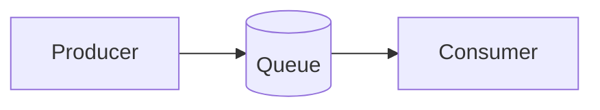

This is the simplest topology, ideal for:
- Task distribution to a single worker
- Sequential processing requirements
- Simple request-response patterns

### Competing Consumers Pattern

Multiple consumers compete to process messages from the same queue. This pattern enables horizontal scaling.

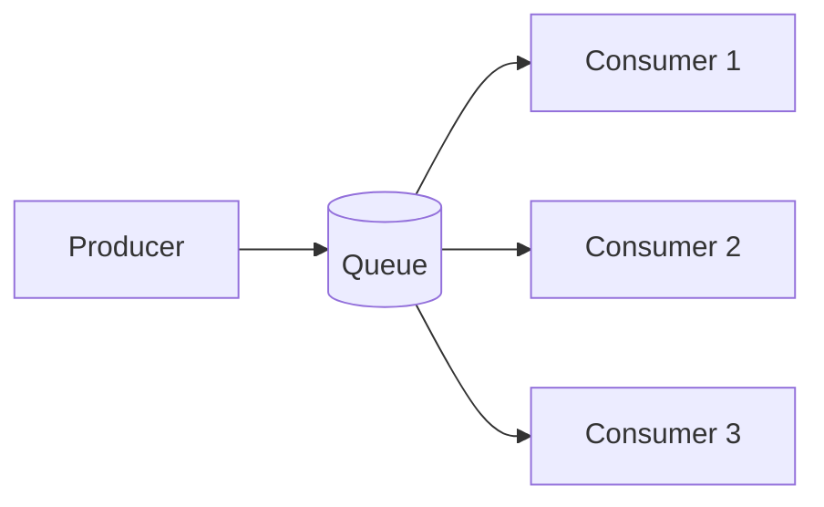

**Key Considerations:**
- Messages are delivered to only one consumer
- Processing order may not be guaranteed
- Failed messages need retry or dead-letter handling

### Publish-Subscribe (Fan-out) Pattern

A single message is delivered to multiple subscribers, each maintaining their own queue.

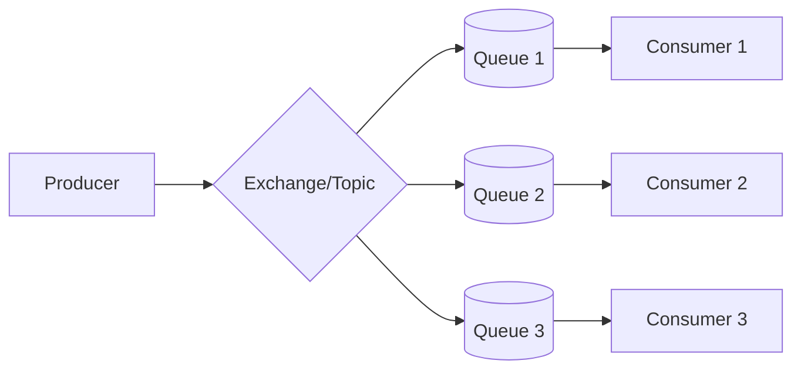

Use cases include:
- Event broadcasting to multiple services
- Audit logging alongside business processing
- Notification systems

### Topic-Based Routing Pattern

Messages are routed to queues based on routing keys or topic patterns.

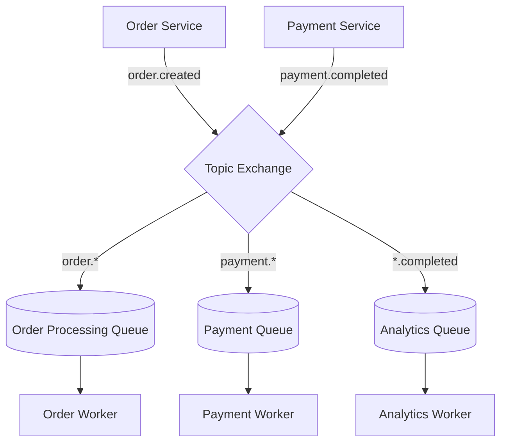

This pattern enables:
- Fine-grained message filtering
- Dynamic subscription management
- Complex routing logic without code changes

## Message Durability

Durability ensures messages survive system failures. Here is how to implement it properly.

### Persistence Levels

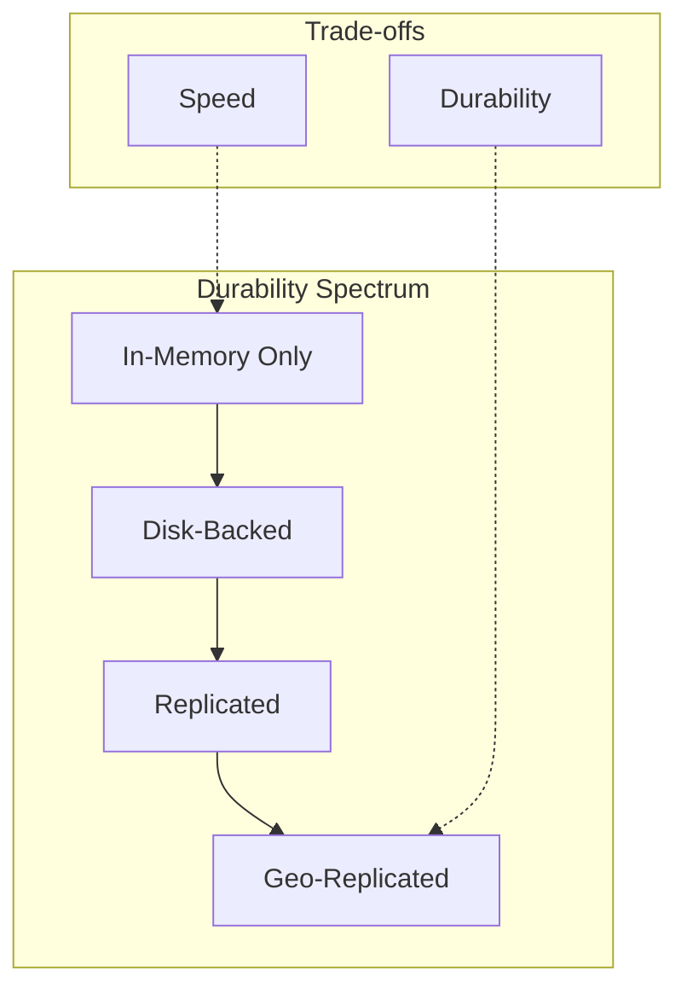

### Implementing Durable Messaging

Here is a Python example using RabbitMQ with proper durability settings:

```python
import pika
import json
import uuid
import time
from typing import Dict, Any

def create_durable_connection() -> pika.BlockingConnection:
    """
    Establish a connection to RabbitMQ with heartbeat
    to detect connection failures early.
    """
    credentials = pika.PlainCredentials('user', 'password')
    parameters = pika.ConnectionParameters(
        host='rabbitmq.example.com',
        port=5672,
        credentials=credentials,
        # Heartbeat interval in seconds
        # Helps detect dead connections
        heartbeat=60,
        # Connection timeout
        blocked_connection_timeout=300
    )
    return pika.BlockingConnection(parameters)


def setup_durable_queue(channel: pika.channel.Channel, queue_name: str) -> None:
    """
    Declare a durable queue that survives broker restarts.

    Args:
        channel: RabbitMQ channel
        queue_name: Name of the queue to create
    """
    channel.queue_declare(
        queue=queue_name,
        # Queue survives broker restart
        durable=True,
        # Queue is not deleted when last consumer disconnects
        auto_delete=False,
        # Queue is not exclusive to this connection
        exclusive=False,
        arguments={
            # Enable dead-letter exchange for failed messages
            'x-dead-letter-exchange': 'dlx',
            'x-dead-letter-routing-key': f'{queue_name}.dead',
            # Message TTL of 24 hours (in milliseconds)
            'x-message-ttl': 86400000,
            # Maximum queue length
            'x-max-length': 1000000
        }
    )


def publish_durable_message(
    channel: pika.channel.Channel,
    queue_name: str,
    message: Dict[str, Any]
) -> None:
    """
    Publish a message with persistence enabled.

    The message will be written to disk before
    the broker acknowledges receipt.

    Args:
        channel: RabbitMQ channel
        queue_name: Target queue name
        message: Message payload as dictionary
    """
    channel.basic_publish(
        exchange='',
        routing_key=queue_name,
        body=json.dumps(message),
        properties=pika.BasicProperties(
            # Message persists to disk
            delivery_mode=2,
            # Content type for proper serialization
            content_type='application/json',
            # Unique message ID for deduplication
            message_id=str(uuid.uuid4()),
            # Timestamp for debugging and TTL
            timestamp=int(time.time())
        )
    )
```

### Publisher Confirms

For guaranteed delivery, enable publisher confirms:

```python
def publish_with_confirmation(
    channel: pika.channel.Channel,
    queue_name: str,
    message: Dict[str, Any],
    timeout: int = 5
) -> bool:
    """
    Publish a message and wait for broker confirmation.

    This ensures the message has been persisted to disk
    before returning success.

    Args:
        channel: RabbitMQ channel (must have confirms enabled)
        queue_name: Target queue name
        message: Message payload
        timeout: Seconds to wait for confirmation

    Returns:
        True if message was confirmed, False otherwise
    """
    # Enable publisher confirms on this channel
    channel.confirm_delivery()

    try:
        channel.basic_publish(
            exchange='',
            routing_key=queue_name,
            body=json.dumps(message),
            properties=pika.BasicProperties(delivery_mode=2),
            # Block until confirmed or timeout
            mandatory=True
        )
        # If we reach here, message was confirmed
        return True
    except pika.exceptions.UnroutableError:
        # Message could not be routed to any queue
        return False
    except pika.exceptions.NackError:
        # Broker explicitly rejected the message
        return False
```

## Ordering Guarantees

Message ordering is critical for many applications. Understanding the guarantees each system provides helps you design correctly.

### Ordering Levels

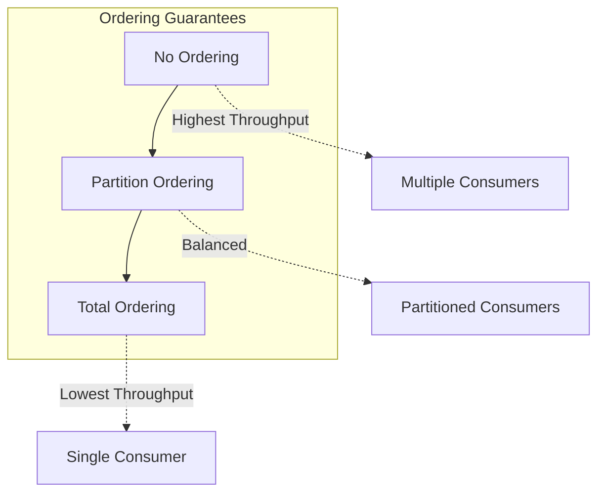

### Implementing Partition-Based Ordering with Kafka

```python
from kafka import KafkaProducer, KafkaConsumer
from kafka.errors import KafkaError
import json


class OrderedMessageProducer:
    """
    Producer that guarantees message ordering within a partition.

    Messages with the same partition key will always go to
    the same partition, ensuring ordered processing.
    """

    def __init__(self, bootstrap_servers: list, topic: str):
        """
        Initialize the Kafka producer.

        Args:
            bootstrap_servers: List of Kafka broker addresses
            topic: Target topic name
        """
        self.topic = topic
        self.producer = KafkaProducer(
            bootstrap_servers=bootstrap_servers,
            # Serialize values to JSON bytes
            value_serializer=lambda v: json.dumps(v).encode('utf-8'),
            # Serialize keys to bytes
            key_serializer=lambda k: k.encode('utf-8') if k else None,
            # Wait for all replicas to acknowledge
            acks='all',
            # Retry transient failures
            retries=3,
            # Enable idempotent producer to prevent duplicates
            enable_idempotence=True,
            # Maximum in-flight requests per connection
            # Set to 1 for strict ordering, higher for throughput
            max_in_flight_requests_per_connection=1
        )

    def send_ordered_message(
        self,
        partition_key: str,
        message: dict
    ) -> bool:
        """
        Send a message with ordering guarantee.

        All messages with the same partition_key will be
        processed in the order they were sent.

        Args:
            partition_key: Key used for partition assignment
                          (e.g., user_id, order_id)
            message: Message payload

        Returns:
            True if send was successful
        """
        try:
            # Send message with partition key
            # Kafka hashes the key to determine partition
            future = self.producer.send(
                self.topic,
                key=partition_key,
                value=message
            )
            # Block until message is sent (or timeout)
            record_metadata = future.get(timeout=10)

            print(f"Message sent to partition {record_metadata.partition} "
                  f"at offset {record_metadata.offset}")
            return True

        except KafkaError as e:
            print(f"Failed to send message: {e}")
            return False

    def close(self):
        """Flush pending messages and close the producer."""
        self.producer.flush()
        self.producer.close()


class OrderedMessageConsumer:
    """
    Consumer that processes messages in partition order.

    Each partition is processed by exactly one consumer
    in a consumer group, maintaining order.
    """

    def __init__(
        self,
        bootstrap_servers: list,
        topic: str,
        group_id: str
    ):
        """
        Initialize the Kafka consumer.

        Args:
            bootstrap_servers: List of Kafka broker addresses
            topic: Topic to consume from
            group_id: Consumer group ID for coordination
        """
        self.consumer = KafkaConsumer(
            topic,
            bootstrap_servers=bootstrap_servers,
            group_id=group_id,
            # Deserialize JSON messages
            value_deserializer=lambda m: json.loads(m.decode('utf-8')),
            # Start from earliest if no committed offset
            auto_offset_reset='earliest',
            # Disable auto-commit for manual control
            enable_auto_commit=False,
            # Maximum records per poll
            max_poll_records=100
        )

    def process_messages(self, handler):
        """
        Process messages in order, committing after each batch.

        Args:
            handler: Function to process each message
        """
        try:
            for message in self.consumer:
                # Process the message
                handler(
                    key=message.key.decode('utf-8') if message.key else None,
                    value=message.value,
                    partition=message.partition,
                    offset=message.offset
                )

                # Commit offset after successful processing
                # This ensures at-least-once delivery
                self.consumer.commit()

        except Exception as e:
            print(f"Error processing message: {e}")
            raise
        finally:
            self.consumer.close()
```

### Handling Out-of-Order Messages

When strict ordering is not possible, implement idempotency and sequence tracking:

```python
from dataclasses import dataclass
from typing import Callable, Any
import redis
import json


@dataclass
class SequencedMessage:
    """Message with sequence information for ordering."""
    sequence_id: str      # Unique identifier for the sequence
    sequence_num: int     # Position in the sequence
    payload: dict         # Actual message content


class OutOfOrderHandler:
    """
    Handler for processing potentially out-of-order messages.

    Uses Redis to track sequence state and buffer messages
    that arrive before their predecessors.
    """

    def __init__(self, redis_client: redis.Redis):
        """
        Initialize the handler with Redis for state tracking.

        Args:
            redis_client: Redis connection for sequence state
        """
        self.redis = redis_client
        # Buffer messages that arrive out of order
        self.buffer_ttl = 3600  # 1 hour buffer TTL

    def process_message(
        self,
        message: SequencedMessage,
        handler: Callable
    ) -> bool:
        """
        Process a message, handling out-of-order arrival.

        If a message arrives before its predecessor, it is
        buffered. When the predecessor is processed, buffered
        messages are processed in sequence.

        Args:
            message: The incoming message with sequence info
            handler: Function to process the message payload

        Returns:
            True if message was processed (now or later)
        """
        seq_key = f"seq:{message.sequence_id}"
        buffer_key = f"buffer:{message.sequence_id}"

        # Get the expected next sequence number
        expected = self.redis.get(seq_key)
        expected_num = int(expected) if expected else 0

        if message.sequence_num == expected_num:
            # Message is in order, process it
            handler(message.payload)

            # Update expected sequence number
            self.redis.incr(seq_key)

            # Check buffer for next messages
            self._process_buffered(message.sequence_id, handler)
            return True

        elif message.sequence_num > expected_num:
            # Message arrived early, buffer it
            self.redis.hset(
                buffer_key,
                message.sequence_num,
                json.dumps(message.payload)
            )
            self.redis.expire(buffer_key, self.buffer_ttl)
            return True

        else:
            # Duplicate message (already processed)
            return False

    def _process_buffered(self, sequence_id: str, handler: Callable):
        """
        Process any buffered messages that are now in order.

        Args:
            sequence_id: The sequence to check
            handler: Function to process each message
        """
        seq_key = f"seq:{sequence_id}"
        buffer_key = f"buffer:{sequence_id}"

        while True:
            expected = int(self.redis.get(seq_key) or 0)

            # Check if next message is buffered
            payload_json = self.redis.hget(buffer_key, expected)
            if not payload_json:
                break

            # Process the buffered message
            payload = json.loads(payload_json)
            handler(payload)

            # Update state
            self.redis.incr(seq_key)
            self.redis.hdel(buffer_key, expected)
```

## Message Queue Comparison: RabbitMQ vs Kafka vs SQS

Choosing the right message queue depends on your specific requirements. Here is a detailed comparison.

### Architecture Overview

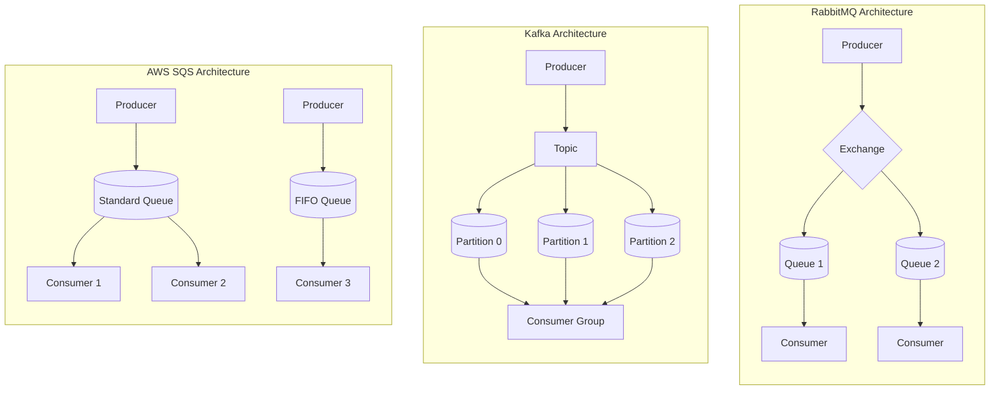

### Feature Comparison Table

| Feature | RabbitMQ | Apache Kafka | AWS SQS |
|---------|----------|--------------|---------|
| **Protocol** | AMQP, MQTT, STOMP | Custom binary | HTTP/REST |
| **Message Retention** | Until consumed | Time or size based | Up to 14 days |
| **Ordering** | Per-queue FIFO | Per-partition | FIFO queues only |
| **Throughput** | ~50K msg/sec | ~1M msg/sec | ~3K msg/sec (FIFO) |
| **Replay** | Not supported | Native support | Not supported |
| **Clustering** | Mirrored queues | Native replication | Managed by AWS |
| **Latency** | Milliseconds | Milliseconds | ~20-100ms |
| **Best For** | Complex routing | Event streaming | Serverless apps |

### When to Use Each

#### RabbitMQ

Best for:
- Complex routing requirements
- Multiple protocols (AMQP, MQTT)
- Request-reply patterns
- Priority queues
- Delayed messages

```python
# RabbitMQ: Complex routing example
import pika


def setup_complex_routing(channel):
    """
    Set up topic-based routing with multiple bindings.

    This enables flexible message routing based on
    routing key patterns.
    """
    # Declare a topic exchange
    channel.exchange_declare(
        exchange='events',
        exchange_type='topic',
        durable=True
    )

    # Queue for all order events
    channel.queue_declare(queue='order_events', durable=True)
    channel.queue_bind(
        exchange='events',
        queue='order_events',
        routing_key='order.*'  # Matches order.created, order.updated, etc.
    )

    # Queue for critical events across all domains
    channel.queue_declare(queue='critical_events', durable=True)
    channel.queue_bind(
        exchange='events',
        queue='critical_events',
        routing_key='*.critical'  # Matches order.critical, payment.critical
    )

    # Queue for audit logging (all events)
    channel.queue_declare(queue='audit_log', durable=True)
    channel.queue_bind(
        exchange='events',
        queue='audit_log',
        routing_key='#'  # Matches everything
    )
```

#### Apache Kafka

Best for:
- High-throughput event streaming
- Event sourcing architectures
- Log aggregation
- Stream processing
- Message replay requirements

```python
# Kafka: Event sourcing example
from kafka import KafkaProducer, KafkaConsumer
from datetime import datetime
import json


class EventStore:
    """
    Event store implementation using Kafka.

    Kafka's log-based storage makes it ideal for
    event sourcing where you need to replay events.
    """

    def __init__(self, bootstrap_servers: list):
        self.producer = KafkaProducer(
            bootstrap_servers=bootstrap_servers,
            value_serializer=lambda v: json.dumps(v).encode('utf-8'),
            key_serializer=lambda k: k.encode('utf-8'),
            acks='all'
        )

    def append_event(
        self,
        aggregate_id: str,
        event_type: str,
        event_data: dict,
        topic: str = 'events'
    ):
        """
        Append an event to the event store.

        Events are keyed by aggregate_id to ensure
        all events for an aggregate go to the same partition
        (maintaining order).

        Args:
            aggregate_id: ID of the aggregate (e.g., order_123)
            event_type: Type of event (e.g., OrderCreated)
            event_data: Event payload
            topic: Kafka topic for events
        """
        event = {
            'aggregate_id': aggregate_id,
            'event_type': event_type,
            'event_data': event_data,
            'timestamp': datetime.utcnow().isoformat(),
            'version': 1
        }

        # Key by aggregate_id for partition locality
        self.producer.send(
            topic,
            key=aggregate_id,
            value=event
        )
        self.producer.flush()

    def replay_events(
        self,
        topic: str,
        from_beginning: bool = True
    ):
        """
        Replay all events from the store.

        This is useful for rebuilding read models
        or recovering state after failures.

        Args:
            topic: Topic to replay from
            from_beginning: Start from earliest offset

        Yields:
            Event dictionaries in order
        """
        consumer = KafkaConsumer(
            topic,
            bootstrap_servers=self.producer.config['bootstrap_servers'],
            value_deserializer=lambda m: json.loads(m.decode('utf-8')),
            auto_offset_reset='earliest' if from_beginning else 'latest',
            enable_auto_commit=False,
            consumer_timeout_ms=5000  # Stop after 5s of no messages
        )

        for message in consumer:
            yield message.value

        consumer.close()
```

#### AWS SQS

Best for:
- Serverless architectures
- Simple queue requirements
- AWS Lambda integration
- Managed infrastructure needs
- Cost-effective scaling

```python
# AWS SQS: Lambda integration example
import boto3
import json
from typing import Dict, Any


class SQSQueueManager:
    """
    SQS queue manager for serverless architectures.

    SQS integrates seamlessly with AWS Lambda,
    enabling event-driven serverless processing.
    """

    def __init__(self, queue_url: str, region: str = 'us-east-1'):
        """
        Initialize the SQS client.

        Args:
            queue_url: Full URL of the SQS queue
            region: AWS region
        """
        self.sqs = boto3.client('sqs', region_name=region)
        self.queue_url = queue_url

    def send_message(
        self,
        message: Dict[str, Any],
        delay_seconds: int = 0,
        message_group_id: str = None,  # Required for FIFO queues
        deduplication_id: str = None   # Required for FIFO queues
    ) -> str:
        """
        Send a message to the SQS queue.

        Args:
            message: Message payload (will be JSON serialized)
            delay_seconds: Delay before message is visible (0-900)
            message_group_id: Group ID for FIFO ordering
            deduplication_id: ID for deduplication (FIFO)

        Returns:
            Message ID from SQS
        """
        params = {
            'QueueUrl': self.queue_url,
            'MessageBody': json.dumps(message),
            'DelaySeconds': delay_seconds
        }

        # Add FIFO-specific parameters if provided
        if message_group_id:
            params['MessageGroupId'] = message_group_id
        if deduplication_id:
            params['MessageDeduplicationId'] = deduplication_id

        response = self.sqs.send_message(**params)
        return response['MessageId']

    def receive_and_process(
        self,
        handler,
        max_messages: int = 10,
        wait_time_seconds: int = 20
    ):
        """
        Receive and process messages with automatic deletion.

        Uses long polling for efficient message retrieval.

        Args:
            handler: Function to process each message
            max_messages: Maximum messages per request (1-10)
            wait_time_seconds: Long polling duration (0-20)
        """
        response = self.sqs.receive_message(
            QueueUrl=self.queue_url,
            MaxNumberOfMessages=max_messages,
            WaitTimeSeconds=wait_time_seconds,
            # Get all message attributes
            MessageAttributeNames=['All'],
            # Get system attributes like ApproximateReceiveCount
            AttributeNames=['All']
        )

        messages = response.get('Messages', [])

        for message in messages:
            try:
                # Parse the message body
                body = json.loads(message['Body'])

                # Process the message
                handler(body)

                # Delete message after successful processing
                self.sqs.delete_message(
                    QueueUrl=self.queue_url,
                    ReceiptHandle=message['ReceiptHandle']
                )

            except Exception as e:
                # Message will return to queue after visibility timeout
                print(f"Error processing message: {e}")
                # Optionally, send to DLQ after max retries
                receive_count = int(
                    message['Attributes'].get('ApproximateReceiveCount', 0)
                )
                if receive_count >= 3:
                    self._send_to_dlq(message)


# Lambda handler for SQS trigger
def lambda_handler(event, context):
    """
    AWS Lambda handler for SQS events.

    Lambda automatically:
    - Polls the queue
    - Invokes this function with batches of messages
    - Deletes messages on successful return
    - Retries on failure

    Args:
        event: SQS event with Records array
        context: Lambda context

    Returns:
        Processing result
    """
    failed_records = []

    for record in event['Records']:
        try:
            # Parse message body
            body = json.loads(record['body'])

            # Process the message
            process_order(body)

        except Exception as e:
            # Track failed records for partial batch failure
            failed_records.append({
                'itemIdentifier': record['messageId']
            })

    # Return failed records for retry
    # Successful records are automatically deleted
    return {
        'batchItemFailures': failed_records
    }
```

### Decision Matrix

Use this flowchart to help choose the right queue:

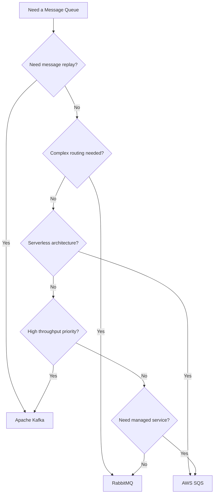

## Best Practices for Queue Architecture

### 1. Implement Dead Letter Queues

Always have a strategy for handling failed messages:

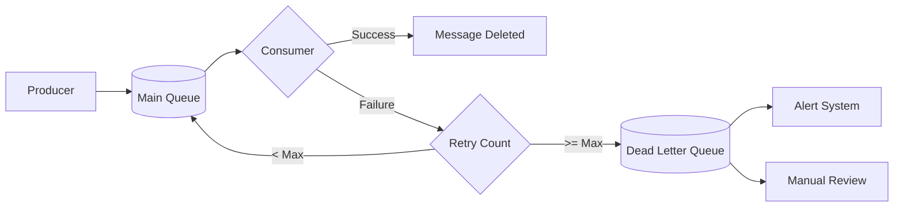

### 2. Design for Idempotency

Messages may be delivered more than once. Design consumers to handle duplicates:

```python
import redis
from typing import Callable, Any


class IdempotentConsumer:
    """
    Consumer wrapper that ensures idempotent processing.

    Uses Redis to track processed message IDs and
    prevent duplicate processing.
    """

    def __init__(self, redis_client: redis.Redis, ttl: int = 86400):
        """
        Initialize the idempotent consumer.

        Args:
            redis_client: Redis connection for deduplication
            ttl: How long to remember processed messages (seconds)
        """
        self.redis = redis_client
        self.ttl = ttl

    def process_once(
        self,
        message_id: str,
        handler: Callable,
        message: Any
    ) -> bool:
        """
        Process a message exactly once.

        If the message was already processed, skip it.
        Uses Redis SETNX for atomic check-and-set.

        Args:
            message_id: Unique message identifier
            handler: Function to process the message
            message: Message payload

        Returns:
            True if message was processed, False if duplicate
        """
        key = f"processed:{message_id}"

        # Try to set the key (only succeeds if key does not exist)
        # This is atomic, preventing race conditions
        was_set = self.redis.setnx(key, "processing")

        if not was_set:
            # Message was already processed
            return False

        try:
            # Set TTL on the key
            self.redis.expire(key, self.ttl)

            # Process the message
            handler(message)

            # Mark as completed
            self.redis.set(key, "completed", ex=self.ttl)
            return True

        except Exception as e:
            # Remove the key so message can be retried
            self.redis.delete(key)
            raise
```

### 3. Monitor Queue Health

Track these key metrics:

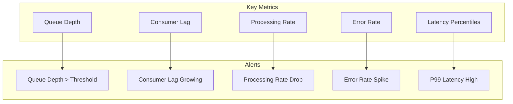

### 4. Plan for Scaling

Design your queue architecture to scale horizontally:

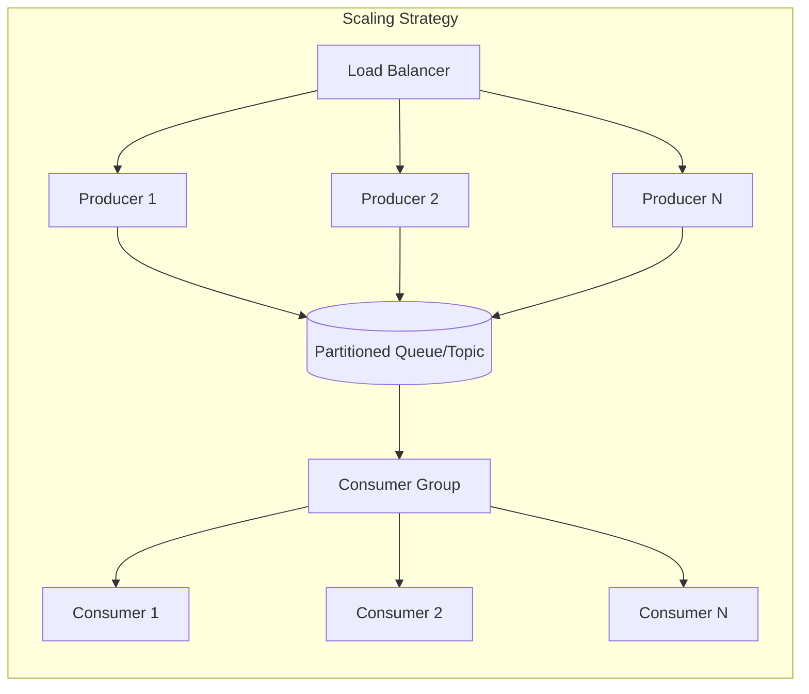

## Common Anti-Patterns to Avoid

### 1. Fire and Forget Without Confirmation

Never assume a message was delivered without confirmation:

```python
# Bad: No confirmation
def bad_publish(channel, message):
    channel.basic_publish(exchange='', routing_key='queue', body=message)
    # Message might be lost if broker is unavailable


# Good: Wait for confirmation
def good_publish(channel, message):
    channel.confirm_delivery()
    try:
        channel.basic_publish(
            exchange='',
            routing_key='queue',
            body=message,
            mandatory=True
        )
        return True
    except Exception:
        # Handle failure, retry, or alert
        return False
```

### 2. Unbounded Queue Growth

Always set limits to prevent memory exhaustion:

```python
# Configure queue with limits
channel.queue_declare(
    queue='bounded_queue',
    durable=True,
    arguments={
        # Maximum number of messages
        'x-max-length': 100000,
        # Maximum queue size in bytes
        'x-max-length-bytes': 1073741824,  # 1GB
        # Overflow behavior: drop-head, reject-publish, or reject-publish-dlx
        'x-overflow': 'reject-publish-dlx'
    }
)
```

### 3. Missing Poison Message Handling

Messages that consistently fail can block processing:

```python
def process_with_poison_handling(channel, method, body, max_retries=3):
    """
    Process message with poison message detection.

    After max_retries, move message to DLQ instead of
    retrying forever.
    """
    # Get retry count from message headers
    headers = method.headers or {}
    retry_count = headers.get('x-retry-count', 0)

    try:
        process_message(body)
        channel.basic_ack(delivery_tag=method.delivery_tag)

    except Exception as e:
        if retry_count >= max_retries:
            # Move to dead letter queue
            channel.basic_reject(
                delivery_tag=method.delivery_tag,
                requeue=False  # Triggers DLQ routing
            )
            log_poison_message(body, e)
        else:
            # Requeue with incremented retry count
            channel.basic_nack(
                delivery_tag=method.delivery_tag,
                requeue=True
            )
```

## End-to-End Architecture Example

Here is a complete example of a robust order processing system:

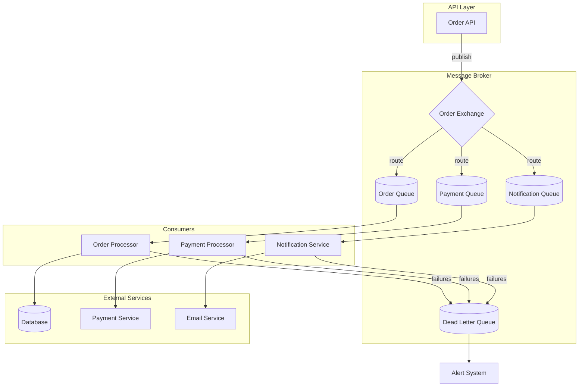

## Conclusion

Building a robust queue architecture requires careful consideration of:

1. **Topology**: Choose the right pattern for your use case, whether it is point-to-point, pub/sub, or topic-based routing
2. **Durability**: Configure persistence and replication based on your reliability requirements
3. **Ordering**: Understand the ordering guarantees you need and design accordingly
4. **Technology**: Select RabbitMQ, Kafka, or SQS based on your specific requirements

Remember that no single solution fits all scenarios. Often, production systems use multiple queue technologies for different purposes. Start with the simplest solution that meets your requirements, and evolve your architecture as your needs grow.

By following the patterns and practices outlined in this guide, you will build message queue architectures that are reliable, scalable, and maintainable.

## Further Reading

- [RabbitMQ Documentation](https://www.rabbitmq.com/documentation.html)
- [Apache Kafka Documentation](https://kafka.apache.org/documentation/)
- [AWS SQS Developer Guide](https://docs.aws.amazon.com/sqs/)
- [Enterprise Integration Patterns](https://www.enterpriseintegrationpatterns.com/)
