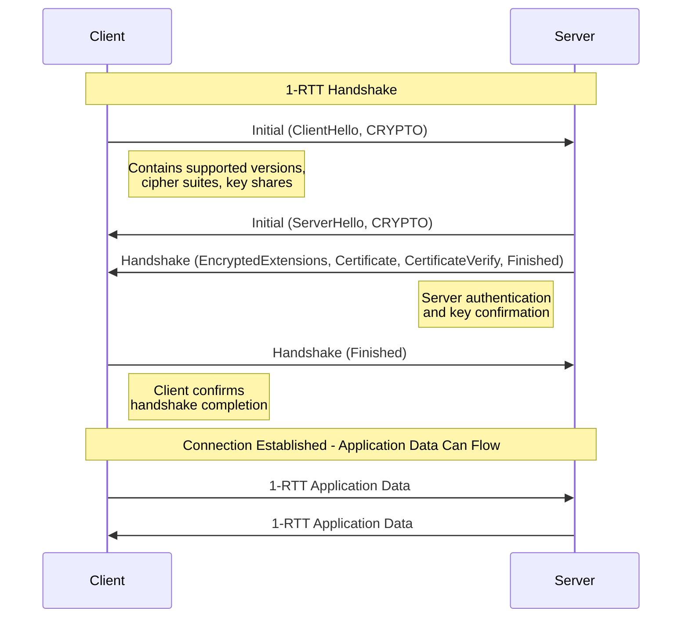
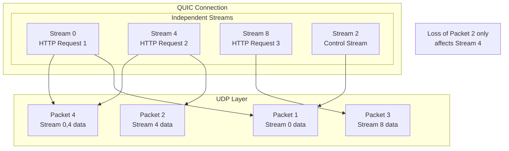
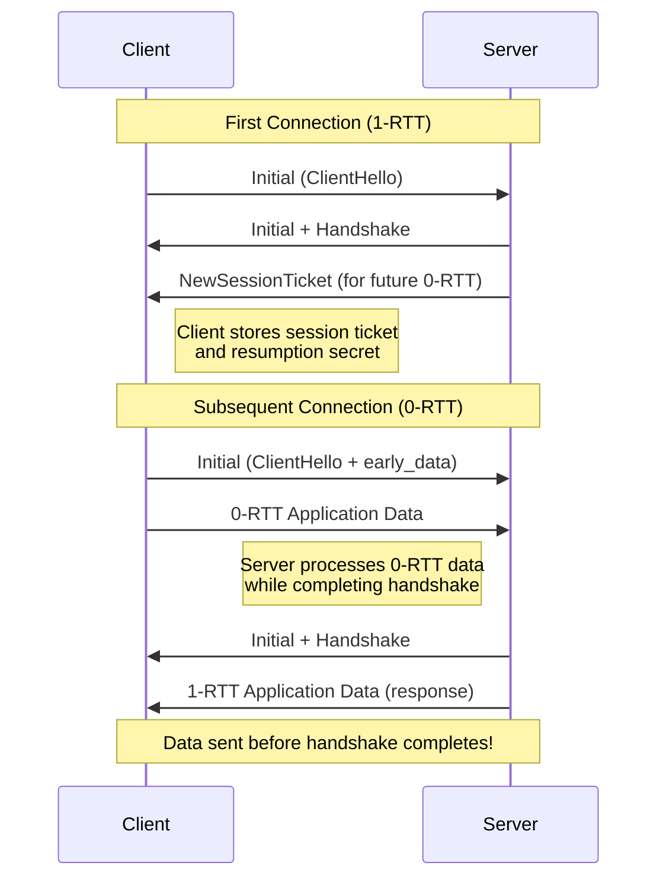
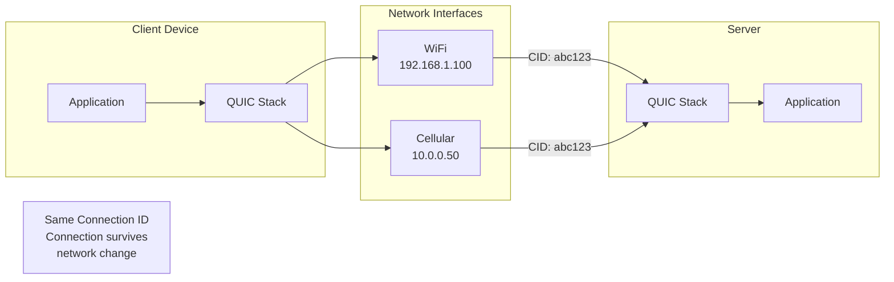

# How to Implement QUIC Protocol Configuration

Author: [nawazdhandala](https://github.com/nawazdhandala)

Tags: Networking, QUIC, Performance, HTTP3

Description: A comprehensive guide to configuring QUIC protocol for faster, more reliable network transport in modern applications.

---

## Introduction to QUIC Protocol

QUIC (Quick UDP Internet Connections) is a modern transport layer protocol developed by Google and standardized by the IETF. It provides a secure, multiplexed connection over UDP, combining the reliability of TCP with the speed advantages of UDP. QUIC serves as the foundation for HTTP/3 and addresses many limitations of traditional TCP/TLS connections.

### Why QUIC Matters

Traditional TCP connections suffer from several issues:

- **Head-of-line blocking**: A single lost packet blocks all streams
- **Connection setup latency**: TCP + TLS requires multiple round trips
- **Connection migration issues**: IP changes require new connections
- **Ossification**: Middleboxes make TCP evolution difficult

QUIC solves these problems by implementing transport features in user space over UDP, enabling faster iteration and deployment.

## QUIC Protocol Fundamentals

### Core Features

QUIC integrates several key features that make it superior for modern applications:

1. **Built-in encryption**: TLS 1.3 is mandatory and integrated into the protocol
2. **Stream multiplexing**: Multiple independent streams over a single connection
3. **Connection migration**: Seamless handover between networks
4. **Reduced latency**: 0-RTT and 1-RTT connection establishment
5. **Improved loss recovery**: Per-stream flow control and congestion control

### QUIC Packet Structure

QUIC packets contain a header and encrypted payload. The header includes:

```
QUIC Packet Structure:
+------------------+------------------+
| Header Form (1)  | Fixed Bit (1)    |
+------------------+------------------+
| Packet Type (2)  | Reserved (2)     |
+------------------+------------------+
| Packet Number Length (2)            |
+-------------------------------------+
| Version (32)                        |
+-------------------------------------+
| Destination Connection ID           |
+-------------------------------------+
| Source Connection ID                |
+-------------------------------------+
| Payload (encrypted)                 |
+-------------------------------------+
```

## QUIC Handshake Process

The QUIC handshake combines transport and cryptographic setup in a single operation. Here is the handshake flow:



### Initial Handshake Code Example

Here is an example of initiating a QUIC connection using the quiche library in Rust:

```rust
// Import the quiche library for QUIC implementation
use quiche::{Config, Connection};
use std::net::UdpSocket;

fn create_quic_client() -> Result<(), Box<dyn std::error::Error>> {
    // Create a new QUIC configuration
    let mut config = Config::new(quiche::PROTOCOL_VERSION)?;

    // Set application protocols (ALPN) - HTTP/3 uses "h3"
    config.set_application_protos(&[b"h3"])?;

    // Configure TLS certificate verification
    // In production, use proper certificate verification
    config.verify_peer(true);
    config.load_verify_locations_from_directory("/etc/ssl/certs")?;

    // Set maximum idle timeout to 30 seconds
    config.set_max_idle_timeout(30_000);

    // Configure initial flow control limits
    // These control how much data can be sent before acknowledgment
    config.set_initial_max_data(10_000_000);           // Connection-level limit
    config.set_initial_max_stream_data_bidi_local(1_000_000);  // Local bidirectional streams
    config.set_initial_max_stream_data_bidi_remote(1_000_000); // Remote bidirectional streams
    config.set_initial_max_stream_data_uni(1_000_000);         // Unidirectional streams

    // Set maximum number of concurrent streams
    config.set_initial_max_streams_bidi(100);  // Bidirectional streams
    config.set_initial_max_streams_uni(100);   // Unidirectional streams

    // Generate a unique Source Connection ID
    let scid = generate_connection_id();

    // Create the QUIC connection
    let mut conn = quiche::connect(
        Some("example.com"),  // Server name for SNI
        &scid,               // Source Connection ID
        local_addr,          // Local socket address
        peer_addr,           // Server address
        &mut config,         // Configuration
    )?;

    println!("QUIC connection initiated");
    Ok(())
}

// Generate a random connection ID
fn generate_connection_id() -> quiche::ConnectionId<'static> {
    let mut id = [0u8; 16];
    // Use a cryptographically secure random number generator
    rand::thread_rng().fill(&mut id);
    quiche::ConnectionId::from_vec(id.to_vec())
}
```

## Connection and Stream Multiplexing

One of QUIC's most powerful features is stream multiplexing without head-of-line blocking. Each stream is independent, so packet loss on one stream does not affect others.

### Stream Types in QUIC

QUIC supports four types of streams:

| Stream Type | Initiated By | Direction | Use Case |
|-------------|--------------|-----------|----------|
| Client-initiated bidirectional | Client | Both ways | HTTP requests/responses |
| Server-initiated bidirectional | Server | Both ways | Server push, WebSocket-like |
| Client-initiated unidirectional | Client | Client to Server | Control streams, QPACK |
| Server-initiated unidirectional | Server | Server to Client | Server announcements |

### Stream Multiplexing Diagram



### Stream Management Code Example

```rust
// Example of managing multiple streams in QUIC
use quiche::{Connection, StreamIter};

fn handle_streams(conn: &mut Connection) -> Result<(), Box<dyn std::error::Error>> {
    // Buffer for reading stream data
    let mut buf = [0u8; 65535];

    // Iterate over all readable streams
    // readable() returns an iterator of stream IDs with pending data
    for stream_id in conn.readable() {
        // Read data from the stream
        // recv() returns (bytes_read, is_finished)
        while let Ok((read, fin)) = conn.stream_recv(stream_id, &mut buf) {
            println!(
                "Received {} bytes on stream {}, finished: {}",
                read, stream_id, fin
            );

            // Process the received data
            let data = &buf[..read];
            process_stream_data(stream_id, data)?;

            // If stream is finished, clean up resources
            if fin {
                println!("Stream {} completed", stream_id);
                cleanup_stream(stream_id)?;
            }
        }
    }

    Ok(())
}

// Send data on a new stream
fn send_request(conn: &mut Connection, data: &[u8]) -> Result<u64, Box<dyn std::error::Error>> {
    // Get the next available stream ID for client-initiated bidirectional stream
    // Client bidirectional streams use IDs: 0, 4, 8, 12, ...
    let stream_id = conn.stream_writable_next()
        .ok_or("No writable streams available")?;

    // Send data on the stream
    // The third parameter (fin) indicates if this is the final data
    let written = conn.stream_send(stream_id, data, true)?;

    println!("Sent {} bytes on stream {}", written, stream_id);

    Ok(stream_id)
}

// Configure stream priorities for better resource allocation
fn set_stream_priority(
    conn: &mut Connection,
    stream_id: u64,
    urgency: u8,      // 0 (highest) to 7 (lowest)
    incremental: bool  // Whether to deliver incrementally
) -> Result<(), Box<dyn std::error::Error>> {
    // Set stream priority using HTTP/3 priority scheme
    conn.stream_priority(stream_id, urgency, incremental)?;

    println!(
        "Stream {} priority set to urgency={}, incremental={}",
        stream_id, urgency, incremental
    );

    Ok(())
}
```

## 0-RTT Connection Resumption

0-RTT (Zero Round Trip Time) allows clients to send data immediately when reconnecting to a previously visited server. This dramatically reduces latency for repeat connections.

### How 0-RTT Works



### 0-RTT Configuration Example

```rust
// Configure QUIC client for 0-RTT resumption
use quiche::Config;
use std::fs;
use std::path::Path;

fn configure_zero_rtt(config: &mut Config) -> Result<(), Box<dyn std::error::Error>> {
    // Enable early data (0-RTT)
    // The parameter specifies the maximum early data size in bytes
    config.enable_early_data();
    config.set_initial_max_early_data(16384);  // 16KB of early data

    Ok(())
}

// Store session ticket for future 0-RTT connections
fn store_session_ticket(
    conn: &Connection,
    server_name: &str
) -> Result<(), Box<dyn std::error::Error>> {
    // Check if a new session ticket is available
    if let Some(ticket) = conn.session() {
        // Create a path for storing the session ticket
        let ticket_path = format!("/tmp/quic_sessions/{}.ticket", server_name);

        // Ensure the directory exists
        fs::create_dir_all("/tmp/quic_sessions")?;

        // Store the session ticket securely
        fs::write(&ticket_path, ticket)?;

        println!("Session ticket stored for {}", server_name);
    }

    Ok(())
}

// Attempt 0-RTT connection with stored session
fn connect_with_zero_rtt(
    config: &mut Config,
    server_name: &str,
    early_data: &[u8]
) -> Result<Connection, Box<dyn std::error::Error>> {
    let ticket_path = format!("/tmp/quic_sessions/{}.ticket", server_name);

    // Load the stored session ticket if available
    if Path::new(&ticket_path).exists() {
        let ticket = fs::read(&ticket_path)?;
        config.set_ticket(&ticket)?;
        println!("Loaded session ticket for 0-RTT");
    }

    // Create connection with the session ticket
    let scid = generate_connection_id();
    let mut conn = quiche::connect(
        Some(server_name),
        &scid,
        local_addr,
        peer_addr,
        config,
    )?;

    // Attempt to send early data (0-RTT)
    if conn.is_early_data_ready() {
        // Get a stream for early data
        let stream_id = 0;  // First client-initiated bidirectional stream

        // Send early data on the stream
        match conn.stream_send(stream_id, early_data, false) {
            Ok(written) => {
                println!("Sent {} bytes as 0-RTT early data", written);
            }
            Err(e) => {
                println!("Failed to send early data: {}", e);
            }
        }
    }

    Ok(conn)
}
```

### Security Considerations for 0-RTT

0-RTT data has specific security implications:

1. **Replay attacks**: 0-RTT data can be replayed by attackers
2. **Forward secrecy**: 0-RTT data does not have forward secrecy
3. **Idempotency**: Only send idempotent requests in 0-RTT

```rust
// Example: Validating 0-RTT data is safe to process
fn is_safe_for_zero_rtt(request: &HttpRequest) -> bool {
    // Only allow safe, idempotent methods in 0-RTT
    match request.method() {
        // GET and HEAD are safe for 0-RTT
        Method::GET | Method::HEAD => true,

        // POST, PUT, DELETE may have side effects
        // Do not send these in 0-RTT
        _ => false,
    }
}

// Server-side 0-RTT replay protection
fn handle_early_data(
    conn: &mut Connection,
    anti_replay: &mut AntiReplayCache
) -> Result<(), Box<dyn std::error::Error>> {
    // Check if this is early data (0-RTT)
    if conn.is_early_data_accepted() {
        // Extract a unique identifier from the early data
        let client_random = conn.client_random();

        // Check for replay
        if anti_replay.check_and_insert(client_random) {
            // This is a replay, reject the request
            return Err("0-RTT replay detected".into());
        }

        println!("0-RTT data accepted and verified");
    }

    Ok(())
}
```

## Migration and Connection ID

QUIC supports seamless connection migration, allowing connections to survive network changes (such as switching from WiFi to cellular). This is achieved through Connection IDs.

### Connection Migration Architecture



### Connection ID Management

```rust
// Connection ID management for migration support
use quiche::{Connection, ConnectionId};
use std::collections::HashMap;

// Structure to manage connection IDs
struct ConnectionIdManager {
    // Map of connection IDs to connection state
    active_cids: HashMap<Vec<u8>, ConnectionState>,
    // Number of connection IDs to maintain
    cid_pool_size: usize,
}

impl ConnectionIdManager {
    fn new() -> Self {
        ConnectionIdManager {
            active_cids: HashMap::new(),
            cid_pool_size: 8,  // Maintain 8 connection IDs per connection
        }
    }

    // Issue new connection IDs for migration
    fn issue_connection_ids(
        &mut self,
        conn: &mut Connection
    ) -> Result<(), Box<dyn std::error::Error>> {
        // Calculate how many new CIDs to issue
        let current_cids = conn.active_cids();
        let needed = self.cid_pool_size.saturating_sub(current_cids);

        for _ in 0..needed {
            // Generate a new unique connection ID
            let new_cid = self.generate_cid();

            // Create a stateless reset token for this CID
            // This allows the server to terminate connections
            // without maintaining state
            let reset_token = self.generate_reset_token(&new_cid);

            // Issue the new CID to the peer
            conn.new_connection_id(&new_cid, reset_token, false)?;

            // Store the CID mapping
            self.active_cids.insert(
                new_cid.to_vec(),
                ConnectionState::Active
            );

            println!("Issued new connection ID: {:?}", new_cid);
        }

        Ok(())
    }

    // Handle connection migration
    fn handle_migration(
        &mut self,
        conn: &mut Connection,
        new_path: &SocketAddr
    ) -> Result<(), Box<dyn std::error::Error>> {
        // Validate the new path
        if !self.validate_path(new_path) {
            return Err("Invalid migration path".into());
        }

        // Probe the new path before migrating
        conn.probe_path(new_path.clone(), local_addr)?;

        println!("Initiated path probe to {}", new_path);

        Ok(())
    }

    // Retire old connection IDs after migration
    fn retire_connection_id(
        &mut self,
        conn: &mut Connection,
        cid: &[u8]
    ) -> Result<(), Box<dyn std::error::Error>> {
        // Request the peer to stop using this CID
        conn.retire_connection_id(cid)?;

        // Mark as retired in our tracking
        if let Some(state) = self.active_cids.get_mut(cid) {
            *state = ConnectionState::Retired;
        }

        println!("Retired connection ID: {:?}", cid);

        Ok(())
    }

    fn generate_cid(&self) -> ConnectionId<'static> {
        let mut id = [0u8; 16];
        rand::thread_rng().fill(&mut id);
        ConnectionId::from_vec(id.to_vec())
    }

    fn generate_reset_token(&self, cid: &ConnectionId) -> [u8; 16] {
        // In production, use HMAC with a secret key
        let mut token = [0u8; 16];
        // Derive token from CID using a secret
        token
    }
}

enum ConnectionState {
    Active,
    Retired,
}
```

### Path Validation

When a connection migrates to a new network path, QUIC performs path validation to prevent address spoofing:

```rust
// Path validation implementation
struct PathValidator {
    pending_challenges: HashMap<SocketAddr, Vec<u8>>,
}

impl PathValidator {
    fn new() -> Self {
        PathValidator {
            pending_challenges: HashMap::new(),
        }
    }

    // Initiate path validation for a new address
    fn start_validation(
        &mut self,
        conn: &mut Connection,
        new_path: SocketAddr
    ) -> Result<(), Box<dyn std::error::Error>> {
        // Generate a random challenge
        let mut challenge = [0u8; 8];
        rand::thread_rng().fill(&mut challenge);

        // Send PATH_CHALLENGE frame
        conn.send_path_challenge(&challenge, new_path)?;

        // Store the challenge for verification
        self.pending_challenges.insert(new_path, challenge.to_vec());

        println!("Sent PATH_CHALLENGE to {}", new_path);

        Ok(())
    }

    // Process PATH_RESPONSE from peer
    fn handle_response(
        &mut self,
        conn: &mut Connection,
        path: SocketAddr,
        response: &[u8]
    ) -> Result<bool, Box<dyn std::error::Error>> {
        // Check if we have a pending challenge for this path
        if let Some(challenge) = self.pending_challenges.get(&path) {
            if challenge == response {
                // Path is validated, safe to migrate
                println!("Path {} validated successfully", path);
                self.pending_challenges.remove(&path);
                return Ok(true);
            }
        }

        // Invalid response
        println!("Path validation failed for {}", path);
        Ok(false)
    }
}
```

## Server Configuration Example

Here is a complete example of configuring a QUIC server:

```rust
// Complete QUIC server configuration
use quiche::{Config, Connection};
use std::net::UdpSocket;
use std::collections::HashMap;

struct QuicServer {
    socket: UdpSocket,
    config: Config,
    connections: HashMap<Vec<u8>, Connection>,
}

impl QuicServer {
    fn new(bind_addr: &str) -> Result<Self, Box<dyn std::error::Error>> {
        // Bind UDP socket
        let socket = UdpSocket::bind(bind_addr)?;
        socket.set_nonblocking(true)?;

        // Create QUIC configuration
        let mut config = Config::new(quiche::PROTOCOL_VERSION)?;

        // Load TLS certificate and private key
        config.load_cert_chain_from_pem_file("server.crt")?;
        config.load_priv_key_from_pem_file("server.key")?;

        // Set application protocols
        config.set_application_protos(&[b"h3", b"hq-interop"])?;

        // Connection settings
        config.set_max_idle_timeout(60_000);  // 60 seconds
        config.set_max_recv_udp_payload_size(1350);
        config.set_max_send_udp_payload_size(1350);

        // Flow control configuration
        // Connection-level limit: how much total data before ACK needed
        config.set_initial_max_data(10_000_000);  // 10 MB

        // Per-stream limits
        config.set_initial_max_stream_data_bidi_local(1_000_000);   // 1 MB
        config.set_initial_max_stream_data_bidi_remote(1_000_000);  // 1 MB
        config.set_initial_max_stream_data_uni(1_000_000);          // 1 MB

        // Maximum concurrent streams
        config.set_initial_max_streams_bidi(100);
        config.set_initial_max_streams_uni(100);

        // Congestion control algorithm
        config.set_cc_algorithm(quiche::CongestionControlAlgorithm::BBR);

        // Enable connection migration
        config.enable_migration(true);

        // Enable 0-RTT early data
        config.enable_early_data();

        // Anti-amplification limit (3x before address validation)
        config.set_initial_max_data(10_000_000);

        // Enable DATAGRAM extension for unreliable data
        config.enable_dgram(true, 1000, 1000);

        println!("QUIC server configured on {}", bind_addr);

        Ok(QuicServer {
            socket,
            config,
            connections: HashMap::new(),
        })
    }

    // Accept new connections
    fn accept_connection(
        &mut self,
        dcid: &[u8],
        scid: &[u8],
        local: std::net::SocketAddr,
        peer: std::net::SocketAddr,
    ) -> Result<(), Box<dyn std::error::Error>> {
        // Create server-side connection
        let conn = quiche::accept(
            &ConnectionId::from_ref(scid),
            Some(&ConnectionId::from_ref(dcid)),
            local,
            peer,
            &mut self.config,
        )?;

        // Store the connection
        self.connections.insert(scid.to_vec(), conn);

        println!("Accepted new connection from {}", peer);

        Ok(())
    }

    // Process incoming packets
    fn process_packet(
        &mut self,
        packet: &mut [u8],
        recv_info: quiche::RecvInfo,
    ) -> Result<(), Box<dyn std::error::Error>> {
        // Parse the packet header to get the connection ID
        let hdr = quiche::Header::from_slice(packet, quiche::MAX_CONN_ID_LEN)?;

        // Find the connection for this packet
        let conn = match self.connections.get_mut(&hdr.dcid.to_vec()) {
            Some(c) => c,
            None => {
                // New connection, need to accept it
                if hdr.ty != quiche::Type::Initial {
                    return Err("Expected Initial packet for new connection".into());
                }

                self.accept_connection(
                    &hdr.dcid,
                    &hdr.scid,
                    recv_info.to,
                    recv_info.from,
                )?;

                self.connections.get_mut(&hdr.scid.to_vec()).unwrap()
            }
        };

        // Process the packet
        conn.recv(packet, recv_info)?;

        // Handle streams and send responses
        self.handle_connection_events(conn)?;

        Ok(())
    }

    fn handle_connection_events(
        &mut self,
        conn: &mut Connection
    ) -> Result<(), Box<dyn std::error::Error>> {
        // Process readable streams
        for stream_id in conn.readable() {
            let mut buf = [0u8; 65535];

            while let Ok((read, fin)) = conn.stream_recv(stream_id, &mut buf) {
                let data = &buf[..read];
                println!("Stream {}: received {} bytes", stream_id, read);

                // Echo the data back (example application logic)
                if fin {
                    conn.stream_send(stream_id, data, true)?;
                }
            }
        }

        Ok(())
    }
}
```

## Congestion Control and Flow Control

QUIC implements sophisticated congestion control to optimize throughput while avoiding network congestion.

### Congestion Control Algorithms

```rust
// Configure congestion control
fn configure_congestion_control(
    config: &mut Config
) -> Result<(), Box<dyn std::error::Error>> {
    // Available algorithms:
    // - Reno: Classic TCP Reno algorithm
    // - CUBIC: Default for most operating systems
    // - BBR: Google's Bottleneck Bandwidth and RTT algorithm

    // BBR is recommended for most use cases
    // It achieves higher throughput with lower latency
    config.set_cc_algorithm(quiche::CongestionControlAlgorithm::BBR);

    Ok(())
}

// Monitor congestion control state
fn log_congestion_stats(conn: &Connection) {
    let stats = conn.stats();

    println!("Congestion Control Statistics:");
    println!("  Congestion window: {} bytes", stats.cwnd);
    println!("  Bytes in flight: {} bytes", stats.bytes_in_flight);
    println!("  Smoothed RTT: {:?}", stats.rtt);
    println!("  RTT variance: {:?}", stats.rttvar);
    println!("  Packets sent: {}", stats.sent);
    println!("  Packets received: {}", stats.recv);
    println!("  Packets lost: {}", stats.lost);
    println!("  Bytes sent: {}", stats.sent_bytes);
    println!("  Bytes received: {}", stats.recv_bytes);
}
```

### Flow Control Configuration

```rust
// Fine-tune flow control for different use cases
fn configure_flow_control(
    config: &mut Config,
    use_case: &str
) -> Result<(), Box<dyn std::error::Error>> {
    match use_case {
        // High-throughput file transfer
        "file_transfer" => {
            config.set_initial_max_data(100_000_000);  // 100 MB connection limit
            config.set_initial_max_stream_data_bidi_local(50_000_000);
            config.set_initial_max_stream_data_bidi_remote(50_000_000);
            config.set_initial_max_streams_bidi(10);  // Few streams, large data
        }

        // Low-latency API calls
        "api" => {
            config.set_initial_max_data(1_000_000);  // 1 MB connection limit
            config.set_initial_max_stream_data_bidi_local(100_000);
            config.set_initial_max_stream_data_bidi_remote(100_000);
            config.set_initial_max_streams_bidi(1000);  // Many concurrent requests
        }

        // Real-time streaming
        "streaming" => {
            config.set_initial_max_data(50_000_000);  // 50 MB connection limit
            config.set_initial_max_stream_data_uni(10_000_000);
            config.set_initial_max_streams_uni(10);
            // Enable datagrams for unreliable delivery
            config.enable_dgram(true, 1200, 1000);
        }

        _ => {
            // Default balanced configuration
            config.set_initial_max_data(10_000_000);
            config.set_initial_max_stream_data_bidi_local(1_000_000);
            config.set_initial_max_stream_data_bidi_remote(1_000_000);
            config.set_initial_max_streams_bidi(100);
        }
    }

    Ok(())
}
```

## Integration with HTTP/3

QUIC serves as the transport layer for HTTP/3. Here is how to integrate them:

```rust
// HTTP/3 over QUIC example
use quiche::h3::{self, NameValue};

struct Http3Client {
    quic_conn: quiche::Connection,
    h3_conn: Option<h3::Connection>,
}

impl Http3Client {
    fn new(quic_conn: quiche::Connection) -> Self {
        Http3Client {
            quic_conn,
            h3_conn: None,
        }
    }

    // Initialize HTTP/3 after QUIC handshake completes
    fn init_h3(&mut self) -> Result<(), Box<dyn std::error::Error>> {
        if self.quic_conn.is_established() && self.h3_conn.is_none() {
            // Create HTTP/3 configuration
            let h3_config = h3::Config::new()?;

            // Create HTTP/3 connection over QUIC
            self.h3_conn = Some(
                h3::Connection::with_transport(&mut self.quic_conn, &h3_config)?
            );

            println!("HTTP/3 connection established");
        }

        Ok(())
    }

    // Send an HTTP/3 request
    fn send_request(
        &mut self,
        method: &str,
        path: &str,
        headers: &[(String, String)],
        body: Option<&[u8]>,
    ) -> Result<u64, Box<dyn std::error::Error>> {
        let h3_conn = self.h3_conn.as_mut()
            .ok_or("HTTP/3 not initialized")?;

        // Build request headers
        let mut req_headers = vec![
            h3::Header::new(b":method", method.as_bytes()),
            h3::Header::new(b":path", path.as_bytes()),
            h3::Header::new(b":scheme", b"https"),
            h3::Header::new(b":authority", b"example.com"),
        ];

        // Add custom headers
        for (name, value) in headers {
            req_headers.push(h3::Header::new(name.as_bytes(), value.as_bytes()));
        }

        // Send the request
        let stream_id = h3_conn.send_request(
            &mut self.quic_conn,
            &req_headers,
            body.is_none(),  // fin = true if no body
        )?;

        // Send body if present
        if let Some(body_data) = body {
            h3_conn.send_body(&mut self.quic_conn, stream_id, body_data, true)?;
        }

        println!("Sent {} request to {} on stream {}", method, path, stream_id);

        Ok(stream_id)
    }

    // Process HTTP/3 events
    fn poll_events(&mut self) -> Result<(), Box<dyn std::error::Error>> {
        let h3_conn = self.h3_conn.as_mut()
            .ok_or("HTTP/3 not initialized")?;

        loop {
            match h3_conn.poll(&mut self.quic_conn) {
                Ok((stream_id, h3::Event::Headers { list, has_body })) => {
                    println!("Response headers on stream {}:", stream_id);
                    for header in list {
                        println!(
                            "  {}: {}",
                            String::from_utf8_lossy(header.name()),
                            String::from_utf8_lossy(header.value())
                        );
                    }
                }

                Ok((stream_id, h3::Event::Data)) => {
                    let mut buf = [0u8; 65535];
                    while let Ok(read) = h3_conn.recv_body(
                        &mut self.quic_conn,
                        stream_id,
                        &mut buf
                    ) {
                        println!(
                            "Response body on stream {}: {} bytes",
                            stream_id, read
                        );
                    }
                }

                Ok((stream_id, h3::Event::Finished)) => {
                    println!("Stream {} finished", stream_id);
                }

                Err(h3::Error::Done) => {
                    // No more events
                    break;
                }

                Err(e) => {
                    return Err(e.into());
                }

                _ => {}
            }
        }

        Ok(())
    }
}
```

## Best Practices and Recommendations

### Performance Optimization

1. **Enable 0-RTT for repeat connections** to reduce latency
2. **Use BBR congestion control** for better throughput
3. **Configure appropriate flow control limits** based on your use case
4. **Implement connection pooling** for high-traffic applications

### Security Recommendations

1. **Always verify certificates** in production
2. **Implement anti-replay protection** for 0-RTT
3. **Use strong TLS 1.3 cipher suites**
4. **Rotate connection IDs** regularly to prevent tracking

### Monitoring and Debugging

```rust
// Enable QUIC logging for debugging
fn enable_debug_logging() {
    // Set QUIC logging environment variable
    std::env::set_var("QUIC_LOG", "debug");

    // Configure qlog for standardized QUIC logging
    // This creates JSON logs compatible with qvis visualization
}

// Export metrics for monitoring
fn export_metrics(conn: &Connection) -> serde_json::Value {
    let stats = conn.stats();

    serde_json::json!({
        "connection_id": format!("{:?}", conn.destination_id()),
        "state": if conn.is_established() { "established" } else { "connecting" },
        "rtt_ms": stats.rtt.as_millis(),
        "cwnd_bytes": stats.cwnd,
        "bytes_in_flight": stats.bytes_in_flight,
        "packets_sent": stats.sent,
        "packets_received": stats.recv,
        "packets_lost": stats.lost,
        "bytes_sent": stats.sent_bytes,
        "bytes_received": stats.recv_bytes,
    })
}
```

## Conclusion

QUIC protocol configuration is essential for building modern, high-performance network applications. By understanding the fundamentals of connection establishment, stream multiplexing, 0-RTT resumption, and connection migration, you can configure QUIC to meet your application's specific needs.

Key takeaways:

- QUIC combines the reliability of TCP with the flexibility of UDP
- Stream multiplexing eliminates head-of-line blocking
- 0-RTT dramatically reduces latency for repeat connections
- Connection migration enables seamless network transitions
- Proper flow control and congestion control configuration optimizes performance

As HTTP/3 adoption continues to grow, understanding QUIC configuration becomes increasingly important for developers building web applications, APIs, and real-time communication systems.

## Further Reading

- [RFC 9000: QUIC Transport Protocol](https://datatracker.ietf.org/doc/html/rfc9000)
- [RFC 9001: Using TLS to Secure QUIC](https://datatracker.ietf.org/doc/html/rfc9001)
- [RFC 9002: QUIC Loss Detection and Congestion Control](https://datatracker.ietf.org/doc/html/rfc9002)
- [RFC 9114: HTTP/3](https://datatracker.ietf.org/doc/html/rfc9114)
