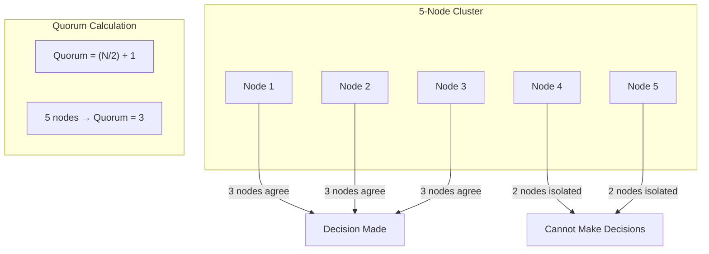
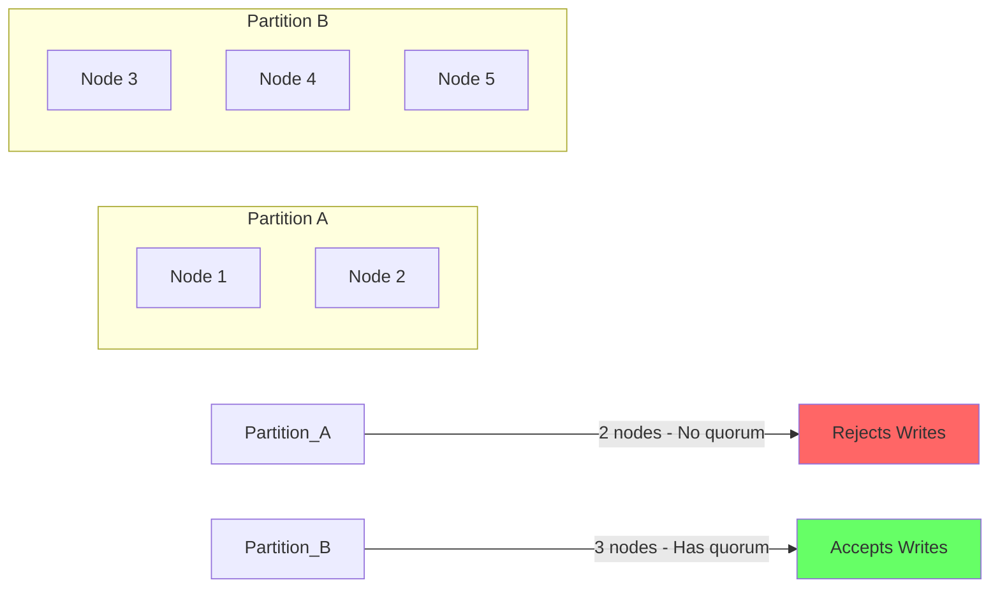
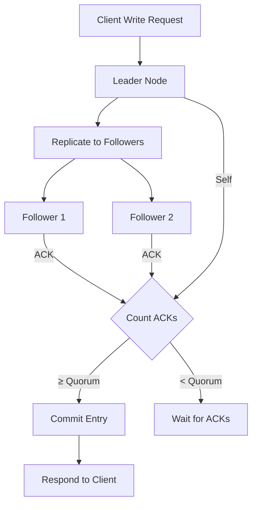
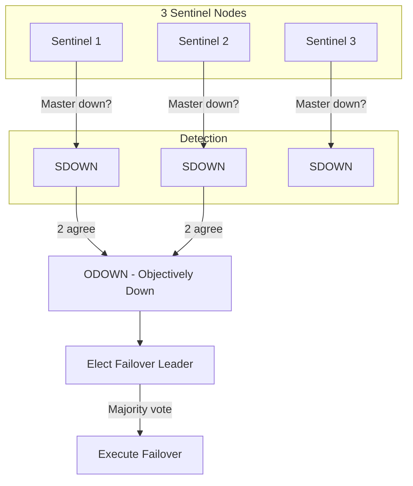
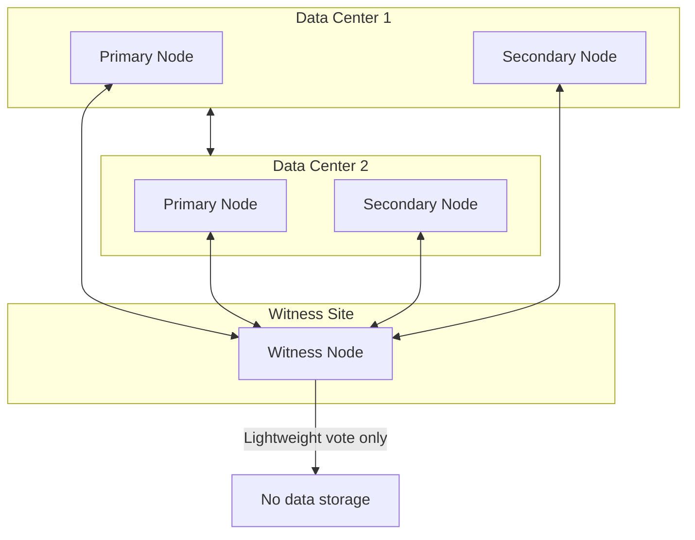
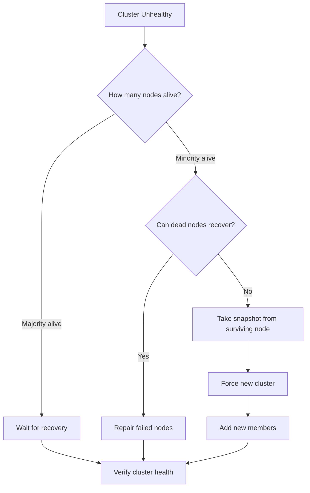

# How to Implement Quorum Configuration

Author: [nawazdhandala](https://github.com/nawazdhandala)

Tags: High Availability, Quorum, Distributed Systems, Clustering

Description: Learn how to configure quorum in distributed systems to maintain consistency and prevent split-brain scenarios.

---

Distributed systems fail in unpredictable ways. Network partitions, node crashes, and hardware failures can split your cluster into isolated groups. Without proper quorum configuration, each group might think it is the authoritative source of truth, leading to data corruption and inconsistent state. Quorum is the mechanism that prevents this chaos.

## What is Quorum?

Quorum is the minimum number of nodes that must agree before the cluster can make a decision. This ensures that even during failures, only one group can make progress, preventing conflicting updates.



### The Majority Formula

For a cluster of N nodes, the quorum requirement is:

```
Quorum = floor(N/2) + 1
```

| Cluster Size | Quorum Required | Nodes That Can Fail |
|--------------|-----------------|---------------------|
| 3 | 2 | 1 |
| 5 | 3 | 2 |
| 7 | 4 | 3 |
| 9 | 5 | 4 |

Notice that even-numbered clusters provide no additional fault tolerance over the odd number below them. A 4-node cluster still requires 3 nodes for quorum, same as a 3-node cluster. Always use odd numbers.

## Split-Brain Problem

Split-brain occurs when a network partition divides the cluster and both sides continue operating independently.



Without quorum, both partitions would accept writes, leading to divergent data that cannot be reconciled.

## Configuring Quorum in etcd

etcd is the backbone of Kubernetes and uses Raft consensus, which requires quorum for all operations.

### etcd Cluster Configuration

```yaml
# etcd.yaml - 3-node cluster configuration
name: etcd-node-1
data-dir: /var/lib/etcd
initial-advertise-peer-urls: https://10.0.1.10:2380
listen-peer-urls: https://10.0.1.10:2380
listen-client-urls: https://10.0.1.10:2379,https://127.0.0.1:2379
advertise-client-urls: https://10.0.1.10:2379
initial-cluster-token: etcd-cluster-1
initial-cluster: etcd-node-1=https://10.0.1.10:2380,etcd-node-2=https://10.0.1.11:2380,etcd-node-3=https://10.0.1.12:2380
initial-cluster-state: new

# TLS configuration
client-transport-security:
  cert-file: /etc/etcd/ssl/server.crt
  key-file: /etc/etcd/ssl/server.key
  client-cert-auth: true
  trusted-ca-file: /etc/etcd/ssl/ca.crt

peer-transport-security:
  cert-file: /etc/etcd/ssl/peer.crt
  key-file: /etc/etcd/ssl/peer.key
  client-cert-auth: true
  trusted-ca-file: /etc/etcd/ssl/ca.crt
```

### Checking etcd Cluster Health

```bash
# Check member list and quorum status
etcdctl member list --write-out=table

# Check endpoint health
etcdctl endpoint health --endpoints=https://10.0.1.10:2379,https://10.0.1.11:2379,https://10.0.1.12:2379

# Check leader status
etcdctl endpoint status --write-out=table
```

### etcd Quorum Decision Flow



## Configuring Quorum in PostgreSQL

PostgreSQL with Patroni uses distributed consensus for leader election and failover decisions.

### Patroni Configuration

```yaml
# patroni.yml
scope: postgres-cluster
name: pg-node-1

restapi:
  listen: 0.0.0.0:8008
  connect_address: 10.0.1.10:8008

etcd3:
  hosts:
    - 10.0.1.10:2379
    - 10.0.1.11:2379
    - 10.0.1.12:2379

bootstrap:
  dcs:
    ttl: 30
    loop_wait: 10
    retry_timeout: 10
    maximum_lag_on_failover: 1048576
    postgresql:
      use_pg_rewind: true
      parameters:
        synchronous_commit: "on"
        synchronous_standby_names: "ANY 1 (pg-node-2, pg-node-3)"

postgresql:
  listen: 0.0.0.0:5432
  connect_address: 10.0.1.10:5432
  data_dir: /var/lib/postgresql/data
  authentication:
    superuser:
      username: postgres
      password: secretpassword
    replication:
      username: replicator
      password: replicatorpassword
```

### Synchronous Replication with Quorum

```sql
-- Configure synchronous replication requiring 1 of 2 standbys
ALTER SYSTEM SET synchronous_standby_names = 'ANY 1 (standby1, standby2)';
SELECT pg_reload_conf();

-- Or require all standbys (stronger consistency, lower availability)
ALTER SYSTEM SET synchronous_standby_names = 'FIRST 2 (standby1, standby2)';

-- Check replication status
SELECT client_addr, state, sync_state
FROM pg_stat_replication;
```

## Configuring Quorum in Redis Sentinel

Redis Sentinel uses quorum for failover decisions.

### Sentinel Configuration

```conf
# sentinel.conf
port 26379
sentinel monitor mymaster 10.0.1.10 6379 2
sentinel auth-pass mymaster your-redis-password
sentinel down-after-milliseconds mymaster 5000
sentinel failover-timeout mymaster 60000
sentinel parallel-syncs mymaster 1

# The quorum value (2) means:
# - 2 Sentinels must agree a master is down before failover
# - At least 2 Sentinels must be reachable for failover to proceed
```

### Sentinel Quorum Explained



### Deploying Redis Sentinel in Kubernetes

```yaml
apiVersion: v1
kind: ConfigMap
metadata:
  name: redis-sentinel-config
data:
  sentinel.conf: |
    port 26379
    sentinel monitor mymaster redis-master 6379 2
    sentinel down-after-milliseconds mymaster 5000
    sentinel failover-timeout mymaster 60000
    sentinel parallel-syncs mymaster 1
---
apiVersion: apps/v1
kind: StatefulSet
metadata:
  name: redis-sentinel
spec:
  serviceName: redis-sentinel
  replicas: 3
  selector:
    matchLabels:
      app: redis-sentinel
  template:
    metadata:
      labels:
        app: redis-sentinel
    spec:
      containers:
        - name: sentinel
          image: redis:7
          command:
            - redis-sentinel
            - /etc/redis/sentinel.conf
          ports:
            - containerPort: 26379
          volumeMounts:
            - name: config
              mountPath: /etc/redis
      volumes:
        - name: config
          configMap:
            name: redis-sentinel-config
```

## Configuring Quorum in ZooKeeper

ZooKeeper uses Zab consensus protocol with strict quorum requirements.

### ZooKeeper Configuration

```properties
# zoo.cfg
tickTime=2000
initLimit=10
syncLimit=5
dataDir=/var/lib/zookeeper
clientPort=2181

# Cluster members
server.1=10.0.1.10:2888:3888
server.2=10.0.1.11:2888:3888
server.3=10.0.1.12:2888:3888

# Enable quorum-based operations
standaloneEnabled=false
reconfigEnabled=true

# Dynamic reconfiguration (ZK 3.5+)
dynamicConfigFile=/etc/zookeeper/zoo.cfg.dynamic
```

### ZooKeeper in Kubernetes

```yaml
apiVersion: apps/v1
kind: StatefulSet
metadata:
  name: zookeeper
spec:
  serviceName: zookeeper-headless
  replicas: 3
  selector:
    matchLabels:
      app: zookeeper
  template:
    metadata:
      labels:
        app: zookeeper
    spec:
      containers:
        - name: zookeeper
          image: zookeeper:3.9
          ports:
            - containerPort: 2181
              name: client
            - containerPort: 2888
              name: follower
            - containerPort: 3888
              name: election
          env:
            - name: ZOO_MY_ID
              valueFrom:
                fieldRef:
                  fieldPath: metadata.name
            - name: ZOO_SERVERS
              value: "server.1=zookeeper-0.zookeeper-headless:2888:3888;2181 server.2=zookeeper-1.zookeeper-headless:2888:3888;2181 server.3=zookeeper-2.zookeeper-headless:2888:3888;2181"
          volumeMounts:
            - name: data
              mountPath: /data
  volumeClaimTemplates:
    - metadata:
        name: data
      spec:
        accessModes: ["ReadWriteOnce"]
        resources:
          requests:
            storage: 10Gi
```

## Witness Nodes and Tie-Breakers

When you have an even number of primary nodes or nodes split across two data centers, a witness node provides the tie-breaking vote.

### Witness Node Architecture



### etcd Witness Configuration

etcd does not have a native witness node, but you can deploy a lightweight voting member:

```yaml
# Lightweight etcd member for tie-breaking
name: etcd-witness
data-dir: /var/lib/etcd-witness
initial-advertise-peer-urls: https://10.0.2.10:2380
listen-peer-urls: https://10.0.2.10:2380
listen-client-urls: https://127.0.0.1:2379
initial-cluster-token: etcd-cluster-1
initial-cluster: etcd-node-1=https://10.0.1.10:2380,etcd-node-2=https://10.0.1.11:2380,etcd-witness=https://10.0.2.10:2380
initial-cluster-state: new

# Reduce resource usage - witness does not serve client requests
quota-backend-bytes: 104857600  # 100MB
```

### PostgreSQL Witness with Patroni

```yaml
# patroni-witness.yml
scope: postgres-cluster
name: pg-witness

restapi:
  listen: 0.0.0.0:8008
  connect_address: 10.0.2.10:8008

etcd3:
  hosts:
    - 10.0.1.10:2379
    - 10.0.1.11:2379
    - 10.0.2.10:2379  # Witness location

# No PostgreSQL configuration - witness only participates in consensus
```

## Quorum in Cloud Environments

### AWS Multi-AZ Quorum

```hcl
# Terraform - Deploy etcd across 3 AZs
resource "aws_instance" "etcd" {
  count         = 3
  ami           = "ami-0123456789abcdef0"
  instance_type = "t3.medium"

  availability_zone = element(["us-east-1a", "us-east-1b", "us-east-1c"], count.index)

  subnet_id = element(aws_subnet.private[*].id, count.index)

  tags = {
    Name = "etcd-${count.index + 1}"
    Role = "etcd"
  }
}

# Spread across AZs for quorum resilience
resource "aws_placement_group" "etcd" {
  name     = "etcd-spread"
  strategy = "spread"
}
```

### Kubernetes Pod Anti-Affinity for Quorum

```yaml
apiVersion: apps/v1
kind: StatefulSet
metadata:
  name: etcd
spec:
  replicas: 3
  template:
    spec:
      affinity:
        podAntiAffinity:
          requiredDuringSchedulingIgnoredDuringExecution:
            - labelSelector:
                matchLabels:
                  app: etcd
              topologyKey: topology.kubernetes.io/zone
        nodeAffinity:
          requiredDuringSchedulingIgnoredDuringExecution:
            nodeSelectorTerms:
              - matchExpressions:
                  - key: topology.kubernetes.io/zone
                    operator: In
                    values:
                      - us-east-1a
                      - us-east-1b
                      - us-east-1c
```

## Monitoring Quorum Health

### Prometheus Alerts for Quorum

```yaml
apiVersion: monitoring.coreos.com/v1
kind: PrometheusRule
metadata:
  name: quorum-alerts
spec:
  groups:
    - name: quorum
      rules:
        - alert: EtcdInsufficientMembers
          expr: count(etcd_server_has_leader{job="etcd"}) < 2
          for: 1m
          labels:
            severity: critical
          annotations:
            summary: "etcd cluster has insufficient members for quorum"

        - alert: EtcdNoLeader
          expr: etcd_server_has_leader{job="etcd"} == 0
          for: 1m
          labels:
            severity: critical
          annotations:
            summary: "etcd cluster has no leader"

        - alert: ZookeeperQuorumLost
          expr: zk_quorum_size < (zk_synced_followers + 1)
          for: 1m
          labels:
            severity: critical
          annotations:
            summary: "ZooKeeper has lost quorum"

        - alert: RedisSentinelDown
          expr: count(redis_sentinel_master_status{status="ok"}) < 2
          for: 1m
          labels:
            severity: warning
          annotations:
            summary: "Fewer than 2 Sentinels see master as healthy"
```

### Grafana Dashboard Queries

```promql
# etcd cluster health
sum(etcd_server_has_leader) by (cluster)

# ZooKeeper quorum status
zk_synced_followers + 1  # Total healthy members

# Redis Sentinel quorum
count(redis_sentinel_master_status{status="ok"})
```

## Handling Quorum Loss

When quorum is lost, the cluster becomes read-only or completely unavailable. Here is how to recover.

### etcd Quorum Recovery

```bash
# Check current cluster state
etcdctl member list

# If majority is permanently lost, force new cluster from surviving member
etcdctl snapshot save backup.db

# Stop all etcd instances

# On surviving node, restore with force-new-cluster
etcdctl snapshot restore backup.db \
  --name etcd-node-1 \
  --initial-cluster etcd-node-1=https://10.0.1.10:2380 \
  --initial-advertise-peer-urls https://10.0.1.10:2380 \
  --force-new-cluster

# Add new members one at a time
etcdctl member add etcd-node-2 --peer-urls=https://10.0.1.11:2380
etcdctl member add etcd-node-3 --peer-urls=https://10.0.1.12:2380
```

### Quorum Recovery Decision Flow



## Best Practices

1. **Always use odd numbers** - 3, 5, or 7 nodes. Even numbers waste resources without improving fault tolerance.

2. **Spread across failure domains** - Place nodes in different availability zones, racks, or data centers.

3. **Size appropriately** - 3 nodes for most workloads, 5 for critical systems, 7 rarely needed.

4. **Monitor quorum continuously** - Alert immediately when the cluster loses a member.

5. **Test failure scenarios** - Regularly kill nodes to verify quorum behavior and recovery procedures.

6. **Document recovery procedures** - When quorum is lost at 3 AM, you need clear runbooks.

7. **Use witnesses for two-site deployments** - A lightweight third site prevents split-brain.

8. **Configure appropriate timeouts** - Too short causes flapping, too long delays failover.

---

Quorum configuration is fundamental to running reliable distributed systems. Without it, your cluster is vulnerable to split-brain scenarios that can corrupt data and cause outages far worse than the failures you were trying to protect against. Take the time to configure quorum correctly, test your failure scenarios, and monitor your cluster health. Your future self will thank you during the next network partition.
