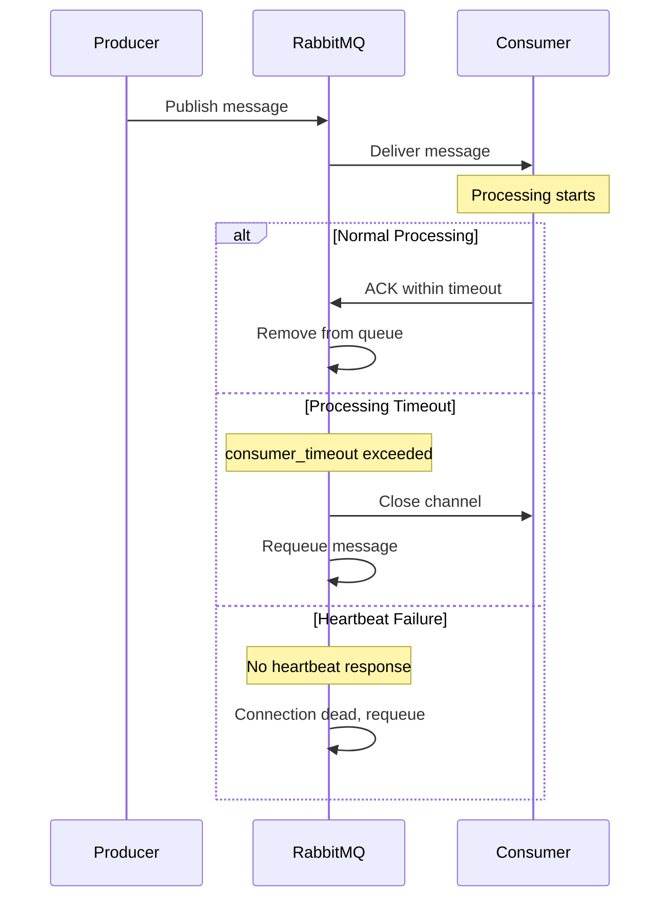
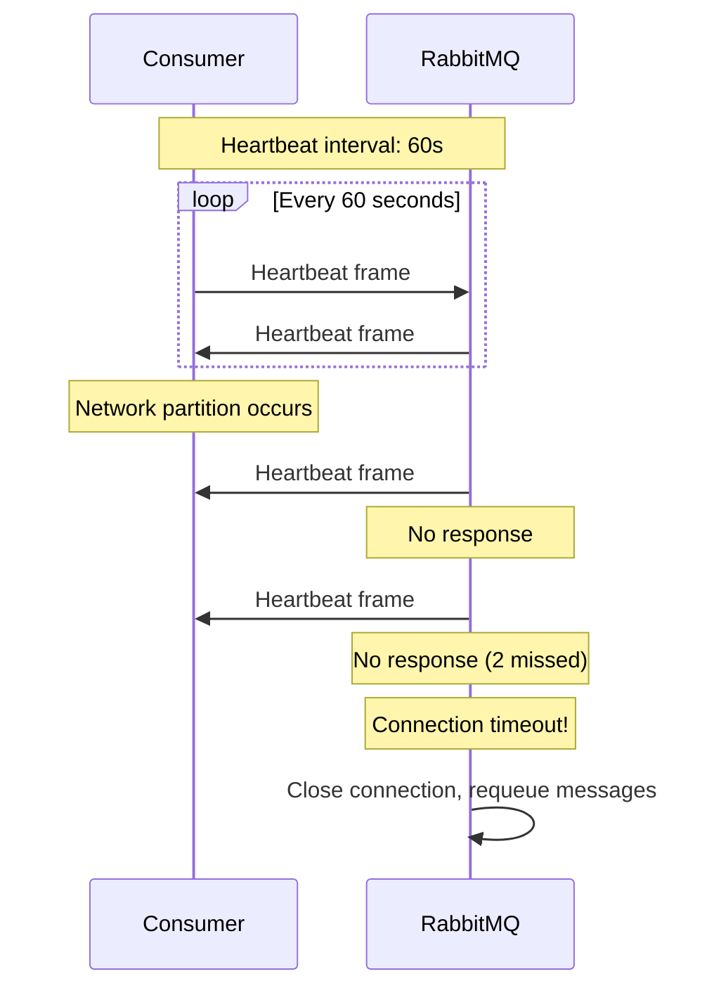
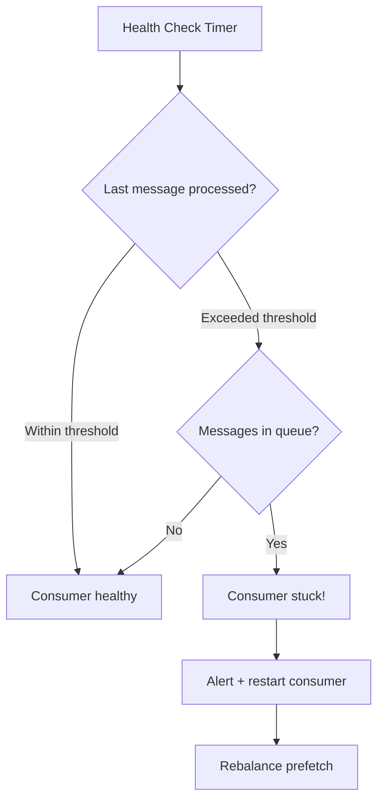
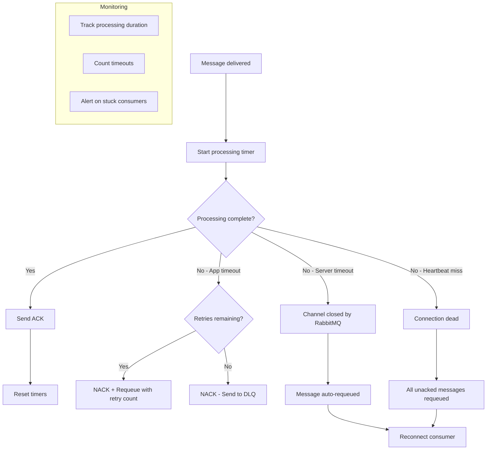

# How to Create RabbitMQ Consumer Timeout Handling

Author: [nawazdhandala](https://github.com/nawazdhandala)

Tags: RabbitMQ, Consumer Timeout, Reliability, Error Handling

Description: Learn to implement RabbitMQ consumer timeout handling with delivery acknowledgment timeouts, heartbeats, and stuck consumer detection.

---

RabbitMQ consumers can fail silently. A consumer might hang on a slow database query, get stuck in an infinite loop, or simply stop processing without disconnecting. Without proper timeout handling, messages pile up in queues, throughput drops, and your system becomes unreliable. This guide covers timeout patterns that keep your RabbitMQ consumers healthy and responsive.

## Why Consumer Timeouts Matter

| Scenario | Without Timeout Handling | With Timeout Handling |
|----------|--------------------------|----------------------|
| Slow database query | Consumer blocks indefinitely | Message requeued after timeout |
| Infinite loop bug | Queue backs up silently | Consumer restarted, message retried |
| Network partition | Undetected for minutes | Heartbeat detects within seconds |
| Memory leak | OOM kill loses messages | Graceful shutdown preserves state |

## RabbitMQ Timeout Architecture

Understanding how RabbitMQ handles timeouts helps you configure them correctly.



## Consumer Delivery Timeout Configuration

RabbitMQ 3.8+ introduced `consumer_timeout` - a server-side timeout that closes channels when consumers take too long to acknowledge messages. This is your first line of defense against stuck consumers.

### Server-Side Configuration

Configure the timeout in your RabbitMQ configuration file (`rabbitmq.conf`):

```ini
# Consumer timeout in milliseconds (default: 1800000 = 30 minutes)
# Set to 0 to disable (not recommended for production)
consumer_timeout = 300000

# Per-vhost configuration available in RabbitMQ 3.12+
# consumer_timeout.my_vhost = 600000
```

For environment variable configuration:

```bash
# Docker or environment-based setup
RABBITMQ_SERVER_ADDITIONAL_ERL_ARGS="-rabbit consumer_timeout 300000"
```

### Handling Timeout Events

When the consumer timeout triggers, RabbitMQ closes the channel. Your consumer must handle this gracefully.

```javascript
const amqp = require('amqplib');

class ResilientConsumer {
  constructor(options = {}) {
    this.url = options.url || 'amqp://localhost';
    this.queue = options.queue;
    this.prefetch = options.prefetch || 10;
    this.reconnectDelay = options.reconnectDelay || 5000;
    this.connection = null;
    this.channel = null;
    this.isShuttingDown = false;
  }

  async connect() {
    try {
      // Connection with heartbeat configuration
      this.connection = await amqp.connect(this.url, {
        heartbeat: 60, // Heartbeat interval in seconds
      });

      this.connection.on('error', (err) => {
        console.error('Connection error:', err.message);
        this.reconnect();
      });

      this.connection.on('close', () => {
        if (!this.isShuttingDown) {
          console.log('Connection closed, reconnecting...');
          this.reconnect();
        }
      });

      this.channel = await this.connection.createChannel();

      // Handle channel closure (happens on consumer_timeout)
      this.channel.on('error', (err) => {
        console.error('Channel error:', err.message);
      });

      this.channel.on('close', () => {
        if (!this.isShuttingDown) {
          console.log('Channel closed, recreating...');
          this.recreateChannel();
        }
      });

      await this.channel.prefetch(this.prefetch);
      await this.channel.assertQueue(this.queue, { durable: true });

      console.log('Connected to RabbitMQ');
      return this.channel;
    } catch (error) {
      console.error('Connection failed:', error.message);
      await this.reconnect();
    }
  }

  async reconnect() {
    if (this.isShuttingDown) return;

    await this.cleanup();
    await new Promise(r => setTimeout(r, this.reconnectDelay));
    await this.connect();
  }

  async recreateChannel() {
    if (this.isShuttingDown || !this.connection) return;

    try {
      this.channel = await this.connection.createChannel();
      await this.channel.prefetch(this.prefetch);
      await this.startConsuming();
    } catch (error) {
      console.error('Failed to recreate channel:', error.message);
      await this.reconnect();
    }
  }

  async cleanup() {
    try {
      if (this.channel) await this.channel.close();
    } catch (e) { /* ignore */ }
    try {
      if (this.connection) await this.connection.close();
    } catch (e) { /* ignore */ }
    this.channel = null;
    this.connection = null;
  }

  async shutdown() {
    this.isShuttingDown = true;
    await this.cleanup();
  }
}
```

## Heartbeat Configuration

Heartbeats detect dead connections when TCP keepalive is too slow. RabbitMQ and clients exchange heartbeat frames, and if either side misses too many, the connection is considered dead.



### Client-Side Heartbeat Setup

```javascript
// Node.js with amqplib
const connection = await amqp.connect('amqp://localhost', {
  // Heartbeat interval in seconds
  // RabbitMQ will close the connection if no activity for 2x this value
  heartbeat: 60,
});

// Python with pika
import pika

parameters = pika.ConnectionParameters(
    host='localhost',
    heartbeat=60,  # seconds
    blocked_connection_timeout=300,  # seconds
)
connection = pika.BlockingConnection(parameters)
```

### Heartbeat Best Practices

| Setting | Development | Production |
|---------|-------------|------------|
| Heartbeat interval | 60s | 30-60s |
| Consumer timeout | 30 min | 5-15 min |
| Prefetch count | 1 | 10-100 |

## Implementing Processing Timeouts

The server-side `consumer_timeout` is a safety net, but you should implement application-level timeouts to handle slow processing proactively.

```javascript
class TimeoutAwareConsumer extends ResilientConsumer {
  constructor(options = {}) {
    super(options);
    this.processingTimeout = options.processingTimeout || 30000;
    this.handler = options.handler;
  }

  async startConsuming() {
    await this.channel.consume(
      this.queue,
      async (msg) => {
        if (!msg) return;

        const startTime = Date.now();
        const messageId = msg.properties.messageId || 'unknown';

        try {
          // Wrap processing with timeout
          await this.processWithTimeout(msg);

          // Acknowledge successful processing
          this.channel.ack(msg);

          const duration = Date.now() - startTime;
          console.log(`Message ${messageId} processed in ${duration}ms`);

        } catch (error) {
          const duration = Date.now() - startTime;

          if (error.name === 'TimeoutError') {
            console.error(`Message ${messageId} timed out after ${duration}ms`);
            // Reject and requeue for retry
            this.channel.nack(msg, false, true);
          } else {
            console.error(`Message ${messageId} failed:`, error.message);
            // Reject without requeue - send to dead letter
            this.channel.nack(msg, false, false);
          }
        }
      },
      { noAck: false }
    );
  }

  async processWithTimeout(msg) {
    return new Promise(async (resolve, reject) => {
      // Set up timeout
      const timeoutId = setTimeout(() => {
        const error = new Error('Processing timeout exceeded');
        error.name = 'TimeoutError';
        reject(error);
      }, this.processingTimeout);

      try {
        // Process the message
        const result = await this.handler(msg);
        clearTimeout(timeoutId);
        resolve(result);
      } catch (error) {
        clearTimeout(timeoutId);
        reject(error);
      }
    });
  }
}

// Usage
const consumer = new TimeoutAwareConsumer({
  url: 'amqp://localhost',
  queue: 'orders',
  processingTimeout: 30000, // 30 seconds
  handler: async (msg) => {
    const order = JSON.parse(msg.content.toString());
    await processOrder(order);
  },
});

await consumer.connect();
await consumer.startConsuming();
```

## Detecting and Handling Stuck Consumers

Sometimes consumers appear connected but stop processing. Implement health checks to detect this condition.



### Consumer Health Monitor

```javascript
class ConsumerHealthMonitor {
  constructor(options = {}) {
    this.stuckThreshold = options.stuckThreshold || 60000; // 1 minute
    this.checkInterval = options.checkInterval || 10000;
    this.consumers = new Map();
    this.onStuck = options.onStuck || (() => {});
  }

  register(consumerId, consumer) {
    this.consumers.set(consumerId, {
      consumer,
      lastActivity: Date.now(),
      messagesProcessed: 0,
      isProcessing: false,
    });
  }

  recordActivity(consumerId) {
    const state = this.consumers.get(consumerId);
    if (state) {
      state.lastActivity = Date.now();
      state.messagesProcessed++;
    }
  }

  setProcessing(consumerId, isProcessing) {
    const state = this.consumers.get(consumerId);
    if (state) {
      state.isProcessing = isProcessing;
      if (isProcessing) {
        state.processingStarted = Date.now();
      }
    }
  }

  start() {
    this.intervalId = setInterval(() => this.checkHealth(), this.checkInterval);
  }

  stop() {
    if (this.intervalId) {
      clearInterval(this.intervalId);
    }
  }

  async checkHealth() {
    const now = Date.now();

    for (const [consumerId, state] of this.consumers) {
      // Check if consumer has been processing too long
      if (state.isProcessing) {
        const processingDuration = now - state.processingStarted;
        if (processingDuration > this.stuckThreshold) {
          console.warn(`Consumer ${consumerId} stuck processing for ${processingDuration}ms`);
          await this.handleStuckConsumer(consumerId, state);
        }
        continue;
      }

      // Check if consumer has been idle too long with messages available
      const idleDuration = now - state.lastActivity;
      if (idleDuration > this.stuckThreshold) {
        const queueInfo = await this.getQueueInfo(state.consumer.queue);
        if (queueInfo.messageCount > 0) {
          console.warn(`Consumer ${consumerId} idle for ${idleDuration}ms with ${queueInfo.messageCount} messages`);
          await this.handleStuckConsumer(consumerId, state);
        }
      }
    }
  }

  async getQueueInfo(queue) {
    // Implement queue info retrieval via management API
    // This is a placeholder
    return { messageCount: 0 };
  }

  async handleStuckConsumer(consumerId, state) {
    this.onStuck(consumerId, state);

    // Attempt to restart the consumer
    try {
      await state.consumer.reconnect();
      state.lastActivity = Date.now();
      state.isProcessing = false;
    } catch (error) {
      console.error(`Failed to restart consumer ${consumerId}:`, error.message);
    }
  }
}

// Usage
const healthMonitor = new ConsumerHealthMonitor({
  stuckThreshold: 60000,
  checkInterval: 10000,
  onStuck: (consumerId, state) => {
    // Send alert
    alerting.send({
      severity: 'warning',
      message: `Consumer ${consumerId} appears stuck`,
      details: {
        lastActivity: new Date(state.lastActivity).toISOString(),
        messagesProcessed: state.messagesProcessed,
      },
    });
  },
});

healthMonitor.register('order-consumer-1', consumer);
healthMonitor.start();
```

## Dead Letter Queue for Timeout Failures

When messages repeatedly timeout, send them to a dead letter queue for investigation rather than infinite retries.

```javascript
async function setupQueuesWithDLX(channel) {
  // Dead letter exchange
  await channel.assertExchange('dlx', 'direct', { durable: true });

  // Dead letter queue
  await channel.assertQueue('orders.dead', {
    durable: true,
    arguments: {
      'x-message-ttl': 7 * 24 * 60 * 60 * 1000, // 7 days retention
    },
  });
  await channel.bindQueue('orders.dead', 'dlx', 'orders');

  // Main queue with DLX configuration
  await channel.assertQueue('orders', {
    durable: true,
    arguments: {
      'x-dead-letter-exchange': 'dlx',
      'x-dead-letter-routing-key': 'orders',
    },
  });
}

class RetryAwareConsumer extends TimeoutAwareConsumer {
  constructor(options = {}) {
    super(options);
    this.maxRetries = options.maxRetries || 3;
  }

  async startConsuming() {
    await this.channel.consume(
      this.queue,
      async (msg) => {
        if (!msg) return;

        const retryCount = this.getRetryCount(msg);
        const messageId = msg.properties.messageId || 'unknown';

        try {
          await this.processWithTimeout(msg);
          this.channel.ack(msg);

        } catch (error) {
          if (error.name === 'TimeoutError' && retryCount < this.maxRetries) {
            // Requeue with retry count
            console.log(`Message ${messageId} timeout, retry ${retryCount + 1}/${this.maxRetries}`);
            await this.requeueWithRetry(msg, retryCount + 1);
            this.channel.ack(msg);
          } else {
            // Send to dead letter queue
            console.log(`Message ${messageId} exceeded retries, sending to DLQ`);
            this.channel.nack(msg, false, false);
          }
        }
      },
      { noAck: false }
    );
  }

  getRetryCount(msg) {
    const deaths = msg.properties.headers?.['x-death'];
    if (!deaths || deaths.length === 0) return 0;

    return deaths.reduce((count, death) => {
      return count + (death.count || 0);
    }, 0);
  }

  async requeueWithRetry(msg, retryCount) {
    const headers = {
      ...msg.properties.headers,
      'x-retry-count': retryCount,
    };

    // Publish back to queue with updated headers
    this.channel.publish(
      '',
      this.queue,
      msg.content,
      {
        ...msg.properties,
        headers,
      }
    );
  }
}
```

## Monitoring Consumer Timeouts

Track timeout metrics to identify patterns and tune your configuration.

```javascript
const prometheus = require('prom-client');

// Metrics for consumer timeout monitoring
const messageProcessingDuration = new prometheus.Histogram({
  name: 'rabbitmq_message_processing_seconds',
  help: 'Message processing duration',
  labelNames: ['queue', 'status'],
  buckets: [0.1, 0.5, 1, 5, 10, 30, 60, 120],
});

const messageTimeouts = new prometheus.Counter({
  name: 'rabbitmq_message_timeouts_total',
  help: 'Total message processing timeouts',
  labelNames: ['queue'],
});

const consumerRestarts = new prometheus.Counter({
  name: 'rabbitmq_consumer_restarts_total',
  help: 'Total consumer restarts',
  labelNames: ['queue', 'reason'],
});

const deadLetterMessages = new prometheus.Counter({
  name: 'rabbitmq_dead_letter_messages_total',
  help: 'Messages sent to dead letter queue',
  labelNames: ['queue', 'reason'],
});

class InstrumentedConsumer extends RetryAwareConsumer {
  async processWithTimeout(msg) {
    const startTime = Date.now();
    const queue = this.queue;

    try {
      const result = await super.processWithTimeout(msg);

      messageProcessingDuration.observe(
        { queue, status: 'success' },
        (Date.now() - startTime) / 1000
      );

      return result;
    } catch (error) {
      const duration = (Date.now() - startTime) / 1000;

      if (error.name === 'TimeoutError') {
        messageTimeouts.inc({ queue });
        messageProcessingDuration.observe({ queue, status: 'timeout' }, duration);
      } else {
        messageProcessingDuration.observe({ queue, status: 'error' }, duration);
      }

      throw error;
    }
  }
}
```

## Consumer Timeout Flow

Here is the complete flow showing how all timeout mechanisms work together.



## Configuration Recommendations

| Parameter | Description | Recommended Value |
|-----------|-------------|-------------------|
| `consumer_timeout` | Server-side ACK timeout | 5-15 minutes |
| `heartbeat` | Connection heartbeat | 30-60 seconds |
| `prefetch` | Unacked message limit | 10-100 per consumer |
| App processing timeout | Client-side timeout | 30-60 seconds |
| Max retries | Before DLQ | 3-5 attempts |
| Stuck detection | Health check threshold | 1-2 minutes |

## Complete Production Example

Here is a production-ready consumer combining all timeout handling patterns.

```javascript
const amqp = require('amqplib');
const prometheus = require('prom-client');

class ProductionConsumer {
  constructor(options) {
    this.url = options.url;
    this.queue = options.queue;
    this.handler = options.handler;
    this.prefetch = options.prefetch || 10;
    this.processingTimeout = options.processingTimeout || 30000;
    this.maxRetries = options.maxRetries || 3;
    this.heartbeat = options.heartbeat || 60;
    this.reconnectDelay = options.reconnectDelay || 5000;

    this.connection = null;
    this.channel = null;
    this.isShuttingDown = false;
    this.lastActivity = Date.now();

    this.setupMetrics();
  }

  setupMetrics() {
    this.metrics = {
      processed: new prometheus.Counter({
        name: 'consumer_messages_processed_total',
        help: 'Total messages processed',
        labelNames: ['queue', 'status'],
      }),
      duration: new prometheus.Histogram({
        name: 'consumer_processing_duration_seconds',
        help: 'Message processing duration',
        labelNames: ['queue'],
        buckets: [0.1, 0.5, 1, 5, 10, 30],
      }),
    };
  }

  async start() {
    await this.connect();
    await this.setupQueues();
    await this.startConsuming();
    this.startHealthCheck();

    console.log(`Consumer started for queue: ${this.queue}`);
  }

  async connect() {
    this.connection = await amqp.connect(this.url, {
      heartbeat: this.heartbeat,
    });

    this.connection.on('error', (err) => {
      console.error('Connection error:', err.message);
      if (!this.isShuttingDown) this.reconnect();
    });

    this.connection.on('close', () => {
      if (!this.isShuttingDown) {
        console.log('Connection closed unexpectedly');
        this.reconnect();
      }
    });

    this.channel = await this.connection.createChannel();
    await this.channel.prefetch(this.prefetch);

    this.channel.on('error', (err) => {
      console.error('Channel error:', err.message);
    });

    this.channel.on('close', () => {
      if (!this.isShuttingDown && this.connection) {
        console.log('Channel closed, recreating...');
        this.recreateChannel();
      }
    });
  }

  async setupQueues() {
    await this.channel.assertExchange('dlx', 'direct', { durable: true });
    await this.channel.assertQueue(`${this.queue}.dead`, { durable: true });
    await this.channel.bindQueue(`${this.queue}.dead`, 'dlx', this.queue);

    await this.channel.assertQueue(this.queue, {
      durable: true,
      arguments: {
        'x-dead-letter-exchange': 'dlx',
        'x-dead-letter-routing-key': this.queue,
      },
    });
  }

  async startConsuming() {
    await this.channel.consume(
      this.queue,
      async (msg) => {
        if (!msg) return;
        await this.processMessage(msg);
      },
      { noAck: false }
    );
  }

  async processMessage(msg) {
    const startTime = Date.now();
    const retryCount = this.getRetryCount(msg);

    try {
      // Process with timeout
      await Promise.race([
        this.handler(JSON.parse(msg.content.toString())),
        new Promise((_, reject) => {
          setTimeout(() => {
            const err = new Error('Processing timeout');
            err.name = 'TimeoutError';
            reject(err);
          }, this.processingTimeout);
        }),
      ]);

      this.channel.ack(msg);
      this.lastActivity = Date.now();

      this.metrics.processed.inc({ queue: this.queue, status: 'success' });
      this.metrics.duration.observe(
        { queue: this.queue },
        (Date.now() - startTime) / 1000
      );

    } catch (error) {
      if (error.name === 'TimeoutError' && retryCount < this.maxRetries) {
        console.log(`Timeout, retry ${retryCount + 1}/${this.maxRetries}`);
        this.channel.nack(msg, false, true);
        this.metrics.processed.inc({ queue: this.queue, status: 'retry' });
      } else {
        console.error('Message failed:', error.message);
        this.channel.nack(msg, false, false); // Send to DLQ
        this.metrics.processed.inc({ queue: this.queue, status: 'dlq' });
      }
    }
  }

  getRetryCount(msg) {
    return msg.properties.headers?.['x-death']?.length || 0;
  }

  async reconnect() {
    await this.cleanup();
    await new Promise(r => setTimeout(r, this.reconnectDelay));
    if (!this.isShuttingDown) {
      await this.start();
    }
  }

  async recreateChannel() {
    try {
      this.channel = await this.connection.createChannel();
      await this.channel.prefetch(this.prefetch);
      await this.startConsuming();
    } catch (error) {
      console.error('Failed to recreate channel:', error.message);
      await this.reconnect();
    }
  }

  startHealthCheck() {
    this.healthInterval = setInterval(() => {
      const idleTime = Date.now() - this.lastActivity;
      if (idleTime > 120000) { // 2 minutes idle
        console.warn(`Consumer idle for ${idleTime}ms`);
      }
    }, 30000);
  }

  async cleanup() {
    try { await this.channel?.close(); } catch (e) { /* ignore */ }
    try { await this.connection?.close(); } catch (e) { /* ignore */ }
  }

  async shutdown() {
    console.log('Shutting down consumer...');
    this.isShuttingDown = true;
    clearInterval(this.healthInterval);
    await this.cleanup();
    console.log('Consumer shutdown complete');
  }
}

// Usage
const consumer = new ProductionConsumer({
  url: process.env.RABBITMQ_URL || 'amqp://localhost',
  queue: 'orders',
  prefetch: 10,
  processingTimeout: 30000,
  maxRetries: 3,
  heartbeat: 60,
  handler: async (order) => {
    await processOrder(order);
  },
});

await consumer.start();

// Graceful shutdown
process.on('SIGTERM', () => consumer.shutdown());
process.on('SIGINT', () => consumer.shutdown());
```

## Summary

| Timeout Type | Purpose | Configuration |
|--------------|---------|---------------|
| **Consumer timeout** | Server-side ACK deadline | `consumer_timeout` in rabbitmq.conf |
| **Heartbeat** | Dead connection detection | Connection parameter |
| **Processing timeout** | Application-level limit | Client code with Promise.race |
| **Stuck detection** | Idle consumer monitoring | Health check loop |

Consumer timeout handling transforms RabbitMQ from a best-effort system to a reliable message processing platform. By combining server-side timeouts, heartbeats, application-level timeouts, and health monitoring, you can build consumers that handle failures gracefully and maintain system throughput under adverse conditions.
