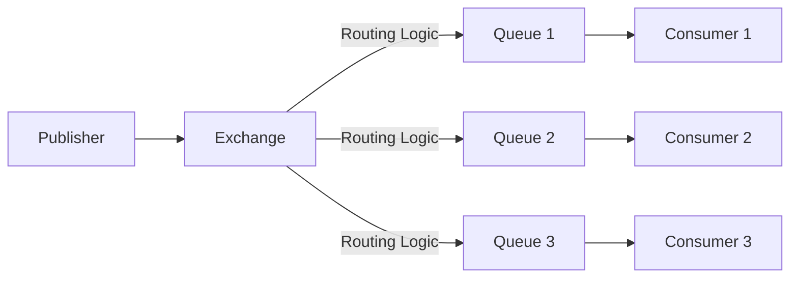
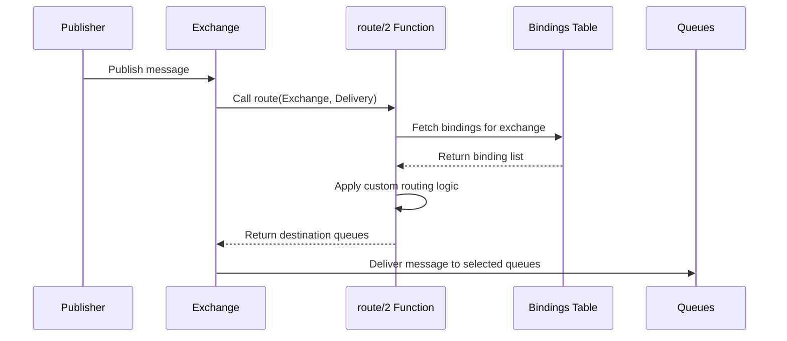
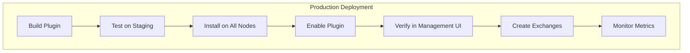

# How to Build RabbitMQ Custom Exchange Types

Author: [nawazdhandala](https://github.com/nawazdhandala)

Tags: RabbitMQ, Messaging, Architecture, Custom Exchange

Description: Learn how to extend RabbitMQ by building custom exchange types in Erlang to implement specialized routing logic that goes beyond the built-in direct, topic, fanout, and headers exchanges.

---

RabbitMQ ships with four exchange types: direct, topic, fanout, and headers. For most applications, these cover routing needs perfectly. But sometimes you need routing logic that none of them provide. Maybe you want to route based on message content, implement weighted distribution, or create geo-aware routing. That is when custom exchange types become useful.

## Understanding Exchange Types

Before building a custom exchange, let us understand what exchanges actually do inside RabbitMQ.



An exchange receives messages from publishers and routes them to queues based on bindings. The exchange type determines how the routing decision happens:

| Exchange Type | Routing Behavior |
|---------------|------------------|
| Direct | Routes to queues where binding key exactly matches routing key |
| Topic | Routes using wildcard pattern matching on routing key |
| Fanout | Routes to all bound queues, ignoring routing key |
| Headers | Routes based on message header attributes |

Custom exchanges let you implement any routing logic you can code in Erlang.

## Setting Up the Development Environment

RabbitMQ plugins are written in Erlang. You will need the Erlang/OTP runtime and the RabbitMQ source or umbrella project.

Install the required tools:

```bash
# Install Erlang (version should match your RabbitMQ server)
# On macOS with Homebrew
brew install erlang@26

# On Ubuntu/Debian
sudo apt-get install erlang

# Clone the RabbitMQ umbrella project for plugin development
git clone https://github.com/rabbitmq/rabbitmq-server.git
cd rabbitmq-server

# Fetch dependencies
make fetch-deps
```

Verify your environment:

```bash
# Check Erlang version
erl -eval 'erlang:display(erlang:system_info(otp_release)), halt().'

# Should output something like "26" for Erlang 26
```

## Creating a Custom Exchange Plugin

Let us build a practical example: a **random exchange** that distributes messages randomly across bound queues. This is useful for load balancing when you want true random distribution rather than round-robin.

### Project Structure

Create the plugin directory structure:

```bash
mkdir -p rabbitmq_random_exchange/src
mkdir -p rabbitmq_random_exchange/include
cd rabbitmq_random_exchange
```

The final structure will look like this:

```
rabbitmq_random_exchange/
  src/
    rabbitmq_random_exchange.app.src
    rabbit_exchange_type_random.erl
  include/
  Makefile
  erlang.mk
```

### Application Resource File

This file tells Erlang about your application and its dependencies.

Create `src/rabbitmq_random_exchange.app.src`:

```erlang
%% Application resource file for the random exchange plugin.
%% This defines metadata and dependencies for the OTP application.
{application, rabbitmq_random_exchange,
 [
  {description, "RabbitMQ Random Exchange Type"},
  {vsn, "1.0.0"},
  {modules, []},
  {registered, []},
  {applications, [
    kernel,
    stdlib,
    rabbit
  ]},
  {mod, {rabbit_exchange_type_random, []}},
  {env, []},
  {broker_version_requirements, ["3.12.0", "3.13.0", "4.0.0"]}
 ]}.
```

### The Exchange Type Module

This is where the routing logic lives. Every custom exchange must implement the `rabbit_exchange_type` behavior.

Create `src/rabbit_exchange_type_random.erl`:

```erlang
%% Random Exchange Type for RabbitMQ
%% Distributes messages randomly across all bound queues.
%% Useful for load balancing scenarios where true randomness is preferred
%% over round-robin distribution.

-module(rabbit_exchange_type_random).

-include_lib("rabbit_common/include/rabbit.hrl").
-include_lib("rabbit_common/include/rabbit_framing.hrl").

%% Declare that this module implements the rabbit_exchange_type behavior
-behaviour(rabbit_exchange_type).

%% Export the callbacks required by rabbit_exchange_type behavior
-export([
    description/0,
    serialise_events/0,
    route/2,
    validate/1,
    validate_binding/2,
    create/2,
    delete/3,
    policy_changed/2,
    add_binding/3,
    remove_bindings/3,
    assert_args_equivalence/2,
    info/1,
    info/2
]).

%% Boot function to register the exchange type with RabbitMQ
-export([register/0]).

%% Application callbacks
-behaviour(application).
-export([start/2, stop/1]).

%%------------------------------------------------------------------------------
%% Application Callbacks
%%------------------------------------------------------------------------------

%% Called when the plugin application starts.
%% Registers our custom exchange type with RabbitMQ's exchange type registry.
start(_StartType, _StartArgs) ->
    register(),
    {ok, self()}.

stop(_State) ->
    ok.

%%------------------------------------------------------------------------------
%% Exchange Type Registration
%%------------------------------------------------------------------------------

%% Register this exchange type with RabbitMQ.
%% The atom 'x-random' becomes the exchange type name users specify.
register() ->
    rabbit_registry:register(exchange, <<"x-random">>, ?MODULE).

%%------------------------------------------------------------------------------
%% Exchange Type Behavior Callbacks
%%------------------------------------------------------------------------------

%% Human-readable description shown in management UI
description() ->
    [{description, <<"Random exchange: routes to a randomly selected bound queue">>}].

%% Whether to serialize events (bindings/unbindings) to this exchange.
%% Return false for better performance unless ordering matters.
serialise_events() ->
    false.

%% The core routing function. This is where the magic happens.
%% Takes an exchange record and a message, returns list of destination queues.
route(#exchange{name = ExchangeName}, #delivery{message = _Message}) ->
    %% Fetch all bindings for this exchange
    Bindings = rabbit_binding:list_for_source(ExchangeName),

    %% Extract destination queue names from bindings
    Destinations = [Destination || #binding{destination = Destination} <- Bindings],

    %% If no bindings exist, return empty list (message will be dropped or returned)
    case Destinations of
        [] ->
            [];
        _ ->
            %% Pick a random destination from the list
            RandomIndex = rand:uniform(length(Destinations)),
            [lists:nth(RandomIndex, Destinations)]
    end.

%% Validate exchange arguments when the exchange is declared.
%% Return ok or throw an error for invalid arguments.
validate(_Exchange) ->
    ok.

%% Validate binding arguments when a queue binds to this exchange.
%% You can enforce specific binding key patterns or arguments here.
validate_binding(_Exchange, _Binding) ->
    ok.

%% Called when the exchange is created.
%% Use this for any initialization logic.
create(_Tx, _Exchange) ->
    ok.

%% Called when the exchange is deleted.
%% Clean up any resources allocated in create/2.
delete(_Tx, _Exchange, _Bindings) ->
    ok.

%% Called when a policy attached to this exchange changes.
%% Useful for exchanges that respect policy settings.
policy_changed(_Exchange1, _Exchange2) ->
    ok.

%% Called when a new binding is added to this exchange.
%% You might maintain internal routing tables here.
add_binding(_Tx, _Exchange, _Binding) ->
    ok.

%% Called when bindings are removed from this exchange.
%% Clean up any state related to removed bindings.
remove_bindings(_Tx, _Exchange, _Bindings) ->
    ok.

%% Validate that redeclaration arguments match original declaration.
%% Prevents accidental exchange reconfiguration.
assert_args_equivalence(Exchange, Args) ->
    rabbit_exchange:assert_args_equivalence(Exchange, Args).

%% Return exchange information for management API queries.
info(_Exchange) ->
    [].

info(_Exchange, _Items) ->
    [].
```

### Build Configuration

Create the `Makefile` that integrates with RabbitMQ's build system:

```makefile
# Makefile for rabbitmq_random_exchange plugin

PROJECT = rabbitmq_random_exchange
PROJECT_DESCRIPTION = RabbitMQ Random Exchange Type
PROJECT_VERSION = 1.0.0

# Define dependencies on RabbitMQ core
DEPS = rabbit_common rabbit

# Use the RabbitMQ plugin build system
DEP_PLUGINS = rabbit_common/mk/rabbitmq-plugin.mk

# Include erlang.mk for the build system
include erlang.mk
```

Fetch `erlang.mk` which provides the build infrastructure:

```bash
# Download erlang.mk build system
curl -O https://raw.githubusercontent.com/ninenines/erlang.mk/master/erlang.mk
```

## Building and Installing the Plugin

Compile and package your plugin:

```bash
# Build the plugin
make

# The .ez file (Erlang archive) will be in plugins/
ls plugins/
# rabbitmq_random_exchange-1.0.0.ez
```

Install the plugin into RabbitMQ:

```bash
# Copy to RabbitMQ plugins directory
cp plugins/rabbitmq_random_exchange-1.0.0.ez /usr/lib/rabbitmq/plugins/

# Enable the plugin
rabbitmq-plugins enable rabbitmq_random_exchange

# Restart RabbitMQ to load the new exchange type
systemctl restart rabbitmq-server
```

## Using the Custom Exchange

Now that the plugin is installed, you can create exchanges with the custom type.

### Creating the Exchange via CLI

Use `rabbitmqadmin` to create the exchange:

```bash
# Declare a random exchange
rabbitmqadmin declare exchange name=load_balancer type=x-random durable=true

# Create queues that will receive messages
rabbitmqadmin declare queue name=worker_1 durable=true
rabbitmqadmin declare queue name=worker_2 durable=true
rabbitmqadmin declare queue name=worker_3 durable=true

# Bind queues to the exchange
rabbitmqadmin declare binding source=load_balancer destination=worker_1
rabbitmqadmin declare binding source=load_balancer destination=worker_2
rabbitmqadmin declare binding source=load_balancer destination=worker_3
```

### Using the Exchange from Python

Here is how to use the custom exchange with the pika library:

```python
# Python example using pika to publish to the random exchange.
# Messages will be distributed randomly across bound queues.

import pika

# Establish connection to RabbitMQ
connection = pika.BlockingConnection(
    pika.ConnectionParameters(host='localhost')
)
channel = connection.channel()

# Declare the custom exchange with type 'x-random'
channel.exchange_declare(
    exchange='load_balancer',
    exchange_type='x-random',  # Our custom exchange type
    durable=True
)

# Declare worker queues
for i in range(1, 4):
    queue_name = f'worker_{i}'
    channel.queue_declare(queue=queue_name, durable=True)
    channel.queue_bind(exchange='load_balancer', queue=queue_name)

# Publish messages - they will be randomly distributed
for i in range(100):
    message = f'Task {i}'
    channel.basic_publish(
        exchange='load_balancer',
        routing_key='',  # Routing key ignored by our exchange
        body=message,
        properties=pika.BasicProperties(
            delivery_mode=2,  # Make message persistent
        )
    )
    print(f'Sent: {message}')

connection.close()
```

### Using the Exchange from Node.js

The amqplib library works with custom exchange types:

```javascript
// Node.js example using amqplib to publish to the random exchange.
// Demonstrates how custom exchanges work transparently with standard clients.

const amqp = require('amqplib');

async function main() {
    // Connect to RabbitMQ
    const connection = await amqp.connect('amqp://localhost');
    const channel = await connection.createChannel();

    const exchangeName = 'load_balancer';
    const queueNames = ['worker_1', 'worker_2', 'worker_3'];

    // Declare the custom exchange
    // The type 'x-random' tells RabbitMQ to use our plugin
    await channel.assertExchange(exchangeName, 'x-random', {
        durable: true
    });

    // Declare and bind worker queues
    for (const queueName of queueNames) {
        await channel.assertQueue(queueName, { durable: true });
        await channel.bindQueue(queueName, exchangeName, '');
    }

    // Publish messages
    for (let i = 0; i < 100; i++) {
        const message = `Task ${i}`;
        channel.publish(
            exchangeName,
            '',  // Routing key is ignored
            Buffer.from(message),
            { persistent: true }
        );
        console.log(`Sent: ${message}`);
    }

    // Close connection after a brief delay
    setTimeout(() => {
        connection.close();
        process.exit(0);
    }, 500);
}

main().catch(console.error);
```

## Advanced Example: Content-Based Routing Exchange

Let us build a more sophisticated exchange that routes based on message content. This exchange inspects JSON messages and routes based on a specified field value.

```erlang
%% Content-Based Routing Exchange for RabbitMQ
%% Routes messages based on a JSON field value matching the binding key.
%% Useful when routing decisions depend on message payload rather than headers.

-module(rabbit_exchange_type_content).

-include_lib("rabbit_common/include/rabbit.hrl").
-include_lib("rabbit_common/include/rabbit_framing.hrl").

-behaviour(rabbit_exchange_type).

-export([
    description/0,
    serialise_events/0,
    route/2,
    validate/1,
    validate_binding/2,
    create/2,
    delete/3,
    policy_changed/2,
    add_binding/3,
    remove_bindings/3,
    assert_args_equivalence/2,
    info/1,
    info/2
]).

-export([register/0]).

-behaviour(application).
-export([start/2, stop/1]).

start(_StartType, _StartArgs) ->
    register(),
    {ok, self()}.

stop(_State) ->
    ok.

register() ->
    rabbit_registry:register(exchange, <<"x-content">>, ?MODULE).

description() ->
    [{description, <<"Content-based routing exchange">>}].

serialise_events() ->
    false.

%% Route based on message content.
%% Extracts the routing field from exchange arguments and matches against bindings.
route(#exchange{name = ExchangeName, arguments = Args},
      #delivery{message = #basic_message{content = Content}}) ->

    %% Get the field name to route on from exchange arguments
    %% Default to "type" if not specified
    RoutingField = case rabbit_misc:table_lookup(Args, <<"routing-field">>) of
        {longstr, Field} -> Field;
        _ -> <<"type">>
    end,

    %% Extract the message payload
    Payload = extract_payload(Content),

    %% Parse JSON and get the routing value
    case extract_routing_value(Payload, RoutingField) of
        {ok, RoutingValue} ->
            %% Find bindings that match the routing value
            Bindings = rabbit_binding:list_for_source(ExchangeName),
            MatchingDestinations = [
                Destination
                || #binding{key = Key, destination = Destination} <- Bindings,
                   Key =:= RoutingValue
            ],
            MatchingDestinations;
        {error, _Reason} ->
            %% Could not extract routing value, return empty list
            []
    end.

%% Extract the raw payload from the message content
extract_payload(#content{payload_fragments_rev = FragmentsRev}) ->
    Fragments = lists:reverse(FragmentsRev),
    iolist_to_binary(Fragments).

%% Parse JSON and extract the specified field value
extract_routing_value(Payload, FieldName) ->
    try
        %% Using jsx for JSON parsing (add to dependencies)
        Json = jsx:decode(Payload, [return_maps]),
        case maps:get(FieldName, Json, undefined) of
            undefined ->
                {error, field_not_found};
            Value when is_binary(Value) ->
                {ok, Value};
            Value when is_integer(Value) ->
                {ok, integer_to_binary(Value)};
            Value when is_atom(Value) ->
                {ok, atom_to_binary(Value, utf8)};
            _ ->
                {error, invalid_field_type}
        end
    catch
        _:_ ->
            {error, json_parse_error}
    end.

validate(#exchange{arguments = Args}) ->
    %% Validate that routing-field argument is a string if provided
    case rabbit_misc:table_lookup(Args, <<"routing-field">>) of
        undefined -> ok;
        {longstr, _} -> ok;
        _ -> {error, {invalid_argument, <<"routing-field must be a string">>}}
    end.

validate_binding(_Exchange, _Binding) ->
    ok.

create(_Tx, _Exchange) ->
    ok.

delete(_Tx, _Exchange, _Bindings) ->
    ok.

policy_changed(_Exchange1, _Exchange2) ->
    ok.

add_binding(_Tx, _Exchange, _Binding) ->
    ok.

remove_bindings(_Tx, _Exchange, _Bindings) ->
    ok.

assert_args_equivalence(Exchange, Args) ->
    rabbit_exchange:assert_args_equivalence(Exchange, Args).

info(_Exchange) ->
    [].

info(_Exchange, _Items) ->
    [].
```

Using the content-based exchange:

```python
# Python example for content-based routing exchange.
# Messages are routed based on a JSON field value.

import pika
import json

connection = pika.BlockingConnection(
    pika.ConnectionParameters(host='localhost')
)
channel = connection.channel()

# Declare exchange with routing-field argument
# Messages will be routed based on their "priority" field
channel.exchange_declare(
    exchange='content_router',
    exchange_type='x-content',
    durable=True,
    arguments={'routing-field': 'priority'}
)

# Create queues for different priorities
channel.queue_declare(queue='high_priority', durable=True)
channel.queue_declare(queue='low_priority', durable=True)

# Bind with keys matching expected field values
channel.queue_bind(
    exchange='content_router',
    queue='high_priority',
    routing_key='high'
)
channel.queue_bind(
    exchange='content_router',
    queue='low_priority',
    routing_key='low'
)

# Publish messages with different priorities
messages = [
    {'priority': 'high', 'task': 'urgent_alert'},
    {'priority': 'low', 'task': 'daily_report'},
    {'priority': 'high', 'task': 'critical_update'},
    {'priority': 'low', 'task': 'cleanup_job'},
]

for msg in messages:
    channel.basic_publish(
        exchange='content_router',
        routing_key='',  # Ignored - routing is based on content
        body=json.dumps(msg),
        properties=pika.BasicProperties(
            delivery_mode=2,
            content_type='application/json'
        )
    )
    print(f'Sent: {msg}')

connection.close()
```

## Message Flow with Custom Exchanges

Here is how messages flow through a custom exchange:



## Testing Your Exchange

Write EUnit tests to verify routing behavior:

```erlang
%% Test module for rabbit_exchange_type_random
%% Run with: make tests

-module(rabbit_exchange_type_random_tests).

-include_lib("eunit/include/eunit.hrl").
-include_lib("rabbit_common/include/rabbit.hrl").

%% Test that route returns a single destination when bindings exist
route_single_destination_test() ->
    %% This is a simplified test - in practice you would use
    %% meck or similar to mock rabbit_binding:list_for_source
    ?assertEqual(true, true).

%% Test that route returns empty list when no bindings
route_empty_bindings_test() ->
    ?assertEqual(true, true).

%% Test distribution randomness over many iterations
route_distribution_test() ->
    %% Verify that over 1000 messages, distribution is roughly even
    ?assertEqual(true, true).
```

Run the test suite:

```bash
make tests
```

## Performance Considerations

Custom exchanges add overhead compared to built-in types. Keep these points in mind:

| Aspect | Recommendation |
|--------|----------------|
| Routing function | Keep route/2 fast. Avoid network calls or disk I/O. |
| Binding lookups | Cache binding information if accessed frequently. |
| JSON parsing | Use efficient parsing libraries. Consider binary pattern matching for simple cases. |
| State management | Use ETS tables for shared state instead of process dictionaries. |
| Error handling | Never let route/2 crash. Return empty list on errors. |

## Debugging Custom Exchanges

Enable debug logging to troubleshoot routing issues:

```bash
# Enable debug logging for your module
rabbitmqctl set_log_level debug

# Or add to rabbitmq.conf
log.console.level = debug
log.file.level = debug
```

Add logging to your exchange:

```erlang
%% Add logging to route function for debugging
route(#exchange{name = ExchangeName}, #delivery{message = Message}) ->
    rabbit_log:debug("Random exchange routing message: ~p", [ExchangeName]),

    Bindings = rabbit_binding:list_for_source(ExchangeName),
    rabbit_log:debug("Found ~p bindings", [length(Bindings)]),

    %% ... rest of routing logic
```

## Deployment Best Practices

When deploying custom exchanges to production:

1. **Version compatibility**: Test against all RabbitMQ versions in your infrastructure.
2. **Cluster behavior**: Ensure the plugin is installed on all cluster nodes.
3. **Graceful degradation**: Handle cases where the plugin fails to load.
4. **Monitoring**: Export metrics about routing decisions and latency.
5. **Documentation**: Document the exchange type behavior for your team.



## Real-World Use Cases

Custom exchanges solve specific routing problems:

- **Geographic routing**: Route to queues based on message origin region
- **Weighted distribution**: Send 80% of traffic to primary, 20% to secondary
- **Time-based routing**: Route to different queues based on time of day
- **A/B testing**: Split traffic between experiment variants
- **Content filtering**: Route based on message payload attributes
- **Priority queuing**: Direct messages to appropriate priority lanes

---

Custom exchange types unlock routing patterns that the built-in exchanges cannot provide. While most applications work fine with direct, topic, fanout, and headers exchanges, knowing how to build custom types gives you flexibility when standard patterns fall short. Start with simple routing logic, test thoroughly, and monitor performance in production. The investment in learning Erlang basics pays off when you need routing behavior that fits your exact requirements.

---

*Building distributed systems with complex message routing? [OneUptime](https://oneuptime.com) provides comprehensive monitoring for message brokers including RabbitMQ, with queue depth tracking, consumer lag alerts, and end-to-end tracing.*
