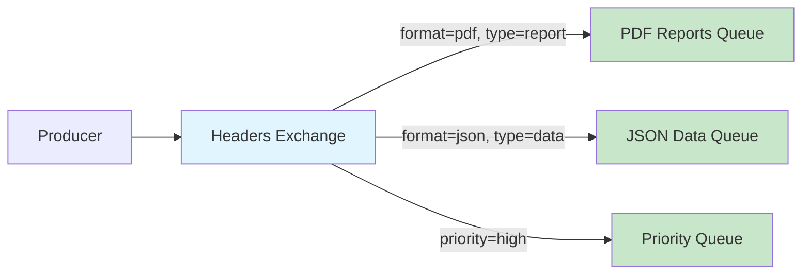
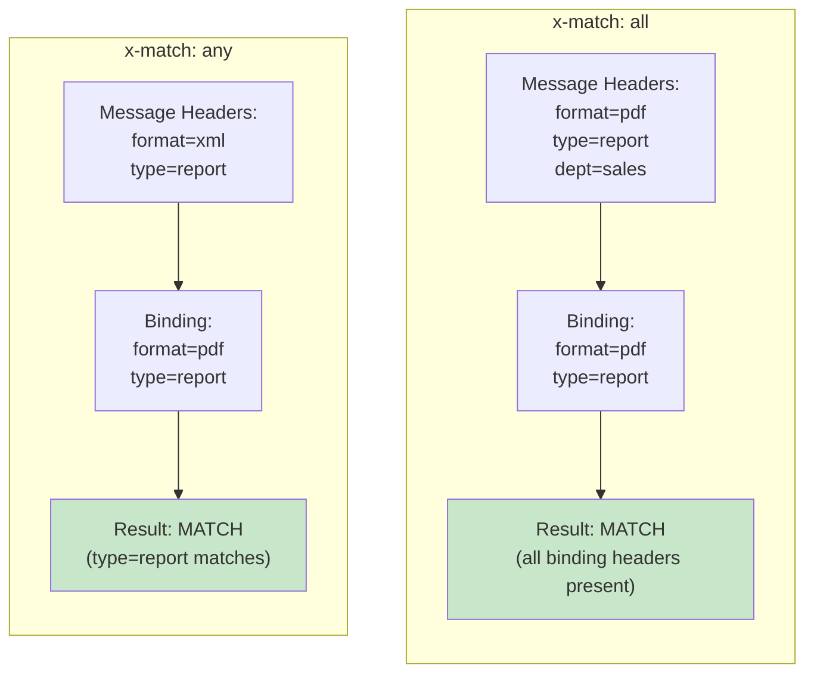
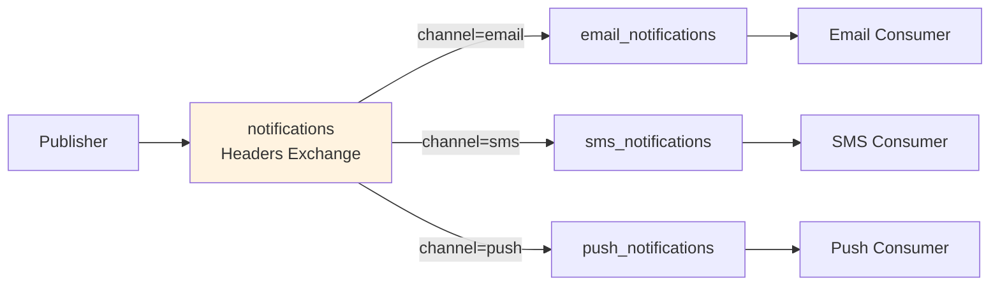
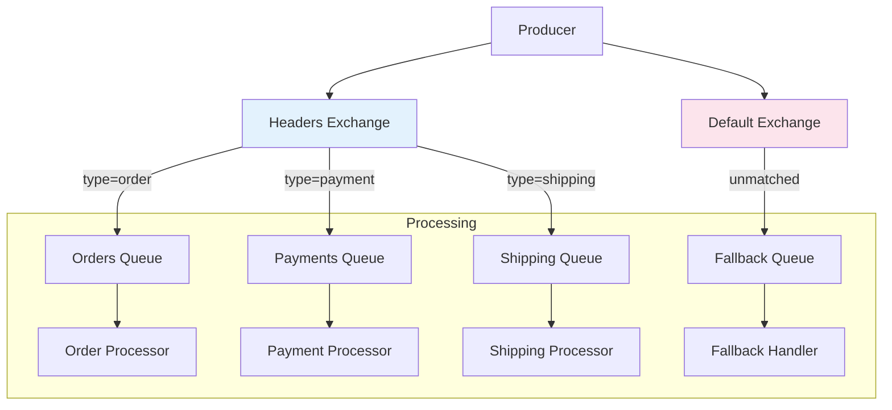
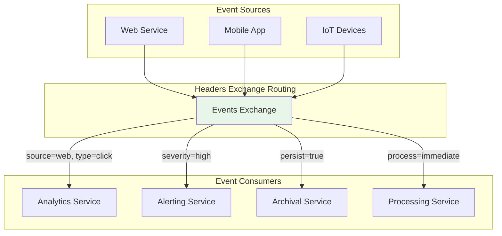

# How to Create RabbitMQ Headers Exchange Patterns

Author: [nawazdhandala](https://github.com/nawazdhandala)

Tags: RabbitMQ, Headers Exchange, Routing, Message Patterns

Description: Learn to implement RabbitMQ headers exchange patterns for content-based routing with x-match, header binding, and complex filtering.

---

## Introduction

RabbitMQ provides several exchange types for routing messages to queues. While direct and topic exchanges route based on routing keys, the **headers exchange** offers a more flexible approach by routing messages based on their header attributes. This makes it ideal for content-based routing scenarios where you need to filter messages by multiple criteria.

In this guide, we will explore how to create and use headers exchange patterns effectively for building sophisticated message routing systems.

## Understanding Headers Exchange

A headers exchange routes messages based on matching message headers against the binding arguments. Unlike other exchange types, the routing key is ignored - only the headers matter.



### Key Concepts

- **Headers**: Key-value pairs attached to messages
- **Binding Arguments**: Header criteria specified when binding a queue to the exchange
- **x-match**: Special argument that determines matching behavior

## Setting Up a Headers Exchange

Let us start by creating a headers exchange and binding queues with different header patterns.

### Python Example with Pika

```python
import pika
import json

# Establish connection
connection = pika.BlockingConnection(
    pika.ConnectionParameters('localhost')
)
channel = connection.channel()

# Declare a headers exchange
channel.exchange_declare(
    exchange='notifications',
    exchange_type='headers',
    durable=True
)

# Declare queues
channel.queue_declare(queue='email_notifications', durable=True)
channel.queue_declare(queue='sms_notifications', durable=True)
channel.queue_declare(queue='urgent_notifications', durable=True)

print("Headers exchange 'notifications' created successfully")
```

### Node.js Example with amqplib

```javascript
const amqp = require('amqplib');

async function setupHeadersExchange() {
    const connection = await amqp.connect('amqp://localhost');
    const channel = await connection.createChannel();

    // Declare headers exchange
    await channel.assertExchange('notifications', 'headers', {
        durable: true
    });

    // Declare queues
    await channel.assertQueue('email_notifications', { durable: true });
    await channel.assertQueue('sms_notifications', { durable: true });
    await channel.assertQueue('urgent_notifications', { durable: true });

    console.log('Headers exchange setup complete');
    return { connection, channel };
}
```

## Understanding x-match Modes

The `x-match` argument is crucial for headers exchange behavior. It determines how multiple headers are evaluated.



### x-match: all (Default)

All specified headers must match for the message to be routed.

```python
# Bind queue with x-match: all
# Message must have BOTH format=pdf AND type=report
channel.queue_bind(
    exchange='notifications',
    queue='pdf_reports',
    arguments={
        'x-match': 'all',
        'format': 'pdf',
        'type': 'report'
    }
)
```

### x-match: any

At least one of the specified headers must match.

```python
# Bind queue with x-match: any
# Message needs EITHER priority=high OR urgent=true
channel.queue_bind(
    exchange='notifications',
    queue='urgent_notifications',
    arguments={
        'x-match': 'any',
        'priority': 'high',
        'urgent': 'true'
    }
)
```

## Binding Patterns

Let us explore various binding patterns for different use cases.

### Pattern 1: Channel-Based Routing

Route notifications to different queues based on the delivery channel.

```python
# Email notifications binding
channel.queue_bind(
    exchange='notifications',
    queue='email_notifications',
    arguments={
        'x-match': 'all',
        'channel': 'email'
    }
)

# SMS notifications binding
channel.queue_bind(
    exchange='notifications',
    queue='sms_notifications',
    arguments={
        'x-match': 'all',
        'channel': 'sms'
    }
)

# Push notifications binding
channel.queue_bind(
    exchange='notifications',
    queue='push_notifications',
    arguments={
        'x-match': 'all',
        'channel': 'push'
    }
)
```



### Pattern 2: Multi-Criteria Filtering

Filter messages based on multiple attributes.

```python
# High-priority sales reports
channel.queue_bind(
    exchange='reports',
    queue='priority_sales_reports',
    arguments={
        'x-match': 'all',
        'department': 'sales',
        'priority': 'high',
        'format': 'pdf'
    }
)

# Any engineering document
channel.queue_bind(
    exchange='reports',
    queue='engineering_docs',
    arguments={
        'x-match': 'all',
        'department': 'engineering'
    }
)
```

### Pattern 3: Flexible Matching with Any

Create catch-all queues for urgent messages regardless of type.

```python
# Catch any urgent or critical message
channel.queue_bind(
    exchange='alerts',
    queue='immediate_action',
    arguments={
        'x-match': 'any',
        'severity': 'critical',
        'priority': 'urgent',
        'escalate': 'true'
    }
)
```

## Publishing Messages with Headers

Now let us publish messages with headers that will be routed based on our bindings.

### Python Publisher

```python
import pika
from datetime import datetime

def publish_notification(channel, headers, message):
    """Publish a message with headers to the exchange."""

    properties = pika.BasicProperties(
        headers=headers,
        content_type='application/json',
        delivery_mode=2  # Persistent message
    )

    channel.basic_publish(
        exchange='notifications',
        routing_key='',  # Ignored for headers exchange
        body=message,
        properties=properties
    )
    print(f"Published message with headers: {headers}")

# Example: Send an email notification
publish_notification(
    channel,
    headers={
        'channel': 'email',
        'priority': 'normal',
        'category': 'marketing'
    },
    message='{"subject": "Weekly Newsletter", "body": "..."}'
)

# Example: Send an urgent SMS
publish_notification(
    channel,
    headers={
        'channel': 'sms',
        'priority': 'high',
        'urgent': 'true'
    },
    message='{"phone": "+1234567890", "text": "Urgent: Server down!"}'
)
```

### Node.js Publisher

```javascript
async function publishWithHeaders(channel, exchange, headers, message) {
    channel.publish(
        exchange,
        '',  // routing key ignored
        Buffer.from(JSON.stringify(message)),
        {
            headers: headers,
            contentType: 'application/json',
            persistent: true
        }
    );
    console.log(`Published message with headers:`, headers);
}

// Send a high-priority PDF report
await publishWithHeaders(
    channel,
    'reports',
    {
        department: 'sales',
        format: 'pdf',
        priority: 'high',
        type: 'quarterly-report'
    },
    { reportId: 'Q4-2025', data: '...' }
);
```

## Consuming Messages

Set up consumers to process messages from header-bound queues.

```python
def create_consumer(queue_name, callback):
    """Create a consumer for a specific queue."""

    def on_message(ch, method, properties, body):
        print(f"Received from {queue_name}")
        print(f"Headers: {properties.headers}")
        print(f"Body: {body.decode()}")

        # Process the message
        callback(properties.headers, body)

        # Acknowledge the message
        ch.basic_ack(delivery_tag=method.delivery_tag)

    channel.basic_consume(
        queue=queue_name,
        on_message_callback=on_message
    )

# Define handlers
def handle_email(headers, body):
    print(f"Sending email notification...")
    # Email sending logic here

def handle_sms(headers, body):
    print(f"Sending SMS notification...")
    # SMS sending logic here

# Set up consumers
create_consumer('email_notifications', handle_email)
create_consumer('sms_notifications', handle_sms)

print("Waiting for messages...")
channel.start_consuming()
```

## Advanced Patterns

### Pattern: Content-Based Router with Fallback

Create a routing system with a default fallback queue for unmatched messages.



```python
# Setup headers exchange with alternate exchange for unmatched messages
channel.exchange_declare(
    exchange='orders',
    exchange_type='headers',
    durable=True,
    arguments={
        'alternate-exchange': 'orders.unmatched'
    }
)

# Declare the alternate exchange
channel.exchange_declare(
    exchange='orders.unmatched',
    exchange_type='fanout',
    durable=True
)

# Bind fallback queue to alternate exchange
channel.queue_declare(queue='unmatched_orders', durable=True)
channel.queue_bind(
    exchange='orders.unmatched',
    queue='unmatched_orders'
)

# Bind specific queues to headers exchange
channel.queue_bind(
    exchange='orders',
    queue='domestic_orders',
    arguments={
        'x-match': 'all',
        'region': 'domestic',
        'type': 'standard'
    }
)

channel.queue_bind(
    exchange='orders',
    queue='international_orders',
    arguments={
        'x-match': 'all',
        'region': 'international'
    }
)
```

### Pattern: Priority-Based Processing

Route messages to different queues based on priority levels.

```python
# High priority queue - processed first
channel.queue_bind(
    exchange='tasks',
    queue='high_priority_tasks',
    arguments={
        'x-match': 'any',
        'priority': 'critical',
        'priority': 'high'
    }
)

# Normal priority queue
channel.queue_bind(
    exchange='tasks',
    queue='normal_tasks',
    arguments={
        'x-match': 'all',
        'priority': 'normal'
    }
)

# Low priority queue - batch processing
channel.queue_bind(
    exchange='tasks',
    queue='low_priority_tasks',
    arguments={
        'x-match': 'any',
        'priority': 'low',
        'batch': 'true'
    }
)
```

### Pattern: Geographic and Service Routing

Route messages based on geographic region and service type.

```python
# US region - payment service
channel.queue_bind(
    exchange='services',
    queue='us_payments',
    arguments={
        'x-match': 'all',
        'region': 'us',
        'service': 'payment'
    }
)

# EU region - any service (GDPR compliant processing)
channel.queue_bind(
    exchange='services',
    queue='eu_services',
    arguments={
        'x-match': 'all',
        'region': 'eu'
    }
)

# Global analytics - collect from all regions
channel.queue_bind(
    exchange='services',
    queue='analytics',
    arguments={
        'x-match': 'all',
        'service': 'analytics'
    }
)
```

## Complete Working Example

Here is a complete example demonstrating a notification system using headers exchange.

```python
import pika
import json
import threading
import time

class NotificationSystem:
    def __init__(self, host='localhost'):
        self.connection = pika.BlockingConnection(
            pika.ConnectionParameters(host)
        )
        self.channel = self.connection.channel()
        self.setup_exchange()

    def setup_exchange(self):
        """Set up the headers exchange and queues."""

        # Declare headers exchange
        self.channel.exchange_declare(
            exchange='notification_hub',
            exchange_type='headers',
            durable=True
        )

        # Declare queues
        queues = [
            'email_queue',
            'sms_queue',
            'push_queue',
            'urgent_queue',
            'audit_queue'
        ]

        for queue in queues:
            self.channel.queue_declare(queue=queue, durable=True)

        # Bind email queue
        self.channel.queue_bind(
            exchange='notification_hub',
            queue='email_queue',
            arguments={
                'x-match': 'all',
                'channel': 'email'
            }
        )

        # Bind SMS queue
        self.channel.queue_bind(
            exchange='notification_hub',
            queue='sms_queue',
            arguments={
                'x-match': 'all',
                'channel': 'sms'
            }
        )

        # Bind push notification queue
        self.channel.queue_bind(
            exchange='notification_hub',
            queue='push_queue',
            arguments={
                'x-match': 'all',
                'channel': 'push'
            }
        )

        # Bind urgent queue - catches any urgent message
        self.channel.queue_bind(
            exchange='notification_hub',
            queue='urgent_queue',
            arguments={
                'x-match': 'any',
                'priority': 'urgent',
                'priority': 'critical'
            }
        )

        # Bind audit queue - logs all notifications
        self.channel.queue_bind(
            exchange='notification_hub',
            queue='audit_queue',
            arguments={
                'x-match': 'all',
                'audit': 'true'
            }
        )

        print("Notification system initialized")

    def send_notification(self, channel_type, message, priority='normal', audit=False):
        """Send a notification with specified headers."""

        headers = {
            'channel': channel_type,
            'priority': priority,
            'timestamp': str(time.time())
        }

        if audit:
            headers['audit'] = 'true'

        properties = pika.BasicProperties(
            headers=headers,
            content_type='application/json',
            delivery_mode=2
        )

        self.channel.basic_publish(
            exchange='notification_hub',
            routing_key='',
            body=json.dumps(message),
            properties=properties
        )

        print(f"Sent {channel_type} notification: {message.get('subject', 'N/A')}")

    def close(self):
        """Close the connection."""
        self.connection.close()


# Usage example
if __name__ == '__main__':
    system = NotificationSystem()

    # Send various notifications
    system.send_notification(
        channel_type='email',
        message={
            'subject': 'Welcome to Our Platform',
            'recipient': 'user@example.com',
            'body': 'Thank you for signing up!'
        },
        priority='normal',
        audit=True
    )

    system.send_notification(
        channel_type='sms',
        message={
            'phone': '+1234567890',
            'text': 'Your verification code is 123456'
        },
        priority='high'
    )

    system.send_notification(
        channel_type='push',
        message={
            'title': 'New Message',
            'body': 'You have a new message from John',
            'device_token': 'abc123'
        },
        priority='urgent'
    )

    system.close()
```

## Best Practices

### 1. Keep Headers Simple

Use simple string values for headers when possible. Complex objects as header values can cause issues.

```python
# Good - simple string values
headers = {
    'type': 'order',
    'priority': 'high',
    'region': 'us-east'
}

# Avoid - complex nested values
headers = {
    'metadata': {'nested': {'value': 123}}  # May cause issues
}
```

### 2. Use Meaningful Header Names

Choose descriptive header names that clearly indicate the routing criteria.

```python
# Good - clear and descriptive
headers = {
    'message_type': 'invoice',
    'customer_tier': 'premium',
    'processing_region': 'europe'
}

# Avoid - ambiguous names
headers = {
    'mt': 'inv',
    'ct': 'p',
    'pr': 'eu'
}
```

### 3. Document Your Header Schema

Maintain documentation of all headers used in your system.

```python
"""
Notification System Header Schema
---------------------------------
channel: string - Delivery channel (email, sms, push)
priority: string - Message priority (low, normal, high, urgent, critical)
audit: string - Enable audit logging (true, false)
region: string - Geographic region for processing
customer_id: string - Customer identifier for routing
"""
```

### 4. Monitor Unmatched Messages

Always set up monitoring for messages that do not match any binding.

```python
# Use alternate exchange for unmatched messages
channel.exchange_declare(
    exchange='main_exchange',
    exchange_type='headers',
    arguments={
        'alternate-exchange': 'unmatched_exchange'
    }
)
```

## Use Cases

### Event-Driven Architecture

Headers exchange is excellent for event-driven systems where events need to be routed based on multiple attributes.



### Multi-Tenant Systems

Route messages to tenant-specific queues based on headers.

```python
# Tenant A - premium tier
channel.queue_bind(
    exchange='multi_tenant',
    queue='tenant_a_premium',
    arguments={
        'x-match': 'all',
        'tenant_id': 'tenant_a',
        'tier': 'premium'
    }
)

# Tenant B - standard tier
channel.queue_bind(
    exchange='multi_tenant',
    queue='tenant_b_standard',
    arguments={
        'x-match': 'all',
        'tenant_id': 'tenant_b',
        'tier': 'standard'
    }
)
```

### Log Aggregation

Route logs based on severity and source.

```python
# Critical errors - immediate alerting
channel.queue_bind(
    exchange='logs',
    queue='critical_alerts',
    arguments={
        'x-match': 'any',
        'level': 'critical',
        'level': 'fatal'
    }
)

# Application logs by service
channel.queue_bind(
    exchange='logs',
    queue='api_service_logs',
    arguments={
        'x-match': 'all',
        'service': 'api',
        'environment': 'production'
    }
)
```

## Conclusion

RabbitMQ headers exchange provides powerful content-based routing capabilities that go beyond simple routing key matching. By leveraging headers and the x-match modes, you can build sophisticated message routing systems that filter messages based on multiple criteria.

Key takeaways:

- Headers exchange ignores routing keys and routes based on message headers
- Use `x-match: all` when all headers must match
- Use `x-match: any` when at least one header should match
- Combine with alternate exchanges for handling unmatched messages
- Keep headers simple and well-documented

Headers exchange is particularly useful for event-driven architectures, multi-tenant systems, and any scenario requiring flexible, attribute-based message routing.

## Further Reading

- [RabbitMQ Official Documentation - Headers Exchange](https://www.rabbitmq.com/tutorials/amqp-concepts.html#exchange-headers)
- [RabbitMQ Tutorials](https://www.rabbitmq.com/getstarted.html)
- [Pika Python Client](https://pika.readthedocs.io/)
- [amqplib Node.js Client](https://www.npmjs.com/package/amqplib)
