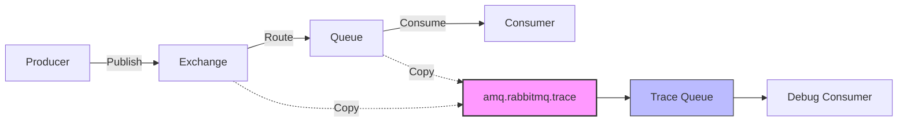
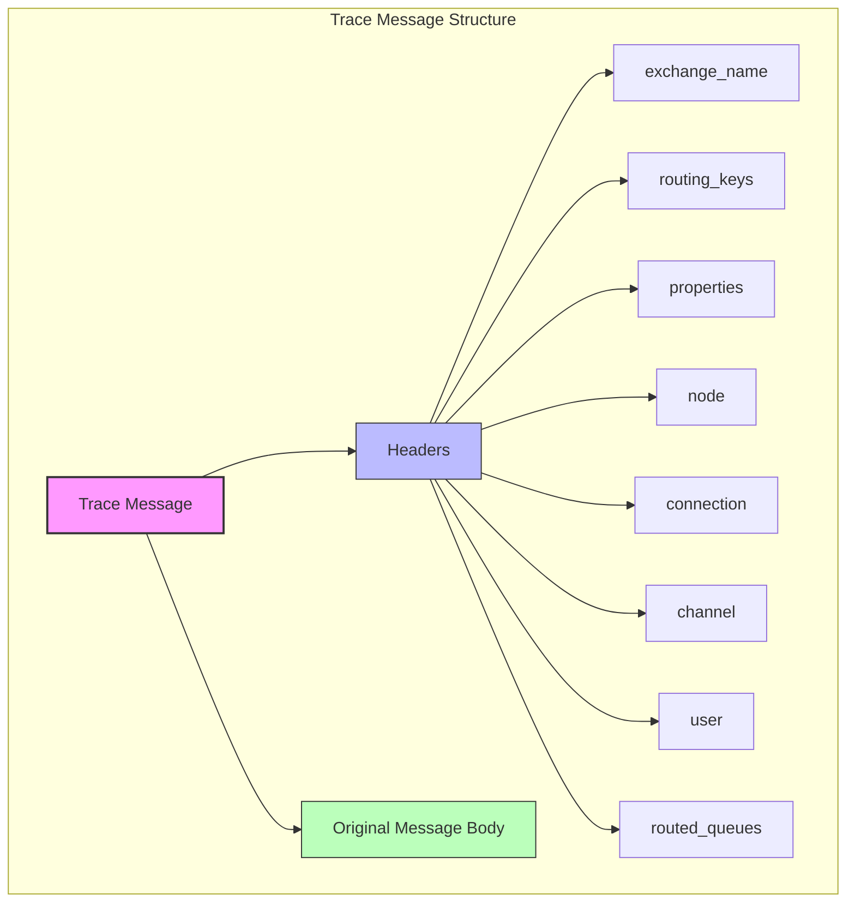

# How to Implement RabbitMQ Message Tracing

Author: [nawazdhandala](https://www.github.com/nawazdhandala)

Tags: RabbitMQ, Message Queue, Tracing, Debugging, Observability

Description: Enable and use RabbitMQ message tracing with the Firehose tracer for debugging message flows, routing issues, and queue behaviors.

---

> When messages disappear into the void or end up in unexpected queues, you need visibility into what RabbitMQ is actually doing. The Firehose tracer gives you that visibility by capturing every message as it flows through your broker.

Debugging message-based systems is notoriously difficult. Unlike HTTP requests where you can easily inspect request and response, messages in RabbitMQ can take complex paths through exchanges, bindings, and queues. When something goes wrong, you often find yourself wondering: Did the message even get published? Which queue did it end up in? Why did the routing fail?

RabbitMQ's built-in message tracing solves this by letting you tap into the message flow and see exactly what's happening. This guide covers how to enable and use the Firehose tracer effectively for debugging without impacting production performance.

---

## Table of Contents

1. Understanding the Firehose Tracer
2. Enabling the Tracing Plugin
3. Setting Up Trace Queues
4. Filtering Traces by Pattern
5. Analyzing Trace Messages
6. Building a Trace Consumer
7. Production Considerations
8. Troubleshooting Common Issues

---

## 1. Understanding the Firehose Tracer

The Firehose tracer works by publishing copies of messages to a special exchange called `amq.rabbitmq.trace`. Every message that passes through the broker gets duplicated to this exchange with metadata about its journey.



Two types of trace messages get published:

- **publish**: Captured when a message arrives at an exchange
- **deliver**: Captured when a message is delivered to a consumer

Each trace message includes the original message content plus headers containing routing information, timestamps, and connection details.

---

## 2. Enabling the Tracing Plugin

The tracing plugin comes bundled with RabbitMQ but is disabled by default. Enable it using the command line.

```bash
# Enable the rabbitmq_tracing plugin
rabbitmq-plugins enable rabbitmq_tracing

# Verify it's enabled
rabbitmq-plugins list | grep tracing
```

Once enabled, you can control tracing through the management UI or the HTTP API.

```bash
# Enable tracing for a specific vhost via HTTP API
curl -u guest:guest -X PUT \
    -H "Content-Type: application/json" \
    -d '{"pattern": "#", "tracer_connection_username": "guest"}' \
    http://localhost:15672/api/traces/%2f/my-trace
```

You can also enable it programmatically.

```typescript
// enable-tracing.ts
// Enables message tracing via the RabbitMQ HTTP API

import axios from 'axios';

interface TraceConfig {
    name: string;           // Unique name for this trace
    vhost: string;          // Virtual host to trace
    pattern: string;        // Routing key pattern (# for all)
    format: 'json' | 'text'; // Output format
}

async function enableTracing(config: TraceConfig): Promise<void> {
    const encodedVhost = encodeURIComponent(config.vhost);

    // Create a trace configuration via the management API
    // This tells RabbitMQ to start copying messages to amq.rabbitmq.trace
    await axios.put(
        `http://localhost:15672/api/traces/${encodedVhost}/${config.name}`,
        {
            pattern: config.pattern,
            format: config.format,
            tracer_connection_username: 'guest',
        },
        {
            auth: { username: 'guest', password: 'guest' },
            headers: { 'Content-Type': 'application/json' },
        }
    );

    console.log(`Tracing enabled: ${config.name} on vhost ${config.vhost}`);
    console.log(`Pattern: ${config.pattern}`);
}

// Enable tracing for all messages on the default vhost
enableTracing({
    name: 'debug-trace',
    vhost: '/',
    pattern: '#',
    format: 'json',
}).catch(console.error);
```

---

## 3. Setting Up Trace Queues

To actually receive trace messages, you need to create a queue and bind it to the `amq.rabbitmq.trace` exchange. The routing keys follow a specific pattern.

```typescript
// trace-queue-setup.ts
// Creates queues to capture traced messages

import amqp from 'amqplib';

async function setupTraceQueues(): Promise<void> {
    const connection = await amqp.connect('amqp://localhost');
    const channel = await connection.createChannel();

    // Create a queue for trace messages
    // Use auto-delete so it cleans up when debugging is done
    const traceQueue = await channel.assertQueue('debug-traces', {
        durable: false,
        autoDelete: true,
        // Set a TTL to prevent unbounded growth
        arguments: {
            'x-message-ttl': 300000,    // 5 minutes
            'x-max-length': 10000,      // Max 10k messages
        },
    });

    // Bind to capture all publish events
    // Routing key format: publish.<exchange-name>
    await channel.bindQueue(
        traceQueue.queue,
        'amq.rabbitmq.trace',
        'publish.#'  // All publishes to any exchange
    );

    // Bind to capture all deliver events
    // Routing key format: deliver.<queue-name>
    await channel.bindQueue(
        traceQueue.queue,
        'amq.rabbitmq.trace',
        'deliver.#'  // All deliveries to any queue
    );

    console.log('Trace queue created and bound');
    console.log('Listening for: publish.# and deliver.#');

    await channel.close();
    await connection.close();
}

setupTraceQueues().catch(console.error);
```

---

## 4. Filtering Traces by Pattern

Capturing every message can be overwhelming. Use specific routing key patterns to focus on what you need to debug.

```typescript
// filtered-trace-setup.ts
// Sets up targeted tracing for specific exchanges or queues

import amqp from 'amqplib';

interface TraceFilter {
    exchanges?: string[];   // Specific exchanges to trace
    queues?: string[];      // Specific queues to trace
}

async function setupFilteredTracing(filter: TraceFilter): Promise<void> {
    const connection = await amqp.connect('amqp://localhost');
    const channel = await connection.createChannel();

    // Create the trace queue
    const { queue } = await channel.assertQueue('filtered-traces', {
        durable: false,
        autoDelete: true,
        arguments: {
            'x-message-ttl': 600000,
            'x-max-length': 5000,
        },
    });

    // Bind for specific exchanges
    // This captures messages as they enter these exchanges
    if (filter.exchanges) {
        for (const exchange of filter.exchanges) {
            const routingKey = `publish.${exchange}`;
            await channel.bindQueue(queue, 'amq.rabbitmq.trace', routingKey);
            console.log(`Tracing exchange: ${exchange}`);
        }
    }

    // Bind for specific queues
    // This captures messages as they are delivered to consumers
    if (filter.queues) {
        for (const targetQueue of filter.queues) {
            const routingKey = `deliver.${targetQueue}`;
            await channel.bindQueue(queue, 'amq.rabbitmq.trace', routingKey);
            console.log(`Tracing queue: ${targetQueue}`);
        }
    }

    await channel.close();
    await connection.close();
}

// Example: Only trace the orders exchange and payments queue
setupFilteredTracing({
    exchanges: ['orders', 'notifications'],
    queues: ['payment-processor', 'email-sender'],
}).catch(console.error);
```

---

## 5. Analyzing Trace Messages

Trace messages contain valuable metadata in their headers. Here's the structure you'll receive.



Key headers in trace messages:

| Header | Description |
|--------|-------------|
| `exchange_name` | The exchange that received the message |
| `routing_keys` | Keys used for routing decisions |
| `routed_queues` | Queues the message was routed to (publish traces) |
| `node` | RabbitMQ node that handled the message |
| `connection` | Client connection name |
| `channel` | Channel number used |
| `user` | Username of the publisher |
| `properties` | Original message properties (content-type, etc.) |

---

## 6. Building a Trace Consumer

Here's a complete trace consumer that parses and displays trace information in a useful format.

```typescript
// trace-consumer.ts
// Consumes and displays trace messages for debugging

import amqp, { ConsumeMessage } from 'amqplib';

interface TraceInfo {
    type: 'publish' | 'deliver';
    timestamp: Date;
    exchange: string;
    routingKey: string;
    routedQueues: string[];
    connection: string;
    user: string;
    messageId?: string;
    contentType?: string;
    bodyPreview: string;
}

function parseTraceMessage(msg: ConsumeMessage): TraceInfo {
    const headers = msg.properties.headers || {};
    const routingKey = msg.fields.routingKey;

    // Determine if this is a publish or deliver trace
    // Routing key format: publish.{exchange} or deliver.{queue}
    const type = routingKey.startsWith('publish.') ? 'publish' : 'deliver';

    // Extract the target (exchange name or queue name)
    const target = routingKey.split('.').slice(1).join('.');

    // Get the list of queues the message was routed to
    // This is an array in the headers for publish traces
    const routedQueues = headers.routed_queues || [];

    // Get connection info for debugging which client sent this
    const connection = headers.connection || 'unknown';
    const user = headers.user || 'unknown';

    // Extract original message properties
    const originalProps = headers.properties || {};

    // Create a preview of the message body
    const body = msg.content.toString();
    const bodyPreview = body.length > 200
        ? body.substring(0, 200) + '...'
        : body;

    return {
        type,
        timestamp: new Date(),
        exchange: type === 'publish' ? target : headers.exchange_name || '',
        routingKey: Array.isArray(headers.routing_keys)
            ? headers.routing_keys[0]
            : headers.routing_keys || '',
        routedQueues: Array.isArray(routedQueues) ? routedQueues : [routedQueues],
        connection,
        user,
        messageId: originalProps.message_id,
        contentType: originalProps.content_type,
        bodyPreview,
    };
}

function formatTraceOutput(trace: TraceInfo): string {
    const lines = [
        `\n${'='.repeat(60)}`,
        `[${trace.type.toUpperCase()}] ${trace.timestamp.toISOString()}`,
        `${'='.repeat(60)}`,
        `Exchange:     ${trace.exchange || '(default)'}`,
        `Routing Key:  ${trace.routingKey}`,
    ];

    if (trace.type === 'publish' && trace.routedQueues.length > 0) {
        lines.push(`Routed To:    ${trace.routedQueues.join(', ')}`);
    }

    if (trace.routedQueues.length === 0 && trace.type === 'publish') {
        lines.push(`Routed To:    ** NO QUEUES (message dropped!) **`);
    }

    lines.push(
        `Connection:   ${trace.connection}`,
        `User:         ${trace.user}`,
        `Content-Type: ${trace.contentType || 'not set'}`,
        `-`.repeat(60),
        `Body:`,
        trace.bodyPreview,
    );

    return lines.join('\n');
}

async function startTraceConsumer(): Promise<void> {
    const connection = await amqp.connect('amqp://localhost');
    const channel = await connection.createChannel();

    // Set up the trace queue with bindings
    const { queue } = await channel.assertQueue('trace-debug', {
        durable: false,
        autoDelete: true,
        arguments: {
            'x-message-ttl': 300000,
            'x-max-length': 10000,
        },
    });

    // Bind to all trace events
    await channel.bindQueue(queue, 'amq.rabbitmq.trace', '#');

    console.log('Trace consumer started. Waiting for messages...\n');
    console.log('Press Ctrl+C to stop.\n');

    // Consume trace messages
    await channel.consume(queue, (msg) => {
        if (!msg) return;

        const trace = parseTraceMessage(msg);
        console.log(formatTraceOutput(trace));

        channel.ack(msg);
    });

    // Handle graceful shutdown
    process.on('SIGINT', async () => {
        console.log('\nShutting down trace consumer...');
        await channel.close();
        await connection.close();
        process.exit(0);
    });
}

startTraceConsumer().catch(console.error);
```

Running this consumer while publishing messages gives you output like this.

```
============================================================
[PUBLISH] 2026-01-30T10:15:23.456Z
============================================================
Exchange:     orders
Routing Key:  order.created
Routed To:    order-processor, order-analytics
Connection:   order-service-1
User:         order-svc
Content-Type: application/json
------------------------------------------------------------
Body:
{"orderId": "12345", "customerId": "cust-789", "total": 99.99}
```

---

## 7. Production Considerations

Tracing has performance overhead. Here are guidelines for using it safely in production.

```typescript
// safe-tracing.ts
// Production-safe tracing with automatic cleanup

import amqp from 'amqplib';

interface SafeTraceConfig {
    durationMs: number;      // How long to trace
    maxMessages: number;     // Stop after this many messages
    pattern: string;         // What to trace
}

async function safeTrace(config: SafeTraceConfig): Promise<void> {
    const connection = await amqp.connect('amqp://localhost');
    const channel = await connection.createChannel();

    let messageCount = 0;
    const startTime = Date.now();

    // Create an exclusive, auto-delete queue
    // This ensures cleanup even if the consumer crashes
    const { queue } = await channel.assertQueue('', {
        exclusive: true,      // Only this connection can use it
        autoDelete: true,     // Delete when consumer disconnects
        arguments: {
            'x-message-ttl': config.durationMs,
            'x-max-length': config.maxMessages,
        },
    });

    await channel.bindQueue(queue, 'amq.rabbitmq.trace', config.pattern);

    console.log(`Safe tracing started`);
    console.log(`Duration: ${config.durationMs / 1000}s`);
    console.log(`Max messages: ${config.maxMessages}`);
    console.log(`Pattern: ${config.pattern}\n`);

    // Set up automatic timeout
    const timeout = setTimeout(async () => {
        console.log('\nTrace duration expired. Cleaning up...');
        await cleanup();
    }, config.durationMs);

    async function cleanup(): Promise<void> {
        clearTimeout(timeout);
        await channel.close();
        await connection.close();
        console.log(`Traced ${messageCount} messages`);
        process.exit(0);
    }

    // Consume with message limit check
    await channel.consume(queue, (msg) => {
        if (!msg) return;

        messageCount++;

        // Log trace info (simplified for brevity)
        const routingKey = msg.fields.routingKey;
        console.log(`[${messageCount}] ${routingKey}`);

        channel.ack(msg);

        // Check message limit
        if (messageCount >= config.maxMessages) {
            console.log('\nMessage limit reached. Cleaning up...');
            cleanup();
        }
    });

    process.on('SIGINT', cleanup);
}

// Trace for 60 seconds or 1000 messages, whichever comes first
safeTrace({
    durationMs: 60000,
    maxMessages: 1000,
    pattern: 'publish.orders',
}).catch(console.error);
```

Performance impact guidelines:

| Scenario | Overhead | Recommendation |
|----------|----------|----------------|
| Development | Negligible | Trace everything |
| Staging | Low (< 5%) | Trace specific exchanges |
| Production debugging | Medium (5-15%) | Time-limited, pattern-filtered |
| Production always-on | Not recommended | Use sampling instead |

---

## 8. Troubleshooting Common Issues

Here are scenarios where tracing helps diagnose problems.

### Messages Not Reaching Queue

If `routed_queues` is empty in publish traces, check your bindings.

```bash
# List all bindings for an exchange
rabbitmqctl list_bindings source_name destination_name routing_key \
    | grep your-exchange

# Check if the routing key matches any binding
rabbitmqadmin list bindings \
    | grep -E "your-exchange.*your-routing-key"
```

### Messages Delivered But Not Processed

If you see deliver traces but your consumer is not processing, check consumer acknowledgments.

```bash
# Check unacknowledged messages
rabbitmqctl list_queues name messages_unacknowledged

# Check consumer details
rabbitmqctl list_consumers queue_name channel_pid ack_required
```

### Unexpected Routing

Trace messages show exactly which queues received each message. Compare `routed_queues` against your expected destinations.

```typescript
// routing-validator.ts
// Validates messages are routed correctly

const expectedRouting: Record<string, string[]> = {
    'order.created': ['order-processor', 'order-analytics'],
    'order.completed': ['notification-sender', 'order-analytics'],
};

function validateRouting(routingKey: string, actualQueues: string[]): void {
    const expected = expectedRouting[routingKey];

    if (!expected) {
        console.warn(`Unknown routing key: ${routingKey}`);
        return;
    }

    const missing = expected.filter(q => !actualQueues.includes(q));
    const extra = actualQueues.filter(q => !expected.includes(q));

    if (missing.length > 0) {
        console.error(`Missing queues for ${routingKey}: ${missing.join(', ')}`);
    }

    if (extra.length > 0) {
        console.warn(`Unexpected queues for ${routingKey}: ${extra.join(', ')}`);
    }
}
```

---

## Summary

RabbitMQ message tracing gives you visibility into the black box of message routing. The key points to remember:

1. **Enable the plugin** with `rabbitmq-plugins enable rabbitmq_tracing`
2. **Bind to amq.rabbitmq.trace** with patterns like `publish.#` or `deliver.queue-name`
3. **Parse trace headers** to understand routing decisions and connection info
4. **Use time and message limits** in production to prevent performance impact
5. **Check routed_queues** to diagnose routing issues

Tracing is invaluable during development and debugging but should be used carefully in production. For always-on observability, consider distributed tracing with OpenTelemetry, which provides similar visibility with lower overhead.

---

*Need comprehensive monitoring for your RabbitMQ infrastructure? [OneUptime](https://oneuptime.com) provides real-time metrics, alerting, and distributed tracing to help you understand message flows across your entire system.*
