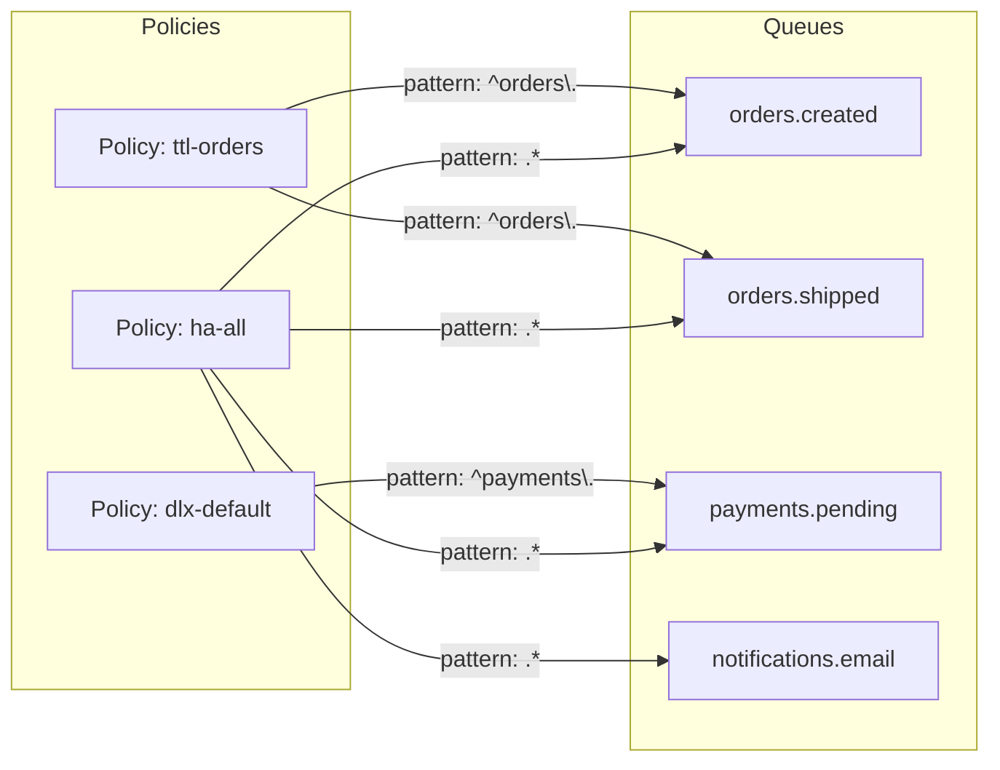
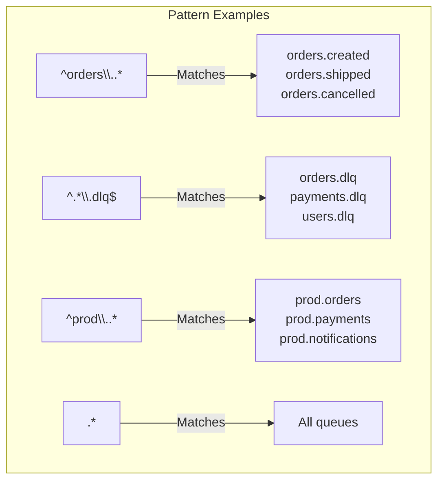
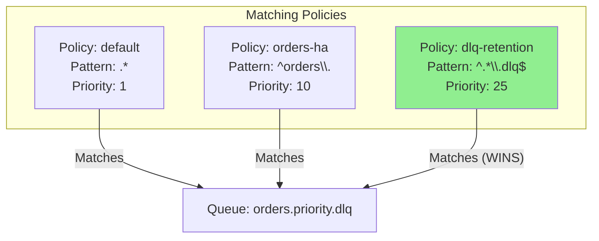
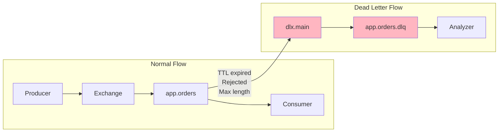

# How to Build RabbitMQ Policy Patterns

Author: [nawazdhandala](https://github.com/nawazdhandala)

Tags: RabbitMQ, Policies, Queue Management, Configuration

Description: Learn to implement RabbitMQ policies for queue configuration with pattern matching, priority, and apply-to settings for centralized management.

---

RabbitMQ policies provide a powerful way to configure queues, exchanges, and bindings without modifying application code. Instead of setting properties at declaration time, policies let you manage configurations centrally and change them on the fly.

## What Are RabbitMQ Policies?

Policies are rules that apply configuration parameters to queues and exchanges based on name patterns. They decouple queue behavior from application code, enabling operators to:

- Set message TTL, queue length limits, and dead-letter exchanges
- Configure high availability and mirroring
- Apply changes without restarting applications or recreating queues



## Policy Definition Structure

A policy consists of five key components:

| Component | Description |
|-----------|-------------|
| Name | Unique identifier for the policy |
| Pattern | Regex pattern to match queue/exchange names |
| Apply-to | Target type: queues, exchanges, or all |
| Definition | Key-value pairs of configuration parameters |
| Priority | Integer determining which policy wins on conflicts |

## Creating Policies via CLI

The `rabbitmqctl set_policy` command creates policies from the command line. The basic syntax follows this structure:

```bash
# Basic syntax
rabbitmqctl set_policy <name> <pattern> <definition> [--priority <n>] [--apply-to <type>]
```

Here is a policy that sets a 24-hour TTL on all queues matching the pattern `^temp\.`:

```bash
# Create a TTL policy for temporary queues
# - Name: ttl-temp
# - Pattern: ^temp\. (matches queues starting with "temp.")
# - Definition: message-ttl of 86400000 ms (24 hours)
# - Apply-to: queues only
rabbitmqctl set_policy ttl-temp \
    "^temp\." \
    '{"message-ttl": 86400000}' \
    --priority 10 \
    --apply-to queues
```

## Pattern Matching Strategies

Patterns use Erlang regular expressions. Design patterns that group queues logically by service, environment, or behavior.



Common pattern strategies:

```bash
# Service-based patterns
# Match all queues for the payments service
rabbitmqctl set_policy payments-ha \
    "^payments\\." \
    '{"ha-mode": "all", "ha-sync-mode": "automatic"}' \
    --priority 20 \
    --apply-to queues

# Environment-based patterns
# Match all production queues
rabbitmqctl set_policy prod-limits \
    "^prod\\." \
    '{"max-length": 100000, "overflow": "reject-publish"}' \
    --priority 15 \
    --apply-to queues

# Suffix-based patterns for dead-letter queues
# Match all queues ending in .dlq
rabbitmqctl set_policy dlq-retention \
    "^.*\\.dlq$" \
    '{"message-ttl": 604800000}' \
    --priority 25 \
    --apply-to queues
```

## Priority and Policy Conflicts

When multiple policies match a queue, the one with the highest priority wins. Use priority strategically to create layered configurations.



Example of layered policies:

```bash
# Layer 1: Base policy for all queues (lowest priority)
# Sets default dead-letter exchange and message TTL
rabbitmqctl set_policy default-settings \
    ".*" \
    '{"dead-letter-exchange": "dlx.default", "message-ttl": 3600000}' \
    --priority 1 \
    --apply-to queues

# Layer 2: Service-specific overrides (medium priority)
# Orders service needs higher availability
rabbitmqctl set_policy orders-ha \
    "^orders\\." \
    '{"ha-mode": "exactly", "ha-params": 2, "queue-mode": "lazy"}' \
    --priority 10 \
    --apply-to queues

# Layer 3: Critical queue overrides (highest priority)
# Payment queues need strictest settings
rabbitmqctl set_policy payments-critical \
    "^payments\\.critical\\." \
    '{"ha-mode": "all", "ha-sync-mode": "automatic", "max-length": 50000}' \
    --priority 50 \
    --apply-to queues
```

## Common Policy Configurations

### High Availability (Mirroring)

Classic mirrored queues replicate messages across nodes. Note that quorum queues are preferred for new deployments, but mirrored queues remain common in existing systems.

```bash
# Mirror queues to all nodes
# ha-mode: all - replicate to every cluster node
# ha-sync-mode: automatic - sync new mirrors immediately
rabbitmqctl set_policy ha-all \
    "^ha\\." \
    '{"ha-mode": "all", "ha-sync-mode": "automatic"}' \
    --priority 20 \
    --apply-to queues

# Mirror to exactly 2 nodes (primary + 1 replica)
# More efficient for large clusters
rabbitmqctl set_policy ha-two \
    "^critical\\." \
    '{"ha-mode": "exactly", "ha-params": 2, "ha-sync-mode": "automatic"}' \
    --priority 20 \
    --apply-to queues
```

### Message TTL and Queue Limits

Control message lifetime and queue size to prevent unbounded growth:

```bash
# Set message TTL to 1 hour and max queue length to 10000
# overflow: reject-publish - refuse new messages when full
rabbitmqctl set_policy bounded-queues \
    "^bounded\\." \
    '{"message-ttl": 3600000, "max-length": 10000, "overflow": "reject-publish"}' \
    --priority 15 \
    --apply-to queues

# Alternative overflow strategy: drop oldest messages
rabbitmqctl set_policy rotating-buffer \
    "^buffer\\." \
    '{"max-length": 1000, "overflow": "drop-head"}' \
    --priority 15 \
    --apply-to queues
```

### Dead Letter Exchanges

Route expired or rejected messages to a dead-letter exchange for analysis:

```bash
# Configure dead-letter routing
# dead-letter-exchange: where rejected/expired messages go
# dead-letter-routing-key: optional routing key override
rabbitmqctl set_policy dlx-setup \
    "^app\\." \
    '{"dead-letter-exchange": "dlx.main", "dead-letter-routing-key": "failed"}' \
    --priority 10 \
    --apply-to queues
```



### Lazy Queues

Lazy queues store messages on disk rather than memory, suitable for large queues:

```bash
# Enable lazy mode for archive queues
# Messages written to disk immediately, reducing memory pressure
rabbitmqctl set_policy lazy-archives \
    "^archive\\." \
    '{"queue-mode": "lazy"}' \
    --priority 10 \
    --apply-to queues
```

## Managing Policies via HTTP API

For automation and infrastructure-as-code, use the HTTP API:

```bash
# Create a policy via HTTP API
curl -u admin:password -X PUT \
    -H "Content-Type: application/json" \
    -d '{
        "pattern": "^orders\\.",
        "definition": {
            "ha-mode": "exactly",
            "ha-params": 2,
            "message-ttl": 86400000
        },
        "priority": 10,
        "apply-to": "queues"
    }' \
    "http://localhost:15672/api/policies/%2F/orders-policy"
```

List all policies:

```bash
# Get all policies in the default vhost
curl -u admin:password "http://localhost:15672/api/policies/%2F"
```

Delete a policy:

```bash
# Remove a policy by name
curl -u admin:password -X DELETE \
    "http://localhost:15672/api/policies/%2F/orders-policy"
```

## Policy Definition Reference

Common policy parameters and their purposes:

| Parameter | Type | Description |
|-----------|------|-------------|
| `message-ttl` | Integer | Message lifetime in milliseconds |
| `max-length` | Integer | Maximum number of messages |
| `max-length-bytes` | Integer | Maximum queue size in bytes |
| `overflow` | String | Action when limit reached: `drop-head`, `reject-publish`, `reject-publish-dlx` |
| `dead-letter-exchange` | String | Exchange for dead-lettered messages |
| `dead-letter-routing-key` | String | Routing key for dead-lettered messages |
| `ha-mode` | String | Mirroring mode: `all`, `exactly`, `nodes` |
| `ha-params` | Integer/List | Parameter for ha-mode (count or node list) |
| `ha-sync-mode` | String | Sync mode: `manual` or `automatic` |
| `queue-mode` | String | Queue mode: `default` or `lazy` |
| `expires` | Integer | Queue auto-delete after idle time (ms) |

## Infrastructure as Code Example

Define policies in a configuration file for version control:

`rabbitmq-policies.json`

```json
{
  "policies": [
    {
      "name": "default-dlx",
      "pattern": "^app\\.",
      "apply-to": "queues",
      "priority": 1,
      "definition": {
        "dead-letter-exchange": "dlx.default",
        "message-ttl": 7200000
      }
    },
    {
      "name": "orders-ha",
      "pattern": "^app\\.orders\\.",
      "apply-to": "queues",
      "priority": 10,
      "definition": {
        "ha-mode": "exactly",
        "ha-params": 2,
        "ha-sync-mode": "automatic",
        "max-length": 100000,
        "overflow": "reject-publish"
      }
    },
    {
      "name": "dlq-retention",
      "pattern": "^.*\\.dlq$",
      "apply-to": "queues",
      "priority": 50,
      "definition": {
        "message-ttl": 604800000,
        "queue-mode": "lazy"
      }
    }
  ]
}
```

Apply policies from the file:

```bash
#!/bin/bash
# apply-policies.sh - Apply RabbitMQ policies from JSON config

RABBITMQ_HOST="${RABBITMQ_HOST:-localhost}"
RABBITMQ_USER="${RABBITMQ_USER:-admin}"
RABBITMQ_PASS="${RABBITMQ_PASS:-password}"
VHOST="${VHOST:-%2F}"

# Read policies from JSON file and apply each one
jq -c '.policies[]' rabbitmq-policies.json | while read -r policy; do
    name=$(echo "$policy" | jq -r '.name')
    pattern=$(echo "$policy" | jq -r '.pattern')
    apply_to=$(echo "$policy" | jq -r '.["apply-to"]')
    priority=$(echo "$policy" | jq -r '.priority')
    definition=$(echo "$policy" | jq -c '.definition')

    echo "Applying policy: $name"

    curl -s -u "$RABBITMQ_USER:$RABBITMQ_PASS" -X PUT \
        -H "Content-Type: application/json" \
        -d "{
            \"pattern\": \"$pattern\",
            \"definition\": $definition,
            \"priority\": $priority,
            \"apply-to\": \"$apply_to\"
        }" \
        "http://$RABBITMQ_HOST:15672/api/policies/$VHOST/$name"

    echo " - Done"
done
```

## Verifying Policy Application

After creating policies, verify they are applied correctly:

```bash
# List all policies
rabbitmqctl list_policies

# Check which policy applies to a specific queue
rabbitmqctl list_queues name policy

# Detailed queue info including effective policy
rabbitmqctl list_queues name policy arguments durable auto_delete
```

Example output:

```
Listing policies for vhost "/" ...
name            pattern         apply-to    definition                                  priority
default-dlx     ^app\.          queues      {"dead-letter-exchange":"dlx.default"}      1
orders-ha       ^app\.orders\.  queues      {"ha-mode":"exactly","ha-params":2}         10
dlq-retention   ^.*\.dlq$       queues      {"message-ttl":604800000}                   50
```

## Best Practices

1. **Use meaningful naming conventions** - Name policies by function (e.g., `ha-critical`, `ttl-temp`) rather than arbitrary identifiers.

2. **Document pattern intentions** - Patterns like `^orders\.` are clear, but `^[a-z]+\.[0-9]+\.` needs documentation.

3. **Layer policies by priority** - Use low priority (1-10) for defaults, medium (11-30) for service-specific, high (31+) for critical overrides.

4. **Test patterns before applying** - Verify regex patterns match intended queues using `rabbitmqctl list_queues` and grep.

5. **Version control policy configurations** - Store policy definitions in JSON/YAML files alongside application code.

6. **Monitor policy effectiveness** - Track queue metrics to ensure policies achieve desired behavior (message counts, memory usage, consumer rates).

---

RabbitMQ policies provide centralized, declarative control over queue behavior. By combining pattern matching with priority-based layering, you can build flexible configurations that adapt to different services, environments, and requirements - all without touching application code.
