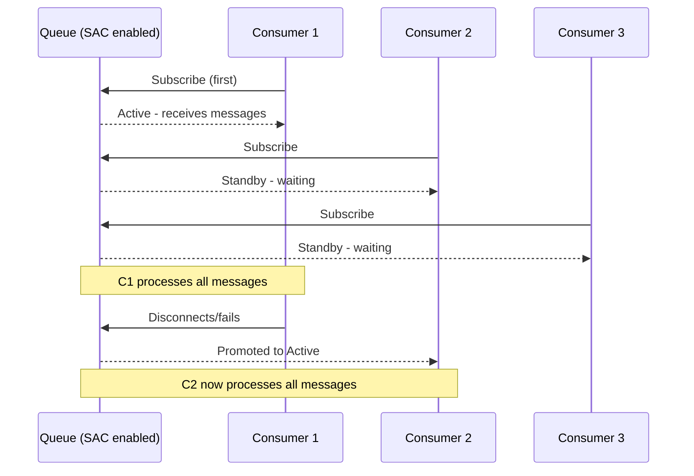
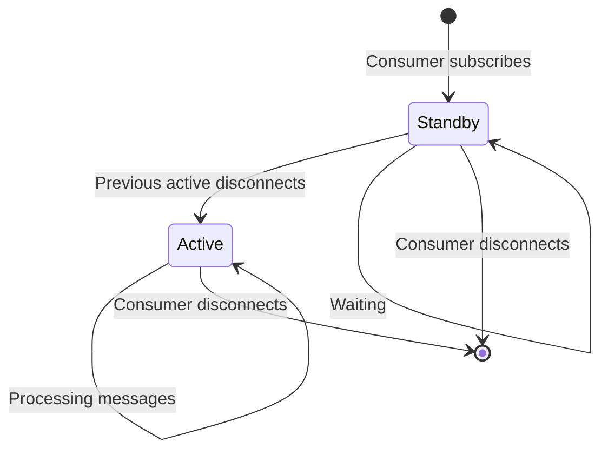
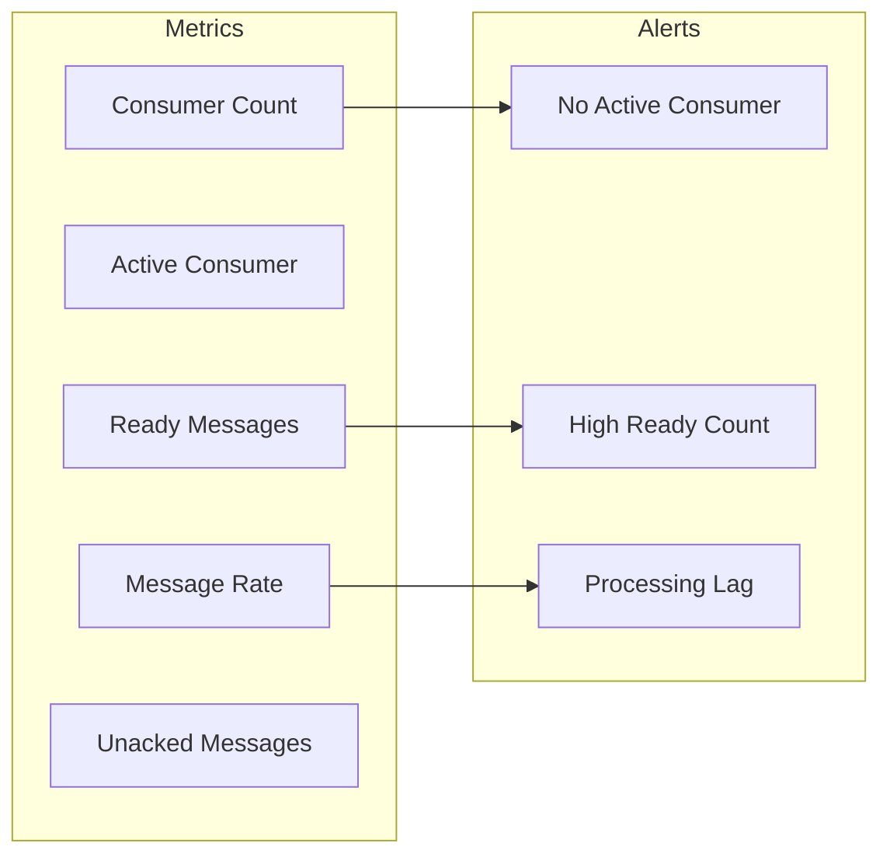
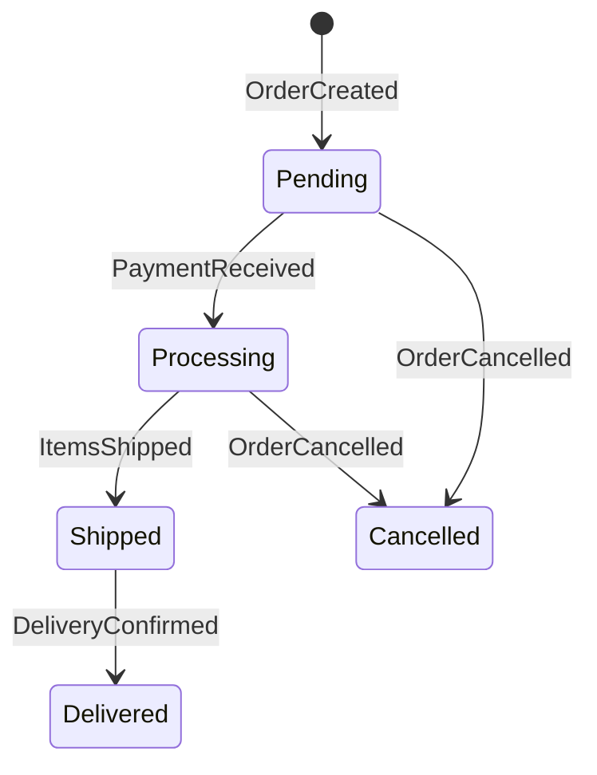

# How to Build RabbitMQ Single Active Consumer

Author: [nawazdhandala](https://github.com/nawazdhandala)

Tags: RabbitMQ, Single Active Consumer, Ordering, Failover

Description: Learn to implement RabbitMQ single active consumer for ordered message processing with automatic failover and consumer coordination.

---

Message ordering is critical for many applications - financial transactions, event sourcing, state machines, and audit logs all require messages to be processed in sequence. RabbitMQ's Single Active Consumer (SAC) feature ensures exactly one consumer processes messages from a queue at any time, preserving order while providing automatic failover.

## Why Single Active Consumer?

| Scenario | Standard Consumers | Single Active Consumer |
|----------|-------------------|------------------------|
| **Message Order** | Lost across consumers | Preserved |
| **Failover** | Manual coordination | Automatic |
| **Scaling** | Horizontal | Vertical (active) + standby |
| **Use Case** | High throughput | Ordered processing |

Standard competing consumers distribute messages across all consumers, breaking ordering guarantees. Single Active Consumer designates one consumer as active while others wait in standby, ready to take over if the active consumer fails.

---

## How Single Active Consumer Works

The SAC mechanism works through consumer registration and activation:



Key behaviors:

1. **First consumer becomes active** - Receives all messages from the queue
2. **Subsequent consumers enter standby** - No messages delivered until promotion
3. **Automatic failover** - Next consumer in line becomes active when current active disconnects
4. **Consumer ordering** - Consumers are activated in the order they subscribed

---

## Enabling Single Active Consumer

SAC is configured at the queue level using the `x-single-active-consumer` argument.

### Queue Declaration (Node.js with amqplib)

```javascript
const amqp = require('amqplib');

async function setupSACQueue() {
  const connection = await amqp.connect('amqp://localhost');
  const channel = await connection.createChannel();

  // Declare queue with Single Active Consumer enabled
  await channel.assertQueue('orders.process', {
    durable: true,
    arguments: {
      'x-single-active-consumer': true,  // Enable SAC
    },
  });

  console.log('SAC queue created: orders.process');
  return { connection, channel };
}
```

### Queue Declaration (Python with pika)

```python
import pika

def setup_sac_queue():
    connection = pika.BlockingConnection(
        pika.ConnectionParameters('localhost')
    )
    channel = connection.channel()

    # Declare queue with Single Active Consumer enabled
    channel.queue_declare(
        queue='orders.process',
        durable=True,
        arguments={
            'x-single-active-consumer': True
        }
    )

    print('SAC queue created: orders.process')
    return connection, channel
```

### Using RabbitMQ Management CLI

```bash
# Create SAC queue via CLI
rabbitmqadmin declare queue name=orders.process durable=true \
  arguments='{"x-single-active-consumer": true}'

# Verify queue configuration
rabbitmqctl list_queues name arguments
```

---

## Consumer Implementation

### Basic Consumer (Node.js)

This consumer connects to the SAC queue and processes messages. Multiple instances can run simultaneously - only one will be active.

```javascript
const amqp = require('amqplib');

class OrderConsumer {
  constructor(consumerId) {
    this.consumerId = consumerId;
    this.connection = null;
    this.channel = null;
    this.isActive = false;
  }

  async connect() {
    this.connection = await amqp.connect('amqp://localhost');
    this.channel = await this.connection.createChannel();

    // Prefetch 1 message at a time for ordered processing
    await this.channel.prefetch(1);

    // Ensure queue exists with SAC enabled
    await this.channel.assertQueue('orders.process', {
      durable: true,
      arguments: {
        'x-single-active-consumer': true,
      },
    });

    console.log(`[${this.consumerId}] Connected, waiting for activation...`);
  }

  async startConsuming() {
    await this.channel.consume(
      'orders.process',
      async (msg) => {
        if (!this.isActive) {
          this.isActive = true;
          console.log(`[${this.consumerId}] Activated - now processing messages`);
        }

        await this.processMessage(msg);
      },
      {
        noAck: false,  // Manual acknowledgment for reliability
        consumerTag: this.consumerId,
      }
    );
  }

  async processMessage(msg) {
    const order = JSON.parse(msg.content.toString());
    console.log(`[${this.consumerId}] Processing order: ${order.id}`);

    try {
      // Simulate order processing
      await this.handleOrder(order);

      // Acknowledge successful processing
      this.channel.ack(msg);
      console.log(`[${this.consumerId}] Order ${order.id} completed`);
    } catch (error) {
      console.error(`[${this.consumerId}] Order ${order.id} failed:`, error.message);

      // Reject and requeue for retry
      this.channel.nack(msg, false, true);
    }
  }

  async handleOrder(order) {
    // Your business logic here
    await new Promise(resolve => setTimeout(resolve, 100));
  }

  async shutdown() {
    console.log(`[${this.consumerId}] Shutting down...`);
    await this.channel?.close();
    await this.connection?.close();
  }
}

// Usage - run multiple instances
async function main() {
  const consumerId = process.env.CONSUMER_ID || `consumer-${process.pid}`;
  const consumer = new OrderConsumer(consumerId);

  await consumer.connect();
  await consumer.startConsuming();

  // Graceful shutdown
  process.on('SIGINT', async () => {
    await consumer.shutdown();
    process.exit(0);
  });
}

main().catch(console.error);
```

### Consumer with Health Monitoring (Python)

```python
import pika
import json
import signal
import sys
from datetime import datetime

class OrderConsumer:
    def __init__(self, consumer_id):
        self.consumer_id = consumer_id
        self.connection = None
        self.channel = None
        self.is_active = False
        self.messages_processed = 0
        self.last_message_time = None

    def connect(self):
        self.connection = pika.BlockingConnection(
            pika.ConnectionParameters(
                host='localhost',
                heartbeat=30,  # Keep connection alive
                blocked_connection_timeout=300
            )
        )
        self.channel = self.connection.channel()

        # Prefetch 1 for ordered processing
        self.channel.basic_qos(prefetch_count=1)

        # Ensure queue exists with SAC
        self.channel.queue_declare(
            queue='orders.process',
            durable=True,
            arguments={'x-single-active-consumer': True}
        )

        print(f'[{self.consumer_id}] Connected, waiting for activation...')

    def start_consuming(self):
        self.channel.basic_consume(
            queue='orders.process',
            on_message_callback=self.process_message,
            consumer_tag=self.consumer_id
        )

        print(f'[{self.consumer_id}] Consuming started')
        self.channel.start_consuming()

    def process_message(self, channel, method, properties, body):
        if not self.is_active:
            self.is_active = True
            print(f'[{self.consumer_id}] Activated - now processing messages')

        order = json.loads(body)
        print(f'[{self.consumer_id}] Processing order: {order["id"]}')

        try:
            self.handle_order(order)
            channel.basic_ack(delivery_tag=method.delivery_tag)

            self.messages_processed += 1
            self.last_message_time = datetime.now()

            print(f'[{self.consumer_id}] Order {order["id"]} completed')
        except Exception as e:
            print(f'[{self.consumer_id}] Order {order["id"]} failed: {e}')
            channel.basic_nack(
                delivery_tag=method.delivery_tag,
                requeue=True
            )

    def handle_order(self, order):
        # Your business logic here
        import time
        time.sleep(0.1)

    def get_status(self):
        return {
            'consumer_id': self.consumer_id,
            'is_active': self.is_active,
            'messages_processed': self.messages_processed,
            'last_message_time': str(self.last_message_time)
        }

    def shutdown(self):
        print(f'[{self.consumer_id}] Shutting down...')
        if self.channel:
            self.channel.stop_consuming()
        if self.connection:
            self.connection.close()

# Usage
if __name__ == '__main__':
    import os
    consumer_id = os.environ.get('CONSUMER_ID', f'consumer-{os.getpid()}')
    consumer = OrderConsumer(consumer_id)

    def signal_handler(sig, frame):
        consumer.shutdown()
        sys.exit(0)

    signal.signal(signal.SIGINT, signal_handler)
    signal.signal(signal.SIGTERM, signal_handler)

    consumer.connect()
    consumer.start_consuming()
```

---

## Failover Behavior

Understanding failover is critical for building reliable SAC systems.



### Failover Scenarios

| Scenario | Behavior | Message Safety |
|----------|----------|----------------|
| **Graceful shutdown** | Active finishes current message, standby promoted | Safe |
| **Connection drop** | RabbitMQ detects via heartbeat, promotes standby | Unacked messages requeued |
| **Consumer crash** | Same as connection drop | Unacked messages requeued |
| **Channel close** | Standby promoted immediately | Unacked messages requeued |

### Testing Failover

```javascript
// Producer for testing
async function produceTestMessages() {
  const connection = await amqp.connect('amqp://localhost');
  const channel = await connection.createChannel();

  await channel.assertQueue('orders.process', {
    durable: true,
    arguments: { 'x-single-active-consumer': true },
  });

  // Produce messages continuously
  let orderId = 1;
  setInterval(() => {
    const order = {
      id: orderId++,
      product: 'widget',
      quantity: Math.floor(Math.random() * 10) + 1,
      timestamp: new Date().toISOString(),
    };

    channel.sendToQueue(
      'orders.process',
      Buffer.from(JSON.stringify(order)),
      { persistent: true }
    );

    console.log(`Produced order: ${order.id}`);
  }, 1000);
}
```

Run this test scenario:

1. Start the producer
2. Start Consumer 1 - becomes active
3. Start Consumer 2 - enters standby
4. Kill Consumer 1
5. Consumer 2 becomes active immediately
6. Verify no messages were lost or duplicated

---

## Consumer Priority

While SAC promotes consumers in subscription order by default, you can influence priority using consumer arguments.

### Priority-Based Consumers (Node.js)

```javascript
async function createPriorityConsumer(consumerId, priority) {
  const connection = await amqp.connect('amqp://localhost');
  const channel = await connection.createChannel();

  await channel.assertQueue('orders.process', {
    durable: true,
    arguments: { 'x-single-active-consumer': true },
  });

  await channel.prefetch(1);

  // Higher priority consumers are activated first
  await channel.consume(
    'orders.process',
    (msg) => processMessage(consumerId, msg, channel),
    {
      noAck: false,
      consumerTag: consumerId,
      arguments: {
        'x-priority': priority,  // Consumer priority (higher = preferred)
      },
    }
  );

  console.log(`[${consumerId}] Started with priority ${priority}`);
}

// Primary consumer (high priority)
createPriorityConsumer('primary-consumer', 10);

// Backup consumer (low priority)
createPriorityConsumer('backup-consumer', 1);
```

---

## Handling Redelivered Messages

When failover occurs, unacknowledged messages are redelivered to the new active consumer. Your consumer must handle redeliveries correctly.

```javascript
async processMessage(msg) {
  const order = JSON.parse(msg.content.toString());
  const isRedelivery = msg.fields.redelivered;

  if (isRedelivery) {
    console.log(`[${this.consumerId}] Redelivered message: ${order.id}`);

    // Check if already processed (idempotency check)
    if (await this.isAlreadyProcessed(order.id)) {
      console.log(`[${this.consumerId}] Order ${order.id} already processed, acknowledging`);
      this.channel.ack(msg);
      return;
    }
  }

  try {
    await this.handleOrder(order);
    await this.markAsProcessed(order.id);
    this.channel.ack(msg);
  } catch (error) {
    // Handle based on retry count
    const retryCount = (msg.properties.headers?.['x-retry-count'] || 0) + 1;

    if (retryCount >= 3) {
      console.error(`[${this.consumerId}] Order ${order.id} failed permanently`);
      // Send to dead letter queue
      this.channel.reject(msg, false);
    } else {
      // Republish with retry count
      this.channel.publish('', 'orders.process', msg.content, {
        persistent: true,
        headers: { 'x-retry-count': retryCount },
      });
      this.channel.ack(msg);
    }
  }
}

async isAlreadyProcessed(orderId) {
  // Check database/cache for processed order
  // Return true if found
  return false;
}

async markAsProcessed(orderId) {
  // Store processed order ID in database/cache
}
```

---

## Monitoring Single Active Consumer

### Queue Metrics to Track



### RabbitMQ Management API Queries

```bash
# Get queue info including active consumer
curl -u guest:guest \
  http://localhost:15672/api/queues/%2F/orders.process

# Get consumer details
curl -u guest:guest \
  http://localhost:15672/api/consumers
```

### Prometheus Metrics (Node.js)

```javascript
const promClient = require('prom-client');

// Custom metrics for SAC monitoring
const consumerActive = new promClient.Gauge({
  name: 'rabbitmq_sac_consumer_active',
  help: 'Whether this consumer is the active consumer',
  labelNames: ['consumer_id', 'queue'],
});

const messagesProcessed = new promClient.Counter({
  name: 'rabbitmq_sac_messages_processed_total',
  help: 'Total messages processed by this consumer',
  labelNames: ['consumer_id', 'queue', 'status'],
});

const processingDuration = new promClient.Histogram({
  name: 'rabbitmq_sac_processing_duration_seconds',
  help: 'Message processing duration',
  labelNames: ['consumer_id', 'queue'],
  buckets: [0.01, 0.05, 0.1, 0.5, 1, 5],
});

class MonitoredConsumer extends OrderConsumer {
  async processMessage(msg) {
    const startTime = Date.now();

    try {
      await super.processMessage(msg);

      messagesProcessed.inc({
        consumer_id: this.consumerId,
        queue: 'orders.process',
        status: 'success',
      });
    } catch (error) {
      messagesProcessed.inc({
        consumer_id: this.consumerId,
        queue: 'orders.process',
        status: 'error',
      });
      throw error;
    } finally {
      processingDuration.observe(
        { consumer_id: this.consumerId, queue: 'orders.process' },
        (Date.now() - startTime) / 1000
      );
    }
  }

  updateActiveStatus(isActive) {
    this.isActive = isActive;
    consumerActive.set(
      { consumer_id: this.consumerId, queue: 'orders.process' },
      isActive ? 1 : 0
    );
  }
}
```

### Alerting Rules

```yaml
# Prometheus alerting rules for SAC
groups:
  - name: rabbitmq_sac
    rules:
      - alert: NoActiveConsumer
        expr: sum(rabbitmq_sac_consumer_active) == 0
        for: 1m
        labels:
          severity: critical
        annotations:
          summary: "No active consumer for SAC queue"

      - alert: HighMessageBacklog
        expr: rabbitmq_queue_messages_ready{queue="orders.process"} > 1000
        for: 5m
        labels:
          severity: warning
        annotations:
          summary: "Message backlog growing on SAC queue"

      - alert: SlowProcessing
        expr: |
          histogram_quantile(0.95,
            rate(rabbitmq_sac_processing_duration_seconds_bucket[5m])
          ) > 1
        for: 5m
        labels:
          severity: warning
        annotations:
          summary: "P95 processing time exceeds 1 second"
```

---

## Use Cases for Single Active Consumer

### 1. Event Sourcing

Events must be applied in order to rebuild state correctly.

```javascript
class EventSourcedConsumer {
  async processEvent(event) {
    // Events must be processed in sequence
    switch (event.type) {
      case 'OrderCreated':
        await this.createOrder(event.data);
        break;
      case 'OrderUpdated':
        await this.updateOrder(event.data);
        break;
      case 'OrderCancelled':
        await this.cancelOrder(event.data);
        break;
    }

    // Update event sequence number
    await this.updateSequence(event.sequenceNumber);
  }
}
```

### 2. Financial Transactions

Account balances require sequential processing to prevent race conditions.

```javascript
class TransactionConsumer {
  async processTransaction(transaction) {
    // Must process in order to maintain correct balance
    const account = await this.getAccount(transaction.accountId);

    if (transaction.type === 'credit') {
      account.balance += transaction.amount;
    } else {
      if (account.balance < transaction.amount) {
        throw new Error('Insufficient funds');
      }
      account.balance -= transaction.amount;
    }

    await this.saveAccount(account);
    await this.recordTransaction(transaction);
  }
}
```

### 3. State Machine Transitions

State machines require ordered events to transition correctly.



```javascript
class StateMachineConsumer {
  async processStateTransition(event) {
    const order = await this.getOrder(event.orderId);

    // Validate transition is allowed
    if (!this.isValidTransition(order.state, event.newState)) {
      throw new Error(`Invalid transition: ${order.state} -> ${event.newState}`);
    }

    order.state = event.newState;
    order.history.push({
      from: order.state,
      to: event.newState,
      timestamp: event.timestamp,
    });

    await this.saveOrder(order);
  }
}
```

---

## Limitations and Considerations

| Consideration | Impact | Mitigation |
|---------------|--------|------------|
| **Single point of processing** | Throughput limited to one consumer | Partition data across multiple SAC queues |
| **Failover delay** | Brief pause during consumer switch | Keep heartbeat intervals low |
| **No load balancing** | Cannot distribute load | Use SAC only where ordering is required |
| **Consumer ordering** | First subscriber becomes active | Use priority arguments if needed |

### When NOT to Use SAC

- High-throughput scenarios where ordering is not required
- Stateless message processing
- Fan-out patterns where multiple consumers need the same message
- When messages can be processed independently

---

## Best Practices

1. **Set prefetch to 1** - Ensures one message at a time for proper ordering
2. **Use manual acknowledgment** - Prevents message loss during failover
3. **Implement idempotency** - Handles redelivered messages correctly
4. **Monitor consumer status** - Alert when no active consumer exists
5. **Keep heartbeat intervals low** - Faster failover detection (15-30 seconds)
6. **Use durable queues** - Messages survive broker restarts
7. **Implement graceful shutdown** - Finish current message before stopping

---

## Summary

| Feature | Single Active Consumer Provides |
|---------|-------------------------------|
| **Message Ordering** | Guaranteed within the queue |
| **Automatic Failover** | Standby consumers promoted automatically |
| **Consumer Coordination** | Built into RabbitMQ, no external coordination needed |
| **Simplicity** | Single queue argument enables the feature |

Single Active Consumer is ideal for scenarios requiring strict message ordering with automatic failover. While it trades horizontal scaling for ordering guarantees, the built-in failover mechanism makes it simpler to operate than custom coordination solutions. Use it for event sourcing, financial transactions, and state machines where processing order matters.

---

*Need to monitor your RabbitMQ queues and consumer health? [OneUptime](https://oneuptime.com) provides infrastructure monitoring with alerts, metrics, and dashboards to keep your message processing reliable.*
