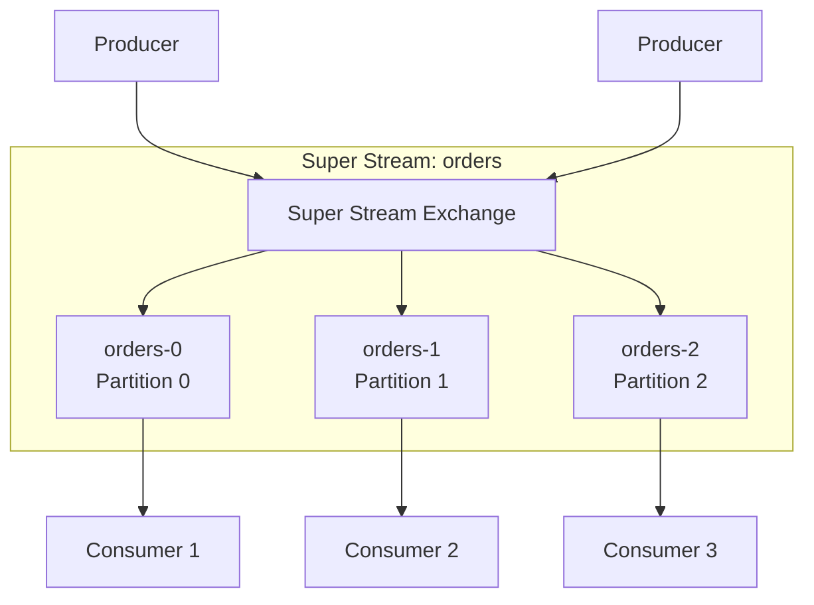
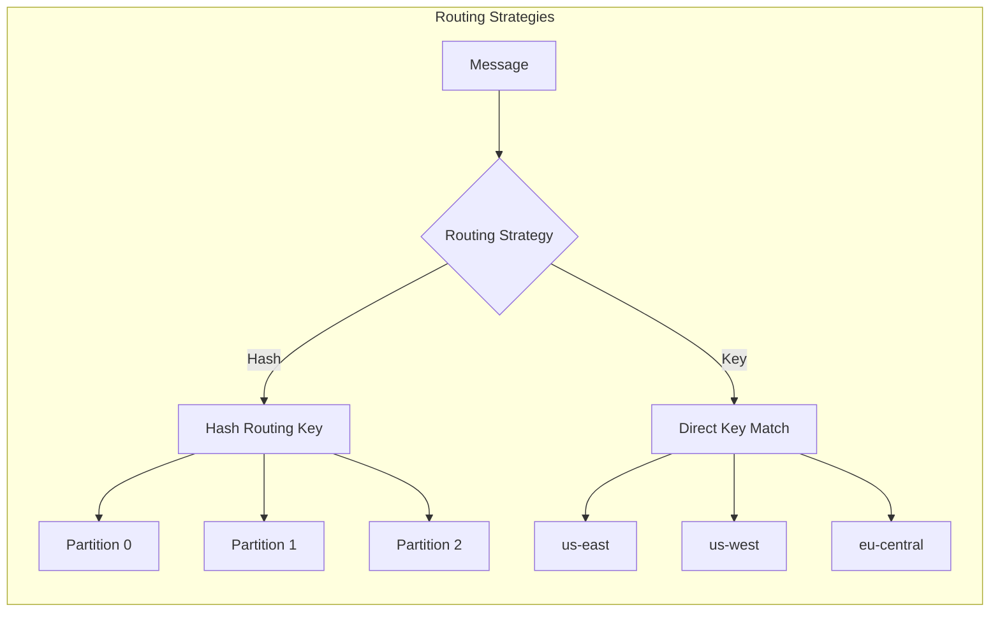
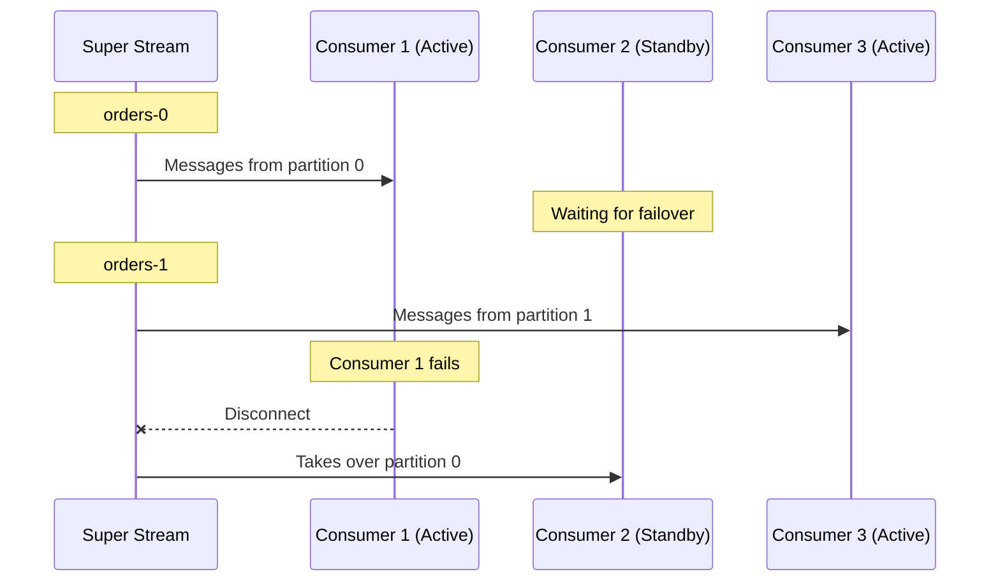
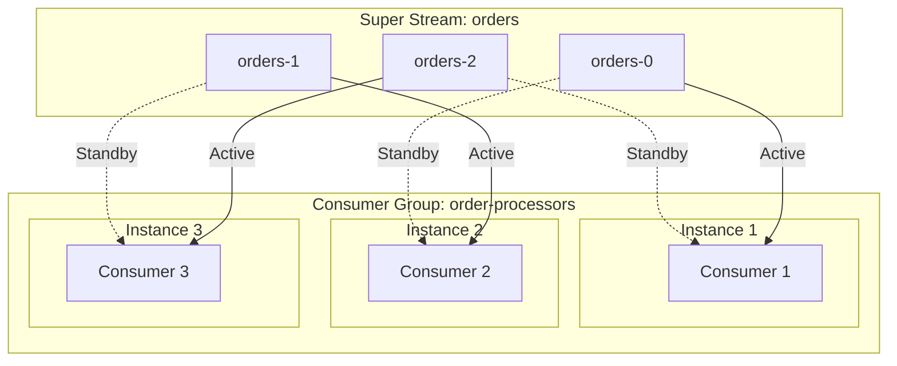
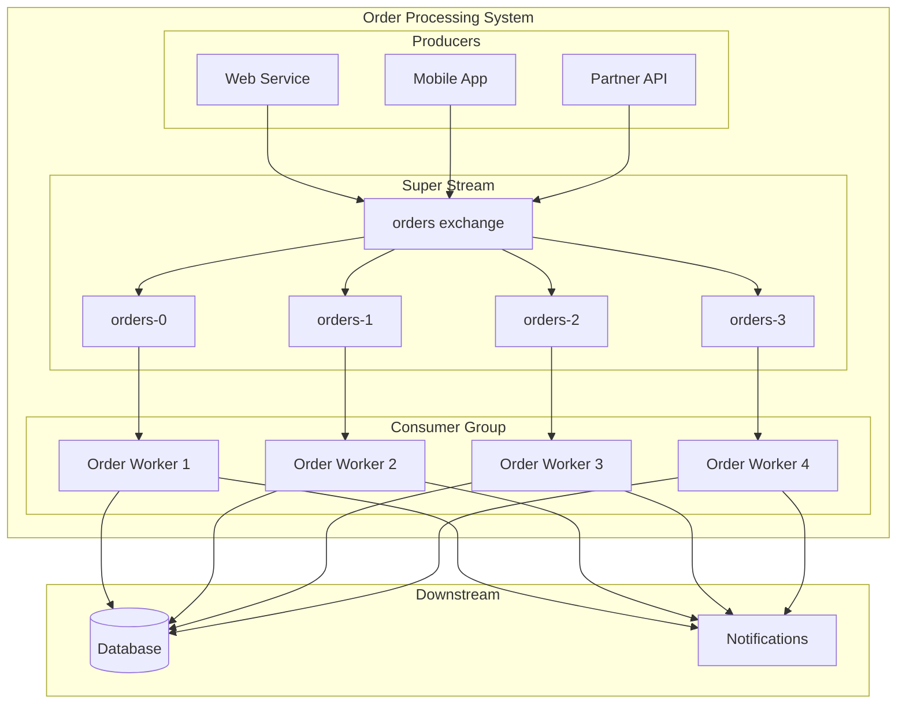

# How to Create RabbitMQ Super Streams

Author: [nawazdhandala](https://github.com/nawazdhandala)

Tags: RabbitMQ, Super Streams, Streaming, Scalability

Description: Learn to implement RabbitMQ super streams for partitioned streaming with routing strategies, consumer groups, and partition management.

---

## Introduction

RabbitMQ Super Streams provide a way to scale stream processing by partitioning data across multiple individual streams. This approach allows you to achieve higher throughput and parallel processing while maintaining message ordering within partitions. Super streams are essentially a logical grouping of regular streams that act as partitions, making them ideal for high-volume streaming applications.

## What Are Super Streams?

A super stream is a partitioned stream made up of multiple individual RabbitMQ streams. Think of it as a single logical stream that is divided into several partitions, where each partition is a regular RabbitMQ stream.



### Key Benefits

- **Horizontal Scalability**: Distribute load across multiple partitions
- **Parallel Processing**: Multiple consumers can process partitions concurrently
- **Ordering Guarantees**: Messages with the same routing key go to the same partition
- **Fault Tolerance**: Individual partition failures do not affect others

## Creating Super Streams

### Using the RabbitMQ CLI

The simplest way to create a super stream is using the `rabbitmq-streams` CLI tool:

```bash
# Create a super stream with 3 partitions
rabbitmq-streams add_super_stream orders --partitions 3

# Verify the super stream was created
rabbitmq-streams list_super_streams
```

This command creates:
- A super stream exchange named `orders`
- Three partitions: `orders-0`, `orders-1`, `orders-2`
- Bindings from the exchange to each partition

### Using the Management HTTP API

You can also create super streams programmatically via the HTTP API:

```bash
curl -u guest:guest -X PUT \
  http://localhost:15672/api/stream/super-streams/orders \
  -H "Content-Type: application/json" \
  -d '{
    "partitions": 5,
    "arguments": {
      "x-max-length-bytes": 5000000000,
      "x-stream-max-segment-size-bytes": 500000000
    }
  }'
```

### Using Named Partitions

Instead of numbered partitions, you can specify custom partition names based on your business logic:

```bash
rabbitmq-streams add_super_stream events \
  --routing-keys "us-east,us-west,eu-central,ap-south"
```

This creates partitions named:
- `events-us-east`
- `events-us-west`
- `events-eu-central`
- `events-ap-south`

## Routing Strategies

Super streams support different routing strategies to determine which partition receives a message.



### Hash-Based Routing

Hash-based routing uses a hash function on the routing key to determine the partition. This ensures messages with the same routing key always go to the same partition.

```java
import com.rabbitmq.stream.*;

public class SuperStreamProducer {
    public static void main(String[] args) throws Exception {
        Environment environment = Environment.builder()
            .host("localhost")
            .port(5552)
            .build();

        Producer producer = environment.producerBuilder()
            .superStream("orders")
            .routing(message -> message.getProperties().getCorrelationId())
            .producerBuilder()
            .build();

        // Messages with the same order ID go to the same partition
        for (int i = 0; i < 1000; i++) {
            String orderId = "order-" + (i % 100);
            Message message = producer.messageBuilder()
                .properties()
                    .correlationId(orderId)
                    .messageBuilder()
                .addData(("Order data for " + orderId).getBytes())
                .build();

            producer.send(message, confirmationStatus -> {
                if (confirmationStatus.isConfirmed()) {
                    System.out.println("Message confirmed");
                }
            });
        }

        producer.close();
        environment.close();
    }
}
```

### Key-Based Routing

When using named partitions, you can route directly to specific partitions:

```java
Producer producer = environment.producerBuilder()
    .superStream("events")
    .routing(message -> message.getApplicationProperties().get("region").toString())
    .key()  // Use key-based routing instead of hash
    .producerBuilder()
    .build();

// Route to specific region partition
Message message = producer.messageBuilder()
    .applicationProperties()
        .entry("region", "us-east")
        .messageBuilder()
    .addData("Event data".getBytes())
    .build();

producer.send(message, confirmationStatus -> {});
```

### Custom Routing Function

For complex routing logic, implement a custom routing function:

```java
Producer producer = environment.producerBuilder()
    .superStream("orders")
    .routing(message -> {
        // Custom logic to determine routing key
        String priority = message.getApplicationProperties()
            .get("priority").toString();
        String region = message.getApplicationProperties()
            .get("region").toString();
        return priority + "-" + region;
    })
    .producerBuilder()
    .build();
```

## Consumer Groups (Single Active Consumer)

Consumer groups ensure that only one consumer processes messages from each partition at a time, providing both parallel processing and failover capabilities.



### Setting Up Consumer Groups

```java
import com.rabbitmq.stream.*;

public class SuperStreamConsumer {
    public static void main(String[] args) throws Exception {
        Environment environment = Environment.builder()
            .host("localhost")
            .port(5552)
            .build();

        Consumer consumer = environment.consumerBuilder()
            .superStream("orders")
            .singleActiveConsumer()
            .name("order-processor-group")
            .consumerUpdateListener(context -> {
                // Called when partition assignment changes
                System.out.println("Partition assigned: " + context.stream());
                return OffsetSpecification.first();
            })
            .messageHandler((context, message) -> {
                String partition = context.stream();
                System.out.println("Processing message from " + partition +
                    ": " + new String(message.getBodyAsBinary()));
            })
            .build();

        System.out.println("Consumer started. Press Enter to exit.");
        System.in.read();

        consumer.close();
        environment.close();
    }
}
```

### Consumer Group Architecture



### Handling Partition Rebalancing

When consumers join or leave the group, partitions are rebalanced:

```java
Consumer consumer = environment.consumerBuilder()
    .superStream("orders")
    .singleActiveConsumer()
    .name("order-processor-group")
    .consumerUpdateListener(context -> {
        if (context.isActive()) {
            System.out.println("Now active on partition: " + context.stream());
            // Resume from last committed offset or start fresh
            return context.previousOffset()
                .map(offset -> OffsetSpecification.offset(offset + 1))
                .orElse(OffsetSpecification.first());
        } else {
            System.out.println("No longer active on partition: " + context.stream());
            return OffsetSpecification.none();
        }
    })
    .messageHandler((context, message) -> {
        processMessage(message);
        // Commit offset for recovery
        context.storeOffset();
    })
    .build();
```

## Partition Management

### Monitoring Partition Status

```bash
# List all streams in a super stream
rabbitmq-streams list_stream_consumers --super-stream orders

# Check partition sizes
rabbitmqctl list_queues name messages message_bytes \
  --formatter pretty_table | grep orders
```

### Adding Partitions

Currently, RabbitMQ does not support dynamically adding partitions to an existing super stream. You need to create a new super stream with more partitions and migrate:

```bash
# Create new super stream with more partitions
rabbitmq-streams add_super_stream orders_v2 --partitions 6

# Migrate data (application-level)
# Then update applications to use the new super stream
```

### Partition Retention Policies

Configure retention per partition:

```bash
# Set retention policy when creating
rabbitmq-streams add_super_stream logs \
  --partitions 3 \
  --max-length-bytes 10000000000 \
  --max-age PT24H

# Or via policy
rabbitmqctl set_policy logs-retention \
  "^logs-" \
  '{"max-age": "24h", "max-segment-size": "500mb"}' \
  --apply-to queues
```

## Complete Example: Order Processing System

Here is a complete example demonstrating super streams for an order processing system.



### Producer Implementation

```python
import pika
from pika.adapters.blocking_connection import BlockingChannel
import json
import hashlib

class OrderProducer:
    def __init__(self, host: str = 'localhost'):
        self.connection = pika.BlockingConnection(
            pika.ConnectionParameters(host=host)
        )
        self.channel: BlockingChannel = self.connection.channel()
        self.partitions = 4
        self.super_stream = 'orders'

    def _get_partition(self, routing_key: str) -> str:
        """Hash-based partition selection"""
        hash_value = int(hashlib.md5(routing_key.encode()).hexdigest(), 16)
        partition_index = hash_value % self.partitions
        return f"{self.super_stream}-{partition_index}"

    def publish_order(self, order: dict):
        """Publish order to appropriate partition based on customer ID"""
        routing_key = order['customer_id']
        partition = self._get_partition(routing_key)

        self.channel.basic_publish(
            exchange=self.super_stream,
            routing_key=routing_key,
            body=json.dumps(order),
            properties=pika.BasicProperties(
                delivery_mode=2,  # Persistent
                content_type='application/json'
            )
        )
        print(f"Published order {order['order_id']} to {partition}")

    def close(self):
        self.connection.close()


# Usage
producer = OrderProducer()

orders = [
    {"order_id": "ORD-001", "customer_id": "CUST-100", "amount": 150.00},
    {"order_id": "ORD-002", "customer_id": "CUST-200", "amount": 75.50},
    {"order_id": "ORD-003", "customer_id": "CUST-100", "amount": 200.00},  # Same customer
]

for order in orders:
    producer.publish_order(order)

producer.close()
```

### Consumer Implementation

```python
import pika
import json
import threading
import time

class OrderConsumer:
    def __init__(self, consumer_id: str, partitions: list, host: str = 'localhost'):
        self.consumer_id = consumer_id
        self.partitions = partitions
        self.host = host
        self.connection = None
        self.channel = None
        self.running = False

    def connect(self):
        self.connection = pika.BlockingConnection(
            pika.ConnectionParameters(host=self.host)
        )
        self.channel = self.connection.channel()

        # Declare consumer for each assigned partition
        for partition in self.partitions:
            self.channel.basic_consume(
                queue=partition,
                on_message_callback=self._process_order,
                auto_ack=False
            )

    def _process_order(self, channel, method, properties, body):
        """Process incoming order"""
        order = json.loads(body)
        partition = method.routing_key if method.routing_key else 'unknown'

        print(f"[{self.consumer_id}] Processing order {order['order_id']} "
              f"from partition {method.delivery_tag}")

        # Simulate processing
        time.sleep(0.1)

        # Process the order
        self._save_to_database(order)
        self._send_notification(order)

        # Acknowledge message
        channel.basic_ack(delivery_tag=method.delivery_tag)
        print(f"[{self.consumer_id}] Completed order {order['order_id']}")

    def _save_to_database(self, order: dict):
        """Save order to database"""
        pass  # Implementation here

    def _send_notification(self, order: dict):
        """Send order notification"""
        pass  # Implementation here

    def start(self):
        """Start consuming messages"""
        self.connect()
        self.running = True
        print(f"[{self.consumer_id}] Started consuming from {self.partitions}")
        self.channel.start_consuming()

    def stop(self):
        """Stop consuming messages"""
        self.running = False
        if self.channel:
            self.channel.stop_consuming()
        if self.connection:
            self.connection.close()


# Start multiple consumers for different partitions
consumers = [
    OrderConsumer("worker-1", ["orders-0", "orders-1"]),
    OrderConsumer("worker-2", ["orders-2", "orders-3"]),
]

threads = []
for consumer in consumers:
    thread = threading.Thread(target=consumer.start)
    thread.start()
    threads.append(thread)

# Run until interrupted
try:
    for thread in threads:
        thread.join()
except KeyboardInterrupt:
    for consumer in consumers:
        consumer.stop()
```

## Scaling Strategies

### Vertical Scaling

Increase resources for existing partitions:

```bash
# Increase segment size for better throughput
rabbitmqctl set_policy high-throughput \
  "^orders-" \
  '{"max-segment-size": "1gb", "initial-cluster-size": 3}' \
  --apply-to queues
```

### Horizontal Scaling

```mermaid
graph LR
    subgraph "Before Scaling"
        direction TB
        SS1[Super Stream<br/>3 Partitions]
        C1[Consumer Group<br/>3 Instances]
        SS1 --> C1
    end

    subgraph "After Scaling"
        direction TB
        SS2[Super Stream<br/>6 Partitions]
        C2[Consumer Group<br/>6 Instances]
        SS2 --> C2
    end

    Before Scaling -->|Migration| After Scaling
```

### Scaling Best Practices

1. **Choose partition count wisely**: Start with more partitions than you need. It is easier to add consumers than partitions.

2. **Monitor partition lag**: Track consumer lag per partition to identify bottlenecks.

```bash
# Check consumer offsets and lag
rabbitmq-streams list_stream_consumers -p / --formatter json | \
  jq '.[] | select(.queue | startswith("orders-"))'
```

3. **Balance partitions across nodes**: Distribute partitions across RabbitMQ cluster nodes.

```bash
# Check partition distribution
rabbitmqctl list_queues name node --formatter pretty_table | grep orders
```

4. **Use appropriate routing keys**: Choose routing keys that distribute evenly across partitions.

## Troubleshooting

### Common Issues

**Uneven Partition Distribution**

If some partitions receive more messages than others:

```java
// Use a composite routing key for better distribution
String routingKey = customerId + "-" + orderId.hashCode();
```

**Consumer Lag Growing**

```bash
# Monitor lag
watch -n 5 'rabbitmq-streams list_stream_consumers \
  --super-stream orders --formatter pretty_table'
```

**Partition Not Receiving Messages**

Verify bindings exist:

```bash
rabbitmqctl list_bindings source_name destination_name routing_key \
  --formatter pretty_table | grep orders
```

## Conclusion

RabbitMQ Super Streams provide a powerful mechanism for scaling stream processing workloads. By partitioning data across multiple streams and leveraging consumer groups, you can achieve high throughput while maintaining message ordering within partitions.

Key takeaways:
- Super streams are logical groupings of regular streams acting as partitions
- Choose routing strategies based on your ordering requirements
- Consumer groups provide automatic failover and load balancing
- Plan partition count carefully as adding partitions requires migration
- Monitor partition lag and distribution for optimal performance

Start with a reasonable number of partitions based on your expected throughput, and scale your consumer group as needed to match processing demands.
