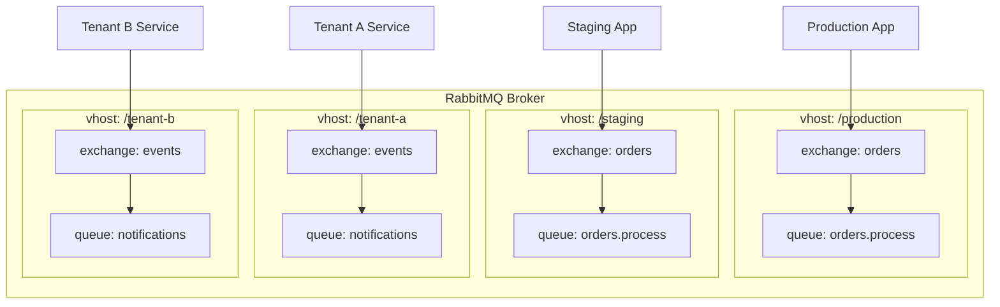
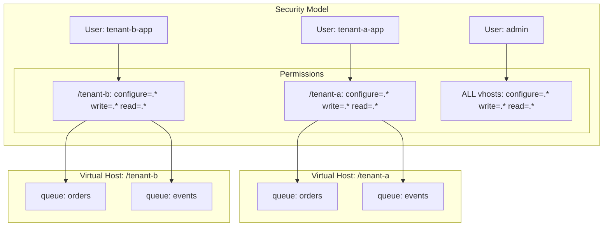

# How to Implement RabbitMQ Virtual Host Management

Author: [nawazdhandala](https://github.com/nawazdhandala)

Tags: RabbitMQ, Virtual Hosts, Multi-tenancy, Operations

Description: A practical guide to creating, securing, and managing RabbitMQ virtual hosts for multi-tenant environments with resource isolation.

---

RabbitMQ virtual hosts (vhosts) let you run multiple isolated messaging environments on a single broker. Each vhost has its own queues, exchanges, bindings, and permissions. Think of them as namespaces that keep tenants, environments, or applications from stepping on each other.

## Understanding Virtual Hosts



Each vhost is completely isolated. A queue named `orders` in `/production` is separate from a queue named `orders` in `/staging`. Users can only access vhosts they have explicit permissions for.

## Multi-Tenant Architecture

```mermaid
flowchart LR
    subgraph Clients
        C1[Tenant A]
        C2[Tenant B]
        C3[Tenant C]
    end

    subgraph Load Balancer
        LB[HAProxy/NGINX]
    end

    subgraph RabbitMQ Cluster
        N1[Node 1]
        N2[Node 2]
        N3[Node 3]
    end

    subgraph Virtual Hosts
        V1[/tenant-a]
        V2[/tenant-b]
        V3[/tenant-c]
    end

    C1 --> LB
    C2 --> LB
    C3 --> LB
    LB --> N1
    LB --> N2
    LB --> N3
    N1 --> V1
    N1 --> V2
    N1 --> V3
```

## Creating Virtual Hosts

### Using rabbitmqctl

The `rabbitmqctl` command is the primary tool for managing RabbitMQ from the command line.

```bash
# Create a new virtual host
rabbitmqctl add_vhost /production

# Create vhost with description and tags
rabbitmqctl add_vhost /tenant-acme \
  --description "ACME Corp production environment" \
  --tags "production,tenant"

# List all virtual hosts
rabbitmqctl list_vhosts name description tags

# Get detailed vhost info
rabbitmqctl list_vhosts name messages consumers
```

### Using the HTTP API

The RabbitMQ Management API provides REST endpoints for programmatic vhost management.

```bash
# Create a virtual host
curl -u admin:password -X PUT \
  http://localhost:15672/api/vhosts/%2Ftenant-acme \
  -H "content-type: application/json" \
  -d '{"description": "ACME Corp environment", "tags": "production,tenant"}'

# List all virtual hosts
curl -u admin:password \
  http://localhost:15672/api/vhosts

# Get specific vhost details
curl -u admin:password \
  http://localhost:15672/api/vhosts/%2Ftenant-acme

# Delete a virtual host (removes all queues, exchanges, bindings)
curl -u admin:password -X DELETE \
  http://localhost:15672/api/vhosts/%2Ftenant-acme
```

Note: The `/` character in vhost names must be URL-encoded as `%2F`.

## Setting User Permissions

Permissions control what users can do within each vhost. There are three permission types:

- **configure**: Create and delete queues/exchanges
- **write**: Publish messages to exchanges
- **read**: Consume messages from queues

### Using rabbitmqctl

```bash
# Grant full permissions to a user on a vhost
# Pattern: rabbitmqctl set_permissions -p <vhost> <user> <configure> <write> <read>
rabbitmqctl set_permissions -p /tenant-acme acme-app ".*" ".*" ".*"

# Grant read-only access (can consume but not publish or create)
rabbitmqctl set_permissions -p /tenant-acme acme-reader "" "" ".*"

# Grant publish-only access (can publish but not consume or create)
rabbitmqctl set_permissions -p /tenant-acme acme-writer "" ".*" ""

# Restrict to specific queue/exchange patterns
# Only allow access to resources starting with "orders."
rabbitmqctl set_permissions -p /tenant-acme acme-orders \
  "^orders\\..*" "^orders\\..*" "^orders\\..*"

# List permissions for a vhost
rabbitmqctl list_permissions -p /tenant-acme

# List all permissions for a user
rabbitmqctl list_user_permissions acme-app

# Remove permissions
rabbitmqctl clear_permissions -p /tenant-acme acme-app
```

### Using the HTTP API

```bash
# Set permissions for a user on a vhost
curl -u admin:password -X PUT \
  http://localhost:15672/api/permissions/%2Ftenant-acme/acme-app \
  -H "content-type: application/json" \
  -d '{"configure": ".*", "write": ".*", "read": ".*"}'

# Get permissions
curl -u admin:password \
  http://localhost:15672/api/permissions/%2Ftenant-acme/acme-app

# List all permissions for a vhost
curl -u admin:password \
  http://localhost:15672/api/vhosts/%2Ftenant-acme/permissions

# Delete permissions
curl -u admin:password -X DELETE \
  http://localhost:15672/api/permissions/%2Ftenant-acme/acme-app
```

## Resource Limits and Quotas

RabbitMQ 3.8+ supports per-vhost resource limits. This prevents a single tenant from consuming all broker resources.

### Setting Limits with rabbitmqctl

```bash
# Limit maximum number of queues in a vhost
rabbitmqctl set_vhost_limits -p /tenant-acme '{"max-queues": 100}'

# Limit maximum number of connections
rabbitmqctl set_vhost_limits -p /tenant-acme '{"max-connections": 50}'

# Set both limits at once
rabbitmqctl set_vhost_limits -p /tenant-acme \
  '{"max-queues": 100, "max-connections": 50}'

# Remove limits (set to -1 for unlimited)
rabbitmqctl set_vhost_limits -p /tenant-acme \
  '{"max-queues": -1, "max-connections": -1}'

# View current limits
rabbitmqctl list_vhost_limits -p /tenant-acme
```

### Setting Limits with HTTP API

```bash
# Set vhost limits
curl -u admin:password -X PUT \
  http://localhost:15672/api/vhost-limits/%2Ftenant-acme/max-queues \
  -H "content-type: application/json" \
  -d '{"value": 100}'

curl -u admin:password -X PUT \
  http://localhost:15672/api/vhost-limits/%2Ftenant-acme/max-connections \
  -H "content-type: application/json" \
  -d '{"value": 50}'

# List all limits for a vhost
curl -u admin:password \
  http://localhost:15672/api/vhost-limits/%2Ftenant-acme

# Delete a limit
curl -u admin:password -X DELETE \
  http://localhost:15672/api/vhost-limits/%2Ftenant-acme/max-queues
```

## Isolation and Security



### Best Practices for Isolation

1. **One user per tenant**: Create dedicated users for each tenant vhost
2. **Minimal permissions**: Grant only the permissions each application needs
3. **Pattern-based restrictions**: Use regex patterns to limit access to specific queues/exchanges
4. **Separate admin accounts**: Keep administrative users separate from application users

```bash
# Create tenant-specific user
rabbitmqctl add_user tenant-a-app 'secure-password-here'

# Assign minimal required permissions
rabbitmqctl set_permissions -p /tenant-a tenant-a-app \
  "^(orders|events)\\..*" \
  "^(orders|events)\\..*" \
  "^(orders|events)\\..*"

# Tag user for management UI access (optional)
rabbitmqctl set_user_tags tenant-a-app monitoring
```

## Automating Vhost Provisioning

Here is a script to automate tenant onboarding:

```bash
#!/bin/bash
# provision-tenant.sh - Create vhost, user, and set permissions

set -e

TENANT_NAME=$1
RABBITMQ_HOST=${RABBITMQ_HOST:-localhost}
RABBITMQ_PORT=${RABBITMQ_PORT:-15672}
RABBITMQ_USER=${RABBITMQ_USER:-admin}
RABBITMQ_PASS=${RABBITMQ_PASS:-password}

if [ -z "$TENANT_NAME" ]; then
    echo "Usage: $0 <tenant-name>"
    exit 1
fi

VHOST="/$TENANT_NAME"
ENCODED_VHOST=$(echo "$VHOST" | sed 's/\//%2F/g')
APP_USER="${TENANT_NAME}-app"
APP_PASS=$(openssl rand -base64 24)

echo "Provisioning tenant: $TENANT_NAME"

# Create virtual host
echo "Creating vhost: $VHOST"
curl -s -u "$RABBITMQ_USER:$RABBITMQ_PASS" -X PUT \
  "http://$RABBITMQ_HOST:$RABBITMQ_PORT/api/vhosts/$ENCODED_VHOST" \
  -H "content-type: application/json" \
  -d "{\"description\": \"Tenant: $TENANT_NAME\", \"tags\": \"tenant\"}"

# Create application user
echo "Creating user: $APP_USER"
curl -s -u "$RABBITMQ_USER:$RABBITMQ_PASS" -X PUT \
  "http://$RABBITMQ_HOST:$RABBITMQ_PORT/api/users/$APP_USER" \
  -H "content-type: application/json" \
  -d "{\"password\": \"$APP_PASS\", \"tags\": \"\"}"

# Set permissions
echo "Setting permissions"
curl -s -u "$RABBITMQ_USER:$RABBITMQ_PASS" -X PUT \
  "http://$RABBITMQ_HOST:$RABBITMQ_PORT/api/permissions/$ENCODED_VHOST/$APP_USER" \
  -H "content-type: application/json" \
  -d '{"configure": ".*", "write": ".*", "read": ".*"}'

# Set resource limits
echo "Setting resource limits"
curl -s -u "$RABBITMQ_USER:$RABBITMQ_PASS" -X PUT \
  "http://$RABBITMQ_HOST:$RABBITMQ_PORT/api/vhost-limits/$ENCODED_VHOST/max-queues" \
  -H "content-type: application/json" \
  -d '{"value": 50}'

curl -s -u "$RABBITMQ_USER:$RABBITMQ_PASS" -X PUT \
  "http://$RABBITMQ_HOST:$RABBITMQ_PORT/api/vhost-limits/$ENCODED_VHOST/max-connections" \
  -H "content-type: application/json" \
  -d '{"value": 25}'

echo ""
echo "Tenant provisioned successfully!"
echo "---"
echo "Vhost: $VHOST"
echo "User: $APP_USER"
echo "Password: $APP_PASS"
echo "---"
echo "Connection string: amqp://$APP_USER:$APP_PASS@$RABBITMQ_HOST/$ENCODED_VHOST"
```

## Monitoring Virtual Hosts

### Check Vhost Status

```bash
# List vhosts with message counts
rabbitmqctl list_vhosts name messages consumers

# Get detailed queue stats for a vhost
rabbitmqctl list_queues -p /tenant-acme \
  name messages consumers memory

# Check connections per vhost
rabbitmqctl list_connections vhost user state
```

### HTTP API Monitoring

```bash
# Get vhost overview with stats
curl -u admin:password \
  "http://localhost:15672/api/vhosts/%2Ftenant-acme"

# Get all queues in a vhost
curl -u admin:password \
  "http://localhost:15672/api/queues/%2Ftenant-acme"

# Get message rates for a vhost
curl -u admin:password \
  "http://localhost:15672/api/vhosts/%2Ftenant-acme?msg_rates_age=60&msg_rates_incr=5"
```

### Prometheus Metrics

If you use the RabbitMQ Prometheus plugin, vhost metrics are available:

```promql
# Messages ready per vhost
rabbitmq_queue_messages_ready{vhost="/tenant-acme"}

# Connections per vhost
rabbitmq_connections{vhost="/tenant-acme"}

# Message publish rate per vhost
rate(rabbitmq_channel_messages_published_total{vhost="/tenant-acme"}[5m])
```

## Cleanup and Deprovisioning

When removing a tenant, delete resources in the correct order:

```bash
#!/bin/bash
# deprovision-tenant.sh - Remove tenant vhost and user

TENANT_NAME=$1
VHOST="/$TENANT_NAME"
ENCODED_VHOST=$(echo "$VHOST" | sed 's/\//%2F/g')
APP_USER="${TENANT_NAME}-app"

# Delete the vhost (this removes all queues, exchanges, and bindings)
echo "Deleting vhost: $VHOST"
curl -s -u "$RABBITMQ_USER:$RABBITMQ_PASS" -X DELETE \
  "http://$RABBITMQ_HOST:$RABBITMQ_PORT/api/vhosts/$ENCODED_VHOST"

# Delete the user
echo "Deleting user: $APP_USER"
curl -s -u "$RABBITMQ_USER:$RABBITMQ_PASS" -X DELETE \
  "http://$RABBITMQ_HOST:$RABBITMQ_PORT/api/users/$APP_USER"

echo "Tenant $TENANT_NAME deprovisioned"
```

## Common Pitfalls

1. **Forgetting the default vhost**: New users have no permissions by default. Always set permissions explicitly.

2. **URL encoding issues**: The `/` in vhost names must be encoded as `%2F` in HTTP API calls.

3. **No cascading deletes for users**: Deleting a vhost removes its queues and exchanges but does not delete users who had permissions on it.

4. **Resource limits are soft**: Limits prevent new resources from being created but do not terminate existing connections or delete existing queues.

5. **Permissions are regex patterns**: The pattern `.*` matches everything. The pattern `orders` only matches exactly `orders`, not `orders.new`.

## Summary

Virtual hosts give you isolation without the overhead of running multiple RabbitMQ instances. Use them to separate environments (dev/staging/production), isolate tenants in multi-tenant systems, or organize queues by application domain.

The key operations:

- `rabbitmqctl add_vhost` or `PUT /api/vhosts/{vhost}` to create
- `rabbitmqctl set_permissions` or `PUT /api/permissions/{vhost}/{user}` to grant access
- `rabbitmqctl set_vhost_limits` or `PUT /api/vhost-limits/{vhost}/{limit}` to enforce quotas

Automate provisioning, monitor resource usage, and enforce the principle of least privilege. Your multi-tenant RabbitMQ deployment will be secure, manageable, and ready to scale.
