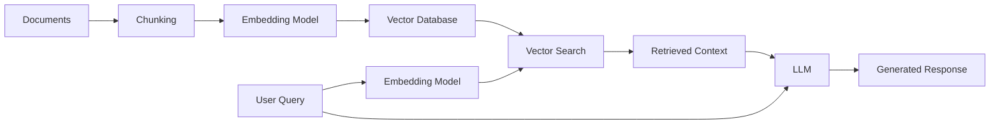

# How to Build RAG Architecture

Author: [nawazdhandala](https://www.github.com/nawazdhandala)

Tags: RAG, LLM, AI, Vector Database, Machine Learning

Description: Build a production-ready Retrieval-Augmented Generation system with document ingestion, embedding, vector search, and LLM integration.

---

Retrieval-Augmented Generation (RAG) has become the go-to pattern for building AI applications that need access to private or up-to-date information. Instead of relying solely on what an LLM learned during training, RAG fetches relevant context from your own data sources before generating a response. This gives you accurate, grounded answers without the cost of fine-tuning.

In this guide, we will walk through building a complete RAG system from scratch, covering document processing, embeddings, vector storage, and LLM integration.

## Understanding RAG Architecture

Before diving into code, let's understand how the pieces fit together.



The system works in two phases. During ingestion, you process documents into chunks, generate embeddings, and store them in a vector database. At query time, you embed the user's question, find similar chunks, and pass them to an LLM along with the original question.

## Setting Up the Project

We will use Python with some popular libraries. Start by installing the dependencies.

```bash
# Install required packages
pip install openai chromadb langchain tiktoken pypdf
```

Now let's create the basic project structure.

```python
# config.py - Central configuration for the RAG system

import os
from dataclasses import dataclass

@dataclass
class RAGConfig:
    # Embedding settings
    embedding_model: str = "text-embedding-3-small"
    embedding_dimensions: int = 1536

    # Chunking settings
    chunk_size: int = 1000
    chunk_overlap: int = 200

    # Retrieval settings
    top_k: int = 5

    # LLM settings
    llm_model: str = "gpt-4o"
    temperature: float = 0.1

    # Vector database path
    db_path: str = "./chroma_db"

config = RAGConfig()
```

## Document Processing and Chunking

The first step is breaking documents into manageable pieces. Chunks that are too large waste context window space, while chunks that are too small lose important context. A good starting point is 1000 characters with 200-character overlap.

```python
# document_processor.py - Handle document loading and chunking

from typing import List
from langchain.text_splitter import RecursiveCharacterTextSplitter
from langchain.document_loaders import PyPDFLoader, TextLoader
from dataclasses import dataclass

@dataclass
class Document:
    """Represents a processed document chunk."""
    content: str
    metadata: dict

def load_document(file_path: str) -> str:
    """Load a document from various file formats."""
    if file_path.endswith('.pdf'):
        loader = PyPDFLoader(file_path)
        pages = loader.load()
        return "\n".join([page.page_content for page in pages])
    elif file_path.endswith('.txt'):
        loader = TextLoader(file_path)
        return loader.load()[0].page_content
    else:
        raise ValueError(f"Unsupported file format: {file_path}")

def chunk_document(
    text: str,
    source: str,
    chunk_size: int = 1000,
    chunk_overlap: int = 200
) -> List[Document]:
    """Split text into overlapping chunks with metadata."""

    # RecursiveCharacterTextSplitter tries to split on paragraphs,
    # then sentences, then words - keeping semantic units together
    splitter = RecursiveCharacterTextSplitter(
        chunk_size=chunk_size,
        chunk_overlap=chunk_overlap,
        separators=["\n\n", "\n", ". ", " ", ""]
    )

    chunks = splitter.split_text(text)

    # Attach metadata to each chunk for later reference
    documents = []
    for i, chunk in enumerate(chunks):
        documents.append(Document(
            content=chunk,
            metadata={
                "source": source,
                "chunk_index": i,
                "total_chunks": len(chunks)
            }
        ))

    return documents
```

## Generating Embeddings

Embeddings convert text into numerical vectors that capture semantic meaning. Similar texts will have similar vectors, which is what enables semantic search.

```python
# embeddings.py - Generate embeddings using OpenAI

from typing import List
from openai import OpenAI

class EmbeddingGenerator:
    """Generate embeddings using OpenAI's embedding models."""

    def __init__(self, model: str = "text-embedding-3-small"):
        self.client = OpenAI()
        self.model = model

    def embed_texts(self, texts: List[str]) -> List[List[float]]:
        """Generate embeddings for a list of texts."""

        # OpenAI's API accepts batches, which is more efficient
        response = self.client.embeddings.create(
            model=self.model,
            input=texts
        )

        # Extract embedding vectors from response
        embeddings = [item.embedding for item in response.data]
        return embeddings

    def embed_query(self, query: str) -> List[float]:
        """Generate embedding for a single query."""
        return self.embed_texts([query])[0]
```

## Vector Storage with ChromaDB

ChromaDB provides a simple yet powerful vector database that runs locally. For production workloads, you might consider Pinecone, Weaviate, or Qdrant.

```python
# vector_store.py - Store and retrieve document embeddings

import chromadb
from chromadb.config import Settings
from typing import List, Tuple
from document_processor import Document

class VectorStore:
    """Manage vector storage and retrieval with ChromaDB."""

    def __init__(self, db_path: str = "./chroma_db"):
        # Persist data to disk so it survives restarts
        self.client = chromadb.PersistentClient(path=db_path)
        self.collection = self.client.get_or_create_collection(
            name="documents",
            metadata={"hnsw:space": "cosine"}  # Use cosine similarity
        )

    def add_documents(
        self,
        documents: List[Document],
        embeddings: List[List[float]]
    ) -> None:
        """Add documents and their embeddings to the store."""

        self.collection.add(
            ids=[f"doc_{i}" for i in range(len(documents))],
            embeddings=embeddings,
            documents=[doc.content for doc in documents],
            metadatas=[doc.metadata for doc in documents]
        )
        print(f"Added {len(documents)} documents to vector store")

    def search(
        self,
        query_embedding: List[float],
        top_k: int = 5
    ) -> List[Tuple[str, dict, float]]:
        """Find the most similar documents to a query."""

        results = self.collection.query(
            query_embeddings=[query_embedding],
            n_results=top_k,
            include=["documents", "metadatas", "distances"]
        )

        # Return tuples of (content, metadata, distance)
        documents = results["documents"][0]
        metadatas = results["metadatas"][0]
        distances = results["distances"][0]

        return list(zip(documents, metadatas, distances))
```

## Building the RAG Pipeline

Now we combine everything into a unified pipeline that handles both ingestion and querying.

```python
# rag_pipeline.py - Complete RAG implementation

from openai import OpenAI
from typing import List
from config import config
from document_processor import load_document, chunk_document
from embeddings import EmbeddingGenerator
from vector_store import VectorStore

class RAGPipeline:
    """End-to-end RAG pipeline for document Q&A."""

    def __init__(self):
        self.embedder = EmbeddingGenerator(config.embedding_model)
        self.vector_store = VectorStore(config.db_path)
        self.llm_client = OpenAI()

    def ingest(self, file_path: str) -> int:
        """Process and store a document."""

        # Load and chunk the document
        text = load_document(file_path)
        documents = chunk_document(
            text,
            source=file_path,
            chunk_size=config.chunk_size,
            chunk_overlap=config.chunk_overlap
        )

        # Generate embeddings for all chunks
        texts = [doc.content for doc in documents]
        embeddings = self.embedder.embed_texts(texts)

        # Store in vector database
        self.vector_store.add_documents(documents, embeddings)

        return len(documents)

    def query(self, question: str) -> str:
        """Answer a question using retrieved context."""

        # Embed the question
        query_embedding = self.embedder.embed_query(question)

        # Retrieve relevant chunks
        results = self.vector_store.search(
            query_embedding,
            top_k=config.top_k
        )

        # Build context from retrieved documents
        context_parts = []
        for content, metadata, distance in results:
            source = metadata.get("source", "unknown")
            context_parts.append(f"[Source: {source}]\n{content}")

        context = "\n\n---\n\n".join(context_parts)

        # Generate response with LLM
        response = self.llm_client.chat.completions.create(
            model=config.llm_model,
            temperature=config.temperature,
            messages=[
                {
                    "role": "system",
                    "content": """You are a helpful assistant that answers questions
                    based on the provided context. If the context doesn't contain
                    relevant information, say so. Always cite your sources."""
                },
                {
                    "role": "user",
                    "content": f"""Context:
{context}

Question: {question}

Please answer based on the context provided."""
                }
            ]
        )

        return response.choices[0].message.content
```

## Using the RAG System

Here is how to use the complete system.

```python
# main.py - Example usage of the RAG pipeline

from rag_pipeline import RAGPipeline

def main():
    # Initialize the pipeline
    rag = RAGPipeline()

    # Ingest some documents
    rag.ingest("./documents/company_handbook.pdf")
    rag.ingest("./documents/product_specs.txt")

    # Ask questions
    answer = rag.query("What is our company's vacation policy?")
    print(answer)

if __name__ == "__main__":
    main()
```

## Production Considerations

When moving to production, consider these improvements:

**Hybrid Search**: Combine vector search with keyword search (BM25) for better recall. Some queries work better with exact matches.

**Reranking**: Use a cross-encoder model to rerank retrieved results before passing them to the LLM. This significantly improves relevance.

**Metadata Filtering**: Add filters based on document type, date, or department to narrow down the search space.

**Caching**: Cache embeddings and common queries to reduce latency and API costs.

**Monitoring**: Track retrieval quality metrics like answer relevance scores and user feedback to continuously improve the system.

## Wrapping Up

You now have a working RAG system that can ingest documents and answer questions. The architecture is modular, so you can swap out components as needed. Try different embedding models, experiment with chunk sizes, or upgrade to a managed vector database as your needs grow.

RAG is powerful because it separates the knowledge base from the reasoning engine. You can update your documents anytime without retraining anything. This makes it practical for real-world applications where information changes frequently.
