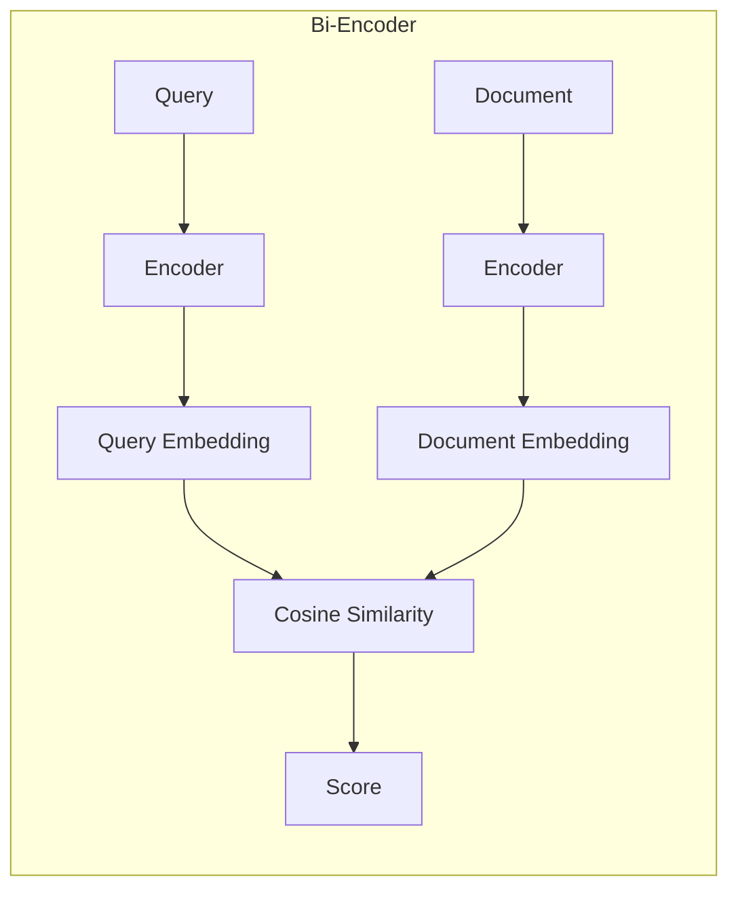
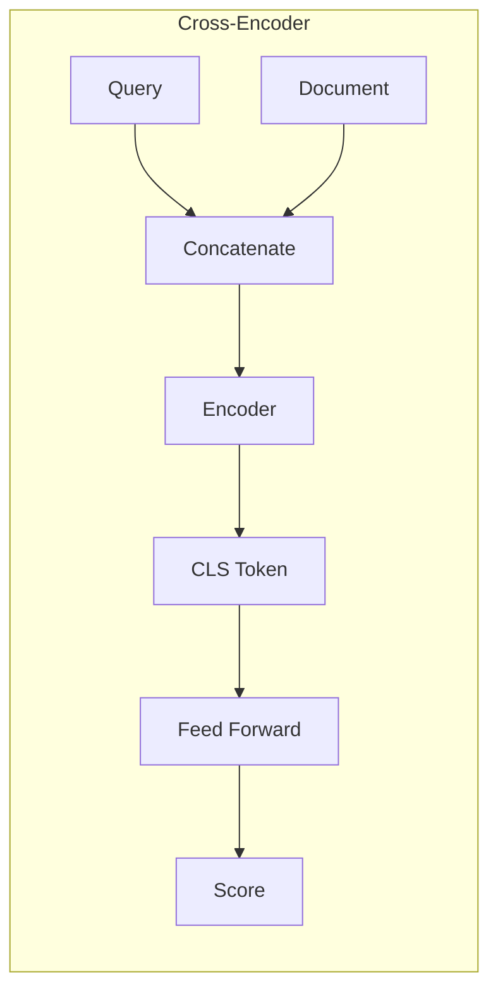
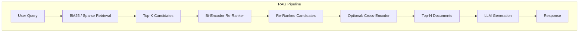
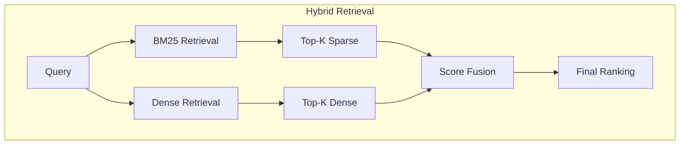
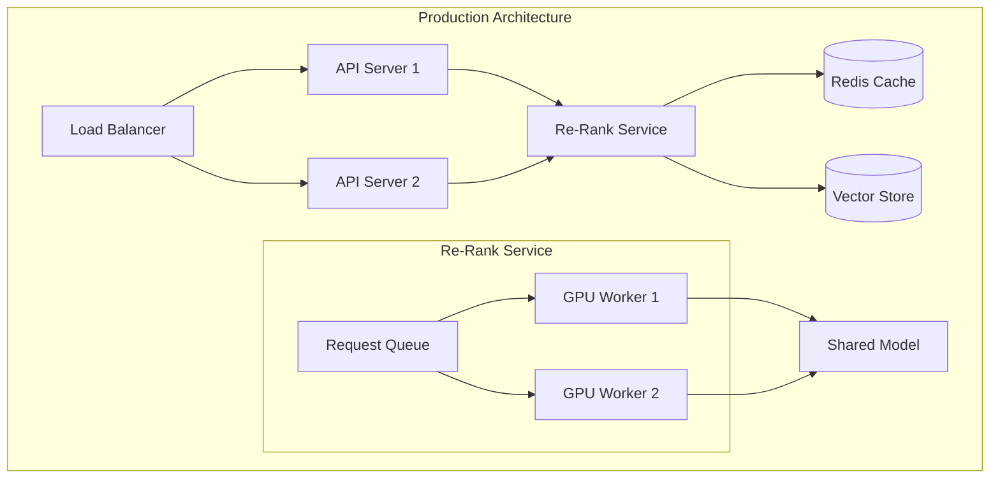

# How to Implement Bi-Encoder Re-Ranking

Author: [nawazdhandala](https://github.com/nawazdhandala)

Tags: RAG, Re-Ranking, Bi-Encoder, Information Retrieval

Description: Learn to implement bi-encoder re-ranking for fast initial retrieval with independent query and document encoding.

---

> In RAG systems, the quality of retrieved documents directly determines the quality of generated responses. Bi-encoder re-ranking offers a practical balance between retrieval speed and relevance scoring.

Retrieval-Augmented Generation (RAG) pipelines typically follow a two-stage approach: fast initial retrieval followed by more precise re-ranking. This guide focuses on implementing bi-encoder re-ranking, a technique that encodes queries and documents independently for efficient similarity computation.

---

## Table of Contents

1. Understanding Bi-Encoders vs Cross-Encoders
2. Architecture Overview
3. When to Use Bi-Encoder Re-Ranking
4. Implementation: Building a Bi-Encoder Re-Ranker
5. Optimizing Performance with Pre-Computed Embeddings
6. Batch Processing and Caching Strategies
7. Hybrid Approaches: Combining Bi-Encoders with BM25
8. Evaluation and Metrics
9. Production Deployment Considerations
10. Common Pitfalls and Best Practices

---

## 1. Understanding Bi-Encoders vs Cross-Encoders

Before diving into implementation, it is essential to understand the fundamental differences between the two main approaches to neural re-ranking.

### Bi-Encoder Architecture

A bi-encoder processes the query and document separately through the same (or different) encoder networks. The similarity is computed using a simple operation (typically cosine similarity or dot product) between the resulting embeddings.



### Cross-Encoder Architecture

A cross-encoder processes the query and document together as a single input, allowing deep interaction between tokens from both sides.



### Comparison Table

| Aspect | Bi-Encoder | Cross-Encoder |
|--------|------------|---------------|
| Inference Speed | Fast (O(1) for pre-computed docs) | Slow (O(n) per query-doc pair) |
| Accuracy | Good | Better |
| Document Pre-computation | Yes (offline indexing) | No |
| Memory Usage | Higher (store embeddings) | Lower |
| Query Latency | Low | High |
| Best Use Case | Large-scale retrieval, re-ranking | Final-stage re-ranking, small candidate sets |

---

## 2. Architecture Overview

A typical RAG pipeline with bi-encoder re-ranking follows this flow:



The bi-encoder sits between initial retrieval and final generation, refining the candidate set before passing it to the LLM.

---

## 3. When to Use Bi-Encoder Re-Ranking

Bi-encoder re-ranking is ideal when:

- You need to re-rank hundreds or thousands of candidates quickly
- Document embeddings can be pre-computed and cached
- Latency requirements are strict (sub-100ms re-ranking)
- You want semantic similarity beyond lexical matching
- Your retrieval corpus is relatively static

Consider cross-encoders instead when:

- You have a small candidate set (fewer than 50 documents)
- Maximum accuracy is more important than speed
- Query-document interactions require deep semantic understanding

---

## 4. Implementation: Building a Bi-Encoder Re-Ranker

### Setting Up the Environment

```bash
# Install required packages
pip install sentence-transformers torch numpy faiss-cpu
```

### Basic Bi-Encoder Implementation

```python
# bi_encoder_reranker.py
"""
Bi-Encoder Re-Ranker for RAG Systems

This module implements a bi-encoder based re-ranking system that encodes
queries and documents independently, enabling efficient similarity computation
through pre-computed document embeddings.
"""

from sentence_transformers import SentenceTransformer
import numpy as np
from typing import List, Tuple, Optional
import torch


class BiEncoderReRanker:
    """
    A bi-encoder re-ranker that uses dense embeddings for semantic similarity.

    The bi-encoder architecture allows documents to be encoded once and stored,
    making query-time re-ranking extremely fast since only the query needs
    to be encoded at inference time.
    """

    def __init__(
        self,
        model_name: str = "sentence-transformers/all-MiniLM-L6-v2",
        device: Optional[str] = None
    ):
        """
        Initialize the bi-encoder re-ranker.

        Args:
            model_name: HuggingFace model identifier for the encoder
            device: Device to run inference on ('cuda', 'cpu', or None for auto)
        """
        # Automatically select device if not specified
        if device is None:
            device = "cuda" if torch.cuda.is_available() else "cpu"

        self.device = device
        self.model = SentenceTransformer(model_name, device=device)

        # Cache for document embeddings to avoid re-computation
        self._embedding_cache = {}

    def encode_query(self, query: str) -> np.ndarray:
        """
        Encode a single query into a dense vector.

        Args:
            query: The search query text

        Returns:
            Normalized embedding vector for the query
        """
        # Encode with normalization for cosine similarity
        embedding = self.model.encode(
            query,
            normalize_embeddings=True,
            show_progress_bar=False
        )
        return embedding

    def encode_documents(
        self,
        documents: List[str],
        batch_size: int = 32,
        show_progress: bool = False
    ) -> np.ndarray:
        """
        Encode multiple documents into dense vectors.

        Args:
            documents: List of document texts to encode
            batch_size: Number of documents to encode in each batch
            show_progress: Whether to show encoding progress bar

        Returns:
            Matrix of normalized document embeddings (num_docs x embedding_dim)
        """
        embeddings = self.model.encode(
            documents,
            normalize_embeddings=True,
            batch_size=batch_size,
            show_progress_bar=show_progress
        )
        return embeddings

    def compute_similarity(
        self,
        query_embedding: np.ndarray,
        doc_embeddings: np.ndarray
    ) -> np.ndarray:
        """
        Compute cosine similarity between query and documents.

        Since embeddings are normalized, dot product equals cosine similarity.

        Args:
            query_embedding: Query vector (embedding_dim,)
            doc_embeddings: Document matrix (num_docs x embedding_dim)

        Returns:
            Similarity scores for each document
        """
        # Dot product of normalized vectors = cosine similarity
        similarities = np.dot(doc_embeddings, query_embedding)
        return similarities

    def rerank(
        self,
        query: str,
        documents: List[str],
        top_k: Optional[int] = None,
        return_scores: bool = True
    ) -> List[Tuple[int, str, float]]:
        """
        Re-rank documents by semantic similarity to the query.

        Args:
            query: The search query
            documents: List of candidate documents to re-rank
            top_k: Number of top results to return (None = all)
            return_scores: Whether to include similarity scores

        Returns:
            List of (original_index, document_text, score) tuples,
            sorted by descending similarity
        """
        # Encode query and documents
        query_embedding = self.encode_query(query)
        doc_embeddings = self.encode_documents(documents)

        # Compute similarities
        scores = self.compute_similarity(query_embedding, doc_embeddings)

        # Sort by score (descending)
        sorted_indices = np.argsort(scores)[::-1]

        # Apply top_k limit
        if top_k is not None:
            sorted_indices = sorted_indices[:top_k]

        # Build result list
        results = []
        for idx in sorted_indices:
            score = float(scores[idx]) if return_scores else 0.0
            results.append((int(idx), documents[idx], score))

        return results


# Example usage
if __name__ == "__main__":
    # Initialize the re-ranker
    reranker = BiEncoderReRanker()

    # Sample query and documents
    query = "How do I configure Kubernetes pod resource limits?"

    documents = [
        "Kubernetes pods can have resource requests and limits configured in the pod spec.",
        "Docker containers use cgroups for resource isolation.",
        "To set CPU limits, use spec.containers[].resources.limits.cpu in your YAML.",
        "Helm charts simplify Kubernetes deployments with templating.",
        "Resource quotas can be set at the namespace level to limit total consumption.",
    ]

    # Re-rank documents
    results = reranker.rerank(query, documents, top_k=3)

    print("Query:", query)
    print("\nRe-ranked results:")
    for idx, doc, score in results:
        print(f"  [{idx}] (score: {score:.4f}) {doc[:60]}...")
```

---

## 5. Optimizing Performance with Pre-Computed Embeddings

The key advantage of bi-encoders is the ability to pre-compute document embeddings. Here is an optimized implementation with caching:

```python
# optimized_reranker.py
"""
Optimized Bi-Encoder with Pre-computed Embeddings and Caching

This implementation separates document encoding (offline) from query-time
re-ranking (online), enabling sub-millisecond re-ranking of large candidate sets.
"""

import hashlib
import pickle
from pathlib import Path
from typing import List, Dict, Tuple, Optional, Any
import numpy as np
from sentence_transformers import SentenceTransformer
import torch


class EmbeddingCache:
    """
    Persistent cache for document embeddings.

    Stores embeddings on disk to avoid re-computation across sessions.
    Uses content hashing to detect document changes.
    """

    def __init__(self, cache_dir: str = ".embedding_cache"):
        """
        Initialize the embedding cache.

        Args:
            cache_dir: Directory to store cached embeddings
        """
        self.cache_dir = Path(cache_dir)
        self.cache_dir.mkdir(exist_ok=True)

        # In-memory cache for fast access
        self._memory_cache: Dict[str, np.ndarray] = {}

    def _hash_document(self, document: str) -> str:
        """Generate a unique hash for document content."""
        return hashlib.sha256(document.encode()).hexdigest()[:16]

    def get(self, document: str) -> Optional[np.ndarray]:
        """
        Retrieve cached embedding for a document.

        Args:
            document: The document text

        Returns:
            Cached embedding or None if not found
        """
        doc_hash = self._hash_document(document)

        # Check memory cache first
        if doc_hash in self._memory_cache:
            return self._memory_cache[doc_hash]

        # Check disk cache
        cache_path = self.cache_dir / f"{doc_hash}.npy"
        if cache_path.exists():
            embedding = np.load(cache_path)
            self._memory_cache[doc_hash] = embedding
            return embedding

        return None

    def set(self, document: str, embedding: np.ndarray) -> None:
        """
        Store embedding in cache.

        Args:
            document: The document text
            embedding: The computed embedding vector
        """
        doc_hash = self._hash_document(document)

        # Store in memory
        self._memory_cache[doc_hash] = embedding

        # Persist to disk
        cache_path = self.cache_dir / f"{doc_hash}.npy"
        np.save(cache_path, embedding)

    def get_batch(self, documents: List[str]) -> Tuple[List[int], List[int], List[np.ndarray]]:
        """
        Get cached embeddings for multiple documents.

        Args:
            documents: List of document texts

        Returns:
            Tuple of (cached_indices, missing_indices, cached_embeddings)
        """
        cached_indices = []
        missing_indices = []
        cached_embeddings = []

        for i, doc in enumerate(documents):
            embedding = self.get(doc)
            if embedding is not None:
                cached_indices.append(i)
                cached_embeddings.append(embedding)
            else:
                missing_indices.append(i)

        return cached_indices, missing_indices, cached_embeddings


class OptimizedBiEncoderReRanker:
    """
    Production-ready bi-encoder re-ranker with caching and batch optimization.

    Features:
    - Persistent embedding cache to avoid re-computation
    - Batch encoding for efficient GPU utilization
    - Separate offline indexing and online querying paths
    """

    def __init__(
        self,
        model_name: str = "sentence-transformers/all-MiniLM-L6-v2",
        cache_dir: str = ".embedding_cache",
        device: Optional[str] = None,
        batch_size: int = 64
    ):
        """
        Initialize the optimized re-ranker.

        Args:
            model_name: HuggingFace model identifier
            cache_dir: Directory for embedding cache
            device: Inference device ('cuda', 'cpu', or None for auto)
            batch_size: Default batch size for encoding
        """
        if device is None:
            device = "cuda" if torch.cuda.is_available() else "cpu"

        self.device = device
        self.batch_size = batch_size
        self.model = SentenceTransformer(model_name, device=device)
        self.cache = EmbeddingCache(cache_dir)

        # Pre-allocate query embedding for reuse
        self._embedding_dim = self.model.get_sentence_embedding_dimension()

    def index_documents(
        self,
        documents: List[str],
        show_progress: bool = True
    ) -> np.ndarray:
        """
        Pre-compute and cache embeddings for a document corpus.

        This should be called offline during indexing time.

        Args:
            documents: List of documents to index
            show_progress: Whether to show progress bar

        Returns:
            Matrix of document embeddings
        """
        # Check cache for existing embeddings
        cached_idx, missing_idx, cached_embs = self.cache.get_batch(documents)

        # Initialize result array
        all_embeddings = np.zeros((len(documents), self._embedding_dim))

        # Fill in cached embeddings
        for i, emb in zip(cached_idx, cached_embs):
            all_embeddings[i] = emb

        # Encode missing documents
        if missing_idx:
            missing_docs = [documents[i] for i in missing_idx]

            if show_progress:
                print(f"Encoding {len(missing_docs)} new documents...")

            new_embeddings = self.model.encode(
                missing_docs,
                normalize_embeddings=True,
                batch_size=self.batch_size,
                show_progress_bar=show_progress
            )

            # Store in cache and result array
            for i, (doc_idx, emb) in enumerate(zip(missing_idx, new_embeddings)):
                self.cache.set(documents[doc_idx], emb)
                all_embeddings[doc_idx] = emb

        if show_progress:
            print(f"Indexed {len(documents)} documents ({len(cached_idx)} from cache)")

        return all_embeddings

    def rerank_with_precomputed(
        self,
        query: str,
        documents: List[str],
        doc_embeddings: np.ndarray,
        top_k: Optional[int] = None
    ) -> List[Tuple[int, str, float]]:
        """
        Re-rank documents using pre-computed embeddings.

        This is the fast path for query-time re-ranking.

        Args:
            query: The search query
            documents: List of candidate documents
            doc_embeddings: Pre-computed document embeddings
            top_k: Number of top results to return

        Returns:
            List of (index, document, score) tuples sorted by relevance
        """
        # Only the query needs encoding at query time
        query_embedding = self.model.encode(
            query,
            normalize_embeddings=True,
            show_progress_bar=False
        )

        # Fast dot product for similarity
        scores = np.dot(doc_embeddings, query_embedding)

        # Get top-k indices
        if top_k is not None and top_k < len(documents):
            # Use argpartition for efficiency when top_k << len(documents)
            top_indices = np.argpartition(scores, -top_k)[-top_k:]
            top_indices = top_indices[np.argsort(scores[top_indices])[::-1]]
        else:
            top_indices = np.argsort(scores)[::-1]

        return [(int(i), documents[i], float(scores[i])) for i in top_indices]


# Example: Indexing and querying workflow
if __name__ == "__main__":
    # Initialize re-ranker
    reranker = OptimizedBiEncoderReRanker()

    # Simulate a document corpus
    corpus = [
        "Kubernetes uses etcd as its backing store for cluster data.",
        "Pod resource limits are enforced by the kubelet using cgroups.",
        "Horizontal Pod Autoscaler scales deployments based on metrics.",
        "ConfigMaps store non-confidential configuration data.",
        "Secrets store sensitive information like passwords and tokens.",
        "Services provide stable networking endpoints for pods.",
        "Ingress controllers manage external access to services.",
        "StatefulSets manage stateful applications with stable identities.",
    ]

    # Offline indexing (run once or when corpus changes)
    print("=== Indexing Phase ===")
    doc_embeddings = reranker.index_documents(corpus)

    # Online querying (fast, runs for each user query)
    print("\n=== Query Phase ===")
    query = "How do I store configuration data in Kubernetes?"

    results = reranker.rerank_with_precomputed(
        query=query,
        documents=corpus,
        doc_embeddings=doc_embeddings,
        top_k=3
    )

    print(f"Query: {query}\n")
    print("Top results:")
    for idx, doc, score in results:
        print(f"  Score: {score:.4f} | {doc}")
```

---

## 6. Batch Processing and Caching Strategies

For production systems handling many queries, batch processing is essential:

```python
# batch_reranker.py
"""
Batch Processing Bi-Encoder for High-Throughput Re-Ranking

This implementation handles multiple queries efficiently by batching
query encoding and using vectorized similarity computation.
"""

import numpy as np
from typing import List, Dict, Tuple, Optional
from dataclasses import dataclass
from concurrent.futures import ThreadPoolExecutor
import time


@dataclass
class ReRankRequest:
    """A single re-ranking request."""
    query: str
    document_ids: List[str]
    top_k: int = 10


@dataclass
class ReRankResult:
    """Result of a re-ranking request."""
    query: str
    ranked_ids: List[str]
    scores: List[float]
    latency_ms: float


class BatchBiEncoderReRanker:
    """
    High-throughput bi-encoder re-ranker with batch processing.

    Optimized for scenarios where many queries need to be processed
    against overlapping document sets.
    """

    def __init__(
        self,
        model_name: str = "sentence-transformers/all-MiniLM-L6-v2",
        max_batch_size: int = 128,
        document_store: Optional[Dict[str, np.ndarray]] = None
    ):
        """
        Initialize the batch re-ranker.

        Args:
            model_name: HuggingFace model identifier
            max_batch_size: Maximum queries to process in one batch
            document_store: Pre-computed document embeddings {id: embedding}
        """
        from sentence_transformers import SentenceTransformer

        self.model = SentenceTransformer(model_name)
        self.max_batch_size = max_batch_size

        # Document store maps document IDs to their embeddings
        self.document_store = document_store or {}

        # Statistics for monitoring
        self._total_queries = 0
        self._total_latency_ms = 0

    def add_documents(
        self,
        documents: Dict[str, str],
        batch_size: int = 64
    ) -> None:
        """
        Add documents to the store with pre-computed embeddings.

        Args:
            documents: Dictionary mapping document IDs to text
            batch_size: Encoding batch size
        """
        doc_ids = list(documents.keys())
        doc_texts = list(documents.values())

        embeddings = self.model.encode(
            doc_texts,
            normalize_embeddings=True,
            batch_size=batch_size,
            show_progress_bar=True
        )

        for doc_id, embedding in zip(doc_ids, embeddings):
            self.document_store[doc_id] = embedding

    def _get_document_embeddings(
        self,
        doc_ids: List[str]
    ) -> Tuple[np.ndarray, List[str]]:
        """
        Retrieve embeddings for document IDs.

        Args:
            doc_ids: List of document identifiers

        Returns:
            Tuple of (embedding_matrix, valid_doc_ids)
        """
        valid_ids = []
        embeddings = []

        for doc_id in doc_ids:
            if doc_id in self.document_store:
                valid_ids.append(doc_id)
                embeddings.append(self.document_store[doc_id])

        if not embeddings:
            return np.array([]), []

        return np.stack(embeddings), valid_ids

    def rerank_batch(
        self,
        requests: List[ReRankRequest]
    ) -> List[ReRankResult]:
        """
        Process multiple re-ranking requests in a batch.

        Args:
            requests: List of re-ranking requests

        Returns:
            List of re-ranking results in the same order
        """
        start_time = time.perf_counter()

        # Batch encode all queries at once
        queries = [req.query for req in requests]
        query_embeddings = self.model.encode(
            queries,
            normalize_embeddings=True,
            batch_size=self.max_batch_size,
            show_progress_bar=False
        )

        results = []

        for i, request in enumerate(requests):
            # Get document embeddings for this request
            doc_embeddings, valid_ids = self._get_document_embeddings(
                request.document_ids
            )

            if len(valid_ids) == 0:
                results.append(ReRankResult(
                    query=request.query,
                    ranked_ids=[],
                    scores=[],
                    latency_ms=0
                ))
                continue

            # Compute similarities
            query_emb = query_embeddings[i]
            scores = np.dot(doc_embeddings, query_emb)

            # Sort and apply top_k
            sorted_indices = np.argsort(scores)[::-1][:request.top_k]

            ranked_ids = [valid_ids[idx] for idx in sorted_indices]
            ranked_scores = [float(scores[idx]) for idx in sorted_indices]

            results.append(ReRankResult(
                query=request.query,
                ranked_ids=ranked_ids,
                scores=ranked_scores,
                latency_ms=0  # Will be updated below
            ))

        # Calculate total latency
        total_latency = (time.perf_counter() - start_time) * 1000
        per_query_latency = total_latency / len(requests)

        # Update latency in results
        for result in results:
            result.latency_ms = per_query_latency

        # Update statistics
        self._total_queries += len(requests)
        self._total_latency_ms += total_latency

        return results

    def get_statistics(self) -> Dict[str, float]:
        """Get performance statistics."""
        avg_latency = (
            self._total_latency_ms / self._total_queries
            if self._total_queries > 0 else 0
        )
        return {
            "total_queries": self._total_queries,
            "total_latency_ms": self._total_latency_ms,
            "average_latency_ms": avg_latency,
            "documents_indexed": len(self.document_store)
        }


# Example: Batch processing
if __name__ == "__main__":
    reranker = BatchBiEncoderReRanker()

    # Add documents
    documents = {
        "doc_001": "Kubernetes orchestrates containerized applications.",
        "doc_002": "Docker provides container runtime capabilities.",
        "doc_003": "Prometheus monitors and alerts on metrics.",
        "doc_004": "Grafana visualizes time series data.",
        "doc_005": "Helm manages Kubernetes package deployments.",
    }
    reranker.add_documents(documents)

    # Create batch requests
    requests = [
        ReRankRequest(
            query="container orchestration",
            document_ids=list(documents.keys()),
            top_k=3
        ),
        ReRankRequest(
            query="monitoring and alerting",
            document_ids=list(documents.keys()),
            top_k=3
        ),
        ReRankRequest(
            query="visualization dashboards",
            document_ids=list(documents.keys()),
            top_k=3
        ),
    ]

    # Process batch
    results = reranker.rerank_batch(requests)

    for result in results:
        print(f"\nQuery: {result.query}")
        print(f"Latency: {result.latency_ms:.2f}ms")
        for doc_id, score in zip(result.ranked_ids, result.scores):
            print(f"  {doc_id}: {score:.4f}")

    print(f"\nStatistics: {reranker.get_statistics()}")
```

---

## 7. Hybrid Approaches: Combining Bi-Encoders with BM25

Combining sparse (BM25) and dense (bi-encoder) retrieval often yields better results than either alone:



```python
# hybrid_reranker.py
"""
Hybrid Re-Ranker: Combining BM25 and Bi-Encoder Scores

This implementation fuses sparse (lexical) and dense (semantic) retrieval
scores for improved ranking quality.
"""

import numpy as np
from typing import List, Tuple, Dict, Optional
from dataclasses import dataclass
from rank_bm25 import BM25Okapi
from sentence_transformers import SentenceTransformer
import re


@dataclass
class ScoredDocument:
    """Document with multiple scores."""
    doc_id: str
    text: str
    bm25_score: float = 0.0
    dense_score: float = 0.0
    final_score: float = 0.0


class HybridReRanker:
    """
    Combines BM25 and bi-encoder for hybrid re-ranking.

    The fusion formula is:
    final_score = alpha * normalized_bm25 + (1 - alpha) * normalized_dense

    Where alpha controls the balance between lexical and semantic matching.
    """

    def __init__(
        self,
        model_name: str = "sentence-transformers/all-MiniLM-L6-v2",
        alpha: float = 0.5
    ):
        """
        Initialize the hybrid re-ranker.

        Args:
            model_name: HuggingFace model for dense encoding
            alpha: Weight for BM25 score (0.0 = pure dense, 1.0 = pure BM25)
        """
        self.model = SentenceTransformer(model_name)
        self.alpha = alpha

        # BM25 index
        self.bm25: Optional[BM25Okapi] = None
        self.tokenized_corpus: List[List[str]] = []

        # Document storage
        self.documents: Dict[str, str] = {}
        self.doc_embeddings: Dict[str, np.ndarray] = {}

    def _tokenize(self, text: str) -> List[str]:
        """Simple tokenization for BM25."""
        # Convert to lowercase and split on non-alphanumeric
        tokens = re.findall(r'\w+', text.lower())
        return tokens

    def _normalize_scores(self, scores: np.ndarray) -> np.ndarray:
        """
        Min-max normalize scores to [0, 1] range.

        Args:
            scores: Array of raw scores

        Returns:
            Normalized scores
        """
        if len(scores) == 0:
            return scores

        min_score = np.min(scores)
        max_score = np.max(scores)

        if max_score == min_score:
            return np.ones_like(scores)

        return (scores - min_score) / (max_score - min_score)

    def index(self, documents: Dict[str, str]) -> None:
        """
        Index documents for both BM25 and dense retrieval.

        Args:
            documents: Dictionary mapping doc_id to text
        """
        self.documents = documents
        doc_ids = list(documents.keys())
        doc_texts = list(documents.values())

        # Build BM25 index
        self.tokenized_corpus = [self._tokenize(text) for text in doc_texts]
        self.bm25 = BM25Okapi(self.tokenized_corpus)

        # Compute dense embeddings
        embeddings = self.model.encode(
            doc_texts,
            normalize_embeddings=True,
            show_progress_bar=True
        )

        for doc_id, embedding in zip(doc_ids, embeddings):
            self.doc_embeddings[doc_id] = embedding

        print(f"Indexed {len(documents)} documents")

    def rerank(
        self,
        query: str,
        candidate_ids: List[str],
        top_k: Optional[int] = None,
        alpha: Optional[float] = None
    ) -> List[ScoredDocument]:
        """
        Re-rank candidates using hybrid scoring.

        Args:
            query: The search query
            candidate_ids: List of document IDs to re-rank
            top_k: Number of results to return
            alpha: Override default alpha (BM25 weight)

        Returns:
            List of ScoredDocument objects sorted by final_score
        """
        if self.bm25 is None:
            raise ValueError("Must call index() before rerank()")

        alpha = alpha if alpha is not None else self.alpha

        # Get BM25 scores
        query_tokens = self._tokenize(query)

        # Map candidate IDs to corpus indices
        doc_id_list = list(self.documents.keys())
        candidate_indices = [doc_id_list.index(cid) for cid in candidate_ids]

        # Get BM25 scores for all documents, then filter
        all_bm25_scores = self.bm25.get_scores(query_tokens)
        bm25_scores = np.array([all_bm25_scores[i] for i in candidate_indices])

        # Get dense scores
        query_embedding = self.model.encode(query, normalize_embeddings=True)
        dense_scores = np.array([
            np.dot(self.doc_embeddings[cid], query_embedding)
            for cid in candidate_ids
        ])

        # Normalize scores
        norm_bm25 = self._normalize_scores(bm25_scores)
        norm_dense = self._normalize_scores(dense_scores)

        # Compute final scores
        final_scores = alpha * norm_bm25 + (1 - alpha) * norm_dense

        # Build results
        results = []
        for i, doc_id in enumerate(candidate_ids):
            results.append(ScoredDocument(
                doc_id=doc_id,
                text=self.documents[doc_id],
                bm25_score=float(bm25_scores[i]),
                dense_score=float(dense_scores[i]),
                final_score=float(final_scores[i])
            ))

        # Sort by final score
        results.sort(key=lambda x: x.final_score, reverse=True)

        if top_k is not None:
            results = results[:top_k]

        return results


# Example: Hybrid re-ranking
if __name__ == "__main__":
    reranker = HybridReRanker(alpha=0.4)  # Slightly favor semantic

    # Index documents
    documents = {
        "k8s_pods": "Kubernetes pods are the smallest deployable units.",
        "k8s_services": "Services provide stable network endpoints for pods.",
        "k8s_deployments": "Deployments manage ReplicaSets and pod templates.",
        "docker_containers": "Docker containers package applications with dependencies.",
        "docker_images": "Docker images are built from Dockerfiles.",
    }
    reranker.index(documents)

    # Query with hybrid re-ranking
    query = "How do Kubernetes pods communicate?"

    results = reranker.rerank(
        query=query,
        candidate_ids=list(documents.keys()),
        top_k=3
    )

    print(f"Query: {query}\n")
    print("Results (hybrid ranking):")
    for doc in results:
        print(f"  {doc.doc_id}:")
        print(f"    BM25: {doc.bm25_score:.4f}, Dense: {doc.dense_score:.4f}")
        print(f"    Final: {doc.final_score:.4f}")
        print(f"    Text: {doc.text}")
```

---

## 8. Evaluation and Metrics

Evaluating re-ranker quality requires proper metrics and test datasets:

```python
# evaluation.py
"""
Evaluation Framework for Re-Ranking Systems

Implements standard IR metrics to measure re-ranking quality:
- MRR (Mean Reciprocal Rank)
- NDCG (Normalized Discounted Cumulative Gain)
- Recall@K
- Precision@K
"""

import numpy as np
from typing import List, Dict, Tuple, Any
from dataclasses import dataclass


@dataclass
class EvaluationQuery:
    """A query with relevance judgments."""
    query_id: str
    query_text: str
    relevant_doc_ids: List[str]  # Documents marked as relevant
    candidate_doc_ids: List[str]  # All candidates to re-rank


@dataclass
class EvaluationResult:
    """Aggregated evaluation metrics."""
    mrr: float
    ndcg_at_5: float
    ndcg_at_10: float
    recall_at_5: float
    recall_at_10: float
    precision_at_5: float
    precision_at_10: float
    num_queries: int


class ReRankerEvaluator:
    """
    Evaluates re-ranking quality using standard IR metrics.
    """

    def _reciprocal_rank(
        self,
        ranked_ids: List[str],
        relevant_ids: set
    ) -> float:
        """
        Calculate reciprocal rank.

        Args:
            ranked_ids: List of document IDs in ranked order
            relevant_ids: Set of relevant document IDs

        Returns:
            1/rank of first relevant document, or 0 if none found
        """
        for i, doc_id in enumerate(ranked_ids):
            if doc_id in relevant_ids:
                return 1.0 / (i + 1)
        return 0.0

    def _dcg(self, relevances: List[int], k: int) -> float:
        """
        Calculate Discounted Cumulative Gain.

        Args:
            relevances: List of relevance scores (1 = relevant, 0 = not)
            k: Number of results to consider

        Returns:
            DCG score
        """
        relevances = relevances[:k]
        dcg = 0.0
        for i, rel in enumerate(relevances):
            # Using standard DCG formula: rel / log2(i + 2)
            dcg += rel / np.log2(i + 2)
        return dcg

    def _ndcg(
        self,
        ranked_ids: List[str],
        relevant_ids: set,
        k: int
    ) -> float:
        """
        Calculate Normalized Discounted Cumulative Gain.

        Args:
            ranked_ids: List of document IDs in ranked order
            relevant_ids: Set of relevant document IDs
            k: Number of results to consider

        Returns:
            NDCG score (0 to 1)
        """
        # Get relevance scores for ranked list
        relevances = [1 if doc_id in relevant_ids else 0 for doc_id in ranked_ids]

        # Calculate DCG
        dcg = self._dcg(relevances, k)

        # Calculate ideal DCG (all relevant docs first)
        ideal_relevances = sorted(relevances, reverse=True)
        idcg = self._dcg(ideal_relevances, k)

        if idcg == 0:
            return 0.0

        return dcg / idcg

    def _recall_at_k(
        self,
        ranked_ids: List[str],
        relevant_ids: set,
        k: int
    ) -> float:
        """
        Calculate Recall@K.

        Args:
            ranked_ids: List of document IDs in ranked order
            relevant_ids: Set of relevant document IDs
            k: Number of results to consider

        Returns:
            Recall score (0 to 1)
        """
        if not relevant_ids:
            return 0.0

        top_k = set(ranked_ids[:k])
        retrieved_relevant = len(top_k & relevant_ids)

        return retrieved_relevant / len(relevant_ids)

    def _precision_at_k(
        self,
        ranked_ids: List[str],
        relevant_ids: set,
        k: int
    ) -> float:
        """
        Calculate Precision@K.

        Args:
            ranked_ids: List of document IDs in ranked order
            relevant_ids: Set of relevant document IDs
            k: Number of results to consider

        Returns:
            Precision score (0 to 1)
        """
        top_k = ranked_ids[:k]
        if not top_k:
            return 0.0

        relevant_in_top_k = sum(1 for doc_id in top_k if doc_id in relevant_ids)
        return relevant_in_top_k / len(top_k)

    def evaluate(
        self,
        queries: List[EvaluationQuery],
        reranker: Any,
        documents: Dict[str, str]
    ) -> EvaluationResult:
        """
        Evaluate a re-ranker on a set of queries.

        Args:
            queries: List of evaluation queries with relevance judgments
            reranker: Re-ranker instance with a rerank() method
            documents: Dictionary mapping doc_id to text

        Returns:
            Aggregated evaluation metrics
        """
        mrr_scores = []
        ndcg_5_scores = []
        ndcg_10_scores = []
        recall_5_scores = []
        recall_10_scores = []
        precision_5_scores = []
        precision_10_scores = []

        for query in queries:
            relevant_set = set(query.relevant_doc_ids)

            # Get candidate texts
            candidate_texts = [documents[cid] for cid in query.candidate_doc_ids]

            # Re-rank
            results = reranker.rerank(
                query=query.query_text,
                documents=candidate_texts,
                top_k=None  # Get full ranking
            )

            # Extract ranked IDs (results are (idx, text, score) tuples)
            ranked_ids = [query.candidate_doc_ids[idx] for idx, _, _ in results]

            # Calculate metrics
            mrr_scores.append(self._reciprocal_rank(ranked_ids, relevant_set))
            ndcg_5_scores.append(self._ndcg(ranked_ids, relevant_set, 5))
            ndcg_10_scores.append(self._ndcg(ranked_ids, relevant_set, 10))
            recall_5_scores.append(self._recall_at_k(ranked_ids, relevant_set, 5))
            recall_10_scores.append(self._recall_at_k(ranked_ids, relevant_set, 10))
            precision_5_scores.append(self._precision_at_k(ranked_ids, relevant_set, 5))
            precision_10_scores.append(self._precision_at_k(ranked_ids, relevant_set, 10))

        return EvaluationResult(
            mrr=float(np.mean(mrr_scores)),
            ndcg_at_5=float(np.mean(ndcg_5_scores)),
            ndcg_at_10=float(np.mean(ndcg_10_scores)),
            recall_at_5=float(np.mean(recall_5_scores)),
            recall_at_10=float(np.mean(recall_10_scores)),
            precision_at_5=float(np.mean(precision_5_scores)),
            precision_at_10=float(np.mean(precision_10_scores)),
            num_queries=len(queries)
        )


# Example: Running evaluation
if __name__ == "__main__":
    from bi_encoder_reranker import BiEncoderReRanker

    # Create test data
    documents = {
        "d1": "Kubernetes orchestrates container deployments at scale.",
        "d2": "Docker packages applications into containers.",
        "d3": "Helm is a package manager for Kubernetes.",
        "d4": "Prometheus collects and stores metrics.",
        "d5": "Grafana creates dashboards for visualization.",
    }

    # Test queries with relevance judgments
    test_queries = [
        EvaluationQuery(
            query_id="q1",
            query_text="container orchestration platform",
            relevant_doc_ids=["d1", "d3"],
            candidate_doc_ids=list(documents.keys())
        ),
        EvaluationQuery(
            query_id="q2",
            query_text="monitoring and metrics collection",
            relevant_doc_ids=["d4", "d5"],
            candidate_doc_ids=list(documents.keys())
        ),
    ]

    # Evaluate
    reranker = BiEncoderReRanker()
    evaluator = ReRankerEvaluator()

    results = evaluator.evaluate(test_queries, reranker, documents)

    print("Evaluation Results:")
    print(f"  MRR: {results.mrr:.4f}")
    print(f"  NDCG@5: {results.ndcg_at_5:.4f}")
    print(f"  NDCG@10: {results.ndcg_at_10:.4f}")
    print(f"  Recall@5: {results.recall_at_5:.4f}")
    print(f"  Recall@10: {results.recall_at_10:.4f}")
    print(f"  Precision@5: {results.precision_at_5:.4f}")
    print(f"  Precision@10: {results.precision_at_10:.4f}")
```

---

## 9. Production Deployment Considerations

### Deployment Architecture



### Production Configuration

```python
# production_config.py
"""
Production Configuration for Bi-Encoder Re-Ranking Service

This configuration optimizes for:
- Low latency (target: p99 < 50ms)
- High throughput (target: 1000+ QPS)
- Memory efficiency
- Graceful degradation
"""

from dataclasses import dataclass, field
from typing import Optional, List


@dataclass
class ModelConfig:
    """Model and encoding configuration."""

    # Model selection
    model_name: str = "sentence-transformers/all-MiniLM-L6-v2"

    # Use quantized model for faster inference
    use_quantization: bool = True
    quantization_type: str = "int8"  # "int8" or "fp16"

    # Batch settings
    max_batch_size: int = 64
    max_sequence_length: int = 512

    # Device settings
    device: str = "cuda"
    num_gpus: int = 1


@dataclass
class CacheConfig:
    """Caching configuration."""

    # Redis connection
    redis_host: str = "localhost"
    redis_port: int = 6379
    redis_db: int = 0
    redis_password: Optional[str] = None

    # Cache settings
    embedding_cache_ttl: int = 86400 * 7  # 7 days
    query_cache_ttl: int = 3600  # 1 hour
    max_cache_size_mb: int = 1024

    # Cache warming
    warm_cache_on_startup: bool = True
    warm_cache_batch_size: int = 1000


@dataclass
class ServiceConfig:
    """Service-level configuration."""

    # Request handling
    max_concurrent_requests: int = 100
    request_timeout_ms: int = 5000

    # Re-ranking limits
    max_candidates_per_request: int = 1000
    default_top_k: int = 10

    # Fallback behavior
    fallback_on_error: bool = True
    fallback_strategy: str = "original_order"  # "original_order" or "random"

    # Health checks
    health_check_interval_seconds: int = 30
    unhealthy_threshold: int = 3


@dataclass
class MonitoringConfig:
    """Observability configuration."""

    # Metrics
    enable_metrics: bool = True
    metrics_port: int = 9090

    # Logging
    log_level: str = "INFO"
    log_format: str = "json"

    # Tracing
    enable_tracing: bool = True
    trace_sample_rate: float = 0.1
    otlp_endpoint: str = "http://localhost:4318"


@dataclass
class ProductionConfig:
    """Complete production configuration."""

    model: ModelConfig = field(default_factory=ModelConfig)
    cache: CacheConfig = field(default_factory=CacheConfig)
    service: ServiceConfig = field(default_factory=ServiceConfig)
    monitoring: MonitoringConfig = field(default_factory=MonitoringConfig)

    # Environment
    environment: str = "production"
    debug: bool = False


# Example usage
config = ProductionConfig(
    model=ModelConfig(
        model_name="sentence-transformers/all-mpnet-base-v2",
        use_quantization=True,
        device="cuda"
    ),
    cache=CacheConfig(
        redis_host="redis.internal",
        embedding_cache_ttl=86400 * 30  # 30 days for stable corpus
    ),
    service=ServiceConfig(
        max_candidates_per_request=500,
        request_timeout_ms=3000
    )
)
```

### FastAPI Service Implementation

```python
# service.py
"""
Production FastAPI Service for Bi-Encoder Re-Ranking

Features:
- Async request handling
- Request batching for GPU efficiency
- Health checks and metrics
- Graceful shutdown
"""

from fastapi import FastAPI, HTTPException, BackgroundTasks
from pydantic import BaseModel, Field
from typing import List, Optional
import asyncio
from contextlib import asynccontextmanager
import time


# Request/Response models
class ReRankRequest(BaseModel):
    """Re-ranking request payload."""
    query: str = Field(..., min_length=1, max_length=1000)
    documents: List[str] = Field(..., min_items=1, max_items=1000)
    top_k: Optional[int] = Field(10, ge=1, le=100)


class RankedDocument(BaseModel):
    """A single ranked document."""
    index: int
    text: str
    score: float


class ReRankResponse(BaseModel):
    """Re-ranking response payload."""
    results: List[RankedDocument]
    latency_ms: float


class HealthResponse(BaseModel):
    """Health check response."""
    status: str
    model_loaded: bool
    cache_connected: bool
    uptime_seconds: float


# Global state
class AppState:
    def __init__(self):
        self.reranker = None
        self.start_time = time.time()
        self.request_count = 0
        self.error_count = 0


state = AppState()


@asynccontextmanager
async def lifespan(app: FastAPI):
    """Manage application lifecycle."""
    # Startup
    from bi_encoder_reranker import BiEncoderReRanker
    print("Loading re-ranker model...")
    state.reranker = BiEncoderReRanker()
    print("Model loaded successfully")

    yield

    # Shutdown
    print("Shutting down...")
    state.reranker = None


# Create FastAPI app
app = FastAPI(
    title="Bi-Encoder Re-Ranking Service",
    description="Fast semantic re-ranking for RAG systems",
    version="1.0.0",
    lifespan=lifespan
)


@app.post("/rerank", response_model=ReRankResponse)
async def rerank(request: ReRankRequest):
    """
    Re-rank documents by semantic similarity to a query.

    This endpoint accepts a query and a list of candidate documents,
    returning them re-ordered by relevance score.
    """
    if state.reranker is None:
        raise HTTPException(status_code=503, detail="Model not loaded")

    start_time = time.perf_counter()
    state.request_count += 1

    try:
        # Run re-ranking (in thread pool for CPU-bound work)
        results = await asyncio.get_event_loop().run_in_executor(
            None,
            lambda: state.reranker.rerank(
                query=request.query,
                documents=request.documents,
                top_k=request.top_k
            )
        )

        latency_ms = (time.perf_counter() - start_time) * 1000

        return ReRankResponse(
            results=[
                RankedDocument(index=idx, text=text, score=score)
                for idx, text, score in results
            ],
            latency_ms=latency_ms
        )

    except Exception as e:
        state.error_count += 1
        raise HTTPException(status_code=500, detail=str(e))


@app.get("/health", response_model=HealthResponse)
async def health():
    """Check service health."""
    return HealthResponse(
        status="healthy" if state.reranker is not None else "unhealthy",
        model_loaded=state.reranker is not None,
        cache_connected=True,  # Add actual cache check
        uptime_seconds=time.time() - state.start_time
    )


@app.get("/metrics")
async def metrics():
    """Prometheus-compatible metrics endpoint."""
    uptime = time.time() - state.start_time
    metrics_text = f"""# HELP rerank_requests_total Total re-ranking requests
# TYPE rerank_requests_total counter
rerank_requests_total {state.request_count}

# HELP rerank_errors_total Total re-ranking errors
# TYPE rerank_errors_total counter
rerank_errors_total {state.error_count}

# HELP rerank_uptime_seconds Service uptime in seconds
# TYPE rerank_uptime_seconds gauge
rerank_uptime_seconds {uptime}
"""
    return metrics_text


# Run with: uvicorn service:app --host 0.0.0.0 --port 8000 --workers 4
```

---

## 10. Common Pitfalls and Best Practices

### Pitfalls to Avoid

| Pitfall | Problem | Solution |
|---------|---------|----------|
| Encoding at query time | Slow re-ranking | Pre-compute document embeddings |
| Wrong similarity metric | Suboptimal ranking | Use cosine similarity with normalized embeddings |
| Ignoring truncation | Lost context | Chunk long documents or use models with larger context |
| Single-model reliance | Poor generalization | Combine with BM25 or ensemble multiple encoders |
| No caching | Redundant computation | Cache embeddings and frequent query results |
| Blocking I/O | Poor throughput | Use async patterns and batch processing |

### Best Practices Checklist

1. **Model Selection**
   - Start with `all-MiniLM-L6-v2` for speed vs quality balance
   - Consider `all-mpnet-base-v2` for higher quality at cost of speed
   - Evaluate domain-specific models if available

2. **Embedding Management**
   - Always normalize embeddings for cosine similarity
   - Store embeddings in efficient formats (float16 for storage, float32 for computation)
   - Implement versioning for embedding compatibility

3. **Performance Optimization**
   - Batch queries when possible
   - Use GPU for encoding, CPU for similarity computation
   - Implement connection pooling for database-backed embedding stores

4. **Quality Assurance**
   - Build evaluation datasets specific to your domain
   - Monitor MRR and NDCG in production
   - A/B test re-ranking configurations

5. **Operational Excellence**
   - Implement circuit breakers for graceful degradation
   - Set up alerting on latency percentiles
   - Plan for model updates without downtime

---

## Summary

Bi-encoder re-ranking provides an effective middle ground in RAG pipelines:

| Aspect | Bi-Encoder Advantage |
|--------|---------------------|
| Speed | Sub-millisecond re-ranking with pre-computed embeddings |
| Scalability | Handles thousands of candidates efficiently |
| Flexibility | Easy to combine with BM25 or other retrievers |
| Deployment | Simple architecture, easy to cache and scale |

The key insight is that bi-encoders trade some accuracy for dramatically better latency by encoding queries and documents independently. For most RAG applications, this trade-off is worthwhile, especially when combined with sparse retrieval in a hybrid approach.

---

## Related Resources

- [Understanding Cross-Encoders for Maximum Accuracy](/blog/post/2026-01-30-cross-encoder-reranking/)
- [Building Production RAG Pipelines](/blog/post/production-rag-architecture/)
- [Vector Database Selection Guide](/blog/post/vector-database-comparison/)

---

*Building a RAG system? [OneUptime](https://oneuptime.com) provides comprehensive monitoring for your AI infrastructure, including latency tracking, error alerting, and performance dashboards for retrieval pipelines.*
