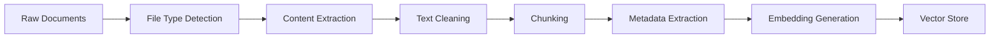
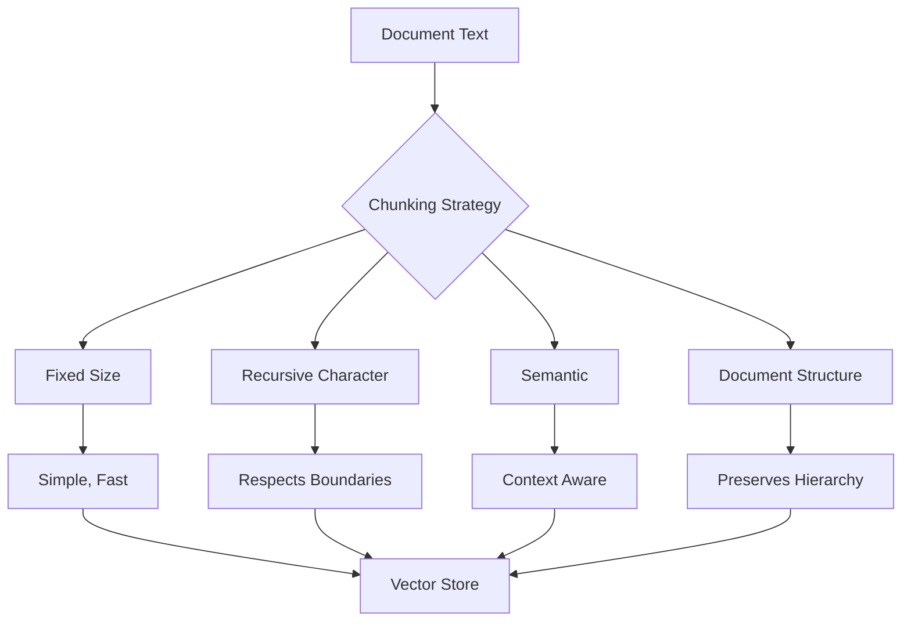
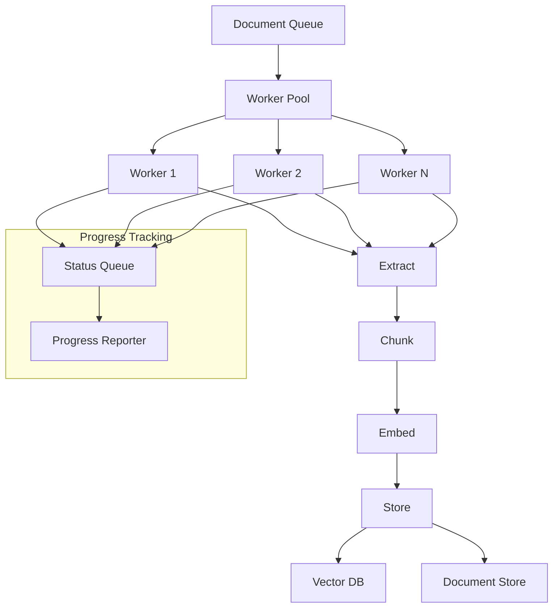

# How to Implement Document Ingestion

Author: [nawazdhandala](https://github.com/nawazdhandala)

Tags: RAG, Document Processing, LLM, Data Pipeline

Description: Learn to implement document ingestion for processing and preparing documents for RAG systems.

---

Document ingestion is the foundation of any Retrieval Augmented Generation (RAG) system. Before your LLM can answer questions about your documents, you need to extract, process, chunk, and store them efficiently. This guide covers the complete pipeline from raw files to vector-ready embeddings.

## RAG Document Ingestion Pipeline Overview



The pipeline transforms raw documents through several stages, each critical for retrieval quality. Let's implement each component.

## Project Structure

```
rag-ingestion/
├── src/
│   ├── extractors/
│   │   ├── base.py
│   │   ├── pdf_extractor.py
│   │   ├── docx_extractor.py
│   │   ├── html_extractor.py
│   │   └── markdown_extractor.py
│   ├── processors/
│   │   ├── chunker.py
│   │   ├── cleaner.py
│   │   └── metadata.py
│   ├── pipeline/
│   │   ├── ingestion.py
│   │   └── batch.py
│   └── storage/
│       └── vector_store.py
├── config.py
└── main.py
```

## File Type Detection and Routing

First, we need to detect file types and route them to the appropriate extractor.

```python
# src/extractors/base.py
"""
Base extractor class and file type detection for document ingestion.
Provides a unified interface for all document extractors.
"""

import magic
from pathlib import Path
from abc import ABC, abstractmethod
from dataclasses import dataclass
from typing import Optional, Dict, Any, List


@dataclass
class ExtractedDocument:
    """
    Represents a document after content extraction.
    Contains the raw text and associated metadata.
    """
    content: str                          # The extracted text content
    metadata: Dict[str, Any]              # Document metadata (title, author, etc.)
    source_path: str                      # Original file path
    file_type: str                        # Detected MIME type
    extraction_method: str                # Which extractor was used
    page_count: Optional[int] = None      # Number of pages (if applicable)
    word_count: Optional[int] = None      # Total word count


class BaseExtractor(ABC):
    """
    Abstract base class for document extractors.
    All file-type-specific extractors inherit from this class.
    """

    # List of MIME types this extractor can handle
    supported_mimetypes: List[str] = []

    @abstractmethod
    def extract(self, file_path: Path) -> ExtractedDocument:
        """
        Extract text content from a document.

        Args:
            file_path: Path to the document file

        Returns:
            ExtractedDocument containing the extracted content and metadata
        """
        pass

    @abstractmethod
    def can_handle(self, mimetype: str) -> bool:
        """
        Check if this extractor can handle the given MIME type.

        Args:
            mimetype: The MIME type to check

        Returns:
            True if this extractor can process the file type
        """
        pass


class FileTypeDetector:
    """
    Detects file types using both magic bytes and file extensions.
    Magic bytes are more reliable than extensions for security.
    """

    def __init__(self):
        # Initialize libmagic for MIME type detection
        self.magic = magic.Magic(mime=True)

        # Fallback extension mappings for edge cases
        self.extension_map = {
            '.pdf': 'application/pdf',
            '.docx': 'application/vnd.openxmlformats-officedocument.wordprocessingml.document',
            '.doc': 'application/msword',
            '.txt': 'text/plain',
            '.md': 'text/markdown',
            '.html': 'text/html',
            '.htm': 'text/html',
            '.json': 'application/json',
            '.csv': 'text/csv',
            '.xlsx': 'application/vnd.openxmlformats-officedocument.spreadsheetml.sheet',
            '.pptx': 'application/vnd.openxmlformats-officedocument.presentationml.presentation',
        }

    def detect(self, file_path: Path) -> str:
        """
        Detect the MIME type of a file.
        Uses magic bytes first, falls back to extension if needed.

        Args:
            file_path: Path to the file

        Returns:
            MIME type string (e.g., 'application/pdf')
        """
        try:
            # Read first 2048 bytes for magic number detection
            with open(file_path, 'rb') as f:
                header = f.read(2048)

            # Detect using magic bytes
            mimetype = self.magic.from_buffer(header)

            # Handle generic types by checking extension
            if mimetype in ('application/octet-stream', 'text/plain'):
                ext = file_path.suffix.lower()
                if ext in self.extension_map:
                    return self.extension_map[ext]

            return mimetype

        except Exception as e:
            # Fallback to extension-based detection
            ext = file_path.suffix.lower()
            return self.extension_map.get(ext, 'application/octet-stream')


class ExtractorRegistry:
    """
    Registry that maps file types to their extractors.
    Automatically routes documents to the correct extractor.
    """

    def __init__(self):
        self.extractors: List[BaseExtractor] = []
        self.detector = FileTypeDetector()

    def register(self, extractor: BaseExtractor) -> None:
        """
        Register an extractor with the registry.

        Args:
            extractor: The extractor instance to register
        """
        self.extractors.append(extractor)

    def get_extractor(self, file_path: Path) -> Optional[BaseExtractor]:
        """
        Get the appropriate extractor for a file.

        Args:
            file_path: Path to the file

        Returns:
            The extractor that can handle this file type, or None
        """
        mimetype = self.detector.detect(file_path)

        for extractor in self.extractors:
            if extractor.can_handle(mimetype):
                return extractor

        return None
```

## PDF Extraction

PDF files are common in enterprise RAG systems. We handle both text-based and scanned PDFs.

```python
# src/extractors/pdf_extractor.py
"""
PDF document extractor with support for both text-based and scanned PDFs.
Uses PyMuPDF for text extraction and optional OCR for images.
"""

import fitz  # PyMuPDF
from pathlib import Path
from typing import List, Dict, Any, Optional
import re

from .base import BaseExtractor, ExtractedDocument


class PDFExtractor(BaseExtractor):
    """
    Extracts text content from PDF documents.
    Supports text extraction, metadata parsing, and optional OCR.
    """

    supported_mimetypes = ['application/pdf']

    def __init__(self, enable_ocr: bool = False, ocr_language: str = 'eng'):
        """
        Initialize the PDF extractor.

        Args:
            enable_ocr: Whether to use OCR for scanned pages
            ocr_language: Language code for OCR (default: English)
        """
        self.enable_ocr = enable_ocr
        self.ocr_language = ocr_language

        # Only import OCR dependencies if enabled
        if enable_ocr:
            try:
                import pytesseract
                from PIL import Image
                self.pytesseract = pytesseract
                self.Image = Image
            except ImportError:
                raise ImportError(
                    "OCR requires pytesseract and Pillow. "
                    "Install with: pip install pytesseract Pillow"
                )

    def can_handle(self, mimetype: str) -> bool:
        """Check if this extractor handles the given MIME type."""
        return mimetype in self.supported_mimetypes

    def extract(self, file_path: Path) -> ExtractedDocument:
        """
        Extract text and metadata from a PDF file.

        Args:
            file_path: Path to the PDF file

        Returns:
            ExtractedDocument with content and metadata
        """
        doc = fitz.open(file_path)

        # Extract metadata from PDF properties
        metadata = self._extract_metadata(doc)

        # Extract text from all pages
        pages_text = []
        for page_num, page in enumerate(doc):
            page_text = self._extract_page_text(page, page_num)
            if page_text.strip():
                pages_text.append(page_text)

        # Combine all page text
        content = "\n\n".join(pages_text)

        # Calculate word count
        word_count = len(content.split())

        doc.close()

        return ExtractedDocument(
            content=content,
            metadata=metadata,
            source_path=str(file_path),
            file_type='application/pdf',
            extraction_method='pymupdf' + ('+ocr' if self.enable_ocr else ''),
            page_count=len(pages_text),
            word_count=word_count
        )

    def _extract_metadata(self, doc: fitz.Document) -> Dict[str, Any]:
        """
        Extract metadata from PDF document properties.

        Args:
            doc: PyMuPDF document object

        Returns:
            Dictionary of metadata fields
        """
        pdf_metadata = doc.metadata

        return {
            'title': pdf_metadata.get('title', ''),
            'author': pdf_metadata.get('author', ''),
            'subject': pdf_metadata.get('subject', ''),
            'keywords': pdf_metadata.get('keywords', ''),
            'creator': pdf_metadata.get('creator', ''),
            'producer': pdf_metadata.get('producer', ''),
            'creation_date': pdf_metadata.get('creationDate', ''),
            'modification_date': pdf_metadata.get('modDate', ''),
            'page_count': doc.page_count,
        }

    def _extract_page_text(self, page: fitz.Page, page_num: int) -> str:
        """
        Extract text from a single PDF page.
        Falls back to OCR if text extraction yields poor results.

        Args:
            page: PyMuPDF page object
            page_num: Page number (0-indexed)

        Returns:
            Extracted text from the page
        """
        # Try standard text extraction first
        text = page.get_text("text")

        # Check if page appears to be scanned (low text density)
        if self.enable_ocr and self._is_likely_scanned(page, text):
            text = self._ocr_page(page)

        # Clean up extracted text
        text = self._clean_text(text)

        return text

    def _is_likely_scanned(self, page: fitz.Page, text: str) -> bool:
        """
        Determine if a page is likely a scanned image.

        Args:
            page: PyMuPDF page object
            text: Already extracted text

        Returns:
            True if the page appears to be scanned
        """
        # Check text density relative to page size
        page_area = page.rect.width * page.rect.height
        text_length = len(text.strip())

        # Very low text density suggests a scanned page
        if text_length < 50 and page_area > 100000:
            # Also check if page has images
            images = page.get_images()
            return len(images) > 0

        return False

    def _ocr_page(self, page: fitz.Page) -> str:
        """
        Perform OCR on a PDF page.

        Args:
            page: PyMuPDF page object

        Returns:
            OCR-extracted text
        """
        # Render page to image at 300 DPI for good OCR quality
        mat = fitz.Matrix(300/72, 300/72)
        pix = page.get_pixmap(matrix=mat)

        # Convert to PIL Image
        img = self.Image.frombytes("RGB", [pix.width, pix.height], pix.samples)

        # Run OCR
        text = self.pytesseract.image_to_string(img, lang=self.ocr_language)

        return text

    def _clean_text(self, text: str) -> str:
        """
        Clean up extracted text by removing artifacts.

        Args:
            text: Raw extracted text

        Returns:
            Cleaned text
        """
        # Remove excessive whitespace
        text = re.sub(r'\s+', ' ', text)

        # Remove page break artifacts
        text = re.sub(r'\x0c', '\n\n', text)

        # Fix hyphenation at line breaks
        text = re.sub(r'(\w)-\s+(\w)', r'\1\2', text)

        return text.strip()
```

## DOCX and Other Office Documents

```python
# src/extractors/docx_extractor.py
"""
Microsoft Word document extractor.
Extracts text while preserving document structure.
"""

from pathlib import Path
from typing import Dict, Any, List
import zipfile
import xml.etree.ElementTree as ET

from docx import Document
from docx.opc.exceptions import PackageNotFoundError

from .base import BaseExtractor, ExtractedDocument


class DocxExtractor(BaseExtractor):
    """
    Extracts text from Microsoft Word (.docx) documents.
    Preserves paragraph structure and extracts document properties.
    """

    supported_mimetypes = [
        'application/vnd.openxmlformats-officedocument.wordprocessingml.document'
    ]

    def can_handle(self, mimetype: str) -> bool:
        """Check if this extractor handles the given MIME type."""
        return mimetype in self.supported_mimetypes

    def extract(self, file_path: Path) -> ExtractedDocument:
        """
        Extract text and metadata from a Word document.

        Args:
            file_path: Path to the .docx file

        Returns:
            ExtractedDocument with content and metadata
        """
        try:
            doc = Document(file_path)
        except PackageNotFoundError:
            raise ValueError(f"Invalid or corrupted Word document: {file_path}")

        # Extract document properties
        metadata = self._extract_metadata(doc)

        # Extract text from paragraphs
        paragraphs = []
        for para in doc.paragraphs:
            text = para.text.strip()
            if text:
                # Preserve heading structure
                if para.style.name.startswith('Heading'):
                    level = self._get_heading_level(para.style.name)
                    text = f"{'#' * level} {text}"
                paragraphs.append(text)

        # Extract text from tables
        for table in doc.tables:
            table_text = self._extract_table(table)
            if table_text:
                paragraphs.append(table_text)

        content = "\n\n".join(paragraphs)

        return ExtractedDocument(
            content=content,
            metadata=metadata,
            source_path=str(file_path),
            file_type='application/vnd.openxmlformats-officedocument.wordprocessingml.document',
            extraction_method='python-docx',
            word_count=len(content.split())
        )

    def _extract_metadata(self, doc: Document) -> Dict[str, Any]:
        """
        Extract document properties from Word file.

        Args:
            doc: python-docx Document object

        Returns:
            Dictionary of metadata
        """
        props = doc.core_properties

        return {
            'title': props.title or '',
            'author': props.author or '',
            'subject': props.subject or '',
            'keywords': props.keywords or '',
            'created': str(props.created) if props.created else '',
            'modified': str(props.modified) if props.modified else '',
            'last_modified_by': props.last_modified_by or '',
            'category': props.category or '',
        }

    def _get_heading_level(self, style_name: str) -> int:
        """
        Get the heading level from a style name.

        Args:
            style_name: Word style name (e.g., 'Heading 1')

        Returns:
            Heading level (1-6)
        """
        try:
            # Extract number from style name
            level = int(style_name.split()[-1])
            return min(level, 6)  # Cap at 6 for Markdown compatibility
        except (ValueError, IndexError):
            return 1

    def _extract_table(self, table) -> str:
        """
        Extract text from a Word table in Markdown format.

        Args:
            table: python-docx Table object

        Returns:
            Table text in Markdown format
        """
        rows = []
        for row in table.rows:
            cells = [cell.text.strip() for cell in row.cells]
            rows.append("| " + " | ".join(cells) + " |")

        if rows:
            # Add header separator after first row
            col_count = len(table.rows[0].cells)
            separator = "| " + " | ".join(["---"] * col_count) + " |"
            rows.insert(1, separator)

        return "\n".join(rows)
```

## HTML and Markdown Extraction

```python
# src/extractors/html_extractor.py
"""
HTML document extractor with tag-aware text extraction.
Removes boilerplate while preserving content structure.
"""

from pathlib import Path
from typing import Dict, Any, List, Set
import re

from bs4 import BeautifulSoup, Comment, NavigableString
import html2text

from .base import BaseExtractor, ExtractedDocument


class HTMLExtractor(BaseExtractor):
    """
    Extracts text from HTML documents.
    Removes scripts, styles, and boilerplate content.
    """

    supported_mimetypes = ['text/html']

    # Tags that typically contain main content
    CONTENT_TAGS = {'article', 'main', 'section', 'div'}

    # Tags to completely remove
    REMOVE_TAGS = {'script', 'style', 'nav', 'footer', 'header', 'aside', 'form'}

    def __init__(self, extract_links: bool = False, body_width: int = 0):
        """
        Initialize the HTML extractor.

        Args:
            extract_links: Whether to preserve hyperlinks in output
            body_width: Line width for text wrapping (0 = no wrapping)
        """
        self.h2t = html2text.HTML2Text()
        self.h2t.ignore_links = not extract_links
        self.h2t.ignore_images = True
        self.h2t.body_width = body_width
        self.h2t.ignore_emphasis = False

    def can_handle(self, mimetype: str) -> bool:
        """Check if this extractor handles the given MIME type."""
        return mimetype in self.supported_mimetypes

    def extract(self, file_path: Path) -> ExtractedDocument:
        """
        Extract text from an HTML file.

        Args:
            file_path: Path to the HTML file

        Returns:
            ExtractedDocument with cleaned content
        """
        with open(file_path, 'r', encoding='utf-8', errors='ignore') as f:
            html_content = f.read()

        # Parse HTML
        soup = BeautifulSoup(html_content, 'html.parser')

        # Extract metadata from head
        metadata = self._extract_metadata(soup)

        # Remove unwanted elements
        self._remove_boilerplate(soup)

        # Convert to clean text
        content = self.h2t.handle(str(soup))

        # Additional cleaning
        content = self._clean_text(content)

        return ExtractedDocument(
            content=content,
            metadata=metadata,
            source_path=str(file_path),
            file_type='text/html',
            extraction_method='beautifulsoup+html2text',
            word_count=len(content.split())
        )

    def _extract_metadata(self, soup: BeautifulSoup) -> Dict[str, Any]:
        """
        Extract metadata from HTML head section.

        Args:
            soup: BeautifulSoup object

        Returns:
            Dictionary of metadata
        """
        metadata = {}

        # Title
        title_tag = soup.find('title')
        metadata['title'] = title_tag.text.strip() if title_tag else ''

        # Meta tags
        for meta in soup.find_all('meta'):
            name = meta.get('name', meta.get('property', ''))
            content = meta.get('content', '')

            if name and content:
                # Handle common meta tags
                if name in ('description', 'og:description'):
                    metadata['description'] = content
                elif name in ('author', 'og:author'):
                    metadata['author'] = content
                elif name == 'keywords':
                    metadata['keywords'] = content
                elif name in ('og:title', 'twitter:title'):
                    if not metadata.get('title'):
                        metadata['title'] = content

        return metadata

    def _remove_boilerplate(self, soup: BeautifulSoup) -> None:
        """
        Remove non-content elements from HTML.

        Args:
            soup: BeautifulSoup object (modified in place)
        """
        # Remove comments
        for comment in soup.find_all(string=lambda x: isinstance(x, Comment)):
            comment.extract()

        # Remove unwanted tags
        for tag in self.REMOVE_TAGS:
            for element in soup.find_all(tag):
                element.decompose()

        # Remove hidden elements
        for element in soup.find_all(style=re.compile(r'display:\s*none')):
            element.decompose()

    def _clean_text(self, text: str) -> str:
        """
        Clean up converted text.

        Args:
            text: Raw converted text

        Returns:
            Cleaned text
        """
        # Remove excessive blank lines
        text = re.sub(r'\n{3,}', '\n\n', text)

        # Remove leading/trailing whitespace from lines
        lines = [line.strip() for line in text.split('\n')]
        text = '\n'.join(lines)

        return text.strip()


class MarkdownExtractor(BaseExtractor):
    """
    Extracts content from Markdown files.
    Preserves structure while extracting metadata from frontmatter.
    """

    supported_mimetypes = ['text/markdown', 'text/x-markdown']

    def can_handle(self, mimetype: str) -> bool:
        """Check if this extractor handles the given MIME type."""
        return mimetype in self.supported_mimetypes

    def extract(self, file_path: Path) -> ExtractedDocument:
        """
        Extract content from a Markdown file.

        Args:
            file_path: Path to the Markdown file

        Returns:
            ExtractedDocument with content and frontmatter metadata
        """
        with open(file_path, 'r', encoding='utf-8') as f:
            content = f.read()

        # Extract YAML frontmatter if present
        metadata, content = self._extract_frontmatter(content)

        # Extract title from first heading if not in frontmatter
        if not metadata.get('title'):
            metadata['title'] = self._extract_title(content)

        return ExtractedDocument(
            content=content.strip(),
            metadata=metadata,
            source_path=str(file_path),
            file_type='text/markdown',
            extraction_method='direct',
            word_count=len(content.split())
        )

    def _extract_frontmatter(self, content: str) -> tuple[Dict[str, Any], str]:
        """
        Extract YAML frontmatter from Markdown content.

        Args:
            content: Full Markdown content

        Returns:
            Tuple of (metadata dict, content without frontmatter)
        """
        import yaml

        # Check for YAML frontmatter
        if content.startswith('---'):
            parts = content.split('---', 2)
            if len(parts) >= 3:
                try:
                    metadata = yaml.safe_load(parts[1])
                    return metadata or {}, parts[2]
                except yaml.YAMLError:
                    pass

        return {}, content

    def _extract_title(self, content: str) -> str:
        """
        Extract title from first Markdown heading.

        Args:
            content: Markdown content

        Returns:
            Title string or empty string
        """
        lines = content.split('\n')
        for line in lines:
            # Check for ATX-style heading
            if line.startswith('# '):
                return line[2:].strip()
            # Check for Setext-style heading
            if lines.index(line) < len(lines) - 1:
                next_line = lines[lines.index(line) + 1]
                if next_line.startswith('==='):
                    return line.strip()
        return ''
```

## Text Chunking Strategies

Chunking is critical for RAG performance. Different strategies work for different use cases.



```python
# src/processors/chunker.py
"""
Text chunking strategies for RAG document processing.
Different strategies optimize for different retrieval patterns.
"""

from abc import ABC, abstractmethod
from dataclasses import dataclass
from typing import List, Optional, Callable
import re


@dataclass
class Chunk:
    """
    Represents a single chunk of text with its metadata.
    """
    text: str                           # The chunk content
    chunk_index: int                    # Position in the document
    start_char: int                     # Character offset in original document
    end_char: int                       # End character offset
    metadata: dict                      # Inherited and chunk-specific metadata


class BaseChunker(ABC):
    """
    Abstract base class for text chunking strategies.
    """

    @abstractmethod
    def chunk(self, text: str, metadata: dict = None) -> List[Chunk]:
        """
        Split text into chunks.

        Args:
            text: The text to chunk
            metadata: Metadata to attach to each chunk

        Returns:
            List of Chunk objects
        """
        pass


class RecursiveCharacterChunker(BaseChunker):
    """
    Recursively splits text on natural boundaries.
    Tries larger separators first, then falls back to smaller ones.
    This is the most commonly used strategy for general documents.
    """

    def __init__(
        self,
        chunk_size: int = 1000,
        chunk_overlap: int = 200,
        separators: List[str] = None
    ):
        """
        Initialize the chunker.

        Args:
            chunk_size: Target size for each chunk in characters
            chunk_overlap: Number of characters to overlap between chunks
            separators: List of separators to try, in order of preference
        """
        self.chunk_size = chunk_size
        self.chunk_overlap = chunk_overlap

        # Default separators from largest to smallest boundary
        self.separators = separators or [
            "\n\n",     # Paragraph breaks
            "\n",       # Line breaks
            ". ",       # Sentence endings
            "? ",       # Question marks
            "! ",       # Exclamation marks
            "; ",       # Semicolons
            ", ",       # Commas
            " ",        # Words
            ""          # Characters (last resort)
        ]

    def chunk(self, text: str, metadata: dict = None) -> List[Chunk]:
        """
        Split text into overlapping chunks using recursive character splitting.

        Args:
            text: The text to chunk
            metadata: Metadata to attach to each chunk

        Returns:
            List of Chunk objects
        """
        metadata = metadata or {}
        chunks = []

        # Recursively split the text
        splits = self._split_text(text, self.separators)

        # Merge splits into chunks of appropriate size
        current_chunk = []
        current_length = 0
        current_start = 0
        char_position = 0

        for split in splits:
            split_length = len(split)

            # If adding this split exceeds chunk size, finalize current chunk
            if current_length + split_length > self.chunk_size and current_chunk:
                chunk_text = "".join(current_chunk)
                chunks.append(Chunk(
                    text=chunk_text,
                    chunk_index=len(chunks),
                    start_char=current_start,
                    end_char=current_start + len(chunk_text),
                    metadata={**metadata, 'chunk_size': len(chunk_text)}
                ))

                # Calculate overlap
                overlap_text = self._get_overlap(current_chunk)
                current_chunk = [overlap_text] if overlap_text else []
                current_length = len(overlap_text) if overlap_text else 0
                current_start = char_position - current_length

            current_chunk.append(split)
            current_length += split_length
            char_position += split_length

        # Don't forget the last chunk
        if current_chunk:
            chunk_text = "".join(current_chunk)
            chunks.append(Chunk(
                text=chunk_text,
                chunk_index=len(chunks),
                start_char=current_start,
                end_char=current_start + len(chunk_text),
                metadata={**metadata, 'chunk_size': len(chunk_text)}
            ))

        return chunks

    def _split_text(self, text: str, separators: List[str]) -> List[str]:
        """
        Recursively split text using the given separators.

        Args:
            text: Text to split
            separators: List of separators to try

        Returns:
            List of text segments
        """
        if not separators:
            return [text]

        separator = separators[0]
        remaining_separators = separators[1:]

        if separator == "":
            # Character-level split as last resort
            return list(text)

        splits = text.split(separator)

        # Re-add the separator to maintain text integrity
        result = []
        for i, split in enumerate(splits):
            if i < len(splits) - 1:
                result.append(split + separator)
            else:
                result.append(split)

        # Recursively split any segments that are still too large
        final_splits = []
        for split in result:
            if len(split) > self.chunk_size and remaining_separators:
                final_splits.extend(self._split_text(split, remaining_separators))
            else:
                final_splits.append(split)

        return final_splits

    def _get_overlap(self, chunks: List[str]) -> str:
        """
        Get the overlap text from the end of current chunks.

        Args:
            chunks: List of text segments in current chunk

        Returns:
            Text to use as overlap for next chunk
        """
        full_text = "".join(chunks)
        if len(full_text) <= self.chunk_overlap:
            return full_text
        return full_text[-self.chunk_overlap:]


class SemanticChunker(BaseChunker):
    """
    Chunks text based on semantic similarity.
    Groups sentences that are semantically related together.
    Requires an embedding model.
    """

    def __init__(
        self,
        embedding_function: Callable[[str], List[float]],
        similarity_threshold: float = 0.5,
        min_chunk_size: int = 100,
        max_chunk_size: int = 2000
    ):
        """
        Initialize the semantic chunker.

        Args:
            embedding_function: Function that converts text to embeddings
            similarity_threshold: Minimum cosine similarity to group sentences
            min_chunk_size: Minimum chunk size in characters
            max_chunk_size: Maximum chunk size in characters
        """
        self.embed = embedding_function
        self.similarity_threshold = similarity_threshold
        self.min_chunk_size = min_chunk_size
        self.max_chunk_size = max_chunk_size

    def chunk(self, text: str, metadata: dict = None) -> List[Chunk]:
        """
        Split text into semantically coherent chunks.

        Args:
            text: The text to chunk
            metadata: Metadata to attach to each chunk

        Returns:
            List of Chunk objects
        """
        import numpy as np

        metadata = metadata or {}

        # Split into sentences
        sentences = self._split_sentences(text)

        if not sentences:
            return []

        # Get embeddings for all sentences
        embeddings = [self.embed(s) for s in sentences]

        # Group sentences by semantic similarity
        chunks = []
        current_group = [0]  # Start with first sentence
        current_embedding = embeddings[0]
        current_start = 0

        for i in range(1, len(sentences)):
            # Calculate similarity with current group
            similarity = self._cosine_similarity(current_embedding, embeddings[i])

            current_text = " ".join([sentences[j] for j in current_group])

            # Check if we should add to current group or start new one
            if (similarity >= self.similarity_threshold and
                len(current_text) + len(sentences[i]) <= self.max_chunk_size):
                current_group.append(i)
                # Update group embedding (running average)
                current_embedding = np.mean(
                    [embeddings[j] for j in current_group],
                    axis=0
                ).tolist()
            else:
                # Finalize current chunk if it meets minimum size
                if len(current_text) >= self.min_chunk_size:
                    chunks.append(Chunk(
                        text=current_text,
                        chunk_index=len(chunks),
                        start_char=current_start,
                        end_char=current_start + len(current_text),
                        metadata={
                            **metadata,
                            'semantic_coherence': float(np.mean([
                                self._cosine_similarity(embeddings[current_group[0]], embeddings[j])
                                for j in current_group
                            ]))
                        }
                    ))

                # Start new group
                current_group = [i]
                current_embedding = embeddings[i]
                current_start = sum(len(sentences[j]) + 1 for j in range(i))

        # Handle last group
        if current_group:
            current_text = " ".join([sentences[j] for j in current_group])
            if len(current_text) >= self.min_chunk_size:
                chunks.append(Chunk(
                    text=current_text,
                    chunk_index=len(chunks),
                    start_char=current_start,
                    end_char=current_start + len(current_text),
                    metadata=metadata
                ))

        return chunks

    def _split_sentences(self, text: str) -> List[str]:
        """
        Split text into sentences.

        Args:
            text: Text to split

        Returns:
            List of sentences
        """
        # Simple sentence splitting (for production, use spaCy or similar)
        sentence_pattern = r'(?<=[.!?])\s+'
        sentences = re.split(sentence_pattern, text)
        return [s.strip() for s in sentences if s.strip()]

    def _cosine_similarity(self, a: List[float], b: List[float]) -> float:
        """
        Calculate cosine similarity between two vectors.

        Args:
            a: First vector
            b: Second vector

        Returns:
            Cosine similarity score
        """
        import numpy as np
        a = np.array(a)
        b = np.array(b)
        return float(np.dot(a, b) / (np.linalg.norm(a) * np.linalg.norm(b)))


class StructureAwareChunker(BaseChunker):
    """
    Chunks based on document structure (headings, sections).
    Best for well-structured documents like documentation or reports.
    """

    def __init__(
        self,
        max_chunk_size: int = 2000,
        preserve_headings: bool = True
    ):
        """
        Initialize the structure-aware chunker.

        Args:
            max_chunk_size: Maximum characters per chunk
            preserve_headings: Whether to prepend section heading to each chunk
        """
        self.max_chunk_size = max_chunk_size
        self.preserve_headings = preserve_headings

    def chunk(self, text: str, metadata: dict = None) -> List[Chunk]:
        """
        Split text based on document structure.

        Args:
            text: The text to chunk (Markdown or plain text with headings)
            metadata: Metadata to attach to each chunk

        Returns:
            List of Chunk objects
        """
        metadata = metadata or {}
        chunks = []

        # Parse document structure
        sections = self._parse_sections(text)

        char_position = 0

        for section in sections:
            heading = section['heading']
            content = section['content']
            level = section['level']

            # If section is small enough, keep it as one chunk
            if len(content) <= self.max_chunk_size:
                chunk_text = content
                if self.preserve_headings and heading:
                    chunk_text = f"{'#' * level} {heading}\n\n{content}"

                chunks.append(Chunk(
                    text=chunk_text,
                    chunk_index=len(chunks),
                    start_char=char_position,
                    end_char=char_position + len(content),
                    metadata={
                        **metadata,
                        'section_heading': heading,
                        'section_level': level
                    }
                ))
            else:
                # Split large sections using recursive chunker
                sub_chunker = RecursiveCharacterChunker(
                    chunk_size=self.max_chunk_size,
                    chunk_overlap=100
                )
                sub_chunks = sub_chunker.chunk(content)

                for sub_chunk in sub_chunks:
                    chunk_text = sub_chunk.text
                    if self.preserve_headings and heading:
                        chunk_text = f"{'#' * level} {heading}\n\n{chunk_text}"

                    chunks.append(Chunk(
                        text=chunk_text,
                        chunk_index=len(chunks),
                        start_char=char_position + sub_chunk.start_char,
                        end_char=char_position + sub_chunk.end_char,
                        metadata={
                            **metadata,
                            'section_heading': heading,
                            'section_level': level,
                            'is_partial_section': True
                        }
                    ))

            char_position += len(section['raw'])

        return chunks

    def _parse_sections(self, text: str) -> List[dict]:
        """
        Parse document into sections based on headings.

        Args:
            text: Document text

        Returns:
            List of section dictionaries
        """
        sections = []

        # Match Markdown headings
        heading_pattern = r'^(#{1,6})\s+(.+)$'

        lines = text.split('\n')
        current_section = {
            'heading': '',
            'level': 0,
            'content': [],
            'raw': ''
        }

        for line in lines:
            match = re.match(heading_pattern, line)

            if match:
                # Save current section if it has content
                if current_section['content']:
                    current_section['content'] = '\n'.join(current_section['content']).strip()
                    current_section['raw'] = (
                        (f"{'#' * current_section['level']} {current_section['heading']}\n"
                         if current_section['heading'] else '') +
                        current_section['content']
                    )
                    sections.append(current_section)

                # Start new section
                current_section = {
                    'heading': match.group(2),
                    'level': len(match.group(1)),
                    'content': [],
                    'raw': ''
                }
            else:
                current_section['content'].append(line)

        # Don't forget last section
        if current_section['content']:
            current_section['content'] = '\n'.join(current_section['content']).strip()
            current_section['raw'] = (
                (f"{'#' * current_section['level']} {current_section['heading']}\n"
                 if current_section['heading'] else '') +
                current_section['content']
            )
            sections.append(current_section)

        return sections
```

## Metadata Extraction

Good metadata improves retrieval precision by enabling filtering.

```python
# src/processors/metadata.py
"""
Metadata extraction and enrichment for documents.
Extracts both explicit metadata and inferred properties.
"""

from dataclasses import dataclass
from typing import Dict, Any, List, Optional
from datetime import datetime
import hashlib
import re
from pathlib import Path


@dataclass
class EnrichedMetadata:
    """
    Contains all metadata for a document.
    """
    # Source information
    source_path: str
    file_name: str
    file_extension: str
    file_size_bytes: int

    # Content hashes for deduplication
    content_hash: str

    # Timestamps
    created_at: Optional[datetime]
    modified_at: Optional[datetime]
    ingested_at: datetime

    # Document properties
    title: str
    author: str
    language: str
    word_count: int
    char_count: int

    # Extracted entities
    topics: List[str]
    entities: Dict[str, List[str]]

    # Custom metadata
    custom: Dict[str, Any]


class MetadataExtractor:
    """
    Extracts and enriches document metadata.
    Combines file-level, content-level, and inferred metadata.
    """

    def __init__(self, detect_language: bool = True, extract_entities: bool = False):
        """
        Initialize the metadata extractor.

        Args:
            detect_language: Whether to detect document language
            extract_entities: Whether to extract named entities (requires spaCy)
        """
        self.detect_language = detect_language
        self.extract_entities = extract_entities

        if detect_language:
            try:
                from langdetect import detect
                self.lang_detect = detect
            except ImportError:
                self.detect_language = False

        if extract_entities:
            try:
                import spacy
                self.nlp = spacy.load("en_core_web_sm")
            except (ImportError, OSError):
                self.extract_entities = False

    def extract(
        self,
        content: str,
        file_path: Path,
        document_metadata: Dict[str, Any] = None
    ) -> EnrichedMetadata:
        """
        Extract comprehensive metadata from a document.

        Args:
            content: The document text content
            file_path: Path to the source file
            document_metadata: Metadata extracted during content extraction

        Returns:
            EnrichedMetadata object
        """
        document_metadata = document_metadata or {}

        # File-level metadata
        stat = file_path.stat()

        # Content hash for deduplication
        content_hash = hashlib.sha256(content.encode()).hexdigest()

        # Language detection
        language = "unknown"
        if self.detect_language and content:
            try:
                language = self.lang_detect(content[:1000])
            except Exception:
                pass

        # Entity extraction
        entities = {}
        if self.extract_entities and content:
            entities = self._extract_entities(content)

        # Topic extraction (simple keyword-based)
        topics = self._extract_topics(content)

        return EnrichedMetadata(
            source_path=str(file_path),
            file_name=file_path.name,
            file_extension=file_path.suffix.lower(),
            file_size_bytes=stat.st_size,
            content_hash=content_hash,
            created_at=datetime.fromtimestamp(stat.st_ctime),
            modified_at=datetime.fromtimestamp(stat.st_mtime),
            ingested_at=datetime.now(),
            title=document_metadata.get('title', file_path.stem),
            author=document_metadata.get('author', ''),
            language=language,
            word_count=len(content.split()),
            char_count=len(content),
            topics=topics,
            entities=entities,
            custom=document_metadata
        )

    def _extract_entities(self, content: str) -> Dict[str, List[str]]:
        """
        Extract named entities using spaCy.

        Args:
            content: Document text

        Returns:
            Dictionary mapping entity types to lists of entities
        """
        # Process only first 100K chars to avoid memory issues
        doc = self.nlp(content[:100000])

        entities = {}
        for ent in doc.ents:
            if ent.label_ not in entities:
                entities[ent.label_] = []
            if ent.text not in entities[ent.label_]:
                entities[ent.label_].append(ent.text)

        return entities

    def _extract_topics(self, content: str, max_topics: int = 10) -> List[str]:
        """
        Extract topic keywords from content.
        Uses simple TF-based extraction.

        Args:
            content: Document text
            max_topics: Maximum number of topics to return

        Returns:
            List of topic keywords
        """
        # Simple word frequency analysis
        words = re.findall(r'\b[a-zA-Z]{4,}\b', content.lower())

        # Filter common words
        stopwords = {
            'that', 'this', 'with', 'from', 'have', 'been', 'were', 'they',
            'their', 'which', 'would', 'could', 'should', 'about', 'there',
            'when', 'what', 'where', 'will', 'more', 'some', 'than', 'into',
            'only', 'other', 'also', 'just', 'your', 'like', 'make', 'made'
        }

        filtered_words = [w for w in words if w not in stopwords]

        # Count frequencies
        freq = {}
        for word in filtered_words:
            freq[word] = freq.get(word, 0) + 1

        # Sort by frequency and return top topics
        sorted_words = sorted(freq.items(), key=lambda x: x[1], reverse=True)

        return [word for word, count in sorted_words[:max_topics]]
```

## Batch Processing Pipeline

For processing large document collections efficiently.



```python
# src/pipeline/batch.py
"""
Batch processing pipeline for document ingestion.
Handles parallel processing, progress tracking, and error recovery.
"""

import asyncio
from concurrent.futures import ProcessPoolExecutor, as_completed
from dataclasses import dataclass, field
from pathlib import Path
from typing import List, Dict, Any, Optional, Callable
from datetime import datetime
import json
import logging
from enum import Enum


class DocumentStatus(Enum):
    """Status of a document in the processing pipeline."""
    PENDING = "pending"
    PROCESSING = "processing"
    COMPLETED = "completed"
    FAILED = "failed"
    SKIPPED = "skipped"


@dataclass
class ProcessingResult:
    """Result of processing a single document."""
    file_path: str
    status: DocumentStatus
    chunks_created: int = 0
    error_message: Optional[str] = None
    processing_time_ms: float = 0
    metadata: Dict[str, Any] = field(default_factory=dict)


@dataclass
class BatchProgress:
    """Progress tracking for batch processing."""
    total_documents: int
    processed: int = 0
    successful: int = 0
    failed: int = 0
    skipped: int = 0
    start_time: datetime = field(default_factory=datetime.now)

    @property
    def completion_percentage(self) -> float:
        """Calculate completion percentage."""
        if self.total_documents == 0:
            return 100.0
        return (self.processed / self.total_documents) * 100

    @property
    def elapsed_seconds(self) -> float:
        """Calculate elapsed time in seconds."""
        return (datetime.now() - self.start_time).total_seconds()

    @property
    def documents_per_second(self) -> float:
        """Calculate processing speed."""
        if self.elapsed_seconds == 0:
            return 0
        return self.processed / self.elapsed_seconds


class BatchProcessor:
    """
    Processes documents in batches with parallel execution.
    Handles retries, progress tracking, and checkpointing.
    """

    def __init__(
        self,
        extractor_registry,
        chunker,
        embedding_function: Callable[[str], List[float]],
        vector_store,
        max_workers: int = 4,
        batch_size: int = 100,
        checkpoint_dir: Optional[Path] = None
    ):
        """
        Initialize the batch processor.

        Args:
            extractor_registry: Registry of document extractors
            chunker: Text chunker instance
            embedding_function: Function to generate embeddings
            vector_store: Vector database client
            max_workers: Maximum parallel workers
            batch_size: Documents to process before checkpointing
            checkpoint_dir: Directory for checkpoint files
        """
        self.registry = extractor_registry
        self.chunker = chunker
        self.embed = embedding_function
        self.vector_store = vector_store
        self.max_workers = max_workers
        self.batch_size = batch_size
        self.checkpoint_dir = checkpoint_dir

        self.logger = logging.getLogger(__name__)
        self.progress = None
        self.results: List[ProcessingResult] = []

    async def process_directory(
        self,
        directory: Path,
        recursive: bool = True,
        file_patterns: List[str] = None,
        progress_callback: Callable[[BatchProgress], None] = None
    ) -> List[ProcessingResult]:
        """
        Process all documents in a directory.

        Args:
            directory: Directory containing documents
            recursive: Whether to process subdirectories
            file_patterns: Glob patterns for file selection
            progress_callback: Function called with progress updates

        Returns:
            List of processing results
        """
        # Discover documents
        documents = self._discover_documents(directory, recursive, file_patterns)

        self.logger.info(f"Discovered {len(documents)} documents to process")

        # Load checkpoint if exists
        processed_files = self._load_checkpoint()
        documents = [d for d in documents if str(d) not in processed_files]

        self.logger.info(f"Processing {len(documents)} documents (skipping {len(processed_files)} already processed)")

        # Initialize progress tracking
        self.progress = BatchProgress(total_documents=len(documents))
        self.results = []

        # Process in batches
        for batch_start in range(0, len(documents), self.batch_size):
            batch = documents[batch_start:batch_start + self.batch_size]

            # Process batch in parallel
            batch_results = await self._process_batch(batch)
            self.results.extend(batch_results)

            # Update progress
            for result in batch_results:
                self.progress.processed += 1
                if result.status == DocumentStatus.COMPLETED:
                    self.progress.successful += 1
                elif result.status == DocumentStatus.FAILED:
                    self.progress.failed += 1
                else:
                    self.progress.skipped += 1

            # Save checkpoint
            self._save_checkpoint()

            # Report progress
            if progress_callback:
                progress_callback(self.progress)

            self.logger.info(
                f"Progress: {self.progress.processed}/{self.progress.total_documents} "
                f"({self.progress.completion_percentage:.1f}%) - "
                f"{self.progress.documents_per_second:.2f} docs/sec"
            )

        return self.results

    async def _process_batch(self, documents: List[Path]) -> List[ProcessingResult]:
        """
        Process a batch of documents in parallel.

        Args:
            documents: List of document paths

        Returns:
            List of processing results
        """
        results = []

        # Use ProcessPoolExecutor for CPU-bound extraction
        with ProcessPoolExecutor(max_workers=self.max_workers) as executor:
            # Submit all documents for processing
            future_to_doc = {
                executor.submit(self._process_single_document, doc): doc
                for doc in documents
            }

            # Collect results as they complete
            for future in as_completed(future_to_doc):
                doc = future_to_doc[future]
                try:
                    result = future.result()
                    results.append(result)
                except Exception as e:
                    self.logger.error(f"Failed to process {doc}: {e}")
                    results.append(ProcessingResult(
                        file_path=str(doc),
                        status=DocumentStatus.FAILED,
                        error_message=str(e)
                    ))

        return results

    def _process_single_document(self, file_path: Path) -> ProcessingResult:
        """
        Process a single document through the full pipeline.

        Args:
            file_path: Path to the document

        Returns:
            ProcessingResult with status and metrics
        """
        import time
        start_time = time.time()

        try:
            # Get appropriate extractor
            extractor = self.registry.get_extractor(file_path)

            if not extractor:
                return ProcessingResult(
                    file_path=str(file_path),
                    status=DocumentStatus.SKIPPED,
                    error_message="No extractor available for this file type"
                )

            # Extract content
            document = extractor.extract(file_path)

            if not document.content.strip():
                return ProcessingResult(
                    file_path=str(file_path),
                    status=DocumentStatus.SKIPPED,
                    error_message="Document has no extractable content"
                )

            # Chunk the content
            chunks = self.chunker.chunk(
                document.content,
                metadata={
                    'source': str(file_path),
                    'title': document.metadata.get('title', ''),
                    'file_type': document.file_type
                }
            )

            # Generate embeddings and store
            for chunk in chunks:
                embedding = self.embed(chunk.text)

                self.vector_store.add(
                    id=f"{file_path}_{chunk.chunk_index}",
                    embedding=embedding,
                    text=chunk.text,
                    metadata=chunk.metadata
                )

            processing_time = (time.time() - start_time) * 1000

            return ProcessingResult(
                file_path=str(file_path),
                status=DocumentStatus.COMPLETED,
                chunks_created=len(chunks),
                processing_time_ms=processing_time,
                metadata=document.metadata
            )

        except Exception as e:
            self.logger.exception(f"Error processing {file_path}")
            return ProcessingResult(
                file_path=str(file_path),
                status=DocumentStatus.FAILED,
                error_message=str(e),
                processing_time_ms=(time.time() - start_time) * 1000
            )

    def _discover_documents(
        self,
        directory: Path,
        recursive: bool,
        file_patterns: List[str]
    ) -> List[Path]:
        """
        Discover all documents in a directory.

        Args:
            directory: Root directory
            recursive: Search subdirectories
            file_patterns: Glob patterns to match

        Returns:
            List of document paths
        """
        patterns = file_patterns or ['*.pdf', '*.docx', '*.doc', '*.txt', '*.md', '*.html']
        documents = []

        for pattern in patterns:
            if recursive:
                documents.extend(directory.rglob(pattern))
            else:
                documents.extend(directory.glob(pattern))

        return sorted(set(documents))

    def _load_checkpoint(self) -> set:
        """
        Load checkpoint of already processed files.

        Returns:
            Set of processed file paths
        """
        if not self.checkpoint_dir:
            return set()

        checkpoint_file = self.checkpoint_dir / "processed_files.json"

        if checkpoint_file.exists():
            with open(checkpoint_file, 'r') as f:
                return set(json.load(f))

        return set()

    def _save_checkpoint(self) -> None:
        """Save checkpoint of processed files."""
        if not self.checkpoint_dir:
            return

        self.checkpoint_dir.mkdir(parents=True, exist_ok=True)
        checkpoint_file = self.checkpoint_dir / "processed_files.json"

        processed = [r.file_path for r in self.results if r.status == DocumentStatus.COMPLETED]

        with open(checkpoint_file, 'w') as f:
            json.dump(processed, f)
```

## Vector Store Integration

Finally, store the processed chunks for retrieval.

```python
# src/storage/vector_store.py
"""
Vector store abstraction for storing document embeddings.
Supports multiple backends including ChromaDB, Pinecone, and Weaviate.
"""

from abc import ABC, abstractmethod
from dataclasses import dataclass
from typing import List, Dict, Any, Optional
import numpy as np


@dataclass
class SearchResult:
    """Result of a vector similarity search."""
    id: str
    text: str
    score: float
    metadata: Dict[str, Any]


class VectorStore(ABC):
    """
    Abstract base class for vector stores.
    Provides a unified interface for different vector databases.
    """

    @abstractmethod
    def add(
        self,
        id: str,
        embedding: List[float],
        text: str,
        metadata: Dict[str, Any] = None
    ) -> None:
        """Add a single document to the store."""
        pass

    @abstractmethod
    def add_batch(
        self,
        ids: List[str],
        embeddings: List[List[float]],
        texts: List[str],
        metadatas: List[Dict[str, Any]] = None
    ) -> None:
        """Add multiple documents to the store."""
        pass

    @abstractmethod
    def search(
        self,
        query_embedding: List[float],
        top_k: int = 10,
        filter: Dict[str, Any] = None
    ) -> List[SearchResult]:
        """Search for similar documents."""
        pass

    @abstractmethod
    def delete(self, ids: List[str]) -> None:
        """Delete documents by ID."""
        pass


class ChromaDBStore(VectorStore):
    """
    ChromaDB vector store implementation.
    Good for local development and small to medium datasets.
    """

    def __init__(
        self,
        collection_name: str,
        persist_directory: str = None,
        embedding_function = None
    ):
        """
        Initialize ChromaDB store.

        Args:
            collection_name: Name of the collection
            persist_directory: Directory for persistent storage
            embedding_function: Optional embedding function for queries
        """
        import chromadb
        from chromadb.config import Settings

        # Initialize client
        if persist_directory:
            self.client = chromadb.Client(Settings(
                chroma_db_impl="duckdb+parquet",
                persist_directory=persist_directory
            ))
        else:
            self.client = chromadb.Client()

        # Get or create collection
        self.collection = self.client.get_or_create_collection(
            name=collection_name,
            metadata={"hnsw:space": "cosine"}
        )

        self.embedding_function = embedding_function

    def add(
        self,
        id: str,
        embedding: List[float],
        text: str,
        metadata: Dict[str, Any] = None
    ) -> None:
        """
        Add a single document to ChromaDB.

        Args:
            id: Unique document ID
            embedding: Document embedding vector
            text: Document text
            metadata: Additional metadata
        """
        self.collection.add(
            ids=[id],
            embeddings=[embedding],
            documents=[text],
            metadatas=[metadata or {}]
        )

    def add_batch(
        self,
        ids: List[str],
        embeddings: List[List[float]],
        texts: List[str],
        metadatas: List[Dict[str, Any]] = None
    ) -> None:
        """
        Add multiple documents to ChromaDB.

        Args:
            ids: List of unique document IDs
            embeddings: List of embedding vectors
            texts: List of document texts
            metadatas: List of metadata dicts
        """
        # ChromaDB has a limit on batch size
        batch_size = 5000

        for i in range(0, len(ids), batch_size):
            batch_ids = ids[i:i + batch_size]
            batch_embeddings = embeddings[i:i + batch_size]
            batch_texts = texts[i:i + batch_size]
            batch_metadatas = metadatas[i:i + batch_size] if metadatas else None

            self.collection.add(
                ids=batch_ids,
                embeddings=batch_embeddings,
                documents=batch_texts,
                metadatas=batch_metadatas or [{}] * len(batch_ids)
            )

    def search(
        self,
        query_embedding: List[float],
        top_k: int = 10,
        filter: Dict[str, Any] = None
    ) -> List[SearchResult]:
        """
        Search for similar documents in ChromaDB.

        Args:
            query_embedding: Query vector
            top_k: Number of results to return
            filter: Metadata filter conditions

        Returns:
            List of SearchResult objects
        """
        results = self.collection.query(
            query_embeddings=[query_embedding],
            n_results=top_k,
            where=filter,
            include=["documents", "metadatas", "distances"]
        )

        search_results = []
        for i in range(len(results['ids'][0])):
            # Convert distance to similarity score (ChromaDB returns L2 distance)
            distance = results['distances'][0][i]
            score = 1 / (1 + distance)  # Convert to similarity

            search_results.append(SearchResult(
                id=results['ids'][0][i],
                text=results['documents'][0][i],
                score=score,
                metadata=results['metadatas'][0][i]
            ))

        return search_results

    def delete(self, ids: List[str]) -> None:
        """
        Delete documents by ID.

        Args:
            ids: List of document IDs to delete
        """
        self.collection.delete(ids=ids)


class PineconeStore(VectorStore):
    """
    Pinecone vector store implementation.
    Best for production deployments with large datasets.
    """

    def __init__(
        self,
        index_name: str,
        api_key: str,
        environment: str,
        namespace: str = ""
    ):
        """
        Initialize Pinecone store.

        Args:
            index_name: Name of the Pinecone index
            api_key: Pinecone API key
            environment: Pinecone environment
            namespace: Optional namespace for multi-tenancy
        """
        import pinecone

        pinecone.init(api_key=api_key, environment=environment)
        self.index = pinecone.Index(index_name)
        self.namespace = namespace

    def add(
        self,
        id: str,
        embedding: List[float],
        text: str,
        metadata: Dict[str, Any] = None
    ) -> None:
        """Add a single document to Pinecone."""
        metadata = metadata or {}
        metadata['text'] = text  # Store text in metadata

        self.index.upsert(
            vectors=[(id, embedding, metadata)],
            namespace=self.namespace
        )

    def add_batch(
        self,
        ids: List[str],
        embeddings: List[List[float]],
        texts: List[str],
        metadatas: List[Dict[str, Any]] = None
    ) -> None:
        """Add multiple documents to Pinecone."""
        vectors = []

        for i, (id, embedding, text) in enumerate(zip(ids, embeddings, texts)):
            metadata = metadatas[i] if metadatas else {}
            metadata['text'] = text
            vectors.append((id, embedding, metadata))

        # Pinecone recommends batches of 100
        batch_size = 100
        for i in range(0, len(vectors), batch_size):
            batch = vectors[i:i + batch_size]
            self.index.upsert(vectors=batch, namespace=self.namespace)

    def search(
        self,
        query_embedding: List[float],
        top_k: int = 10,
        filter: Dict[str, Any] = None
    ) -> List[SearchResult]:
        """Search for similar documents in Pinecone."""
        results = self.index.query(
            vector=query_embedding,
            top_k=top_k,
            filter=filter,
            include_metadata=True,
            namespace=self.namespace
        )

        search_results = []
        for match in results.matches:
            text = match.metadata.pop('text', '')
            search_results.append(SearchResult(
                id=match.id,
                text=text,
                score=match.score,
                metadata=match.metadata
            ))

        return search_results

    def delete(self, ids: List[str]) -> None:
        """Delete documents by ID."""
        self.index.delete(ids=ids, namespace=self.namespace)
```

## Complete Pipeline Example

Here is how to put it all together.

```python
# main.py
"""
Complete document ingestion pipeline example.
Demonstrates the full flow from raw documents to vector store.
"""

import asyncio
from pathlib import Path
import os

# Import pipeline components
from src.extractors.base import ExtractorRegistry, FileTypeDetector
from src.extractors.pdf_extractor import PDFExtractor
from src.extractors.docx_extractor import DocxExtractor
from src.extractors.html_extractor import HTMLExtractor, MarkdownExtractor
from src.processors.chunker import RecursiveCharacterChunker
from src.processors.metadata import MetadataExtractor
from src.pipeline.batch import BatchProcessor, BatchProgress
from src.storage.vector_store import ChromaDBStore


def create_embedding_function():
    """
    Create an embedding function using OpenAI or local model.
    Returns a function that converts text to embeddings.
    """
    # Option 1: OpenAI embeddings
    if os.getenv('OPENAI_API_KEY'):
        from openai import OpenAI
        client = OpenAI()

        def embed(text: str) -> list:
            response = client.embeddings.create(
                model="text-embedding-3-small",
                input=text
            )
            return response.data[0].embedding

        return embed

    # Option 2: Local embeddings with sentence-transformers
    else:
        from sentence_transformers import SentenceTransformer
        model = SentenceTransformer('all-MiniLM-L6-v2')

        def embed(text: str) -> list:
            return model.encode(text).tolist()

        return embed


async def main():
    """
    Main entry point for document ingestion.
    """
    # Configuration
    DOCUMENTS_DIR = Path("./documents")
    VECTOR_DB_DIR = Path("./vector_db")
    CHECKPOINT_DIR = Path("./checkpoints")

    # Initialize extractor registry
    registry = ExtractorRegistry()
    registry.register(PDFExtractor(enable_ocr=True))
    registry.register(DocxExtractor())
    registry.register(HTMLExtractor())
    registry.register(MarkdownExtractor())

    # Initialize chunker with sensible defaults
    chunker = RecursiveCharacterChunker(
        chunk_size=1000,      # ~200-250 words per chunk
        chunk_overlap=200     # 20% overlap for context
    )

    # Initialize embedding function
    embed = create_embedding_function()

    # Initialize vector store
    vector_store = ChromaDBStore(
        collection_name="documents",
        persist_directory=str(VECTOR_DB_DIR)
    )

    # Initialize batch processor
    processor = BatchProcessor(
        extractor_registry=registry,
        chunker=chunker,
        embedding_function=embed,
        vector_store=vector_store,
        max_workers=4,
        batch_size=50,
        checkpoint_dir=CHECKPOINT_DIR
    )

    # Progress callback
    def on_progress(progress: BatchProgress):
        print(
            f"\rProgress: {progress.processed}/{progress.total_documents} "
            f"({progress.completion_percentage:.1f}%) | "
            f"Success: {progress.successful} | "
            f"Failed: {progress.failed} | "
            f"Speed: {progress.documents_per_second:.2f} docs/sec",
            end=""
        )

    # Run the pipeline
    print(f"Starting ingestion from {DOCUMENTS_DIR}")

    results = await processor.process_directory(
        directory=DOCUMENTS_DIR,
        recursive=True,
        file_patterns=['*.pdf', '*.docx', '*.md', '*.html', '*.txt'],
        progress_callback=on_progress
    )

    print("\n\nIngestion complete!")
    print(f"Total documents: {len(results)}")
    print(f"Successful: {sum(1 for r in results if r.status.value == 'completed')}")
    print(f"Failed: {sum(1 for r in results if r.status.value == 'failed')}")
    print(f"Skipped: {sum(1 for r in results if r.status.value == 'skipped')}")

    # Print any errors
    errors = [r for r in results if r.error_message]
    if errors:
        print("\nErrors:")
        for r in errors[:10]:  # Show first 10 errors
            print(f"  {r.file_path}: {r.error_message}")


if __name__ == "__main__":
    asyncio.run(main())
```

## Best Practices Summary

| Aspect | Recommendation |
|--------|----------------|
| **Chunk Size** | 500-1500 characters for most use cases |
| **Overlap** | 10-20% of chunk size |
| **Batch Size** | 50-100 documents for checkpointing |
| **Parallelism** | 4-8 workers for I/O-bound tasks |
| **Deduplication** | Hash content before processing |
| **Error Handling** | Log and continue, retry transient failures |
| **Monitoring** | Track ingestion rate, error rate, chunk distribution |

## Conclusion

Building a robust document ingestion pipeline requires handling diverse file types, implementing effective chunking strategies, extracting useful metadata, and storing embeddings efficiently. The modular architecture presented here allows you to swap components as your needs evolve. Whether you are processing a few hundred documents locally or millions in production, these patterns will scale with proper infrastructure.

Start with the recursive character chunker and ChromaDB for prototyping, then migrate to semantic chunking and Pinecone when you need production-grade performance. Always test your chunking strategy with real queries to ensure good retrieval quality.
