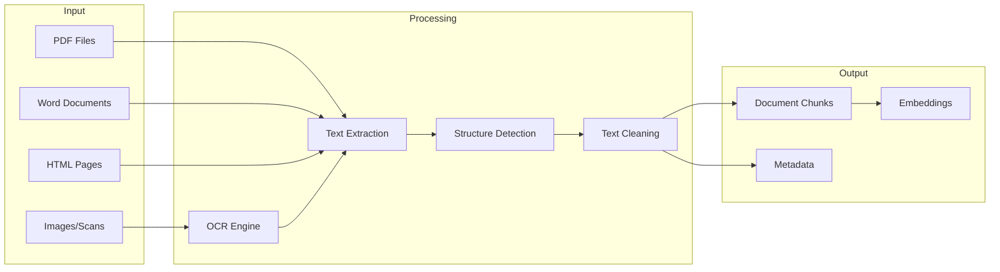
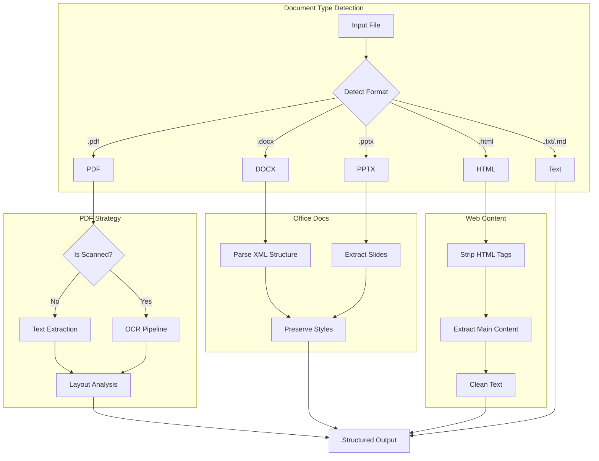
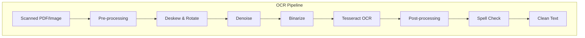

# How to Create Document Parsing

Author: [nawazdhandala](https://github.com/nawazdhandala)

Tags: RAG, Document Parsing, PDF, Text Extraction

Description: Learn to create document parsing for extracting text and structure from various document formats.

---

Document parsing is the foundation of any RAG (Retrieval Augmented Generation) system. The quality of your parsed documents directly impacts retrieval accuracy and the quality of generated responses. This guide covers practical approaches to parsing various document formats while preserving structure and meaning.

## Understanding the Document Parsing Pipeline



### Why Document Parsing Matters for RAG

| Challenge | Impact on RAG |
|-----------|---------------|
| Poor text extraction | Missing or garbled content in search results |
| Lost structure | Context loss during chunking |
| Missing metadata | Reduced filtering and retrieval precision |
| Inconsistent formatting | Noisy embeddings and poor similarity matching |

## Setting Up the Environment

### Install Required Libraries

```bash
# Core parsing libraries
pip install llama-index unstructured pypdf pymupdf python-docx

# For OCR capabilities
pip install pytesseract pdf2image pillow

# For HTML parsing
pip install beautifulsoup4 lxml

# For advanced document understanding
pip install unstructured[all-docs]
```

### System Dependencies

```bash
# Ubuntu/Debian - Install Tesseract for OCR
sudo apt-get update
sudo apt-get install -y tesseract-ocr tesseract-ocr-eng poppler-utils

# macOS - Install via Homebrew
brew install tesseract poppler

# Verify installation
tesseract --version
```

## Parsing PDFs with LlamaIndex

### Basic PDF Parsing

```python
"""
Basic PDF parsing using LlamaIndex SimpleDirectoryReader.
This approach works well for text-based PDFs with simple layouts.
"""

from llama_index.core import SimpleDirectoryReader
from llama_index.core.node_parser import SentenceSplitter
from pathlib import Path


def parse_pdf_basic(pdf_path: str) -> list:
    """
    Parse a PDF file and return document nodes.

    Args:
        pdf_path: Path to the PDF file

    Returns:
        List of document nodes with text and metadata
    """
    # Load the PDF document
    # SimpleDirectoryReader automatically detects file type
    reader = SimpleDirectoryReader(
        input_files=[pdf_path],
        # Extract metadata from the file
        file_metadata=lambda x: {"source": x, "file_type": "pdf"}
    )

    documents = reader.load_data()

    # Split documents into smaller chunks for better retrieval
    # SentenceSplitter respects sentence boundaries
    splitter = SentenceSplitter(
        chunk_size=1024,      # Maximum characters per chunk
        chunk_overlap=200,     # Overlap between chunks for context
        paragraph_separator="\n\n"  # How to identify paragraphs
    )

    nodes = splitter.get_nodes_from_documents(documents)

    return nodes


# Example usage
if __name__ == "__main__":
    pdf_file = "/path/to/document.pdf"
    nodes = parse_pdf_basic(pdf_file)

    print(f"Extracted {len(nodes)} chunks from PDF")
    for i, node in enumerate(nodes[:3]):
        print(f"\n--- Chunk {i+1} ---")
        print(f"Text: {node.text[:200]}...")
        print(f"Metadata: {node.metadata}")
```

### Advanced PDF Parsing with PyMuPDF

```python
"""
Advanced PDF parsing using PyMuPDF (fitz) for better control
over text extraction, layout preservation, and image handling.
"""

import fitz  # PyMuPDF
from dataclasses import dataclass
from typing import Optional


@dataclass
class ParsedPage:
    """Represents a parsed PDF page with text and metadata."""
    page_number: int
    text: str
    tables: list
    images: list
    metadata: dict


@dataclass
class ParsedDocument:
    """Represents a fully parsed PDF document."""
    filename: str
    pages: list
    total_pages: int
    metadata: dict


def parse_pdf_advanced(pdf_path: str, extract_images: bool = False) -> ParsedDocument:
    """
    Parse PDF with advanced options for structure preservation.

    Args:
        pdf_path: Path to the PDF file
        extract_images: Whether to extract embedded images

    Returns:
        ParsedDocument with pages, metadata, and structure
    """
    doc = fitz.open(pdf_path)
    pages = []

    # Extract document-level metadata
    doc_metadata = {
        "title": doc.metadata.get("title", ""),
        "author": doc.metadata.get("author", ""),
        "subject": doc.metadata.get("subject", ""),
        "creator": doc.metadata.get("creator", ""),
        "creation_date": doc.metadata.get("creationDate", ""),
    }

    for page_num in range(len(doc)):
        page = doc[page_num]

        # Extract text with layout preservation
        # The "dict" option gives us structured output
        text_dict = page.get_text("dict", flags=fitz.TEXT_PRESERVE_WHITESPACE)

        # Build text from blocks, preserving reading order
        page_text = extract_text_with_structure(text_dict)

        # Extract tables if present
        tables = extract_tables_from_page(page)

        # Extract images if requested
        images = []
        if extract_images:
            images = extract_images_from_page(page, page_num)

        parsed_page = ParsedPage(
            page_number=page_num + 1,
            text=page_text,
            tables=tables,
            images=images,
            metadata={
                "width": page.rect.width,
                "height": page.rect.height,
                "rotation": page.rotation,
            }
        )
        pages.append(parsed_page)

    doc.close()

    return ParsedDocument(
        filename=pdf_path,
        pages=pages,
        total_pages=len(pages),
        metadata=doc_metadata
    )


def extract_text_with_structure(text_dict: dict) -> str:
    """
    Extract text while preserving document structure.

    PyMuPDF returns text organized in blocks, lines, and spans.
    This function reconstructs readable text with proper spacing.
    """
    text_parts = []

    for block in text_dict.get("blocks", []):
        # Skip image blocks
        if block.get("type") != 0:
            continue

        block_text = []
        for line in block.get("lines", []):
            line_text = ""
            for span in line.get("spans", []):
                # Get the text from this span
                span_text = span.get("text", "")

                # Check for formatting (bold, italic) via font flags
                flags = span.get("flags", 0)
                is_bold = flags & 2**4  # Bold flag
                is_italic = flags & 2**1  # Italic flag

                line_text += span_text

            block_text.append(line_text)

        # Join lines in block with single newline
        text_parts.append("\n".join(block_text))

    # Join blocks with double newline to separate paragraphs
    return "\n\n".join(text_parts)


def extract_tables_from_page(page) -> list:
    """
    Attempt to extract tables from a PDF page.
    Uses heuristics based on text positioning.
    """
    tables = []

    # Get text blocks with position info
    blocks = page.get_text("dict")["blocks"]

    # Simple table detection: look for aligned text blocks
    # For production use, consider tabula-py or camelot

    return tables


def extract_images_from_page(page, page_num: int) -> list:
    """
    Extract images embedded in a PDF page.
    """
    images = []
    image_list = page.get_images()

    for img_index, img in enumerate(image_list):
        xref = img[0]
        base_image = page.parent.extract_image(xref)

        images.append({
            "index": img_index,
            "page": page_num,
            "width": base_image["width"],
            "height": base_image["height"],
            "format": base_image["ext"],
            "data": base_image["image"]  # Raw image bytes
        })

    return images


# Example usage with chunking
def create_rag_chunks(parsed_doc: ParsedDocument, chunk_size: int = 1000) -> list:
    """
    Convert parsed document into chunks suitable for RAG.
    """
    chunks = []

    for page in parsed_doc.pages:
        # Split page text into sentences
        text = page.text

        # Simple chunking by character count with overlap
        start = 0
        while start < len(text):
            end = min(start + chunk_size, len(text))

            # Try to break at sentence boundary
            if end < len(text):
                for punct in [". ", "! ", "? ", "\n"]:
                    last_break = text.rfind(punct, start, end)
                    if last_break > start:
                        end = last_break + len(punct)
                        break

            chunk = {
                "text": text[start:end].strip(),
                "metadata": {
                    "source": parsed_doc.filename,
                    "page": page.page_number,
                    "total_pages": parsed_doc.total_pages,
                    **parsed_doc.metadata
                }
            }

            if chunk["text"]:
                chunks.append(chunk)

            # Move start with overlap
            start = end - 100 if end < len(text) else end

    return chunks
```

## Parsing with Unstructured Library

The Unstructured library provides powerful document parsing with automatic element detection.

### Basic Unstructured Usage

```python
"""
Document parsing using the Unstructured library.
Unstructured automatically detects document structure including
titles, paragraphs, lists, tables, and images.
"""

from unstructured.partition.auto import partition
from unstructured.partition.pdf import partition_pdf
from unstructured.partition.docx import partition_docx
from unstructured.partition.html import partition_html
from unstructured.chunking.title import chunk_by_title
from unstructured.staging.base import elements_to_json


def parse_document_unstructured(file_path: str, strategy: str = "auto") -> list:
    """
    Parse any document type using Unstructured.

    Args:
        file_path: Path to the document
        strategy: Parsing strategy - "auto", "fast", "hi_res", or "ocr_only"

    Returns:
        List of document elements with type and metadata
    """
    # partition() auto-detects file type and applies appropriate parser
    elements = partition(
        filename=file_path,
        strategy=strategy,
        # Include page numbers in metadata
        include_page_breaks=True,
        # Extract text from images via OCR
        infer_table_structure=True,
    )

    return elements


def parse_pdf_high_resolution(pdf_path: str) -> list:
    """
    Parse PDF with high-resolution strategy for complex layouts.
    Uses document layout models for better structure detection.
    """
    elements = partition_pdf(
        filename=pdf_path,
        # hi_res strategy uses layout detection models
        strategy="hi_res",
        # Detect tables and extract as structured data
        infer_table_structure=True,
        # Include coordinates for each element
        include_metadata=True,
        # OCR for scanned pages
        languages=["eng"],
    )

    return elements


def analyze_document_structure(elements: list) -> dict:
    """
    Analyze the structure of parsed document elements.
    """
    structure = {
        "total_elements": len(elements),
        "element_types": {},
        "titles": [],
        "tables": [],
        "images": [],
    }

    for element in elements:
        # Count element types
        elem_type = type(element).__name__
        structure["element_types"][elem_type] = (
            structure["element_types"].get(elem_type, 0) + 1
        )

        # Extract titles for document outline
        if elem_type == "Title":
            structure["titles"].append({
                "text": str(element),
                "metadata": element.metadata.to_dict() if element.metadata else {}
            })

        # Extract table information
        elif elem_type == "Table":
            structure["tables"].append({
                "text": str(element),
                "html": element.metadata.text_as_html if element.metadata else None
            })

    return structure


def create_semantic_chunks(elements: list, max_characters: int = 1500) -> list:
    """
    Create semantically meaningful chunks from document elements.
    Groups content by section using titles as boundaries.
    """
    # chunk_by_title groups elements under their preceding title
    chunks = chunk_by_title(
        elements,
        max_characters=max_characters,
        # Start new chunk at these element types
        new_after_n_chars=max_characters,
        combine_text_under_n_chars=200,
    )

    result = []
    for chunk in chunks:
        result.append({
            "text": str(chunk),
            "metadata": {
                "element_types": [type(e).__name__ for e in chunk.elements]
                    if hasattr(chunk, 'elements') else [],
            }
        })

    return result


# Example: Full parsing pipeline
def full_parsing_pipeline(file_path: str) -> dict:
    """
    Complete document parsing pipeline for RAG.
    """
    print(f"Parsing document: {file_path}")

    # Step 1: Parse document
    elements = parse_document_unstructured(file_path, strategy="hi_res")
    print(f"Extracted {len(elements)} elements")

    # Step 2: Analyze structure
    structure = analyze_document_structure(elements)
    print(f"Document structure: {structure['element_types']}")

    # Step 3: Create chunks
    chunks = create_semantic_chunks(elements)
    print(f"Created {len(chunks)} semantic chunks")

    # Step 4: Prepare for RAG
    rag_documents = []
    for i, chunk in enumerate(chunks):
        rag_documents.append({
            "id": f"{file_path}_{i}",
            "text": chunk["text"],
            "metadata": {
                "source": file_path,
                "chunk_index": i,
                "total_chunks": len(chunks),
                **chunk["metadata"]
            }
        })

    return {
        "elements": elements,
        "structure": structure,
        "chunks": rag_documents
    }
```

## Format-Specific Parsing Strategies



### Parsing Word Documents

```python
"""
Word document (.docx) parsing with structure preservation.
Extracts text, styles, tables, and images.
"""

from docx import Document
from docx.shared import Inches
from docx.enum.text import WD_ALIGN_PARAGRAPH
from typing import Generator


@dataclass
class DocxElement:
    """Represents a parsed element from a Word document."""
    element_type: str  # paragraph, table, image, heading
    content: str
    style: Optional[str] = None
    level: Optional[int] = None  # For headings
    metadata: dict = None


def parse_docx(file_path: str) -> Generator[DocxElement, None, None]:
    """
    Parse a Word document preserving structure and styles.

    Yields document elements in reading order.
    """
    doc = Document(file_path)

    for para in doc.paragraphs:
        # Skip empty paragraphs
        if not para.text.strip():
            continue

        # Detect headings by style name
        style_name = para.style.name if para.style else "Normal"

        if style_name.startswith("Heading"):
            # Extract heading level from style name (e.g., "Heading 1" -> 1)
            try:
                level = int(style_name.split()[-1])
            except ValueError:
                level = 1

            yield DocxElement(
                element_type="heading",
                content=para.text,
                style=style_name,
                level=level,
                metadata={"alignment": str(para.alignment)}
            )

        elif style_name == "List Paragraph":
            yield DocxElement(
                element_type="list_item",
                content=para.text,
                style=style_name,
                metadata={}
            )

        else:
            # Regular paragraph
            yield DocxElement(
                element_type="paragraph",
                content=para.text,
                style=style_name,
                metadata={
                    "bold_runs": [run.text for run in para.runs if run.bold],
                    "italic_runs": [run.text for run in para.runs if run.italic]
                }
            )

    # Parse tables
    for table_idx, table in enumerate(doc.tables):
        table_data = []
        for row in table.rows:
            row_data = [cell.text.strip() for cell in row.cells]
            table_data.append(row_data)

        yield DocxElement(
            element_type="table",
            content=format_table_as_text(table_data),
            metadata={
                "table_index": table_idx,
                "rows": len(table_data),
                "cols": len(table_data[0]) if table_data else 0,
                "raw_data": table_data
            }
        )


def format_table_as_text(table_data: list) -> str:
    """
    Convert table data to readable text format.
    """
    if not table_data:
        return ""

    # Use first row as header
    header = table_data[0]
    rows = table_data[1:]

    lines = []
    lines.append("| " + " | ".join(header) + " |")
    lines.append("|" + "|".join(["---"] * len(header)) + "|")

    for row in rows:
        lines.append("| " + " | ".join(row) + " |")

    return "\n".join(lines)


def docx_to_rag_chunks(file_path: str, chunk_size: int = 1000) -> list:
    """
    Convert Word document to RAG-ready chunks.
    Groups content by headings for semantic chunking.
    """
    chunks = []
    current_chunk = {
        "heading": None,
        "content": [],
        "level": 0
    }

    for element in parse_docx(file_path):
        if element.element_type == "heading":
            # Save current chunk if it has content
            if current_chunk["content"]:
                chunks.append({
                    "text": "\n\n".join(current_chunk["content"]),
                    "metadata": {
                        "source": file_path,
                        "section": current_chunk["heading"],
                        "heading_level": current_chunk["level"]
                    }
                })

            # Start new chunk with this heading
            current_chunk = {
                "heading": element.content,
                "content": [element.content],
                "level": element.level
            }

        else:
            current_chunk["content"].append(element.content)

            # Check if chunk is too large
            total_length = sum(len(c) for c in current_chunk["content"])
            if total_length > chunk_size:
                chunks.append({
                    "text": "\n\n".join(current_chunk["content"]),
                    "metadata": {
                        "source": file_path,
                        "section": current_chunk["heading"],
                        "heading_level": current_chunk["level"]
                    }
                })
                current_chunk["content"] = []

    # Add final chunk
    if current_chunk["content"]:
        chunks.append({
            "text": "\n\n".join(current_chunk["content"]),
            "metadata": {
                "source": file_path,
                "section": current_chunk["heading"],
                "heading_level": current_chunk["level"]
            }
        })

    return chunks
```

### Parsing HTML Content

```python
"""
HTML parsing for web content with main content extraction
and boilerplate removal.
"""

from bs4 import BeautifulSoup, NavigableString
from urllib.parse import urljoin
import re


def parse_html(html_content: str, base_url: str = None) -> dict:
    """
    Parse HTML content extracting text and structure.

    Args:
        html_content: Raw HTML string
        base_url: Base URL for resolving relative links

    Returns:
        Parsed document with text, links, and metadata
    """
    soup = BeautifulSoup(html_content, "lxml")

    # Remove script and style elements
    for element in soup(["script", "style", "nav", "footer", "header"]):
        element.decompose()

    # Extract metadata
    metadata = {
        "title": extract_title(soup),
        "description": extract_meta_description(soup),
        "language": soup.html.get("lang") if soup.html else None,
    }

    # Extract main content
    main_content = extract_main_content(soup)

    # Extract and resolve links
    links = extract_links(soup, base_url)

    # Extract headings for structure
    headings = extract_headings(soup)

    return {
        "text": main_content,
        "metadata": metadata,
        "links": links,
        "headings": headings,
    }


def extract_title(soup: BeautifulSoup) -> str:
    """Extract page title from various sources."""
    # Try <title> tag
    if soup.title:
        return soup.title.string.strip()

    # Try Open Graph title
    og_title = soup.find("meta", property="og:title")
    if og_title:
        return og_title.get("content", "").strip()

    # Try first h1
    h1 = soup.find("h1")
    if h1:
        return h1.get_text().strip()

    return ""


def extract_meta_description(soup: BeautifulSoup) -> str:
    """Extract meta description."""
    meta_desc = soup.find("meta", attrs={"name": "description"})
    if meta_desc:
        return meta_desc.get("content", "").strip()

    og_desc = soup.find("meta", property="og:description")
    if og_desc:
        return og_desc.get("content", "").strip()

    return ""


def extract_main_content(soup: BeautifulSoup) -> str:
    """
    Extract main content, attempting to identify the primary content area.
    """
    # Try to find main content container
    main_selectors = [
        "main",
        "article",
        "[role='main']",
        "#content",
        "#main-content",
        ".content",
        ".post-content",
        ".article-body",
    ]

    for selector in main_selectors:
        main = soup.select_one(selector)
        if main and len(main.get_text(strip=True)) > 100:
            return clean_text(main.get_text(separator="\n"))

    # Fall back to body content
    body = soup.body
    if body:
        return clean_text(body.get_text(separator="\n"))

    return clean_text(soup.get_text(separator="\n"))


def clean_text(text: str) -> str:
    """Clean extracted text by removing excess whitespace."""
    # Replace multiple newlines with double newline
    text = re.sub(r"\n{3,}", "\n\n", text)

    # Replace multiple spaces with single space
    text = re.sub(r"[ \t]+", " ", text)

    # Strip whitespace from each line
    lines = [line.strip() for line in text.split("\n")]

    # Remove empty lines at start and end
    while lines and not lines[0]:
        lines.pop(0)
    while lines and not lines[-1]:
        lines.pop()

    return "\n".join(lines)


def extract_links(soup: BeautifulSoup, base_url: str = None) -> list:
    """Extract all links with their text and resolved URLs."""
    links = []

    for a in soup.find_all("a", href=True):
        href = a["href"]

        # Resolve relative URLs
        if base_url and not href.startswith(("http://", "https://", "mailto:")):
            href = urljoin(base_url, href)

        links.append({
            "text": a.get_text(strip=True),
            "url": href,
        })

    return links


def extract_headings(soup: BeautifulSoup) -> list:
    """Extract document outline from headings."""
    headings = []

    for level in range(1, 7):
        for heading in soup.find_all(f"h{level}"):
            headings.append({
                "level": level,
                "text": heading.get_text(strip=True),
            })

    return headings


def html_to_markdown(html_content: str) -> str:
    """
    Convert HTML to Markdown for better RAG processing.
    Preserves important formatting while simplifying structure.
    """
    soup = BeautifulSoup(html_content, "lxml")

    # Remove unwanted elements
    for element in soup(["script", "style"]):
        element.decompose()

    markdown_parts = []

    def process_element(element, depth=0):
        if isinstance(element, NavigableString):
            text = str(element).strip()
            if text:
                return text
            return ""

        tag = element.name

        # Handle headings
        if tag in ["h1", "h2", "h3", "h4", "h5", "h6"]:
            level = int(tag[1])
            return "#" * level + " " + element.get_text(strip=True) + "\n\n"

        # Handle paragraphs
        if tag == "p":
            return element.get_text(strip=True) + "\n\n"

        # Handle lists
        if tag == "ul":
            items = []
            for li in element.find_all("li", recursive=False):
                items.append("- " + li.get_text(strip=True))
            return "\n".join(items) + "\n\n"

        if tag == "ol":
            items = []
            for i, li in enumerate(element.find_all("li", recursive=False), 1):
                items.append(f"{i}. " + li.get_text(strip=True))
            return "\n".join(items) + "\n\n"

        # Handle code blocks
        if tag == "pre":
            code = element.find("code")
            if code:
                return f"```\n{code.get_text()}\n```\n\n"
            return f"```\n{element.get_text()}\n```\n\n"

        # Handle inline code
        if tag == "code":
            return f"`{element.get_text()}`"

        # Handle bold/strong
        if tag in ["strong", "b"]:
            return f"**{element.get_text()}**"

        # Handle italic/emphasis
        if tag in ["em", "i"]:
            return f"*{element.get_text()}*"

        # Handle links
        if tag == "a":
            href = element.get("href", "")
            text = element.get_text(strip=True)
            return f"[{text}]({href})"

        # Recurse for other elements
        result = ""
        for child in element.children:
            result += process_element(child, depth + 1)
        return result

    body = soup.body or soup
    return process_element(body)
```

## OCR for Scanned Documents



### Implementing OCR Pipeline

```python
"""
OCR pipeline for scanned documents using Tesseract.
Includes pre-processing for improved accuracy.
"""

import pytesseract
from PIL import Image, ImageFilter, ImageEnhance
from pdf2image import convert_from_path
import numpy as np
from pathlib import Path


def ocr_pdf(pdf_path: str, dpi: int = 300, language: str = "eng") -> list:
    """
    Perform OCR on a scanned PDF document.

    Args:
        pdf_path: Path to the PDF file
        dpi: Resolution for PDF to image conversion
        language: Tesseract language code

    Returns:
        List of page texts with metadata
    """
    # Convert PDF pages to images
    pages = convert_from_path(pdf_path, dpi=dpi)

    results = []

    for page_num, page_image in enumerate(pages, 1):
        # Pre-process the image for better OCR
        processed_image = preprocess_image(page_image)

        # Perform OCR
        text = pytesseract.image_to_string(
            processed_image,
            lang=language,
            config="--psm 1 --oem 3"  # Automatic page segmentation, LSTM engine
        )

        # Get OCR confidence data
        data = pytesseract.image_to_data(
            processed_image,
            lang=language,
            output_type=pytesseract.Output.DICT
        )

        # Calculate average confidence
        confidences = [int(c) for c in data["conf"] if int(c) > 0]
        avg_confidence = sum(confidences) / len(confidences) if confidences else 0

        results.append({
            "page": page_num,
            "text": clean_ocr_text(text),
            "confidence": avg_confidence,
            "word_count": len(text.split()),
        })

    return results


def preprocess_image(image: Image.Image) -> Image.Image:
    """
    Pre-process image for improved OCR accuracy.

    Applies multiple transformations to enhance text visibility.
    """
    # Convert to grayscale
    if image.mode != "L":
        image = image.convert("L")

    # Resize if too small (OCR works better on larger images)
    width, height = image.size
    if width < 1000:
        scale = 1000 / width
        image = image.resize(
            (int(width * scale), int(height * scale)),
            Image.Resampling.LANCZOS
        )

    # Increase contrast
    enhancer = ImageEnhance.Contrast(image)
    image = enhancer.enhance(2.0)

    # Sharpen
    image = image.filter(ImageFilter.SHARPEN)

    # Apply slight blur to reduce noise
    image = image.filter(ImageFilter.MedianFilter(size=3))

    # Binarize using Otsu's method (via numpy)
    img_array = np.array(image)
    threshold = calculate_otsu_threshold(img_array)
    binary = (img_array > threshold) * 255
    image = Image.fromarray(binary.astype(np.uint8))

    return image


def calculate_otsu_threshold(image_array: np.ndarray) -> int:
    """
    Calculate optimal binarization threshold using Otsu's method.
    """
    histogram, _ = np.histogram(image_array.flatten(), bins=256, range=(0, 256))

    total = image_array.size
    sum_total = np.dot(range(256), histogram)

    sum_background = 0
    weight_background = 0
    maximum = 0
    threshold = 0

    for i in range(256):
        weight_background += histogram[i]
        if weight_background == 0:
            continue

        weight_foreground = total - weight_background
        if weight_foreground == 0:
            break

        sum_background += i * histogram[i]

        mean_background = sum_background / weight_background
        mean_foreground = (sum_total - sum_background) / weight_foreground

        variance = weight_background * weight_foreground * (mean_background - mean_foreground) ** 2

        if variance > maximum:
            maximum = variance
            threshold = i

    return threshold


def clean_ocr_text(text: str) -> str:
    """
    Clean OCR output text.
    Fixes common OCR errors and normalizes whitespace.
    """
    import re

    # Fix common OCR mistakes
    replacements = {
        "|": "I",    # Pipe often misread as I
        "0": "O",    # Zero/O confusion (context dependent)
        "l": "1",    # l/1 confusion (context dependent)
        "\f": "\n",  # Form feed to newline
    }

    # Remove excessive whitespace
    text = re.sub(r"[ \t]+", " ", text)
    text = re.sub(r"\n{3,}", "\n\n", text)

    # Remove lines that are just punctuation or single characters
    lines = text.split("\n")
    cleaned_lines = []
    for line in lines:
        stripped = line.strip()
        if len(stripped) > 1 or stripped.isalnum():
            cleaned_lines.append(line)

    return "\n".join(cleaned_lines)


def ocr_image(image_path: str, language: str = "eng") -> dict:
    """
    Perform OCR on a single image file.
    """
    image = Image.open(image_path)
    processed = preprocess_image(image)

    text = pytesseract.image_to_string(
        processed,
        lang=language,
        config="--psm 3 --oem 3"
    )

    return {
        "text": clean_ocr_text(text),
        "source": image_path,
    }
```

## Preserving Document Structure

### Hierarchical Document Parser

```python
"""
Hierarchical document parser that preserves document structure
for better context in RAG applications.
"""

from dataclasses import dataclass, field
from typing import Optional
from enum import Enum


class ElementType(Enum):
    """Types of document elements."""
    TITLE = "title"
    HEADING = "heading"
    PARAGRAPH = "paragraph"
    LIST = "list"
    LIST_ITEM = "list_item"
    TABLE = "table"
    CODE_BLOCK = "code_block"
    IMAGE = "image"
    QUOTE = "quote"


@dataclass
class DocumentElement:
    """Represents a single document element with hierarchy info."""
    type: ElementType
    content: str
    level: int = 0  # Hierarchy level (0 = root)
    parent_heading: Optional[str] = None
    metadata: dict = field(default_factory=dict)


@dataclass
class DocumentSection:
    """Represents a document section with nested content."""
    heading: str
    level: int
    content: list  # List of DocumentElement or DocumentSection
    metadata: dict = field(default_factory=dict)


class HierarchicalParser:
    """
    Parser that builds a hierarchical document structure.
    Useful for preserving context during chunking.
    """

    def __init__(self):
        self.root = DocumentSection(
            heading="Document",
            level=0,
            content=[]
        )
        self.current_section = self.root
        self.section_stack = [self.root]

    def add_heading(self, text: str, level: int):
        """Add a heading, creating new section hierarchy."""
        # Pop sections until we find a parent with lower level
        while len(self.section_stack) > 1 and self.section_stack[-1].level >= level:
            self.section_stack.pop()

        # Create new section
        new_section = DocumentSection(
            heading=text,
            level=level,
            content=[]
        )

        # Add to parent section
        self.section_stack[-1].content.append(new_section)

        # Push new section as current
        self.section_stack.append(new_section)
        self.current_section = new_section

    def add_element(self, element: DocumentElement):
        """Add an element to the current section."""
        element.parent_heading = self.current_section.heading
        self.current_section.content.append(element)

    def get_structured_chunks(self, max_chunk_size: int = 1000) -> list:
        """
        Generate chunks that preserve document structure.
        Each chunk includes its full heading hierarchy for context.
        """
        chunks = []
        self._process_section(self.root, [], chunks, max_chunk_size)
        return chunks

    def _process_section(
        self,
        section: DocumentSection,
        heading_path: list,
        chunks: list,
        max_size: int
    ):
        """Recursively process sections to create chunks."""
        # Build heading path for context
        current_path = heading_path + [section.heading] if section.level > 0 else heading_path

        # Collect text elements in this section
        text_elements = []

        for item in section.content:
            if isinstance(item, DocumentSection):
                # Recurse into subsection
                self._process_section(item, current_path, chunks, max_size)
            elif isinstance(item, DocumentElement):
                text_elements.append(item)

        # Create chunks from text elements
        if text_elements:
            current_chunk_text = []
            current_chunk_size = 0

            # Build context header from heading path
            context_header = " > ".join(current_path) if current_path else ""

            for element in text_elements:
                element_text = element.content
                element_size = len(element_text)

                if current_chunk_size + element_size > max_size and current_chunk_text:
                    # Save current chunk
                    chunks.append({
                        "text": "\n\n".join(current_chunk_text),
                        "context": context_header,
                        "heading_path": current_path.copy(),
                        "metadata": {
                            "section_level": section.level,
                            "element_count": len(current_chunk_text),
                        }
                    })
                    current_chunk_text = []
                    current_chunk_size = 0

                current_chunk_text.append(element_text)
                current_chunk_size += element_size

            # Save remaining chunk
            if current_chunk_text:
                chunks.append({
                    "text": "\n\n".join(current_chunk_text),
                    "context": context_header,
                    "heading_path": current_path.copy(),
                    "metadata": {
                        "section_level": section.level,
                        "element_count": len(current_chunk_text),
                    }
                })


def create_hierarchical_chunks(elements: list) -> list:
    """
    Convert flat element list to hierarchical chunks.

    Args:
        elements: List of document elements (from Unstructured, etc.)

    Returns:
        List of chunks with hierarchy context
    """
    parser = HierarchicalParser()

    for element in elements:
        elem_type = type(element).__name__

        if elem_type == "Title":
            parser.add_heading(str(element), level=1)

        elif elem_type.startswith("Heading"):
            # Extract level from class name or default to 2
            level = 2
            parser.add_heading(str(element), level=level)

        else:
            doc_element = DocumentElement(
                type=ElementType.PARAGRAPH,
                content=str(element),
                metadata={"original_type": elem_type}
            )
            parser.add_element(doc_element)

    return parser.get_structured_chunks()
```

## Complete RAG Document Processing Pipeline

```python
"""
Complete document processing pipeline for RAG systems.
Handles multiple formats, preserves structure, and prepares
documents for embedding and retrieval.
"""

from pathlib import Path
from typing import Union
import hashlib
import json


class RAGDocumentProcessor:
    """
    Unified document processor for RAG applications.
    Supports multiple formats and provides consistent output.
    """

    def __init__(
        self,
        chunk_size: int = 1000,
        chunk_overlap: int = 200,
        preserve_structure: bool = True
    ):
        self.chunk_size = chunk_size
        self.chunk_overlap = chunk_overlap
        self.preserve_structure = preserve_structure

    def process(self, file_path: Union[str, Path]) -> list:
        """
        Process a document file and return RAG-ready chunks.

        Args:
            file_path: Path to the document

        Returns:
            List of document chunks with text and metadata
        """
        file_path = Path(file_path)

        if not file_path.exists():
            raise FileNotFoundError(f"Document not found: {file_path}")

        # Determine file type and process accordingly
        suffix = file_path.suffix.lower()

        processors = {
            ".pdf": self._process_pdf,
            ".docx": self._process_docx,
            ".doc": self._process_docx,
            ".html": self._process_html,
            ".htm": self._process_html,
            ".txt": self._process_text,
            ".md": self._process_markdown,
        }

        processor = processors.get(suffix)
        if not processor:
            raise ValueError(f"Unsupported file type: {suffix}")

        # Process document
        chunks = processor(file_path)

        # Add common metadata to all chunks
        for chunk in chunks:
            chunk["metadata"]["file_path"] = str(file_path)
            chunk["metadata"]["file_name"] = file_path.name
            chunk["metadata"]["file_type"] = suffix
            chunk["id"] = self._generate_chunk_id(chunk)

        return chunks

    def _process_pdf(self, file_path: Path) -> list:
        """Process PDF document."""
        from unstructured.partition.pdf import partition_pdf

        elements = partition_pdf(
            filename=str(file_path),
            strategy="hi_res" if self.preserve_structure else "fast",
            infer_table_structure=True,
        )

        if self.preserve_structure:
            return create_hierarchical_chunks(elements)
        else:
            return self._simple_chunk(elements)

    def _process_docx(self, file_path: Path) -> list:
        """Process Word document."""
        return docx_to_rag_chunks(str(file_path), self.chunk_size)

    def _process_html(self, file_path: Path) -> list:
        """Process HTML document."""
        with open(file_path, "r", encoding="utf-8") as f:
            html_content = f.read()

        parsed = parse_html(html_content)

        return self._chunk_text(
            parsed["text"],
            metadata=parsed["metadata"]
        )

    def _process_text(self, file_path: Path) -> list:
        """Process plain text document."""
        with open(file_path, "r", encoding="utf-8") as f:
            text = f.read()

        return self._chunk_text(text, metadata={})

    def _process_markdown(self, file_path: Path) -> list:
        """Process Markdown document with structure preservation."""
        with open(file_path, "r", encoding="utf-8") as f:
            text = f.read()

        # Parse markdown structure
        chunks = []
        current_section = None
        current_content = []

        for line in text.split("\n"):
            if line.startswith("#"):
                # Save previous section
                if current_content:
                    chunks.append({
                        "text": "\n".join(current_content),
                        "metadata": {"section": current_section}
                    })

                # Start new section
                current_section = line.lstrip("#").strip()
                current_content = [line]
            else:
                current_content.append(line)

        # Save final section
        if current_content:
            chunks.append({
                "text": "\n".join(current_content),
                "metadata": {"section": current_section}
            })

        # Re-chunk if sections are too large
        final_chunks = []
        for chunk in chunks:
            if len(chunk["text"]) > self.chunk_size:
                sub_chunks = self._chunk_text(chunk["text"], chunk["metadata"])
                final_chunks.extend(sub_chunks)
            else:
                final_chunks.append(chunk)

        return final_chunks

    def _simple_chunk(self, elements: list) -> list:
        """Create simple text chunks from elements."""
        full_text = "\n\n".join(str(e) for e in elements)
        return self._chunk_text(full_text, metadata={})

    def _chunk_text(self, text: str, metadata: dict) -> list:
        """Split text into overlapping chunks."""
        chunks = []
        start = 0

        while start < len(text):
            end = start + self.chunk_size

            # Find sentence boundary
            if end < len(text):
                for punct in [". ", "! ", "? ", "\n\n"]:
                    boundary = text.rfind(punct, start, end)
                    if boundary > start:
                        end = boundary + len(punct)
                        break

            chunk_text = text[start:end].strip()

            if chunk_text:
                chunks.append({
                    "text": chunk_text,
                    "metadata": {
                        **metadata,
                        "chunk_start": start,
                        "chunk_end": end,
                    }
                })

            start = end - self.chunk_overlap

        return chunks

    def _generate_chunk_id(self, chunk: dict) -> str:
        """Generate unique ID for a chunk."""
        content = json.dumps({
            "text": chunk["text"][:100],
            "metadata": chunk["metadata"]
        }, sort_keys=True)

        return hashlib.md5(content.encode()).hexdigest()


# Example usage
def main():
    """Example usage of the RAG document processor."""
    processor = RAGDocumentProcessor(
        chunk_size=1000,
        chunk_overlap=200,
        preserve_structure=True
    )

    # Process different document types
    documents = [
        "/path/to/document.pdf",
        "/path/to/document.docx",
        "/path/to/document.html",
    ]

    all_chunks = []

    for doc_path in documents:
        try:
            chunks = processor.process(doc_path)
            print(f"Processed {doc_path}: {len(chunks)} chunks")
            all_chunks.extend(chunks)
        except Exception as e:
            print(f"Error processing {doc_path}: {e}")

    # Output is ready for embedding
    print(f"\nTotal chunks for embedding: {len(all_chunks)}")

    # Example chunk structure
    if all_chunks:
        print("\nExample chunk:")
        print(json.dumps(all_chunks[0], indent=2, default=str))


if __name__ == "__main__":
    main()
```

## Best Practices for RAG Document Parsing

| Practice | Description |
|----------|-------------|
| Preserve metadata | Always include source file, page numbers, and section headers |
| Use semantic chunking | Break at paragraph or section boundaries, not arbitrary positions |
| Maintain overlap | Include 10-20% overlap between chunks for context continuity |
| Handle tables specially | Convert tables to structured text or markdown format |
| Pre-process OCR | Apply image enhancement before OCR for better accuracy |
| Validate output | Check for empty chunks, encoding issues, and extraction quality |
| Index structure | Store heading hierarchy for filtered retrieval |
| Deduplicate | Remove duplicate content from repeated headers or footers |

## Conclusion

Effective document parsing is critical for RAG system performance. The key principles are:

1. **Choose the right strategy** - Use fast extraction for simple documents, high-resolution parsing for complex layouts
2. **Preserve structure** - Maintain headings, sections, and hierarchy for better context
3. **Handle format diversity** - Build pipelines that process PDFs, Word documents, HTML, and scanned images
4. **Chunk intelligently** - Break documents at semantic boundaries with appropriate overlap
5. **Enrich with metadata** - Include source information for attribution and filtering

By implementing robust document parsing, you build a solid foundation for accurate retrieval and high-quality generated responses in your RAG applications.
