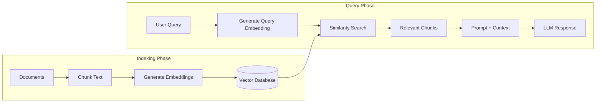
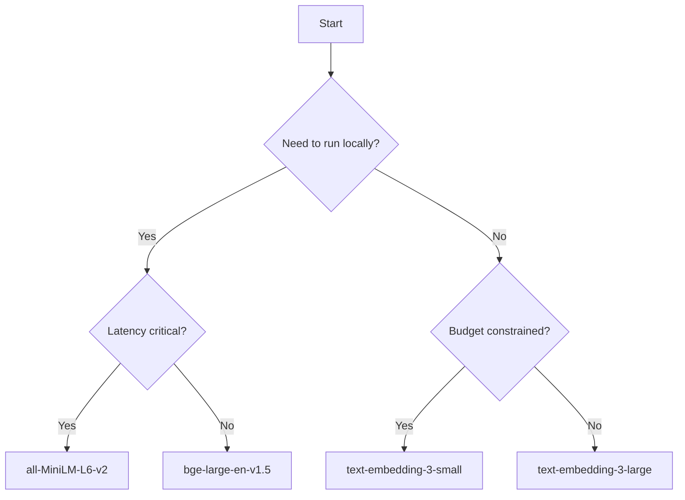
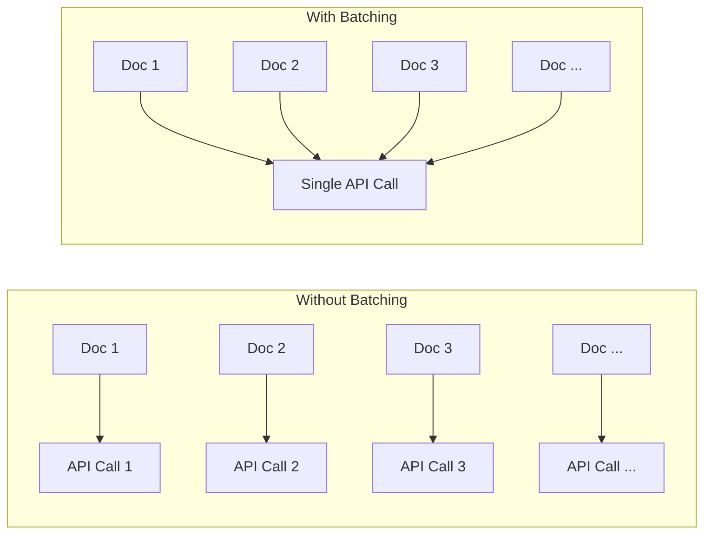
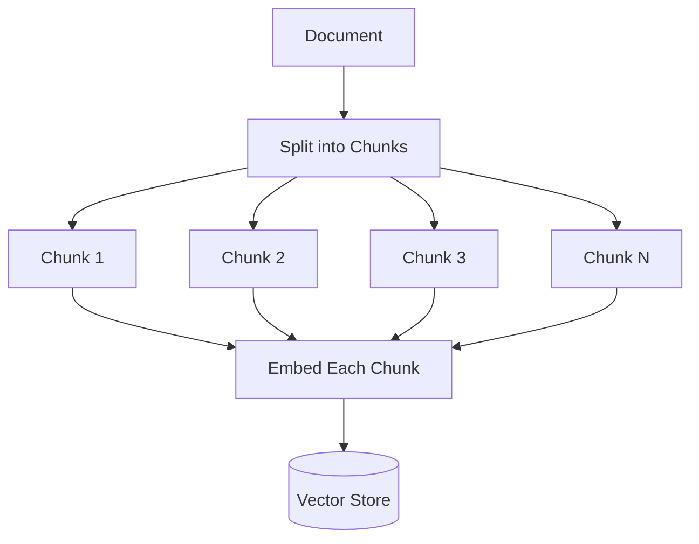
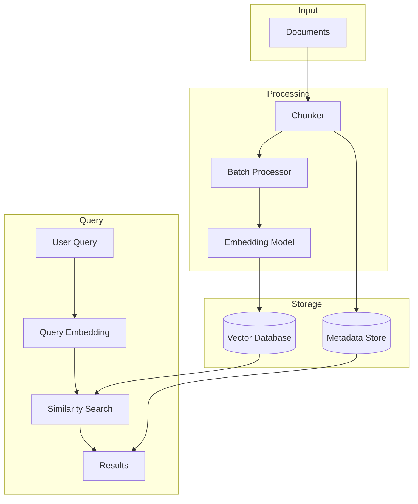

# How to Implement Embedding Models

Author: [nawazdhandala](https://github.com/nawazdhandala)

Tags: RAG, Embeddings, Vector Search, Machine Learning

Description: Learn to implement embedding models for converting text into vector representations for similarity search.

---

> Text embeddings transform words and sentences into dense numerical vectors that capture semantic meaning. In RAG (Retrieval Augmented Generation) systems, embeddings are the foundation that enables finding relevant context to feed into your LLM.

This guide walks through implementing embedding models in production, covering model selection, batching strategies, dimension trade-offs, and practical code examples with OpenAI and HuggingFace.

---

## Table of Contents

1. What Are Embeddings and Why They Matter for RAG
2. How RAG Systems Use Embeddings
3. Embedding Model Selection
4. Implementing OpenAI Embeddings
5. Implementing HuggingFace Embeddings
6. Batching Strategies for Scale
7. Dimension Considerations
8. Chunking Text for Embeddings
9. Building a Complete Embedding Pipeline
10. Performance Optimization
11. Common Pitfalls
12. Putting It All Together

---

## 1. What Are Embeddings and Why They Matter for RAG

An embedding is a dense vector representation of text that captures semantic meaning. Unlike keyword search which matches exact terms, embeddings allow you to find semantically similar content even when the exact words differ.

| Concept | Description |
|---------|-------------|
| Embedding | A fixed-length array of floating point numbers representing text meaning |
| Vector Space | The multi-dimensional space where embeddings live; similar concepts cluster together |
| Cosine Similarity | The angle between two vectors; closer to 1.0 means more similar |
| Dimension | The length of the embedding vector (e.g., 1536 for OpenAI, 384 for MiniLM) |
| Semantic Search | Finding text by meaning rather than keyword matching |

Example: The phrases "How do I fix a broken pipe?" and "Plumbing repair guide" have no words in common, but their embeddings will be close in vector space because they share semantic meaning.

---

## 2. How RAG Systems Use Embeddings

RAG (Retrieval Augmented Generation) combines the power of retrieval systems with LLMs. Embeddings are the bridge that enables semantic retrieval.



The workflow:

1. **Indexing**: Documents are chunked, embedded, and stored in a vector database
2. **Query**: User questions are embedded using the same model
3. **Retrieval**: Vector similarity search finds the most relevant chunks
4. **Generation**: Retrieved context is combined with the query and sent to the LLM

Critical rule: You must use the **same embedding model** for indexing and querying. Mixing models produces meaningless similarity scores.

---

## 3. Embedding Model Selection

Choosing the right embedding model depends on your use case, latency requirements, and infrastructure constraints.

| Model | Dimensions | Strengths | Trade-offs |
|-------|------------|-----------|------------|
| OpenAI text-embedding-3-small | 1536 | Easy API, good quality | Cost per token, external dependency |
| OpenAI text-embedding-3-large | 3072 | Best quality, variable dimensions | Higher cost, larger storage |
| sentence-transformers/all-MiniLM-L6-v2 | 384 | Fast, small, runs locally | Lower quality on complex queries |
| BAAI/bge-large-en-v1.5 | 1024 | High quality, open source | Larger model, slower inference |
| nomic-ai/nomic-embed-text-v1 | 768 | Good balance, open source | Newer, less battle-tested |

Decision framework:



---

## 4. Implementing OpenAI Embeddings

OpenAI provides production-ready embedding models through their API.

### Installation

```bash
npm install openai
# or
pip install openai
```

### TypeScript Implementation

```typescript
// openai-embeddings.ts
import OpenAI from 'openai';

// Initialize the OpenAI client
// Reads OPENAI_API_KEY from environment by default
const openai = new OpenAI();

/**
 * Generate embeddings for a single text using OpenAI's API
 * @param text - The text to embed
 * @param model - The embedding model to use
 * @returns Array of floating point numbers representing the embedding
 */
export async function generateEmbedding(
    text: string,
    model: string = 'text-embedding-3-small'
): Promise<number[]> {
    // OpenAI recommends replacing newlines with spaces for better results
    const cleanedText = text.replace(/\n/g, ' ').trim();

    // Call the embeddings API
    const response = await openai.embeddings.create({
        model: model,
        input: cleanedText,
    });

    // Return the embedding vector
    return response.data[0].embedding;
}

/**
 * Generate embeddings for multiple texts in a single API call
 * More efficient than calling generateEmbedding multiple times
 * @param texts - Array of texts to embed
 * @param model - The embedding model to use
 * @returns Array of embedding vectors
 */
export async function generateEmbeddings(
    texts: string[],
    model: string = 'text-embedding-3-small'
): Promise<number[][]> {
    // Clean all texts
    const cleanedTexts = texts.map(t => t.replace(/\n/g, ' ').trim());

    // Call the embeddings API with all texts at once
    const response = await openai.embeddings.create({
        model: model,
        input: cleanedTexts,
    });

    // Sort by index to maintain order (API may return out of order)
    const sorted = response.data.sort((a, b) => a.index - b.index);

    // Return just the embedding vectors
    return sorted.map(item => item.embedding);
}

// Example usage
async function main() {
    // Single embedding
    const queryEmbedding = await generateEmbedding(
        'How do I set up monitoring for my Kubernetes cluster?'
    );
    console.log(`Query embedding dimensions: ${queryEmbedding.length}`);

    // Batch embeddings (more efficient for multiple texts)
    const documents = [
        'Kubernetes monitoring requires collecting metrics from pods and nodes.',
        'Set up Prometheus to scrape metrics from your cluster.',
        'Use Grafana dashboards to visualize your Kubernetes metrics.',
    ];

    const documentEmbeddings = await generateEmbeddings(documents);
    console.log(`Generated ${documentEmbeddings.length} embeddings`);
}

main().catch(console.error);
```

### Python Implementation

```python
# openai_embeddings.py
from openai import OpenAI
from typing import List

# Initialize the client (reads OPENAI_API_KEY from environment)
client = OpenAI()

def generate_embedding(
    text: str,
    model: str = "text-embedding-3-small"
) -> List[float]:
    """
    Generate embedding for a single text.

    Args:
        text: The text to embed
        model: The OpenAI embedding model to use

    Returns:
        List of floats representing the embedding vector
    """
    # Clean the text by replacing newlines with spaces
    cleaned_text = text.replace("\n", " ").strip()

    # Call the embeddings API
    response = client.embeddings.create(
        model=model,
        input=cleaned_text
    )

    return response.data[0].embedding


def generate_embeddings(
    texts: List[str],
    model: str = "text-embedding-3-small"
) -> List[List[float]]:
    """
    Generate embeddings for multiple texts in one API call.

    Args:
        texts: List of texts to embed
        model: The OpenAI embedding model to use

    Returns:
        List of embedding vectors in the same order as input
    """
    # Clean all texts
    cleaned_texts = [t.replace("\n", " ").strip() for t in texts]

    # Call the embeddings API
    response = client.embeddings.create(
        model=model,
        input=cleaned_texts
    )

    # Sort by index to maintain order
    sorted_data = sorted(response.data, key=lambda x: x.index)

    return [item.embedding for item in sorted_data]


if __name__ == "__main__":
    # Single embedding example
    query = "How do I set up monitoring for my Kubernetes cluster?"
    query_embedding = generate_embedding(query)
    print(f"Query embedding dimensions: {len(query_embedding)}")

    # Batch embedding example
    documents = [
        "Kubernetes monitoring requires collecting metrics from pods.",
        "Set up Prometheus to scrape metrics from your cluster.",
        "Use Grafana dashboards to visualize your Kubernetes metrics.",
    ]

    doc_embeddings = generate_embeddings(documents)
    print(f"Generated {len(doc_embeddings)} embeddings")
```

---

## 5. Implementing HuggingFace Embeddings

For local inference without external API dependencies, HuggingFace transformers provide excellent embedding models.

### Installation

```bash
pip install sentence-transformers torch
```

### Python Implementation

```python
# huggingface_embeddings.py
from sentence_transformers import SentenceTransformer
from typing import List, Optional
import numpy as np

class LocalEmbeddingModel:
    """
    A wrapper for local embedding models using sentence-transformers.
    Supports running on CPU or GPU with configurable batch sizes.
    """

    def __init__(
        self,
        model_name: str = "sentence-transformers/all-MiniLM-L6-v2",
        device: Optional[str] = None,
        normalize: bool = True
    ):
        """
        Initialize the embedding model.

        Args:
            model_name: HuggingFace model identifier
            device: 'cuda', 'cpu', or None for auto-detect
            normalize: Whether to L2 normalize embeddings (recommended for cosine similarity)
        """
        # Load the model (downloads automatically on first use)
        self.model = SentenceTransformer(model_name, device=device)
        self.normalize = normalize
        self.dimension = self.model.get_sentence_embedding_dimension()

        print(f"Loaded {model_name}")
        print(f"Embedding dimension: {self.dimension}")
        print(f"Device: {self.model.device}")

    def generate_embedding(self, text: str) -> List[float]:
        """
        Generate embedding for a single text.

        Args:
            text: The text to embed

        Returns:
            List of floats representing the embedding
        """
        # Clean the text
        cleaned = text.replace("\n", " ").strip()

        # Generate embedding
        embedding = self.model.encode(
            cleaned,
            normalize_embeddings=self.normalize
        )

        return embedding.tolist()

    def generate_embeddings(
        self,
        texts: List[str],
        batch_size: int = 32,
        show_progress: bool = False
    ) -> List[List[float]]:
        """
        Generate embeddings for multiple texts with batching.

        Args:
            texts: List of texts to embed
            batch_size: Number of texts to process at once
            show_progress: Whether to show a progress bar

        Returns:
            List of embedding vectors
        """
        # Clean all texts
        cleaned = [t.replace("\n", " ").strip() for t in texts]

        # Generate embeddings with batching
        embeddings = self.model.encode(
            cleaned,
            batch_size=batch_size,
            normalize_embeddings=self.normalize,
            show_progress_bar=show_progress
        )

        return embeddings.tolist()


def cosine_similarity(vec_a: List[float], vec_b: List[float]) -> float:
    """
    Calculate cosine similarity between two vectors.
    If vectors are already normalized, this is just the dot product.

    Args:
        vec_a: First embedding vector
        vec_b: Second embedding vector

    Returns:
        Similarity score between -1 and 1
    """
    a = np.array(vec_a)
    b = np.array(vec_b)

    return np.dot(a, b) / (np.linalg.norm(a) * np.linalg.norm(b))


if __name__ == "__main__":
    # Initialize the model
    model = LocalEmbeddingModel(
        model_name="sentence-transformers/all-MiniLM-L6-v2"
    )

    # Generate query embedding
    query = "How do I monitor my application performance?"
    query_emb = model.generate_embedding(query)
    print(f"Query embedding dimension: {len(query_emb)}")

    # Generate document embeddings
    documents = [
        "Application performance monitoring tracks response times and errors.",
        "Use APM tools like OneUptime to monitor your services.",
        "The weather forecast shows rain tomorrow.",
    ]

    doc_embeddings = model.generate_embeddings(documents, batch_size=2)

    # Calculate similarities
    print("\nSimilarity scores:")
    for i, (doc, emb) in enumerate(zip(documents, doc_embeddings)):
        similarity = cosine_similarity(query_emb, emb)
        print(f"  Doc {i+1}: {similarity:.4f} - {doc[:50]}...")
```

### TypeScript with Transformers.js

```typescript
// huggingface-embeddings.ts
// Note: transformers.js allows running models in Node.js
import { pipeline, env } from '@xenova/transformers';

// Disable local model check for first run
env.allowLocalModels = false;

// Cache the pipeline for reuse
let embeddingPipeline: any = null;

/**
 * Initialize or retrieve the embedding pipeline
 * @param modelName - HuggingFace model identifier
 */
async function getEmbeddingPipeline(
    modelName: string = 'Xenova/all-MiniLM-L6-v2'
) {
    if (!embeddingPipeline) {
        console.log(`Loading model: ${modelName}...`);
        embeddingPipeline = await pipeline('feature-extraction', modelName);
        console.log('Model loaded successfully');
    }
    return embeddingPipeline;
}

/**
 * Generate embedding for a single text using a local HuggingFace model
 * @param text - The text to embed
 * @returns Array of floats representing the embedding
 */
export async function generateEmbedding(text: string): Promise<number[]> {
    const extractor = await getEmbeddingPipeline();

    // Clean the text
    const cleanedText = text.replace(/\n/g, ' ').trim();

    // Generate embedding with mean pooling
    const output = await extractor(cleanedText, {
        pooling: 'mean',
        normalize: true,
    });

    // Convert to regular array
    return Array.from(output.data);
}

/**
 * Generate embeddings for multiple texts
 * @param texts - Array of texts to embed
 * @returns Array of embedding vectors
 */
export async function generateEmbeddings(texts: string[]): Promise<number[][]> {
    const extractor = await getEmbeddingPipeline();

    // Clean all texts
    const cleanedTexts = texts.map(t => t.replace(/\n/g, ' ').trim());

    // Process each text (transformers.js handles batching internally)
    const embeddings: number[][] = [];
    for (const text of cleanedTexts) {
        const output = await extractor(text, {
            pooling: 'mean',
            normalize: true,
        });
        embeddings.push(Array.from(output.data));
    }

    return embeddings;
}

// Example usage
async function main() {
    const query = 'How do I set up monitoring?';
    const queryEmbedding = await generateEmbedding(query);
    console.log(`Embedding dimension: ${queryEmbedding.length}`);

    const documents = [
        'Monitoring helps you understand system health.',
        'Set up alerts for critical metrics.',
        'The cat sat on the mat.',
    ];

    const docEmbeddings = await generateEmbeddings(documents);
    console.log(`Generated ${docEmbeddings.length} embeddings`);
}

main().catch(console.error);
```

---

## 6. Batching Strategies for Scale

When processing large document collections, batching is essential for efficiency.

### Why Batching Matters



### Python Batching Implementation

```python
# batch_embeddings.py
from typing import List, Generator, Any
import time
from dataclasses import dataclass

@dataclass
class EmbeddingResult:
    """Container for embedding with metadata"""
    text: str
    embedding: List[float]
    index: int

def chunk_list(items: List[Any], chunk_size: int) -> Generator[List[Any], None, None]:
    """
    Split a list into chunks of specified size.

    Args:
        items: List to chunk
        chunk_size: Maximum items per chunk

    Yields:
        Lists of up to chunk_size items
    """
    for i in range(0, len(items), chunk_size):
        yield items[i:i + chunk_size]


class BatchEmbeddingProcessor:
    """
    Process large document collections with efficient batching.
    Handles rate limiting, retries, and progress tracking.
    """

    def __init__(
        self,
        embedding_fn,
        batch_size: int = 100,
        max_tokens_per_batch: int = 8000,
        rate_limit_delay: float = 0.1
    ):
        """
        Initialize the batch processor.

        Args:
            embedding_fn: Function that takes List[str] and returns List[List[float]]
            batch_size: Maximum texts per batch
            max_tokens_per_batch: Token limit per batch (for API limits)
            rate_limit_delay: Seconds to wait between batches
        """
        self.embedding_fn = embedding_fn
        self.batch_size = batch_size
        self.max_tokens_per_batch = max_tokens_per_batch
        self.rate_limit_delay = rate_limit_delay

    def estimate_tokens(self, text: str) -> int:
        """
        Rough token count estimate (4 characters per token on average).
        For production, use tiktoken for accurate counts.
        """
        return len(text) // 4

    def create_batches(self, texts: List[str]) -> List[List[tuple]]:
        """
        Create batches respecting both count and token limits.

        Args:
            texts: List of texts to batch

        Returns:
            List of batches, each batch is a list of (index, text) tuples
        """
        batches = []
        current_batch = []
        current_tokens = 0

        for idx, text in enumerate(texts):
            text_tokens = self.estimate_tokens(text)

            # Check if adding this text would exceed limits
            would_exceed_count = len(current_batch) >= self.batch_size
            would_exceed_tokens = current_tokens + text_tokens > self.max_tokens_per_batch

            if current_batch and (would_exceed_count or would_exceed_tokens):
                # Save current batch and start new one
                batches.append(current_batch)
                current_batch = []
                current_tokens = 0

            current_batch.append((idx, text))
            current_tokens += text_tokens

        # Add final batch if not empty
        if current_batch:
            batches.append(current_batch)

        return batches

    def process(
        self,
        texts: List[str],
        show_progress: bool = True
    ) -> List[EmbeddingResult]:
        """
        Process all texts and return embeddings with metadata.

        Args:
            texts: List of texts to embed
            show_progress: Whether to print progress updates

        Returns:
            List of EmbeddingResult objects in original order
        """
        batches = self.create_batches(texts)
        results: List[EmbeddingResult] = [None] * len(texts)

        if show_progress:
            print(f"Processing {len(texts)} texts in {len(batches)} batches")

        for batch_num, batch in enumerate(batches):
            # Extract texts from batch
            indices = [item[0] for item in batch]
            batch_texts = [item[1] for item in batch]

            # Generate embeddings
            embeddings = self.embedding_fn(batch_texts)

            # Store results in correct positions
            for idx, text, embedding in zip(indices, batch_texts, embeddings):
                results[idx] = EmbeddingResult(
                    text=text,
                    embedding=embedding,
                    index=idx
                )

            if show_progress:
                processed = sum(1 for r in results if r is not None)
                print(f"  Batch {batch_num + 1}/{len(batches)}: {processed}/{len(texts)} complete")

            # Rate limiting between batches
            if batch_num < len(batches) - 1:
                time.sleep(self.rate_limit_delay)

        return results


# Example usage
if __name__ == "__main__":
    from openai import OpenAI

    client = OpenAI()

    def embed_batch(texts: List[str]) -> List[List[float]]:
        """Wrapper for OpenAI batch embedding"""
        response = client.embeddings.create(
            model="text-embedding-3-small",
            input=texts
        )
        sorted_data = sorted(response.data, key=lambda x: x.index)
        return [item.embedding for item in sorted_data]

    # Create processor
    processor = BatchEmbeddingProcessor(
        embedding_fn=embed_batch,
        batch_size=100,
        max_tokens_per_batch=8000
    )

    # Process documents
    documents = [f"Document number {i} with some content." for i in range(250)]
    results = processor.process(documents)

    print(f"\nProcessed {len(results)} documents")
    print(f"First embedding dimension: {len(results[0].embedding)}")
```

---

## 7. Dimension Considerations

Embedding dimensions affect storage costs, search speed, and quality. Understanding the trade-offs helps you make informed decisions.

### Dimension Trade-offs

| Dimension | Storage per 1M docs | Search Speed | Quality |
|-----------|---------------------|--------------|---------|
| 384 | ~1.5 GB | Fastest | Good for simple queries |
| 768 | ~3 GB | Fast | Balanced |
| 1536 | ~6 GB | Moderate | High quality |
| 3072 | ~12 GB | Slower | Highest quality |

### Using OpenAI's Dimension Reduction

OpenAI's text-embedding-3 models support native dimension reduction:

```python
# dimension_reduction.py
from openai import OpenAI

client = OpenAI()

def generate_embedding_with_dimensions(
    text: str,
    dimensions: int = 1536,
    model: str = "text-embedding-3-small"
) -> list[float]:
    """
    Generate embedding with specified dimensions.
    OpenAI's API natively supports dimension reduction.

    Args:
        text: Text to embed
        dimensions: Target embedding dimensions (256-1536 for small, 256-3072 for large)
        model: The embedding model to use

    Returns:
        Embedding vector of specified dimensions
    """
    response = client.embeddings.create(
        model=model,
        input=text,
        dimensions=dimensions  # Native dimension reduction
    )

    return response.data[0].embedding


# Compare different dimensions
if __name__ == "__main__":
    text = "How do I implement semantic search in my application?"

    dimensions_to_test = [256, 512, 1024, 1536]

    for dim in dimensions_to_test:
        embedding = generate_embedding_with_dimensions(text, dimensions=dim)
        print(f"Dimensions: {dim}, Vector length: {len(embedding)}")
```

### Manual Dimension Reduction with PCA

For models without native support, use PCA:

```python
# pca_reduction.py
import numpy as np
from sklearn.decomposition import PCA
from typing import List

class EmbeddingDimensionReducer:
    """
    Reduce embedding dimensions using PCA.
    Fit on a sample of your data, then transform all embeddings.
    """

    def __init__(self, target_dimensions: int):
        """
        Initialize the reducer.

        Args:
            target_dimensions: Desired output dimensions
        """
        self.target_dimensions = target_dimensions
        self.pca = PCA(n_components=target_dimensions)
        self.is_fitted = False

    def fit(self, embeddings: List[List[float]]) -> None:
        """
        Fit PCA on a sample of embeddings.
        Use a representative sample (1000-10000 embeddings).

        Args:
            embeddings: Sample embeddings to fit PCA
        """
        X = np.array(embeddings)
        self.pca.fit(X)
        self.is_fitted = True

        # Report variance retained
        variance_retained = sum(self.pca.explained_variance_ratio_)
        print(f"Variance retained: {variance_retained:.2%}")

    def transform(self, embeddings: List[List[float]]) -> List[List[float]]:
        """
        Transform embeddings to reduced dimensions.

        Args:
            embeddings: Embeddings to transform

        Returns:
            Reduced dimension embeddings
        """
        if not self.is_fitted:
            raise ValueError("Must call fit() before transform()")

        X = np.array(embeddings)
        reduced = self.pca.transform(X)

        # Normalize after reduction
        norms = np.linalg.norm(reduced, axis=1, keepdims=True)
        normalized = reduced / norms

        return normalized.tolist()


# Example usage
if __name__ == "__main__":
    # Simulate 1536-dim embeddings
    sample_embeddings = np.random.randn(1000, 1536).tolist()

    # Create reducer
    reducer = EmbeddingDimensionReducer(target_dimensions=512)

    # Fit on sample
    reducer.fit(sample_embeddings)

    # Transform embeddings
    reduced = reducer.transform(sample_embeddings[:10])
    print(f"Reduced from 1536 to {len(reduced[0])} dimensions")
```

---

## 8. Chunking Text for Embeddings

Embedding models have token limits and work best with coherent text chunks. Proper chunking is critical for RAG quality.



### Python Chunking Implementation

```python
# text_chunking.py
from typing import List, Generator
from dataclasses import dataclass
import re

@dataclass
class TextChunk:
    """A chunk of text with metadata"""
    text: str
    start_index: int
    end_index: int
    chunk_index: int

class TextChunker:
    """
    Split text into overlapping chunks suitable for embedding.
    Respects sentence boundaries when possible.
    """

    def __init__(
        self,
        chunk_size: int = 500,
        chunk_overlap: int = 50,
        min_chunk_size: int = 100
    ):
        """
        Initialize the chunker.

        Args:
            chunk_size: Target characters per chunk
            chunk_overlap: Characters to overlap between chunks
            min_chunk_size: Minimum chunk size (avoid tiny final chunks)
        """
        self.chunk_size = chunk_size
        self.chunk_overlap = chunk_overlap
        self.min_chunk_size = min_chunk_size

    def split_into_sentences(self, text: str) -> List[str]:
        """
        Split text into sentences using regex.
        Handles common abbreviations to avoid false splits.
        """
        # Pattern for sentence endings
        pattern = r'(?<=[.!?])\s+(?=[A-Z])'
        sentences = re.split(pattern, text)
        return [s.strip() for s in sentences if s.strip()]

    def chunk_text(self, text: str) -> List[TextChunk]:
        """
        Split text into overlapping chunks.

        Args:
            text: The text to chunk

        Returns:
            List of TextChunk objects
        """
        sentences = self.split_into_sentences(text)
        chunks = []
        current_chunk = []
        current_length = 0
        chunk_start = 0

        for sentence in sentences:
            sentence_length = len(sentence)

            # Check if adding sentence exceeds chunk size
            if current_length + sentence_length > self.chunk_size and current_chunk:
                # Save current chunk
                chunk_text = ' '.join(current_chunk)
                chunks.append(TextChunk(
                    text=chunk_text,
                    start_index=chunk_start,
                    end_index=chunk_start + len(chunk_text),
                    chunk_index=len(chunks)
                ))

                # Start new chunk with overlap
                overlap_text = []
                overlap_length = 0

                # Add sentences from end until we reach overlap size
                for s in reversed(current_chunk):
                    if overlap_length + len(s) <= self.chunk_overlap:
                        overlap_text.insert(0, s)
                        overlap_length += len(s) + 1
                    else:
                        break

                current_chunk = overlap_text
                current_length = overlap_length
                chunk_start = chunk_start + len(chunk_text) - overlap_length

            current_chunk.append(sentence)
            current_length += sentence_length + 1

        # Add final chunk if it meets minimum size
        if current_chunk and current_length >= self.min_chunk_size:
            chunk_text = ' '.join(current_chunk)
            chunks.append(TextChunk(
                text=chunk_text,
                start_index=chunk_start,
                end_index=chunk_start + len(chunk_text),
                chunk_index=len(chunks)
            ))

        return chunks


# Example usage
if __name__ == "__main__":
    sample_text = """
    Observability is the ability to understand the internal state of a system
    by examining its outputs. In modern distributed systems, observability
    relies on three pillars: logs, metrics, and traces. Logs provide detailed
    records of discrete events. Metrics offer aggregated numerical measurements
    over time. Traces show the path of requests through multiple services.

    Implementing observability requires instrumentation. You must add code to
    emit telemetry data from your applications. OpenTelemetry provides a
    vendor-neutral standard for this instrumentation. It supports all three
    pillars and works with many backends.

    Once you have telemetry data, you need a platform to store and analyze it.
    OneUptime provides unified observability with logs, metrics, traces, and
    alerting in a single platform. This reduces tool sprawl and simplifies
    incident response.
    """

    chunker = TextChunker(chunk_size=300, chunk_overlap=50)
    chunks = chunker.chunk_text(sample_text)

    print(f"Created {len(chunks)} chunks:\n")
    for chunk in chunks:
        print(f"Chunk {chunk.chunk_index}:")
        print(f"  Length: {len(chunk.text)} chars")
        print(f"  Text: {chunk.text[:100]}...")
        print()
```

---

## 9. Building a Complete Embedding Pipeline

Let us put everything together into a complete, production-ready embedding pipeline.



### Complete Pipeline Implementation

```python
# embedding_pipeline.py
from typing import List, Dict, Any, Optional
from dataclasses import dataclass, field
from openai import OpenAI
import json
import numpy as np

@dataclass
class Document:
    """A document with content and metadata"""
    id: str
    content: str
    metadata: Dict[str, Any] = field(default_factory=dict)

@dataclass
class EmbeddedChunk:
    """A chunk with its embedding and source info"""
    chunk_id: str
    document_id: str
    text: str
    embedding: List[float]
    metadata: Dict[str, Any]

@dataclass
class SearchResult:
    """A search result with score"""
    chunk: EmbeddedChunk
    score: float


class EmbeddingPipeline:
    """
    Complete pipeline for indexing documents and searching with embeddings.
    Uses in-memory storage for simplicity (replace with vector DB in production).
    """

    def __init__(
        self,
        model: str = "text-embedding-3-small",
        chunk_size: int = 500,
        chunk_overlap: int = 50,
        batch_size: int = 100
    ):
        """
        Initialize the embedding pipeline.

        Args:
            model: OpenAI embedding model to use
            chunk_size: Target characters per chunk
            chunk_overlap: Overlap between chunks
            batch_size: Texts per embedding API call
        """
        self.client = OpenAI()
        self.model = model
        self.chunk_size = chunk_size
        self.chunk_overlap = chunk_overlap
        self.batch_size = batch_size

        # In-memory storage (replace with vector DB in production)
        self.chunks: Dict[str, EmbeddedChunk] = {}
        self.embeddings_matrix: Optional[np.ndarray] = None
        self.chunk_ids: List[str] = []

    def _chunk_text(self, text: str) -> List[str]:
        """Split text into overlapping chunks"""
        chunks = []
        start = 0

        while start < len(text):
            end = start + self.chunk_size

            # Try to break at sentence boundary
            if end < len(text):
                # Look for sentence end near chunk boundary
                search_start = max(end - 100, start)
                for punct in ['. ', '! ', '? ', '\n\n']:
                    last_punct = text.rfind(punct, search_start, end + 50)
                    if last_punct > search_start:
                        end = last_punct + len(punct)
                        break

            chunk = text[start:end].strip()
            if chunk:
                chunks.append(chunk)

            # Move start with overlap
            start = end - self.chunk_overlap

        return chunks

    def _generate_embeddings(self, texts: List[str]) -> List[List[float]]:
        """Generate embeddings for a list of texts"""
        all_embeddings = []

        for i in range(0, len(texts), self.batch_size):
            batch = texts[i:i + self.batch_size]

            response = self.client.embeddings.create(
                model=self.model,
                input=batch
            )

            # Sort by index to maintain order
            sorted_data = sorted(response.data, key=lambda x: x.index)
            batch_embeddings = [item.embedding for item in sorted_data]
            all_embeddings.extend(batch_embeddings)

        return all_embeddings

    def index_documents(self, documents: List[Document]) -> int:
        """
        Index a list of documents: chunk, embed, and store.

        Args:
            documents: List of documents to index

        Returns:
            Number of chunks indexed
        """
        all_chunks = []
        chunk_texts = []

        # Create chunks from all documents
        for doc in documents:
            text_chunks = self._chunk_text(doc.content)

            for i, chunk_text in enumerate(text_chunks):
                chunk_id = f"{doc.id}_chunk_{i}"

                all_chunks.append({
                    'chunk_id': chunk_id,
                    'document_id': doc.id,
                    'text': chunk_text,
                    'metadata': {
                        **doc.metadata,
                        'chunk_index': i,
                        'total_chunks': len(text_chunks)
                    }
                })
                chunk_texts.append(chunk_text)

        print(f"Created {len(all_chunks)} chunks from {len(documents)} documents")

        # Generate embeddings
        print("Generating embeddings...")
        embeddings = self._generate_embeddings(chunk_texts)

        # Store chunks with embeddings
        for chunk_data, embedding in zip(all_chunks, embeddings):
            embedded_chunk = EmbeddedChunk(
                chunk_id=chunk_data['chunk_id'],
                document_id=chunk_data['document_id'],
                text=chunk_data['text'],
                embedding=embedding,
                metadata=chunk_data['metadata']
            )

            self.chunks[chunk_data['chunk_id']] = embedded_chunk
            self.chunk_ids.append(chunk_data['chunk_id'])

        # Build matrix for fast search
        self.embeddings_matrix = np.array([
            self.chunks[cid].embedding for cid in self.chunk_ids
        ])

        print(f"Indexed {len(self.chunks)} chunks")
        return len(self.chunks)

    def search(
        self,
        query: str,
        top_k: int = 5,
        min_score: float = 0.0
    ) -> List[SearchResult]:
        """
        Search for chunks similar to the query.

        Args:
            query: The search query
            top_k: Number of results to return
            min_score: Minimum similarity score threshold

        Returns:
            List of SearchResult objects sorted by score
        """
        if self.embeddings_matrix is None:
            return []

        # Generate query embedding
        query_embedding = self._generate_embeddings([query])[0]
        query_vector = np.array(query_embedding)

        # Normalize for cosine similarity
        query_norm = query_vector / np.linalg.norm(query_vector)
        matrix_norm = self.embeddings_matrix / np.linalg.norm(
            self.embeddings_matrix, axis=1, keepdims=True
        )

        # Calculate similarities
        similarities = np.dot(matrix_norm, query_norm)

        # Get top-k indices
        top_indices = np.argsort(similarities)[::-1][:top_k]

        # Build results
        results = []
        for idx in top_indices:
            score = float(similarities[idx])
            if score >= min_score:
                chunk_id = self.chunk_ids[idx]
                results.append(SearchResult(
                    chunk=self.chunks[chunk_id],
                    score=score
                ))

        return results


# Example usage
if __name__ == "__main__":
    # Create pipeline
    pipeline = EmbeddingPipeline(
        model="text-embedding-3-small",
        chunk_size=400,
        chunk_overlap=50
    )

    # Sample documents
    documents = [
        Document(
            id="doc1",
            content="""
            Kubernetes is an open-source container orchestration platform.
            It automates deploying, scaling, and managing containerized applications.
            Key concepts include pods, services, deployments, and namespaces.
            Pods are the smallest deployable units that can contain one or more containers.
            Services provide stable networking for pods.
            Deployments manage the desired state of pod replicas.
            """,
            metadata={"source": "k8s-guide", "category": "infrastructure"}
        ),
        Document(
            id="doc2",
            content="""
            Monitoring your applications is essential for reliability.
            Key metrics include latency, error rate, and throughput.
            Use tools like Prometheus for metrics collection.
            Set up alerts for anomalies and threshold breaches.
            Implement distributed tracing to understand request flows.
            Combine logs, metrics, and traces for full observability.
            """,
            metadata={"source": "monitoring-guide", "category": "observability"}
        ),
    ]

    # Index documents
    pipeline.index_documents(documents)

    # Search
    query = "How do I deploy containers?"
    results = pipeline.search(query, top_k=3)

    print(f"\nSearch results for: '{query}'\n")
    for i, result in enumerate(results):
        print(f"{i+1}. Score: {result.score:.4f}")
        print(f"   Document: {result.chunk.document_id}")
        print(f"   Text: {result.chunk.text[:150]}...")
        print()
```

---

## 10. Performance Optimization

### Caching Embeddings

Avoid regenerating embeddings for unchanged content:

```python
# embedding_cache.py
import hashlib
import json
from typing import Optional, List
from pathlib import Path

class EmbeddingCache:
    """
    File-based cache for embeddings.
    Uses content hash as key to detect changes.
    """

    def __init__(self, cache_dir: str = ".embedding_cache"):
        """
        Initialize the cache.

        Args:
            cache_dir: Directory to store cached embeddings
        """
        self.cache_dir = Path(cache_dir)
        self.cache_dir.mkdir(exist_ok=True)

    def _hash_text(self, text: str) -> str:
        """Generate hash for text content"""
        return hashlib.sha256(text.encode()).hexdigest()[:16]

    def get(self, text: str) -> Optional[List[float]]:
        """
        Retrieve cached embedding if available.

        Args:
            text: The text to look up

        Returns:
            Cached embedding or None if not found
        """
        key = self._hash_text(text)
        cache_file = self.cache_dir / f"{key}.json"

        if cache_file.exists():
            with open(cache_file, 'r') as f:
                return json.load(f)

        return None

    def set(self, text: str, embedding: List[float]) -> None:
        """
        Store embedding in cache.

        Args:
            text: The source text
            embedding: The embedding vector to cache
        """
        key = self._hash_text(text)
        cache_file = self.cache_dir / f"{key}.json"

        with open(cache_file, 'w') as f:
            json.dump(embedding, f)

    def get_or_compute(
        self,
        texts: List[str],
        compute_fn
    ) -> List[List[float]]:
        """
        Get embeddings from cache or compute missing ones.

        Args:
            texts: List of texts to get embeddings for
            compute_fn: Function to compute missing embeddings

        Returns:
            List of embeddings in same order as texts
        """
        results = [None] * len(texts)
        missing_indices = []
        missing_texts = []

        # Check cache
        for i, text in enumerate(texts):
            cached = self.get(text)
            if cached is not None:
                results[i] = cached
            else:
                missing_indices.append(i)
                missing_texts.append(text)

        # Compute missing
        if missing_texts:
            computed = compute_fn(missing_texts)

            for idx, text, embedding in zip(missing_indices, missing_texts, computed):
                results[idx] = embedding
                self.set(text, embedding)

        return results
```

### Async Processing

For high-throughput scenarios, use async:

```python
# async_embeddings.py
import asyncio
from openai import AsyncOpenAI
from typing import List

async_client = AsyncOpenAI()

async def generate_embedding_async(text: str) -> List[float]:
    """Generate embedding asynchronously"""
    response = await async_client.embeddings.create(
        model="text-embedding-3-small",
        input=text
    )
    return response.data[0].embedding

async def generate_embeddings_concurrent(
    texts: List[str],
    max_concurrent: int = 10
) -> List[List[float]]:
    """
    Generate embeddings with controlled concurrency.

    Args:
        texts: Texts to embed
        max_concurrent: Maximum concurrent API calls

    Returns:
        List of embeddings
    """
    semaphore = asyncio.Semaphore(max_concurrent)

    async def embed_with_limit(text: str) -> List[float]:
        async with semaphore:
            return await generate_embedding_async(text)

    tasks = [embed_with_limit(text) for text in texts]
    return await asyncio.gather(*tasks)

# Usage
async def main():
    texts = [f"Sample text number {i}" for i in range(50)]
    embeddings = await generate_embeddings_concurrent(texts)
    print(f"Generated {len(embeddings)} embeddings")

# Run with: asyncio.run(main())
```

---

## 11. Common Pitfalls

| Pitfall | Problem | Solution |
|---------|---------|----------|
| Mixing models | Query and index use different models | Always use the same model for both |
| Ignoring chunking | Embeddings for full documents lose detail | Chunk to 256-512 tokens |
| No overlap | Context lost at chunk boundaries | Use 50-100 char overlap |
| High cardinality metadata | Bloated storage, slow filtering | Store only searchable fields |
| No caching | Recomputing unchanged embeddings | Hash-based cache layer |
| Ignoring rate limits | API errors, blocked requests | Exponential backoff, batching |
| Storing raw text in vectors | Expensive retrieval | Store text separately, reference by ID |

### Anti-Pattern Examples

```python
# BAD: Different models for indexing vs query
index_embedding = generate_embedding(doc, model="text-embedding-3-small")
query_embedding = generate_embedding(query, model="text-embedding-3-large")

# GOOD: Same model for both
model = "text-embedding-3-small"
index_embedding = generate_embedding(doc, model=model)
query_embedding = generate_embedding(query, model=model)


# BAD: No chunking for long documents
long_doc = "..." * 10000  # 10K words
embedding = generate_embedding(long_doc)  # Truncated or low quality

# GOOD: Chunk before embedding
chunks = chunk_text(long_doc, chunk_size=500)
embeddings = [generate_embedding(c) for c in chunks]


# BAD: No retry logic
response = client.embeddings.create(...)  # Fails on rate limit

# GOOD: Retry with backoff
import tenacity

@tenacity.retry(
    wait=tenacity.wait_exponential(min=1, max=60),
    stop=tenacity.stop_after_attempt(5)
)
def generate_with_retry(text):
    return client.embeddings.create(model="text-embedding-3-small", input=text)
```

---

## 12. Putting It All Together

Here is a complete example that combines all the concepts into a working RAG embedding system:

```python
# complete_rag_embeddings.py
"""
Complete RAG Embedding System
Demonstrates the full pipeline from documents to semantic search.
"""

from dataclasses import dataclass
from typing import List, Dict, Any
import numpy as np
from openai import OpenAI

@dataclass
class RAGConfig:
    """Configuration for the RAG embedding system"""
    embedding_model: str = "text-embedding-3-small"
    chunk_size: int = 400
    chunk_overlap: int = 50
    batch_size: int = 50
    top_k_results: int = 5

class RAGEmbeddingSystem:
    """
    Production-ready RAG embedding system.
    Handles document ingestion, chunking, embedding, and retrieval.
    """

    def __init__(self, config: RAGConfig = None):
        self.config = config or RAGConfig()
        self.client = OpenAI()

        # Storage
        self.documents: Dict[str, str] = {}
        self.chunks: List[Dict[str, Any]] = []
        self.embeddings: np.ndarray = None

    def add_documents(self, documents: Dict[str, str]) -> int:
        """
        Add documents to the system.

        Args:
            documents: Dict mapping document_id to content

        Returns:
            Number of chunks created
        """
        all_chunks = []

        for doc_id, content in documents.items():
            self.documents[doc_id] = content

            # Chunk the document
            chunks = self._create_chunks(content, doc_id)
            all_chunks.extend(chunks)

        # Generate embeddings for all new chunks
        texts = [c['text'] for c in all_chunks]
        embeddings = self._batch_embed(texts)

        # Store
        for chunk, embedding in zip(all_chunks, embeddings):
            chunk['embedding'] = embedding
            self.chunks.append(chunk)

        # Rebuild search matrix
        self.embeddings = np.array([c['embedding'] for c in self.chunks])

        return len(all_chunks)

    def _create_chunks(self, text: str, doc_id: str) -> List[Dict]:
        """Split text into overlapping chunks with metadata"""
        chunks = []
        start = 0
        chunk_idx = 0

        while start < len(text):
            end = min(start + self.config.chunk_size, len(text))

            # Find sentence boundary
            if end < len(text):
                for sep in ['. ', '! ', '? ', '\n']:
                    last = text.rfind(sep, start + 100, end + 50)
                    if last > start + 100:
                        end = last + len(sep)
                        break

            chunk_text = text[start:end].strip()
            if chunk_text:
                chunks.append({
                    'text': chunk_text,
                    'doc_id': doc_id,
                    'chunk_idx': chunk_idx,
                    'start_char': start,
                    'end_char': end
                })
                chunk_idx += 1

            start = end - self.config.chunk_overlap

        return chunks

    def _batch_embed(self, texts: List[str]) -> List[List[float]]:
        """Generate embeddings in batches"""
        all_embeddings = []

        for i in range(0, len(texts), self.config.batch_size):
            batch = texts[i:i + self.config.batch_size]

            response = self.client.embeddings.create(
                model=self.config.embedding_model,
                input=batch
            )

            sorted_data = sorted(response.data, key=lambda x: x.index)
            all_embeddings.extend([d.embedding for d in sorted_data])

        return all_embeddings

    def search(self, query: str, top_k: int = None) -> List[Dict]:
        """
        Search for relevant chunks.

        Args:
            query: The search query
            top_k: Number of results (default from config)

        Returns:
            List of chunks with scores
        """
        if self.embeddings is None or len(self.embeddings) == 0:
            return []

        top_k = top_k or self.config.top_k_results

        # Embed query
        query_emb = self._batch_embed([query])[0]
        query_vec = np.array(query_emb)

        # Cosine similarity
        query_norm = query_vec / np.linalg.norm(query_vec)
        emb_norm = self.embeddings / np.linalg.norm(self.embeddings, axis=1, keepdims=True)
        scores = np.dot(emb_norm, query_norm)

        # Get top results
        top_indices = np.argsort(scores)[::-1][:top_k]

        results = []
        for idx in top_indices:
            chunk = self.chunks[idx].copy()
            chunk['score'] = float(scores[idx])
            del chunk['embedding']  # Do not return the embedding
            results.append(chunk)

        return results

    def get_context_for_llm(self, query: str, max_chars: int = 3000) -> str:
        """
        Get formatted context for an LLM prompt.

        Args:
            query: The user's question
            max_chars: Maximum characters of context

        Returns:
            Formatted context string
        """
        results = self.search(query)

        context_parts = []
        total_chars = 0

        for result in results:
            text = result['text']
            if total_chars + len(text) > max_chars:
                break
            context_parts.append(f"[Source: {result['doc_id']}]\n{text}")
            total_chars += len(text)

        return "\n\n---\n\n".join(context_parts)


# Example usage
if __name__ == "__main__":
    # Initialize system
    rag = RAGEmbeddingSystem(RAGConfig(
        embedding_model="text-embedding-3-small",
        chunk_size=400,
        top_k_results=3
    ))

    # Add documents
    docs = {
        "k8s-basics": """
        Kubernetes orchestrates containerized applications across clusters.
        A Pod is the smallest deployable unit, containing one or more containers.
        Deployments manage Pod replicas and handle rolling updates.
        Services provide stable networking and load balancing for Pods.
        ConfigMaps and Secrets store configuration separate from images.
        """,
        "monitoring-101": """
        Application monitoring tracks health, performance, and errors.
        Key metrics include latency percentiles, error rates, and throughput.
        Distributed tracing shows request flow across microservices.
        Log aggregation centralizes logs for search and analysis.
        Alerting notifies teams when metrics breach thresholds.
        """
    }

    num_chunks = rag.add_documents(docs)
    print(f"Indexed {num_chunks} chunks from {len(docs)} documents")

    # Search
    query = "How do I manage container configuration?"
    results = rag.search(query)

    print(f"\nQuery: {query}\n")
    for i, r in enumerate(results):
        print(f"{i+1}. [{r['score']:.3f}] {r['doc_id']}: {r['text'][:80]}...")

    # Get LLM context
    context = rag.get_context_for_llm(query)
    print(f"\n--- Context for LLM ---\n{context}")
```

---

## Summary

| Task | Key Consideration |
|------|-------------------|
| Model selection | Balance quality, cost, and latency for your use case |
| Chunking | 256-512 tokens with 50-100 char overlap |
| Batching | Group requests to reduce API calls and latency |
| Dimensions | Lower dimensions for speed, higher for quality |
| Caching | Hash-based cache to avoid recomputing unchanged content |
| Consistency | Same model for indexing and querying, always |

Embeddings are the foundation of semantic search in RAG systems. With proper implementation of chunking, batching, and caching, you can build scalable systems that provide relevant context to your LLMs.

---

*Need to observe your RAG system in production? [OneUptime](https://oneuptime.com) provides unified monitoring for your AI applications with logs, metrics, traces, and alerting.*

---

### See Also

- [What is OpenTelemetry Collector and Why Use One](/blog/post/2025-09-18-what-is-opentelemetry-collector-and-why-use-one/) - Instrument your RAG pipeline with OpenTelemetry
- [How to Structure Logs Properly in OpenTelemetry](/blog/post/2025-08-28-how-to-structure-logs-properly-in-opentelemetry/) - Structure logs for debugging embedding pipelines
