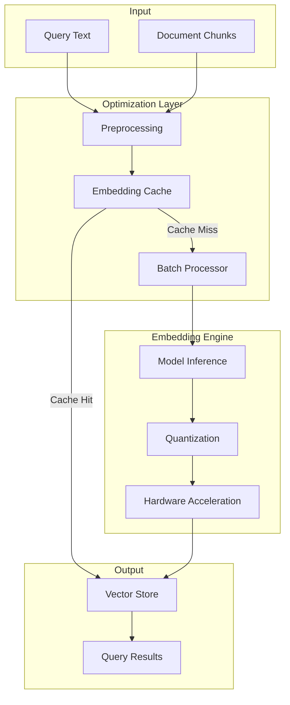
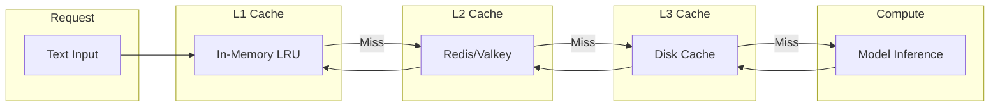
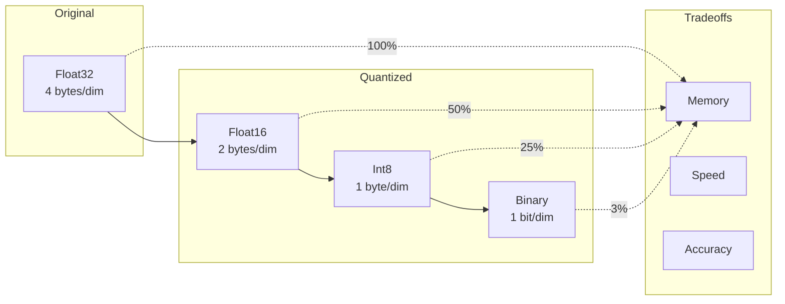
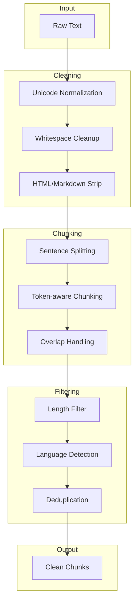

# How to Create Embedding Optimization

Author: [nawazdhandala](https://github.com/nawazdhandala)

Tags: RAG, Embeddings, Optimization, Performance

Description: Learn to create embedding optimization for faster and more efficient vector generation.

---

Retrieval-Augmented Generation (RAG) systems live and die by embedding quality and speed. When you are embedding millions of documents or handling real-time queries, naive implementations become bottlenecks. This guide covers practical strategies to optimize your embedding pipeline: batching, caching, quantization, and hardware acceleration.

## Why Embedding Optimization Matters

Every RAG query involves:
1. **Query embedding**: Converting user input to vectors
2. **Document embedding**: Pre-processing your knowledge base
3. **Similarity search**: Finding relevant chunks

Without optimization, you face:
- High latency on user queries (poor UX)
- Expensive GPU/API bills during document ingestion
- Memory pressure from large embedding models
- Throughput limits during bulk operations

---

## Architecture Overview



---

## Strategy 1: Intelligent Batching

Batching is the single most impactful optimization. Processing embeddings one at a time wastes GPU cycles and network round trips.

### Basic Batching Implementation

```python
import numpy as np
from typing import List
from sentence_transformers import SentenceTransformer

class BatchedEmbedder:
    """
    Efficient batch embedding with automatic sizing.

    Key optimizations:
    - Groups texts into optimal batch sizes
    - Handles variable-length inputs efficiently
    - Provides progress tracking for large jobs
    """

    def __init__(
        self,
        model_name: str = "all-MiniLM-L6-v2",
        batch_size: int = 64,
        max_seq_length: int = 512
    ):
        # Load model once and reuse
        self.model = SentenceTransformer(model_name)
        self.model.max_seq_length = max_seq_length
        self.batch_size = batch_size

    def embed_texts(
        self,
        texts: List[str],
        show_progress: bool = True
    ) -> np.ndarray:
        """
        Embed a list of texts with automatic batching.

        Args:
            texts: List of strings to embed
            show_progress: Show progress bar for large batches

        Returns:
            numpy array of shape (len(texts), embedding_dim)
        """
        # sentence-transformers handles batching internally
        # but we can control batch size for memory management
        embeddings = self.model.encode(
            texts,
            batch_size=self.batch_size,
            show_progress_bar=show_progress,
            convert_to_numpy=True,
            normalize_embeddings=True  # L2 normalize for cosine similarity
        )
        return embeddings

    def embed_with_metadata(
        self,
        texts: List[str],
        metadata: List[dict]
    ) -> List[dict]:
        """
        Embed texts and pair with metadata for vector store insertion.

        Returns list of dicts with 'embedding' and 'metadata' keys.
        """
        embeddings = self.embed_texts(texts, show_progress=True)

        results = []
        for i, (text, meta) in enumerate(zip(texts, metadata)):
            results.append({
                "embedding": embeddings[i].tolist(),
                "text": text,
                "metadata": meta
            })
        return results


# Usage example
if __name__ == "__main__":
    embedder = BatchedEmbedder(batch_size=128)

    # Simulating document chunks
    documents = [
        "RAG systems combine retrieval with generation.",
        "Embedding optimization reduces latency significantly.",
        "Vector databases store high-dimensional embeddings.",
        # ... thousands more documents
    ]

    # Single call embeds all documents efficiently
    vectors = embedder.embed_texts(documents)
    print(f"Embedded {len(documents)} documents, shape: {vectors.shape}")
```

### Adaptive Batch Sizing

Different text lengths require different memory. Adaptive batching prevents OOM errors:

```python
import torch
from typing import List, Tuple

class AdaptiveBatchEmbedder:
    """
    Dynamically adjusts batch size based on text length.

    Longer texts consume more GPU memory, so we reduce
    batch size accordingly to prevent OOM errors.
    """

    def __init__(
        self,
        model_name: str = "all-MiniLM-L6-v2",
        max_batch_tokens: int = 8192,  # Total tokens per batch
        target_batch_size: int = 64
    ):
        self.model = SentenceTransformer(model_name)
        self.tokenizer = self.model.tokenizer
        self.max_batch_tokens = max_batch_tokens
        self.target_batch_size = target_batch_size

    def _estimate_tokens(self, text: str) -> int:
        """Estimate token count without full tokenization."""
        # Fast approximation: ~4 chars per token for English
        return len(text) // 4

    def _create_adaptive_batches(
        self,
        texts: List[str]
    ) -> List[List[str]]:
        """
        Group texts into batches respecting token budget.

        Strategy:
        1. Sort by length for more uniform batches
        2. Fill batches until token limit reached
        3. Never exceed target batch size
        """
        # Pair texts with indices to restore order later
        indexed_texts = [(i, t, self._estimate_tokens(t)) for i, t in enumerate(texts)]

        # Sort by token count (shortest first)
        indexed_texts.sort(key=lambda x: x[2])

        batches = []
        current_batch = []
        current_tokens = 0

        for idx, text, tokens in indexed_texts:
            # Check if adding this text exceeds limits
            if (current_tokens + tokens > self.max_batch_tokens or
                len(current_batch) >= self.target_batch_size):
                if current_batch:
                    batches.append(current_batch)
                current_batch = []
                current_tokens = 0

            current_batch.append((idx, text))
            current_tokens += tokens

        # Add final batch
        if current_batch:
            batches.append(current_batch)

        return batches

    def embed_texts(self, texts: List[str]) -> np.ndarray:
        """
        Embed with adaptive batching for memory efficiency.
        """
        batches = self._create_adaptive_batches(texts)

        # Pre-allocate output array
        embedding_dim = self.model.get_sentence_embedding_dimension()
        all_embeddings = np.zeros((len(texts), embedding_dim), dtype=np.float32)

        for batch in batches:
            indices = [item[0] for item in batch]
            batch_texts = [item[1] for item in batch]

            # Embed this batch
            batch_embeddings = self.model.encode(
                batch_texts,
                convert_to_numpy=True,
                normalize_embeddings=True
            )

            # Place embeddings in correct positions
            for i, idx in enumerate(indices):
                all_embeddings[idx] = batch_embeddings[i]

        return all_embeddings
```

---

## Strategy 2: Multi-Level Caching

Caching prevents redundant computation. Implement caching at multiple levels for maximum benefit.

### Cache Architecture



### Implementation with Redis

```python
import hashlib
import json
import numpy as np
import redis
from functools import lru_cache
from typing import Optional, List
from sentence_transformers import SentenceTransformer

class CachedEmbedder:
    """
    Multi-level caching for embeddings.

    Cache hierarchy:
    - L1: In-memory LRU cache (fastest, limited size)
    - L2: Redis cache (fast, shared across instances)
    - L3: Compute on cache miss

    Cache keys are SHA-256 hashes of normalized text.
    """

    def __init__(
        self,
        model_name: str = "all-MiniLM-L6-v2",
        redis_url: str = "redis://localhost:6379",
        cache_ttl: int = 86400 * 7,  # 7 days
        l1_cache_size: int = 10000
    ):
        self.model = SentenceTransformer(model_name)
        self.redis_client = redis.from_url(redis_url)
        self.cache_ttl = cache_ttl
        self.embedding_dim = self.model.get_sentence_embedding_dimension()

        # Configure L1 cache size
        self._l1_cache_size = l1_cache_size

    def _normalize_text(self, text: str) -> str:
        """
        Normalize text for consistent cache keys.

        - Strip whitespace
        - Lowercase
        - Collapse multiple spaces
        """
        return " ".join(text.lower().split())

    def _get_cache_key(self, text: str) -> str:
        """Generate deterministic cache key from text."""
        normalized = self._normalize_text(text)
        return f"emb:v1:{hashlib.sha256(normalized.encode()).hexdigest()}"

    @lru_cache(maxsize=10000)
    def _l1_cache_get(self, cache_key: str) -> Optional[tuple]:
        """
        L1 in-memory cache lookup.

        Returns tuple (for hashability) or None.
        Note: lru_cache requires hashable return types.
        """
        # This method body is a placeholder - actual cache
        # is managed by lru_cache decorator
        return None

    def _l2_cache_get(self, cache_key: str) -> Optional[np.ndarray]:
        """L2 Redis cache lookup."""
        try:
            cached = self.redis_client.get(cache_key)
            if cached:
                # Deserialize from bytes
                return np.frombuffer(cached, dtype=np.float32)
        except redis.RedisError as e:
            # Log error but continue - cache miss is acceptable
            print(f"Redis error: {e}")
        return None

    def _l2_cache_set(self, cache_key: str, embedding: np.ndarray) -> None:
        """Store embedding in Redis cache."""
        try:
            # Serialize as bytes for efficient storage
            self.redis_client.setex(
                cache_key,
                self.cache_ttl,
                embedding.astype(np.float32).tobytes()
            )
        except redis.RedisError as e:
            print(f"Redis write error: {e}")

    def embed_single(self, text: str) -> np.ndarray:
        """
        Embed single text with caching.

        Check caches before computing.
        """
        cache_key = self._get_cache_key(text)

        # Check L1 (in-memory)
        l1_result = self._l1_cache_get(cache_key)
        if l1_result is not None:
            return np.array(l1_result, dtype=np.float32)

        # Check L2 (Redis)
        l2_result = self._l2_cache_get(cache_key)
        if l2_result is not None:
            # Populate L1 cache
            self._l1_cache_get.cache_clear()  # Reset to add new entry
            return l2_result

        # Cache miss - compute embedding
        embedding = self.model.encode(
            text,
            convert_to_numpy=True,
            normalize_embeddings=True
        )

        # Populate caches
        self._l2_cache_set(cache_key, embedding)

        return embedding

    def embed_batch(self, texts: List[str]) -> np.ndarray:
        """
        Batch embed with cache-aware processing.

        Strategy:
        1. Check cache for all texts
        2. Batch compute only cache misses
        3. Populate caches with new embeddings
        """
        results = np.zeros((len(texts), self.embedding_dim), dtype=np.float32)
        texts_to_compute = []
        compute_indices = []

        # Check caches first
        for i, text in enumerate(texts):
            cache_key = self._get_cache_key(text)

            # Try L2 cache (skip L1 for batch operations)
            cached = self._l2_cache_get(cache_key)

            if cached is not None:
                results[i] = cached
            else:
                texts_to_compute.append(text)
                compute_indices.append(i)

        # Batch compute cache misses
        if texts_to_compute:
            computed = self.model.encode(
                texts_to_compute,
                batch_size=64,
                convert_to_numpy=True,
                normalize_embeddings=True
            )

            # Store results and populate cache
            for j, idx in enumerate(compute_indices):
                results[idx] = computed[j]
                cache_key = self._get_cache_key(texts_to_compute[j])
                self._l2_cache_set(cache_key, computed[j])

        cache_hit_rate = (len(texts) - len(texts_to_compute)) / len(texts) * 100
        print(f"Cache hit rate: {cache_hit_rate:.1f}%")

        return results


# Usage with cache statistics
if __name__ == "__main__":
    embedder = CachedEmbedder()

    texts = [
        "What is RAG?",
        "How do embeddings work?",
        "What is RAG?",  # Duplicate - will hit cache
    ]

    # First call - some cache misses
    vectors = embedder.embed_batch(texts)

    # Second call - all cache hits
    vectors = embedder.embed_batch(texts)
```

### Content-Addressable Deduplication

For document ingestion, deduplicate before embedding:

```python
from typing import Dict, List, Tuple
import hashlib

class DeduplicatingEmbedder:
    """
    Deduplicates texts before embedding to avoid redundant computation.

    Useful when:
    - Document chunks may overlap
    - Same content appears in multiple sources
    - Re-indexing updated documents
    """

    def __init__(self, base_embedder):
        self.embedder = base_embedder

    def _content_hash(self, text: str) -> str:
        """Create content hash for deduplication."""
        normalized = " ".join(text.lower().split())
        return hashlib.md5(normalized.encode()).hexdigest()

    def embed_deduplicated(
        self,
        texts: List[str]
    ) -> Tuple[np.ndarray, Dict[int, int]]:
        """
        Embed unique texts and return mapping.

        Returns:
            - embeddings: Array of unique embeddings
            - index_map: Maps original index to embedding index
        """
        # Build deduplication map
        unique_texts = []
        text_to_idx = {}
        index_map = {}

        for i, text in enumerate(texts):
            content_hash = self._content_hash(text)

            if content_hash not in text_to_idx:
                text_to_idx[content_hash] = len(unique_texts)
                unique_texts.append(text)

            index_map[i] = text_to_idx[content_hash]

        # Embed only unique texts
        unique_embeddings = self.embedder.embed_texts(unique_texts)

        dedup_ratio = (len(texts) - len(unique_texts)) / len(texts) * 100
        print(f"Deduplicated {dedup_ratio:.1f}% of texts")

        return unique_embeddings, index_map

    def expand_embeddings(
        self,
        unique_embeddings: np.ndarray,
        index_map: Dict[int, int],
        original_length: int
    ) -> np.ndarray:
        """Expand deduplicated embeddings back to original size."""
        full_embeddings = np.zeros(
            (original_length, unique_embeddings.shape[1]),
            dtype=np.float32
        )

        for orig_idx, unique_idx in index_map.items():
            full_embeddings[orig_idx] = unique_embeddings[unique_idx]

        return full_embeddings
```

---

## Strategy 3: Quantization

Reduce memory and speed up inference by quantizing embeddings and models.

### Embedding Quantization



### Float16 and Int8 Quantization

```python
import numpy as np
from typing import Tuple

class QuantizedEmbeddings:
    """
    Quantize embeddings to reduce memory footprint.

    Memory savings:
    - float32: 4 bytes per dimension (baseline)
    - float16: 2 bytes per dimension (50% reduction)
    - int8: 1 byte per dimension (75% reduction)
    - binary: 1 bit per dimension (97% reduction)

    Accuracy impact varies by use case. Test on your data.
    """

    @staticmethod
    def to_float16(embeddings: np.ndarray) -> np.ndarray:
        """
        Convert to float16. Minimal accuracy loss.

        Best for: General use, GPU inference
        """
        return embeddings.astype(np.float16)

    @staticmethod
    def to_int8(
        embeddings: np.ndarray
    ) -> Tuple[np.ndarray, float, float]:
        """
        Quantize to int8 with scale and zero point.

        Returns:
            - quantized: int8 array
            - scale: Scaling factor for dequantization
            - zero_point: Zero point offset
        """
        # Compute quantization parameters
        min_val = embeddings.min()
        max_val = embeddings.max()

        # Scale to int8 range [-128, 127]
        scale = (max_val - min_val) / 255.0
        zero_point = -128 - (min_val / scale)

        # Quantize
        quantized = np.round(embeddings / scale + zero_point)
        quantized = np.clip(quantized, -128, 127).astype(np.int8)

        return quantized, scale, zero_point

    @staticmethod
    def from_int8(
        quantized: np.ndarray,
        scale: float,
        zero_point: float
    ) -> np.ndarray:
        """Dequantize int8 back to float32."""
        return scale * (quantized.astype(np.float32) - zero_point)

    @staticmethod
    def to_binary(embeddings: np.ndarray) -> np.ndarray:
        """
        Binary quantization: 1 bit per dimension.

        Uses sign of each dimension: positive = 1, negative = 0
        Packed into uint8 for storage efficiency.

        Best for: Approximate search, first-pass filtering
        """
        # Convert to binary (1 where positive)
        binary = (embeddings > 0).astype(np.uint8)

        # Pack 8 bits into each byte
        packed = np.packbits(binary, axis=-1)

        return packed

    @staticmethod
    def hamming_distance(a: np.ndarray, b: np.ndarray) -> int:
        """
        Compute Hamming distance between binary embeddings.

        Fast similarity metric for binary vectors.
        """
        # XOR and count differing bits
        xor = np.bitwise_xor(a, b)
        return np.unpackbits(xor).sum()


# Demonstration of memory savings
if __name__ == "__main__":
    # Simulate 1 million embeddings with 384 dimensions
    num_embeddings = 1_000_000
    dim = 384

    # Original float32
    original = np.random.randn(num_embeddings, dim).astype(np.float32)

    print("Memory usage comparison:")
    print(f"  float32: {original.nbytes / 1e9:.2f} GB")

    # Float16
    f16 = QuantizedEmbeddings.to_float16(original)
    print(f"  float16: {f16.nbytes / 1e9:.2f} GB")

    # Int8
    int8, scale, zp = QuantizedEmbeddings.to_int8(original)
    print(f"  int8:    {int8.nbytes / 1e9:.2f} GB")

    # Binary
    binary = QuantizedEmbeddings.to_binary(original)
    print(f"  binary:  {binary.nbytes / 1e9:.2f} GB")
```

### Model Quantization with ONNX

```python
import onnxruntime as ort
from onnxruntime.quantization import quantize_dynamic, QuantType
import numpy as np
from pathlib import Path

class ONNXOptimizedEmbedder:
    """
    ONNX Runtime optimized embedding inference.

    Benefits:
    - Cross-platform optimization
    - Dynamic quantization support
    - Graph optimizations
    - Hardware-specific kernels
    """

    def __init__(
        self,
        model_path: str,
        use_quantized: bool = True,
        num_threads: int = 4
    ):
        # Session options for optimization
        sess_options = ort.SessionOptions()
        sess_options.intra_op_num_threads = num_threads
        sess_options.inter_op_num_threads = num_threads
        sess_options.graph_optimization_level = (
            ort.GraphOptimizationLevel.ORT_ENABLE_ALL
        )

        # Select execution provider
        providers = ['CPUExecutionProvider']
        if ort.get_device() == 'GPU':
            providers.insert(0, 'CUDAExecutionProvider')

        self.session = ort.InferenceSession(
            model_path,
            sess_options=sess_options,
            providers=providers
        )

        # Get input/output names
        self.input_name = self.session.get_inputs()[0].name
        self.output_name = self.session.get_outputs()[0].name

    @staticmethod
    def quantize_model(
        input_path: str,
        output_path: str
    ) -> None:
        """
        Apply dynamic quantization to ONNX model.

        Reduces model size by ~4x with minimal accuracy loss.
        """
        quantize_dynamic(
            model_input=input_path,
            model_output=output_path,
            weight_type=QuantType.QInt8,
            optimize_model=True
        )

        original_size = Path(input_path).stat().st_size / 1e6
        quantized_size = Path(output_path).stat().st_size / 1e6

        print(f"Model size: {original_size:.1f}MB -> {quantized_size:.1f}MB")
        print(f"Reduction: {(1 - quantized_size/original_size)*100:.1f}%")

    def embed(
        self,
        input_ids: np.ndarray,
        attention_mask: np.ndarray
    ) -> np.ndarray:
        """Run optimized inference."""
        outputs = self.session.run(
            [self.output_name],
            {
                'input_ids': input_ids,
                'attention_mask': attention_mask
            }
        )

        # Mean pooling over sequence dimension
        embeddings = outputs[0]
        mask_expanded = attention_mask[:, :, np.newaxis]
        sum_embeddings = np.sum(embeddings * mask_expanded, axis=1)
        sum_mask = np.sum(mask_expanded, axis=1)

        return sum_embeddings / sum_mask
```

---

## Strategy 4: Hardware Acceleration

Maximize throughput with GPU, multiple cores, and specialized hardware.

### GPU Batching with PyTorch

```python
import torch
import torch.nn.functional as F
from transformers import AutoTokenizer, AutoModel
from typing import List
import numpy as np

class GPUEmbedder:
    """
    GPU-accelerated embedding generation.

    Optimizations:
    - Automatic mixed precision (AMP) for faster inference
    - Efficient memory management
    - Optimized CUDA kernels via torch.compile
    """

    def __init__(
        self,
        model_name: str = "sentence-transformers/all-MiniLM-L6-v2",
        device: str = "cuda",
        use_amp: bool = True,
        compile_model: bool = True
    ):
        self.device = torch.device(device if torch.cuda.is_available() else "cpu")
        self.use_amp = use_amp and self.device.type == "cuda"

        # Load model and tokenizer
        self.tokenizer = AutoTokenizer.from_pretrained(model_name)
        self.model = AutoModel.from_pretrained(model_name)
        self.model.to(self.device)
        self.model.eval()

        # Compile for faster inference (PyTorch 2.0+)
        if compile_model and hasattr(torch, 'compile'):
            self.model = torch.compile(self.model, mode="reduce-overhead")
            print("Model compiled with torch.compile()")

    def _mean_pooling(
        self,
        model_output: torch.Tensor,
        attention_mask: torch.Tensor
    ) -> torch.Tensor:
        """Apply mean pooling to get sentence embeddings."""
        token_embeddings = model_output[0]
        input_mask_expanded = (
            attention_mask
            .unsqueeze(-1)
            .expand(token_embeddings.size())
            .float()
        )

        sum_embeddings = torch.sum(token_embeddings * input_mask_expanded, 1)
        sum_mask = torch.clamp(input_mask_expanded.sum(1), min=1e-9)

        return sum_embeddings / sum_mask

    @torch.inference_mode()
    def embed_texts(
        self,
        texts: List[str],
        batch_size: int = 64,
        normalize: bool = True
    ) -> np.ndarray:
        """
        Embed texts with GPU acceleration.

        Uses automatic mixed precision for ~2x speedup on compatible GPUs.
        """
        all_embeddings = []

        for i in range(0, len(texts), batch_size):
            batch_texts = texts[i:i + batch_size]

            # Tokenize
            encoded = self.tokenizer(
                batch_texts,
                padding=True,
                truncation=True,
                max_length=512,
                return_tensors="pt"
            )

            # Move to GPU
            encoded = {k: v.to(self.device) for k, v in encoded.items()}

            # Inference with AMP
            if self.use_amp:
                with torch.cuda.amp.autocast():
                    outputs = self.model(**encoded)
                    embeddings = self._mean_pooling(
                        outputs,
                        encoded['attention_mask']
                    )
            else:
                outputs = self.model(**encoded)
                embeddings = self._mean_pooling(
                    outputs,
                    encoded['attention_mask']
                )

            # Normalize if requested
            if normalize:
                embeddings = F.normalize(embeddings, p=2, dim=1)

            all_embeddings.append(embeddings.cpu().numpy())

        return np.vstack(all_embeddings)


# Benchmark GPU vs CPU
if __name__ == "__main__":
    import time

    texts = ["Sample text for embedding."] * 1000

    # GPU timing
    if torch.cuda.is_available():
        gpu_embedder = GPUEmbedder(device="cuda")

        # Warm-up
        _ = gpu_embedder.embed_texts(texts[:10])
        torch.cuda.synchronize()

        start = time.perf_counter()
        _ = gpu_embedder.embed_texts(texts)
        torch.cuda.synchronize()
        gpu_time = time.perf_counter() - start

        print(f"GPU time: {gpu_time:.2f}s ({len(texts)/gpu_time:.0f} texts/sec)")

    # CPU timing for comparison
    cpu_embedder = GPUEmbedder(device="cpu", use_amp=False, compile_model=False)

    start = time.perf_counter()
    _ = cpu_embedder.embed_texts(texts)
    cpu_time = time.perf_counter() - start

    print(f"CPU time: {cpu_time:.2f}s ({len(texts)/cpu_time:.0f} texts/sec)")
```

### Multi-GPU Distribution

```python
import torch
import torch.nn as nn
from torch.nn.parallel import DataParallel
from typing import List
import numpy as np

class MultiGPUEmbedder:
    """
    Distribute embedding across multiple GPUs.

    Achieves near-linear scaling for large batch sizes.
    """

    def __init__(
        self,
        model_name: str = "sentence-transformers/all-MiniLM-L6-v2",
        device_ids: List[int] = None
    ):
        self.tokenizer = AutoTokenizer.from_pretrained(model_name)
        self.model = AutoModel.from_pretrained(model_name)

        # Get available GPUs
        if device_ids is None:
            device_ids = list(range(torch.cuda.device_count()))

        self.device_ids = device_ids
        self.primary_device = f"cuda:{device_ids[0]}"

        # Wrap model for multi-GPU
        if len(device_ids) > 1:
            self.model = DataParallel(self.model, device_ids=device_ids)
            print(f"Using {len(device_ids)} GPUs: {device_ids}")

        self.model.to(self.primary_device)
        self.model.eval()

    @torch.inference_mode()
    def embed_texts(
        self,
        texts: List[str],
        batch_size: int = 256  # Larger batches for multi-GPU
    ) -> np.ndarray:
        """Embed with automatic distribution across GPUs."""
        all_embeddings = []

        for i in range(0, len(texts), batch_size):
            batch_texts = texts[i:i + batch_size]

            encoded = self.tokenizer(
                batch_texts,
                padding=True,
                truncation=True,
                max_length=512,
                return_tensors="pt"
            )

            encoded = {k: v.to(self.primary_device) for k, v in encoded.items()}

            with torch.cuda.amp.autocast():
                outputs = self.model(**encoded)

                # Handle DataParallel output
                if isinstance(self.model, DataParallel):
                    embeddings = outputs.last_hidden_state[:, 0, :]
                else:
                    embeddings = outputs[0][:, 0, :]

                embeddings = F.normalize(embeddings, p=2, dim=1)

            all_embeddings.append(embeddings.cpu().numpy())

        return np.vstack(all_embeddings)
```

### CPU Parallelization

```python
import multiprocessing as mp
from concurrent.futures import ProcessPoolExecutor, ThreadPoolExecutor
from typing import List
import numpy as np
import os

class ParallelCPUEmbedder:
    """
    Parallel embedding on CPU using multiple processes.

    Useful when:
    - No GPU available
    - GPU memory is limited
    - Running on CPU-optimized instances
    """

    def __init__(
        self,
        model_name: str = "all-MiniLM-L6-v2",
        num_workers: int = None
    ):
        self.model_name = model_name
        self.num_workers = num_workers or mp.cpu_count()

        # Set thread limits for nested parallelism
        os.environ["OMP_NUM_THREADS"] = "1"
        os.environ["MKL_NUM_THREADS"] = "1"

    def _embed_chunk(self, texts: List[str]) -> np.ndarray:
        """Worker function to embed a chunk of texts."""
        # Import inside worker to avoid pickling issues
        from sentence_transformers import SentenceTransformer

        model = SentenceTransformer(self.model_name)
        return model.encode(
            texts,
            convert_to_numpy=True,
            normalize_embeddings=True,
            show_progress_bar=False
        )

    def embed_texts(
        self,
        texts: List[str],
        chunk_size: int = 1000
    ) -> np.ndarray:
        """
        Embed texts using process pool.

        Each process loads its own model copy to avoid GIL.
        """
        # Split into chunks for workers
        chunks = [
            texts[i:i + chunk_size]
            for i in range(0, len(texts), chunk_size)
        ]

        # Process chunks in parallel
        with ProcessPoolExecutor(max_workers=self.num_workers) as executor:
            results = list(executor.map(self._embed_chunk, chunks))

        return np.vstack(results)
```

---

## Strategy 5: Preprocessing Pipeline

Clean and prepare texts before embedding for better quality and efficiency.

### Text Preprocessing Flow



### Implementation

```python
import re
import unicodedata
from typing import List, Optional, Tuple
from dataclasses import dataclass

@dataclass
class ChunkConfig:
    """Configuration for text chunking."""
    max_tokens: int = 512
    overlap_tokens: int = 50
    min_chunk_length: int = 50
    sentence_separators: Tuple[str, ...] = ('.', '!', '?', '\n\n')

class TextPreprocessor:
    """
    Comprehensive text preprocessing for RAG embeddings.

    Handles:
    - Unicode normalization
    - Whitespace cleanup
    - HTML/Markdown stripping
    - Intelligent chunking with overlap
    - Deduplication
    """

    def __init__(self, config: ChunkConfig = None):
        self.config = config or ChunkConfig()

        # Compile regex patterns once
        self._html_pattern = re.compile(r'<[^>]+>')
        self._markdown_link = re.compile(r'\[([^\]]+)\]\([^)]+\)')
        self._markdown_emphasis = re.compile(r'[*_]{1,3}([^*_]+)[*_]{1,3}')
        self._whitespace = re.compile(r'\s+')
        self._url_pattern = re.compile(
            r'https?://[^\s<>"{}|\\^`\[\]]+'
        )

    def normalize_unicode(self, text: str) -> str:
        """
        Normalize Unicode to canonical form.

        Converts visually similar characters to consistent representation.
        """
        # NFC normalization: composed form
        text = unicodedata.normalize('NFC', text)

        # Replace common Unicode variants
        replacements = {
            '\u2018': "'",   # Left single quote
            '\u2019': "'",   # Right single quote
            '\u201c': '"',   # Left double quote
            '\u201d': '"',   # Right double quote
            '\u2013': '-',   # En dash
            '\u2014': '-',   # Em dash
            '\u2026': '...', # Ellipsis
            '\u00a0': ' ',   # Non-breaking space
        }

        for old, new in replacements.items():
            text = text.replace(old, new)

        return text

    def strip_markup(self, text: str) -> str:
        """Remove HTML tags and Markdown formatting."""
        # Remove HTML tags
        text = self._html_pattern.sub(' ', text)

        # Convert Markdown links to just text
        text = self._markdown_link.sub(r'\1', text)

        # Remove Markdown emphasis
        text = self._markdown_emphasis.sub(r'\1', text)

        # Remove code blocks
        text = re.sub(r'```[\s\S]*?```', ' ', text)
        text = re.sub(r'`[^`]+`', ' ', text)

        return text

    def clean_whitespace(self, text: str) -> str:
        """Normalize whitespace to single spaces."""
        return self._whitespace.sub(' ', text).strip()

    def clean_text(self, text: str) -> str:
        """Apply all cleaning steps."""
        text = self.normalize_unicode(text)
        text = self.strip_markup(text)
        text = self.clean_whitespace(text)
        return text

    def chunk_text(
        self,
        text: str,
        tokenizer=None
    ) -> List[str]:
        """
        Split text into overlapping chunks respecting sentence boundaries.

        Args:
            text: Text to chunk
            tokenizer: Optional tokenizer for accurate token counting

        Returns:
            List of text chunks
        """
        # Clean first
        text = self.clean_text(text)

        if not text:
            return []

        # Simple token estimation if no tokenizer
        if tokenizer is None:
            estimate_tokens = lambda t: len(t.split())
        else:
            estimate_tokens = lambda t: len(tokenizer.encode(t))

        # Split into sentences
        sentences = self._split_sentences(text)

        chunks = []
        current_chunk = []
        current_tokens = 0

        for sentence in sentences:
            sentence_tokens = estimate_tokens(sentence)

            # If single sentence exceeds max, split it
            if sentence_tokens > self.config.max_tokens:
                # Flush current chunk
                if current_chunk:
                    chunks.append(' '.join(current_chunk))
                    current_chunk = []
                    current_tokens = 0

                # Split long sentence by words
                words = sentence.split()
                word_chunk = []
                word_tokens = 0

                for word in words:
                    word_tok = estimate_tokens(word)
                    if word_tokens + word_tok > self.config.max_tokens:
                        chunks.append(' '.join(word_chunk))
                        word_chunk = []
                        word_tokens = 0
                    word_chunk.append(word)
                    word_tokens += word_tok

                if word_chunk:
                    current_chunk = word_chunk
                    current_tokens = word_tokens
                continue

            # Check if adding sentence exceeds limit
            if current_tokens + sentence_tokens > self.config.max_tokens:
                # Save current chunk
                chunks.append(' '.join(current_chunk))

                # Start new chunk with overlap
                overlap_sentences = self._get_overlap_sentences(
                    current_chunk,
                    estimate_tokens
                )
                current_chunk = overlap_sentences + [sentence]
                current_tokens = sum(estimate_tokens(s) for s in current_chunk)
            else:
                current_chunk.append(sentence)
                current_tokens += sentence_tokens

        # Add final chunk
        if current_chunk:
            chunk_text = ' '.join(current_chunk)
            if len(chunk_text) >= self.config.min_chunk_length:
                chunks.append(chunk_text)

        return chunks

    def _split_sentences(self, text: str) -> List[str]:
        """Split text into sentences."""
        # Simple sentence splitting
        pattern = r'(?<=[.!?])\s+(?=[A-Z])'
        sentences = re.split(pattern, text)
        return [s.strip() for s in sentences if s.strip()]

    def _get_overlap_sentences(
        self,
        sentences: List[str],
        token_counter
    ) -> List[str]:
        """Get sentences for overlap from end of previous chunk."""
        overlap = []
        overlap_tokens = 0

        for sentence in reversed(sentences):
            sent_tokens = token_counter(sentence)
            if overlap_tokens + sent_tokens > self.config.overlap_tokens:
                break
            overlap.insert(0, sentence)
            overlap_tokens += sent_tokens

        return overlap


# Usage example
if __name__ == "__main__":
    preprocessor = TextPreprocessor(ChunkConfig(
        max_tokens=256,
        overlap_tokens=30
    ))

    raw_text = """
    <div class="content">
    # Introduction to RAG Systems

    Retrieval-Augmented Generation (RAG) combines **retrieval** with
    *generation* for better results. Learn more at [our docs](https://example.com).

    The key components are:
    1. Document embedding
    2. Vector storage
    3. Similarity search
    4. Response generation

    This approach significantly improves accuracy compared to pure generation.
    </div>
    """

    chunks = preprocessor.chunk_text(raw_text)

    for i, chunk in enumerate(chunks):
        print(f"Chunk {i+1}: {chunk[:80]}...")
```

---

## Production Pipeline

Putting it all together into a production-ready embedding service.

```python
import asyncio
from typing import List, Dict, Any, Optional
from dataclasses import dataclass
import numpy as np
import logging

logging.basicConfig(level=logging.INFO)
logger = logging.getLogger(__name__)

@dataclass
class EmbeddingConfig:
    """Configuration for the embedding pipeline."""
    model_name: str = "sentence-transformers/all-MiniLM-L6-v2"
    batch_size: int = 64
    use_gpu: bool = True
    use_cache: bool = True
    cache_url: str = "redis://localhost:6379"
    quantize_output: bool = False
    max_concurrent_batches: int = 4

class ProductionEmbeddingPipeline:
    """
    Production-ready embedding pipeline combining all optimizations.

    Features:
    - Async batch processing
    - Multi-level caching
    - Automatic GPU/CPU selection
    - Quantization options
    - Metrics and logging
    """

    def __init__(self, config: EmbeddingConfig):
        self.config = config
        self._init_components()

        # Metrics
        self.total_embedded = 0
        self.cache_hits = 0
        self.total_requests = 0

    def _init_components(self):
        """Initialize pipeline components."""
        # Preprocessor
        self.preprocessor = TextPreprocessor()

        # Embedder (GPU or CPU)
        if self.config.use_gpu and torch.cuda.is_available():
            self.embedder = GPUEmbedder(
                model_name=self.config.model_name,
                device="cuda"
            )
            logger.info("Using GPU embedder")
        else:
            self.embedder = BatchedEmbedder(
                model_name=self.config.model_name,
                batch_size=self.config.batch_size
            )
            logger.info("Using CPU embedder")

        # Cache (optional)
        if self.config.use_cache:
            self.cache = CachedEmbedder(
                model_name=self.config.model_name,
                redis_url=self.config.cache_url
            )
            logger.info("Caching enabled")
        else:
            self.cache = None

        # Semaphore for concurrency control
        self._semaphore = asyncio.Semaphore(
            self.config.max_concurrent_batches
        )

    async def embed_documents(
        self,
        documents: List[Dict[str, Any]],
        text_field: str = "content"
    ) -> List[Dict[str, Any]]:
        """
        Embed a list of documents.

        Args:
            documents: List of dicts containing text and metadata
            text_field: Key containing text to embed

        Returns:
            Documents with 'embedding' field added
        """
        self.total_requests += 1

        # Extract and preprocess texts
        texts = []
        for doc in documents:
            raw_text = doc.get(text_field, "")
            clean_text = self.preprocessor.clean_text(raw_text)
            texts.append(clean_text)

        # Embed with caching
        if self.cache:
            embeddings = self.cache.embed_batch(texts)
        else:
            embeddings = self.embedder.embed_texts(texts)

        # Quantize if configured
        if self.config.quantize_output:
            embeddings = QuantizedEmbeddings.to_float16(embeddings)

        # Add embeddings to documents
        results = []
        for doc, embedding in zip(documents, embeddings):
            result = doc.copy()
            result['embedding'] = embedding.tolist()
            results.append(result)

        self.total_embedded += len(documents)

        return results

    async def embed_query(self, query: str) -> np.ndarray:
        """
        Embed a single query with priority processing.

        Queries bypass batching for low latency.
        """
        clean_query = self.preprocessor.clean_text(query)

        if self.cache:
            embedding = self.cache.embed_single(clean_query)
        else:
            embedding = self.embedder.embed_texts([clean_query])[0]

        return embedding

    def get_metrics(self) -> Dict[str, Any]:
        """Return pipeline metrics."""
        cache_hit_rate = (
            self.cache_hits / self.total_embedded * 100
            if self.total_embedded > 0 else 0
        )

        return {
            "total_embedded": self.total_embedded,
            "total_requests": self.total_requests,
            "cache_hit_rate": f"{cache_hit_rate:.1f}%",
            "model": self.config.model_name,
            "gpu_enabled": self.config.use_gpu and torch.cuda.is_available()
        }


# FastAPI service example
from fastapi import FastAPI, HTTPException
from pydantic import BaseModel

app = FastAPI(title="Embedding Service")
pipeline: Optional[ProductionEmbeddingPipeline] = None

class EmbedRequest(BaseModel):
    texts: List[str]

class EmbedResponse(BaseModel):
    embeddings: List[List[float]]
    count: int

@app.on_event("startup")
async def startup():
    global pipeline
    config = EmbeddingConfig()
    pipeline = ProductionEmbeddingPipeline(config)

@app.post("/embed", response_model=EmbedResponse)
async def embed_texts(request: EmbedRequest):
    """Embed a batch of texts."""
    if not pipeline:
        raise HTTPException(503, "Service not initialized")

    documents = [{"content": t} for t in request.texts]
    results = await pipeline.embed_documents(documents)

    return EmbedResponse(
        embeddings=[r["embedding"] for r in results],
        count=len(results)
    )

@app.get("/health")
async def health():
    """Health check endpoint."""
    return {"status": "healthy", "metrics": pipeline.get_metrics()}
```

---

## Benchmarking Your Pipeline

```python
import time
import numpy as np
from typing import Dict, Any

class EmbeddingBenchmark:
    """
    Benchmark embedding pipeline performance.

    Measures:
    - Throughput (texts/second)
    - Latency (p50, p95, p99)
    - Memory usage
    - Cache effectiveness
    """

    def __init__(self, pipeline):
        self.pipeline = pipeline

    def run_throughput_test(
        self,
        num_texts: int = 10000,
        text_length: int = 200
    ) -> Dict[str, Any]:
        """Measure throughput with synthetic data."""

        # Generate test data
        texts = [
            f"This is test document number {i}. " * (text_length // 40)
            for i in range(num_texts)
        ]

        # Warm-up
        _ = self.pipeline.embed_texts(texts[:100])

        # Timed run
        start = time.perf_counter()
        _ = self.pipeline.embed_texts(texts)
        elapsed = time.perf_counter() - start

        throughput = num_texts / elapsed

        return {
            "num_texts": num_texts,
            "total_time_seconds": round(elapsed, 2),
            "throughput_texts_per_second": round(throughput, 1),
            "avg_latency_ms": round(1000 / throughput, 2)
        }

    def run_latency_test(
        self,
        num_queries: int = 1000
    ) -> Dict[str, Any]:
        """Measure single-query latency distribution."""

        queries = [f"What is the meaning of query {i}?" for i in range(num_queries)]
        latencies = []

        for query in queries:
            start = time.perf_counter()
            _ = self.pipeline.embed_texts([query])
            latency = (time.perf_counter() - start) * 1000  # ms
            latencies.append(latency)

        latencies = np.array(latencies)

        return {
            "num_queries": num_queries,
            "p50_ms": round(np.percentile(latencies, 50), 2),
            "p95_ms": round(np.percentile(latencies, 95), 2),
            "p99_ms": round(np.percentile(latencies, 99), 2),
            "mean_ms": round(latencies.mean(), 2),
            "std_ms": round(latencies.std(), 2)
        }


# Run benchmarks
if __name__ == "__main__":
    from sentence_transformers import SentenceTransformer

    # Test different configurations
    configs = [
        ("Baseline", BatchedEmbedder(batch_size=32)),
        ("Optimized Batch", BatchedEmbedder(batch_size=128)),
        ("Adaptive", AdaptiveBatchEmbedder()),
    ]

    if torch.cuda.is_available():
        configs.append(("GPU", GPUEmbedder()))

    print("Embedding Benchmark Results")
    print("=" * 60)

    for name, embedder in configs:
        benchmark = EmbeddingBenchmark(embedder)

        throughput = benchmark.run_throughput_test(num_texts=5000)
        latency = benchmark.run_latency_test(num_queries=100)

        print(f"\n{name}:")
        print(f"  Throughput: {throughput['throughput_texts_per_second']} texts/sec")
        print(f"  Latency p50: {latency['p50_ms']}ms, p95: {latency['p95_ms']}ms")
```

---

## Key Takeaways

1. **Batch aggressively**: Single-text embedding wastes compute. Use batch sizes of 64-256 depending on memory.

2. **Cache at multiple levels**: In-memory LRU for hot queries, Redis for shared cache, content hashing for deduplication.

3. **Quantize strategically**: Float16 is nearly lossless. Int8 works for most similarity tasks. Binary enables ultra-fast pre-filtering.

4. **Match hardware to workload**: GPUs excel at batch throughput. CPUs are fine for low-volume or when parallelized across cores.

5. **Preprocess consistently**: Normalize Unicode, strip markup, chunk intelligently. Garbage in means garbage out.

6. **Measure everything**: Track throughput, latency percentiles, cache hit rates. Optimize based on data, not assumptions.

---

## Related Resources

- [How to reduce noise in OpenTelemetry](https://oneuptime.com/blog/post/2025-08-25-how-to-reduce-noise-in-opentelemetry/view)
- [What are Traces and Spans in OpenTelemetry](https://oneuptime.com/blog/post/2025-08-27-traces-and-spans-in-opentelemetry/view)
- [Monitoring LLM with OpenLIT and OneUptime](https://oneuptime.com/blog/post/2024-09-13-monitoring-llm-with-openlit-and-oneuptime/view)
