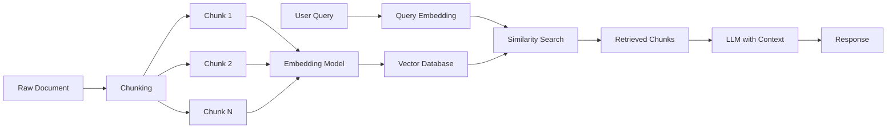
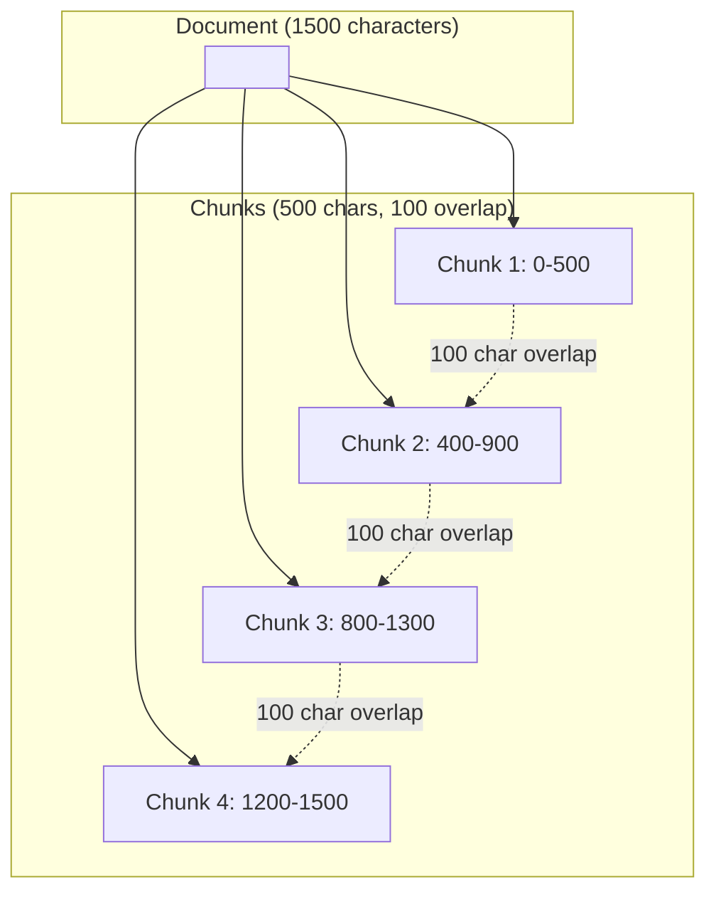
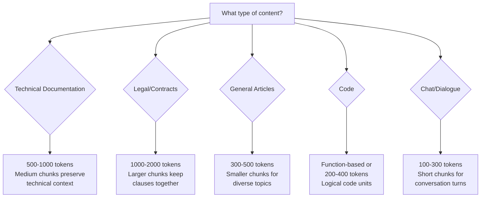
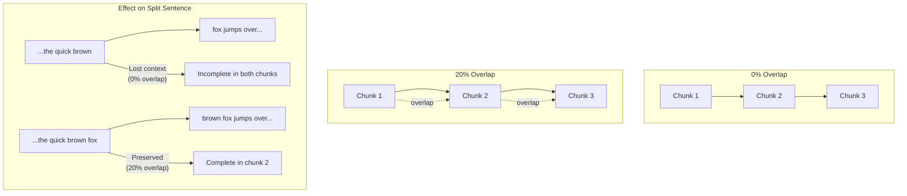
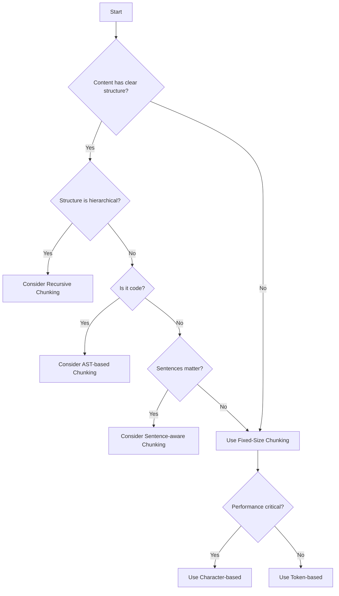

# How to Create Fixed-Size Chunking

Author: [nawazdhandala](https://github.com/nawazdhandala)

Tags: RAG, Chunking, Text Processing, LLM

Description: Learn to create fixed-size chunking for splitting documents into uniform chunks with overlap.

---

> Fixed-size chunking is the simplest and most predictable approach to splitting documents for Retrieval-Augmented Generation (RAG) systems. It divides text into uniform segments of a specified size, optionally with overlap to preserve context across boundaries.

Chunking is a foundational step in RAG pipelines. Before you can embed documents and retrieve relevant context for your LLM, you need to break large documents into smaller pieces that fit within embedding model limits and provide focused, relevant content. This guide covers everything you need to implement fixed-size chunking effectively.

---

## Table of Contents

1. What is Fixed-Size Chunking?
2. Why Chunking Matters for RAG
3. How Fixed-Size Chunking Works
4. Implementation in Python
5. Implementation in TypeScript
6. Chunk Size Selection Guidelines
7. Overlap Strategies
8. Performance Considerations
9. When to Use Fixed-Size Chunking
10. Common Pitfalls and Solutions
11. Testing Your Chunking Strategy
12. Summary

---

## 1. What is Fixed-Size Chunking?

Fixed-size chunking divides text into segments of a predetermined length, measured in characters, tokens, or words. Unlike semantic chunking (which splits by meaning) or recursive chunking (which respects document structure), fixed-size chunking uses a simple, deterministic approach.

| Property | Fixed-Size Chunking |
|----------|---------------------|
| Split criterion | Character count, token count, or word count |
| Predictability | High (same input always produces same chunks) |
| Complexity | Low |
| Context preservation | Relies on overlap |
| Speed | Fast |

---

## 2. Why Chunking Matters for RAG

RAG systems retrieve relevant document chunks to augment LLM prompts with context. The quality of your chunks directly affects:

- **Retrieval accuracy**: Poorly sized chunks may miss relevant content or include too much noise
- **Embedding quality**: Embedding models have token limits (typically 512 to 8192 tokens)
- **LLM context usage**: Smaller, focused chunks leave more room for the LLM to reason
- **Cost efficiency**: Fewer, better-targeted chunks reduce API calls and token usage



---

## 3. How Fixed-Size Chunking Works

The algorithm is straightforward:

1. Define a chunk size (e.g., 500 characters)
2. Define an overlap size (e.g., 50 characters)
3. Iterate through the text, extracting chunks at regular intervals
4. Each chunk starts at: `position = i * (chunk_size - overlap)`



The overlap ensures that sentences or ideas split at chunk boundaries still appear fully in at least one chunk.

---

## 4. Implementation in Python

Here is a complete, production-ready implementation with multiple chunking strategies:

```python
"""
fixed_size_chunker.py

A complete implementation of fixed-size chunking for RAG systems.
Supports character-based, word-based, and token-based chunking.
"""

from dataclasses import dataclass
from typing import List, Optional, Callable
import re


@dataclass
class Chunk:
    """
    Represents a single chunk of text with metadata.

    Attributes:
        text: The actual chunk content
        start_index: Starting position in original document
        end_index: Ending position in original document
        chunk_index: Sequential index of this chunk
        metadata: Optional dictionary for additional context
    """
    text: str
    start_index: int
    end_index: int
    chunk_index: int
    metadata: Optional[dict] = None


class FixedSizeChunker:
    """
    Splits text into fixed-size chunks with configurable overlap.

    This class provides three chunking strategies:
    1. Character-based: Split by character count
    2. Word-based: Split by word count
    3. Token-based: Split by token count (requires tokenizer)
    """

    def __init__(
        self,
        chunk_size: int = 500,
        overlap: int = 50,
        strip_whitespace: bool = True
    ):
        """
        Initialize the chunker with size and overlap parameters.

        Args:
            chunk_size: Target size for each chunk
            overlap: Number of units to overlap between chunks
            strip_whitespace: Whether to strip leading/trailing whitespace

        Raises:
            ValueError: If overlap is greater than or equal to chunk_size
        """
        if overlap >= chunk_size:
            raise ValueError(
                f"Overlap ({overlap}) must be less than chunk_size ({chunk_size})"
            )

        self.chunk_size = chunk_size
        self.overlap = overlap
        self.strip_whitespace = strip_whitespace

    def chunk_by_characters(self, text: str) -> List[Chunk]:
        """
        Split text into chunks based on character count.

        This is the simplest and fastest approach. Best used when
        character count closely correlates with token count.

        Args:
            text: The input text to chunk

        Returns:
            List of Chunk objects
        """
        if not text:
            return []

        chunks = []
        # Calculate step size (how far to advance for each new chunk)
        step = self.chunk_size - self.overlap
        chunk_index = 0

        # Iterate through text at step intervals
        for start in range(0, len(text), step):
            end = min(start + self.chunk_size, len(text))
            chunk_text = text[start:end]

            # Optionally strip whitespace from chunk boundaries
            if self.strip_whitespace:
                chunk_text = chunk_text.strip()

            # Skip empty chunks (can happen after stripping)
            if not chunk_text:
                continue

            chunks.append(Chunk(
                text=chunk_text,
                start_index=start,
                end_index=end,
                chunk_index=chunk_index
            ))
            chunk_index += 1

            # Stop if we have reached the end of the text
            if end >= len(text):
                break

        return chunks

    def chunk_by_words(self, text: str) -> List[Chunk]:
        """
        Split text into chunks based on word count.

        More semantically aware than character-based chunking.
        Words are defined as sequences of non-whitespace characters.

        Args:
            text: The input text to chunk

        Returns:
            List of Chunk objects
        """
        if not text:
            return []

        # Split into words while preserving positions
        words_with_positions = []
        for match in re.finditer(r'\S+', text):
            words_with_positions.append({
                'word': match.group(),
                'start': match.start(),
                'end': match.end()
            })

        if not words_with_positions:
            return []

        chunks = []
        step = self.chunk_size - self.overlap
        chunk_index = 0

        # Iterate through words at step intervals
        for i in range(0, len(words_with_positions), step):
            # Get the slice of words for this chunk
            chunk_words = words_with_positions[i:i + self.chunk_size]

            if not chunk_words:
                break

            # Extract text span from original document
            start_pos = chunk_words[0]['start']
            end_pos = chunk_words[-1]['end']
            chunk_text = text[start_pos:end_pos]

            if self.strip_whitespace:
                chunk_text = chunk_text.strip()

            if not chunk_text:
                continue

            chunks.append(Chunk(
                text=chunk_text,
                start_index=start_pos,
                end_index=end_pos,
                chunk_index=chunk_index
            ))
            chunk_index += 1

            # Stop if we have processed all words
            if i + self.chunk_size >= len(words_with_positions):
                break

        return chunks

    def chunk_by_tokens(
        self,
        text: str,
        tokenizer: Callable[[str], List[str]],
        detokenizer: Optional[Callable[[List[str]], str]] = None
    ) -> List[Chunk]:
        """
        Split text into chunks based on token count.

        Most accurate for embedding models and LLMs since they process
        tokens, not characters or words. Requires a tokenizer function.

        Args:
            text: The input text to chunk
            tokenizer: Function that converts text to list of tokens
            detokenizer: Optional function to convert tokens back to text
                        If not provided, tokens are joined with spaces

        Returns:
            List of Chunk objects
        """
        if not text:
            return []

        # Tokenize the entire text
        tokens = tokenizer(text)

        if not tokens:
            return []

        # Default detokenizer joins with spaces
        if detokenizer is None:
            detokenizer = lambda t: ' '.join(t)

        chunks = []
        step = self.chunk_size - self.overlap
        chunk_index = 0

        for i in range(0, len(tokens), step):
            chunk_tokens = tokens[i:i + self.chunk_size]

            if not chunk_tokens:
                break

            chunk_text = detokenizer(chunk_tokens)

            if self.strip_whitespace:
                chunk_text = chunk_text.strip()

            if not chunk_text:
                continue

            # Note: start/end indices refer to token positions here
            chunks.append(Chunk(
                text=chunk_text,
                start_index=i,
                end_index=i + len(chunk_tokens),
                chunk_index=chunk_index
            ))
            chunk_index += 1

            if i + self.chunk_size >= len(tokens):
                break

        return chunks


def create_tiktoken_chunker(
    model: str = "gpt-4",
    chunk_size: int = 500,
    overlap: int = 50
) -> tuple:
    """
    Create a chunker configured for OpenAI models using tiktoken.

    Args:
        model: OpenAI model name (affects tokenization)
        chunk_size: Number of tokens per chunk
        overlap: Number of tokens to overlap

    Returns:
        Tuple of (chunker, tokenizer, detokenizer)
    """
    try:
        import tiktoken
    except ImportError:
        raise ImportError("tiktoken is required: pip install tiktoken")

    # Get the encoding for the specified model
    encoding = tiktoken.encoding_for_model(model)

    def tokenizer(text: str) -> List[str]:
        """Convert text to token strings."""
        token_ids = encoding.encode(text)
        return [encoding.decode([tid]) for tid in token_ids]

    def detokenizer(tokens: List[str]) -> str:
        """Convert token strings back to text."""
        return ''.join(tokens)

    chunker = FixedSizeChunker(
        chunk_size=chunk_size,
        overlap=overlap
    )

    return chunker, tokenizer, detokenizer


# Example usage and demonstration
if __name__ == "__main__":
    # Sample document for testing
    sample_text = """
    Retrieval-Augmented Generation (RAG) is a technique that enhances
    large language models by providing them with relevant context from
    external knowledge bases. The process involves three main steps:
    first, documents are split into chunks and embedded into vectors;
    second, user queries are embedded and used to find similar chunks;
    third, retrieved chunks are included in the LLM prompt to provide
    context for generating accurate responses.

    Chunking is a critical step in this pipeline. Poor chunking can
    lead to retrieval failures where relevant information is missed
    or irrelevant content is included. Fixed-size chunking offers a
    simple, predictable approach that works well for many use cases.
    """

    # Initialize chunker with 200 characters and 50 character overlap
    chunker = FixedSizeChunker(chunk_size=200, overlap=50)

    # Chunk by characters
    print("=== Character-based Chunking ===")
    char_chunks = chunker.chunk_by_characters(sample_text)
    for chunk in char_chunks:
        print(f"\nChunk {chunk.chunk_index}:")
        print(f"  Position: {chunk.start_index}-{chunk.end_index}")
        print(f"  Length: {len(chunk.text)} chars")
        print(f"  Preview: {chunk.text[:80]}...")

    # Chunk by words (30 words per chunk, 5 word overlap)
    word_chunker = FixedSizeChunker(chunk_size=30, overlap=5)
    print("\n\n=== Word-based Chunking ===")
    word_chunks = word_chunker.chunk_by_words(sample_text)
    for chunk in word_chunks:
        print(f"\nChunk {chunk.chunk_index}:")
        print(f"  Word count: ~{len(chunk.text.split())}")
        print(f"  Preview: {chunk.text[:80]}...")
```

---

## 5. Implementation in TypeScript

Here is the equivalent TypeScript implementation for Node.js environments:

```typescript
/**
 * fixed-size-chunker.ts
 *
 * A complete implementation of fixed-size chunking for RAG systems.
 * Supports character-based, word-based, and token-based chunking.
 */

/**
 * Represents a single chunk of text with metadata.
 */
interface Chunk {
  text: string;          // The actual chunk content
  startIndex: number;    // Starting position in original document
  endIndex: number;      // Ending position in original document
  chunkIndex: number;    // Sequential index of this chunk
  metadata?: Record<string, unknown>;  // Optional additional context
}

/**
 * Configuration options for the chunker.
 */
interface ChunkerOptions {
  chunkSize: number;      // Target size for each chunk
  overlap: number;        // Number of units to overlap between chunks
  stripWhitespace?: boolean;  // Whether to strip leading/trailing whitespace
}

/**
 * Tokenizer function type definition.
 */
type Tokenizer = (text: string) => string[];
type Detokenizer = (tokens: string[]) => string;

/**
 * Splits text into fixed-size chunks with configurable overlap.
 *
 * This class provides three chunking strategies:
 * 1. Character-based: Split by character count
 * 2. Word-based: Split by word count
 * 3. Token-based: Split by token count (requires tokenizer)
 */
class FixedSizeChunker {
  private chunkSize: number;
  private overlap: number;
  private stripWhitespace: boolean;

  /**
   * Initialize the chunker with size and overlap parameters.
   *
   * @param options - Configuration options for chunking
   * @throws Error if overlap is greater than or equal to chunkSize
   */
  constructor(options: ChunkerOptions) {
    const { chunkSize, overlap, stripWhitespace = true } = options;

    if (overlap >= chunkSize) {
      throw new Error(
        `Overlap (${overlap}) must be less than chunkSize (${chunkSize})`
      );
    }

    this.chunkSize = chunkSize;
    this.overlap = overlap;
    this.stripWhitespace = stripWhitespace;
  }

  /**
   * Split text into chunks based on character count.
   *
   * This is the simplest and fastest approach. Best used when
   * character count closely correlates with token count.
   *
   * @param text - The input text to chunk
   * @returns Array of Chunk objects
   */
  chunkByCharacters(text: string): Chunk[] {
    if (!text) {
      return [];
    }

    const chunks: Chunk[] = [];
    // Calculate step size (how far to advance for each new chunk)
    const step = this.chunkSize - this.overlap;
    let chunkIndex = 0;

    // Iterate through text at step intervals
    for (let start = 0; start < text.length; start += step) {
      const end = Math.min(start + this.chunkSize, text.length);
      let chunkText = text.slice(start, end);

      // Optionally strip whitespace from chunk boundaries
      if (this.stripWhitespace) {
        chunkText = chunkText.trim();
      }

      // Skip empty chunks (can happen after stripping)
      if (!chunkText) {
        continue;
      }

      chunks.push({
        text: chunkText,
        startIndex: start,
        endIndex: end,
        chunkIndex: chunkIndex,
      });
      chunkIndex++;

      // Stop if we have reached the end of the text
      if (end >= text.length) {
        break;
      }
    }

    return chunks;
  }

  /**
   * Split text into chunks based on word count.
   *
   * More semantically aware than character-based chunking.
   * Words are defined as sequences of non-whitespace characters.
   *
   * @param text - The input text to chunk
   * @returns Array of Chunk objects
   */
  chunkByWords(text: string): Chunk[] {
    if (!text) {
      return [];
    }

    // Split into words while preserving positions
    interface WordPosition {
      word: string;
      start: number;
      end: number;
    }

    const wordsWithPositions: WordPosition[] = [];
    const wordRegex = /\S+/g;
    let match: RegExpExecArray | null;

    while ((match = wordRegex.exec(text)) !== null) {
      wordsWithPositions.push({
        word: match[0],
        start: match.index,
        end: match.index + match[0].length,
      });
    }

    if (wordsWithPositions.length === 0) {
      return [];
    }

    const chunks: Chunk[] = [];
    const step = this.chunkSize - this.overlap;
    let chunkIndex = 0;

    // Iterate through words at step intervals
    for (let i = 0; i < wordsWithPositions.length; i += step) {
      // Get the slice of words for this chunk
      const chunkWords = wordsWithPositions.slice(i, i + this.chunkSize);

      if (chunkWords.length === 0) {
        break;
      }

      // Extract text span from original document
      const startPos = chunkWords[0].start;
      const endPos = chunkWords[chunkWords.length - 1].end;
      let chunkText = text.slice(startPos, endPos);

      if (this.stripWhitespace) {
        chunkText = chunkText.trim();
      }

      if (!chunkText) {
        continue;
      }

      chunks.push({
        text: chunkText,
        startIndex: startPos,
        endIndex: endPos,
        chunkIndex: chunkIndex,
      });
      chunkIndex++;

      // Stop if we have processed all words
      if (i + this.chunkSize >= wordsWithPositions.length) {
        break;
      }
    }

    return chunks;
  }

  /**
   * Split text into chunks based on token count.
   *
   * Most accurate for embedding models and LLMs since they process
   * tokens, not characters or words. Requires a tokenizer function.
   *
   * @param text - The input text to chunk
   * @param tokenizer - Function that converts text to list of tokens
   * @param detokenizer - Optional function to convert tokens back to text
   * @returns Array of Chunk objects
   */
  chunkByTokens(
    text: string,
    tokenizer: Tokenizer,
    detokenizer?: Detokenizer
  ): Chunk[] {
    if (!text) {
      return [];
    }

    // Tokenize the entire text
    const tokens = tokenizer(text);

    if (tokens.length === 0) {
      return [];
    }

    // Default detokenizer joins with spaces
    const detokenizerFn = detokenizer || ((t: string[]) => t.join(' '));

    const chunks: Chunk[] = [];
    const step = this.chunkSize - this.overlap;
    let chunkIndex = 0;

    for (let i = 0; i < tokens.length; i += step) {
      const chunkTokens = tokens.slice(i, i + this.chunkSize);

      if (chunkTokens.length === 0) {
        break;
      }

      let chunkText = detokenizerFn(chunkTokens);

      if (this.stripWhitespace) {
        chunkText = chunkText.trim();
      }

      if (!chunkText) {
        continue;
      }

      // Note: start/end indices refer to token positions here
      chunks.push({
        text: chunkText,
        startIndex: i,
        endIndex: i + chunkTokens.length,
        chunkIndex: chunkIndex,
      });
      chunkIndex++;

      if (i + this.chunkSize >= tokens.length) {
        break;
      }
    }

    return chunks;
  }
}

/**
 * Simple whitespace-based tokenizer for demonstration.
 * For production, use a proper tokenizer like tiktoken or gpt-tokenizer.
 */
function simpleTokenizer(text: string): string[] {
  return text.split(/\s+/).filter((token) => token.length > 0);
}

/**
 * Simple detokenizer that joins tokens with spaces.
 */
function simpleDetokenizer(tokens: string[]): string {
  return tokens.join(' ');
}

// Example usage
async function main(): Promise<void> {
  const sampleText = `
    Retrieval-Augmented Generation (RAG) is a technique that enhances
    large language models by providing them with relevant context from
    external knowledge bases. The process involves three main steps:
    first, documents are split into chunks and embedded into vectors;
    second, user queries are embedded and used to find similar chunks;
    third, retrieved chunks are included in the LLM prompt to provide
    context for generating accurate responses.

    Chunking is a critical step in this pipeline. Poor chunking can
    lead to retrieval failures where relevant information is missed
    or irrelevant content is included. Fixed-size chunking offers a
    simple, predictable approach that works well for many use cases.
  `;

  // Initialize chunker with 200 characters and 50 character overlap
  const chunker = new FixedSizeChunker({
    chunkSize: 200,
    overlap: 50,
  });

  // Chunk by characters
  console.log('=== Character-based Chunking ===');
  const charChunks = chunker.chunkByCharacters(sampleText);
  for (const chunk of charChunks) {
    console.log(`\nChunk ${chunk.chunkIndex}:`);
    console.log(`  Position: ${chunk.startIndex}-${chunk.endIndex}`);
    console.log(`  Length: ${chunk.text.length} chars`);
    console.log(`  Preview: ${chunk.text.slice(0, 80)}...`);
  }

  // Chunk by words (30 words per chunk, 5 word overlap)
  const wordChunker = new FixedSizeChunker({
    chunkSize: 30,
    overlap: 5,
  });
  console.log('\n\n=== Word-based Chunking ===');
  const wordChunks = wordChunker.chunkByWords(sampleText);
  for (const chunk of wordChunks) {
    console.log(`\nChunk ${chunk.chunkIndex}:`);
    console.log(`  Word count: ~${chunk.text.split(/\s+/).length}`);
    console.log(`  Preview: ${chunk.text.slice(0, 80)}...`);
  }
}

main().catch(console.error);

export { FixedSizeChunker, Chunk, ChunkerOptions, simpleTokenizer, simpleDetokenizer };
```

---

## 6. Chunk Size Selection Guidelines

Choosing the right chunk size depends on your embedding model, use case, and content type.

### Embedding Model Limits

| Embedding Model | Max Tokens | Recommended Chunk Size |
|-----------------|------------|------------------------|
| OpenAI text-embedding-3-small | 8,191 | 500-2,000 tokens |
| OpenAI text-embedding-3-large | 8,191 | 500-2,000 tokens |
| Cohere embed-english-v3.0 | 512 | 256-400 tokens |
| BGE-large-en-v1.5 | 512 | 256-400 tokens |
| E5-large-v2 | 512 | 256-400 tokens |
| Voyage-large-2 | 16,000 | 500-4,000 tokens |

### Content Type Recommendations



### General Guidelines

1. **Start with 500 characters or 100-150 tokens** as a baseline
2. **Increase chunk size** if retrieval returns incomplete context
3. **Decrease chunk size** if retrieval returns too much irrelevant content
4. **Match embedding model limits** but stay well below them
5. **Test with real queries** and measure retrieval quality

---

## 7. Overlap Strategies

Overlap prevents information loss at chunk boundaries. The right amount depends on your content structure.

### Overlap Calculation

```python
# Calculate optimal overlap based on average sentence length
def calculate_overlap(
    chunk_size: int,
    avg_sentence_length: int,
    safety_factor: float = 1.5
) -> int:
    """
    Calculate overlap to ensure complete sentences in at least one chunk.

    Args:
        chunk_size: Size of each chunk
        avg_sentence_length: Average length of sentences in your content
        safety_factor: Multiplier for safety margin (1.0-2.0)

    Returns:
        Recommended overlap size
    """
    # Overlap should be at least 1.5x average sentence length
    min_overlap = int(avg_sentence_length * safety_factor)

    # But not more than 25% of chunk size (diminishing returns)
    max_overlap = int(chunk_size * 0.25)

    return min(min_overlap, max_overlap)
```

### Overlap Recommendations

| Overlap % | Use Case | Trade-off |
|-----------|----------|-----------|
| 0% | Very structured data (JSON, tables) | No redundancy, risk of split context |
| 10% | Code with clear function boundaries | Minimal redundancy |
| 15-20% | General text documents | Balanced approach (recommended default) |
| 25% | Narrative content, long sentences | Higher retrieval coverage |
| >30% | Rarely needed | Significant redundancy, increased storage |

### Visual Comparison of Overlap Effects



---

## 8. Performance Considerations

### Memory Efficiency

For large documents, process in streams rather than loading everything into memory:

```python
"""
Streaming chunker for memory-efficient processing of large files.
"""

from typing import Iterator, TextIO
from dataclasses import dataclass


@dataclass
class StreamChunk:
    """A chunk with its position in the stream."""
    text: str
    chunk_index: int
    byte_offset: int


def stream_chunks(
    file_handle: TextIO,
    chunk_size: int = 1000,
    overlap: int = 100,
    buffer_size: int = 8192
) -> Iterator[StreamChunk]:
    """
    Generate chunks from a file stream without loading entire file.

    Memory usage is bounded by buffer_size + chunk_size regardless
    of file size.

    Args:
        file_handle: Open file handle in text mode
        chunk_size: Target characters per chunk
        overlap: Characters to overlap between chunks
        buffer_size: Size of read buffer

    Yields:
        StreamChunk objects
    """
    buffer = ""
    byte_offset = 0
    chunk_index = 0
    step = chunk_size - overlap

    while True:
        # Read more data if buffer is getting low
        if len(buffer) < chunk_size:
            new_data = file_handle.read(buffer_size)
            if not new_data:
                # End of file: yield remaining buffer as final chunk
                if buffer.strip():
                    yield StreamChunk(
                        text=buffer.strip(),
                        chunk_index=chunk_index,
                        byte_offset=byte_offset
                    )
                break
            buffer += new_data

        # Extract chunk from buffer
        chunk_text = buffer[:chunk_size].strip()

        if chunk_text:
            yield StreamChunk(
                text=chunk_text,
                chunk_index=chunk_index,
                byte_offset=byte_offset
            )
            chunk_index += 1

        # Advance buffer by step size (keeping overlap)
        buffer = buffer[step:]
        byte_offset += step


# Usage example
def process_large_file(filepath: str) -> None:
    """Process a large file chunk by chunk."""
    with open(filepath, 'r', encoding='utf-8') as f:
        for chunk in stream_chunks(f, chunk_size=500, overlap=50):
            # Process each chunk (embed, store, etc.)
            print(f"Chunk {chunk.chunk_index}: {len(chunk.text)} chars")
            # embedding = embed(chunk.text)
            # vector_db.insert(embedding, chunk)
```

### Parallel Processing

For batch processing multiple documents:

```python
"""
Parallel chunking for batch document processing.
"""

from concurrent.futures import ProcessPoolExecutor, as_completed
from typing import List, Dict
import multiprocessing


def chunk_document(doc: Dict[str, str]) -> Dict[str, any]:
    """
    Chunk a single document. Designed for parallel execution.

    Args:
        doc: Dictionary with 'id' and 'content' keys

    Returns:
        Dictionary with 'id' and 'chunks' keys
    """
    chunker = FixedSizeChunker(chunk_size=500, overlap=50)
    chunks = chunker.chunk_by_characters(doc['content'])

    return {
        'id': doc['id'],
        'chunks': [
            {
                'text': c.text,
                'chunk_index': c.chunk_index,
                'doc_id': doc['id']
            }
            for c in chunks
        ]
    }


def batch_chunk_documents(
    documents: List[Dict[str, str]],
    max_workers: int = None
) -> List[Dict[str, any]]:
    """
    Process multiple documents in parallel.

    Args:
        documents: List of documents with 'id' and 'content'
        max_workers: Number of parallel workers (default: CPU count)

    Returns:
        List of chunked documents
    """
    if max_workers is None:
        max_workers = multiprocessing.cpu_count()

    results = []

    with ProcessPoolExecutor(max_workers=max_workers) as executor:
        # Submit all documents for processing
        future_to_doc = {
            executor.submit(chunk_document, doc): doc['id']
            for doc in documents
        }

        # Collect results as they complete
        for future in as_completed(future_to_doc):
            doc_id = future_to_doc[future]
            try:
                result = future.result()
                results.append(result)
            except Exception as exc:
                print(f"Document {doc_id} generated exception: {exc}")

    return results
```

### Performance Benchmarks

| Operation | 1KB Doc | 100KB Doc | 10MB Doc |
|-----------|---------|-----------|----------|
| Character chunking | <1ms | ~5ms | ~500ms |
| Word chunking | ~2ms | ~15ms | ~1.5s |
| Token chunking (tiktoken) | ~5ms | ~50ms | ~5s |
| Streaming (any size) | ~1ms per chunk | ~1ms per chunk | ~1ms per chunk |

---

## 9. When to Use Fixed-Size Chunking

### Good Fit

- **Homogeneous content**: Documents with consistent structure and density
- **Speed is critical**: Need fast, predictable processing
- **Simple pipeline**: Prototyping or MVP stage
- **Controlled content**: You know the content characteristics
- **Token budget management**: Need precise control over chunk sizes

### Consider Alternatives

| Scenario | Better Alternative |
|----------|-------------------|
| Code with functions/classes | AST-based or delimiter chunking |
| Markdown with headers | Recursive/hierarchical chunking |
| Legal documents with sections | Semantic chunking |
| Q&A pairs | Document-aware chunking |
| Mixed media (text + tables) | Hybrid approaches |

### Decision Flowchart



---

## 10. Common Pitfalls and Solutions

### Pitfall 1: Splitting Mid-Word or Mid-Sentence

**Problem**: Character-based chunking can split words or sentences awkwardly.

**Solution**: Add boundary adjustment:

```python
def chunk_with_boundary_adjustment(
    text: str,
    chunk_size: int,
    overlap: int,
    boundary_chars: str = '.!?\n'
) -> List[Chunk]:
    """
    Chunk text but adjust boundaries to nearest sentence end.

    Args:
        text: Input text
        chunk_size: Target chunk size
        overlap: Overlap size
        boundary_chars: Characters that indicate good break points

    Returns:
        List of chunks with adjusted boundaries
    """
    chunker = FixedSizeChunker(chunk_size=chunk_size, overlap=overlap)
    raw_chunks = chunker.chunk_by_characters(text)

    adjusted_chunks = []

    for i, chunk in enumerate(raw_chunks):
        adjusted_text = chunk.text

        # Try to extend to next sentence boundary (within reason)
        if i < len(raw_chunks) - 1:
            # Look ahead for boundary character
            extension_limit = min(50, len(text) - chunk.end_index)
            extension_text = text[chunk.end_index:chunk.end_index + extension_limit]

            for j, char in enumerate(extension_text):
                if char in boundary_chars:
                    adjusted_text = chunk.text + extension_text[:j + 1]
                    break

        adjusted_chunks.append(Chunk(
            text=adjusted_text.strip(),
            start_index=chunk.start_index,
            end_index=chunk.start_index + len(adjusted_text),
            chunk_index=chunk.chunk_index
        ))

    return adjusted_chunks
```

### Pitfall 2: Overlap Causing Duplicate Retrieval

**Problem**: The same information appears in multiple chunks, causing redundant retrievals.

**Solution**: Deduplicate at retrieval time:

```python
def deduplicate_chunks(
    retrieved_chunks: List[Chunk],
    similarity_threshold: float = 0.9
) -> List[Chunk]:
    """
    Remove near-duplicate chunks from retrieval results.

    Args:
        retrieved_chunks: Chunks returned from similarity search
        similarity_threshold: Jaccard similarity threshold for dedup

    Returns:
        Deduplicated list of chunks
    """
    def jaccard_similarity(a: str, b: str) -> float:
        """Calculate Jaccard similarity between two texts."""
        words_a = set(a.lower().split())
        words_b = set(b.lower().split())
        intersection = words_a & words_b
        union = words_a | words_b
        return len(intersection) / len(union) if union else 0

    deduplicated = []

    for chunk in retrieved_chunks:
        is_duplicate = False
        for existing in deduplicated:
            if jaccard_similarity(chunk.text, existing.text) > similarity_threshold:
                is_duplicate = True
                break

        if not is_duplicate:
            deduplicated.append(chunk)

    return deduplicated
```

### Pitfall 3: Not Handling Unicode Properly

**Problem**: Chunk boundaries split multi-byte Unicode characters.

**Solution**: Python 3 handles this correctly by default, but be careful with byte-based operations:

```python
def safe_unicode_chunk(text: str, byte_limit: int) -> List[str]:
    """
    Chunk text respecting byte limits without splitting characters.

    Useful when storage or API has byte limits rather than character limits.

    Args:
        text: Input text (Unicode string)
        byte_limit: Maximum bytes per chunk

    Returns:
        List of chunk strings
    """
    chunks = []
    current_chunk = ""
    current_bytes = 0

    for char in text:
        char_bytes = len(char.encode('utf-8'))

        if current_bytes + char_bytes > byte_limit:
            # Start new chunk
            if current_chunk:
                chunks.append(current_chunk)
            current_chunk = char
            current_bytes = char_bytes
        else:
            current_chunk += char
            current_bytes += char_bytes

    if current_chunk:
        chunks.append(current_chunk)

    return chunks
```

---

## 11. Testing Your Chunking Strategy

Create a test suite to validate your chunking implementation:

```python
"""
test_chunker.py

Unit tests for fixed-size chunking implementation.
"""

import unittest
from fixed_size_chunker import FixedSizeChunker, Chunk


class TestFixedSizeChunker(unittest.TestCase):
    """Test cases for FixedSizeChunker class."""

    def setUp(self):
        """Set up test fixtures."""
        self.sample_text = (
            "The quick brown fox jumps over the lazy dog. "
            "This is a test sentence for chunking. "
            "Another sentence follows here. "
            "And one more for good measure."
        )

    def test_empty_input_returns_empty_list(self):
        """Empty string should return empty list."""
        chunker = FixedSizeChunker(chunk_size=100, overlap=10)
        result = chunker.chunk_by_characters("")
        self.assertEqual(result, [])

    def test_overlap_less_than_chunk_size(self):
        """Overlap must be less than chunk size."""
        with self.assertRaises(ValueError):
            FixedSizeChunker(chunk_size=100, overlap=100)

        with self.assertRaises(ValueError):
            FixedSizeChunker(chunk_size=100, overlap=150)

    def test_character_chunking_coverage(self):
        """All characters should be covered by at least one chunk."""
        chunker = FixedSizeChunker(chunk_size=50, overlap=10)
        chunks = chunker.chunk_by_characters(self.sample_text)

        # Verify all positions are covered
        covered = set()
        for chunk in chunks:
            for i in range(chunk.start_index, chunk.end_index):
                covered.add(i)

        # All non-whitespace positions should be covered
        for i, char in enumerate(self.sample_text):
            if not char.isspace():
                self.assertIn(i, covered, f"Position {i} not covered")

    def test_chunk_indices_sequential(self):
        """Chunk indices should be sequential starting from 0."""
        chunker = FixedSizeChunker(chunk_size=50, overlap=10)
        chunks = chunker.chunk_by_characters(self.sample_text)

        for i, chunk in enumerate(chunks):
            self.assertEqual(chunk.chunk_index, i)

    def test_word_chunking_preserves_words(self):
        """Word-based chunking should not split words."""
        chunker = FixedSizeChunker(chunk_size=5, overlap=1)
        chunks = chunker.chunk_by_words(self.sample_text)

        for chunk in chunks:
            # No partial words (no leading/trailing partial matches)
            words = chunk.text.split()
            for word in words:
                self.assertIn(word, self.sample_text)

    def test_overlap_content_appears_twice(self):
        """Overlapping content should appear in consecutive chunks."""
        chunker = FixedSizeChunker(chunk_size=100, overlap=30)
        chunks = chunker.chunk_by_characters(self.sample_text)

        if len(chunks) >= 2:
            # Get the overlap region from chunk 1
            chunk1_end = chunks[0].text[-30:]
            chunk2_start = chunks[1].text[:30]

            # There should be some overlap (not necessarily exact due to stripping)
            overlap_found = any(
                chunk1_end[i:i+10] in chunk2_start
                for i in range(len(chunk1_end) - 10)
            )
            self.assertTrue(
                overlap_found,
                "Expected overlap between consecutive chunks"
            )

    def test_small_text_single_chunk(self):
        """Text smaller than chunk size should return single chunk."""
        chunker = FixedSizeChunker(chunk_size=1000, overlap=100)
        chunks = chunker.chunk_by_characters(self.sample_text)

        self.assertEqual(len(chunks), 1)
        self.assertEqual(chunks[0].text.strip(), self.sample_text.strip())


class TestChunkQuality(unittest.TestCase):
    """Test chunk quality metrics."""

    def test_average_chunk_size_near_target(self):
        """Average chunk size should be close to target."""
        text = "word " * 1000  # 5000 characters
        chunker = FixedSizeChunker(chunk_size=500, overlap=50)
        chunks = chunker.chunk_by_characters(text)

        sizes = [len(c.text) for c in chunks]
        avg_size = sum(sizes) / len(sizes)

        # Average should be within 20% of target
        self.assertGreater(avg_size, 400)
        self.assertLess(avg_size, 600)


if __name__ == '__main__':
    unittest.main()
```

---

## 12. Summary

Fixed-size chunking is a fundamental technique for preparing documents for RAG systems. Here are the key takeaways:

| Aspect | Recommendation |
|--------|----------------|
| Default chunk size | 500 characters or 100-150 tokens |
| Default overlap | 15-20% of chunk size |
| Measurement unit | Tokens for accuracy, characters for speed |
| Large files | Use streaming to bound memory |
| Batch processing | Parallelize across CPU cores |
| Testing | Verify coverage, boundaries, and overlap |

### Quick Reference Code

```python
# Quick start: Create chunks with sensible defaults
from fixed_size_chunker import FixedSizeChunker

# Initialize with 500 chars, 20% overlap
chunker = FixedSizeChunker(
    chunk_size=500,
    overlap=100  # 20% of 500
)

# Chunk your document
chunks = chunker.chunk_by_characters(document_text)

# Each chunk has: text, start_index, end_index, chunk_index
for chunk in chunks:
    embedding = your_embedding_model.embed(chunk.text)
    your_vector_db.insert(embedding, metadata={'chunk_id': chunk.chunk_index})
```

Fixed-size chunking may be simple, but its predictability and speed make it an excellent starting point. As you learn more about your content and use cases, you can always evolve to more sophisticated chunking strategies.

---

### Related Reading

- [What is RAG (Retrieval-Augmented Generation)?](https://oneuptime.com/blog)
- [Vector Databases for AI Applications](https://oneuptime.com/blog)
- [Embedding Models Comparison Guide](https://oneuptime.com/blog)

*Building AI-powered applications? [OneUptime](https://oneuptime.com) provides observability for your entire stack, including LLM applications, with traces, metrics, and logs in one place.*
