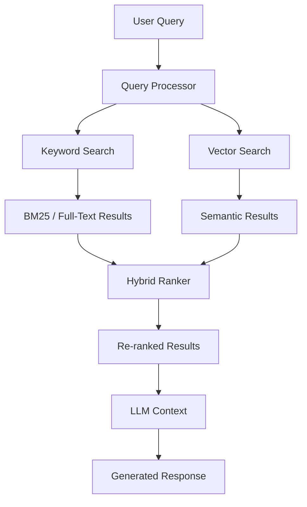
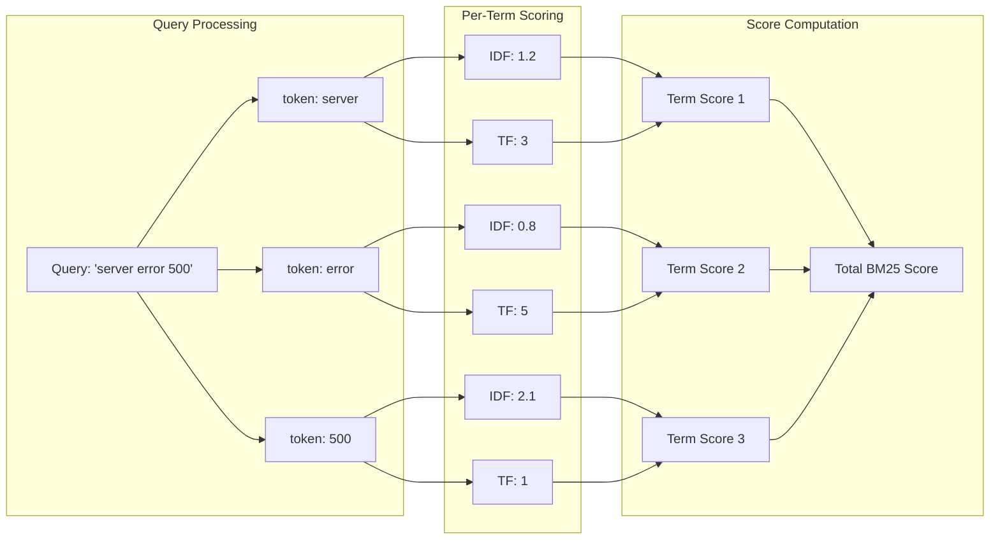
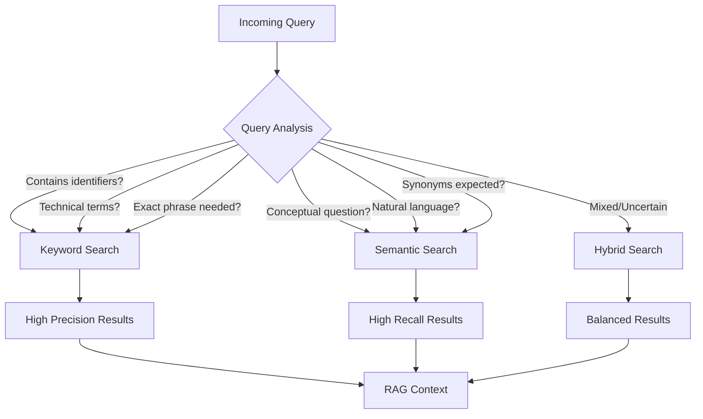
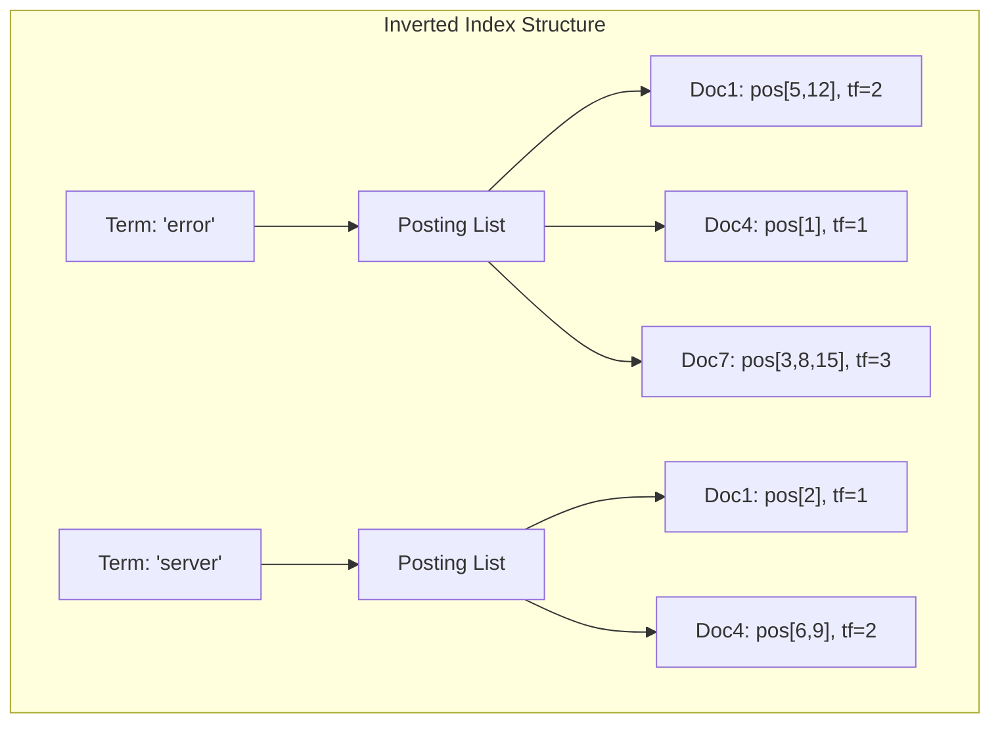

# How to Implement Keyword Search

Author: [nawazdhandala](https://github.com/nawazdhandala)

Tags: RAG, Keyword Search, BM25, Full-Text Search

Description: Learn to implement keyword search using BM25 and full-text search for RAG retrieval.

---

You have built a RAG system with vector embeddings. Semantic search finds conceptually similar documents. A user searches for "error code 5xx" and gets results about "server failures" and "HTTP status codes." Great semantic understanding. But they wanted the exact phrase "error code 5xx" in the documentation. The vector search missed documents that contained those exact keywords.

This is where keyword search shines. It finds exact matches, handles technical jargon, acronyms, and specific identifiers that semantic search often struggles with. The best RAG systems combine both approaches.

This guide shows you how to implement keyword search from scratch, understand the algorithms behind it, and integrate it into your RAG pipeline.

---

## Why Keyword Search Still Matters in 2026

Vector embeddings capture meaning, but they have blind spots:

- **Exact matches**: Product codes like "SKU-12345" or error codes like "ERR_CONNECTION_REFUSED"
- **Technical terms**: Domain-specific jargon that embedding models were not trained on
- **Recent terminology**: New acronyms or product names not in the model's training data
- **User expectations**: Sometimes users want literal matches, not semantic interpretations

Keyword search complements semantic search by excelling at:

- Precision for known-item searches
- Handling out-of-vocabulary terms
- Speed (inverted indexes are fast)
- Interpretability (you can see why a document matched)

---

## The Architecture: Hybrid Retrieval

Before diving into implementation, here is how keyword search fits into a RAG pipeline:



The hybrid ranker combines results from both retrieval methods, giving you the best of both worlds.

---

## Understanding BM25: The Algorithm Behind Keyword Search

BM25 (Best Matching 25) is the industry standard for keyword-based ranking. It improves upon TF-IDF by adding document length normalization and term frequency saturation.

### The BM25 Formula

```
score(D, Q) = sum over terms in Q of:
    IDF(term) * (tf(term, D) * (k1 + 1)) / (tf(term, D) + k1 * (1 - b + b * |D| / avgdl))
```

Where:
- `tf(term, D)` = term frequency in document D
- `|D|` = document length
- `avgdl` = average document length in the corpus
- `k1` = term frequency saturation parameter (typically 1.2 to 2.0)
- `b` = length normalization parameter (typically 0.75)
- `IDF(term)` = inverse document frequency

### Why BM25 Works Well

1. **Term Frequency Saturation**: The first occurrence of a term matters most. Additional occurrences have diminishing returns.
2. **Document Length Normalization**: Longer documents do not get unfair advantages.
3. **IDF Weighting**: Rare terms across the corpus are more important than common ones.

---

## Implementation 1: BM25 from Scratch in Python

Let us build a BM25 implementation to understand the internals:

```python
import math
from collections import Counter
from typing import List, Dict, Tuple

class BM25:
    """
    BM25 ranking algorithm implementation for keyword search.

    This class provides a from-scratch implementation of BM25,
    the standard algorithm used in full-text search engines.
    """

    def __init__(self, k1: float = 1.5, b: float = 0.75):
        """
        Initialize BM25 with tunable parameters.

        Args:
            k1: Term frequency saturation parameter (1.2-2.0 typical)
                Higher values give more weight to term frequency
            b: Length normalization parameter (0-1)
                0 = no normalization, 1 = full normalization
        """
        self.k1 = k1
        self.b = b
        self.corpus_size = 0
        self.avgdl = 0  # Average document length
        self.doc_freqs = {}  # Document frequency for each term
        self.doc_lengths = []  # Length of each document
        self.term_freqs = []  # Term frequencies per document

    def tokenize(self, text: str) -> List[str]:
        """
        Simple whitespace tokenizer with lowercasing.

        For production, consider using spaCy, NLTK, or custom
        tokenizers that handle your domain's vocabulary.
        """
        # Convert to lowercase and split on whitespace
        tokens = text.lower().split()
        # Remove punctuation from token edges
        tokens = [token.strip('.,!?;:"\'()[]{}') for token in tokens]
        # Filter empty tokens
        return [t for t in tokens if t]

    def fit(self, corpus: List[str]) -> None:
        """
        Index a corpus of documents for BM25 scoring.

        This computes document frequencies, term frequencies,
        and corpus statistics needed for ranking.

        Args:
            corpus: List of document strings to index
        """
        self.corpus_size = len(corpus)
        self.doc_lengths = []
        self.term_freqs = []
        self.doc_freqs = {}

        # First pass: compute term frequencies and document lengths
        for doc in corpus:
            tokens = self.tokenize(doc)
            self.doc_lengths.append(len(tokens))

            # Count term frequencies in this document
            tf = Counter(tokens)
            self.term_freqs.append(tf)

            # Update document frequencies (how many docs contain each term)
            for term in tf.keys():
                self.doc_freqs[term] = self.doc_freqs.get(term, 0) + 1

        # Compute average document length
        self.avgdl = sum(self.doc_lengths) / self.corpus_size if self.corpus_size > 0 else 0

    def _compute_idf(self, term: str) -> float:
        """
        Compute Inverse Document Frequency for a term.

        Uses the standard BM25 IDF formula which can produce
        negative values for very common terms (a feature, not a bug).
        """
        # Number of documents containing the term
        df = self.doc_freqs.get(term, 0)

        # BM25 IDF formula
        # Adding 0.5 for smoothing to avoid division issues
        idf = math.log((self.corpus_size - df + 0.5) / (df + 0.5) + 1)
        return idf

    def score(self, query: str, doc_index: int) -> float:
        """
        Compute BM25 score for a query against a specific document.

        Args:
            query: The search query string
            doc_index: Index of the document in the corpus

        Returns:
            BM25 relevance score (higher is more relevant)
        """
        query_tokens = self.tokenize(query)
        doc_tf = self.term_freqs[doc_index]
        doc_len = self.doc_lengths[doc_index]

        score = 0.0
        for term in query_tokens:
            if term not in doc_tf:
                continue

            # Get term frequency in this document
            tf = doc_tf[term]

            # Compute IDF for this term
            idf = self._compute_idf(term)

            # BM25 term score formula
            # Numerator: boosted term frequency
            numerator = tf * (self.k1 + 1)

            # Denominator: normalized term frequency
            # Accounts for document length relative to average
            denominator = tf + self.k1 * (1 - self.b + self.b * doc_len / self.avgdl)

            score += idf * (numerator / denominator)

        return score

    def search(self, query: str, top_k: int = 10) -> List[Tuple[int, float]]:
        """
        Search the corpus and return top-k results.

        Args:
            query: Search query string
            top_k: Number of results to return

        Returns:
            List of (doc_index, score) tuples, sorted by score descending
        """
        scores = []
        for i in range(self.corpus_size):
            score = self.score(query, i)
            if score > 0:  # Only include documents with positive scores
                scores.append((i, score))

        # Sort by score descending
        scores.sort(key=lambda x: x[1], reverse=True)
        return scores[:top_k]


# Example usage demonstrating the BM25 implementation
if __name__ == "__main__":
    # Sample corpus of technical documentation
    corpus = [
        "Python is a programming language used for web development and data science",
        "Error code 5xx indicates server-side errors in HTTP responses",
        "The HTTP 500 Internal Server Error is a generic server error message",
        "Python web frameworks like Flask and Django handle HTTP requests",
        "Database connection errors often show error code ERR_CONNECTION_REFUSED",
        "Server monitoring helps detect 5xx errors before users notice them",
    ]

    # Initialize and fit BM25
    bm25 = BM25(k1=1.5, b=0.75)
    bm25.fit(corpus)

    # Search for exact technical terms
    query = "error code 5xx"
    results = bm25.search(query, top_k=3)

    print(f"Query: '{query}'\n")
    print("Top results:")
    for doc_idx, score in results:
        print(f"  Score: {score:.3f} - {corpus[doc_idx][:60]}...")
```

---

## Implementation 2: Elasticsearch for Production

For production systems, Elasticsearch provides battle-tested full-text search with BM25:

```python
from elasticsearch import Elasticsearch
from typing import List, Dict, Any

class ElasticsearchKeywordSearch:
    """
    Production-ready keyword search using Elasticsearch.

    Elasticsearch provides distributed full-text search with
    BM25 ranking, automatic sharding, and rich query DSL.
    """

    def __init__(self, host: str = "localhost", port: int = 9200):
        """
        Initialize Elasticsearch client.

        Args:
            host: Elasticsearch host address
            port: Elasticsearch port (default 9200)
        """
        self.client = Elasticsearch(
            hosts=[{"host": host, "port": port}],
            # Add authentication for production
            # http_auth=("user", "password"),
        )
        self.index_name = "documents"

    def create_index(self) -> None:
        """
        Create an index with custom analyzer settings.

        The analyzer configuration controls tokenization,
        stemming, and other text processing.
        """
        # Index settings optimized for keyword search
        settings = {
            "settings": {
                "number_of_shards": 1,  # Adjust for your scale
                "number_of_replicas": 0,  # Increase for production
                "analysis": {
                    "analyzer": {
                        "custom_analyzer": {
                            "type": "custom",
                            "tokenizer": "standard",
                            "filter": [
                                "lowercase",
                                "english_stop",
                                "english_stemmer"
                            ]
                        }
                    },
                    "filter": {
                        "english_stop": {
                            "type": "stop",
                            "stopwords": "_english_"
                        },
                        "english_stemmer": {
                            "type": "stemmer",
                            "language": "english"
                        }
                    }
                }
            },
            "mappings": {
                "properties": {
                    # Main content field with custom analysis
                    "content": {
                        "type": "text",
                        "analyzer": "custom_analyzer",
                        # Keep raw version for exact matching
                        "fields": {
                            "raw": {
                                "type": "keyword"
                            }
                        }
                    },
                    # Title gets boosted in search
                    "title": {
                        "type": "text",
                        "analyzer": "custom_analyzer",
                        "boost": 2.0
                    },
                    # Metadata for filtering
                    "category": {
                        "type": "keyword"
                    },
                    "timestamp": {
                        "type": "date"
                    }
                }
            }
        }

        # Delete existing index if it exists
        if self.client.indices.exists(index=self.index_name):
            self.client.indices.delete(index=self.index_name)

        # Create the index
        self.client.indices.create(index=self.index_name, body=settings)
        print(f"Created index: {self.index_name}")

    def index_documents(self, documents: List[Dict[str, Any]]) -> None:
        """
        Bulk index documents into Elasticsearch.

        Args:
            documents: List of document dicts with 'content', 'title', etc.
        """
        from elasticsearch.helpers import bulk

        # Prepare documents for bulk indexing
        actions = []
        for i, doc in enumerate(documents):
            action = {
                "_index": self.index_name,
                "_id": doc.get("id", i),
                "_source": doc
            }
            actions.append(action)

        # Bulk index with error handling
        success, errors = bulk(
            self.client,
            actions,
            raise_on_error=False,
            refresh=True  # Make documents immediately searchable
        )
        print(f"Indexed {success} documents, {len(errors)} errors")

    def search(
        self,
        query: str,
        top_k: int = 10,
        filters: Dict[str, Any] = None
    ) -> List[Dict[str, Any]]:
        """
        Search documents using BM25 with optional filters.

        Args:
            query: Search query string
            top_k: Number of results to return
            filters: Optional filters (e.g., {"category": "error"})

        Returns:
            List of matching documents with scores
        """
        # Build the query
        must_clauses = [
            {
                "multi_match": {
                    "query": query,
                    "fields": ["title^2", "content"],  # Title boosted 2x
                    "type": "best_fields",
                    "fuzziness": "AUTO"  # Handle typos
                }
            }
        ]

        # Add filters if provided
        filter_clauses = []
        if filters:
            for field, value in filters.items():
                filter_clauses.append({"term": {field: value}})

        # Construct the full query
        search_body = {
            "query": {
                "bool": {
                    "must": must_clauses,
                    "filter": filter_clauses
                }
            },
            "size": top_k,
            # Include score explanation for debugging
            "explain": False,
            # Highlight matching terms
            "highlight": {
                "fields": {
                    "content": {},
                    "title": {}
                }
            }
        }

        # Execute search
        response = self.client.search(
            index=self.index_name,
            body=search_body
        )

        # Process results
        results = []
        for hit in response["hits"]["hits"]:
            result = {
                "id": hit["_id"],
                "score": hit["_score"],
                "source": hit["_source"],
                "highlights": hit.get("highlight", {})
            }
            results.append(result)

        return results

    def search_exact_phrase(self, phrase: str, top_k: int = 10) -> List[Dict[str, Any]]:
        """
        Search for an exact phrase match.

        Useful when users want literal matches,
        not fuzzy or stemmed results.
        """
        search_body = {
            "query": {
                "match_phrase": {
                    "content": {
                        "query": phrase,
                        "slop": 0  # Require exact order
                    }
                }
            },
            "size": top_k
        }

        response = self.client.search(
            index=self.index_name,
            body=search_body
        )

        return [
            {
                "id": hit["_id"],
                "score": hit["_score"],
                "source": hit["_source"]
            }
            for hit in response["hits"]["hits"]
        ]


# Example usage
if __name__ == "__main__":
    # Initialize search client
    search = ElasticsearchKeywordSearch()

    # Create index with custom settings
    search.create_index()

    # Sample documents to index
    documents = [
        {
            "id": "doc1",
            "title": "HTTP Error Codes Reference",
            "content": "Error code 5xx indicates server-side errors. Common codes include 500, 502, 503.",
            "category": "reference"
        },
        {
            "id": "doc2",
            "title": "Debugging Server Errors",
            "content": "When you encounter 5xx errors, check server logs first. Error code 500 is generic.",
            "category": "tutorial"
        },
        {
            "id": "doc3",
            "title": "Python Web Development",
            "content": "Flask and Django are popular Python web frameworks for building APIs.",
            "category": "tutorial"
        }
    ]

    # Index documents
    search.index_documents(documents)

    # Search for error codes
    results = search.search("error code 5xx", top_k=5)
    for r in results:
        print(f"Score: {r['score']:.2f} - {r['source']['title']}")
```

---

## Tokenization: The Foundation of Keyword Search

How you tokenize text dramatically affects search quality. Here is a deep dive into tokenization strategies:

```python
import re
from typing import List, Callable
from dataclasses import dataclass

@dataclass
class TokenizerConfig:
    """Configuration for text tokenization."""
    lowercase: bool = True
    remove_punctuation: bool = True
    remove_stopwords: bool = True
    apply_stemming: bool = True
    min_token_length: int = 2

class AdvancedTokenizer:
    """
    Advanced tokenizer with multiple processing options.

    Tokenization quality directly impacts search relevance.
    Different use cases need different tokenization strategies.
    """

    # Common English stopwords
    STOPWORDS = {
        "a", "an", "the", "and", "or", "but", "in", "on", "at", "to", "for",
        "of", "with", "by", "from", "is", "are", "was", "were", "be", "been",
        "being", "have", "has", "had", "do", "does", "did", "will", "would",
        "could", "should", "may", "might", "must", "shall", "can", "need",
        "this", "that", "these", "those", "it", "its", "as", "if", "then"
    }

    def __init__(self, config: TokenizerConfig = None):
        """Initialize tokenizer with configuration."""
        self.config = config or TokenizerConfig()

        # Initialize stemmer if needed
        if self.config.apply_stemming:
            try:
                from nltk.stem import PorterStemmer
                self.stemmer = PorterStemmer()
            except ImportError:
                print("NLTK not available, stemming disabled")
                self.stemmer = None
        else:
            self.stemmer = None

    def tokenize(self, text: str) -> List[str]:
        """
        Tokenize text with configured processing steps.

        Args:
            text: Input text to tokenize

        Returns:
            List of processed tokens
        """
        # Step 1: Lowercase if configured
        if self.config.lowercase:
            text = text.lower()

        # Step 2: Handle special patterns before splitting
        # Preserve technical identifiers like error codes
        text = self._preserve_identifiers(text)

        # Step 3: Split into tokens
        # Use regex to handle various separators
        tokens = re.findall(r'\b\w+\b', text)

        # Step 4: Remove punctuation from tokens
        if self.config.remove_punctuation:
            tokens = [re.sub(r'[^\w\s]', '', t) for t in tokens]

        # Step 5: Filter by minimum length
        tokens = [t for t in tokens if len(t) >= self.config.min_token_length]

        # Step 6: Remove stopwords if configured
        if self.config.remove_stopwords:
            tokens = [t for t in tokens if t not in self.STOPWORDS]

        # Step 7: Apply stemming if configured and available
        if self.config.apply_stemming and self.stemmer:
            tokens = [self.stemmer.stem(t) for t in tokens]

        return tokens

    def _preserve_identifiers(self, text: str) -> str:
        """
        Preserve technical identifiers during tokenization.

        Handles patterns like:
        - Error codes: ERR_CONNECTION_REFUSED, 5xx
        - SKUs: SKU-12345
        - Version numbers: v2.3.1
        """
        # These patterns are kept as single tokens
        # Convert underscores to a placeholder to keep them together
        # This is a simplified example; production code needs more patterns
        preserved = text

        # Keep error codes together (e.g., ERR_CONNECTION_REFUSED)
        preserved = re.sub(
            r'\b([A-Z]+_[A-Z_]+)\b',
            lambda m: m.group(1).replace('_', 'UNDERSCORE'),
            preserved
        )

        return preserved

    def tokenize_for_index(self, text: str) -> List[str]:
        """
        Tokenize for indexing (more aggressive processing).

        Index-time tokenization can be more aggressive since
        we want to match various query forms.
        """
        # Standard tokenization
        tokens = self.tokenize(text)

        # Also add n-grams for partial matching
        bigrams = self._generate_ngrams(tokens, n=2)

        return tokens + bigrams

    def tokenize_for_query(self, text: str) -> List[str]:
        """
        Tokenize for querying (less aggressive processing).

        Query-time tokenization should be lighter to
        preserve user intent.
        """
        # Use a less aggressive config for queries
        original_config = self.config
        self.config = TokenizerConfig(
            lowercase=True,
            remove_punctuation=True,
            remove_stopwords=False,  # Keep stopwords in queries
            apply_stemming=True,
            min_token_length=1
        )

        tokens = self.tokenize(text)
        self.config = original_config

        return tokens

    def _generate_ngrams(self, tokens: List[str], n: int = 2) -> List[str]:
        """Generate n-grams from token list."""
        if len(tokens) < n:
            return []
        return [' '.join(tokens[i:i+n]) for i in range(len(tokens) - n + 1)]


# Demonstrate tokenization differences
if __name__ == "__main__":
    tokenizer = AdvancedTokenizer()

    text = "Error code ERR_CONNECTION_REFUSED occurred on the server at 5:30 PM"

    print(f"Original: {text}")
    print(f"Tokens: {tokenizer.tokenize(text)}")
    print(f"Index tokens: {tokenizer.tokenize_for_index(text)}")
    print(f"Query tokens: {tokenizer.tokenize_for_query(text)}")
```

---

## Scoring Deep Dive: How Documents Get Ranked

Understanding scoring helps you tune search quality. Here is a visualization of how BM25 scoring works:



### Score Breakdown Example

```python
def explain_bm25_score(
    query: str,
    document: str,
    corpus_stats: dict
) -> dict:
    """
    Provide a detailed breakdown of BM25 scoring.

    This helps debug why certain documents rank higher
    and tune your search parameters.
    """
    # Tokenize query and document
    query_tokens = query.lower().split()
    doc_tokens = document.lower().split()

    # BM25 parameters
    k1 = 1.5
    b = 0.75

    # Document length normalization
    doc_len = len(doc_tokens)
    avgdl = corpus_stats['average_doc_length']

    explanation = {
        'query': query,
        'document_length': doc_len,
        'average_doc_length': avgdl,
        'length_ratio': doc_len / avgdl,
        'term_scores': [],
        'total_score': 0.0
    }

    for term in query_tokens:
        # Term frequency in document
        tf = doc_tokens.count(term)

        # Document frequency from corpus stats
        df = corpus_stats['doc_freqs'].get(term, 0)
        corpus_size = corpus_stats['corpus_size']

        # IDF calculation
        idf = math.log((corpus_size - df + 0.5) / (df + 0.5) + 1)

        # Length normalization factor
        length_norm = 1 - b + b * (doc_len / avgdl)

        # Final term score
        if tf > 0:
            numerator = tf * (k1 + 1)
            denominator = tf + k1 * length_norm
            term_score = idf * (numerator / denominator)
        else:
            term_score = 0.0

        explanation['term_scores'].append({
            'term': term,
            'tf': tf,
            'df': df,
            'idf': round(idf, 3),
            'length_norm': round(length_norm, 3),
            'score': round(term_score, 3)
        })

        explanation['total_score'] += term_score

    explanation['total_score'] = round(explanation['total_score'], 3)
    return explanation


# Example score explanation
import math

corpus_stats = {
    'corpus_size': 1000,
    'average_doc_length': 150,
    'doc_freqs': {
        'server': 200,
        'error': 150,
        '500': 50
    }
}

query = "server error 500"
document = "The server returned error code 500 multiple times. Error handling failed."

explanation = explain_bm25_score(query, document, corpus_stats)

print("BM25 Score Explanation")
print("=" * 50)
print(f"Query: {explanation['query']}")
print(f"Document length: {explanation['document_length']} tokens")
print(f"Length ratio: {explanation['length_ratio']:.2f}x average")
print()
print("Term Contributions:")
for term_info in explanation['term_scores']:
    print(f"  '{term_info['term']}':")
    print(f"    TF={term_info['tf']}, DF={term_info['df']}, IDF={term_info['idf']}")
    print(f"    Score contribution: {term_info['score']}")
print()
print(f"Total BM25 Score: {explanation['total_score']}")
```

---

## Hybrid Search: Combining Keyword and Semantic

The real power comes from combining keyword search with vector search:

```python
from typing import List, Dict, Tuple, Optional
from dataclasses import dataclass
import numpy as np

@dataclass
class SearchResult:
    """Unified search result from any retrieval method."""
    doc_id: str
    content: str
    score: float
    source: str  # 'keyword', 'semantic', or 'hybrid'

class HybridSearcher:
    """
    Combines keyword (BM25) and semantic (vector) search.

    Uses Reciprocal Rank Fusion (RRF) to merge results
    from different retrieval methods.
    """

    def __init__(
        self,
        keyword_searcher,  # BM25 or Elasticsearch instance
        vector_searcher,   # Vector store instance
        keyword_weight: float = 0.5,
        rrf_k: int = 60
    ):
        """
        Initialize hybrid searcher.

        Args:
            keyword_searcher: Keyword search implementation
            vector_searcher: Vector search implementation
            keyword_weight: Weight for keyword results (0-1)
            rrf_k: RRF parameter (higher = more even ranking)
        """
        self.keyword_searcher = keyword_searcher
        self.vector_searcher = vector_searcher
        self.keyword_weight = keyword_weight
        self.semantic_weight = 1 - keyword_weight
        self.rrf_k = rrf_k

    def search(
        self,
        query: str,
        top_k: int = 10,
        use_rrf: bool = True
    ) -> List[SearchResult]:
        """
        Perform hybrid search combining keyword and semantic results.

        Args:
            query: Search query string
            top_k: Number of results to return
            use_rrf: If True, use RRF fusion; else use weighted scores

        Returns:
            List of SearchResult objects
        """
        # Get results from both methods
        # Request more than top_k to have candidates for fusion
        keyword_results = self.keyword_searcher.search(query, top_k=top_k * 2)
        semantic_results = self.vector_searcher.search(query, top_k=top_k * 2)

        if use_rrf:
            return self._rrf_fusion(keyword_results, semantic_results, top_k)
        else:
            return self._weighted_fusion(keyword_results, semantic_results, top_k)

    def _rrf_fusion(
        self,
        keyword_results: List[Tuple],
        semantic_results: List[Tuple],
        top_k: int
    ) -> List[SearchResult]:
        """
        Reciprocal Rank Fusion (RRF) for combining rankings.

        RRF is parameter-free and robust to score normalization
        differences between retrieval methods.

        Formula: RRF(d) = sum over rankings r of: 1 / (k + rank_r(d))
        """
        # Build rank dictionaries
        # keyword_results format: [(doc_id, score), ...]
        keyword_ranks = {
            doc_id: rank
            for rank, (doc_id, _) in enumerate(keyword_results, 1)
        }
        semantic_ranks = {
            doc_id: rank
            for rank, (doc_id, _) in enumerate(semantic_results, 1)
        }

        # Get all unique document IDs
        all_docs = set(keyword_ranks.keys()) | set(semantic_ranks.keys())

        # Compute RRF scores
        rrf_scores = {}
        for doc_id in all_docs:
            score = 0.0

            # Contribution from keyword ranking
            if doc_id in keyword_ranks:
                score += self.keyword_weight / (self.rrf_k + keyword_ranks[doc_id])

            # Contribution from semantic ranking
            if doc_id in semantic_ranks:
                score += self.semantic_weight / (self.rrf_k + semantic_ranks[doc_id])

            rrf_scores[doc_id] = score

        # Sort by RRF score
        sorted_docs = sorted(rrf_scores.items(), key=lambda x: x[1], reverse=True)

        # Build result objects
        results = []
        for doc_id, score in sorted_docs[:top_k]:
            # Determine source(s)
            in_keyword = doc_id in keyword_ranks
            in_semantic = doc_id in semantic_ranks

            if in_keyword and in_semantic:
                source = 'hybrid'
            elif in_keyword:
                source = 'keyword'
            else:
                source = 'semantic'

            results.append(SearchResult(
                doc_id=doc_id,
                content="",  # Would be fetched from document store
                score=score,
                source=source
            ))

        return results

    def _weighted_fusion(
        self,
        keyword_results: List[Tuple],
        semantic_results: List[Tuple],
        top_k: int
    ) -> List[SearchResult]:
        """
        Weighted score fusion with normalization.

        Normalizes scores to [0,1] range before combining.
        More sensitive to score distributions than RRF.
        """
        def normalize_scores(results: List[Tuple]) -> Dict[str, float]:
            """Min-max normalize scores to [0,1]."""
            if not results:
                return {}

            scores = [score for _, score in results]
            min_score = min(scores)
            max_score = max(scores)
            range_score = max_score - min_score

            if range_score == 0:
                return {doc_id: 1.0 for doc_id, _ in results}

            return {
                doc_id: (score - min_score) / range_score
                for doc_id, score in results
            }

        # Normalize scores from both methods
        keyword_normalized = normalize_scores(keyword_results)
        semantic_normalized = normalize_scores(semantic_results)

        # Combine scores
        all_docs = set(keyword_normalized.keys()) | set(semantic_normalized.keys())
        combined_scores = {}

        for doc_id in all_docs:
            kw_score = keyword_normalized.get(doc_id, 0.0)
            sem_score = semantic_normalized.get(doc_id, 0.0)
            combined_scores[doc_id] = (
                self.keyword_weight * kw_score +
                self.semantic_weight * sem_score
            )

        # Sort and return top-k
        sorted_docs = sorted(combined_scores.items(), key=lambda x: x[1], reverse=True)

        return [
            SearchResult(doc_id=doc_id, content="", score=score, source='hybrid')
            for doc_id, score in sorted_docs[:top_k]
        ]


# Visualization of when to use which search method
"""
Decision Matrix: Keyword vs Semantic vs Hybrid

| Query Type                | Best Method | Example                        |
|---------------------------|-------------|--------------------------------|
| Exact identifier          | Keyword     | "SKU-12345"                    |
| Error codes               | Keyword     | "ERR_CONNECTION_REFUSED"       |
| Technical jargon          | Keyword     | "segfault core dump"           |
| Conceptual questions      | Semantic    | "how to handle user auth"      |
| Natural language          | Semantic    | "my app is running slowly"     |
| Mixed intent              | Hybrid      | "Python memory leak error"     |
| Documentation search      | Hybrid      | "configure SSL certificates"   |
| Code search               | Keyword     | "def process_payment"          |
"""
```

---

## When to Use Keyword vs Semantic Search



### Query Classification for Routing

```python
import re
from enum import Enum
from typing import Tuple

class SearchMode(Enum):
    KEYWORD = "keyword"
    SEMANTIC = "semantic"
    HYBRID = "hybrid"

class QueryClassifier:
    """
    Classify queries to route to the appropriate search method.

    This improves both relevance and efficiency by using
    the right tool for each query type.
    """

    # Patterns that suggest keyword search
    KEYWORD_PATTERNS = [
        r'\b[A-Z]{2,}_[A-Z_]+\b',      # ERR_CONNECTION_REFUSED
        r'\b[A-Z]+-\d+\b',              # JIRA-123, SKU-456
        r'\bv?\d+\.\d+(\.\d+)?\b',      # v2.3.1, 1.0.0
        r'\b[45]\d{2}\b',               # HTTP status codes: 404, 500
        r'"[^"]+"|\'[^\']+\'',          # Quoted phrases
        r'\b(error|exception)\s+code\b', # Error code references
        r'\b0x[0-9a-fA-F]+\b',          # Hex values
    ]

    # Words that suggest semantic search
    SEMANTIC_INDICATORS = {
        'how', 'why', 'what', 'when', 'explain', 'describe',
        'best', 'better', 'recommended', 'should', 'could',
        'similar', 'like', 'alternative', 'instead'
    }

    def __init__(self):
        """Compile regex patterns for efficiency."""
        self.keyword_regex = [re.compile(p, re.IGNORECASE) for p in self.KEYWORD_PATTERNS]

    def classify(self, query: str) -> Tuple[SearchMode, float]:
        """
        Classify a query and return the recommended search mode.

        Args:
            query: The search query string

        Returns:
            Tuple of (SearchMode, confidence score 0-1)
        """
        keyword_score = self._keyword_score(query)
        semantic_score = self._semantic_score(query)

        # Determine mode based on scores
        if keyword_score > 0.7 and semantic_score < 0.3:
            return SearchMode.KEYWORD, keyword_score
        elif semantic_score > 0.7 and keyword_score < 0.3:
            return SearchMode.SEMANTIC, semantic_score
        else:
            # When in doubt, use hybrid
            confidence = 1.0 - abs(keyword_score - semantic_score)
            return SearchMode.HYBRID, confidence

    def _keyword_score(self, query: str) -> float:
        """Score how much a query suggests keyword search."""
        score = 0.0

        # Check for keyword-suggesting patterns
        for pattern in self.keyword_regex:
            if pattern.search(query):
                score += 0.3

        # Short queries (1-3 words) often want exact matches
        word_count = len(query.split())
        if word_count <= 3:
            score += 0.2

        # Queries with special characters
        if re.search(r'[_\-\.]', query):
            score += 0.2

        return min(score, 1.0)

    def _semantic_score(self, query: str) -> float:
        """Score how much a query suggests semantic search."""
        score = 0.0

        query_lower = query.lower()
        words = set(query_lower.split())

        # Check for semantic indicator words
        matching_indicators = words & self.SEMANTIC_INDICATORS
        if matching_indicators:
            score += 0.3 * len(matching_indicators)

        # Longer queries (5+ words) often are natural language
        word_count = len(words)
        if word_count >= 5:
            score += 0.3

        # Questions (ends with ?)
        if query.strip().endswith('?'):
            score += 0.3

        return min(score, 1.0)


# Example usage
classifier = QueryClassifier()

test_queries = [
    "ERR_CONNECTION_REFUSED",
    "how do I handle authentication in my app",
    "error code 5xx troubleshooting",
    "python memory leak",
    "what is the best way to implement caching",
    "SKU-12345",
]

print("Query Classification Results")
print("=" * 60)
for query in test_queries:
    mode, confidence = classifier.classify(query)
    print(f"Query: '{query}'")
    print(f"  Mode: {mode.value}, Confidence: {confidence:.2f}")
    print()
```

---

## Performance Optimization

### Inverted Index Structure



### Index Optimization Tips

```python
class OptimizedBM25Index:
    """
    Memory and speed optimized BM25 index.

    Key optimizations:
    1. Pre-computed IDF values
    2. Sorted posting lists for skip pointers
    3. Term frequency caching
    4. Document length pre-normalization
    """

    def __init__(self, k1: float = 1.5, b: float = 0.75):
        self.k1 = k1
        self.b = b

        # Pre-computed values
        self.idf_cache = {}  # term -> IDF value
        self.doc_norm_cache = []  # doc_id -> length normalization factor

        # Inverted index: term -> [(doc_id, tf), ...]
        self.inverted_index = {}

        # Document store
        self.documents = []

    def build_index(self, corpus: List[str]) -> None:
        """
        Build optimized inverted index.

        Pre-computes IDF and length normalization to
        speed up query-time scoring.
        """
        self.documents = corpus
        n = len(corpus)

        # First pass: build inverted index and collect stats
        doc_lengths = []
        term_doc_counts = {}  # term -> number of docs containing it

        for doc_id, doc in enumerate(corpus):
            tokens = self._tokenize(doc)
            doc_lengths.append(len(tokens))

            # Count term frequencies
            tf_counts = {}
            for token in tokens:
                tf_counts[token] = tf_counts.get(token, 0) + 1

            # Add to inverted index
            for term, tf in tf_counts.items():
                if term not in self.inverted_index:
                    self.inverted_index[term] = []
                    term_doc_counts[term] = 0

                self.inverted_index[term].append((doc_id, tf))
                term_doc_counts[term] += 1

        # Pre-compute average document length
        avgdl = sum(doc_lengths) / n if n > 0 else 1

        # Pre-compute IDF for all terms
        for term, df in term_doc_counts.items():
            self.idf_cache[term] = math.log((n - df + 0.5) / (df + 0.5) + 1)

        # Pre-compute length normalization factors
        for doc_len in doc_lengths:
            norm_factor = 1 - self.b + self.b * (doc_len / avgdl)
            self.doc_norm_cache.append(norm_factor)

        # Sort posting lists by doc_id for efficient intersection
        for term in self.inverted_index:
            self.inverted_index[term].sort(key=lambda x: x[0])

        print(f"Index built: {len(corpus)} docs, {len(self.inverted_index)} unique terms")

    def _tokenize(self, text: str) -> List[str]:
        """Simple tokenization."""
        return text.lower().split()

    def search(self, query: str, top_k: int = 10) -> List[Tuple[int, float]]:
        """
        Fast search using pre-computed values.

        Uses the inverted index to only score documents
        that contain at least one query term.
        """
        query_tokens = self._tokenize(query)

        # Get candidate documents (contain at least one query term)
        candidates = set()
        for token in query_tokens:
            if token in self.inverted_index:
                for doc_id, _ in self.inverted_index[token]:
                    candidates.add(doc_id)

        # Score only candidate documents
        scores = []
        for doc_id in candidates:
            score = self._score_document(query_tokens, doc_id)
            if score > 0:
                scores.append((doc_id, score))

        # Return top-k
        scores.sort(key=lambda x: x[1], reverse=True)
        return scores[:top_k]

    def _score_document(self, query_tokens: List[str], doc_id: int) -> float:
        """Score a single document against query tokens."""
        score = 0.0
        norm_factor = self.doc_norm_cache[doc_id]

        for token in query_tokens:
            if token not in self.inverted_index:
                continue

            # Binary search for doc_id in posting list
            posting_list = self.inverted_index[token]
            tf = self._find_tf(posting_list, doc_id)

            if tf == 0:
                continue

            # Use pre-computed IDF
            idf = self.idf_cache[token]

            # BM25 scoring with pre-computed normalization
            numerator = tf * (self.k1 + 1)
            denominator = tf + self.k1 * norm_factor

            score += idf * (numerator / denominator)

        return score

    def _find_tf(self, posting_list: List[Tuple[int, int]], doc_id: int) -> int:
        """Binary search for term frequency in sorted posting list."""
        left, right = 0, len(posting_list) - 1

        while left <= right:
            mid = (left + right) // 2
            if posting_list[mid][0] == doc_id:
                return posting_list[mid][1]
            elif posting_list[mid][0] < doc_id:
                left = mid + 1
            else:
                right = mid - 1

        return 0  # Document not in posting list
```

---

## Integration with RAG Pipeline

Here is how keyword search fits into a complete RAG system:

```python
from typing import List, Dict, Any, Optional
from dataclasses import dataclass

@dataclass
class RAGContext:
    """Context retrieved for RAG generation."""
    documents: List[str]
    scores: List[float]
    sources: List[str]
    search_mode: str

class RAGKeywordRetriever:
    """
    Complete RAG retriever with keyword search support.

    Implements the retrieval stage of RAG, supporting
    keyword, semantic, and hybrid search modes.
    """

    def __init__(
        self,
        keyword_index: Any,      # BM25 or Elasticsearch
        vector_store: Any,       # Vector database
        query_classifier: QueryClassifier,
        documents: List[str]
    ):
        self.keyword_index = keyword_index
        self.vector_store = vector_store
        self.classifier = query_classifier
        self.documents = documents

    def retrieve(
        self,
        query: str,
        top_k: int = 5,
        force_mode: Optional[str] = None
    ) -> RAGContext:
        """
        Retrieve relevant documents for RAG context.

        Args:
            query: User query
            top_k: Number of documents to retrieve
            force_mode: Override automatic mode selection

        Returns:
            RAGContext with documents and metadata
        """
        # Determine search mode
        if force_mode:
            mode = SearchMode(force_mode)
            confidence = 1.0
        else:
            mode, confidence = self.classifier.classify(query)

        # Execute appropriate search
        if mode == SearchMode.KEYWORD:
            results = self._keyword_search(query, top_k)
        elif mode == SearchMode.SEMANTIC:
            results = self._semantic_search(query, top_k)
        else:
            results = self._hybrid_search(query, top_k)

        # Build context
        documents = [self.documents[r[0]] for r in results]
        scores = [r[1] for r in results]
        sources = [mode.value] * len(results)

        return RAGContext(
            documents=documents,
            scores=scores,
            sources=sources,
            search_mode=mode.value
        )

    def _keyword_search(self, query: str, top_k: int) -> List[Tuple[int, float]]:
        """Perform keyword-only search."""
        return self.keyword_index.search(query, top_k)

    def _semantic_search(self, query: str, top_k: int) -> List[Tuple[int, float]]:
        """Perform semantic-only search."""
        return self.vector_store.search(query, top_k)

    def _hybrid_search(self, query: str, top_k: int) -> List[Tuple[int, float]]:
        """Perform hybrid search with RRF fusion."""
        keyword_results = self._keyword_search(query, top_k * 2)
        semantic_results = self._semantic_search(query, top_k * 2)

        # RRF fusion
        k = 60
        scores = {}

        for rank, (doc_id, _) in enumerate(keyword_results, 1):
            scores[doc_id] = scores.get(doc_id, 0) + 1 / (k + rank)

        for rank, (doc_id, _) in enumerate(semantic_results, 1):
            scores[doc_id] = scores.get(doc_id, 0) + 1 / (k + rank)

        sorted_results = sorted(scores.items(), key=lambda x: x[1], reverse=True)
        return sorted_results[:top_k]

    def format_context_for_llm(self, context: RAGContext) -> str:
        """
        Format retrieved documents for LLM prompt.

        Includes relevance scores and source indicators
        to help the LLM weight information appropriately.
        """
        formatted_parts = []

        for i, (doc, score) in enumerate(zip(context.documents, context.scores), 1):
            # Truncate long documents
            truncated = doc[:1000] + "..." if len(doc) > 1000 else doc

            formatted_parts.append(
                f"[Document {i}] (relevance: {score:.2f})\n{truncated}"
            )

        return "\n\n---\n\n".join(formatted_parts)


# Complete RAG example
def rag_query_example():
    """Demonstrate complete RAG flow with keyword search."""

    # Sample knowledge base
    documents = [
        "Error code ERR_CONNECTION_REFUSED occurs when the server refuses the connection. Check if the service is running.",
        "HTTP 5xx errors indicate server-side problems. Common causes include overload and crashes.",
        "To configure SSL certificates, use the ssl_certificate directive in your nginx config.",
        "Memory leaks in Python can be detected using tracemalloc or objgraph libraries.",
        "The server handles authentication using JWT tokens with RS256 signing.",
    ]

    # Initialize components (simplified for example)
    bm25 = BM25(k1=1.5, b=0.75)
    bm25.fit(documents)

    classifier = QueryClassifier()

    # Create retriever (vector_store would be real in production)
    class MockVectorStore:
        def search(self, query, top_k):
            # Simplified mock
            return [(0, 0.8), (1, 0.7)]

    retriever = RAGKeywordRetriever(
        keyword_index=bm25,
        vector_store=MockVectorStore(),
        query_classifier=classifier,
        documents=documents
    )

    # Example queries showing different search modes
    queries = [
        "ERR_CONNECTION_REFUSED",  # Keyword mode
        "how do I secure my API",   # Semantic mode
        "server 5xx error fix",     # Hybrid mode
    ]

    for query in queries:
        context = retriever.retrieve(query, top_k=2)

        print(f"\nQuery: '{query}'")
        print(f"Search mode: {context.search_mode}")
        print("Retrieved documents:")
        for doc, score in zip(context.documents, context.scores):
            print(f"  [{score:.3f}] {doc[:60]}...")


if __name__ == "__main__":
    rag_query_example()
```

---

## Best Practices Summary

1. **Index Design**
   - Choose appropriate analyzers for your domain
   - Pre-compute IDF and length normalization
   - Use sorted posting lists for efficient queries

2. **Tokenization**
   - Preserve domain-specific identifiers
   - Apply stemming carefully (not for code or IDs)
   - Consider n-grams for partial matching

3. **Scoring Tuning**
   - Start with BM25 defaults (k1=1.5, b=0.75)
   - Tune based on relevance feedback
   - Use query-specific boosts for important fields

4. **Hybrid Search**
   - Use RRF for robust fusion
   - Classify queries to route appropriately
   - Fall back to hybrid when uncertain

5. **Performance**
   - Build inverted indexes for large corpora
   - Cache IDF values
   - Use skip pointers in posting lists

---

## Next Steps

You now have the foundation to implement keyword search in your RAG system. Key takeaways:

- BM25 remains the gold standard for keyword ranking
- Tokenization quality directly impacts search quality
- Hybrid search (keyword + semantic) outperforms either alone
- Query classification helps route to the right search method
- Pre-computation and indexing are essential for scale

Start by implementing BM25 from scratch to understand the algorithm, then move to Elasticsearch for production workloads. Combine with vector search using RRF fusion for the best RAG retrieval results.

---

**Related Reading:**

- [Traces and Spans in OpenTelemetry](https://oneuptime.com/blog/post/2025-08-27-traces-and-spans-in-opentelemetry/view)
- [How to Structure Logs Properly in OpenTelemetry](https://oneuptime.com/blog/post/2025-08-28-how-to-structure-logs-properly-in-opentelemetry/view)
