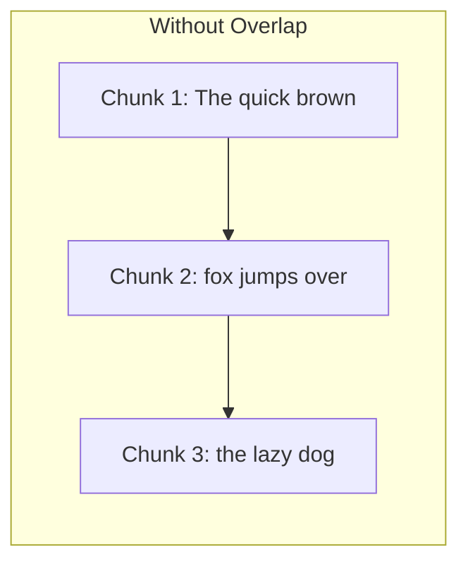
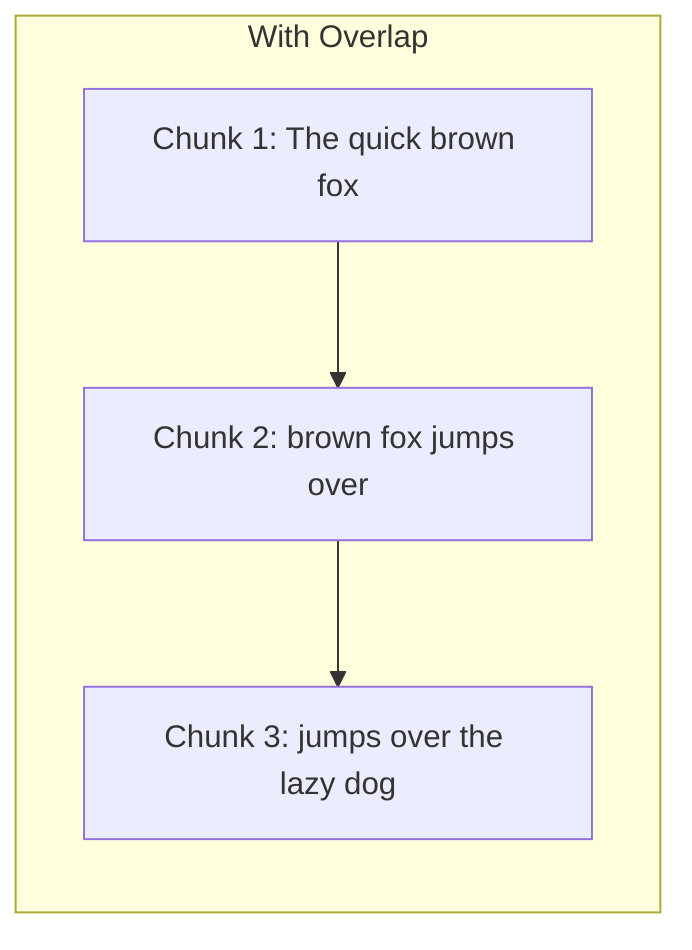
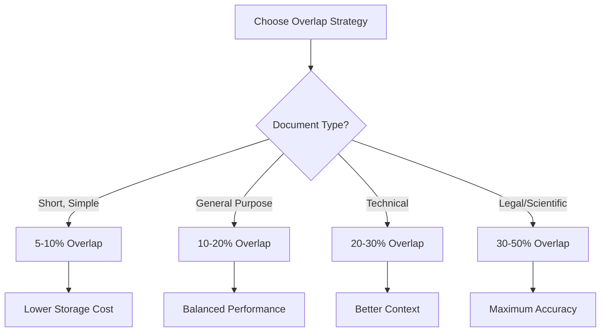
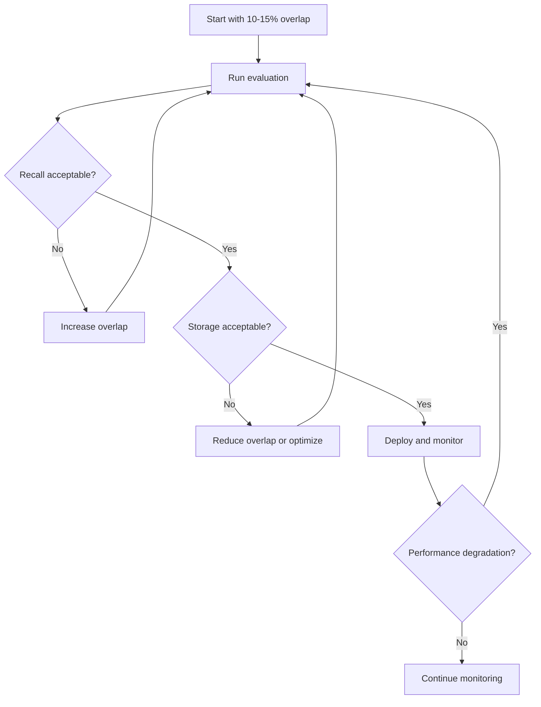

# How to Create Overlap Strategies

Author: [nawazdhandala](https://github.com/nawazdhandala)

Tags: RAG, Chunking, Overlap, Text Processing

Description: Learn to create overlap strategies for preserving context across chunk boundaries in RAG systems.

---

Retrieval Augmented Generation (RAG) systems depend heavily on how documents are split into chunks. One of the most critical aspects of chunking is the overlap strategy. Without proper overlap, important context can be lost at chunk boundaries, leading to incomplete or inaccurate retrieval results.

In this post, we will explore various overlap strategies, when to use them, and how to implement them effectively.

## Why Overlap Matters

When splitting documents into chunks, boundaries often fall in the middle of sentences, paragraphs, or logical units. This creates several problems:

1. **Context Loss**: Important information may span two chunks
2. **Semantic Fragmentation**: Related concepts get separated
3. **Query Mismatch**: User queries may match content that was split across boundaries

Overlap solves these issues by ensuring that content near boundaries appears in multiple chunks.





## Types of Overlap Strategies

There are several approaches to implementing overlap in RAG chunking systems.

### 1. Fixed Token Overlap

The simplest approach uses a fixed number of tokens from the end of one chunk at the beginning of the next.

```python
def chunk_with_fixed_overlap(
    text: str,
    chunk_size: int = 500,
    overlap_tokens: int = 50
) -> list[str]:
    """
    Split text into chunks with a fixed token overlap.

    Args:
        text: The input text to chunk
        chunk_size: Maximum tokens per chunk
        overlap_tokens: Number of tokens to overlap between chunks

    Returns:
        List of text chunks with overlap
    """
    # Tokenize the text (using simple whitespace splitting for demonstration)
    tokens = text.split()
    chunks = []
    start = 0

    while start < len(tokens):
        # Calculate end position for this chunk
        end = start + chunk_size

        # Extract tokens for this chunk
        chunk_tokens = tokens[start:end]
        chunks.append(' '.join(chunk_tokens))

        # Move start position, accounting for overlap
        # Ensure we make progress even with large overlaps
        step = max(1, chunk_size - overlap_tokens)
        start += step

    return chunks


# Example usage
sample_text = """
Machine learning is a subset of artificial intelligence that enables
systems to learn and improve from experience. Deep learning is a
specialized form of machine learning using neural networks with many layers.
These networks can automatically discover representations needed for
detection or classification from raw data.
"""

chunks = chunk_with_fixed_overlap(sample_text, chunk_size=20, overlap_tokens=5)
for i, chunk in enumerate(chunks):
    print(f"Chunk {i + 1}: {chunk[:80]}...")
```

### 2. Percentage-Based Overlap

A more flexible approach calculates overlap as a percentage of the chunk size.

```python
def chunk_with_percentage_overlap(
    text: str,
    chunk_size: int = 500,
    overlap_percentage: float = 0.1
) -> list[str]:
    """
    Split text into chunks with percentage-based overlap.

    Args:
        text: The input text to chunk
        chunk_size: Maximum tokens per chunk
        overlap_percentage: Fraction of chunk size to overlap (0.0 to 0.5)

    Returns:
        List of text chunks with calculated overlap
    """
    # Validate overlap percentage
    if not 0.0 <= overlap_percentage <= 0.5:
        raise ValueError("Overlap percentage must be between 0.0 and 0.5")

    tokens = text.split()
    chunks = []

    # Calculate actual overlap from percentage
    overlap_tokens = int(chunk_size * overlap_percentage)
    step_size = chunk_size - overlap_tokens

    start = 0
    while start < len(tokens):
        end = start + chunk_size
        chunk_tokens = tokens[start:end]
        chunks.append(' '.join(chunk_tokens))
        start += step_size

    return chunks


# Demonstration of different overlap percentages
text = "word " * 100  # 100 words

print("Effect of overlap percentage on chunk count:")
for percentage in [0.0, 0.1, 0.2, 0.3]:
    result = chunk_with_percentage_overlap(text, chunk_size=25, overlap_percentage=percentage)
    print(f"  {percentage * 100:.0f}% overlap: {len(result)} chunks")
```

### 3. Sentence-Based Overlap

For better semantic coherence, overlap at sentence boundaries rather than arbitrary token positions.

```python
import re
from typing import List


def split_into_sentences(text: str) -> List[str]:
    """
    Split text into sentences using regex patterns.

    Handles common sentence endings while preserving
    abbreviations and decimal numbers.
    """
    # Pattern matches sentence endings
    pattern = r'(?<=[.!?])\s+(?=[A-Z])'
    sentences = re.split(pattern, text.strip())
    return [s.strip() for s in sentences if s.strip()]


def chunk_with_sentence_overlap(
    text: str,
    target_chunk_size: int = 500,
    overlap_sentences: int = 2
) -> list[str]:
    """
    Split text into chunks with sentence-level overlap.

    This ensures that overlap boundaries always fall at
    natural sentence breaks, preserving semantic meaning.

    Args:
        text: The input text to chunk
        target_chunk_size: Target token count per chunk
        overlap_sentences: Number of sentences to overlap

    Returns:
        List of text chunks with sentence-based overlap
    """
    sentences = split_into_sentences(text)
    chunks = []
    current_chunk_sentences = []
    current_token_count = 0

    for sentence in sentences:
        sentence_tokens = len(sentence.split())

        # Check if adding this sentence exceeds the target size
        if current_token_count + sentence_tokens > target_chunk_size and current_chunk_sentences:
            # Save current chunk
            chunks.append(' '.join(current_chunk_sentences))

            # Start new chunk with overlap sentences from the end
            overlap_start = max(0, len(current_chunk_sentences) - overlap_sentences)
            current_chunk_sentences = current_chunk_sentences[overlap_start:]
            current_token_count = sum(len(s.split()) for s in current_chunk_sentences)

        # Add sentence to current chunk
        current_chunk_sentences.append(sentence)
        current_token_count += sentence_tokens

    # Add final chunk if there is remaining content
    if current_chunk_sentences:
        chunks.append(' '.join(current_chunk_sentences))

    return chunks


# Example with real text
document = """
Natural language processing has evolved significantly in recent years.
Transformer models have revolutionized how we approach text understanding.
BERT introduced bidirectional context to language models.
GPT showed that generative pretraining could produce remarkable results.
These advances have made RAG systems more effective than ever before.
"""

chunks = chunk_with_sentence_overlap(document, target_chunk_size=30, overlap_sentences=1)
for i, chunk in enumerate(chunks):
    print(f"\nChunk {i + 1}:\n{chunk}")
```

## Choosing the Right Overlap Percentage

The ideal overlap percentage depends on your specific use case. Here is a guide:

| Overlap % | Use Case | Trade-offs |
|-----------|----------|------------|
| 5-10% | Short, independent documents | Minimal storage overhead |
| 10-20% | General purpose RAG | Good balance of context and efficiency |
| 20-30% | Technical documentation | Better context for complex topics |
| 30-50% | Legal or scientific texts | Maximum context preservation |



## Advanced: Semantic Overlap Detection

For optimal results, use semantic similarity to determine overlap boundaries.

```python
from dataclasses import dataclass
from typing import List, Callable
import numpy as np


@dataclass
class SemanticChunk:
    """Represents a chunk with its text and embedding."""
    text: str
    embedding: np.ndarray = None


def cosine_similarity(vec1: np.ndarray, vec2: np.ndarray) -> float:
    """Calculate cosine similarity between two vectors."""
    dot_product = np.dot(vec1, vec2)
    norm_product = np.linalg.norm(vec1) * np.linalg.norm(vec2)
    if norm_product == 0:
        return 0.0
    return dot_product / norm_product


def chunk_with_semantic_overlap(
    text: str,
    embed_function: Callable[[str], np.ndarray],
    chunk_size: int = 500,
    similarity_threshold: float = 0.7,
    max_overlap_tokens: int = 100
) -> List[SemanticChunk]:
    """
    Create chunks with semantically-aware overlap boundaries.

    This approach finds natural breakpoints where semantic
    similarity drops, indicating a topic change.

    Args:
        text: The input text to chunk
        embed_function: Function to generate embeddings
        chunk_size: Target tokens per chunk
        similarity_threshold: Minimum similarity for overlap
        max_overlap_tokens: Maximum tokens in overlap region

    Returns:
        List of SemanticChunk objects with optimized overlap
    """
    tokens = text.split()
    chunks = []
    start = 0

    while start < len(tokens):
        # Get the base chunk
        end = min(start + chunk_size, len(tokens))
        base_chunk = ' '.join(tokens[start:end])
        base_embedding = embed_function(base_chunk)

        # Find optimal overlap start for next chunk
        optimal_overlap_start = end

        if end < len(tokens):
            # Test different overlap positions
            for overlap_start in range(end - max_overlap_tokens, end):
                if overlap_start <= start:
                    continue

                # Get potential overlap region
                overlap_text = ' '.join(tokens[overlap_start:end])
                overlap_embedding = embed_function(overlap_text)

                # Check semantic similarity
                similarity = cosine_similarity(base_embedding, overlap_embedding)

                if similarity >= similarity_threshold:
                    # Found a semantically coherent overlap point
                    optimal_overlap_start = overlap_start
                    break

        # Create the chunk
        chunk = SemanticChunk(
            text=base_chunk,
            embedding=base_embedding
        )
        chunks.append(chunk)

        # Move to next position with calculated overlap
        start = optimal_overlap_start

    return chunks


# Mock embedding function for demonstration
def mock_embed(text: str) -> np.ndarray:
    """Generate a simple mock embedding based on text features."""
    # In production, use a real embedding model like sentence-transformers
    np.random.seed(hash(text) % 2**32)
    return np.random.rand(384)


# Example usage
sample = """
Retrieval Augmented Generation combines the power of large language models
with external knowledge bases. This approach allows models to access
up-to-date information beyond their training data. The retrieval component
searches for relevant documents. The generation component synthesizes
responses using the retrieved context.
"""

semantic_chunks = chunk_with_semantic_overlap(
    sample,
    embed_function=mock_embed,
    chunk_size=20,
    similarity_threshold=0.6
)

print(f"Created {len(semantic_chunks)} semantic chunks")
```

## Impact on Retrieval Performance

Overlap strategies directly affect retrieval quality. Here is how to measure the impact:

```python
from typing import Dict, Any


def evaluate_overlap_impact(
    queries: list[str],
    ground_truth: list[list[str]],
    chunked_documents: list[str],
    retriever: Any
) -> Dict[str, float]:
    """
    Evaluate how overlap affects retrieval performance.

    Args:
        queries: Test queries
        ground_truth: Expected relevant chunks per query
        chunked_documents: The chunked document collection
        retriever: The retrieval system to evaluate

    Returns:
        Dictionary of evaluation metrics
    """
    total_recall = 0.0
    total_precision = 0.0
    total_queries = len(queries)

    for query, expected in zip(queries, ground_truth):
        # Retrieve chunks for this query
        retrieved = retriever.search(query, top_k=5)
        retrieved_texts = [r.text for r in retrieved]

        # Calculate recall: how many relevant chunks were found
        relevant_found = sum(1 for e in expected if any(e in r for r in retrieved_texts))
        recall = relevant_found / len(expected) if expected else 0.0
        total_recall += recall

        # Calculate precision: how many retrieved chunks were relevant
        precision_hits = sum(1 for r in retrieved_texts if any(e in r for e in expected))
        precision = precision_hits / len(retrieved_texts) if retrieved_texts else 0.0
        total_precision += precision

    # Calculate averages
    avg_recall = total_recall / total_queries
    avg_precision = total_precision / total_queries

    # Calculate F1 score
    if avg_precision + avg_recall > 0:
        f1_score = 2 * (avg_precision * avg_recall) / (avg_precision + avg_recall)
    else:
        f1_score = 0.0

    return {
        "recall": avg_recall,
        "precision": avg_precision,
        "f1_score": f1_score
    }
```

## Best Practices for Overlap Strategies

1. **Start with 10-15% overlap** and adjust based on your evaluation metrics

2. **Use sentence-based overlap** when preserving semantic meaning is critical

3. **Consider document structure**: Technical documents may need larger overlaps than conversational text

4. **Monitor storage costs**: Higher overlap means more chunks and larger vector databases

5. **Test with your actual queries**: The best overlap depends on how users interact with your system



## Putting It All Together

Here is a complete example combining multiple overlap strategies:

```python
from enum import Enum
from typing import Callable, Optional
import numpy as np


class OverlapStrategy(Enum):
    """Available overlap strategies for chunking."""
    FIXED_TOKEN = "fixed_token"
    PERCENTAGE = "percentage"
    SENTENCE = "sentence"
    SEMANTIC = "semantic"


class AdaptiveChunker:
    """
    A flexible chunker that supports multiple overlap strategies.

    This class provides a unified interface for chunking documents
    with different overlap approaches based on your needs.
    """

    def __init__(
        self,
        chunk_size: int = 500,
        overlap_config: dict = None,
        embed_function: Optional[Callable] = None
    ):
        """
        Initialize the adaptive chunker.

        Args:
            chunk_size: Target tokens per chunk
            overlap_config: Configuration for overlap strategy
            embed_function: Optional embedding function for semantic overlap
        """
        self.chunk_size = chunk_size
        self.overlap_config = overlap_config or {"strategy": "percentage", "value": 0.1}
        self.embed_function = embed_function

    def chunk(self, text: str) -> list[str]:
        """
        Chunk the text using the configured strategy.

        Args:
            text: The input text to chunk

        Returns:
            List of text chunks
        """
        strategy = self.overlap_config.get("strategy", "percentage")
        value = self.overlap_config.get("value", 0.1)

        if strategy == OverlapStrategy.FIXED_TOKEN.value:
            return self._fixed_token_chunk(text, int(value))
        elif strategy == OverlapStrategy.PERCENTAGE.value:
            return self._percentage_chunk(text, float(value))
        elif strategy == OverlapStrategy.SENTENCE.value:
            return self._sentence_chunk(text, int(value))
        elif strategy == OverlapStrategy.SEMANTIC.value:
            return self._semantic_chunk(text, float(value))
        else:
            raise ValueError(f"Unknown strategy: {strategy}")

    def _fixed_token_chunk(self, text: str, overlap_tokens: int) -> list[str]:
        """Chunk with fixed token overlap."""
        tokens = text.split()
        chunks = []
        start = 0

        while start < len(tokens):
            end = start + self.chunk_size
            chunks.append(' '.join(tokens[start:end]))
            start += max(1, self.chunk_size - overlap_tokens)

        return chunks

    def _percentage_chunk(self, text: str, overlap_pct: float) -> list[str]:
        """Chunk with percentage-based overlap."""
        overlap_tokens = int(self.chunk_size * overlap_pct)
        return self._fixed_token_chunk(text, overlap_tokens)

    def _sentence_chunk(self, text: str, overlap_sentences: int) -> list[str]:
        """Chunk with sentence-level overlap."""
        sentences = split_into_sentences(text)
        chunks = []
        current_sentences = []
        current_size = 0

        for sentence in sentences:
            sentence_size = len(sentence.split())

            if current_size + sentence_size > self.chunk_size and current_sentences:
                chunks.append(' '.join(current_sentences))
                overlap_start = max(0, len(current_sentences) - overlap_sentences)
                current_sentences = current_sentences[overlap_start:]
                current_size = sum(len(s.split()) for s in current_sentences)

            current_sentences.append(sentence)
            current_size += sentence_size

        if current_sentences:
            chunks.append(' '.join(current_sentences))

        return chunks

    def _semantic_chunk(self, text: str, similarity_threshold: float) -> list[str]:
        """Chunk with semantic similarity-based overlap."""
        if not self.embed_function:
            raise ValueError("Semantic chunking requires an embed_function")

        # Use semantic chunking logic
        tokens = text.split()
        chunks = []
        start = 0

        while start < len(tokens):
            end = min(start + self.chunk_size, len(tokens))
            chunk_text = ' '.join(tokens[start:end])
            chunks.append(chunk_text)

            # Simple step forward for this example
            step = int(self.chunk_size * (1 - similarity_threshold))
            start += max(1, step)

        return chunks


# Example usage of the adaptive chunker
document = """
Machine learning models require careful preprocessing of input data.
Feature engineering plays a crucial role in model performance.
Neural networks can learn feature representations automatically.
However, domain knowledge still improves results significantly.
Transfer learning allows models to leverage pretrained weights.
Fine-tuning adapts these weights to specific downstream tasks.
"""

# Try different strategies
strategies = [
    {"strategy": "percentage", "value": 0.1},
    {"strategy": "sentence", "value": 1},
    {"strategy": "fixed_token", "value": 10},
]

for config in strategies:
    chunker = AdaptiveChunker(chunk_size=30, overlap_config=config)
    result = chunker.chunk(document)
    print(f"\nStrategy: {config['strategy']} (value={config['value']})")
    print(f"Number of chunks: {len(result)}")
```

## Conclusion

Overlap strategies are essential for building effective RAG systems. The right approach depends on your specific requirements:

- Use **fixed token overlap** for simple, uniform documents
- Use **percentage-based overlap** for flexibility across different chunk sizes
- Use **sentence-based overlap** when semantic coherence matters most
- Use **semantic overlap** when you need optimal boundary detection

Start with a moderate overlap (10-20%), measure your retrieval performance, and iterate. Remember that higher overlap improves context preservation but increases storage and processing costs.

By implementing the strategies outlined in this post, you can significantly improve the quality of your RAG system's retrievals and, ultimately, the accuracy of generated responses.
