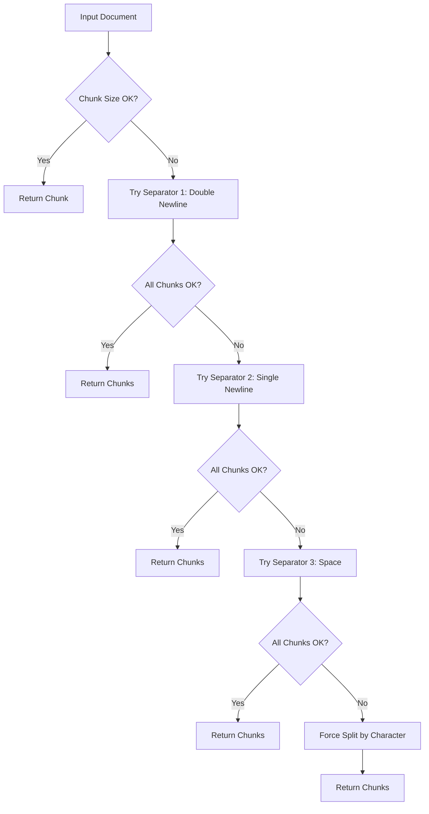
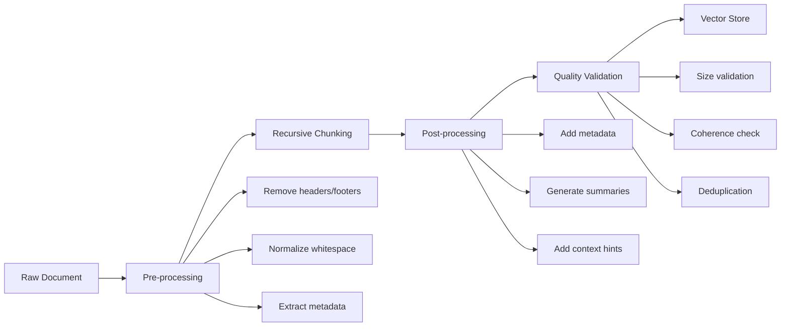
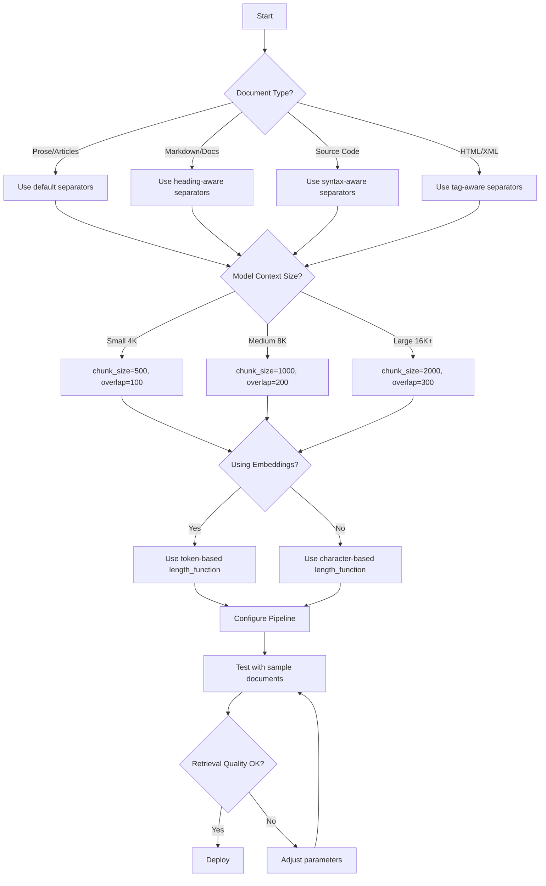

# How to Implement Recursive Chunking

Author: [nawazdhandala](https://github.com/nawazdhandala)

Tags: RAG, Chunking, Text Processing, LangChain

Description: Learn to implement recursive chunking for intelligently splitting documents based on structure.

---

## Why Recursive Chunking Matters for RAG

When building Retrieval-Augmented Generation (RAG) systems, the quality of your chunks directly impacts retrieval accuracy. Poor chunking leads to:

- Context fragmentation (splitting related information across chunks)
- Semantic drift (chunks that lose meaning without surrounding text)
- Retrieval failures (relevant content missed due to arbitrary splits)

**Recursive chunking** solves this by respecting document structure. Instead of blindly splitting at fixed character counts, it uses a hierarchy of separators to preserve semantic boundaries.

---

## How Recursive Chunking Works

The core idea: try to split text using the most significant separator first. If chunks are still too large, recursively split using progressively finer separators.



---

## The Separator Hierarchy

The default separator hierarchy, ordered from most to least significant:

| Priority | Separator | What It Preserves |
|----------|-----------|-------------------|
| 1 | `\n\n` | Paragraphs, sections |
| 2 | `\n` | Lines, list items |
| 3 | `. ` | Sentences |
| 4 | ` ` | Words |
| 5 | `` | Characters (last resort) |

This hierarchy works well for prose. For code, you would use different separators (function definitions, class boundaries, etc.).

---

## Implementation from Scratch

Here is a pure Python implementation to understand the mechanics:

```python
from typing import List, Optional


def recursive_chunk(
    text: str,
    chunk_size: int = 1000,
    chunk_overlap: int = 200,
    separators: Optional[List[str]] = None,
    current_separator_index: int = 0
) -> List[str]:
    """
    Recursively split text into chunks using a hierarchy of separators.

    Args:
        text: The text to split
        chunk_size: Maximum size of each chunk
        chunk_overlap: Number of characters to overlap between chunks
        separators: List of separators ordered by priority (most to least significant)
        current_separator_index: Internal tracker for recursion depth

    Returns:
        List of text chunks respecting semantic boundaries
    """
    # Default separator hierarchy for prose documents
    if separators is None:
        separators = ["\n\n", "\n", ". ", " ", ""]

    # Base case: text fits in one chunk
    if len(text) <= chunk_size:
        return [text.strip()] if text.strip() else []

    # Base case: no more separators to try, force character split
    if current_separator_index >= len(separators):
        return _force_split(text, chunk_size, chunk_overlap)

    # Get current separator to try
    separator = separators[current_separator_index]

    # Split text using current separator
    if separator:
        splits = text.split(separator)
    else:
        # Empty separator means split by character
        splits = list(text)

    # Merge splits back into chunks that respect size limit
    chunks = []
    current_chunk = ""

    for i, split in enumerate(splits):
        # Determine what to add (include separator except for last split)
        segment = split + (separator if i < len(splits) - 1 else "")

        # Check if adding this segment would exceed chunk size
        if len(current_chunk) + len(segment) <= chunk_size:
            current_chunk += segment
        else:
            # Current chunk is full
            if current_chunk:
                chunks.append(current_chunk.strip())

            # Check if segment itself is too large
            if len(segment) > chunk_size:
                # Recursively split with next separator
                sub_chunks = recursive_chunk(
                    segment,
                    chunk_size,
                    chunk_overlap,
                    separators,
                    current_separator_index + 1
                )
                chunks.extend(sub_chunks)
                current_chunk = ""
            else:
                current_chunk = segment

    # Add final chunk
    if current_chunk.strip():
        chunks.append(current_chunk.strip())

    # Apply overlap between chunks
    return _apply_overlap(chunks, chunk_overlap)


def _force_split(text: str, chunk_size: int, overlap: int) -> List[str]:
    """
    Force split text by character count when no separator works.
    This is the last resort for very long strings without separators.
    """
    chunks = []
    start = 0

    while start < len(text):
        end = min(start + chunk_size, len(text))
        chunks.append(text[start:end])
        start = end - overlap if end < len(text) else end

    return chunks


def _apply_overlap(chunks: List[str], overlap: int) -> List[str]:
    """
    Add overlap between consecutive chunks for context continuity.
    Overlap helps maintain context at chunk boundaries during retrieval.
    """
    if overlap <= 0 or len(chunks) <= 1:
        return chunks

    overlapped = [chunks[0]]

    for i in range(1, len(chunks)):
        prev_chunk = chunks[i - 1]
        current_chunk = chunks[i]

        # Take last 'overlap' characters from previous chunk
        overlap_text = prev_chunk[-overlap:] if len(prev_chunk) > overlap else prev_chunk

        # Find a clean break point (word boundary) in the overlap
        space_index = overlap_text.find(" ")
        if space_index != -1:
            overlap_text = overlap_text[space_index + 1:]

        overlapped.append(overlap_text + " " + current_chunk)

    return overlapped
```

---

## Using LangChain's RecursiveCharacterTextSplitter

LangChain provides a production-ready implementation. Here is how to use it effectively:

```python
from langchain.text_splitter import RecursiveCharacterTextSplitter


# Initialize the splitter with configuration
splitter = RecursiveCharacterTextSplitter(
    # Maximum characters per chunk
    chunk_size=1000,

    # Overlap between chunks for context continuity
    chunk_overlap=200,

    # Function to measure chunk length (default is len())
    # Use tiktoken for token-based splitting with LLMs
    length_function=len,

    # Whether to include separator in chunk
    add_start_index=True,

    # Custom separator hierarchy
    separators=["\n\n", "\n", ". ", " ", ""]
)

# Example document
document = """
# Introduction to Machine Learning

Machine learning is a subset of artificial intelligence that enables systems to learn from data.

## Supervised Learning

Supervised learning uses labeled datasets to train algorithms. The model learns to map inputs to outputs.

### Classification

Classification predicts categorical labels. Common algorithms include:
- Logistic Regression
- Decision Trees
- Support Vector Machines

### Regression

Regression predicts continuous values. Examples include:
- Linear Regression
- Polynomial Regression
- Random Forest Regression

## Unsupervised Learning

Unsupervised learning finds patterns in unlabeled data.

### Clustering

Clustering groups similar data points together. Popular methods:
- K-Means
- DBSCAN
- Hierarchical Clustering
"""

# Split the document
chunks = splitter.split_text(document)

# Examine results
for i, chunk in enumerate(chunks):
    print(f"--- Chunk {i + 1} ({len(chunk)} chars) ---")
    print(chunk[:200] + "..." if len(chunk) > 200 else chunk)
    print()
```

---

## Chunking Strategy by Document Type

Different document types require different separator hierarchies:

### Markdown Documents

```python
from langchain.text_splitter import RecursiveCharacterTextSplitter


# Markdown-aware splitter respects heading hierarchy
markdown_splitter = RecursiveCharacterTextSplitter(
    separators=[
        "\n## ",      # H2 headers (major sections)
        "\n### ",     # H3 headers (subsections)
        "\n#### ",    # H4 headers
        "\n\n",       # Paragraphs
        "\n",         # Lines
        ". ",         # Sentences
        " ",          # Words
        ""            # Characters
    ],
    chunk_size=1000,
    chunk_overlap=200
)
```

### Python Code

```python
from langchain.text_splitter import RecursiveCharacterTextSplitter


# Python-aware splitter respects code structure
python_splitter = RecursiveCharacterTextSplitter(
    separators=[
        "\nclass ",       # Class definitions
        "\ndef ",         # Function definitions
        "\n\tdef ",       # Method definitions
        "\n\n",           # Blank lines (logical blocks)
        "\n",             # Lines
        " ",              # Words
        ""                # Characters
    ],
    chunk_size=1500,      # Larger chunks for code context
    chunk_overlap=100
)
```

### HTML Documents

```python
from langchain.text_splitter import RecursiveCharacterTextSplitter


# HTML-aware splitter respects tag boundaries
html_splitter = RecursiveCharacterTextSplitter(
    separators=[
        "</article>",
        "</section>",
        "</div>",
        "</p>",
        "<br>",
        "\n\n",
        "\n",
        ". ",
        " ",
        ""
    ],
    chunk_size=1000,
    chunk_overlap=200
)
```

---

## The Chunking Quality Pipeline



---

## Complete RAG Chunking Pipeline

Here is a production-ready pipeline combining all best practices:

```python
from typing import List, Dict, Any
from dataclasses import dataclass
from langchain.text_splitter import RecursiveCharacterTextSplitter
import hashlib
import re


@dataclass
class Chunk:
    """Represents a processed document chunk with metadata."""
    content: str
    metadata: Dict[str, Any]
    chunk_id: str
    start_index: int
    end_index: int


class RAGChunkingPipeline:
    """
    Production-ready chunking pipeline for RAG systems.
    Handles preprocessing, chunking, and post-processing.
    """

    def __init__(
        self,
        chunk_size: int = 1000,
        chunk_overlap: int = 200,
        min_chunk_size: int = 100,
        document_type: str = "prose"
    ):
        """
        Initialize the chunking pipeline.

        Args:
            chunk_size: Target size for each chunk
            chunk_overlap: Overlap between consecutive chunks
            min_chunk_size: Minimum acceptable chunk size
            document_type: Type of document (prose, markdown, code, html)
        """
        self.chunk_size = chunk_size
        self.chunk_overlap = chunk_overlap
        self.min_chunk_size = min_chunk_size

        # Select separator hierarchy based on document type
        self.separators = self._get_separators(document_type)

        # Initialize the text splitter
        self.splitter = RecursiveCharacterTextSplitter(
            chunk_size=chunk_size,
            chunk_overlap=chunk_overlap,
            separators=self.separators,
            length_function=len,
            add_start_index=True
        )

    def _get_separators(self, doc_type: str) -> List[str]:
        """Return appropriate separators for document type."""
        separator_map = {
            "prose": ["\n\n", "\n", ". ", " ", ""],
            "markdown": ["\n## ", "\n### ", "\n#### ", "\n\n", "\n", ". ", " ", ""],
            "code": ["\nclass ", "\ndef ", "\n\n", "\n", " ", ""],
            "html": ["</section>", "</div>", "</p>", "\n\n", "\n", ". ", " ", ""]
        }
        return separator_map.get(doc_type, separator_map["prose"])

    def preprocess(self, text: str) -> str:
        """
        Clean and normalize text before chunking.

        Steps:
        1. Normalize unicode characters
        2. Remove excessive whitespace
        3. Standardize line endings
        """
        # Normalize unicode
        text = text.encode("utf-8", errors="ignore").decode("utf-8")

        # Standardize line endings
        text = text.replace("\r\n", "\n").replace("\r", "\n")

        # Remove excessive blank lines (more than 2)
        text = re.sub(r"\n{3,}", "\n\n", text)

        # Remove excessive spaces
        text = re.sub(r" {2,}", " ", text)

        # Strip leading/trailing whitespace from each line
        lines = [line.strip() for line in text.split("\n")]
        text = "\n".join(lines)

        return text.strip()

    def chunk(self, text: str, source_metadata: Dict[str, Any] = None) -> List[Chunk]:
        """
        Process text through the complete chunking pipeline.

        Args:
            text: The document text to chunk
            source_metadata: Optional metadata about the source document

        Returns:
            List of Chunk objects with content and metadata
        """
        if source_metadata is None:
            source_metadata = {}

        # Step 1: Preprocess
        cleaned_text = self.preprocess(text)

        # Step 2: Split into chunks
        raw_chunks = self.splitter.create_documents(
            texts=[cleaned_text],
            metadatas=[source_metadata]
        )

        # Step 3: Post-process and validate
        processed_chunks = []

        for i, doc in enumerate(raw_chunks):
            # Skip chunks that are too small
            if len(doc.page_content) < self.min_chunk_size:
                continue

            # Generate unique chunk ID
            chunk_id = self._generate_chunk_id(doc.page_content, i)

            # Extract start index if available
            start_index = doc.metadata.get("start_index", 0)
            end_index = start_index + len(doc.page_content)

            # Build enhanced metadata
            metadata = {
                **source_metadata,
                "chunk_index": i,
                "chunk_size": len(doc.page_content),
                "total_chunks": len(raw_chunks),
                # Add first and last sentence for context
                "preview": doc.page_content[:100] + "..." if len(doc.page_content) > 100 else doc.page_content
            }

            chunk = Chunk(
                content=doc.page_content,
                metadata=metadata,
                chunk_id=chunk_id,
                start_index=start_index,
                end_index=end_index
            )
            processed_chunks.append(chunk)

        return processed_chunks

    def _generate_chunk_id(self, content: str, index: int) -> str:
        """Generate a unique, deterministic ID for a chunk."""
        hash_input = f"{content[:100]}_{index}"
        return hashlib.md5(hash_input.encode()).hexdigest()[:12]

    def merge_small_chunks(self, chunks: List[Chunk]) -> List[Chunk]:
        """
        Merge consecutive small chunks to improve quality.
        Use this as an optional post-processing step.
        """
        if not chunks:
            return chunks

        merged = []
        current = chunks[0]

        for next_chunk in chunks[1:]:
            combined_size = len(current.content) + len(next_chunk.content)

            # Merge if combined size is within limit
            if combined_size <= self.chunk_size:
                current = Chunk(
                    content=current.content + "\n\n" + next_chunk.content,
                    metadata={**current.metadata, "merged": True},
                    chunk_id=current.chunk_id,
                    start_index=current.start_index,
                    end_index=next_chunk.end_index
                )
            else:
                merged.append(current)
                current = next_chunk

        merged.append(current)
        return merged


# Usage example
if __name__ == "__main__":
    # Sample document
    document = """
    # Understanding Neural Networks

    Neural networks are computing systems inspired by biological neural networks.
    They consist of interconnected nodes that process information.

    ## Architecture

    A typical neural network has three types of layers:

    ### Input Layer
    The input layer receives the initial data. Each neuron represents one feature.

    ### Hidden Layers
    Hidden layers perform computations. Deep networks have multiple hidden layers.
    The hidden layers learn increasingly abstract representations of the data.

    ### Output Layer
    The output layer produces the final prediction or classification.

    ## Training Process

    Training involves adjusting weights through backpropagation.
    The network learns by minimizing a loss function over many iterations.

    ## Applications

    Neural networks power many modern AI applications:
    - Image recognition
    - Natural language processing
    - Speech recognition
    - Autonomous vehicles
    """

    # Initialize pipeline for markdown documents
    pipeline = RAGChunkingPipeline(
        chunk_size=500,
        chunk_overlap=100,
        min_chunk_size=50,
        document_type="markdown"
    )

    # Process document
    chunks = pipeline.chunk(
        text=document,
        source_metadata={
            "source": "neural_networks_guide.md",
            "author": "ML Team",
            "category": "documentation"
        }
    )

    # Display results
    print(f"Generated {len(chunks)} chunks\n")

    for chunk in chunks:
        print(f"ID: {chunk.chunk_id}")
        print(f"Size: {chunk.metadata['chunk_size']} chars")
        print(f"Preview: {chunk.metadata['preview']}")
        print("-" * 50)
```

---

## Chunk Quality Optimization Tips

### 1. Choose Chunk Size Based on Your Model

| Model Context | Recommended Chunk Size | Overlap |
|---------------|------------------------|---------|
| 4K tokens | 500-800 chars | 100-150 |
| 8K tokens | 800-1200 chars | 150-200 |
| 16K+ tokens | 1000-2000 chars | 200-300 |

### 2. Use Token-Based Length Function

For LLM applications, measure chunks in tokens, not characters:

```python
import tiktoken


# Initialize tokenizer for your model
encoding = tiktoken.encoding_for_model("gpt-4")


def token_length(text: str) -> int:
    """Count tokens instead of characters for accurate chunk sizing."""
    return len(encoding.encode(text))


# Use with LangChain
splitter = RecursiveCharacterTextSplitter(
    chunk_size=500,          # Now measured in tokens
    chunk_overlap=50,        # Token overlap
    length_function=token_length,
    separators=["\n\n", "\n", ". ", " ", ""]
)
```

### 3. Add Context Hints to Chunks

Improve retrieval by adding context to each chunk:

```python
def add_context_hint(chunk: str, document_title: str, section: str) -> str:
    """
    Prepend context information to help retrieval.
    This helps the embedding model understand chunk context.
    """
    context = f"[Document: {document_title}] [Section: {section}]\n\n"
    return context + chunk
```

### 4. Validate Chunk Coherence

Check that chunks start and end at logical boundaries:

```python
def validate_chunk(chunk: str) -> bool:
    """
    Validate that a chunk appears coherent.
    Returns True if chunk passes quality checks.
    """
    # Check for incomplete sentences at start
    starts_mid_sentence = chunk[0].islower() and not chunk.startswith("i ")

    # Check for incomplete sentences at end
    ends_properly = chunk.rstrip()[-1] in ".!?:\"'"

    # Check minimum word count
    word_count = len(chunk.split())
    has_enough_words = word_count >= 10

    return not starts_mid_sentence and ends_properly and has_enough_words
```

---

## Recursive Chunking Decision Tree

Use this flowchart to decide your chunking strategy:



---

## Common Pitfalls to Avoid

| Pitfall | Problem | Solution |
|---------|---------|----------|
| Fixed character splits | Breaks mid-sentence | Use recursive chunking |
| No overlap | Lost context at boundaries | Add 10-20% overlap |
| Wrong separators | Structure ignored | Match separators to doc type |
| Chunks too small | Poor semantic coherence | Increase chunk_size |
| Chunks too large | Retrieval dilution | Decrease chunk_size |
| No preprocessing | Noisy, inconsistent chunks | Clean text before chunking |

---

## Key Takeaways

1. **Recursive chunking preserves structure** by using a hierarchy of separators from most to least significant.

2. **Match separators to document type.** Markdown, code, and prose need different hierarchies.

3. **Use overlap for context continuity.** Typically 10-20% of chunk size works well.

4. **Measure in tokens, not characters** when chunking for LLM applications.

5. **Validate chunk quality** to catch incomplete or incoherent splits.

6. **Iterate on parameters** using real retrieval tests with your specific documents.

---

## Related Resources

- [LangChain Text Splitters Documentation](https://python.langchain.com/docs/modules/data_connection/document_transformers/)
- [OpenAI Tokenizer](https://platform.openai.com/tokenizer)
- [Chunking Strategies for RAG](https://www.pinecone.io/learn/chunking-strategies/)
