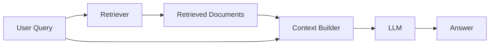
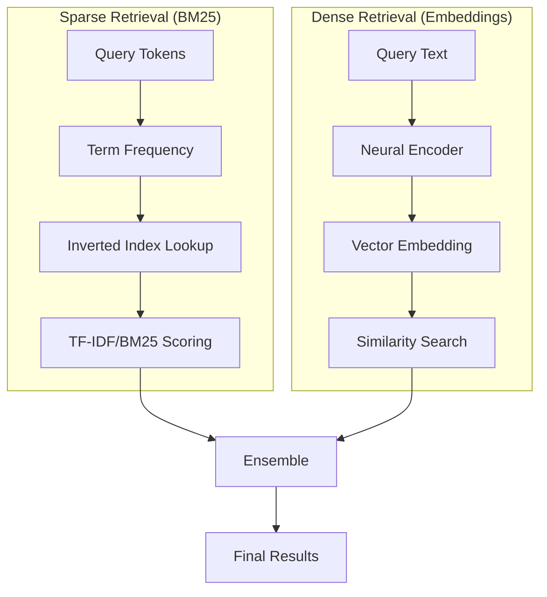
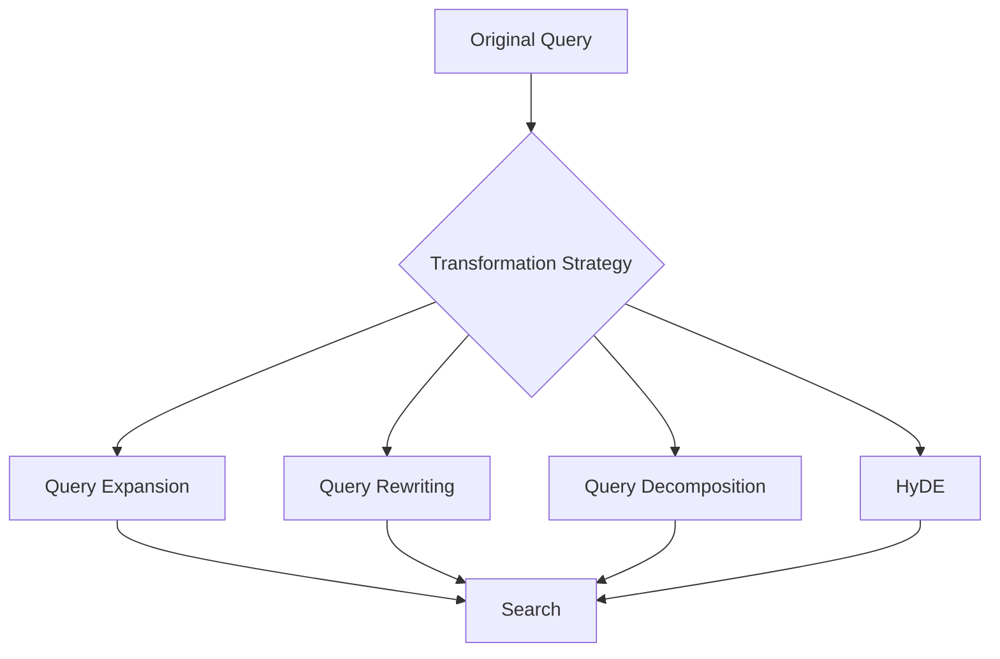
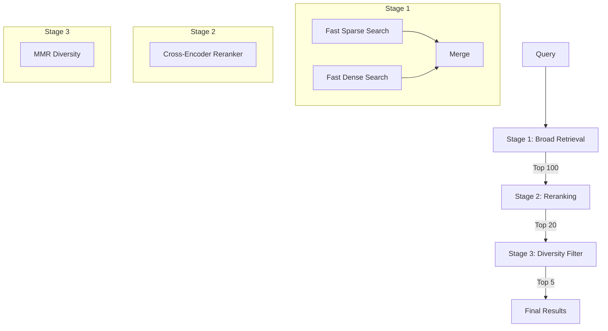
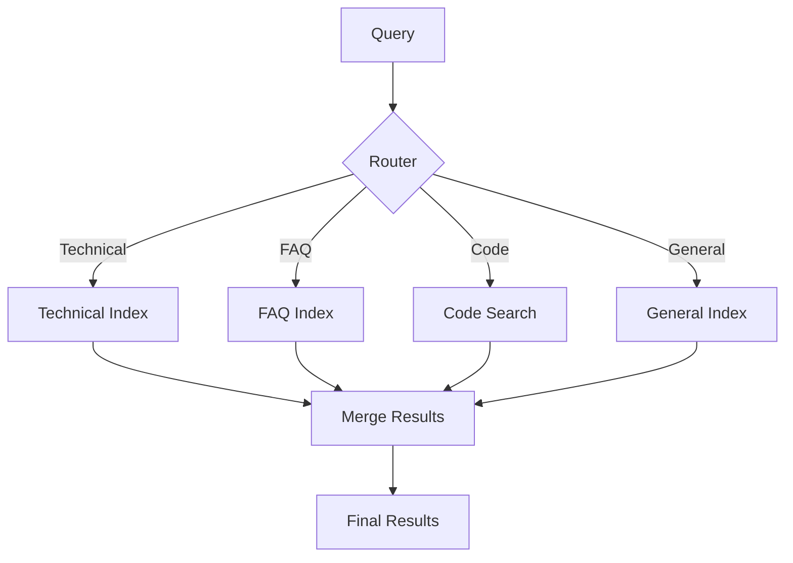
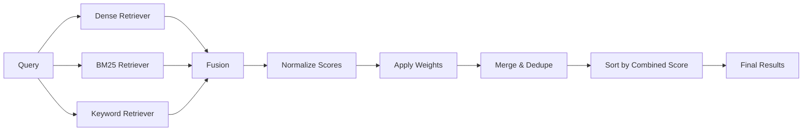

# How to Create Retrieval Strategies

Author: [nawazdhandala](https://github.com/nawazdhandala)

Tags: RAG, Retrieval, Information Retrieval, LLM

Description: Learn to create retrieval strategies for optimizing document retrieval in RAG pipelines.

---

> The quality of a RAG system is only as good as its retrieval. You can have the most powerful LLM, but if you retrieve irrelevant documents, the output will be mediocre at best.

Retrieval-Augmented Generation (RAG) has become the standard pattern for building LLM applications that need access to external knowledge. However, the retrieval component is often the weakest link. This guide walks through practical strategies for building robust, production-ready retrieval systems.

---

## Table of Contents

1. Understanding RAG Retrieval
2. Basic Retrieval Architecture
3. Dense vs Sparse Retrieval
4. Query Transformation Strategies
5. Multi-Stage Retrieval Pipelines
6. Query Routing
7. Ensemble Methods
8. Reranking Strategies
9. Contextual Compression
10. Evaluation and Metrics
11. Production Considerations
12. Complete Implementation Example

---

## 1. Understanding RAG Retrieval

RAG systems follow a simple pattern: given a user query, retrieve relevant documents from a knowledge base, then pass those documents along with the query to an LLM for generation.



The retrieval step determines:
- **Relevance**: Are the retrieved documents actually useful for answering the query?
- **Coverage**: Did we retrieve all the documents that could help answer the query?
- **Precision**: Are we avoiding noise and irrelevant content?

| Component | Purpose | Key Consideration |
|-----------|---------|-------------------|
| Query Encoder | Transforms query into searchable representation | Must match document encoding strategy |
| Document Store | Holds indexed documents | Choose based on scale and query patterns |
| Similarity Search | Finds relevant documents | Balance speed vs accuracy |
| Reranker | Refines initial results | Adds latency but improves precision |

---

## 2. Basic Retrieval Architecture

Here is a foundational RAG retrieval system in Python:

```python
# retrieval_system.py
# A basic RAG retrieval system using vector similarity search

from dataclasses import dataclass
from typing import List, Optional
import numpy as np


@dataclass
class Document:
    """Represents a document in the knowledge base."""
    id: str
    content: str
    metadata: dict
    embedding: Optional[np.ndarray] = None


@dataclass
class RetrievalResult:
    """Represents a single retrieval result with relevance score."""
    document: Document
    score: float


class BasicRetriever:
    """
    A simple vector-based retriever using cosine similarity.

    This retriever stores document embeddings in memory and performs
    brute-force similarity search. For production use, consider
    using a vector database like Pinecone, Weaviate, or Qdrant.
    """

    def __init__(self, embedding_model):
        # The model used to generate embeddings for queries and documents
        self.embedding_model = embedding_model
        # In-memory document store
        self.documents: List[Document] = []

    def add_documents(self, documents: List[Document]) -> None:
        """
        Index documents by computing and storing their embeddings.

        Args:
            documents: List of Document objects to index
        """
        for doc in documents:
            # Generate embedding for document content
            doc.embedding = self.embedding_model.encode(doc.content)
            self.documents.append(doc)

    def retrieve(
        self,
        query: str,
        top_k: int = 5
    ) -> List[RetrievalResult]:
        """
        Retrieve the top-k most relevant documents for a query.

        Args:
            query: The user's search query
            top_k: Number of documents to return

        Returns:
            List of RetrievalResult objects sorted by relevance
        """
        # Encode the query using the same embedding model
        query_embedding = self.embedding_model.encode(query)

        results = []
        for doc in self.documents:
            # Calculate cosine similarity between query and document
            score = self._cosine_similarity(query_embedding, doc.embedding)
            results.append(RetrievalResult(document=doc, score=score))

        # Sort by score descending and return top_k results
        results.sort(key=lambda x: x.score, reverse=True)
        return results[:top_k]

    def _cosine_similarity(
        self,
        vec_a: np.ndarray,
        vec_b: np.ndarray
    ) -> float:
        """
        Compute cosine similarity between two vectors.

        Cosine similarity measures the angle between vectors,
        ranging from -1 (opposite) to 1 (identical direction).
        """
        dot_product = np.dot(vec_a, vec_b)
        norm_a = np.linalg.norm(vec_a)
        norm_b = np.linalg.norm(vec_b)

        # Handle zero vectors to avoid division by zero
        if norm_a == 0 or norm_b == 0:
            return 0.0

        return dot_product / (norm_a * norm_b)
```

---

## 3. Dense vs Sparse Retrieval

Modern retrieval systems typically use one of two approaches, or a combination:



### Sparse Retrieval (BM25)

BM25 is a probabilistic retrieval function based on term frequency:

```python
# sparse_retrieval.py
# BM25 implementation for sparse keyword-based retrieval

import math
from collections import Counter
from typing import List, Dict, Tuple


class BM25Retriever:
    """
    BM25 (Best Matching 25) retriever for keyword-based search.

    BM25 works well for:
    - Exact keyword matching
    - Technical terms and acronyms
    - Queries where specific words matter

    Parameters:
        k1: Term frequency saturation parameter (typically 1.2-2.0)
        b: Length normalization parameter (typically 0.75)
    """

    def __init__(self, k1: float = 1.5, b: float = 0.75):
        self.k1 = k1  # Controls term frequency saturation
        self.b = b    # Controls document length normalization
        self.documents: List[Document] = []
        self.doc_lengths: List[int] = []
        self.avg_doc_length: float = 0.0
        self.doc_freqs: Dict[str, int] = {}  # Document frequency for each term
        self.inverted_index: Dict[str, List[Tuple[int, int]]] = {}  # term -> [(doc_idx, freq)]

    def _tokenize(self, text: str) -> List[str]:
        """
        Simple whitespace tokenization with lowercasing.

        For production, consider using a proper tokenizer that handles:
        - Stemming/lemmatization
        - Stop word removal
        - Special characters
        """
        return text.lower().split()

    def add_documents(self, documents: List[Document]) -> None:
        """
        Index documents for BM25 retrieval.

        Builds an inverted index mapping terms to documents
        and precomputes statistics needed for BM25 scoring.
        """
        self.documents = documents

        # Build inverted index and compute document frequencies
        for doc_idx, doc in enumerate(documents):
            tokens = self._tokenize(doc.content)
            self.doc_lengths.append(len(tokens))

            # Count term frequencies in this document
            term_freqs = Counter(tokens)

            for term, freq in term_freqs.items():
                # Update document frequency (how many docs contain this term)
                if term not in self.doc_freqs:
                    self.doc_freqs[term] = 0
                    self.inverted_index[term] = []
                self.doc_freqs[term] += 1
                self.inverted_index[term].append((doc_idx, freq))

        # Compute average document length for normalization
        self.avg_doc_length = sum(self.doc_lengths) / len(self.doc_lengths)

    def _compute_idf(self, term: str) -> float:
        """
        Compute Inverse Document Frequency for a term.

        IDF measures how informative a term is:
        - Common terms (appearing in many docs) get low IDF
        - Rare terms get high IDF
        """
        n_docs = len(self.documents)
        doc_freq = self.doc_freqs.get(term, 0)

        # BM25 IDF formula with smoothing to handle edge cases
        return math.log((n_docs - doc_freq + 0.5) / (doc_freq + 0.5) + 1)

    def retrieve(
        self,
        query: str,
        top_k: int = 5
    ) -> List[RetrievalResult]:
        """
        Retrieve documents using BM25 scoring.

        The BM25 score combines:
        - Term frequency (how often query terms appear in doc)
        - Inverse document frequency (how rare query terms are)
        - Document length normalization
        """
        query_tokens = self._tokenize(query)
        scores = [0.0] * len(self.documents)

        for term in query_tokens:
            if term not in self.inverted_index:
                continue

            idf = self._compute_idf(term)

            # Score each document containing this term
            for doc_idx, term_freq in self.inverted_index[term]:
                doc_length = self.doc_lengths[doc_idx]

                # BM25 scoring formula
                # Numerator: term frequency contribution
                numerator = term_freq * (self.k1 + 1)

                # Denominator: saturation and length normalization
                length_norm = 1 - self.b + self.b * (doc_length / self.avg_doc_length)
                denominator = term_freq + self.k1 * length_norm

                scores[doc_idx] += idf * (numerator / denominator)

        # Create results and sort by score
        results = [
            RetrievalResult(document=self.documents[i], score=scores[i])
            for i in range(len(self.documents))
            if scores[i] > 0
        ]
        results.sort(key=lambda x: x.score, reverse=True)

        return results[:top_k]
```

### Dense Retrieval

Dense retrieval uses neural embeddings to capture semantic meaning:

```python
# dense_retrieval.py
# Dense retrieval using sentence transformers

from sentence_transformers import SentenceTransformer
import numpy as np
from typing import List


class DenseRetriever:
    """
    Dense retriever using pre-trained sentence embeddings.

    Dense retrieval excels at:
    - Semantic similarity (synonyms, paraphrases)
    - Conceptual matching beyond keywords
    - Cross-lingual retrieval (with multilingual models)

    The embedding model projects text into a dense vector space
    where similar meanings are close together.
    """

    def __init__(self, model_name: str = "all-MiniLM-L6-v2"):
        """
        Initialize with a sentence transformer model.

        Popular model choices:
        - all-MiniLM-L6-v2: Fast, good quality (384 dimensions)
        - all-mpnet-base-v2: Higher quality (768 dimensions)
        - multi-qa-mpnet-base-dot-v1: Optimized for QA retrieval
        """
        self.model = SentenceTransformer(model_name)
        self.documents: List[Document] = []
        self.embeddings: np.ndarray = None

    def add_documents(self, documents: List[Document]) -> None:
        """
        Index documents by computing their embeddings.

        Embeddings are computed in batch for efficiency.
        For large document sets, consider batching with progress tracking.
        """
        self.documents = documents

        # Extract text content from all documents
        texts = [doc.content for doc in documents]

        # Batch encode all documents at once
        # normalize_embeddings=True ensures cosine similarity equals dot product
        self.embeddings = self.model.encode(
            texts,
            normalize_embeddings=True,
            show_progress_bar=True
        )

    def retrieve(
        self,
        query: str,
        top_k: int = 5
    ) -> List[RetrievalResult]:
        """
        Retrieve documents using embedding similarity.

        Uses dot product similarity (equivalent to cosine similarity
        when embeddings are normalized).
        """
        # Encode query with same normalization
        query_embedding = self.model.encode(
            query,
            normalize_embeddings=True
        )

        # Compute similarity scores via dot product
        # Shape: (num_documents,)
        scores = np.dot(self.embeddings, query_embedding)

        # Get indices of top-k highest scores
        top_indices = np.argsort(scores)[::-1][:top_k]

        results = [
            RetrievalResult(
                document=self.documents[idx],
                score=float(scores[idx])
            )
            for idx in top_indices
        ]

        return results
```

### Comparison

| Aspect | Sparse (BM25) | Dense (Embeddings) |
|--------|---------------|-------------------|
| Exact keyword match | Excellent | May miss |
| Semantic understanding | Limited | Excellent |
| Out-of-vocabulary terms | Handles well | May struggle |
| Computational cost | Low | Higher |
| Storage requirements | Lower | Higher |
| Training required | No | Yes (or use pretrained) |

---

## 4. Query Transformation Strategies

Raw user queries are often suboptimal for retrieval. Query transformation improves retrieval by modifying the query before search.



### Query Expansion

Add related terms to broaden the search:

```python
# query_expansion.py
# Expand queries with synonyms and related terms

from typing import List, Set


class QueryExpander:
    """
    Expands queries by adding synonyms and related terms.

    Query expansion helps when:
    - Users use different terminology than documents
    - Documents contain synonyms or related concepts
    - The initial query is too narrow
    """

    def __init__(self, llm_client):
        """
        Initialize with an LLM client for generating expansions.

        The LLM is used to identify synonyms and related terms
        that might appear in relevant documents.
        """
        self.llm = llm_client

    def expand(self, query: str, num_expansions: int = 3) -> str:
        """
        Expand the query with additional relevant terms.

        Args:
            query: Original user query
            num_expansions: Number of expansion terms to add

        Returns:
            Expanded query string combining original and new terms
        """
        # Prompt the LLM to generate related search terms
        expansion_prompt = f"""
        Given the search query: "{query}"

        Generate {num_expansions} additional search terms or phrases
        that would help find relevant documents. Include:
        - Synonyms
        - Related technical terms
        - Alternative phrasings

        Return only the terms, one per line.
        """

        response = self.llm.complete(expansion_prompt)
        expansions = response.strip().split('\n')

        # Combine original query with expansions
        expanded_terms = [query] + [e.strip() for e in expansions if e.strip()]
        return ' '.join(expanded_terms)


class KeywordExpander:
    """
    Expand queries using a predefined synonym dictionary.

    This is faster than LLM-based expansion and works well
    for domain-specific terminology where synonyms are known.
    """

    def __init__(self, synonym_dict: dict = None):
        """
        Initialize with a synonym dictionary.

        synonym_dict format: {"term": ["synonym1", "synonym2", ...]}
        """
        self.synonyms = synonym_dict or {}

    def expand(self, query: str) -> str:
        """
        Expand query by adding synonyms for recognized terms.
        """
        tokens = query.lower().split()
        expanded_tokens = []

        for token in tokens:
            expanded_tokens.append(token)
            # Add any known synonyms for this token
            if token in self.synonyms:
                expanded_tokens.extend(self.synonyms[token])

        return ' '.join(expanded_tokens)
```

### Query Rewriting

Transform the query to better match document style:

```python
# query_rewriting.py
# Rewrite queries for better retrieval performance

class QueryRewriter:
    """
    Rewrites user queries to improve retrieval.

    Users often write queries conversationally, while documents
    are written formally. Rewriting bridges this gap.
    """

    def __init__(self, llm_client):
        self.llm = llm_client

    def rewrite(self, query: str, context: str = None) -> str:
        """
        Rewrite a conversational query into a search-optimized form.

        Args:
            query: Original user query (possibly conversational)
            context: Optional conversation context for follow-up queries

        Returns:
            Rewritten query optimized for retrieval
        """
        if context:
            # Handle follow-up queries that reference conversation history
            prompt = f"""
            Conversation context: {context}
            Current query: {query}

            Rewrite this query to be a standalone, search-friendly query
            that incorporates any necessary context. The rewritten query
            should be specific and self-contained.

            Return only the rewritten query.
            """
        else:
            prompt = f"""
            Original query: {query}

            Rewrite this query to be more effective for document retrieval.
            - Remove filler words
            - Make it specific and focused
            - Use terms likely to appear in technical documentation

            Return only the rewritten query.
            """

        return self.llm.complete(prompt).strip()

    def rewrite_for_perspective(
        self,
        query: str,
        perspective: str
    ) -> str:
        """
        Rewrite query from a specific perspective or persona.

        Different perspectives can help retrieve different types
        of relevant documents.
        """
        prompt = f"""
        Query: {query}
        Perspective: {perspective}

        Rewrite this query as if it were asked by someone with
        the given perspective. Use terminology and focus areas
        that perspective would emphasize.

        Return only the rewritten query.
        """

        return self.llm.complete(prompt).strip()
```

### HyDE (Hypothetical Document Embeddings)

Generate a hypothetical answer to use as the search query:

```python
# hyde_retrieval.py
# Hypothetical Document Embeddings for improved semantic retrieval

class HyDERetriever:
    """
    HyDE (Hypothetical Document Embeddings) retriever.

    Instead of embedding the query directly, HyDE:
    1. Uses an LLM to generate a hypothetical document that would answer the query
    2. Embeds that hypothetical document
    3. Searches for real documents similar to the hypothetical one

    This works because the hypothetical document is written in
    "document style" rather than "query style", making it more
    similar to actual documents in the embedding space.
    """

    def __init__(self, llm_client, embedding_model, document_store):
        self.llm = llm_client
        self.embedding_model = embedding_model
        self.document_store = document_store

    def generate_hypothetical_document(self, query: str) -> str:
        """
        Generate a hypothetical document that would answer the query.

        The generated document doesn't need to be factually correct.
        It just needs to be written in the same style as documents
        in the knowledge base.
        """
        prompt = f"""
        Write a short passage (2-3 paragraphs) that would directly
        answer the following question. Write it as if it were an
        excerpt from a technical document or knowledge base article.

        Question: {query}

        Write the passage directly without any preamble.
        """

        return self.llm.complete(prompt).strip()

    def retrieve(
        self,
        query: str,
        top_k: int = 5
    ) -> List[RetrievalResult]:
        """
        Retrieve documents using HyDE.

        The process:
        1. Generate hypothetical answer document
        2. Embed the hypothetical document
        3. Find real documents similar to the hypothetical one
        """
        # Step 1: Generate hypothetical document
        hypothetical_doc = self.generate_hypothetical_document(query)

        # Step 2: Embed the hypothetical document
        hyde_embedding = self.embedding_model.encode(
            hypothetical_doc,
            normalize_embeddings=True
        )

        # Step 3: Search using the hypothetical document embedding
        results = self.document_store.similarity_search(
            embedding=hyde_embedding,
            top_k=top_k
        )

        return results
```

---

## 5. Multi-Stage Retrieval Pipelines

For complex retrieval needs, use multiple stages that progressively refine results:



```python
# multi_stage_pipeline.py
# Multi-stage retrieval pipeline for high-quality results

from abc import ABC, abstractmethod
from typing import List, Callable


class RetrievalStage(ABC):
    """Abstract base class for retrieval pipeline stages."""

    @abstractmethod
    def process(
        self,
        query: str,
        candidates: List[RetrievalResult]
    ) -> List[RetrievalResult]:
        """Process candidates and return filtered/reranked results."""
        pass


class InitialRetrievalStage(RetrievalStage):
    """
    First stage: Broad retrieval to get initial candidates.

    Uses fast retrieval methods to get a large candidate set
    that will be refined by subsequent stages.
    """

    def __init__(self, retriever, top_k: int = 100):
        self.retriever = retriever
        self.top_k = top_k

    def process(
        self,
        query: str,
        candidates: List[RetrievalResult] = None
    ) -> List[RetrievalResult]:
        """Retrieve initial broad set of candidates."""
        return self.retriever.retrieve(query, top_k=self.top_k)


class RerankingStage(RetrievalStage):
    """
    Reranking stage using a cross-encoder model.

    Cross-encoders are more accurate than bi-encoders but slower,
    so they are used on a smaller candidate set.
    """

    def __init__(self, cross_encoder, top_k: int = 20):
        self.cross_encoder = cross_encoder
        self.top_k = top_k

    def process(
        self,
        query: str,
        candidates: List[RetrievalResult]
    ) -> List[RetrievalResult]:
        """Rerank candidates using cross-encoder scoring."""
        # Create query-document pairs for cross-encoder
        pairs = [
            (query, result.document.content)
            for result in candidates
        ]

        # Get cross-encoder scores
        scores = self.cross_encoder.predict(pairs)

        # Update results with new scores
        for result, score in zip(candidates, scores):
            result.score = float(score)

        # Sort by new scores and return top_k
        candidates.sort(key=lambda x: x.score, reverse=True)
        return candidates[:self.top_k]


class DiversityStage(RetrievalStage):
    """
    Diversity stage using Maximal Marginal Relevance (MMR).

    MMR balances relevance with diversity to avoid returning
    multiple documents that say the same thing.
    """

    def __init__(
        self,
        embedding_model,
        top_k: int = 5,
        lambda_param: float = 0.5
    ):
        self.embedding_model = embedding_model
        self.top_k = top_k
        # Lambda controls relevance vs diversity tradeoff
        # Higher lambda = more relevance, lower = more diversity
        self.lambda_param = lambda_param

    def process(
        self,
        query: str,
        candidates: List[RetrievalResult]
    ) -> List[RetrievalResult]:
        """Select diverse subset using MMR algorithm."""
        if len(candidates) <= self.top_k:
            return candidates

        # Compute embeddings for MMR
        query_embedding = self.embedding_model.encode(query)
        doc_embeddings = [
            self.embedding_model.encode(r.document.content)
            for r in candidates
        ]

        selected = []
        remaining = list(range(len(candidates)))

        while len(selected) < self.top_k and remaining:
            mmr_scores = []

            for idx in remaining:
                # Relevance to query
                relevance = self._cosine_sim(
                    query_embedding,
                    doc_embeddings[idx]
                )

                # Maximum similarity to already selected documents
                if selected:
                    max_sim = max(
                        self._cosine_sim(
                            doc_embeddings[idx],
                            doc_embeddings[sel_idx]
                        )
                        for sel_idx in selected
                    )
                else:
                    max_sim = 0

                # MMR score balances relevance and diversity
                mmr = self.lambda_param * relevance - (1 - self.lambda_param) * max_sim
                mmr_scores.append((idx, mmr))

            # Select document with highest MMR score
            best_idx = max(mmr_scores, key=lambda x: x[1])[0]
            selected.append(best_idx)
            remaining.remove(best_idx)

        return [candidates[idx] for idx in selected]

    def _cosine_sim(self, a, b):
        return float(np.dot(a, b) / (np.linalg.norm(a) * np.linalg.norm(b)))


class MultiStagePipeline:
    """
    Orchestrates multiple retrieval stages in sequence.

    Each stage takes the output of the previous stage and
    progressively refines the results.
    """

    def __init__(self, stages: List[RetrievalStage]):
        self.stages = stages

    def retrieve(self, query: str) -> List[RetrievalResult]:
        """
        Execute all stages in sequence.

        The first stage retrieves initial candidates.
        Subsequent stages filter and rerank.
        """
        results = None

        for stage in self.stages:
            results = stage.process(query, results)

        return results


# Example usage
def create_pipeline():
    """Create a complete multi-stage retrieval pipeline."""
    from sentence_transformers import SentenceTransformer, CrossEncoder

    # Initialize models
    bi_encoder = SentenceTransformer('all-MiniLM-L6-v2')
    cross_encoder = CrossEncoder('cross-encoder/ms-marco-MiniLM-L-6-v2')

    # Create retrievers
    dense_retriever = DenseRetriever(model=bi_encoder)
    bm25_retriever = BM25Retriever()

    # Create hybrid initial retrieval
    hybrid_retriever = HybridRetriever(
        retrievers=[dense_retriever, bm25_retriever],
        weights=[0.6, 0.4]
    )

    # Build pipeline
    pipeline = MultiStagePipeline([
        InitialRetrievalStage(hybrid_retriever, top_k=100),
        RerankingStage(cross_encoder, top_k=20),
        DiversityStage(bi_encoder, top_k=5, lambda_param=0.7)
    ])

    return pipeline
```

---

## 6. Query Routing

Not all queries should use the same retrieval strategy. Query routing directs queries to the most appropriate retriever:



```python
# query_router.py
# Route queries to appropriate retrieval strategies

from enum import Enum
from typing import Dict, List, Callable
import re


class QueryType(Enum):
    """Categories of queries for routing."""
    TECHNICAL = "technical"
    FAQ = "faq"
    CODE = "code"
    GENERAL = "general"
    COMPARISON = "comparison"


class RuleBasedRouter:
    """
    Route queries based on pattern matching rules.

    Fast and predictable, but limited to predefined patterns.
    Good for well-understood query patterns.
    """

    def __init__(self):
        # Define patterns for each query type
        self.patterns = {
            QueryType.CODE: [
                r'\b(code|function|method|class|implement|syntax|error)\b',
                r'\b(python|javascript|java|typescript|rust|go)\b',
                r'```',  # Code blocks
                r'\b(def|class|import|from|return)\b',
            ],
            QueryType.FAQ: [
                r'^(what is|how do|can i|is it possible)\b',
                r'\?$',  # Questions
                r'^(why|when|where|who)\b',
            ],
            QueryType.COMPARISON: [
                r'\bvs\.?\b',
                r'\b(compare|comparison|difference|versus|better)\b',
                r'\b(pros and cons|advantages)\b',
            ],
            QueryType.TECHNICAL: [
                r'\b(configure|setup|install|deploy|architecture)\b',
                r'\b(api|endpoint|request|response|http)\b',
                r'\b(database|query|schema|migration)\b',
            ],
        }

    def route(self, query: str) -> QueryType:
        """
        Determine query type based on pattern matching.

        Returns the first matching query type, or GENERAL if none match.
        """
        query_lower = query.lower()

        for query_type, patterns in self.patterns.items():
            for pattern in patterns:
                if re.search(pattern, query_lower, re.IGNORECASE):
                    return query_type

        return QueryType.GENERAL


class LLMRouter:
    """
    Route queries using an LLM for more nuanced classification.

    More accurate for ambiguous queries but adds latency.
    Consider caching common queries.
    """

    def __init__(self, llm_client, categories: List[str]):
        self.llm = llm_client
        self.categories = categories

    def route(self, query: str) -> str:
        """
        Use LLM to classify the query into a category.
        """
        categories_str = '\n'.join(f"- {cat}" for cat in self.categories)

        prompt = f"""
        Classify the following query into exactly one category.

        Categories:
        {categories_str}

        Query: {query}

        Respond with only the category name, nothing else.
        """

        response = self.llm.complete(prompt).strip().lower()

        # Validate response is a known category
        for cat in self.categories:
            if cat.lower() in response:
                return cat

        return self.categories[-1]  # Default to last category


class SemanticRouter:
    """
    Route queries using embedding similarity to category examples.

    Train by providing example queries for each category.
    Fast at inference time with good accuracy.
    """

    def __init__(self, embedding_model):
        self.embedding_model = embedding_model
        self.category_embeddings: Dict[str, np.ndarray] = {}

    def add_category(
        self,
        category: str,
        example_queries: List[str]
    ) -> None:
        """
        Add a category with example queries.

        The category embedding is the mean of example embeddings.
        """
        embeddings = self.embedding_model.encode(example_queries)
        # Use mean embedding as category centroid
        self.category_embeddings[category] = np.mean(embeddings, axis=0)

    def route(self, query: str) -> str:
        """
        Route query to most similar category.
        """
        query_embedding = self.embedding_model.encode(query)

        best_category = None
        best_score = -1

        for category, cat_embedding in self.category_embeddings.items():
            score = np.dot(query_embedding, cat_embedding)
            if score > best_score:
                best_score = score
                best_category = category

        return best_category


class QueryRouter:
    """
    Main router that combines routing decision with retrieval execution.
    """

    def __init__(self):
        self.routers: Dict[str, Callable] = {}
        self.retrievers: Dict[str, object] = {}

    def register_retriever(
        self,
        query_type: str,
        retriever: object
    ) -> None:
        """Register a retriever for a specific query type."""
        self.retrievers[query_type] = retriever

    def retrieve(
        self,
        query: str,
        router: object
    ) -> List[RetrievalResult]:
        """
        Route the query and retrieve from appropriate index.
        """
        # Determine query type
        query_type = router.route(query)

        # Get appropriate retriever
        retriever = self.retrievers.get(
            query_type,
            self.retrievers.get('general')
        )

        # Execute retrieval
        return retriever.retrieve(query)
```

---

## 7. Ensemble Methods

Combine multiple retrievers to leverage their complementary strengths:



```python
# ensemble_retrieval.py
# Combine multiple retrievers using various fusion strategies

from typing import List, Dict, Tuple
from collections import defaultdict
import numpy as np


class EnsembleRetriever:
    """
    Combine multiple retrievers using weighted score fusion.

    This approach:
    1. Runs each retriever independently
    2. Normalizes scores to a common scale
    3. Combines scores using configurable weights
    4. Returns merged, deduplicated results
    """

    def __init__(
        self,
        retrievers: List[Tuple[object, float]],
        score_normalizer: str = "minmax"
    ):
        """
        Initialize with retrievers and their weights.

        Args:
            retrievers: List of (retriever, weight) tuples
            score_normalizer: Normalization method ("minmax", "zscore", "rank")
        """
        self.retrievers = retrievers
        self.score_normalizer = score_normalizer

    def _normalize_scores(
        self,
        results: List[RetrievalResult]
    ) -> List[RetrievalResult]:
        """
        Normalize scores to [0, 1] range for fair combination.
        """
        if not results:
            return results

        scores = [r.score for r in results]

        if self.score_normalizer == "minmax":
            # Min-max normalization
            min_score = min(scores)
            max_score = max(scores)
            score_range = max_score - min_score

            if score_range > 0:
                for r in results:
                    r.score = (r.score - min_score) / score_range
            else:
                for r in results:
                    r.score = 1.0

        elif self.score_normalizer == "zscore":
            # Z-score normalization
            mean = np.mean(scores)
            std = np.std(scores)

            if std > 0:
                for r in results:
                    # Map z-scores to [0, 1] using sigmoid
                    z = (r.score - mean) / std
                    r.score = 1 / (1 + np.exp(-z))
            else:
                for r in results:
                    r.score = 0.5

        elif self.score_normalizer == "rank":
            # Rank-based normalization
            sorted_results = sorted(results, key=lambda x: x.score, reverse=True)
            n = len(sorted_results)
            for rank, r in enumerate(sorted_results):
                r.score = (n - rank) / n

        return results

    def retrieve(
        self,
        query: str,
        top_k: int = 10
    ) -> List[RetrievalResult]:
        """
        Retrieve from all retrievers and combine results.
        """
        # Collect results from each retriever
        all_results: Dict[str, Dict] = defaultdict(
            lambda: {"document": None, "scores": []}
        )

        for retriever, weight in self.retrievers:
            # Get results from this retriever
            results = retriever.retrieve(query, top_k=top_k * 2)

            # Normalize scores
            results = self._normalize_scores(results)

            # Aggregate by document ID
            for r in results:
                doc_id = r.document.id
                all_results[doc_id]["document"] = r.document
                all_results[doc_id]["scores"].append((r.score, weight))

        # Combine scores using weighted sum
        final_results = []
        for doc_id, data in all_results.items():
            # Weighted sum of normalized scores
            combined_score = sum(
                score * weight
                for score, weight in data["scores"]
            )
            final_results.append(
                RetrievalResult(
                    document=data["document"],
                    score=combined_score
                )
            )

        # Sort by combined score and return top_k
        final_results.sort(key=lambda x: x.score, reverse=True)
        return final_results[:top_k]


class RRFEnsemble:
    """
    Reciprocal Rank Fusion (RRF) for combining ranked lists.

    RRF is robust to score distribution differences because it
    only uses rank positions, not raw scores. This makes it
    particularly effective when combining retrievers with
    very different scoring scales.

    RRF score = sum(1 / (k + rank_i)) for each retriever i
    """

    def __init__(
        self,
        retrievers: List[object],
        k: int = 60
    ):
        """
        Initialize RRF ensemble.

        Args:
            retrievers: List of retriever objects
            k: Smoothing constant (default 60, as in original paper)
        """
        self.retrievers = retrievers
        self.k = k  # Smoothing constant to prevent high ranks from dominating

    def retrieve(
        self,
        query: str,
        top_k: int = 10
    ) -> List[RetrievalResult]:
        """
        Retrieve using Reciprocal Rank Fusion.
        """
        # Collect ranks from each retriever
        doc_scores: Dict[str, float] = defaultdict(float)
        doc_objects: Dict[str, Document] = {}

        for retriever in self.retrievers:
            results = retriever.retrieve(query, top_k=top_k * 3)

            for rank, result in enumerate(results):
                doc_id = result.document.id
                doc_objects[doc_id] = result.document

                # RRF formula: 1 / (k + rank)
                # rank is 0-indexed, so rank 0 gets score 1/(k+0)
                rrf_score = 1.0 / (self.k + rank)
                doc_scores[doc_id] += rrf_score

        # Create final results
        final_results = [
            RetrievalResult(document=doc_objects[doc_id], score=score)
            for doc_id, score in doc_scores.items()
        ]

        final_results.sort(key=lambda x: x.score, reverse=True)
        return final_results[:top_k]


class AdaptiveEnsemble:
    """
    Dynamically adjust retriever weights based on query characteristics.

    Different queries benefit from different retrieval strategies.
    This ensemble learns to weight retrievers appropriately.
    """

    def __init__(self, retrievers: Dict[str, object], llm_client):
        self.retrievers = retrievers
        self.llm = llm_client

    def _estimate_weights(self, query: str) -> Dict[str, float]:
        """
        Use LLM to estimate optimal weights for this query.
        """
        retriever_names = list(self.retrievers.keys())

        prompt = f"""
        Given the query: "{query}"

        Assign weights (0.0 to 1.0) to these retrieval strategies
        based on how well-suited each is for this query:

        {', '.join(retriever_names)}

        Consider:
        - Dense/semantic: Good for conceptual, meaning-based queries
        - Sparse/BM25: Good for specific terms, keywords, names
        - Hybrid: Good for mixed queries

        Return weights as: strategy1:weight1, strategy2:weight2, ...
        Weights should sum to 1.0.
        """

        response = self.llm.complete(prompt).strip()

        # Parse weights from response
        weights = {}
        for part in response.split(','):
            if ':' in part:
                name, weight = part.split(':')
                name = name.strip()
                try:
                    weights[name] = float(weight.strip())
                except ValueError:
                    weights[name] = 0.5

        # Normalize weights to sum to 1
        total = sum(weights.values()) or 1
        return {k: v/total for k, v in weights.items()}

    def retrieve(
        self,
        query: str,
        top_k: int = 10
    ) -> List[RetrievalResult]:
        """
        Retrieve with adaptively weighted ensemble.
        """
        weights = self._estimate_weights(query)

        # Create weighted retriever list
        weighted_retrievers = [
            (self.retrievers[name], weights.get(name, 0.5))
            for name in self.retrievers
        ]

        # Use standard ensemble with adaptive weights
        ensemble = EnsembleRetriever(weighted_retrievers)
        return ensemble.retrieve(query, top_k=top_k)
```

---

## 8. Reranking Strategies

Reranking improves precision by rescoring candidates with more powerful models:

```python
# reranking.py
# Reranking strategies for improving retrieval precision

from typing import List
from abc import ABC, abstractmethod


class Reranker(ABC):
    """Base class for reranking strategies."""

    @abstractmethod
    def rerank(
        self,
        query: str,
        results: List[RetrievalResult],
        top_k: int
    ) -> List[RetrievalResult]:
        pass


class CrossEncoderReranker(Reranker):
    """
    Rerank using a cross-encoder model.

    Cross-encoders process query and document together,
    allowing for rich interaction between them. This is
    more accurate than bi-encoders but slower.
    """

    def __init__(self, model_name: str = "cross-encoder/ms-marco-MiniLM-L-6-v2"):
        from sentence_transformers import CrossEncoder
        self.model = CrossEncoder(model_name)

    def rerank(
        self,
        query: str,
        results: List[RetrievalResult],
        top_k: int = 10
    ) -> List[RetrievalResult]:
        """
        Rerank results using cross-encoder scores.
        """
        if not results:
            return results

        # Create query-document pairs
        pairs = [(query, r.document.content) for r in results]

        # Get cross-encoder scores
        scores = self.model.predict(pairs)

        # Update scores and sort
        for result, score in zip(results, scores):
            result.score = float(score)

        results.sort(key=lambda x: x.score, reverse=True)
        return results[:top_k]


class LLMReranker(Reranker):
    """
    Rerank using an LLM to judge relevance.

    Most accurate but slowest option. Use when:
    - High precision is critical
    - Candidate set is small
    - Other rerankers are insufficient
    """

    def __init__(self, llm_client):
        self.llm = llm_client

    def rerank(
        self,
        query: str,
        results: List[RetrievalResult],
        top_k: int = 10
    ) -> List[RetrievalResult]:
        """
        Rerank using LLM relevance scoring.
        """
        scored_results = []

        for result in results:
            prompt = f"""
            Query: {query}

            Document: {result.document.content[:1000]}

            Rate the relevance of this document to the query on a scale
            of 0 to 10, where:
            - 0: Completely irrelevant
            - 5: Somewhat relevant, partially answers the query
            - 10: Highly relevant, directly answers the query

            Respond with only the number.
            """

            try:
                score = float(self.llm.complete(prompt).strip())
                result.score = score / 10.0  # Normalize to [0, 1]
            except ValueError:
                result.score = 0.0

            scored_results.append(result)

        scored_results.sort(key=lambda x: x.score, reverse=True)
        return scored_results[:top_k]


class ColBERTReranker(Reranker):
    """
    Rerank using ColBERT-style late interaction.

    ColBERT computes token-level embeddings and uses
    MaxSim (maximum similarity) for scoring. This provides
    a good balance between accuracy and speed.
    """

    def __init__(self, model):
        self.model = model

    def rerank(
        self,
        query: str,
        results: List[RetrievalResult],
        top_k: int = 10
    ) -> List[RetrievalResult]:
        """
        Rerank using ColBERT MaxSim scoring.
        """
        # Get query token embeddings
        query_embeddings = self.model.encode_query(query)

        for result in results:
            # Get document token embeddings
            doc_embeddings = self.model.encode_document(
                result.document.content
            )

            # Compute MaxSim: for each query token, find max similarity
            # to any document token, then sum across query tokens
            similarities = np.dot(query_embeddings, doc_embeddings.T)
            max_sims = np.max(similarities, axis=1)
            result.score = float(np.sum(max_sims))

        results.sort(key=lambda x: x.score, reverse=True)
        return results[:top_k]


class CascadeReranker:
    """
    Apply multiple rerankers in cascade for efficiency.

    Fast rerankers filter the candidate set before expensive
    rerankers are applied, reducing overall latency while
    maintaining quality.
    """

    def __init__(self, rerankers: List[Tuple[Reranker, int]]):
        """
        Initialize cascade.

        Args:
            rerankers: List of (reranker, top_k) tuples
                       Applied in order, each reducing the set
        """
        self.rerankers = rerankers

    def rerank(
        self,
        query: str,
        results: List[RetrievalResult]
    ) -> List[RetrievalResult]:
        """
        Apply rerankers in cascade.
        """
        current_results = results

        for reranker, top_k in self.rerankers:
            current_results = reranker.rerank(query, current_results, top_k)

        return current_results
```

---

## 9. Contextual Compression

Reduce noise by compressing retrieved documents to relevant portions:

```python
# contextual_compression.py
# Extract and compress relevant content from retrieved documents

from typing import List
from dataclasses import dataclass


@dataclass
class CompressedResult:
    """Result with compressed/extracted content."""
    original_document: Document
    compressed_content: str
    relevance_score: float


class LLMCompressor:
    """
    Use an LLM to extract relevant portions of documents.

    This reduces context length and improves signal-to-noise
    ratio for the final LLM generation step.
    """

    def __init__(self, llm_client):
        self.llm = llm_client

    def compress(
        self,
        query: str,
        results: List[RetrievalResult]
    ) -> List[CompressedResult]:
        """
        Extract relevant portions from each document.
        """
        compressed_results = []

        for result in results:
            prompt = f"""
            Query: {query}

            Document:
            {result.document.content}

            Extract only the portions of this document that are directly
            relevant to answering the query. If no portion is relevant,
            respond with "NOT_RELEVANT".

            Preserve the exact text from relevant portions.
            """

            extracted = self.llm.complete(prompt).strip()

            if extracted != "NOT_RELEVANT":
                compressed_results.append(CompressedResult(
                    original_document=result.document,
                    compressed_content=extracted,
                    relevance_score=result.score
                ))

        return compressed_results


class SentenceCompressor:
    """
    Extract relevant sentences using embedding similarity.

    Faster than LLM-based compression while still effective
    at removing irrelevant content.
    """

    def __init__(self, embedding_model, similarity_threshold: float = 0.5):
        self.embedding_model = embedding_model
        self.similarity_threshold = similarity_threshold

    def compress(
        self,
        query: str,
        results: List[RetrievalResult]
    ) -> List[CompressedResult]:
        """
        Extract sentences similar to the query.
        """
        query_embedding = self.embedding_model.encode(query)
        compressed_results = []

        for result in results:
            # Split document into sentences
            sentences = self._split_sentences(result.document.content)

            # Score each sentence
            relevant_sentences = []
            for sentence in sentences:
                sent_embedding = self.embedding_model.encode(sentence)
                similarity = np.dot(query_embedding, sent_embedding)

                if similarity >= self.similarity_threshold:
                    relevant_sentences.append(sentence)

            if relevant_sentences:
                compressed_results.append(CompressedResult(
                    original_document=result.document,
                    compressed_content=' '.join(relevant_sentences),
                    relevance_score=result.score
                ))

        return compressed_results

    def _split_sentences(self, text: str) -> List[str]:
        """Simple sentence splitting. Use NLTK or spaCy for production."""
        import re
        sentences = re.split(r'(?<=[.!?])\s+', text)
        return [s.strip() for s in sentences if s.strip()]


class ChunkCompressor:
    """
    Extract relevant chunks using sliding window approach.

    Preserves context around relevant content better than
    sentence-level extraction.
    """

    def __init__(
        self,
        embedding_model,
        chunk_size: int = 200,
        chunk_overlap: int = 50,
        top_chunks: int = 3
    ):
        self.embedding_model = embedding_model
        self.chunk_size = chunk_size
        self.chunk_overlap = chunk_overlap
        self.top_chunks = top_chunks

    def compress(
        self,
        query: str,
        results: List[RetrievalResult]
    ) -> List[CompressedResult]:
        """
        Extract top-k most relevant chunks from each document.
        """
        query_embedding = self.embedding_model.encode(query)
        compressed_results = []

        for result in results:
            # Create overlapping chunks
            chunks = self._create_chunks(result.document.content)

            # Score and rank chunks
            chunk_scores = []
            for chunk in chunks:
                chunk_embedding = self.embedding_model.encode(chunk)
                score = np.dot(query_embedding, chunk_embedding)
                chunk_scores.append((chunk, score))

            # Select top chunks
            chunk_scores.sort(key=lambda x: x[1], reverse=True)
            top_chunks = [c[0] for c in chunk_scores[:self.top_chunks]]

            if top_chunks:
                compressed_results.append(CompressedResult(
                    original_document=result.document,
                    compressed_content='\n\n'.join(top_chunks),
                    relevance_score=result.score
                ))

        return compressed_results

    def _create_chunks(self, text: str) -> List[str]:
        """Create overlapping chunks from text."""
        words = text.split()
        chunks = []

        start = 0
        while start < len(words):
            end = start + self.chunk_size
            chunk = ' '.join(words[start:end])
            chunks.append(chunk)
            start += self.chunk_size - self.chunk_overlap

        return chunks
```

---

## 10. Evaluation and Metrics

Measure retrieval quality to guide optimization:

```python
# evaluation.py
# Metrics and evaluation for retrieval systems

from typing import List, Dict, Set
from dataclasses import dataclass
import numpy as np


@dataclass
class EvaluationResult:
    """Results from evaluating retrieval on a query set."""
    precision_at_k: Dict[int, float]
    recall_at_k: Dict[int, float]
    ndcg_at_k: Dict[int, float]
    mrr: float
    map_score: float


class RetrievalEvaluator:
    """
    Evaluate retrieval system performance.

    Standard metrics:
    - Precision@K: Fraction of top-K results that are relevant
    - Recall@K: Fraction of all relevant docs found in top-K
    - NDCG@K: Normalized Discounted Cumulative Gain (position-aware)
    - MRR: Mean Reciprocal Rank (position of first relevant result)
    - MAP: Mean Average Precision
    """

    def __init__(self, k_values: List[int] = [1, 3, 5, 10]):
        self.k_values = k_values

    def evaluate(
        self,
        retriever,
        queries: List[str],
        relevance_judgments: Dict[str, Set[str]]
    ) -> EvaluationResult:
        """
        Evaluate retriever on a set of queries with known relevance.

        Args:
            retriever: Retrieval system to evaluate
            queries: List of test queries
            relevance_judgments: Map of query to set of relevant doc IDs
        """
        precision_scores = {k: [] for k in self.k_values}
        recall_scores = {k: [] for k in self.k_values}
        ndcg_scores = {k: [] for k in self.k_values}
        reciprocal_ranks = []
        average_precisions = []

        max_k = max(self.k_values)

        for query in queries:
            relevant_docs = relevance_judgments.get(query, set())
            if not relevant_docs:
                continue

            # Get retrieval results
            results = retriever.retrieve(query, top_k=max_k)
            retrieved_ids = [r.document.id for r in results]

            # Calculate metrics for each k
            for k in self.k_values:
                top_k_ids = set(retrieved_ids[:k])

                # Precision@K
                relevant_in_k = len(top_k_ids & relevant_docs)
                precision_scores[k].append(relevant_in_k / k)

                # Recall@K
                recall_scores[k].append(relevant_in_k / len(relevant_docs))

                # NDCG@K
                ndcg_scores[k].append(
                    self._compute_ndcg(retrieved_ids[:k], relevant_docs)
                )

            # MRR: position of first relevant result
            rr = 0.0
            for rank, doc_id in enumerate(retrieved_ids):
                if doc_id in relevant_docs:
                    rr = 1.0 / (rank + 1)
                    break
            reciprocal_ranks.append(rr)

            # Average Precision
            ap = self._compute_ap(retrieved_ids, relevant_docs)
            average_precisions.append(ap)

        return EvaluationResult(
            precision_at_k={k: np.mean(v) for k, v in precision_scores.items()},
            recall_at_k={k: np.mean(v) for k, v in recall_scores.items()},
            ndcg_at_k={k: np.mean(v) for k, v in ndcg_scores.items()},
            mrr=np.mean(reciprocal_ranks),
            map_score=np.mean(average_precisions)
        )

    def _compute_ndcg(
        self,
        retrieved: List[str],
        relevant: Set[str]
    ) -> float:
        """
        Compute Normalized Discounted Cumulative Gain.

        NDCG rewards relevant documents appearing earlier in the ranking.
        """
        # DCG: sum of relevance / log2(rank + 1)
        dcg = 0.0
        for rank, doc_id in enumerate(retrieved):
            if doc_id in relevant:
                dcg += 1.0 / np.log2(rank + 2)  # rank + 2 because rank is 0-indexed

        # Ideal DCG: all relevant docs at top positions
        ideal_dcg = sum(
            1.0 / np.log2(i + 2)
            for i in range(min(len(relevant), len(retrieved)))
        )

        if ideal_dcg == 0:
            return 0.0

        return dcg / ideal_dcg

    def _compute_ap(
        self,
        retrieved: List[str],
        relevant: Set[str]
    ) -> float:
        """
        Compute Average Precision.

        AP is the average of precision values at each relevant document.
        """
        if not relevant:
            return 0.0

        precision_sum = 0.0
        relevant_count = 0

        for rank, doc_id in enumerate(retrieved):
            if doc_id in relevant:
                relevant_count += 1
                precision_at_rank = relevant_count / (rank + 1)
                precision_sum += precision_at_rank

        return precision_sum / len(relevant)


def create_evaluation_dataset(
    documents: List[Document],
    llm_client,
    num_queries: int = 50
) -> Tuple[List[str], Dict[str, Set[str]]]:
    """
    Generate synthetic evaluation dataset using an LLM.

    Creates queries and relevance judgments from existing documents.
    Useful when no human-labeled evaluation set is available.
    """
    queries = []
    relevance_judgments = {}

    for doc in documents[:num_queries]:
        # Generate a query that this document should answer
        prompt = f"""
        Given this document excerpt:
        {doc.content[:500]}

        Generate a natural question that someone might ask which
        this document would help answer. The question should be
        specific and answerable from the document content.

        Return only the question.
        """

        query = llm_client.complete(prompt).strip()
        queries.append(query)
        relevance_judgments[query] = {doc.id}

    return queries, relevance_judgments
```

---

## 11. Production Considerations

### Caching Strategy

```python
# caching.py
# Caching layer for retrieval results

import hashlib
import json
from typing import Optional, List
from datetime import datetime, timedelta


class RetrievalCache:
    """
    Cache retrieval results to reduce latency and cost.

    Caching is particularly valuable for:
    - Repeated queries
    - Expensive reranking operations
    - High-traffic endpoints
    """

    def __init__(self, cache_backend, ttl_seconds: int = 3600):
        self.cache = cache_backend
        self.ttl = ttl_seconds

    def _make_key(self, query: str, params: dict) -> str:
        """Create cache key from query and parameters."""
        key_data = json.dumps({"query": query, **params}, sort_keys=True)
        return hashlib.sha256(key_data.encode()).hexdigest()

    def get(
        self,
        query: str,
        params: dict
    ) -> Optional[List[RetrievalResult]]:
        """Get cached results if available."""
        key = self._make_key(query, params)
        cached = self.cache.get(key)

        if cached:
            # Deserialize cached results
            return [
                RetrievalResult(
                    document=Document(**r["document"]),
                    score=r["score"]
                )
                for r in json.loads(cached)
            ]

        return None

    def set(
        self,
        query: str,
        params: dict,
        results: List[RetrievalResult]
    ) -> None:
        """Cache retrieval results."""
        key = self._make_key(query, params)

        # Serialize results
        serialized = json.dumps([
            {
                "document": {
                    "id": r.document.id,
                    "content": r.document.content,
                    "metadata": r.document.metadata
                },
                "score": r.score
            }
            for r in results
        ])

        self.cache.set(key, serialized, ex=self.ttl)


class CachedRetriever:
    """Wrapper that adds caching to any retriever."""

    def __init__(self, retriever, cache: RetrievalCache):
        self.retriever = retriever
        self.cache = cache

    def retrieve(
        self,
        query: str,
        top_k: int = 10,
        use_cache: bool = True
    ) -> List[RetrievalResult]:
        """Retrieve with caching."""
        params = {"top_k": top_k}

        # Check cache first
        if use_cache:
            cached = self.cache.get(query, params)
            if cached:
                return cached

        # Execute retrieval
        results = self.retriever.retrieve(query, top_k=top_k)

        # Cache results
        if use_cache:
            self.cache.set(query, params, results)

        return results
```

### Monitoring and Observability

```python
# monitoring.py
# Observability for retrieval systems

import time
from typing import Callable
from functools import wraps


class RetrievalMetrics:
    """
    Collect metrics for retrieval operations.

    Key metrics to track:
    - Latency (p50, p95, p99)
    - Cache hit rate
    - Result count
    - Empty result rate
    - Error rate
    """

    def __init__(self, metrics_client):
        self.metrics = metrics_client

    def record_retrieval(
        self,
        query: str,
        latency_ms: float,
        result_count: int,
        cache_hit: bool,
        retriever_name: str
    ) -> None:
        """Record metrics for a retrieval operation."""
        self.metrics.histogram(
            "retrieval_latency_ms",
            latency_ms,
            tags={"retriever": retriever_name}
        )

        self.metrics.histogram(
            "retrieval_result_count",
            result_count,
            tags={"retriever": retriever_name}
        )

        self.metrics.increment(
            "retrieval_cache_hits" if cache_hit else "retrieval_cache_misses",
            tags={"retriever": retriever_name}
        )

        if result_count == 0:
            self.metrics.increment(
                "retrieval_empty_results",
                tags={"retriever": retriever_name}
            )


def instrumented_retrieval(metrics: RetrievalMetrics, retriever_name: str):
    """Decorator to instrument retrieval methods."""
    def decorator(func: Callable):
        @wraps(func)
        def wrapper(self, query: str, *args, **kwargs):
            start_time = time.time()
            cache_hit = False

            try:
                results = func(self, query, *args, **kwargs)
                latency_ms = (time.time() - start_time) * 1000

                metrics.record_retrieval(
                    query=query,
                    latency_ms=latency_ms,
                    result_count=len(results),
                    cache_hit=cache_hit,
                    retriever_name=retriever_name
                )

                return results
            except Exception as e:
                metrics.metrics.increment(
                    "retrieval_errors",
                    tags={"retriever": retriever_name, "error": type(e).__name__}
                )
                raise

        return wrapper
    return decorator
```

---

## 12. Complete Implementation Example

Here is a complete, production-ready retrieval system combining all strategies:

```python
# complete_retrieval_system.py
# Production-ready RAG retrieval system

from dataclasses import dataclass, field
from typing import List, Dict, Optional, Any
from enum import Enum
import logging

# Configure logging
logging.basicConfig(level=logging.INFO)
logger = logging.getLogger(__name__)


class RetrievalConfig:
    """Configuration for the retrieval system."""

    def __init__(
        self,
        dense_model: str = "all-MiniLM-L6-v2",
        cross_encoder_model: str = "cross-encoder/ms-marco-MiniLM-L-6-v2",
        initial_retrieval_k: int = 100,
        rerank_k: int = 20,
        final_k: int = 5,
        use_hyde: bool = False,
        use_query_expansion: bool = True,
        ensemble_weights: Dict[str, float] = None,
        cache_ttl_seconds: int = 3600
    ):
        self.dense_model = dense_model
        self.cross_encoder_model = cross_encoder_model
        self.initial_retrieval_k = initial_retrieval_k
        self.rerank_k = rerank_k
        self.final_k = final_k
        self.use_hyde = use_hyde
        self.use_query_expansion = use_query_expansion
        self.ensemble_weights = ensemble_weights or {"dense": 0.6, "sparse": 0.4}
        self.cache_ttl_seconds = cache_ttl_seconds


class ProductionRetriever:
    """
    Complete production retrieval system.

    Features:
    - Hybrid dense + sparse retrieval
    - Query transformation (expansion, rewriting)
    - Multi-stage pipeline with reranking
    - Diversity filtering (MMR)
    - Contextual compression
    - Caching and monitoring
    """

    def __init__(
        self,
        config: RetrievalConfig,
        llm_client,
        cache_backend=None,
        metrics_client=None
    ):
        self.config = config
        self.llm = llm_client

        # Initialize embedding model
        from sentence_transformers import SentenceTransformer, CrossEncoder
        self.embedding_model = SentenceTransformer(config.dense_model)
        self.cross_encoder = CrossEncoder(config.cross_encoder_model)

        # Initialize retrievers
        self.dense_retriever = DenseRetriever(model=self.embedding_model)
        self.sparse_retriever = BM25Retriever()

        # Initialize query transformers
        if config.use_query_expansion:
            self.query_expander = QueryExpander(llm_client)
        if config.use_hyde:
            self.hyde_retriever = HyDERetriever(
                llm_client,
                self.embedding_model,
                self.dense_retriever
            )

        # Initialize rerankers
        self.cross_encoder_reranker = CrossEncoderReranker(
            model_name=config.cross_encoder_model
        )

        # Initialize compressor
        self.compressor = ChunkCompressor(self.embedding_model)

        # Initialize caching
        if cache_backend:
            self.cache = RetrievalCache(cache_backend, config.cache_ttl_seconds)
        else:
            self.cache = None

        # Initialize metrics
        self.metrics = RetrievalMetrics(metrics_client) if metrics_client else None

        logger.info("ProductionRetriever initialized with config: %s", config.__dict__)

    def index_documents(self, documents: List[Document]) -> None:
        """
        Index documents in all retrievers.

        This should be called once when setting up the system,
        or incrementally when new documents are added.
        """
        logger.info("Indexing %d documents", len(documents))

        # Index in dense retriever
        self.dense_retriever.add_documents(documents)

        # Index in sparse retriever
        self.sparse_retriever.add_documents(documents)

        logger.info("Indexing complete")

    def retrieve(
        self,
        query: str,
        top_k: int = None,
        use_cache: bool = True,
        return_compressed: bool = False
    ) -> List[RetrievalResult]:
        """
        Main retrieval method.

        Executes the full retrieval pipeline:
        1. Query transformation
        2. Hybrid retrieval (dense + sparse)
        3. Score fusion
        4. Reranking
        5. Diversity filtering
        6. Optional compression
        """
        import time
        start_time = time.time()

        top_k = top_k or self.config.final_k
        cache_hit = False

        # Check cache
        if self.cache and use_cache:
            cached = self.cache.get(query, {"top_k": top_k})
            if cached:
                cache_hit = True
                logger.debug("Cache hit for query: %s", query[:50])
                return cached

        try:
            # Step 1: Query transformation
            transformed_query = self._transform_query(query)

            # Step 2: Initial retrieval
            initial_results = self._initial_retrieval(transformed_query)

            # Step 3: Reranking
            reranked_results = self._rerank(query, initial_results)

            # Step 4: Diversity filtering
            diverse_results = self._apply_diversity(query, reranked_results, top_k)

            # Step 5: Optional compression
            if return_compressed:
                diverse_results = self._compress(query, diverse_results)

            # Cache results
            if self.cache and use_cache:
                self.cache.set(query, {"top_k": top_k}, diverse_results)

            # Record metrics
            if self.metrics:
                latency_ms = (time.time() - start_time) * 1000
                self.metrics.record_retrieval(
                    query=query,
                    latency_ms=latency_ms,
                    result_count=len(diverse_results),
                    cache_hit=cache_hit,
                    retriever_name="production"
                )

            return diverse_results

        except Exception as e:
            logger.error("Retrieval failed for query '%s': %s", query[:50], str(e))
            raise

    def _transform_query(self, query: str) -> str:
        """Apply query transformations."""
        transformed = query

        if self.config.use_query_expansion:
            transformed = self.query_expander.expand(transformed)
            logger.debug("Expanded query: %s", transformed[:100])

        return transformed

    def _initial_retrieval(self, query: str) -> List[RetrievalResult]:
        """
        Execute hybrid retrieval combining dense and sparse methods.
        """
        k = self.config.initial_retrieval_k

        # Get results from both retrievers
        dense_results = self.dense_retriever.retrieve(query, top_k=k)
        sparse_results = self.sparse_retriever.retrieve(query, top_k=k)

        # Combine using RRF
        ensemble = RRFEnsemble(
            retrievers=[self.dense_retriever, self.sparse_retriever]
        )

        # We need to manually combine since we already have results
        # Using weighted score fusion instead
        weights = self.config.ensemble_weights
        combined = EnsembleRetriever([
            (self.dense_retriever, weights.get("dense", 0.5)),
            (self.sparse_retriever, weights.get("sparse", 0.5))
        ])

        return combined.retrieve(query, top_k=k)

    def _rerank(
        self,
        query: str,
        results: List[RetrievalResult]
    ) -> List[RetrievalResult]:
        """Rerank results using cross-encoder."""
        return self.cross_encoder_reranker.rerank(
            query,
            results,
            top_k=self.config.rerank_k
        )

    def _apply_diversity(
        self,
        query: str,
        results: List[RetrievalResult],
        top_k: int
    ) -> List[RetrievalResult]:
        """Apply MMR for result diversity."""
        diversity_stage = DiversityStage(
            self.embedding_model,
            top_k=top_k,
            lambda_param=0.7
        )
        return diversity_stage.process(query, results)

    def _compress(
        self,
        query: str,
        results: List[RetrievalResult]
    ) -> List[CompressedResult]:
        """Compress results to relevant portions."""
        return self.compressor.compress(query, results)


# Example usage
def main():
    """Example of setting up and using the production retriever."""

    # Initialize configuration
    config = RetrievalConfig(
        dense_model="all-MiniLM-L6-v2",
        initial_retrieval_k=100,
        rerank_k=20,
        final_k=5,
        use_query_expansion=True,
        ensemble_weights={"dense": 0.6, "sparse": 0.4}
    )

    # Initialize LLM client (placeholder)
    class MockLLMClient:
        def complete(self, prompt):
            return "expanded terms here"

    llm_client = MockLLMClient()

    # Create retriever
    retriever = ProductionRetriever(
        config=config,
        llm_client=llm_client
    )

    # Index sample documents
    documents = [
        Document(
            id="doc1",
            content="RAG systems combine retrieval with generation for better answers.",
            metadata={"source": "docs"}
        ),
        Document(
            id="doc2",
            content="Vector databases store embeddings for semantic search.",
            metadata={"source": "docs"}
        ),
        Document(
            id="doc3",
            content="BM25 is a probabilistic retrieval function based on term frequency.",
            metadata={"source": "docs"}
        ),
    ]

    retriever.index_documents(documents)

    # Execute retrieval
    query = "How do RAG systems retrieve relevant documents?"
    results = retriever.retrieve(query, top_k=3)

    print(f"Query: {query}")
    print(f"Retrieved {len(results)} documents:")
    for i, result in enumerate(results):
        print(f"  {i+1}. [{result.score:.3f}] {result.document.content[:100]}...")


if __name__ == "__main__":
    main()
```

---

## Summary

| Strategy | When to Use | Tradeoff |
|----------|-------------|----------|
| Dense Retrieval | Semantic understanding needed | Requires embedding model |
| Sparse Retrieval | Exact keyword matching | May miss synonyms |
| Hybrid Ensemble | General purpose | More complexity |
| Query Expansion | Narrow queries | May add noise |
| HyDE | Semantic gap between query and docs | Adds LLM latency |
| Multi-Stage Pipeline | High precision required | Higher latency |
| Query Routing | Multiple specialized indexes | Routing overhead |
| Reranking | Precision critical | Expensive for large sets |
| Contextual Compression | Long documents with sparse info | May lose context |

The best retrieval strategy depends on your specific use case. Start simple with dense retrieval, add BM25 for a hybrid approach, then incrementally add reranking and other optimizations based on evaluation metrics.

---

*Building a RAG system? Monitor your retrieval pipeline with [OneUptime](https://oneuptime.com) to track latency, error rates, and result quality across your entire stack.*

---

### Related Reading

- [What is RAG and Why Does It Matter?](https://oneuptime.com/blog)
- [Vector Databases Compared](https://oneuptime.com/blog)
- [LLM Observability Best Practices](https://oneuptime.com/blog)
