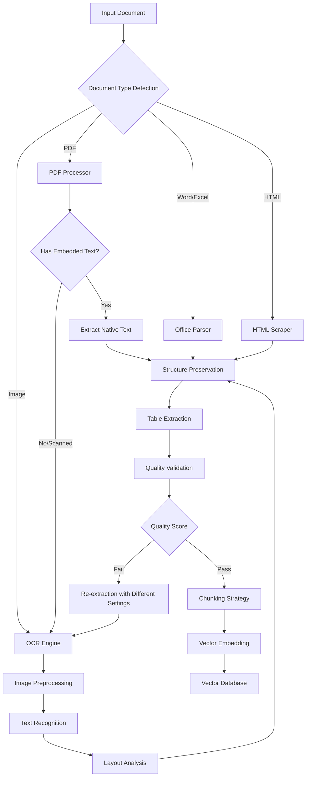
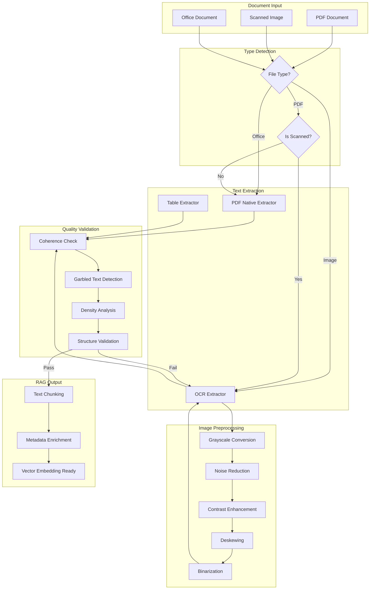

# How to Build Text Extraction

Author: [nawazdhandala](https://github.com/nawazdhandala)

Tags: RAG, Text Extraction, OCR, Document Processing

Description: Learn to build text extraction for reliably extracting text content from documents and images.

---

> Text extraction is the foundation of every RAG (Retrieval Augmented Generation) system. Without reliable extraction, your AI assistant receives garbage in and produces garbage out. This guide covers building production-grade text extraction pipelines that handle PDFs, images, tables, and complex document layouts.

The challenge with text extraction is not just reading characters from a page. It is about preserving document structure, handling multiple formats, extracting tables correctly, and validating output quality before feeding it to your vector database.

---

## Understanding the Text Extraction Pipeline

Before diving into code, let us understand the complete extraction pipeline and how different components interact:



This diagram shows the decision tree your extraction system must navigate. Each document type requires different handling, and scanned PDFs need OCR while native PDFs do not.

---

## Setting Up the Extraction Environment

### Installation

Install the required Python packages for a comprehensive extraction pipeline. We use `pymupdf` for PDF handling, `pytesseract` for OCR, and `pdf2image` to convert scanned pages.

```bash
# Core extraction libraries
pip install pymupdf       # Fast PDF text extraction
pip install pytesseract   # OCR wrapper for Tesseract
pip install pdf2image     # Convert PDF pages to images
pip install Pillow        # Image processing
pip install opencv-python # Image preprocessing for OCR
pip install pandas        # Table structure handling
pip install camelot-py    # Table extraction from PDFs
pip install pdfplumber    # Alternative PDF extraction

# Install Tesseract OCR engine (system dependency)
# macOS:
brew install tesseract tesseract-lang

# Ubuntu/Debian:
# apt-get install tesseract-ocr tesseract-ocr-eng libtesseract-dev

# Also install poppler for pdf2image
# macOS:
brew install poppler

# Ubuntu/Debian:
# apt-get install poppler-utils
```

### Project Structure

Organize your extraction system with clear separation of concerns:

```
text_extraction/
    __init__.py
    extractors/
        __init__.py
        base.py           # Abstract base class for extractors
        pdf_extractor.py  # Native PDF text extraction
        ocr_extractor.py  # Image and scanned document OCR
        table_extractor.py # Table-specific extraction
        office_extractor.py # Word, Excel, PowerPoint
    preprocessors/
        __init__.py
        image_enhancer.py # Image quality improvement
        layout_analyzer.py # Document structure detection
    validators/
        __init__.py
        quality_checker.py # Extraction quality validation
    pipeline.py           # Main orchestration
    config.py             # Configuration settings
```

---

## Building the Core Extractor Classes

### Base Extractor Interface

Define a consistent interface that all extractors must implement. This allows swapping extraction strategies without changing downstream code.

```python
# extractors/base.py
from abc import ABC, abstractmethod
from dataclasses import dataclass, field
from typing import List, Optional, Dict, Any
from enum import Enum
import hashlib


class DocumentType(Enum):
    """Supported document types for extraction."""
    PDF = "pdf"
    IMAGE = "image"
    WORD = "word"
    EXCEL = "excel"
    HTML = "html"
    UNKNOWN = "unknown"


@dataclass
class ExtractedText:
    """
    Container for extracted text with metadata.

    Attributes:
        content: The raw extracted text content
        page_number: Source page number (1-indexed)
        confidence: OCR confidence score (0.0 to 1.0), None for native text
        bounding_box: Optional coordinates of text region [x1, y1, x2, y2]
        metadata: Additional extraction metadata (font, size, etc.)
    """
    content: str
    page_number: int
    confidence: Optional[float] = None
    bounding_box: Optional[List[float]] = None
    metadata: Dict[str, Any] = field(default_factory=dict)

    def __post_init__(self):
        # Clean whitespace while preserving structure
        self.content = self.content.strip()

    @property
    def word_count(self) -> int:
        """Count words in extracted content."""
        return len(self.content.split())

    @property
    def content_hash(self) -> str:
        """Generate hash for deduplication."""
        return hashlib.md5(self.content.encode()).hexdigest()


@dataclass
class ExtractionResult:
    """
    Complete result from document extraction.

    Attributes:
        texts: List of extracted text blocks
        tables: List of extracted tables as dictionaries
        document_type: Detected document type
        total_pages: Total number of pages processed
        extraction_method: Method used (native, ocr, hybrid)
        quality_score: Overall extraction quality (0.0 to 1.0)
        errors: List of any errors encountered during extraction
    """
    texts: List[ExtractedText]
    tables: List[Dict[str, Any]] = field(default_factory=list)
    document_type: DocumentType = DocumentType.UNKNOWN
    total_pages: int = 0
    extraction_method: str = "unknown"
    quality_score: float = 0.0
    errors: List[str] = field(default_factory=list)

    @property
    def full_text(self) -> str:
        """Concatenate all extracted text blocks."""
        return "\n\n".join(t.content for t in self.texts if t.content)

    @property
    def average_confidence(self) -> Optional[float]:
        """Calculate average OCR confidence across all blocks."""
        confidences = [t.confidence for t in self.texts if t.confidence is not None]
        return sum(confidences) / len(confidences) if confidences else None


class BaseExtractor(ABC):
    """
    Abstract base class for all text extractors.

    Subclasses must implement the extract() method to handle
    their specific document type.
    """

    def __init__(self, config: Optional[Dict[str, Any]] = None):
        """
        Initialize extractor with optional configuration.

        Args:
            config: Dictionary of extractor-specific settings
        """
        self.config = config or {}
        self._setup()

    def _setup(self):
        """Override in subclasses for initialization logic."""
        pass

    @abstractmethod
    def extract(self, file_path: str) -> ExtractionResult:
        """
        Extract text from a document.

        Args:
            file_path: Path to the document file

        Returns:
            ExtractionResult containing extracted text and metadata
        """
        pass

    @abstractmethod
    def can_handle(self, file_path: str) -> bool:
        """
        Check if this extractor can handle the given file.

        Args:
            file_path: Path to the document file

        Returns:
            True if this extractor supports the file type
        """
        pass

    def validate_file(self, file_path: str) -> bool:
        """
        Validate that file exists and is readable.

        Args:
            file_path: Path to the document file

        Returns:
            True if file is valid and readable
        """
        import os
        if not os.path.exists(file_path):
            raise FileNotFoundError(f"Document not found: {file_path}")
        if not os.access(file_path, os.R_OK):
            raise PermissionError(f"Cannot read document: {file_path}")
        return True
```

### PDF Text Extractor

Handle native PDFs with embedded text. This is the fastest extraction method and produces highest quality results for documents created digitally.

```python
# extractors/pdf_extractor.py
import fitz  # PyMuPDF
from pathlib import Path
from typing import List, Dict, Any, Optional
import logging

from .base import (
    BaseExtractor,
    ExtractionResult,
    ExtractedText,
    DocumentType
)

logger = logging.getLogger(__name__)


class PDFExtractor(BaseExtractor):
    """
    Extract text from native PDF documents using PyMuPDF.

    This extractor handles PDFs with embedded text (not scanned images).
    For scanned PDFs, use OCRExtractor instead.

    Configuration options:
        - preserve_layout: Maintain spatial text positioning (default: True)
        - extract_images: Also extract embedded images (default: False)
        - password: Password for encrypted PDFs (default: None)
    """

    SUPPORTED_EXTENSIONS = {'.pdf'}

    def _setup(self):
        """Configure extraction settings."""
        self.preserve_layout = self.config.get('preserve_layout', True)
        self.extract_images = self.config.get('extract_images', False)
        self.password = self.config.get('password', None)

    def can_handle(self, file_path: str) -> bool:
        """Check if file is a PDF document."""
        return Path(file_path).suffix.lower() in self.SUPPORTED_EXTENSIONS

    def extract(self, file_path: str) -> ExtractionResult:
        """
        Extract text from a PDF document.

        This method attempts native text extraction first. If the PDF
        appears to be scanned (low text density), it returns a result
        indicating OCR is needed.

        Args:
            file_path: Path to PDF file

        Returns:
            ExtractionResult with extracted text blocks
        """
        self.validate_file(file_path)

        texts: List[ExtractedText] = []
        errors: List[str] = []

        try:
            # Open PDF document
            doc = fitz.open(file_path)

            # Handle password-protected PDFs
            if doc.is_encrypted:
                if self.password:
                    if not doc.authenticate(self.password):
                        raise ValueError("Invalid PDF password")
                else:
                    raise ValueError("PDF is encrypted, password required")

            total_pages = len(doc)
            logger.info(f"Processing PDF with {total_pages} pages: {file_path}")

            for page_num in range(total_pages):
                page = doc[page_num]

                # Extract text with layout preservation
                if self.preserve_layout:
                    # Use blocks to preserve structure
                    blocks = page.get_text("dict")["blocks"]
                    page_text = self._process_blocks(blocks, page_num + 1)
                    texts.extend(page_text)
                else:
                    # Simple text extraction
                    text = page.get_text("text")
                    if text.strip():
                        texts.append(ExtractedText(
                            content=text,
                            page_number=page_num + 1,
                            metadata={
                                "extraction_method": "pymupdf_simple",
                                "page_width": page.rect.width,
                                "page_height": page.rect.height
                            }
                        ))

            doc.close()

            # Calculate quality score based on extraction results
            quality_score = self._calculate_quality_score(texts, total_pages)

            return ExtractionResult(
                texts=texts,
                document_type=DocumentType.PDF,
                total_pages=total_pages,
                extraction_method="native_pdf",
                quality_score=quality_score,
                errors=errors
            )

        except Exception as e:
            logger.error(f"PDF extraction failed: {str(e)}")
            errors.append(str(e))
            return ExtractionResult(
                texts=[],
                document_type=DocumentType.PDF,
                extraction_method="native_pdf",
                errors=errors
            )

    def _process_blocks(
        self,
        blocks: List[Dict],
        page_number: int
    ) -> List[ExtractedText]:
        """
        Process PDF text blocks preserving layout structure.

        Args:
            blocks: List of block dictionaries from PyMuPDF
            page_number: Current page number (1-indexed)

        Returns:
            List of ExtractedText objects
        """
        extracted = []

        for block in blocks:
            # Skip image blocks (type 1)
            if block.get("type") != 0:
                continue

            # Extract text from lines within the block
            block_text = []
            for line in block.get("lines", []):
                line_text = ""
                for span in line.get("spans", []):
                    line_text += span.get("text", "")
                block_text.append(line_text)

            content = "\n".join(block_text)
            if not content.strip():
                continue

            # Get bounding box coordinates
            bbox = block.get("bbox", [0, 0, 0, 0])

            extracted.append(ExtractedText(
                content=content,
                page_number=page_number,
                bounding_box=list(bbox),
                metadata={
                    "extraction_method": "pymupdf_blocks",
                    "block_type": "text",
                    "line_count": len(block_text)
                }
            ))

        return extracted

    def _calculate_quality_score(
        self,
        texts: List[ExtractedText],
        total_pages: int
    ) -> float:
        """
        Calculate extraction quality score.

        Factors considered:
        - Text density per page
        - Character diversity
        - Presence of common patterns

        Args:
            texts: Extracted text blocks
            total_pages: Total pages in document

        Returns:
            Quality score between 0.0 and 1.0
        """
        if not texts or total_pages == 0:
            return 0.0

        full_text = " ".join(t.content for t in texts)

        # Check text density (characters per page)
        chars_per_page = len(full_text) / total_pages
        density_score = min(chars_per_page / 1000, 1.0)  # Expect ~1000 chars/page

        # Check character diversity (unique chars / total chars)
        unique_chars = len(set(full_text))
        diversity_score = min(unique_chars / 50, 1.0)  # Expect ~50 unique chars

        # Check for garbled text patterns (common OCR artifacts)
        garbled_patterns = ['�', '\x00', '\ufffd']
        garbled_count = sum(full_text.count(p) for p in garbled_patterns)
        garbled_score = max(0, 1 - (garbled_count / max(len(full_text), 1)) * 10)

        # Weighted average
        return (density_score * 0.4 + diversity_score * 0.3 + garbled_score * 0.3)

    def is_scanned_pdf(self, file_path: str) -> bool:
        """
        Detect if PDF is scanned (image-based) rather than native text.

        A scanned PDF typically has very little or no extractable text
        despite having visible content on pages.

        Args:
            file_path: Path to PDF file

        Returns:
            True if PDF appears to be scanned/image-based
        """
        try:
            doc = fitz.open(file_path)
            total_text_chars = 0
            total_pages = len(doc)

            for page_num in range(min(total_pages, 5)):  # Check first 5 pages
                page = doc[page_num]
                text = page.get_text("text")
                total_text_chars += len(text.strip())

            doc.close()

            # If average chars per page is very low, likely scanned
            avg_chars = total_text_chars / min(total_pages, 5)
            return avg_chars < 100  # Threshold for scanned detection

        except Exception as e:
            logger.warning(f"Could not detect PDF type: {e}")
            return False
```

---

## Building the OCR Extraction System

### Image Preprocessing

OCR accuracy depends heavily on image quality. This preprocessor enhances images before text recognition.

```python
# preprocessors/image_enhancer.py
import cv2
import numpy as np
from PIL import Image
from typing import Tuple, Optional
import logging

logger = logging.getLogger(__name__)


class ImageEnhancer:
    """
    Preprocess images to improve OCR accuracy.

    Applies various image processing techniques:
    - Grayscale conversion
    - Noise reduction
    - Contrast enhancement
    - Binarization (thresholding)
    - Deskewing (rotation correction)
    - Border removal
    """

    def __init__(self, config: Optional[dict] = None):
        """
        Initialize image enhancer.

        Args:
            config: Optional configuration dictionary with:
                - denoise_strength: Denoising intensity (default: 10)
                - contrast_factor: Contrast enhancement factor (default: 1.5)
                - deskew: Enable deskewing (default: True)
        """
        self.config = config or {}
        self.denoise_strength = self.config.get('denoise_strength', 10)
        self.contrast_factor = self.config.get('contrast_factor', 1.5)
        self.deskew = self.config.get('deskew', True)

    def enhance(self, image: np.ndarray) -> np.ndarray:
        """
        Apply full enhancement pipeline to image.

        Args:
            image: Input image as numpy array (BGR or grayscale)

        Returns:
            Enhanced image ready for OCR
        """
        # Convert to grayscale if needed
        if len(image.shape) == 3:
            gray = cv2.cvtColor(image, cv2.COLOR_BGR2GRAY)
        else:
            gray = image.copy()

        # Apply enhancement steps
        enhanced = self._remove_noise(gray)
        enhanced = self._enhance_contrast(enhanced)
        enhanced = self._binarize(enhanced)

        if self.deskew:
            enhanced = self._deskew_image(enhanced)

        enhanced = self._remove_borders(enhanced)

        return enhanced

    def _remove_noise(self, image: np.ndarray) -> np.ndarray:
        """
        Remove noise using non-local means denoising.

        This algorithm is effective for removing Gaussian noise
        while preserving edges and text details.
        """
        return cv2.fastNlMeansDenoising(
            image,
            None,
            h=self.denoise_strength,
            templateWindowSize=7,
            searchWindowSize=21
        )

    def _enhance_contrast(self, image: np.ndarray) -> np.ndarray:
        """
        Enhance contrast using CLAHE (Contrast Limited Adaptive Histogram Equalization).

        CLAHE works on small regions (tiles) rather than the whole image,
        making it effective for documents with varying lighting.
        """
        clahe = cv2.createCLAHE(
            clipLimit=2.0,
            tileGridSize=(8, 8)
        )
        return clahe.apply(image)

    def _binarize(self, image: np.ndarray) -> np.ndarray:
        """
        Convert to binary (black and white) using adaptive thresholding.

        Adaptive thresholding calculates threshold for small regions,
        handling documents with shadows or uneven lighting.
        """
        return cv2.adaptiveThreshold(
            image,
            255,
            cv2.ADAPTIVE_THRESH_GAUSSIAN_C,
            cv2.THRESH_BINARY,
            blockSize=11,  # Size of pixel neighborhood
            C=2  # Constant subtracted from mean
        )

    def _deskew_image(self, image: np.ndarray) -> np.ndarray:
        """
        Correct image rotation/skew.

        Uses Hough Line Transform to detect dominant line angles
        and rotates image to align text horizontally.
        """
        # Detect edges
        edges = cv2.Canny(image, 50, 150, apertureSize=3)

        # Detect lines using Hough Transform
        lines = cv2.HoughLinesP(
            edges,
            rho=1,
            theta=np.pi / 180,
            threshold=100,
            minLineLength=100,
            maxLineGap=10
        )

        if lines is None or len(lines) == 0:
            return image

        # Calculate average angle of detected lines
        angles = []
        for line in lines:
            x1, y1, x2, y2 = line[0]
            if x2 - x1 != 0:  # Avoid division by zero
                angle = np.degrees(np.arctan2(y2 - y1, x2 - x1))
                # Only consider nearly horizontal lines
                if abs(angle) < 45:
                    angles.append(angle)

        if not angles:
            return image

        # Use median angle to avoid outliers
        median_angle = np.median(angles)

        # Only rotate if skew is significant
        if abs(median_angle) < 0.5:
            return image

        # Rotate image to correct skew
        height, width = image.shape[:2]
        center = (width // 2, height // 2)
        rotation_matrix = cv2.getRotationMatrix2D(center, median_angle, 1.0)

        rotated = cv2.warpAffine(
            image,
            rotation_matrix,
            (width, height),
            flags=cv2.INTER_CUBIC,
            borderMode=cv2.BORDER_REPLICATE
        )

        logger.debug(f"Deskewed image by {median_angle:.2f} degrees")
        return rotated

    def _remove_borders(self, image: np.ndarray) -> np.ndarray:
        """
        Remove black borders from scanned documents.

        Finds the bounding box of content and crops to that region.
        """
        # Find contours
        contours, _ = cv2.findContours(
            255 - image,  # Invert so text is white
            cv2.RETR_EXTERNAL,
            cv2.CHAIN_APPROX_SIMPLE
        )

        if not contours:
            return image

        # Find bounding box of all contours
        x_min, y_min = image.shape[1], image.shape[0]
        x_max, y_max = 0, 0

        for contour in contours:
            x, y, w, h = cv2.boundingRect(contour)
            x_min = min(x_min, x)
            y_min = min(y_min, y)
            x_max = max(x_max, x + w)
            y_max = max(y_max, y + h)

        # Add small padding
        padding = 10
        x_min = max(0, x_min - padding)
        y_min = max(0, y_min - padding)
        x_max = min(image.shape[1], x_max + padding)
        y_max = min(image.shape[0], y_max + padding)

        # Only crop if we found meaningful bounds
        if x_max > x_min and y_max > y_min:
            return image[y_min:y_max, x_min:x_max]

        return image

    def estimate_quality(self, image: np.ndarray) -> float:
        """
        Estimate image quality for OCR suitability.

        Considers:
        - Resolution (DPI estimation)
        - Contrast ratio
        - Noise level

        Args:
            image: Input image

        Returns:
            Quality score between 0.0 and 1.0
        """
        # Convert to grayscale if needed
        if len(image.shape) == 3:
            gray = cv2.cvtColor(image, cv2.COLOR_BGR2GRAY)
        else:
            gray = image

        # Resolution score (based on image size)
        height, width = gray.shape
        resolution_score = min((height * width) / (1000 * 1000), 1.0)

        # Contrast score
        contrast = gray.std()
        contrast_score = min(contrast / 60, 1.0)

        # Noise estimation using Laplacian variance
        laplacian_var = cv2.Laplacian(gray, cv2.CV_64F).var()
        # High variance indicates sharp edges (good), very high indicates noise
        noise_score = min(laplacian_var / 500, 1.0) if laplacian_var < 2000 else 0.5

        return (resolution_score * 0.3 + contrast_score * 0.4 + noise_score * 0.3)
```

### OCR Extractor

The main OCR extractor handles images and scanned PDFs using Tesseract.

```python
# extractors/ocr_extractor.py
import pytesseract
from PIL import Image
from pdf2image import convert_from_path
import cv2
import numpy as np
from pathlib import Path
from typing import List, Dict, Any, Optional
import logging
import tempfile
import os

from .base import (
    BaseExtractor,
    ExtractionResult,
    ExtractedText,
    DocumentType
)
from ..preprocessors.image_enhancer import ImageEnhancer

logger = logging.getLogger(__name__)


class OCRExtractor(BaseExtractor):
    """
    Extract text from images and scanned documents using OCR.

    Uses Tesseract OCR engine with configurable preprocessing
    and language support.

    Configuration options:
        - language: OCR language(s) (default: 'eng')
        - psm: Page segmentation mode (default: 3 - auto)
        - oem: OCR engine mode (default: 3 - LSTM only)
        - dpi: Resolution for PDF conversion (default: 300)
        - preprocess: Enable image preprocessing (default: True)
    """

    SUPPORTED_IMAGE_EXTENSIONS = {'.png', '.jpg', '.jpeg', '.tiff', '.tif', '.bmp', '.webp'}
    SUPPORTED_DOC_EXTENSIONS = {'.pdf'}

    # Tesseract Page Segmentation Modes
    PSM_MODES = {
        0: "Orientation and script detection only",
        1: "Automatic page segmentation with OSD",
        3: "Fully automatic page segmentation (default)",
        4: "Assume single column of text",
        6: "Assume single uniform block of text",
        7: "Treat image as single text line",
        11: "Sparse text, no particular order",
        12: "Sparse text with OSD",
    }

    def _setup(self):
        """Configure OCR settings."""
        self.language = self.config.get('language', 'eng')
        self.psm = self.config.get('psm', 3)
        self.oem = self.config.get('oem', 3)
        self.dpi = self.config.get('dpi', 300)
        self.preprocess = self.config.get('preprocess', True)

        # Initialize image enhancer
        self.enhancer = ImageEnhancer(self.config.get('enhancer_config'))

        # Verify Tesseract installation
        try:
            pytesseract.get_tesseract_version()
        except pytesseract.TesseractNotFoundError:
            raise RuntimeError(
                "Tesseract OCR not found. Install with: brew install tesseract"
            )

    def can_handle(self, file_path: str) -> bool:
        """Check if file is an image or scanned PDF."""
        suffix = Path(file_path).suffix.lower()
        return suffix in self.SUPPORTED_IMAGE_EXTENSIONS | self.SUPPORTED_DOC_EXTENSIONS

    def extract(self, file_path: str) -> ExtractionResult:
        """
        Extract text using OCR.

        Handles both images and PDFs. PDFs are first converted to
        images, then processed page by page.

        Args:
            file_path: Path to image or PDF file

        Returns:
            ExtractionResult with OCR-extracted text
        """
        self.validate_file(file_path)

        suffix = Path(file_path).suffix.lower()

        if suffix in self.SUPPORTED_IMAGE_EXTENSIONS:
            return self._extract_from_image(file_path)
        elif suffix == '.pdf':
            return self._extract_from_pdf(file_path)
        else:
            raise ValueError(f"Unsupported file type: {suffix}")

    def _extract_from_image(self, file_path: str) -> ExtractionResult:
        """
        Extract text from a single image file.

        Args:
            file_path: Path to image file

        Returns:
            ExtractionResult with extracted text
        """
        texts: List[ExtractedText] = []
        errors: List[str] = []

        try:
            # Load image
            image = cv2.imread(file_path)
            if image is None:
                raise ValueError(f"Could not load image: {file_path}")

            # Preprocess if enabled
            if self.preprocess:
                processed = self.enhancer.enhance(image)
            else:
                processed = cv2.cvtColor(image, cv2.COLOR_BGR2GRAY)

            # Run OCR with detailed output
            ocr_result = self._run_ocr_with_details(processed)

            if ocr_result['text'].strip():
                texts.append(ExtractedText(
                    content=ocr_result['text'],
                    page_number=1,
                    confidence=ocr_result['confidence'],
                    metadata={
                        "extraction_method": "tesseract_ocr",
                        "language": self.language,
                        "psm_mode": self.psm,
                        "preprocessed": self.preprocess,
                        "image_quality": self.enhancer.estimate_quality(image)
                    }
                ))

            quality_score = ocr_result['confidence'] if ocr_result['confidence'] else 0.0

            return ExtractionResult(
                texts=texts,
                document_type=DocumentType.IMAGE,
                total_pages=1,
                extraction_method="ocr",
                quality_score=quality_score,
                errors=errors
            )

        except Exception as e:
            logger.error(f"Image OCR failed: {str(e)}")
            errors.append(str(e))
            return ExtractionResult(
                texts=[],
                document_type=DocumentType.IMAGE,
                extraction_method="ocr",
                errors=errors
            )

    def _extract_from_pdf(self, file_path: str) -> ExtractionResult:
        """
        Extract text from a scanned PDF using OCR.

        Converts each page to an image, then runs OCR.

        Args:
            file_path: Path to PDF file

        Returns:
            ExtractionResult with OCR-extracted text
        """
        texts: List[ExtractedText] = []
        errors: List[str] = []

        try:
            # Convert PDF pages to images
            logger.info(f"Converting PDF to images at {self.dpi} DPI")
            images = convert_from_path(
                file_path,
                dpi=self.dpi,
                fmt='png',
                thread_count=4  # Parallel conversion
            )

            total_pages = len(images)
            logger.info(f"Processing {total_pages} pages with OCR")

            total_confidence = 0.0
            pages_with_confidence = 0

            for page_num, pil_image in enumerate(images, start=1):
                # Convert PIL Image to OpenCV format
                image = cv2.cvtColor(np.array(pil_image), cv2.COLOR_RGB2BGR)

                # Preprocess
                if self.preprocess:
                    processed = self.enhancer.enhance(image)
                else:
                    processed = cv2.cvtColor(image, cv2.COLOR_BGR2GRAY)

                # Run OCR
                ocr_result = self._run_ocr_with_details(processed)

                if ocr_result['text'].strip():
                    texts.append(ExtractedText(
                        content=ocr_result['text'],
                        page_number=page_num,
                        confidence=ocr_result['confidence'],
                        metadata={
                            "extraction_method": "tesseract_ocr",
                            "language": self.language,
                            "dpi": self.dpi,
                            "preprocessed": self.preprocess
                        }
                    ))

                    if ocr_result['confidence']:
                        total_confidence += ocr_result['confidence']
                        pages_with_confidence += 1

                logger.debug(
                    f"Page {page_num}/{total_pages} complete, "
                    f"confidence: {ocr_result['confidence']:.2f}"
                )

            # Calculate average quality
            avg_confidence = (
                total_confidence / pages_with_confidence
                if pages_with_confidence > 0
                else 0.0
            )

            return ExtractionResult(
                texts=texts,
                document_type=DocumentType.PDF,
                total_pages=total_pages,
                extraction_method="ocr",
                quality_score=avg_confidence,
                errors=errors
            )

        except Exception as e:
            logger.error(f"PDF OCR failed: {str(e)}")
            errors.append(str(e))
            return ExtractionResult(
                texts=[],
                document_type=DocumentType.PDF,
                extraction_method="ocr",
                errors=errors
            )

    def _run_ocr_with_details(
        self,
        image: np.ndarray
    ) -> Dict[str, Any]:
        """
        Run Tesseract OCR and extract detailed results.

        Uses pytesseract.image_to_data() to get word-level
        confidence scores along with text.

        Args:
            image: Preprocessed grayscale image

        Returns:
            Dictionary with 'text' and 'confidence' keys
        """
        # Build Tesseract config string
        config = f'--psm {self.psm} --oem {self.oem}'

        # Get detailed OCR output with confidence scores
        data = pytesseract.image_to_data(
            image,
            lang=self.language,
            config=config,
            output_type=pytesseract.Output.DICT
        )

        # Build text and calculate confidence
        words = []
        confidences = []

        for i, word in enumerate(data['text']):
            conf = int(data['conf'][i])

            # Skip empty words and low-confidence noise
            if word.strip() and conf > 0:
                words.append(word)
                confidences.append(conf)

        text = ' '.join(words)
        avg_confidence = (
            sum(confidences) / len(confidences) / 100
            if confidences
            else 0.0
        )

        return {
            'text': text,
            'confidence': avg_confidence,
            'word_count': len(words)
        }

    def extract_with_layout(self, file_path: str) -> ExtractionResult:
        """
        Extract text preserving document layout using hOCR output.

        hOCR is an HTML-based format that includes bounding box
        coordinates for each word and line.

        Args:
            file_path: Path to image file

        Returns:
            ExtractionResult with layout-aware text blocks
        """
        self.validate_file(file_path)

        texts: List[ExtractedText] = []

        # Load and preprocess image
        image = cv2.imread(file_path)
        if self.preprocess:
            processed = self.enhancer.enhance(image)
        else:
            processed = cv2.cvtColor(image, cv2.COLOR_BGR2GRAY)

        # Get hOCR output
        config = f'--psm {self.psm} --oem {self.oem}'
        hocr = pytesseract.image_to_pdf_or_hocr(
            processed,
            lang=self.language,
            config=config,
            extension='hocr'
        )

        # Parse hOCR to extract text blocks with positions
        # (Simplified; full implementation would parse XML)
        from bs4 import BeautifulSoup
        soup = BeautifulSoup(hocr, 'html.parser')

        for paragraph in soup.find_all('p', class_='ocr_par'):
            # Extract bounding box from title attribute
            title = paragraph.get('title', '')
            bbox = self._parse_bbox(title)

            text = paragraph.get_text(strip=True)
            if text:
                texts.append(ExtractedText(
                    content=text,
                    page_number=1,
                    bounding_box=bbox,
                    metadata={
                        "extraction_method": "tesseract_hocr",
                        "layout_preserved": True
                    }
                ))

        return ExtractionResult(
            texts=texts,
            document_type=DocumentType.IMAGE,
            total_pages=1,
            extraction_method="ocr_layout",
            quality_score=0.0  # Would calculate from word confidences
        )

    def _parse_bbox(self, title: str) -> Optional[List[float]]:
        """Parse bounding box from hOCR title attribute."""
        import re
        match = re.search(r'bbox (\d+) (\d+) (\d+) (\d+)', title)
        if match:
            return [float(x) for x in match.groups()]
        return None
```

---

## Table Extraction

Tables are notoriously difficult to extract. Standard OCR treats them as regular text, losing the row/column structure. Here is a specialized table extractor.

```python
# extractors/table_extractor.py
import camelot
import pdfplumber
import pandas as pd
from pathlib import Path
from typing import List, Dict, Any, Optional
import logging
import json

from .base import BaseExtractor, ExtractionResult, DocumentType

logger = logging.getLogger(__name__)


class TableExtractor(BaseExtractor):
    """
    Extract tables from PDF documents.

    Uses multiple strategies:
    1. Camelot (lattice mode) for tables with visible borders
    2. Camelot (stream mode) for tables without borders
    3. pdfplumber as fallback

    Configuration options:
        - flavor: 'lattice' (bordered), 'stream' (borderless), or 'auto'
        - min_accuracy: Minimum accuracy threshold (default: 80)
        - pages: Pages to extract from (default: 'all')
    """

    def _setup(self):
        """Configure table extraction settings."""
        self.flavor = self.config.get('flavor', 'auto')
        self.min_accuracy = self.config.get('min_accuracy', 80)
        self.pages = self.config.get('pages', 'all')

    def can_handle(self, file_path: str) -> bool:
        """Check if file is a PDF."""
        return Path(file_path).suffix.lower() == '.pdf'

    def extract(self, file_path: str) -> ExtractionResult:
        """
        Extract tables from a PDF document.

        Tries multiple extraction methods and returns the best results.

        Args:
            file_path: Path to PDF file

        Returns:
            ExtractionResult with extracted tables
        """
        self.validate_file(file_path)

        tables: List[Dict[str, Any]] = []
        errors: List[str] = []

        # Try Camelot first (best for structured tables)
        camelot_tables = self._extract_with_camelot(file_path)
        tables.extend(camelot_tables)

        # If no tables found, try pdfplumber
        if not tables:
            logger.info("No tables found with Camelot, trying pdfplumber")
            plumber_tables = self._extract_with_pdfplumber(file_path)
            tables.extend(plumber_tables)

        # Calculate quality score
        quality_score = self._calculate_table_quality(tables)

        return ExtractionResult(
            texts=[],  # Table extractor focuses on tables
            tables=tables,
            document_type=DocumentType.PDF,
            extraction_method="table_extraction",
            quality_score=quality_score,
            errors=errors
        )

    def _extract_with_camelot(
        self,
        file_path: str
    ) -> List[Dict[str, Any]]:
        """
        Extract tables using Camelot library.

        Camelot uses computer vision to detect table structures
        and is very accurate for PDFs with clear table layouts.

        Args:
            file_path: Path to PDF

        Returns:
            List of table dictionaries
        """
        tables = []

        try:
            # Determine which flavor to use
            flavors = ['lattice', 'stream'] if self.flavor == 'auto' else [self.flavor]

            for flavor in flavors:
                logger.info(f"Extracting tables with Camelot ({flavor} mode)")

                extracted = camelot.read_pdf(
                    file_path,
                    pages=str(self.pages) if self.pages != 'all' else 'all',
                    flavor=flavor,
                    suppress_stdout=True
                )

                for i, table in enumerate(extracted):
                    # Check accuracy threshold
                    if table.accuracy < self.min_accuracy:
                        logger.debug(
                            f"Skipping table {i} with low accuracy: {table.accuracy}"
                        )
                        continue

                    # Convert to dictionary format
                    df = table.df

                    # Try to use first row as header if it looks like headers
                    if self._row_looks_like_header(df.iloc[0]):
                        df.columns = df.iloc[0]
                        df = df[1:].reset_index(drop=True)

                    tables.append({
                        'data': df.to_dict('records'),
                        'columns': list(df.columns),
                        'rows': len(df),
                        'page': table.page,
                        'accuracy': table.accuracy,
                        'extraction_method': f'camelot_{flavor}',
                        'markdown': df.to_markdown(index=False),
                        'csv': df.to_csv(index=False)
                    })

                # If we found tables with lattice, no need to try stream
                if tables and flavor == 'lattice':
                    break

        except Exception as e:
            logger.warning(f"Camelot extraction failed: {str(e)}")

        return tables

    def _extract_with_pdfplumber(
        self,
        file_path: str
    ) -> List[Dict[str, Any]]:
        """
        Extract tables using pdfplumber library.

        pdfplumber uses different algorithms and can catch tables
        that Camelot misses.

        Args:
            file_path: Path to PDF

        Returns:
            List of table dictionaries
        """
        tables = []

        try:
            with pdfplumber.open(file_path) as pdf:
                for page_num, page in enumerate(pdf.pages, start=1):
                    # Skip pages if specific pages requested
                    if self.pages != 'all':
                        page_list = [int(p) for p in str(self.pages).split(',')]
                        if page_num not in page_list:
                            continue

                    # Extract tables from page
                    page_tables = page.extract_tables()

                    for i, table_data in enumerate(page_tables):
                        if not table_data or len(table_data) < 2:
                            continue

                        # Convert to DataFrame
                        header = table_data[0]
                        rows = table_data[1:]

                        # Clean up None values
                        header = [str(h) if h else f'col_{j}' for j, h in enumerate(header)]
                        rows = [[str(cell) if cell else '' for cell in row] for row in rows]

                        df = pd.DataFrame(rows, columns=header)

                        tables.append({
                            'data': df.to_dict('records'),
                            'columns': list(df.columns),
                            'rows': len(df),
                            'page': page_num,
                            'accuracy': 75.0,  # pdfplumber does not provide accuracy
                            'extraction_method': 'pdfplumber',
                            'markdown': df.to_markdown(index=False),
                            'csv': df.to_csv(index=False)
                        })

        except Exception as e:
            logger.warning(f"pdfplumber extraction failed: {str(e)}")

        return tables

    def _row_looks_like_header(self, row: pd.Series) -> bool:
        """
        Heuristic to detect if a row is a header row.

        Headers typically:
        - Have no numeric values
        - Are shorter than data rows
        - Have unique values
        """
        values = [str(v) for v in row.values if v]

        # Check if any values are purely numeric (unlikely for headers)
        numeric_count = sum(1 for v in values if v.replace('.', '').isdigit())
        if numeric_count > len(values) / 2:
            return False

        # Check for duplicate values (headers usually unique)
        if len(values) != len(set(values)):
            return False

        return True

    def _calculate_table_quality(
        self,
        tables: List[Dict[str, Any]]
    ) -> float:
        """
        Calculate overall quality score for extracted tables.

        Considers:
        - Individual table accuracy scores
        - Table completeness (no empty cells)
        - Column consistency
        """
        if not tables:
            return 0.0

        scores = []
        for table in tables:
            accuracy = table.get('accuracy', 50) / 100

            # Check for empty cells
            data = table.get('data', [])
            if data:
                total_cells = len(data) * len(table.get('columns', []))
                empty_cells = sum(
                    1 for row in data
                    for val in row.values()
                    if not str(val).strip()
                )
                completeness = 1 - (empty_cells / max(total_cells, 1))
            else:
                completeness = 0

            scores.append((accuracy * 0.6 + completeness * 0.4))

        return sum(scores) / len(scores)

    def tables_to_text(
        self,
        tables: List[Dict[str, Any]],
        format: str = 'markdown'
    ) -> str:
        """
        Convert extracted tables to text format for RAG indexing.

        Args:
            tables: List of extracted table dictionaries
            format: Output format ('markdown', 'csv', 'json')

        Returns:
            Tables as formatted text
        """
        output_parts = []

        for i, table in enumerate(tables, start=1):
            header = f"## Table {i} (Page {table.get('page', 'unknown')})\n"

            if format == 'markdown':
                content = table.get('markdown', '')
            elif format == 'csv':
                content = table.get('csv', '')
            elif format == 'json':
                content = json.dumps(table.get('data', []), indent=2)
            else:
                content = table.get('markdown', '')

            output_parts.append(header + content)

        return '\n\n'.join(output_parts)
```

---

## Quality Validation

Before feeding extracted text to your RAG system, validate its quality. Poor extraction leads to poor retrieval.

```python
# validators/quality_checker.py
import re
from typing import List, Dict, Any, Tuple
from dataclasses import dataclass
import logging

from ..extractors.base import ExtractionResult, ExtractedText

logger = logging.getLogger(__name__)


@dataclass
class QualityReport:
    """
    Detailed quality assessment report.

    Attributes:
        overall_score: Combined quality score (0.0 to 1.0)
        issues: List of detected quality issues
        suggestions: Recommended actions to improve extraction
        metrics: Detailed quality metrics
    """
    overall_score: float
    issues: List[str]
    suggestions: List[str]
    metrics: Dict[str, float]

    @property
    def passed(self) -> bool:
        """Check if quality meets minimum threshold."""
        return self.overall_score >= 0.6


class QualityChecker:
    """
    Validate extraction quality for RAG suitability.

    Checks for:
    - Text coherence and readability
    - OCR artifacts and garbled text
    - Language consistency
    - Content density
    - Structure preservation

    Configuration:
        - min_word_length: Minimum average word length (default: 3)
        - max_garbled_ratio: Maximum allowed garbled character ratio (default: 0.05)
        - min_alpha_ratio: Minimum alphabetic character ratio (default: 0.7)
    """

    # Common OCR error patterns
    GARBLED_PATTERNS = [
        r'[^\x00-\x7F]{3,}',  # Long non-ASCII sequences
        r'[!@#$%^&*]{3,}',     # Repeated special characters
        r'\b[bcdfghjklmnpqrstvwxz]{5,}\b',  # Consonant-only words
        r'(?:\d[A-Za-z]){3,}', # Alternating digit-letter patterns
    ]

    def __init__(self, config: Dict[str, Any] = None):
        """Initialize quality checker with configuration."""
        self.config = config or {}
        self.min_word_length = self.config.get('min_word_length', 3)
        self.max_garbled_ratio = self.config.get('max_garbled_ratio', 0.05)
        self.min_alpha_ratio = self.config.get('min_alpha_ratio', 0.7)

    def check(self, result: ExtractionResult) -> QualityReport:
        """
        Perform comprehensive quality check on extraction result.

        Args:
            result: ExtractionResult to validate

        Returns:
            QualityReport with detailed assessment
        """
        issues = []
        suggestions = []
        metrics = {}

        # Get full text for analysis
        full_text = result.full_text

        if not full_text:
            return QualityReport(
                overall_score=0.0,
                issues=["No text extracted"],
                suggestions=["Try OCR extraction", "Check if document is readable"],
                metrics={'text_length': 0}
            )

        # Run individual checks
        coherence_score, coherence_issues = self._check_coherence(full_text)
        metrics['coherence'] = coherence_score
        issues.extend(coherence_issues)

        garbled_score, garbled_issues = self._check_garbled_text(full_text)
        metrics['garbled_text'] = garbled_score
        issues.extend(garbled_issues)

        density_score, density_issues = self._check_content_density(result)
        metrics['content_density'] = density_score
        issues.extend(density_issues)

        structure_score, structure_issues = self._check_structure(result)
        metrics['structure'] = structure_score
        issues.extend(structure_issues)

        # Check OCR confidence if available
        if result.average_confidence is not None:
            metrics['ocr_confidence'] = result.average_confidence
            if result.average_confidence < 0.7:
                issues.append(f"Low OCR confidence: {result.average_confidence:.2f}")
                suggestions.append("Try higher DPI or better image preprocessing")

        # Calculate overall score
        weights = {
            'coherence': 0.3,
            'garbled_text': 0.25,
            'content_density': 0.25,
            'structure': 0.2
        }

        overall_score = sum(
            metrics.get(key, 0) * weight
            for key, weight in weights.items()
        )

        # Generate suggestions based on issues
        suggestions.extend(self._generate_suggestions(issues, metrics))

        return QualityReport(
            overall_score=overall_score,
            issues=issues,
            suggestions=list(set(suggestions)),  # Deduplicate
            metrics=metrics
        )

    def _check_coherence(self, text: str) -> Tuple[float, List[str]]:
        """
        Check text coherence and readability.

        Analyzes:
        - Average word length
        - Sentence structure
        - Word validity
        """
        issues = []

        words = text.split()
        if not words:
            return 0.0, ["No words found in text"]

        # Average word length check
        avg_word_length = sum(len(w) for w in words) / len(words)
        if avg_word_length < self.min_word_length:
            issues.append(f"Short average word length: {avg_word_length:.1f}")

        word_length_score = min(avg_word_length / 5, 1.0)

        # Check for reasonable sentence structure
        sentences = re.split(r'[.!?]+', text)
        valid_sentences = [s for s in sentences if len(s.split()) >= 3]
        sentence_ratio = len(valid_sentences) / max(len(sentences), 1)

        if sentence_ratio < 0.5:
            issues.append("Poor sentence structure detected")

        # Combined coherence score
        coherence_score = (word_length_score * 0.5 + sentence_ratio * 0.5)

        return coherence_score, issues

    def _check_garbled_text(self, text: str) -> Tuple[float, List[str]]:
        """
        Detect OCR artifacts and garbled text.

        Looks for common OCR error patterns that indicate
        poor recognition quality.
        """
        issues = []

        total_chars = len(text)
        if total_chars == 0:
            return 0.0, ["Empty text"]

        # Count garbled characters
        garbled_count = 0
        for pattern in self.GARBLED_PATTERNS:
            matches = re.findall(pattern, text)
            garbled_count += sum(len(m) for m in matches)

        garbled_ratio = garbled_count / total_chars

        if garbled_ratio > self.max_garbled_ratio:
            issues.append(f"High garbled text ratio: {garbled_ratio:.2%}")

        # Check alphabetic ratio
        alpha_count = sum(1 for c in text if c.isalpha())
        alpha_ratio = alpha_count / total_chars

        if alpha_ratio < self.min_alpha_ratio:
            issues.append(f"Low alphabetic content: {alpha_ratio:.2%}")

        # Score (higher is better, so invert garbled ratio)
        garbled_score = max(0, 1 - (garbled_ratio * 10))
        alpha_score = min(alpha_ratio / self.min_alpha_ratio, 1.0)

        return (garbled_score * 0.6 + alpha_score * 0.4), issues

    def _check_content_density(
        self,
        result: ExtractionResult
    ) -> Tuple[float, List[str]]:
        """
        Check content density per page.

        Too little content per page may indicate extraction issues.
        """
        issues = []

        if result.total_pages == 0:
            return 0.0, ["No pages processed"]

        total_words = sum(t.word_count for t in result.texts)
        words_per_page = total_words / result.total_pages

        # Expect at least 100 words per page for typical documents
        if words_per_page < 50:
            issues.append(f"Low content density: {words_per_page:.0f} words/page")
            density_score = words_per_page / 100
        elif words_per_page < 100:
            issues.append(f"Below average content: {words_per_page:.0f} words/page")
            density_score = 0.5 + (words_per_page - 50) / 100
        else:
            density_score = min(words_per_page / 200, 1.0)

        return density_score, issues

    def _check_structure(
        self,
        result: ExtractionResult
    ) -> Tuple[float, List[str]]:
        """
        Check if document structure was preserved.

        Looks for:
        - Paragraph separation
        - List formatting
        - Header patterns
        """
        issues = []
        full_text = result.full_text

        # Check for paragraph breaks
        paragraphs = [p for p in full_text.split('\n\n') if p.strip()]
        if len(paragraphs) < 2 and len(full_text) > 500:
            issues.append("No paragraph structure detected")
            paragraph_score = 0.3
        else:
            paragraph_score = min(len(paragraphs) / 10, 1.0)

        # Check for list patterns
        list_patterns = [
            r'^\s*[\u2022\u2023\u25E6\u2043\u2219]\s',  # Bullet points
            r'^\s*\d+[.)]\s',  # Numbered lists
            r'^\s*[a-z][.)]\s',  # Lettered lists
        ]
        has_lists = any(
            re.search(pattern, full_text, re.MULTILINE)
            for pattern in list_patterns
        )
        list_score = 1.0 if has_lists else 0.7  # Not having lists is not necessarily bad

        # Combined structure score
        structure_score = (paragraph_score * 0.7 + list_score * 0.3)

        return structure_score, issues

    def _generate_suggestions(
        self,
        issues: List[str],
        metrics: Dict[str, float]
    ) -> List[str]:
        """Generate actionable suggestions based on detected issues."""
        suggestions = []

        if metrics.get('coherence', 1) < 0.5:
            suggestions.append("Consider using a different extraction method")
            suggestions.append("Check document language settings")

        if metrics.get('garbled_text', 1) < 0.6:
            suggestions.append("Increase image DPI for OCR")
            suggestions.append("Apply image preprocessing (denoising, contrast)")

        if metrics.get('content_density', 1) < 0.5:
            suggestions.append("Verify document is not password protected")
            suggestions.append("Check if document contains mostly images")

        if metrics.get('structure', 1) < 0.5:
            suggestions.append("Use layout-aware extraction")
            suggestions.append("Process document sections separately")

        return suggestions

    def quick_check(self, text: str) -> bool:
        """
        Perform quick quality check for simple pass/fail.

        Use this for filtering during batch processing.

        Args:
            text: Extracted text to check

        Returns:
            True if text passes basic quality threshold
        """
        if not text or len(text) < 50:
            return False

        # Quick garbled check
        non_ascii = sum(1 for c in text if ord(c) > 127)
        if non_ascii / len(text) > 0.1:
            return False

        # Quick word check
        words = text.split()
        if len(words) < 10:
            return False

        avg_word_len = sum(len(w) for w in words) / len(words)
        if avg_word_len < 2 or avg_word_len > 15:
            return False

        return True
```

---

## Building the Complete Pipeline

Now let us tie everything together into a unified extraction pipeline.

```python
# pipeline.py
from pathlib import Path
from typing import Optional, Dict, Any, List
import logging
from dataclasses import dataclass

from .extractors.base import ExtractionResult, DocumentType
from .extractors.pdf_extractor import PDFExtractor
from .extractors.ocr_extractor import OCRExtractor
from .extractors.table_extractor import TableExtractor
from .validators.quality_checker import QualityChecker, QualityReport

logger = logging.getLogger(__name__)


@dataclass
class PipelineResult:
    """
    Complete result from extraction pipeline.

    Combines extraction result with quality report and
    provides chunked output ready for RAG indexing.
    """
    extraction: ExtractionResult
    quality: QualityReport
    chunks: List[Dict[str, Any]]

    @property
    def is_successful(self) -> bool:
        """Check if extraction was successful and passed quality checks."""
        return (
            len(self.extraction.texts) > 0 and
            self.quality.passed
        )


class ExtractionPipeline:
    """
    Unified text extraction pipeline for RAG systems.

    Automatically selects the best extraction strategy based on
    document type and quality requirements.

    Pipeline flow:
    1. Detect document type
    2. Try native extraction first (fastest)
    3. Fall back to OCR if needed
    4. Extract tables separately
    5. Validate extraction quality
    6. Chunk text for embedding

    Configuration:
        - chunk_size: Target chunk size in characters (default: 1000)
        - chunk_overlap: Overlap between chunks (default: 200)
        - min_quality_score: Minimum quality threshold (default: 0.6)
        - ocr_config: OCR-specific settings
        - pdf_config: PDF extraction settings
    """

    def __init__(self, config: Optional[Dict[str, Any]] = None):
        """Initialize pipeline with configuration."""
        self.config = config or {}

        # Initialize extractors
        self.pdf_extractor = PDFExtractor(self.config.get('pdf_config', {}))
        self.ocr_extractor = OCRExtractor(self.config.get('ocr_config', {}))
        self.table_extractor = TableExtractor(self.config.get('table_config', {}))

        # Initialize quality checker
        self.quality_checker = QualityChecker(self.config.get('quality_config', {}))

        # Chunking settings
        self.chunk_size = self.config.get('chunk_size', 1000)
        self.chunk_overlap = self.config.get('chunk_overlap', 200)
        self.min_quality_score = self.config.get('min_quality_score', 0.6)

    def extract(self, file_path: str) -> PipelineResult:
        """
        Run full extraction pipeline on a document.

        Args:
            file_path: Path to document file

        Returns:
            PipelineResult with extraction, quality report, and chunks
        """
        logger.info(f"Starting extraction pipeline for: {file_path}")

        path = Path(file_path)
        suffix = path.suffix.lower()

        # Step 1: Primary extraction based on file type
        if suffix == '.pdf':
            result = self._extract_pdf(file_path)
        elif suffix in {'.png', '.jpg', '.jpeg', '.tiff', '.tif', '.bmp'}:
            result = self._extract_image(file_path)
        else:
            raise ValueError(f"Unsupported file type: {suffix}")

        # Step 2: Extract tables (for PDFs)
        if suffix == '.pdf':
            table_result = self.table_extractor.extract(file_path)
            result.tables = table_result.tables

        # Step 3: Quality validation
        quality_report = self.quality_checker.check(result)
        logger.info(
            f"Quality score: {quality_report.overall_score:.2f}, "
            f"Passed: {quality_report.passed}"
        )

        # Step 4: Re-extraction if quality is poor
        if not quality_report.passed and result.extraction_method == "native_pdf":
            logger.info("Quality check failed, attempting OCR extraction")
            result = self.ocr_extractor.extract(file_path)
            quality_report = self.quality_checker.check(result)

        # Step 5: Chunk text for embedding
        chunks = self._create_chunks(result)

        return PipelineResult(
            extraction=result,
            quality=quality_report,
            chunks=chunks
        )

    def _extract_pdf(self, file_path: str) -> ExtractionResult:
        """
        Extract text from PDF, choosing native or OCR based on content.

        Args:
            file_path: Path to PDF file

        Returns:
            ExtractionResult from best method
        """
        # Check if PDF is scanned
        if self.pdf_extractor.is_scanned_pdf(file_path):
            logger.info("Detected scanned PDF, using OCR")
            return self.ocr_extractor.extract(file_path)

        # Try native extraction first
        result = self.pdf_extractor.extract(file_path)

        # If extraction quality is poor, try OCR
        if result.quality_score < 0.5:
            logger.info("Native extraction quality low, trying OCR")
            ocr_result = self.ocr_extractor.extract(file_path)

            # Use whichever result is better
            if ocr_result.quality_score > result.quality_score:
                return ocr_result

        return result

    def _extract_image(self, file_path: str) -> ExtractionResult:
        """
        Extract text from image using OCR.

        Args:
            file_path: Path to image file

        Returns:
            ExtractionResult from OCR
        """
        return self.ocr_extractor.extract(file_path)

    def _create_chunks(
        self,
        result: ExtractionResult
    ) -> List[Dict[str, Any]]:
        """
        Split extracted text into chunks for vector embedding.

        Uses overlap to maintain context across chunk boundaries.
        Respects paragraph boundaries where possible.

        Args:
            result: ExtractionResult to chunk

        Returns:
            List of chunk dictionaries with text and metadata
        """
        chunks = []

        # Process each page separately to maintain page references
        for text_block in result.texts:
            page_chunks = self._chunk_text(
                text_block.content,
                text_block.page_number,
                text_block.metadata
            )
            chunks.extend(page_chunks)

        # Add table chunks
        for i, table in enumerate(result.tables):
            table_text = table.get('markdown', '')
            if table_text:
                chunks.append({
                    'text': table_text,
                    'page': table.get('page', 0),
                    'chunk_type': 'table',
                    'table_index': i,
                    'metadata': {
                        'rows': table.get('rows', 0),
                        'columns': len(table.get('columns', [])),
                        'accuracy': table.get('accuracy', 0)
                    }
                })

        # Add chunk indices
        for i, chunk in enumerate(chunks):
            chunk['chunk_index'] = i

        logger.info(f"Created {len(chunks)} chunks from extraction")
        return chunks

    def _chunk_text(
        self,
        text: str,
        page_number: int,
        metadata: Dict[str, Any]
    ) -> List[Dict[str, Any]]:
        """
        Split text into overlapping chunks.

        Tries to split at paragraph boundaries, falling back to
        sentence boundaries, then word boundaries.

        Args:
            text: Text to chunk
            page_number: Source page number
            metadata: Additional metadata to include

        Returns:
            List of chunk dictionaries
        """
        if not text:
            return []

        chunks = []

        # Split into paragraphs first
        paragraphs = text.split('\n\n')

        current_chunk = ""
        chunk_start = 0

        for para in paragraphs:
            # If adding this paragraph exceeds chunk size
            if len(current_chunk) + len(para) > self.chunk_size:
                # Save current chunk if it has content
                if current_chunk.strip():
                    chunks.append({
                        'text': current_chunk.strip(),
                        'page': page_number,
                        'chunk_type': 'text',
                        'char_start': chunk_start,
                        'char_end': chunk_start + len(current_chunk),
                        'metadata': metadata
                    })

                # Start new chunk with overlap
                overlap_text = current_chunk[-self.chunk_overlap:] if len(current_chunk) > self.chunk_overlap else current_chunk
                current_chunk = overlap_text + "\n\n" + para
                chunk_start = chunk_start + len(current_chunk) - len(overlap_text) - len(para)
            else:
                # Add paragraph to current chunk
                if current_chunk:
                    current_chunk += "\n\n" + para
                else:
                    current_chunk = para

        # Add final chunk
        if current_chunk.strip():
            chunks.append({
                'text': current_chunk.strip(),
                'page': page_number,
                'chunk_type': 'text',
                'char_start': chunk_start,
                'char_end': chunk_start + len(current_chunk),
                'metadata': metadata
            })

        return chunks

    def extract_batch(
        self,
        file_paths: List[str],
        on_progress: Optional[callable] = None
    ) -> Dict[str, PipelineResult]:
        """
        Extract text from multiple documents.

        Args:
            file_paths: List of document paths
            on_progress: Optional callback(current, total, file_path)

        Returns:
            Dictionary mapping file paths to results
        """
        results = {}
        total = len(file_paths)

        for i, file_path in enumerate(file_paths):
            try:
                if on_progress:
                    on_progress(i + 1, total, file_path)

                results[file_path] = self.extract(file_path)

            except Exception as e:
                logger.error(f"Failed to extract {file_path}: {str(e)}")
                # Store error result
                results[file_path] = PipelineResult(
                    extraction=ExtractionResult(
                        texts=[],
                        errors=[str(e)]
                    ),
                    quality=QualityReport(
                        overall_score=0.0,
                        issues=[str(e)],
                        suggestions=["Check file format and permissions"],
                        metrics={}
                    ),
                    chunks=[]
                )

        return results
```

---

## Usage Example

Here is how to use the complete extraction pipeline:

```python
# example_usage.py
from text_extraction.pipeline import ExtractionPipeline
import json

def main():
    # Configure the pipeline
    config = {
        'chunk_size': 1000,
        'chunk_overlap': 200,
        'min_quality_score': 0.6,
        'ocr_config': {
            'language': 'eng',
            'dpi': 300,
            'preprocess': True,
            'psm': 3  # Automatic page segmentation
        },
        'pdf_config': {
            'preserve_layout': True
        },
        'table_config': {
            'flavor': 'auto',
            'min_accuracy': 80
        }
    }

    # Initialize pipeline
    pipeline = ExtractionPipeline(config)

    # Extract from a single document
    result = pipeline.extract('/path/to/document.pdf')

    # Check results
    print(f"Extraction successful: {result.is_successful}")
    print(f"Quality score: {result.quality.overall_score:.2f}")
    print(f"Total chunks: {len(result.chunks)}")
    print(f"Tables found: {len(result.extraction.tables)}")

    # Print any quality issues
    if result.quality.issues:
        print("\nQuality issues detected:")
        for issue in result.quality.issues:
            print(f"  - {issue}")

    # Print suggestions
    if result.quality.suggestions:
        print("\nSuggestions for improvement:")
        for suggestion in result.quality.suggestions:
            print(f"  - {suggestion}")

    # Access chunks for vector embedding
    for chunk in result.chunks[:3]:  # Print first 3 chunks
        print(f"\n--- Chunk {chunk['chunk_index']} (Page {chunk['page']}) ---")
        print(chunk['text'][:200] + "...")

    # Export chunks for RAG indexing
    chunks_for_indexing = [
        {
            'id': f"doc_{i}",
            'text': chunk['text'],
            'metadata': {
                'page': chunk['page'],
                'chunk_type': chunk['chunk_type'],
                **chunk.get('metadata', {})
            }
        }
        for i, chunk in enumerate(result.chunks)
    ]

    # Save to JSON for vector database ingestion
    with open('chunks.json', 'w') as f:
        json.dump(chunks_for_indexing, f, indent=2)

    print(f"\nExported {len(chunks_for_indexing)} chunks to chunks.json")


def batch_example():
    """Process multiple documents."""
    pipeline = ExtractionPipeline()

    documents = [
        '/path/to/doc1.pdf',
        '/path/to/doc2.pdf',
        '/path/to/image.png'
    ]

    def progress_callback(current, total, file_path):
        print(f"Processing {current}/{total}: {file_path}")

    results = pipeline.extract_batch(documents, on_progress=progress_callback)

    # Summarize results
    successful = sum(1 for r in results.values() if r.is_successful)
    print(f"\nCompleted: {successful}/{len(documents)} successful")

    for path, result in results.items():
        status = "OK" if result.is_successful else "FAILED"
        print(f"  {path}: {status} (score: {result.quality.overall_score:.2f})")


if __name__ == '__main__':
    main()
```

---

## Pipeline Architecture Diagram

This diagram shows the complete flow from document input to RAG-ready chunks:



---

## Best Practices for Production

### 1. Handle Edge Cases

```python
# Always validate inputs
def safe_extract(pipeline: ExtractionPipeline, file_path: str) -> Optional[PipelineResult]:
    """Safely extract with comprehensive error handling."""
    import os

    # Validate file exists
    if not os.path.exists(file_path):
        logger.error(f"File not found: {file_path}")
        return None

    # Check file size (avoid processing huge files)
    max_size_mb = 100
    file_size = os.path.getsize(file_path) / (1024 * 1024)
    if file_size > max_size_mb:
        logger.error(f"File too large: {file_size:.1f}MB (max: {max_size_mb}MB)")
        return None

    # Check file extension
    valid_extensions = {'.pdf', '.png', '.jpg', '.jpeg', '.tiff', '.tif'}
    ext = os.path.splitext(file_path)[1].lower()
    if ext not in valid_extensions:
        logger.error(f"Unsupported file type: {ext}")
        return None

    try:
        return pipeline.extract(file_path)
    except Exception as e:
        logger.exception(f"Extraction failed: {e}")
        return None
```

### 2. Monitor Extraction Quality Over Time

```python
# Track quality metrics for monitoring
import time
from dataclasses import dataclass, field
from typing import List
from statistics import mean, stdev


@dataclass
class ExtractionMetrics:
    """Track extraction quality metrics over time."""
    quality_scores: List[float] = field(default_factory=list)
    extraction_times: List[float] = field(default_factory=list)
    failure_count: int = 0
    success_count: int = 0

    def record(self, result: PipelineResult, duration: float):
        """Record metrics from an extraction."""
        self.extraction_times.append(duration)

        if result.is_successful:
            self.success_count += 1
            self.quality_scores.append(result.quality.overall_score)
        else:
            self.failure_count += 1

    @property
    def success_rate(self) -> float:
        total = self.success_count + self.failure_count
        return self.success_count / total if total > 0 else 0

    @property
    def avg_quality(self) -> float:
        return mean(self.quality_scores) if self.quality_scores else 0

    @property
    def avg_time(self) -> float:
        return mean(self.extraction_times) if self.extraction_times else 0

    def report(self) -> dict:
        return {
            'success_rate': f"{self.success_rate:.1%}",
            'avg_quality_score': f"{self.avg_quality:.2f}",
            'avg_extraction_time': f"{self.avg_time:.2f}s",
            'total_processed': self.success_count + self.failure_count
        }
```

### 3. Configure for Your Document Types

```python
# Specialized configurations for different document types

# For financial reports with lots of tables
financial_config = {
    'chunk_size': 800,  # Smaller chunks for dense content
    'table_config': {
        'flavor': 'lattice',  # Financial tables usually have borders
        'min_accuracy': 90  # Higher accuracy for financial data
    },
    'pdf_config': {
        'preserve_layout': True  # Important for financial formatting
    }
}

# For scanned historical documents
historical_config = {
    'ocr_config': {
        'dpi': 400,  # Higher DPI for old documents
        'preprocess': True,
        'psm': 6,  # Assume single uniform block
        'enhancer_config': {
            'denoise_strength': 15,  # More aggressive denoising
            'contrast_factor': 2.0,  # Higher contrast for faded text
            'deskew': True
        }
    },
    'min_quality_score': 0.4  # Lower threshold for difficult documents
}

# For modern digital PDFs
modern_pdf_config = {
    'chunk_size': 1200,
    'pdf_config': {
        'preserve_layout': True
    },
    'min_quality_score': 0.8  # Expect high quality from digital PDFs
}
```

---

## Conclusion

Building a robust text extraction pipeline for RAG systems requires careful attention to:

1. **Document type detection**: Automatically identify whether to use native extraction or OCR
2. **Image preprocessing**: Enhance image quality before OCR to improve accuracy
3. **Table handling**: Use specialized extractors that preserve table structure
4. **Quality validation**: Always validate extraction quality before indexing
5. **Intelligent chunking**: Split text at natural boundaries while maintaining context

The pipeline we built handles these challenges with:

- A modular architecture allowing easy extension
- Automatic fallback from native to OCR extraction
- Comprehensive quality checking with actionable suggestions
- Production-ready error handling and logging

Remember that extraction quality directly impacts your RAG system's ability to retrieve relevant information. Investing in a solid extraction pipeline pays dividends in the form of better AI responses and fewer hallucinations.

> The best RAG system is only as good as the text it can extract. Build your extraction pipeline to handle the messiest documents, and the clean ones will be effortless.

---

*Ready to build your RAG system with reliable text extraction? Start with the pipeline code above and customize it for your document types. The modular design makes it easy to add support for new formats or swap in different extraction engines as your needs evolve.*

**Related Reading:**

- [How to Structure Logs Properly in OpenTelemetry](https://oneuptime.com/blog/post/2025-08-28-how-to-structure-logs-properly-in-opentelemetry/view)
- [What are Traces and Spans in OpenTelemetry](https://oneuptime.com/blog/post/2025-08-27-traces-and-spans-in-opentelemetry/view)
