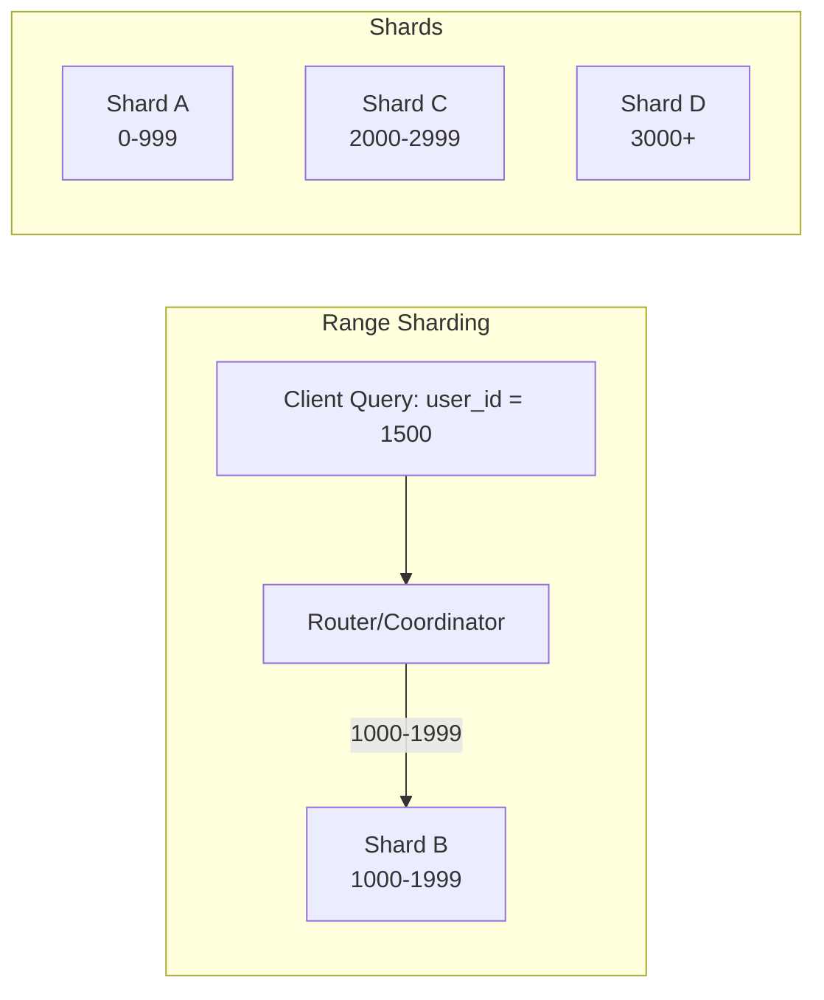
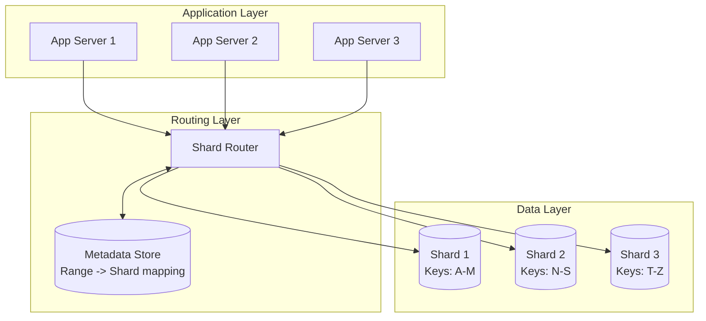
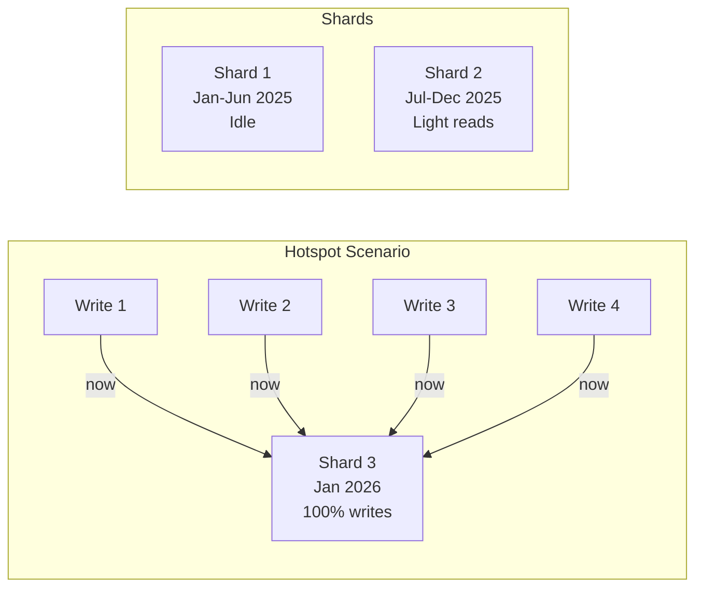
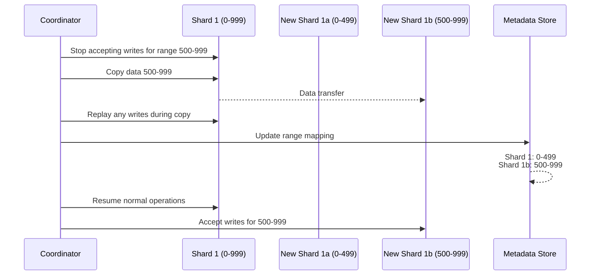

# How to Implement Range Sharding

Author: [nawazdhandala](https://github.com/nawazdhandala)

Tags: Database, Sharding, Scaling, Architecture

Description: A practical guide to implementing range-based sharding, covering shard key selection, data distribution strategies, rebalancing techniques, and how to avoid hotspots in production systems.

---

When your database starts buckling under write pressure or query latency creeps past acceptable thresholds, sharding becomes inevitable. Range sharding is one of the oldest and most intuitive approaches: you split data into contiguous key ranges and assign each range to a dedicated shard. This guide walks through implementation details, pitfalls, and operational practices that keep range-sharded systems running smoothly.

## What Is Range Sharding?

Range sharding partitions data based on a continuous range of values in the shard key. Records with keys between 0 and 999 go to Shard A, 1000 to 1999 go to Shard B, and so on. Unlike hash-based sharding, range sharding preserves data locality. That means range queries (like "get all orders from January 2026") can target a single shard instead of scattering across all nodes.



## Choosing the Right Shard Key

The shard key determines everything. A poor choice leads to hotspots, unbalanced shards, and emergency migrations at 3 AM. Here is how to evaluate candidates:

### Characteristics of a Good Range Shard Key

| Property | Why It Matters |
| --- | --- |
| High cardinality | More distinct values means finer-grained splits |
| Even distribution | Prevents one shard from becoming a bottleneck |
| Query alignment | Common queries should target few shards, not all |
| Immutable or rarely changing | Changing shard keys requires expensive data moves |

### Common Shard Key Examples

**Timestamp-based keys** work well for append-heavy workloads like logs, events, or time-series data. New writes always hit the "current" shard, and historical queries target older shards.

```sql
-- Shard key: created_at (date or epoch)
-- Shard boundaries:
-- Shard 1: 2025-01-01 to 2025-06-30
-- Shard 2: 2025-07-01 to 2025-12-31
-- Shard 3: 2026-01-01 to 2026-06-30

SELECT * FROM events
WHERE created_at BETWEEN '2025-07-15' AND '2025-07-20';
-- Routes to Shard 2 only
```

**Customer ID or tenant ID** fits multi-tenant SaaS applications. Each tenant's data stays together, making cross-tenant isolation straightforward.

```sql
-- Shard key: tenant_id
-- Shard boundaries:
-- Shard 1: tenant_id 1-1000
-- Shard 2: tenant_id 1001-2000
-- Shard 3: tenant_id 2001-3000

SELECT * FROM orders
WHERE tenant_id = 1500 AND status = 'pending';
-- Routes to Shard 2 only
```

**Geographic region codes** work for location-based services. Users in the same region land on the same shard, which can reduce cross-region latency if shards are deployed regionally.

```sql
-- Shard key: region_code
-- Shard boundaries:
-- Shard US: region_code 'US-*'
-- Shard EU: region_code 'EU-*'
-- Shard APAC: region_code 'APAC-*'

SELECT * FROM deliveries
WHERE region_code LIKE 'EU-%' AND delivery_date = '2026-01-30';
-- Routes to Shard EU only
```

## Architecture of a Range-Sharded System

A typical range-sharded deployment has three components:



1. **Metadata store**: Holds the mapping of key ranges to shard addresses. This can be a dedicated service (like ZooKeeper or etcd), a table in a coordination database, or embedded in the router itself.

2. **Router/coordinator**: Receives queries, looks up which shard owns the target range, and forwards the request. Some systems embed routing logic in application drivers (MongoDB, CockroachDB), while others use a dedicated proxy layer.

3. **Shards**: The actual database instances holding partitioned data. Each shard is a complete database that can be scaled independently.

## Implementing Range Routing

Here is a simplified routing implementation in Python:

```python
class RangeRouter:
    def __init__(self):
        # Range boundaries and their shard assignments
        self.ranges = [
            (0, 999, "shard_a"),
            (1000, 1999, "shard_b"),
            (2000, 2999, "shard_c"),
            (3000, float('inf'), "shard_d"),
        ]

        self.connections = {
            "shard_a": create_connection("db1.internal:5432"),
            "shard_b": create_connection("db2.internal:5432"),
            "shard_c": create_connection("db3.internal:5432"),
            "shard_d": create_connection("db4.internal:5432"),
        }

    def get_shard(self, key: int) -> str:
        for low, high, shard in self.ranges:
            if low <= key <= high:
                return shard
        raise ValueError(f"No shard found for key {key}")

    def query(self, key: int, sql: str, params: tuple):
        shard = self.get_shard(key)
        conn = self.connections[shard]
        return conn.execute(sql, params)

    def range_query(self, start_key: int, end_key: int, sql: str):
        """Query across multiple shards for a range scan."""
        target_shards = set()
        for low, high, shard in self.ranges:
            if not (end_key < low or start_key > high):
                target_shards.add(shard)

        results = []
        for shard in target_shards:
            conn = self.connections[shard]
            results.extend(conn.execute(sql))
        return results
```

## Preventing Hotspots

Hotspots occur when one shard receives disproportionate traffic. With range sharding, this happens in predictable ways:

### The Timestamp Problem

If your shard key is a timestamp and all inserts hit "now," your newest shard becomes a write hotspot while older shards sit idle.



**Mitigation strategies:**

1. **Compound shard keys**: Combine timestamp with another field to spread writes. For example, `(user_id % 10, timestamp)` distributes writes across 10 sub-ranges within each time period.

2. **Pre-split ranges**: Create smaller ranges ahead of time so the system can parallelize writes across multiple shards for the same time window.

3. **Buffer and batch**: Accept writes into a staging area and flush to the appropriate shard in batches, reducing per-write coordination overhead.

### The Popular Tenant Problem

In multi-tenant systems, one large customer can overwhelm their assigned shard while others remain quiet.

**Mitigation strategies:**

1. **Dedicated shards for whales**: Move high-traffic tenants to their own shard. This is a manual process but effective for known large accounts.

2. **Sub-sharding**: Split a single tenant's data across multiple shards using a secondary key (like `order_id % 4`).

3. **Rate limiting at the application layer**: Protect shard health by throttling excessive requests before they hit the database.

## Rebalancing and Shard Splits

As data grows, you need to split overloaded shards. This is the hardest operational challenge with range sharding.

### The Split Process



### Practical Split Strategies

**Online splits with double-writes**: During the transition, write to both old and new shards. Once the new shard catches up, flip reads and stop writing to the old location. This minimizes downtime but requires careful coordination.

```python
class SplitAwarRouter:
    def __init__(self):
        self.splitting = {}  # range -> (old_shard, new_shard)

    def write(self, key: int, data: dict):
        if key in self.splitting:
            old_shard, new_shard = self.splitting[key]
            # Double-write during split
            old_shard.write(key, data)
            new_shard.write(key, data)
        else:
            shard = self.get_shard(key)
            shard.write(key, data)
```

**Scheduled maintenance windows**: For less critical systems, pause writes for the affected range, copy data, update metadata, and resume. Keep windows short by pre-copying most data and only syncing deltas during the pause.

**Chunk-based migration**: Copy data in small chunks while the system runs. Track progress with a high-water mark. This spreads the load but takes longer to complete.

## Monitoring a Range-Sharded System

You need visibility into shard health to catch problems before users notice:

| Metric | Why It Matters | Alert Threshold |
| --- | --- | --- |
| Records per shard | Detects uneven distribution | > 30% variance from mean |
| QPS per shard | Identifies traffic hotspots | > 2x average for 5 minutes |
| Disk usage per shard | Warns of capacity issues | > 80% capacity |
| Replication lag | Ensures read replicas are current | > 10 seconds |
| Query latency P99 | Catches degraded shard performance | > 2x baseline |

Set up dashboards that show all shards side by side. A single slow shard degrades the entire system for queries that touch its range.

## When Range Sharding Is Not the Answer

Range sharding has clear drawbacks. Consider alternatives when:

- **Access patterns are random**: If queries rarely use range scans, hash sharding gives more even distribution with less operational complexity.

- **Keys are unpredictable**: Auto-increment IDs or UUIDs do not align with business queries. You end up with awkward routing logic.

- **You need global indexes**: Range sharding makes cross-shard queries expensive. If most queries need data from all shards, a different architecture (or a database with native distribution) may serve better.

- **Team lacks operational capacity**: Rebalancing, splits, and failure recovery require expertise. If you cannot dedicate resources to shard management, consider managed distributed databases like CockroachDB, TiDB, or cloud-native options.

## A Practical Checklist

Before going live with range sharding:

1. **Validate the shard key** against your top 10 queries. Each should touch three or fewer shards.

2. **Simulate growth patterns**. If you expect 10x data in two years, plan shard boundaries that accommodate splits.

3. **Build routing resilience**. Cache shard mappings locally but invalidate on split events. Handle stale routes gracefully.

4. **Automate backups per shard**. A shard failure should not block restoring others.

5. **Practice failure recovery**. Kill a shard in staging and measure how long it takes to restore service. Bring that number into your SLO.

6. **Instrument everything**. Push shard-level metrics to your observability platform. You cannot manage what you cannot see.

---

Range sharding works well when your data has natural ordering and your queries align with that order. The implementation is straightforward, but the operational burden is real. Start with clear shard key criteria, plan for growth with split-friendly boundaries, and invest in monitoring before you need it. The goal is not just to distribute data but to keep the system predictable as it scales.
