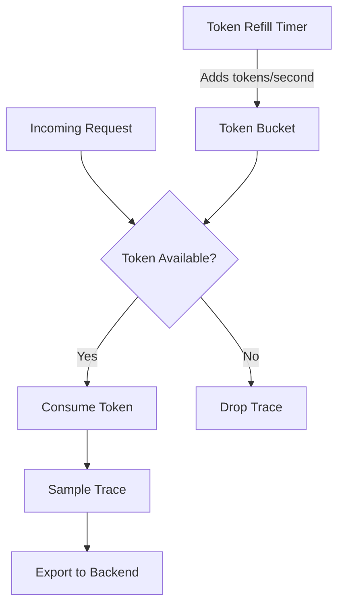
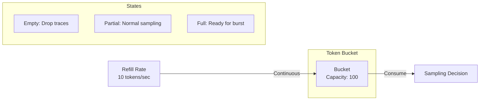
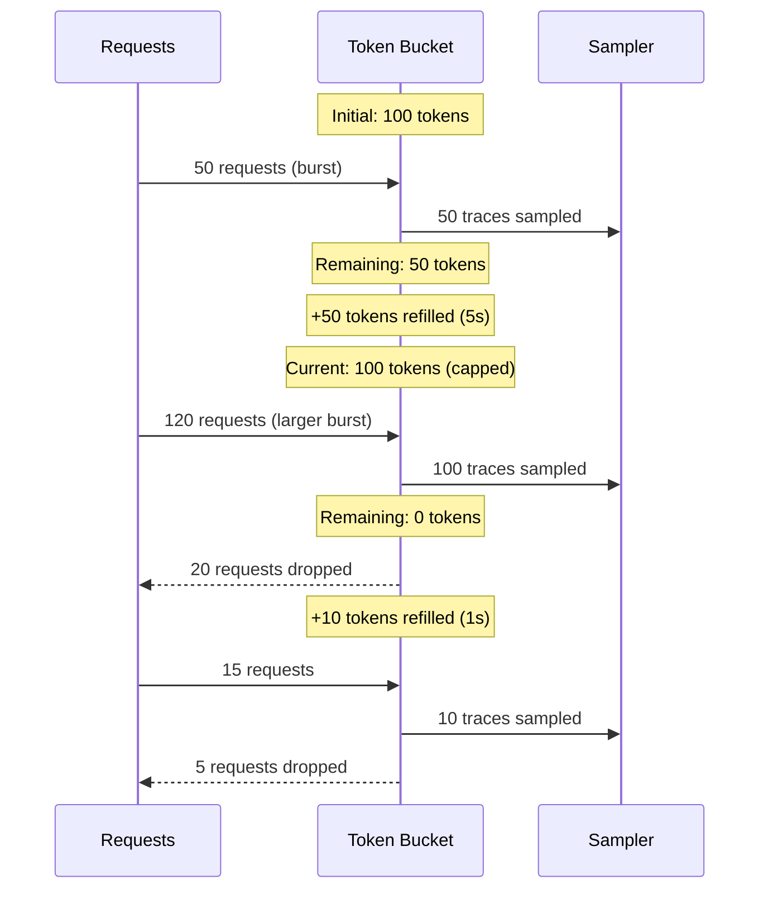
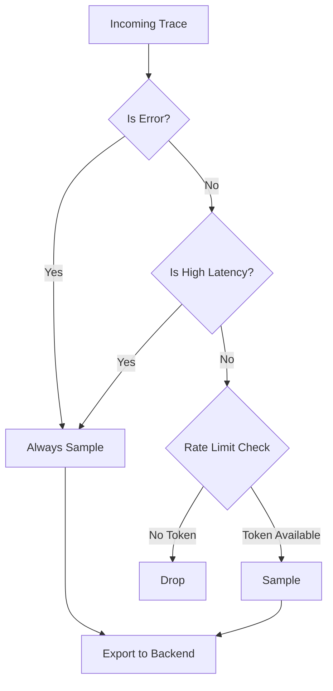

# How to Implement Rate Limiting Sampling

Author: [nawazdhandala](https://github.com/nawazdhandala)

Tags: Observability, Tracing, OpenTelemetry, Sampling

Description: Learn how to implement rate-limited sampling to control trace volume while maintaining visibility.

---

> When your system processes millions of requests per second, keeping every trace becomes impossible. Rate limiting sampling gives you **bounded overhead** while preserving **representative visibility**.

Probabilistic sampling drops traces randomly, which works until traffic spikes and your observability bill explodes. Rate limiting sampling caps the number of traces per second, giving you predictable costs and consistent behavior regardless of load.

This guide covers:

1. Why rate limiting sampling matters
2. Tokens per second mechanics
3. Burst handling with token buckets
4. OpenTelemetry rate limiting sampler configuration
5. Production patterns and tuning

---

## Why Rate Limiting Sampling?

| Sampling Strategy | Behavior Under Load | Cost Predictability | Representativeness |
|-------------------|---------------------|---------------------|-------------------|
| Always On (100%) | Scales with traffic | Unpredictable | Perfect |
| Probabilistic (10%) | Scales with traffic | Semi-predictable | Statistical |
| Rate Limited (100/s) | Capped | Predictable | Bounded |

Rate limiting is ideal when:

- You need **cost control** regardless of traffic patterns
- Your backend has **ingestion limits**
- You want **consistent sampling** across services
- Traffic is **bursty** and probabilistic sampling would over-sample during spikes

---

## How Rate Limiting Sampling Works



The core mechanism is a **token bucket algorithm**:

1. A bucket holds tokens up to a maximum capacity (burst limit)
2. Tokens are added at a fixed rate (tokens per second)
3. Each sampled trace consumes one token
4. When the bucket is empty, traces are dropped until tokens refill

---

## Tokens Per Second: The Foundation

The tokens per second (TPS) rate determines your baseline sampling throughput. This is the sustained rate at which traces will be kept.

### Calculating Your TPS

Consider these factors:

```
TPS = (Monthly Budget / Cost Per Trace) / Seconds Per Month
```

Example calculation:

```
Monthly budget: $500
Cost per trace: $0.0001 (typical for managed backends)
Seconds per month: 2,592,000

TPS = ($500 / $0.0001) / 2,592,000
TPS = 5,000,000 / 2,592,000
TPS = ~1.9 traces/second
```

For a more practical approach, consider:

```
TPS = Target Traces Per Day / 86,400
```

If you want 1 million traces per day:

```
TPS = 1,000,000 / 86,400 = ~11.6 traces/second
```

### TPS Guidelines by Service Type

| Service Type | Suggested TPS | Rationale |
|--------------|---------------|-----------|
| API Gateway | 50-100 | High traffic entry point |
| Core Business Service | 20-50 | Critical path visibility |
| Background Worker | 5-10 | Lower priority, batch work |
| Internal Utility | 1-5 | Minimal observability needs |

---

## Burst Handling: Token Bucket Deep Dive

The token bucket allows temporary bursts above the sustained rate, which is critical for capturing traffic spikes.



### Token Bucket Parameters

| Parameter | Description | Impact |
|-----------|-------------|--------|
| `tokens_per_second` | Refill rate | Sustained sampling rate |
| `burst` | Maximum bucket capacity | Peak sampling capacity |

### Burst Behavior Example

With `tokens_per_second: 10` and `burst: 100`:

```
Time 0s:   Bucket has 100 tokens (full)
Time 0-5s: Burst of 50 requests, all sampled (50 tokens consumed)
Time 5s:   Bucket has 50 + 50 refilled = 100 tokens (capped at max)
Time 5-6s: Burst of 120 requests
           - First 100 sampled (bucket empties)
           - Next 20 dropped
Time 6-7s: 10 tokens refilled, 10 more traces sampled
```



### Choosing Burst Size

```
Recommended burst = tokens_per_second * expected_spike_duration_seconds
```

If your traffic typically spikes for 30 seconds:

```
burst = 10 * 30 = 300 tokens
```

---

## OpenTelemetry Rate Limiting Sampler Configuration

### Using the Built-in Rate Limiting Sampler

OpenTelemetry provides a rate limiting sampler in the `@opentelemetry/sdk-trace-base` package.

```typescript
// telemetry.ts
import { NodeSDK } from '@opentelemetry/sdk-node';
import {
    ParentBasedSampler,
    TraceIdRatioBasedSampler
} from '@opentelemetry/sdk-trace-base';
import { RateLimitingSampler } from '@opentelemetry/sdk-trace-base';
import { OTLPTraceExporter } from '@opentelemetry/exporter-trace-otlp-http';
import { Resource } from '@opentelemetry/resources';
import { SemanticResourceAttributes } from '@opentelemetry/semantic-conventions';

// Rate limiting sampler: 100 traces per second with burst of 500
const rateLimitingSampler = new RateLimitingSampler(100, 500);

// Wrap with ParentBasedSampler to respect parent decisions
const sampler = new ParentBasedSampler({
    root: rateLimitingSampler,
    // Remote parent sampled: follow parent decision
    remoteParentSampled: new TraceIdRatioBasedSampler(1.0),
    // Remote parent not sampled: respect that decision
    remoteParentNotSampled: new TraceIdRatioBasedSampler(0),
});

const sdk = new NodeSDK({
    resource: new Resource({
        [SemanticResourceAttributes.SERVICE_NAME]: 'my-service',
        [SemanticResourceAttributes.DEPLOYMENT_ENVIRONMENT]: 'production',
    }),
    sampler,
    traceExporter: new OTLPTraceExporter({
        url: process.env.OTEL_EXPORTER_OTLP_ENDPOINT || 'https://oneuptime.com/otlp/v1/traces',
        headers: {
            'x-oneuptime-token': process.env.ONEUPTIME_TOKEN || '',
        },
    }),
});

sdk.start();
```

### Custom Rate Limiting Sampler Implementation

For more control, implement a custom sampler using the token bucket algorithm:

```typescript
// rate-limiting-sampler.ts
import {
    Sampler,
    SamplingDecision,
    SamplingResult,
    Context,
    SpanKind,
    Attributes,
    Link,
} from '@opentelemetry/api';

/**
 * Token bucket based rate limiting sampler.
 *
 * This sampler maintains a token bucket that refills at a constant rate.
 * Each trace that gets sampled consumes one token. When tokens are
 * exhausted, traces are dropped until the bucket refills.
 */
export class TokenBucketRateLimitingSampler implements Sampler {
    private tokens: number;
    private lastRefillTime: number;
    private readonly tokensPerSecond: number;
    private readonly maxTokens: number;

    /**
     * Creates a new rate limiting sampler.
     *
     * @param tokensPerSecond - The rate at which tokens are added (sustained rate)
     * @param maxTokens - Maximum tokens in the bucket (burst capacity)
     */
    constructor(tokensPerSecond: number, maxTokens?: number) {
        this.tokensPerSecond = tokensPerSecond;
        // Default burst to 1 second worth of tokens if not specified
        this.maxTokens = maxTokens ?? tokensPerSecond;
        this.tokens = this.maxTokens; // Start with full bucket
        this.lastRefillTime = Date.now();
    }

    shouldSample(
        context: Context,
        traceId: string,
        spanName: string,
        spanKind: SpanKind,
        attributes: Attributes,
        links: Link[]
    ): SamplingResult {
        // Refill tokens based on elapsed time
        this.refillTokens();

        // Check if we have tokens available
        if (this.tokens >= 1) {
            this.tokens -= 1;
            return {
                decision: SamplingDecision.RECORD_AND_SAMPLED,
                attributes: {
                    'sampling.rate_limited': false,
                    'sampling.tokens_remaining': Math.floor(this.tokens),
                },
            };
        }

        // No tokens available, drop the trace
        return {
            decision: SamplingDecision.NOT_RECORD,
            attributes: {
                'sampling.rate_limited': true,
            },
        };
    }

    /**
     * Refills tokens based on time elapsed since last refill.
     * Uses wall clock time for accurate rate limiting.
     */
    private refillTokens(): void {
        const now = Date.now();
        const elapsedSeconds = (now - this.lastRefillTime) / 1000;

        // Calculate tokens to add based on elapsed time
        const tokensToAdd = elapsedSeconds * this.tokensPerSecond;

        // Add tokens, capped at max capacity
        this.tokens = Math.min(this.maxTokens, this.tokens + tokensToAdd);
        this.lastRefillTime = now;
    }

    toString(): string {
        return `TokenBucketRateLimitingSampler{rate=${this.tokensPerSecond}/s, burst=${this.maxTokens}}`;
    }
}
```

### Using the Custom Sampler

```typescript
// telemetry.ts
import { NodeSDK } from '@opentelemetry/sdk-node';
import { ParentBasedSampler } from '@opentelemetry/sdk-trace-base';
import { TokenBucketRateLimitingSampler } from './rate-limiting-sampler';

// 50 traces per second sustained, 200 burst capacity
const rateLimiter = new TokenBucketRateLimitingSampler(50, 200);

const sdk = new NodeSDK({
    sampler: new ParentBasedSampler({
        root: rateLimiter,
    }),
    // ... other configuration
});

sdk.start();
```

---

## Combining Rate Limiting with Other Samplers

Real-world scenarios often need multiple sampling strategies. Here is how to combine them:



### Composite Sampler Implementation

```typescript
// composite-sampler.ts
import {
    Sampler,
    SamplingDecision,
    SamplingResult,
    Context,
    SpanKind,
    Attributes,
    Link,
} from '@opentelemetry/api';
import { TokenBucketRateLimitingSampler } from './rate-limiting-sampler';

/**
 * Composite sampler that combines priority sampling with rate limiting.
 *
 * Priority traces (errors, high latency) always get sampled.
 * Normal traces go through rate limiting.
 */
export class PriorityRateLimitingSampler implements Sampler {
    private readonly rateLimiter: TokenBucketRateLimitingSampler;
    private readonly priorityAttributes: Set<string>;

    constructor(
        tokensPerSecond: number,
        maxTokens: number,
        priorityAttributes: string[] = ['error', 'high_latency']
    ) {
        this.rateLimiter = new TokenBucketRateLimitingSampler(
            tokensPerSecond,
            maxTokens
        );
        this.priorityAttributes = new Set(priorityAttributes);
    }

    shouldSample(
        context: Context,
        traceId: string,
        spanName: string,
        spanKind: SpanKind,
        attributes: Attributes,
        links: Link[]
    ): SamplingResult {
        // Check for priority attributes that bypass rate limiting
        for (const key of this.priorityAttributes) {
            if (attributes[key] === true) {
                return {
                    decision: SamplingDecision.RECORD_AND_SAMPLED,
                    attributes: {
                        'sampling.priority': true,
                        'sampling.reason': key,
                    },
                };
            }
        }

        // Fall through to rate limiting for normal traces
        return this.rateLimiter.shouldSample(
            context,
            traceId,
            spanName,
            spanKind,
            attributes,
            links
        );
    }

    toString(): string {
        return `PriorityRateLimitingSampler{rateLimiter=${this.rateLimiter}}`;
    }
}
```

---

## OpenTelemetry Collector Rate Limiting

For centralized control, configure rate limiting in the OpenTelemetry Collector:

```yaml
# otel-collector-config.yaml
receivers:
  otlp:
    protocols:
      grpc:
        endpoint: 0.0.0.0:4317
      http:
        endpoint: 0.0.0.0:4318

processors:
  # Memory limiter prevents OOM
  memory_limiter:
    check_interval: 1s
    limit_mib: 512
    spike_limit_mib: 128

  # Batch for efficiency
  batch:
    send_batch_size: 512
    timeout: 5s

  # Probabilistic sampling as a secondary filter
  probabilistic_sampler:
    sampling_percentage: 100

  # Rate limiting via the filter processor
  filter/rate_limit:
    error_mode: ignore
    traces:
      span:
        # Drop health checks
        - 'attributes["http.target"] == "/healthz"'
        - 'attributes["http.target"] == "/readyz"'

exporters:
  otlphttp:
    endpoint: "https://oneuptime.com/otlp"
    encoding: json
    headers:
      "Content-Type": "application/json"
      "x-oneuptime-token": "${ONEUPTIME_TOKEN}"

    # Rate limiting via sending queue
    sending_queue:
      enabled: true
      num_consumers: 10
      queue_size: 5000

    # Retry with backoff
    retry_on_failure:
      enabled: true
      initial_interval: 5s
      max_interval: 30s
      max_elapsed_time: 300s

service:
  pipelines:
    traces:
      receivers: [otlp]
      processors: [memory_limiter, batch, filter/rate_limit]
      exporters: [otlphttp]
```

### Collector-Level Rate Limiting with Tail Sampling

For more sophisticated rate control, use tail sampling with rate limiting policies:

```yaml
processors:
  tail_sampling:
    decision_wait: 10s
    num_traces: 100000
    expected_new_traces_per_sec: 1000
    policies:
      # Always keep errors
      - name: errors-policy
        type: status_code
        status_code:
          status_codes: [ERROR]

      # Always keep slow traces
      - name: latency-policy
        type: latency
        latency:
          threshold_ms: 1000

      # Rate limit everything else
      - name: rate-limited-policy
        type: rate_limiting
        rate_limiting:
          spans_per_second: 100
```

---

## Production Patterns

### Pattern 1: Tiered Rate Limiting

Different services get different rate limits based on importance:

```typescript
// tiered-sampler.ts
import { TokenBucketRateLimitingSampler } from './rate-limiting-sampler';

// Service tier configuration
const samplerConfig: Record<string, { tps: number; burst: number }> = {
    'api-gateway': { tps: 100, burst: 500 },
    'payment-service': { tps: 50, burst: 200 },
    'user-service': { tps: 30, burst: 100 },
    'notification-service': { tps: 10, burst: 50 },
    'default': { tps: 20, burst: 100 },
};

export function createSamplerForService(serviceName: string) {
    const config = samplerConfig[serviceName] || samplerConfig['default'];
    return new TokenBucketRateLimitingSampler(config.tps, config.burst);
}
```

### Pattern 2: Adaptive Rate Limiting

Adjust rates based on system load:

```typescript
// adaptive-sampler.ts
import {
    Sampler,
    SamplingDecision,
    SamplingResult,
    Context,
    SpanKind,
    Attributes,
    Link,
} from '@opentelemetry/api';

/**
 * Adaptive rate limiting sampler that adjusts based on system metrics.
 *
 * When the system is under load (high CPU, memory pressure), sampling
 * rate is reduced to minimize overhead. During normal operation,
 * sampling returns to baseline.
 */
export class AdaptiveRateLimitingSampler implements Sampler {
    private baseTokensPerSecond: number;
    private currentTokensPerSecond: number;
    private tokens: number;
    private lastRefillTime: number;
    private readonly maxTokens: number;

    constructor(baseTokensPerSecond: number, maxTokens: number) {
        this.baseTokensPerSecond = baseTokensPerSecond;
        this.currentTokensPerSecond = baseTokensPerSecond;
        this.maxTokens = maxTokens;
        this.tokens = maxTokens;
        this.lastRefillTime = Date.now();

        // Periodically check system metrics and adjust rate
        this.startAdaptiveLoop();
    }

    private startAdaptiveLoop(): void {
        setInterval(() => {
            const cpuUsage = this.getCpuUsage();

            // Reduce sampling when CPU is high
            if (cpuUsage > 0.8) {
                this.currentTokensPerSecond = this.baseTokensPerSecond * 0.25;
            } else if (cpuUsage > 0.6) {
                this.currentTokensPerSecond = this.baseTokensPerSecond * 0.5;
            } else {
                this.currentTokensPerSecond = this.baseTokensPerSecond;
            }
        }, 5000); // Check every 5 seconds
    }

    private getCpuUsage(): number {
        // Simplified CPU check - in production use os.loadavg() or similar
        const load = require('os').loadavg()[0];
        const cpus = require('os').cpus().length;
        return load / cpus;
    }

    shouldSample(
        context: Context,
        traceId: string,
        spanName: string,
        spanKind: SpanKind,
        attributes: Attributes,
        links: Link[]
    ): SamplingResult {
        this.refillTokens();

        if (this.tokens >= 1) {
            this.tokens -= 1;
            return {
                decision: SamplingDecision.RECORD_AND_SAMPLED,
                attributes: {
                    'sampling.adaptive_rate': this.currentTokensPerSecond,
                },
            };
        }

        return { decision: SamplingDecision.NOT_RECORD };
    }

    private refillTokens(): void {
        const now = Date.now();
        const elapsedSeconds = (now - this.lastRefillTime) / 1000;
        const tokensToAdd = elapsedSeconds * this.currentTokensPerSecond;
        this.tokens = Math.min(this.maxTokens, this.tokens + tokensToAdd);
        this.lastRefillTime = now;
    }

    toString(): string {
        return `AdaptiveRateLimitingSampler{base=${this.baseTokensPerSecond}, current=${this.currentTokensPerSecond}}`;
    }
}
```

### Pattern 3: Per-Endpoint Rate Limiting

Different endpoints get different sampling rates:

```typescript
// endpoint-sampler.ts
import {
    Sampler,
    SamplingDecision,
    SamplingResult,
    Context,
    SpanKind,
    Attributes,
    Link,
} from '@opentelemetry/api';
import { TokenBucketRateLimitingSampler } from './rate-limiting-sampler';

/**
 * Per-endpoint rate limiting sampler.
 *
 * Maintains separate token buckets for different endpoints,
 * allowing fine-grained control over which routes get sampled.
 */
export class PerEndpointRateLimitingSampler implements Sampler {
    private readonly endpointSamplers: Map<string, TokenBucketRateLimitingSampler>;
    private readonly defaultSampler: TokenBucketRateLimitingSampler;

    constructor(
        endpointRates: Record<string, { tps: number; burst: number }>,
        defaultTps: number = 10,
        defaultBurst: number = 50
    ) {
        this.endpointSamplers = new Map();

        // Create sampler for each configured endpoint
        for (const [endpoint, config] of Object.entries(endpointRates)) {
            this.endpointSamplers.set(
                endpoint,
                new TokenBucketRateLimitingSampler(config.tps, config.burst)
            );
        }

        this.defaultSampler = new TokenBucketRateLimitingSampler(
            defaultTps,
            defaultBurst
        );
    }

    shouldSample(
        context: Context,
        traceId: string,
        spanName: string,
        spanKind: SpanKind,
        attributes: Attributes,
        links: Link[]
    ): SamplingResult {
        // Extract endpoint from attributes
        const endpoint = (attributes['http.route'] ||
                         attributes['http.target'] ||
                         'unknown') as string;

        // Get the appropriate sampler
        const sampler = this.endpointSamplers.get(endpoint) || this.defaultSampler;

        return sampler.shouldSample(
            context,
            traceId,
            spanName,
            spanKind,
            attributes,
            links
        );
    }

    toString(): string {
        return `PerEndpointRateLimitingSampler{endpoints=${this.endpointSamplers.size}}`;
    }
}

// Usage
const sampler = new PerEndpointRateLimitingSampler({
    '/api/checkout': { tps: 100, burst: 500 },   // High priority
    '/api/health': { tps: 1, burst: 5 },          // Low priority
    '/api/users': { tps: 50, burst: 200 },        // Medium priority
});
```

---

## Monitoring Your Sampling

Track these metrics to ensure your rate limiting is working correctly:

```typescript
// sampling-metrics.ts
import { metrics } from '@opentelemetry/api';

const meter = metrics.getMeter('sampling-metrics');

// Counter for sampled traces
const sampledCounter = meter.createCounter('traces.sampled', {
    description: 'Number of traces that were sampled',
});

// Counter for dropped traces
const droppedCounter = meter.createCounter('traces.dropped', {
    description: 'Number of traces dropped due to rate limiting',
});

// Gauge for current token count
const tokenGauge = meter.createObservableGauge('sampling.tokens', {
    description: 'Current tokens in the rate limiter bucket',
});

// Histogram for sampling decision latency
const decisionLatency = meter.createHistogram('sampling.decision_latency_ms', {
    description: 'Time taken to make sampling decision',
});
```

### Dashboard Queries

Monitor these key metrics:

| Metric | Query | Alert Threshold |
|--------|-------|-----------------|
| Sample Rate | `rate(traces.sampled[5m])` | Below expected TPS |
| Drop Rate | `rate(traces.dropped[5m])` | Sustained high drops |
| Token Utilization | `sampling.tokens / max_tokens` | Consistently near 0 |
| Effective Sample % | `sampled / (sampled + dropped) * 100` | Below 50% for extended periods |

---

## Common Pitfalls and Solutions

### Pitfall 1: Burst Too Small

**Symptom**: Frequent drops during normal traffic variations.

**Solution**: Increase burst to handle typical traffic variance.

```typescript
// Too aggressive
const sampler = new TokenBucketRateLimitingSampler(10, 10);

// Better: allow 30 second burst
const sampler = new TokenBucketRateLimitingSampler(10, 300);
```

### Pitfall 2: Not Respecting Parent Decisions

**Symptom**: Incomplete traces with missing spans.

**Solution**: Always wrap with ParentBasedSampler.

```typescript
// Wrong: ignores parent context
const sampler = new TokenBucketRateLimitingSampler(100, 500);

// Correct: respects distributed trace context
const sampler = new ParentBasedSampler({
    root: new TokenBucketRateLimitingSampler(100, 500),
});
```

### Pitfall 3: Clock Skew in Distributed Systems

**Symptom**: Inconsistent sampling across services.

**Solution**: Use monotonic time sources and consistent configuration.

```typescript
// Use performance.now() for elapsed time calculations
private refillTokens(): void {
    const now = performance.now();
    const elapsedSeconds = (now - this.lastRefillTime) / 1000;
    // ... rest of implementation
}
```

---

## Summary

Rate limiting sampling provides:

- **Predictable costs**: Fixed trace volume regardless of traffic
- **Burst handling**: Token bucket absorbs traffic spikes
- **Consistent behavior**: Same sampling rate under all conditions
- **Composability**: Combine with priority and tail sampling

Key configuration decisions:

| Parameter | Guideline |
|-----------|-----------|
| `tokens_per_second` | Budget / cost per trace / time period |
| `burst` | TPS * expected spike duration |
| Priority bypass | Always sample errors and slow traces |
| Parent respect | Use ParentBasedSampler wrapper |

Start with conservative rates and adjust based on actual usage patterns. Monitor your sampling metrics to ensure you are capturing representative traces without breaking the bank.

---

**Related Reading:**

- [How to reduce noise in OpenTelemetry](https://oneuptime.com/blog/post/2025-08-25-how-to-reduce-noise-in-opentelemetry/view)
- [What are Traces and Spans in OpenTelemetry](https://oneuptime.com/blog/post/2025-08-27-traces-and-spans-in-opentelemetry/view)
- [What is OpenTelemetry Collector and Why Use One](https://oneuptime.com/blog/post/2025-09-18-what-is-opentelemetry-collector-and-why-use-one/view)
