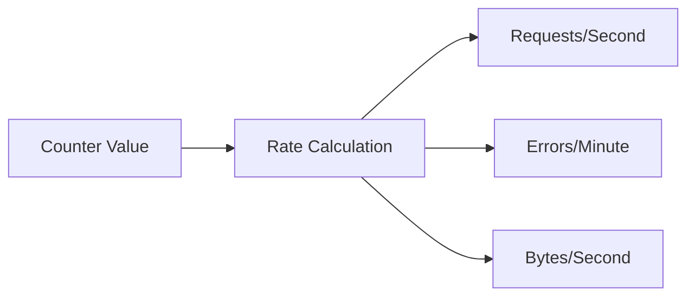
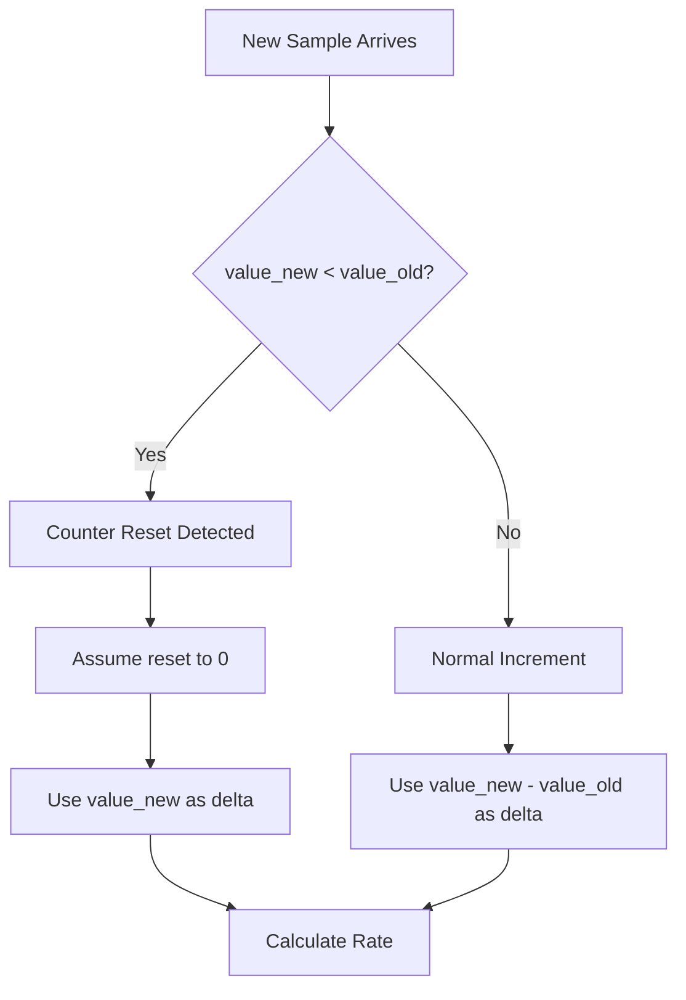
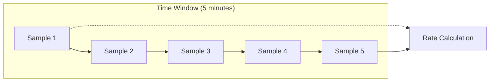
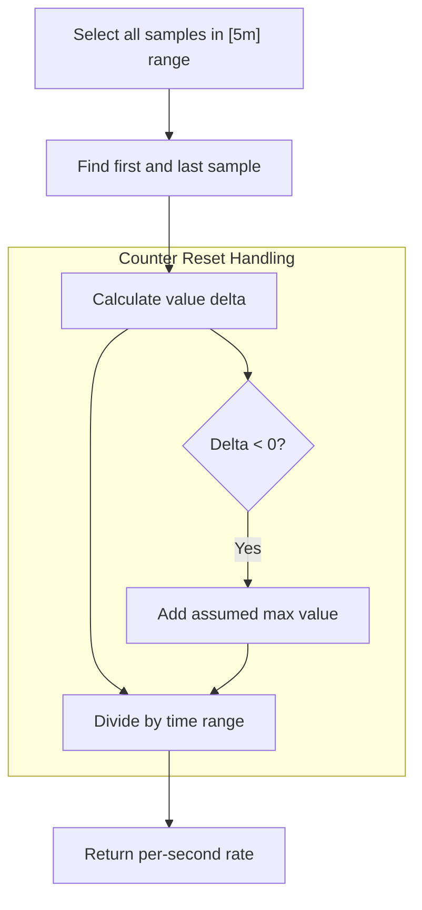
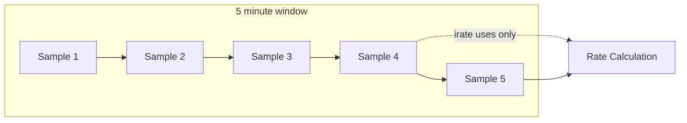
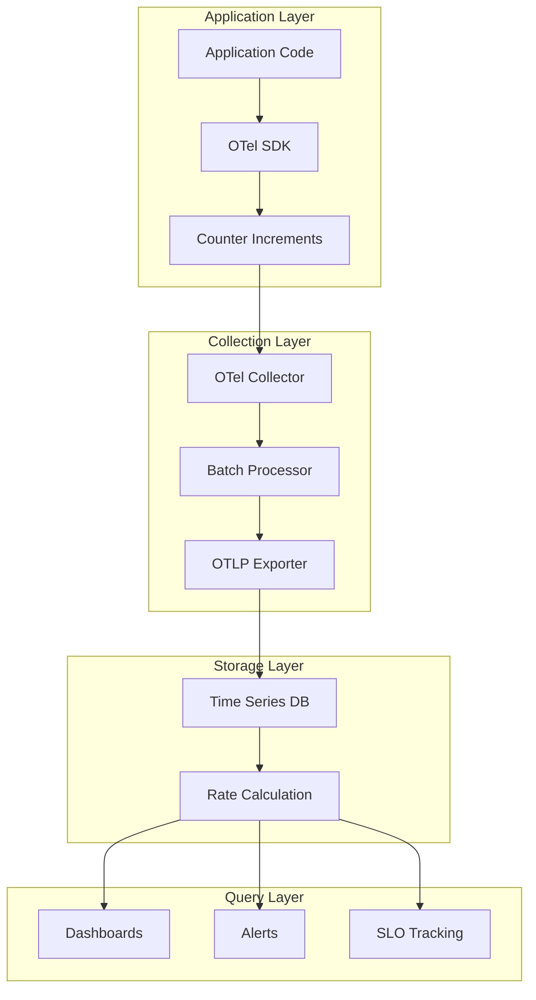
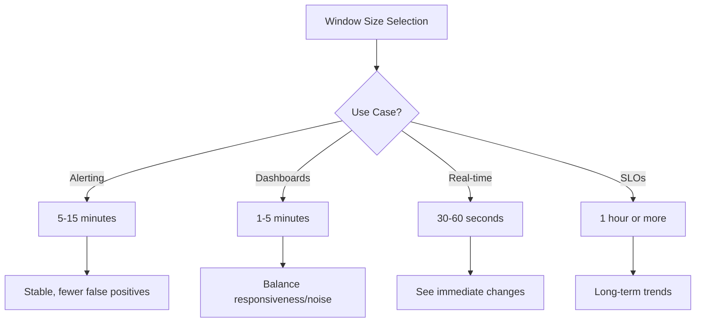

# How to Implement Rate Metrics

Author: [nawazdhandala](https://github.com/nawazdhandala)

Tags: Observability, Metrics, Monitoring, SRE

Description: Learn how to implement rate metrics for measuring throughput, requests per second, and change velocities in your monitoring systems.

---

Rate metrics are the heartbeat of any monitoring system. They answer questions like "How many requests per second are we handling?" and "How fast is this counter growing?" Without rate calculations, raw counters are just numbers going up. With rates, you get actionable velocity data.

This guide covers the fundamentals of rate metric implementation, from basic calculations to production-ready patterns using Prometheus and OpenTelemetry.

---

## What Are Rate Metrics?

A rate metric measures the change in a value over time. Instead of knowing "we have processed 1,000,000 requests," you know "we are processing 500 requests per second."



Common rate metric use cases:

| Metric Type | Example | Unit |
|-------------|---------|------|
| Request throughput | HTTP requests per second | req/s |
| Error velocity | Errors per minute | err/min |
| Data transfer | Bytes per second | B/s |
| Queue processing | Messages per second | msg/s |
| Resource consumption | CPU cycles per second | cycles/s |

---

## The Mathematics of Rate Calculation

### Basic Rate Formula

The simplest rate calculation uses two data points:

```
rate = (value_end - value_start) / (time_end - time_start)
```

```python
# Basic rate calculation function
# Takes two counter samples and returns the rate per second

def calculate_rate(
    value_start: float,
    value_end: float,
    time_start: float,  # Unix timestamp in seconds
    time_end: float     # Unix timestamp in seconds
) -> float:
    """
    Calculate the rate of change between two counter values.

    Args:
        value_start: Counter value at the start of the interval
        value_end: Counter value at the end of the interval
        time_start: Start timestamp (Unix seconds)
        time_end: End timestamp (Unix seconds)

    Returns:
        Rate per second as a float
    """
    # Prevent division by zero
    time_delta = time_end - time_start
    if time_delta <= 0:
        return 0.0

    # Calculate the value change
    value_delta = value_end - value_start

    # Handle counter resets (value went down)
    # This happens when a service restarts
    if value_delta < 0:
        # Assume counter reset to zero, then climbed to value_end
        value_delta = value_end

    return value_delta / time_delta
```

### Handling Counter Resets

Counters can reset when services restart. A robust rate calculation must detect and handle this:



```python
# Counter reset handling with tracking
# Maintains state across multiple samples

class CounterRateCalculator:
    """
    Calculates rates from monotonic counters with reset detection.

    Counters are expected to only increase. When a decrease is
    detected, we assume the counter was reset (service restart)
    and handle it gracefully.
    """

    def __init__(self):
        self.last_value: float = None
        self.last_timestamp: float = None
        self.total_resets: int = 0

    def add_sample(self, value: float, timestamp: float) -> float:
        """
        Add a new counter sample and return the calculated rate.

        Args:
            value: Current counter value
            timestamp: Current Unix timestamp

        Returns:
            Rate per second, or 0.0 if this is the first sample
        """
        # First sample - no rate yet
        if self.last_value is None:
            self.last_value = value
            self.last_timestamp = timestamp
            return 0.0

        # Calculate time delta
        time_delta = timestamp - self.last_timestamp
        if time_delta <= 0:
            return 0.0

        # Detect counter reset
        if value < self.last_value:
            # Counter reset detected
            self.total_resets += 1
            # Assume it reset to 0 and climbed to current value
            value_delta = value
        else:
            # Normal increment
            value_delta = value - self.last_value

        # Update state
        self.last_value = value
        self.last_timestamp = timestamp

        # Return rate per second
        return value_delta / time_delta
```

---

## Rolling Window Rate Calculations

Production systems rarely use two-point calculations. Instead, they use rolling windows that smooth out noise and provide more stable rates.

### Sliding Window Algorithm



```python
# Rolling window rate calculator
# Uses a fixed-size window of samples for stability

from collections import deque
from dataclasses import dataclass
from typing import Deque, Optional
import time


@dataclass
class Sample:
    """A single counter sample with timestamp."""
    value: float
    timestamp: float


class RollingWindowRateCalculator:
    """
    Calculates rates using a rolling time window.

    This approach smooths out temporary spikes and provides
    more stable rate calculations suitable for alerting.

    The window_seconds parameter controls the lookback period.
    Longer windows = smoother rates but slower to react.
    Shorter windows = responsive but noisier rates.
    """

    def __init__(self, window_seconds: float = 300.0):
        """
        Initialize the calculator.

        Args:
            window_seconds: Size of the rolling window (default 5 minutes)
        """
        self.window_seconds = window_seconds
        self.samples: Deque[Sample] = deque()

    def add_sample(self, value: float, timestamp: float = None) -> None:
        """
        Add a new sample to the window.

        Args:
            value: Current counter value
            timestamp: Unix timestamp (defaults to current time)
        """
        if timestamp is None:
            timestamp = time.time()

        # Add new sample
        self.samples.append(Sample(value=value, timestamp=timestamp))

        # Remove samples outside the window
        cutoff = timestamp - self.window_seconds
        while self.samples and self.samples[0].timestamp < cutoff:
            self.samples.popleft()

    def get_rate(self) -> Optional[float]:
        """
        Calculate the current rate over the window.

        Returns:
            Rate per second, or None if insufficient samples
        """
        if len(self.samples) < 2:
            return None

        # Use first and last samples in window
        first = self.samples[0]
        last = self.samples[-1]

        time_delta = last.timestamp - first.timestamp
        if time_delta <= 0:
            return None

        value_delta = last.value - first.value

        # Handle counter reset within window
        if value_delta < 0:
            # Simple handling: use last value as approximation
            # More sophisticated: track resets and sum segments
            value_delta = last.value

        return value_delta / time_delta
```

### Exponential Moving Average (EMA) Rates

For scenarios where recent data should have more weight:

```python
# Exponential Moving Average rate calculator
# Gives more weight to recent samples

class EMARate:
    """
    Calculates rates using Exponential Moving Average.

    EMA gives more weight to recent samples, making it
    responsive to changes while still smoothing noise.

    The alpha parameter controls responsiveness:
    - Higher alpha (0.5-0.9): More responsive, less smooth
    - Lower alpha (0.1-0.3): Less responsive, more smooth
    """

    def __init__(self, alpha: float = 0.3):
        """
        Initialize EMA calculator.

        Args:
            alpha: Smoothing factor between 0 and 1
        """
        self.alpha = alpha
        self.ema_rate: float = None
        self.last_value: float = None
        self.last_timestamp: float = None

    def add_sample(self, value: float, timestamp: float) -> Optional[float]:
        """
        Add sample and return current EMA rate.

        Args:
            value: Current counter value
            timestamp: Unix timestamp

        Returns:
            EMA rate per second, or None if first sample
        """
        if self.last_value is None:
            self.last_value = value
            self.last_timestamp = timestamp
            return None

        # Calculate instantaneous rate
        time_delta = timestamp - self.last_timestamp
        if time_delta <= 0:
            return self.ema_rate

        value_delta = value - self.last_value
        if value_delta < 0:
            value_delta = value  # Counter reset

        instant_rate = value_delta / time_delta

        # Update EMA
        if self.ema_rate is None:
            self.ema_rate = instant_rate
        else:
            # EMA formula: new_ema = alpha * new_value + (1 - alpha) * old_ema
            self.ema_rate = self.alpha * instant_rate + (1 - self.alpha) * self.ema_rate

        # Update state
        self.last_value = value
        self.last_timestamp = timestamp

        return self.ema_rate
```

---

## Prometheus rate() and irate() Functions

Prometheus provides two primary functions for rate calculations, each with different characteristics.

### rate() Function

The `rate()` function calculates the per-second average rate of increase over a time range:

```promql
# Calculate request rate over the last 5 minutes
# Returns average requests per second
rate(http_requests_total[5m])

# Calculate error rate for specific endpoint
rate(http_requests_total{status=~"5.."}[5m])

# Calculate bytes received per second
rate(node_network_receive_bytes_total[5m])
```

How rate() works:



```python
# Prometheus-style rate() implementation
# Averages rate over the entire window

def prometheus_rate(
    samples: list,  # List of (timestamp, value) tuples
    range_seconds: float
) -> float:
    """
    Implements Prometheus rate() semantics.

    rate() calculates the per-second average rate of increase
    of the time series in the range vector. It should only be
    used with counters.

    Key behaviors:
    - Uses first and last sample in range
    - Automatically handles counter resets
    - Extrapolates to cover the full range

    Args:
        samples: List of (timestamp, value) tuples, sorted by time
        range_seconds: The time range in seconds (e.g., 300 for [5m])

    Returns:
        Per-second rate as float
    """
    if len(samples) < 2:
        return 0.0

    first_timestamp, first_value = samples[0]
    last_timestamp, last_value = samples[-1]

    # Calculate observed duration
    observed_duration = last_timestamp - first_timestamp
    if observed_duration <= 0:
        return 0.0

    # Calculate value increase, handling resets
    total_increase = 0.0
    prev_value = first_value

    for timestamp, value in samples[1:]:
        if value < prev_value:
            # Counter reset: add prev_value (lost) + current value
            total_increase += prev_value + value
        else:
            total_increase += value - prev_value
        prev_value = value

    # Calculate rate over observed duration
    rate_value = total_increase / observed_duration

    # Extrapolation factor to cover full range
    # (Prometheus does this to account for scrape alignment)
    extrapolation_factor = range_seconds / observed_duration

    # Apply extrapolation (simplified)
    return rate_value
```

### irate() Function

The `irate()` function calculates the instant rate between the last two samples:

```promql
# Calculate instant request rate
# More responsive to changes than rate()
irate(http_requests_total[5m])

# Instant CPU usage rate
irate(process_cpu_seconds_total[5m])

# Instant network throughput
irate(node_network_transmit_bytes_total[5m])
```



```python
# Prometheus-style irate() implementation
# Uses only the last two samples

def prometheus_irate(
    samples: list  # List of (timestamp, value) tuples
) -> float:
    """
    Implements Prometheus irate() semantics.

    irate() calculates the per-second instant rate of increase
    using only the last two data points. This makes it highly
    responsive to changes but also more susceptible to noise.

    Use irate() when:
    - You need to detect rapid changes
    - Viewing on high-resolution graphs
    - The metric changes frequently

    Use rate() when:
    - You need stable values for alerting
    - Calculating SLOs
    - The metric is relatively stable

    Args:
        samples: List of (timestamp, value) tuples, sorted by time

    Returns:
        Per-second instant rate as float
    """
    if len(samples) < 2:
        return 0.0

    # Use only the last two samples
    prev_timestamp, prev_value = samples[-2]
    last_timestamp, last_value = samples[-1]

    time_delta = last_timestamp - prev_timestamp
    if time_delta <= 0:
        return 0.0

    # Calculate value change
    value_delta = last_value - prev_value

    # Handle counter reset
    if value_delta < 0:
        value_delta = last_value

    return value_delta / time_delta
```

### When to Use rate() vs irate()

| Scenario | Recommended | Reason |
|----------|-------------|--------|
| Alerting | rate() | More stable, fewer false positives |
| SLO calculations | rate() | Consistent over time |
| Dashboards (zoomed out) | rate() | Smoother visualization |
| Dashboards (zoomed in) | irate() | Shows actual spikes |
| Capacity planning | rate() | Average behavior matters |
| Debugging live issues | irate() | See real-time changes |

---

## OpenTelemetry Rate Metrics

OpenTelemetry handles rate calculation differently. Counters are exported as cumulative values, and the backend (like Prometheus or OneUptime) performs rate conversion.

### Instrumenting Counters in OpenTelemetry

```python
# OpenTelemetry counter instrumentation
# The SDK handles the cumulative tracking

from opentelemetry import metrics
from opentelemetry.sdk.metrics import MeterProvider
from opentelemetry.sdk.metrics.export import PeriodicExportingMetricReader

# Set up the meter provider (typically done once at startup)
# reader = PeriodicExportingMetricReader(exporter)
# provider = MeterProvider(metric_readers=[reader])
# metrics.set_meter_provider(provider)

# Get a meter for your application
meter = metrics.get_meter("my_application", version="1.0.0")

# Create a counter for tracking requests
# Counters are cumulative and only increase
request_counter = meter.create_counter(
    name="http_requests",
    description="Total HTTP requests received",
    unit="requests"
)

# Create a counter for tracking bytes
bytes_counter = meter.create_counter(
    name="http_request_bytes",
    description="Total bytes received in HTTP requests",
    unit="bytes"
)


def handle_request(method: str, endpoint: str, size_bytes: int):
    """
    Handle an incoming HTTP request and update metrics.

    The counter's add() method increments the cumulative value.
    Rate calculation happens at the backend when querying.
    """
    # Increment request counter with attributes
    request_counter.add(
        1,  # Increment by 1
        attributes={
            "http.method": method,
            "http.route": endpoint
        }
    )

    # Increment bytes counter
    bytes_counter.add(
        size_bytes,
        attributes={
            "http.method": method,
            "http.route": endpoint
        }
    )
```

### Rate Histograms for Latency

```python
# Using histograms for latency percentiles
# Histograms automatically track counts and sums

from opentelemetry import metrics

meter = metrics.get_meter("my_application")

# Create a histogram for request duration
# Histograms give you count, sum, and bucket distributions
request_duration = meter.create_histogram(
    name="http_request_duration",
    description="HTTP request duration in milliseconds",
    unit="ms"
)


def handle_request_with_timing(method: str, endpoint: str, duration_ms: float):
    """
    Record request duration for rate and latency analysis.

    From a histogram you can derive:
    - Request rate (from count)
    - Average latency (sum / count)
    - Percentiles (from buckets)
    """
    request_duration.record(
        duration_ms,
        attributes={
            "http.method": method,
            "http.route": endpoint
        }
    )
```

---

## Building a Rate Metrics Pipeline

Here is a complete example of a rate metrics pipeline:



```python
# Complete rate metrics pipeline example
# Combines collection, calculation, and alerting

import time
from dataclasses import dataclass, field
from typing import Dict, List, Callable, Optional
from collections import defaultdict


@dataclass
class MetricSample:
    """A single metric sample with metadata."""
    name: str
    value: float
    timestamp: float
    labels: Dict[str, str] = field(default_factory=dict)


@dataclass
class RateAlert:
    """Configuration for a rate-based alert."""
    name: str
    metric_name: str
    threshold: float
    comparison: str  # 'gt', 'lt', 'gte', 'lte'
    window_seconds: float
    labels_filter: Dict[str, str] = field(default_factory=dict)


class RateMetricsPipeline:
    """
    A complete rate metrics pipeline with alerting.

    This class demonstrates:
    - Collecting counter samples
    - Computing rolling window rates
    - Evaluating rate-based alerts
    - Supporting label-based filtering
    """

    def __init__(self, default_window: float = 300.0):
        """
        Initialize the pipeline.

        Args:
            default_window: Default rate calculation window in seconds
        """
        self.default_window = default_window

        # Store samples by metric name and label combination
        # Key: (metric_name, frozenset(labels.items()))
        self.samples: Dict[tuple, List[MetricSample]] = defaultdict(list)

        # Registered alerts
        self.alerts: List[RateAlert] = []

        # Alert callbacks
        self.alert_callbacks: List[Callable] = []

    def _make_key(self, name: str, labels: Dict[str, str]) -> tuple:
        """Create a unique key for a metric series."""
        return (name, frozenset(labels.items()))

    def record(self, name: str, value: float, labels: Dict[str, str] = None):
        """
        Record a counter sample.

        Args:
            name: Metric name
            value: Current counter value (cumulative)
            labels: Optional labels/dimensions
        """
        if labels is None:
            labels = {}

        sample = MetricSample(
            name=name,
            value=value,
            timestamp=time.time(),
            labels=labels
        )

        key = self._make_key(name, labels)
        self.samples[key].append(sample)

        # Prune old samples (keep 2x the default window)
        cutoff = time.time() - (self.default_window * 2)
        self.samples[key] = [
            s for s in self.samples[key]
            if s.timestamp >= cutoff
        ]

        # Check alerts
        self._evaluate_alerts(name, labels)

    def get_rate(
        self,
        name: str,
        labels: Dict[str, str] = None,
        window_seconds: float = None
    ) -> Optional[float]:
        """
        Calculate the rate for a metric series.

        Args:
            name: Metric name
            labels: Labels to match (exact match)
            window_seconds: Calculation window (defaults to default_window)

        Returns:
            Rate per second, or None if insufficient data
        """
        if labels is None:
            labels = {}
        if window_seconds is None:
            window_seconds = self.default_window

        key = self._make_key(name, labels)
        series_samples = self.samples.get(key, [])

        if len(series_samples) < 2:
            return None

        # Filter to window
        cutoff = time.time() - window_seconds
        window_samples = [s for s in series_samples if s.timestamp >= cutoff]

        if len(window_samples) < 2:
            return None

        # Calculate rate from first to last in window
        first = window_samples[0]
        last = window_samples[-1]

        time_delta = last.timestamp - first.timestamp
        if time_delta <= 0:
            return None

        value_delta = last.value - first.value
        if value_delta < 0:
            # Counter reset
            value_delta = last.value

        return value_delta / time_delta

    def register_alert(self, alert: RateAlert):
        """Register a rate-based alert."""
        self.alerts.append(alert)

    def on_alert(self, callback: Callable):
        """Register an alert callback function."""
        self.alert_callbacks.append(callback)

    def _evaluate_alerts(self, metric_name: str, labels: Dict[str, str]):
        """Evaluate alerts for a given metric."""
        for alert in self.alerts:
            if alert.metric_name != metric_name:
                continue

            # Check label filter
            if alert.labels_filter:
                match = all(
                    labels.get(k) == v
                    for k, v in alert.labels_filter.items()
                )
                if not match:
                    continue

            # Calculate rate
            rate = self.get_rate(
                metric_name,
                labels,
                alert.window_seconds
            )

            if rate is None:
                continue

            # Check threshold
            triggered = False
            if alert.comparison == 'gt' and rate > alert.threshold:
                triggered = True
            elif alert.comparison == 'lt' and rate < alert.threshold:
                triggered = True
            elif alert.comparison == 'gte' and rate >= alert.threshold:
                triggered = True
            elif alert.comparison == 'lte' and rate <= alert.threshold:
                triggered = True

            if triggered:
                for callback in self.alert_callbacks:
                    callback(alert, rate, labels)


# Example usage
if __name__ == "__main__":
    pipeline = RateMetricsPipeline(default_window=60.0)

    # Register an alert for high request rate
    pipeline.register_alert(RateAlert(
        name="High Request Rate",
        metric_name="http_requests_total",
        threshold=1000.0,  # 1000 req/s
        comparison="gt",
        window_seconds=60.0
    ))

    # Register alert callback
    def alert_handler(alert, rate, labels):
        print(f"ALERT: {alert.name} - Rate: {rate:.2f}/s, Labels: {labels}")

    pipeline.on_alert(alert_handler)

    # Simulate recording metrics
    counter = 0
    for i in range(100):
        counter += 50  # 50 requests per iteration
        pipeline.record(
            "http_requests_total",
            counter,
            {"method": "GET", "endpoint": "/api/users"}
        )
        time.sleep(0.1)  # 100ms between samples
```

---

## Best Practices for Rate Metrics

### 1. Choose the Right Window Size



### 2. Handle Counter Resets Gracefully

Counter resets happen when:
- Services restart
- Pods are rescheduled
- Memory is cleared

Your rate calculation must detect and handle these without producing negative rates or massive spikes.

### 3. Use Appropriate Precision

```python
# Rate precision guidelines
# Match precision to your use case

def format_rate(rate: float, metric_type: str) -> str:
    """
    Format rate with appropriate precision.

    Args:
        rate: Rate value per second
        metric_type: Type of metric being measured

    Returns:
        Formatted string with appropriate precision
    """
    if metric_type == "requests":
        # Requests: whole numbers or 1 decimal
        if rate >= 100:
            return f"{rate:.0f} req/s"
        return f"{rate:.1f} req/s"

    elif metric_type == "bytes":
        # Bytes: use appropriate unit
        if rate >= 1_000_000_000:
            return f"{rate / 1_000_000_000:.2f} GB/s"
        elif rate >= 1_000_000:
            return f"{rate / 1_000_000:.2f} MB/s"
        elif rate >= 1_000:
            return f"{rate / 1_000:.2f} KB/s"
        return f"{rate:.0f} B/s"

    elif metric_type == "errors":
        # Errors: high precision for low values
        if rate < 0.01:
            return f"{rate:.4f} err/s"
        elif rate < 1:
            return f"{rate:.2f} err/s"
        return f"{rate:.1f} err/s"

    return f"{rate:.2f}/s"
```

### 4. Alert on Rate Changes, Not Absolute Values

```promql
# Good: Alert when error rate exceeds baseline
# Uses rate comparison rather than absolute threshold

# Calculate current error rate
(
  rate(http_requests_total{status=~"5.."}[5m])
  /
  rate(http_requests_total[5m])
) > 0.01

# Better: Compare to historical baseline
# Alert when current rate is 2x the 1-hour average
rate(http_requests_total{status=~"5.."}[5m])
> 2 * avg_over_time(rate(http_requests_total{status=~"5.."}[5m])[1h:5m])
```

---

## Troubleshooting Rate Metrics

| Problem | Symptom | Solution |
|---------|---------|----------|
| Negative rates | Rate shows negative values | Implement counter reset detection |
| Spiky rates | Unstable values | Increase window size |
| Missing data | Gaps in rate calculation | Verify consistent scrape intervals |
| Delayed alerts | Alerts fire late | Reduce window size for alerts |
| High cardinality | Slow queries | Reduce label dimensions |

---

## Conclusion

Rate metrics transform raw counters into actionable velocity data. The key concepts to remember:

1. **Basic rates** use simple division between two points
2. **Rolling windows** provide stability for production use
3. **Prometheus rate()** averages over a window for stability
4. **Prometheus irate()** uses last two points for responsiveness
5. **Counter reset handling** is essential for accuracy

Choose the right rate calculation method based on your use case:
- Use `rate()` for alerting and SLOs
- Use `irate()` for debugging and real-time visibility
- Use longer windows for stability
- Use shorter windows for responsiveness

With proper rate metric implementation, you can answer "how fast" questions about your systems and set meaningful alerts that catch real problems without crying wolf.

---

**Related Reading:**

- [The Three Pillars of Observability: Logs, Metrics, Traces](https://oneuptime.com/blog/post/2025-08-20-three-pillars-of-observability-logs-metrics-traces/view)
- [18 SRE Metrics Worth Tracking](https://oneuptime.com/blog/post/2025-11-28-sre-metrics-to-track/view)
- [What is OpenTelemetry Collector and Why Use One](https://oneuptime.com/blog/post/2025-09-18-what-is-opentelemetry-collector-and-why-use-one/view)
