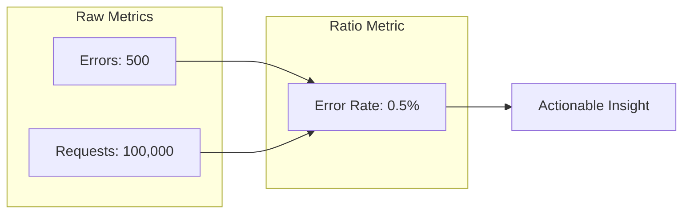
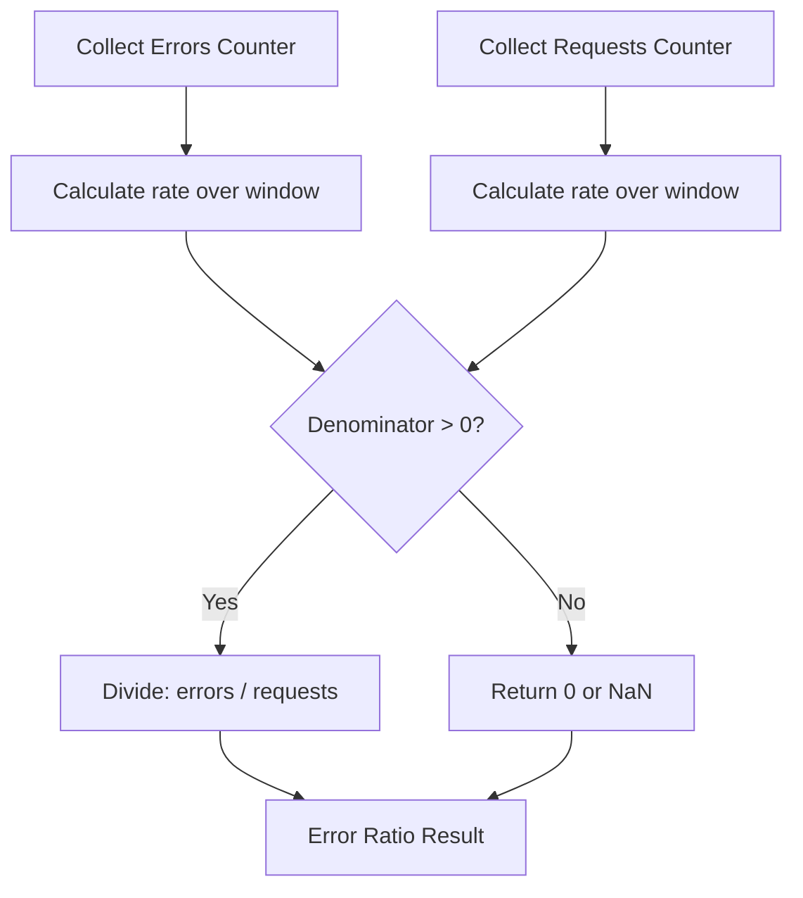
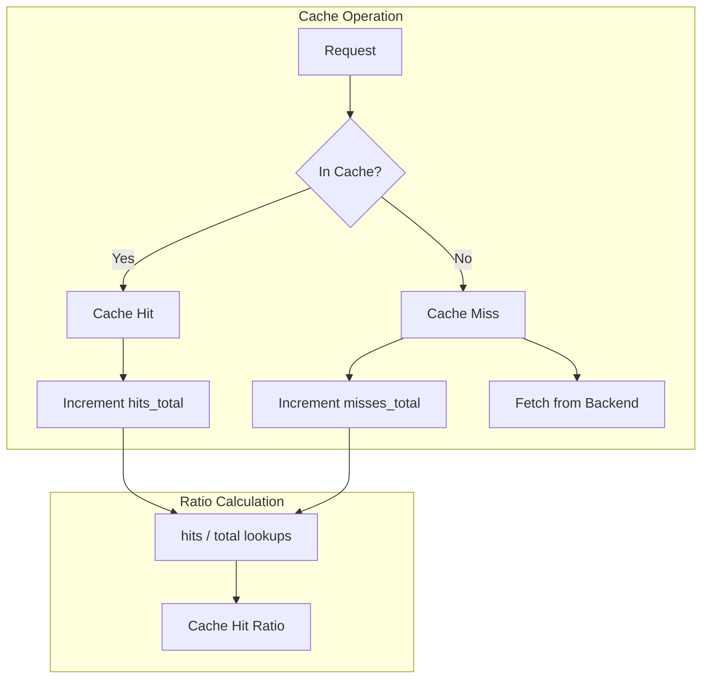
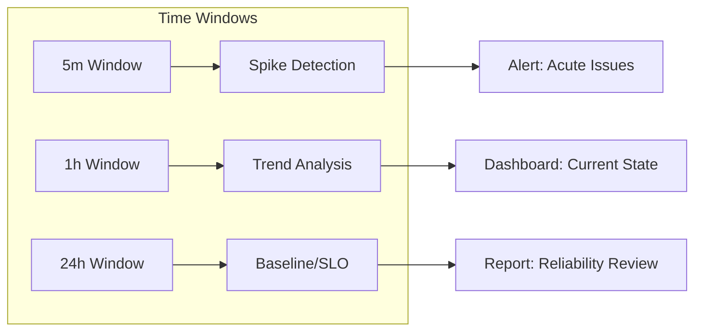
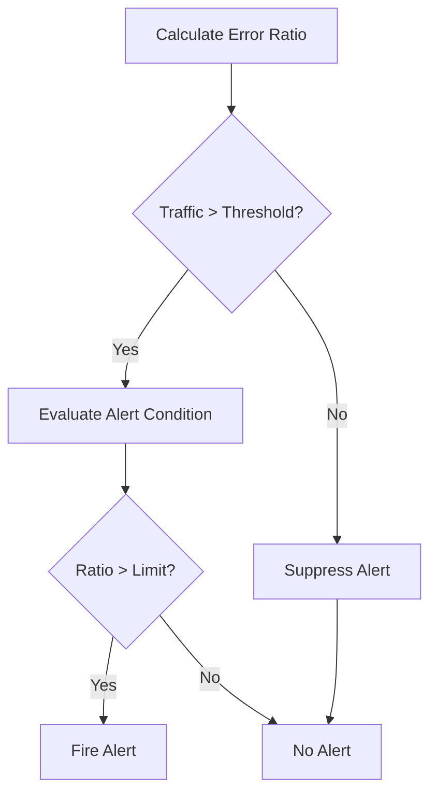
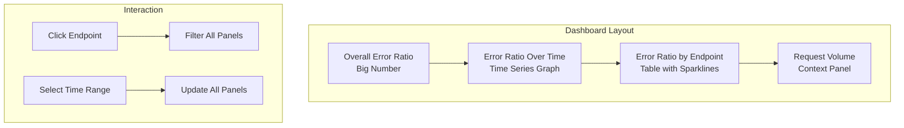

# How to Create Ratio Metrics

Author: [nawazdhandala](https://github.com/nawazdhandala)

Tags: Observability, Metrics, Monitoring, SRE

Description: Learn how to design ratio metrics for measuring proportions, success rates, and comparative measurements in monitoring systems.

---

Ratio metrics are the backbone of modern observability. While counters and gauges tell you raw numbers, ratios tell you the story: What percentage of requests succeeded? How efficiently is your cache working? What fraction of users encountered errors?

This guide walks through the theory and practice of building ratio metrics that drive meaningful alerts and informed decisions.

## What Are Ratio Metrics?

A ratio metric expresses one quantity as a fraction of another. The general form is:

```
ratio = numerator / denominator
```

Common examples:
- **Error ratio**: failed requests / total requests
- **Success ratio**: successful requests / total requests
- **Cache hit ratio**: cache hits / (cache hits + cache misses)
- **Availability**: uptime / total time

Ratio metrics typically produce values between 0 and 1 (or 0% to 100%), making them intuitive to interpret and compare across services.

## Why Ratios Matter for SRE

Raw counts can mislead. Consider these scenarios:

| Scenario | Errors | Requests | Error Ratio |
|----------|--------|----------|-------------|
| Low traffic | 5 | 100 | 5% |
| High traffic | 500 | 100,000 | 0.5% |

The second scenario has 100x more errors, but users are experiencing a much better service. Ratio metrics normalize for traffic volume and reveal the true user experience.



## The Building Blocks: Counters

Ratio metrics are built from counters. Before calculating ratios, you need properly instrumented counters.

### Counter Instrumentation Pattern

```python
# Python example using OpenTelemetry
from opentelemetry import metrics

# Create a meter for your service
meter = metrics.get_meter("my_service")

# Define counters for tracking requests
# These counters will be the building blocks for ratio calculations
http_requests_total = meter.create_counter(
    name="http_requests_total",
    description="Total number of HTTP requests",
    unit="1"
)

http_errors_total = meter.create_counter(
    name="http_errors_total",
    description="Total number of HTTP errors (4xx and 5xx)",
    unit="1"
)

def handle_request(request):
    """
    Process an HTTP request and increment appropriate counters.
    Labels allow slicing ratios by endpoint, method, etc.
    """
    # Always increment total requests
    http_requests_total.add(
        1,
        attributes={
            "endpoint": request.path,
            "method": request.method
        }
    )

    try:
        response = process(request)

        # Track errors based on status code
        if response.status_code >= 400:
            http_errors_total.add(
                1,
                attributes={
                    "endpoint": request.path,
                    "method": request.method,
                    "status_code": str(response.status_code)
                }
            )
        return response

    except Exception as e:
        # Track exceptions as errors
        http_errors_total.add(
            1,
            attributes={
                "endpoint": request.path,
                "method": request.method,
                "error_type": type(e).__name__
            }
        )
        raise
```

## Error Ratio: The Foundation of SLOs

Error ratio is the most common ratio metric and forms the basis of most Service Level Objectives (SLOs).

### PromQL for Error Ratio

```promql
# Basic error ratio over 5 minutes
# Divides the rate of errors by the rate of total requests
# Result: decimal between 0 and 1 (multiply by 100 for percentage)
sum(rate(http_errors_total[5m]))
/
sum(rate(http_requests_total[5m]))
```

### Error Ratio by Endpoint

```promql
# Error ratio broken down by endpoint
# Groups both numerator and denominator by the same label
# This reveals which endpoints have the worst error rates
sum by (endpoint) (rate(http_errors_total[5m]))
/
sum by (endpoint) (rate(http_requests_total[5m]))
```

### Safe Division: Handling Zero Denominators

```promql
# Prevent division by zero using clamp_min
# clamp_min ensures denominator is at least 1
# This avoids NaN/Inf when there is no traffic
sum(rate(http_errors_total[5m]))
/
clamp_min(sum(rate(http_requests_total[5m])), 1)
```



## Success Ratio: The Inverse Perspective

Success ratio is simply `1 - error_ratio`. Some teams prefer expressing SLOs in positive terms.

### PromQL for Success Ratio

```promql
# Success ratio: percentage of requests that succeeded
# Subtracting error ratio from 1 gives success ratio
# A 99.9% success ratio means 0.1% error ratio
1 - (
    sum(rate(http_errors_total[5m]))
    /
    clamp_min(sum(rate(http_requests_total[5m])), 1)
)
```

### Alternative: Explicit Success Counter

```promql
# If you track successes explicitly (recommended for clarity)
# This approach is more explicit and less prone to counter mismatches
sum(rate(http_successes_total[5m]))
/
clamp_min(sum(rate(http_requests_total[5m])), 1)
```

## Cache Hit Ratio: Efficiency Measurement

Cache hit ratio measures how effectively your caching layer serves requests without hitting the backend.

### Counter Setup for Cache Metrics

```go
// Go example using Prometheus client
package cache

import (
    "github.com/prometheus/client_golang/prometheus"
    "github.com/prometheus/client_golang/prometheus/promauto"
)

var (
    // Counter for cache hits
    // Incremented when data is found in cache
    cacheHits = promauto.NewCounterVec(
        prometheus.CounterOpts{
            Name: "cache_hits_total",
            Help: "Number of cache hits",
        },
        []string{"cache_name", "key_type"},
    )

    // Counter for cache misses
    // Incremented when data is not found and backend is queried
    cacheMisses = promauto.NewCounterVec(
        prometheus.CounterOpts{
            Name: "cache_misses_total",
            Help: "Number of cache misses",
        },
        []string{"cache_name", "key_type"},
    )
)

// Get retrieves a value from cache and records the outcome
func (c *Cache) Get(key string) (interface{}, bool) {
    value, found := c.store.Get(key)

    if found {
        // Cache hit: data served from cache
        cacheHits.WithLabelValues(c.name, classifyKey(key)).Inc()
        return value, true
    }

    // Cache miss: will need to fetch from backend
    cacheMisses.WithLabelValues(c.name, classifyKey(key)).Inc()
    return nil, false
}
```

### PromQL for Cache Hit Ratio

```promql
# Cache hit ratio: hits / (hits + misses)
# A ratio of 0.95 means 95% of lookups were served from cache
# Higher is better: reduces backend load and latency
sum(rate(cache_hits_total[5m]))
/
(
    sum(rate(cache_hits_total[5m]))
    +
    sum(rate(cache_misses_total[5m]))
)
```

### Cache Hit Ratio by Cache Name

```promql
# Per-cache breakdown to identify underperforming caches
# Different caches may have different expected hit ratios
sum by (cache_name) (rate(cache_hits_total[5m]))
/
clamp_min(
    sum by (cache_name) (rate(cache_hits_total[5m]))
    +
    sum by (cache_name) (rate(cache_misses_total[5m])),
    1
)
```



## Saturation Ratio: Capacity Planning

Saturation ratio tells you how close a resource is to its limit.

### PromQL for Saturation

```promql
# Connection pool saturation
# Shows what fraction of available connections are in use
# Values approaching 1.0 indicate potential bottleneck
sum(pool_connections_in_use)
/
sum(pool_connections_max)
```

```promql
# Queue saturation: current items vs capacity
# High saturation suggests processing cannot keep up with arrivals
sum(queue_current_length)
/
sum(queue_max_capacity)
```

```promql
# Memory saturation for a container
# Useful for right-sizing container limits
container_memory_working_set_bytes
/
container_spec_memory_limit_bytes
```

## Multi-Window Ratio Analysis

Different time windows reveal different patterns. Short windows catch spikes; long windows show trends.

### PromQL Multi-Window Example

```promql
# 5-minute window: catches recent spikes
# Good for alerting on acute issues
sum(rate(http_errors_total[5m])) / sum(rate(http_requests_total[5m]))

# 1-hour window: smooths out noise
# Good for dashboards and trend analysis
sum(rate(http_errors_total[1h])) / sum(rate(http_requests_total[1h]))

# 24-hour window: daily baseline
# Good for capacity planning and SLO burn rate
sum(rate(http_errors_total[24h])) / sum(rate(http_requests_total[24h]))
```



## Alerting on Ratio Metrics

### Burn Rate Alerting

Burn rate measures how fast you are consuming your error budget. It is the ratio of current error rate to your SLO threshold.

```promql
# Burn rate calculation
# If SLO is 99.9% availability (0.1% error budget)
# and current error rate is 0.5%, burn rate = 0.5 / 0.1 = 5x
# A burn rate of 5x means you will exhaust monthly budget in ~6 days

(
    sum(rate(http_errors_total[1h]))
    /
    clamp_min(sum(rate(http_requests_total[1h])), 1)
)
/
0.001  # SLO threshold (0.1% error rate for 99.9% availability)
```

### Multi-Burn-Rate Alert

```yaml
# Prometheus alerting rule for multi-burn-rate
# This catches both fast burns (acute) and slow burns (chronic)
groups:
  - name: slo_alerts
    rules:
      # Fast burn: 14x burn rate for 2 minutes
      # Catches severe outages quickly
      - alert: HighErrorBurnRateFast
        expr: |
          (
            sum(rate(http_errors_total[2m]))
            / clamp_min(sum(rate(http_requests_total[2m])), 1)
          ) / 0.001 > 14
        for: 2m
        labels:
          severity: critical
        annotations:
          summary: "Error budget burning 14x faster than allowed"

      # Slow burn: 2x burn rate for 1 hour
      # Catches gradual degradation that would exhaust budget
      - alert: HighErrorBurnRateSlow
        expr: |
          (
            sum(rate(http_errors_total[1h]))
            / clamp_min(sum(rate(http_requests_total[1h])), 1)
          ) / 0.001 > 2
        for: 1h
        labels:
          severity: warning
        annotations:
          summary: "Error budget burning 2x faster than allowed"
```

## Common Pitfalls and Solutions

### Pitfall 1: Mismatched Labels

```promql
# WRONG: Labels do not match between numerator and denominator
# This will produce incorrect results or errors
sum by (endpoint) (rate(http_errors_total[5m]))
/
sum by (method) (rate(http_requests_total[5m]))

# CORRECT: Labels must match for proper grouping
sum by (endpoint, method) (rate(http_errors_total[5m]))
/
sum by (endpoint, method) (rate(http_requests_total[5m]))
```

### Pitfall 2: Counter Resets

```promql
# rate() handles counter resets automatically
# Never use raw counter values for ratios
# WRONG: Raw counters will break on service restart
http_errors_total / http_requests_total

# CORRECT: Use rate() to handle resets
rate(http_errors_total[5m]) / rate(http_requests_total[5m])
```

### Pitfall 3: Low Traffic Noise

```promql
# Add minimum traffic threshold to avoid noisy ratios
# When traffic is very low, a single error creates huge ratio swings
(
    sum(rate(http_errors_total[5m]))
    /
    clamp_min(sum(rate(http_requests_total[5m])), 1)
)
# Only alert if traffic exceeds minimum threshold
and
sum(rate(http_requests_total[5m])) > 10
```



## Dashboard Design for Ratio Metrics

Effective ratio metric dashboards follow these principles:

1. **Show both ratio and volume**: A 50% error rate on 2 requests is very different from 50% on 2 million requests.

2. **Use consistent time ranges**: Compare ratios using the same windows.

3. **Include thresholds visually**: Draw SLO lines on graphs.

4. **Provide drill-down**: Allow filtering by endpoint, region, or customer segment.



## Complete Example: API Service Monitoring

Here is a complete example bringing together all concepts for monitoring an API service.

### Instrumentation (Node.js)

```javascript
// metrics.js
// Complete ratio metrics instrumentation for an Express API

const { MeterProvider } = require('@opentelemetry/sdk-metrics');
const { PrometheusExporter } = require('@opentelemetry/exporter-prometheus');

// Initialize metrics exporter
const exporter = new PrometheusExporter({ port: 9464 });
const meterProvider = new MeterProvider();
meterProvider.addMetricReader(exporter);

const meter = meterProvider.getMeter('api-service');

// Request counters for ratio calculations
const requestsTotal = meter.createCounter('http_requests_total', {
    description: 'Total HTTP requests received'
});

const errorsTotal = meter.createCounter('http_errors_total', {
    description: 'Total HTTP errors returned'
});

// Cache counters for hit ratio
const cacheHits = meter.createCounter('cache_hits_total', {
    description: 'Cache lookup hits'
});

const cacheMisses = meter.createCounter('cache_misses_total', {
    description: 'Cache lookup misses'
});

// Middleware to track request metrics
function metricsMiddleware(req, res, next) {
    // Capture start time for latency (bonus metric)
    const startTime = Date.now();

    // Hook into response finish event
    res.on('finish', () => {
        const labels = {
            method: req.method,
            endpoint: req.route?.path || 'unknown',
            status_code: res.statusCode.toString()
        };

        // Always increment total requests
        requestsTotal.add(1, labels);

        // Increment errors for 4xx and 5xx responses
        if (res.statusCode >= 400) {
            errorsTotal.add(1, labels);
        }
    });

    next();
}

// Cache wrapper that tracks hit/miss ratios
class InstrumentedCache {
    constructor(name, cache) {
        this.name = name;
        this.cache = cache;
    }

    async get(key) {
        const value = await this.cache.get(key);
        const labels = { cache_name: this.name };

        if (value !== null && value !== undefined) {
            // Cache hit
            cacheHits.add(1, labels);
            return value;
        }

        // Cache miss
        cacheMisses.add(1, labels);
        return null;
    }

    async set(key, value, ttl) {
        return this.cache.set(key, value, ttl);
    }
}

module.exports = {
    metricsMiddleware,
    InstrumentedCache
};
```

### PromQL Queries for Dashboard

```promql
# Panel 1: Overall API Success Rate (big number)
# Shows current success percentage with 1 decimal place
100 * (
    1 - (
        sum(rate(http_errors_total[5m]))
        /
        clamp_min(sum(rate(http_requests_total[5m])), 1)
    )
)

# Panel 2: Error Rate by Endpoint (table)
# Sorted by error rate descending to show worst endpoints first
sort_desc(
    sum by (endpoint) (rate(http_errors_total[5m]))
    /
    clamp_min(sum by (endpoint) (rate(http_requests_total[5m])), 0.001)
)

# Panel 3: Cache Hit Rate (gauge)
# Target: above 90% for healthy caching
100 * (
    sum(rate(cache_hits_total[5m]))
    /
    clamp_min(
        sum(rate(cache_hits_total[5m])) + sum(rate(cache_misses_total[5m])),
        1
    )
)

# Panel 4: Request Volume (context)
# Shows requests per second to contextualize ratios
sum(rate(http_requests_total[5m]))
```

### Alert Rules

```yaml
# alerts.yaml
# Production-ready alerting rules for ratio metrics

groups:
  - name: api_ratio_alerts
    rules:
      # High error ratio alert
      - alert: HighAPIErrorRate
        expr: |
          (
            sum(rate(http_errors_total[5m]))
            / clamp_min(sum(rate(http_requests_total[5m])), 1)
          ) > 0.01
          and
          sum(rate(http_requests_total[5m])) > 1
        for: 5m
        labels:
          severity: warning
        annotations:
          summary: "API error rate above 1%"
          description: "Current error rate: {{ $value | humanizePercentage }}"

      # Critical error ratio
      - alert: CriticalAPIErrorRate
        expr: |
          (
            sum(rate(http_errors_total[5m]))
            / clamp_min(sum(rate(http_requests_total[5m])), 1)
          ) > 0.05
          and
          sum(rate(http_requests_total[5m])) > 1
        for: 2m
        labels:
          severity: critical
        annotations:
          summary: "API error rate above 5%"

      # Cache efficiency degradation
      - alert: LowCacheHitRate
        expr: |
          (
            sum(rate(cache_hits_total[15m]))
            / clamp_min(
                sum(rate(cache_hits_total[15m])) + sum(rate(cache_misses_total[15m])),
                1
            )
          ) < 0.8
          and
          sum(rate(cache_hits_total[15m])) + sum(rate(cache_misses_total[15m])) > 10
        for: 15m
        labels:
          severity: warning
        annotations:
          summary: "Cache hit rate below 80%"
          description: "Consider investigating cache invalidation or sizing"
```

## Summary

Ratio metrics transform raw counters into actionable insights. The key principles:

1. **Build from counters**: Use rate() on counters to calculate ratios
2. **Handle edge cases**: Prevent division by zero with clamp_min()
3. **Match labels**: Ensure numerator and denominator share the same label dimensions
4. **Consider traffic volume**: Add minimum traffic thresholds to avoid noisy alerts
5. **Use multiple windows**: Short windows for alerting, long windows for trends
6. **Implement burn rates**: Track how fast you consume error budget

Ratio metrics are the foundation of SLO-based reliability engineering. Master them, and you will have clarity into user experience that raw counts can never provide.

---

**Related Reading:**
- [18 SRE Metrics Worth Tracking](https://oneuptime.com/blog/post/2025-11-28-sre-metrics-to-track/view)
- [Logs, Metrics and Traces: The Three Pillars](https://oneuptime.com/blog/post/2025-08-20-three-pillars-of-observability-logs-metrics-traces/view)
- [SRE Best Practices](https://oneuptime.com/blog/post/2025-11-28-sre-best-practices/view)
