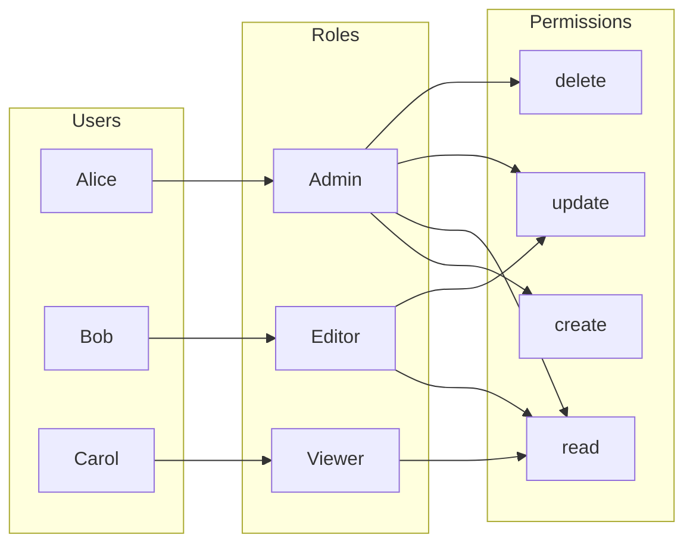
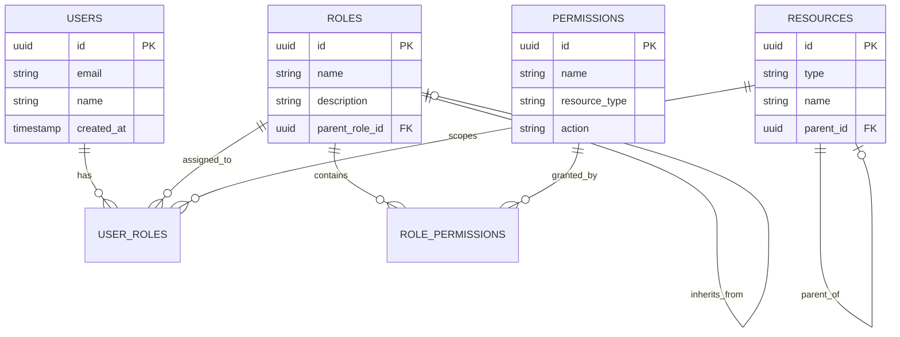
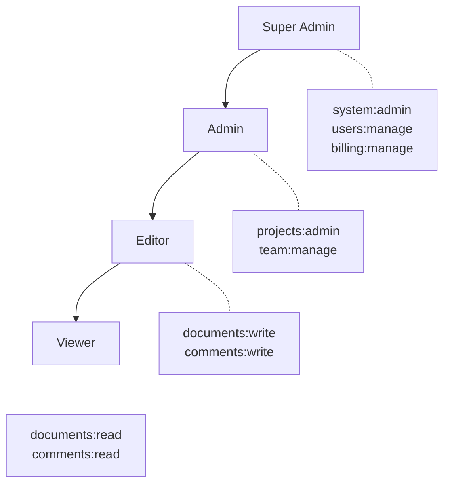
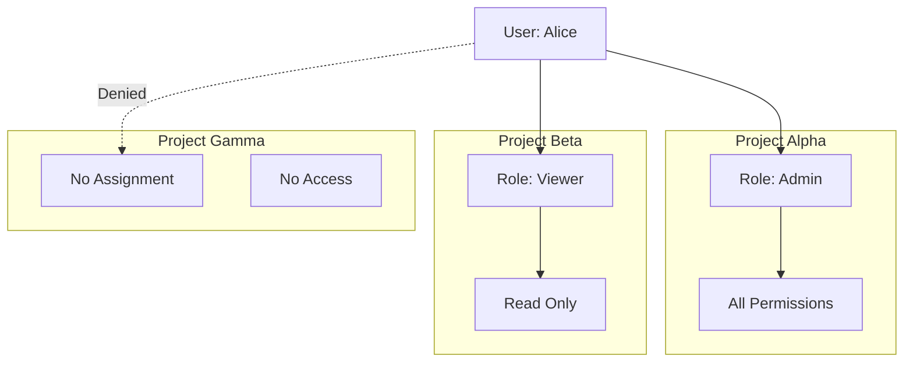
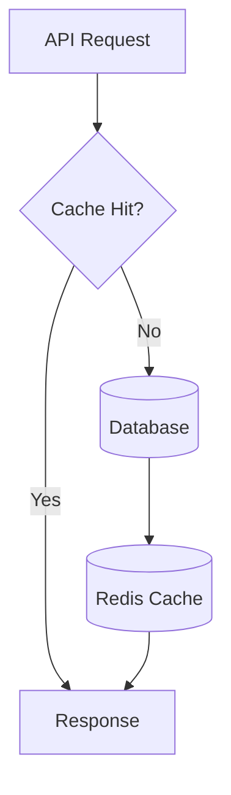
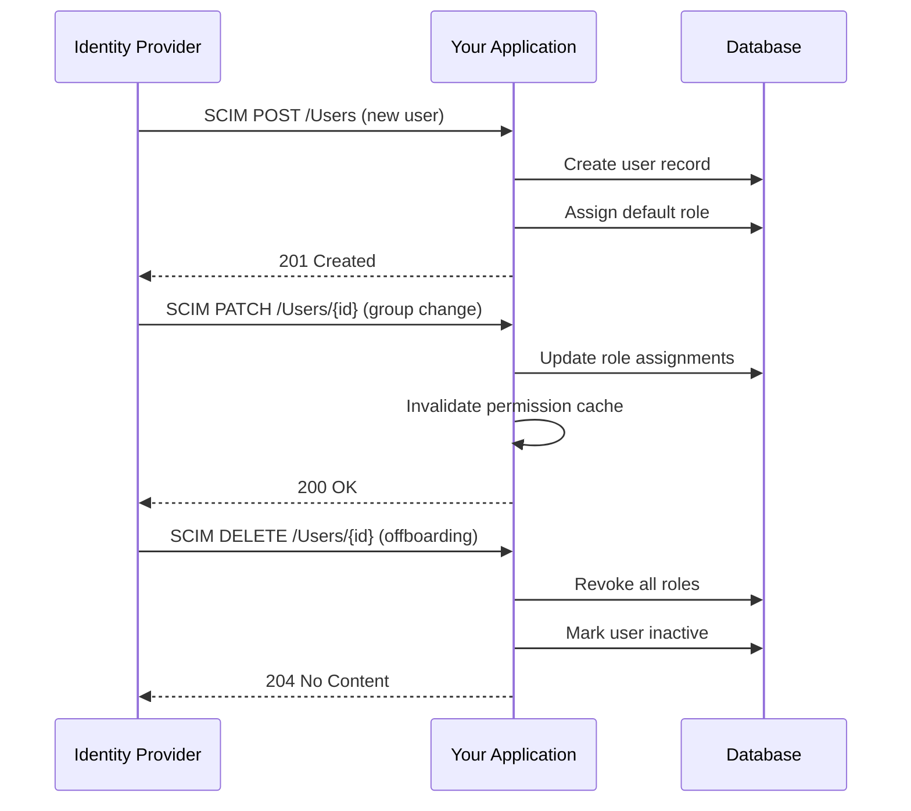

# How to Create RBAC Implementation Details

Author: [nawazdhandala](https://github.com/nawazdhandala)

Tags: Security, Authorization, Access Control, DevOps

Description: A practical guide to designing and implementing Role-Based Access Control (RBAC) systems with real-world patterns, code examples, and best practices for securing applications at scale.

---

Access control sits at the heart of every secure system. Role-Based Access Control (RBAC) remains the gold standard for managing permissions because it balances simplicity with flexibility. This guide walks through implementing RBAC from scratch, covering data models, policy evaluation, and integration patterns that work in production.

## Understanding RBAC Core Concepts

RBAC organizes permissions around roles rather than individual users. This makes permission management scalable because you assign roles to users and permissions to roles.



### The Core Entities

Every RBAC system needs these building blocks:

- **Users**: The identities requesting access
- **Roles**: Named collections of permissions
- **Permissions**: Specific actions on specific resources
- **Resources**: The objects being protected

## Designing the Data Model

A solid data model makes or breaks your RBAC implementation. Here is a schema that supports hierarchical roles and resource-level permissions.

### Database Schema

This schema creates the foundation for a flexible RBAC system. The permissions table uses a combination of resource type and action, allowing fine-grained control over what each role can do.

```sql
-- Users table stores identity information
CREATE TABLE users (
    id UUID PRIMARY KEY DEFAULT gen_random_uuid(),
    email VARCHAR(255) UNIQUE NOT NULL,
    name VARCHAR(255) NOT NULL,
    created_at TIMESTAMP DEFAULT CURRENT_TIMESTAMP,
    updated_at TIMESTAMP DEFAULT CURRENT_TIMESTAMP
);

-- Roles define named permission sets
CREATE TABLE roles (
    id UUID PRIMARY KEY DEFAULT gen_random_uuid(),
    name VARCHAR(100) UNIQUE NOT NULL,
    description TEXT,
    -- Parent role enables hierarchy (admin inherits from editor, etc.)
    parent_role_id UUID REFERENCES roles(id),
    created_at TIMESTAMP DEFAULT CURRENT_TIMESTAMP
);

-- Resources represent protected objects
CREATE TABLE resources (
    id UUID PRIMARY KEY DEFAULT gen_random_uuid(),
    type VARCHAR(100) NOT NULL,  -- 'project', 'document', 'api_key'
    name VARCHAR(255) NOT NULL,
    -- Optional parent for hierarchical resources
    parent_id UUID REFERENCES resources(id),
    created_at TIMESTAMP DEFAULT CURRENT_TIMESTAMP
);

-- Permissions define allowed actions on resource types
CREATE TABLE permissions (
    id UUID PRIMARY KEY DEFAULT gen_random_uuid(),
    name VARCHAR(100) NOT NULL,          -- 'documents:read', 'projects:delete'
    resource_type VARCHAR(100) NOT NULL, -- 'document', 'project'
    action VARCHAR(50) NOT NULL,         -- 'read', 'write', 'delete', 'admin'
    description TEXT,
    UNIQUE(resource_type, action)
);

-- Role-Permission junction table
CREATE TABLE role_permissions (
    role_id UUID REFERENCES roles(id) ON DELETE CASCADE,
    permission_id UUID REFERENCES permissions(id) ON DELETE CASCADE,
    PRIMARY KEY (role_id, permission_id)
);

-- User-Role assignment with optional resource scope
CREATE TABLE user_roles (
    user_id UUID REFERENCES users(id) ON DELETE CASCADE,
    role_id UUID REFERENCES roles(id) ON DELETE CASCADE,
    -- Resource scope makes the role apply to specific resources only
    resource_id UUID REFERENCES resources(id) ON DELETE CASCADE,
    granted_at TIMESTAMP DEFAULT CURRENT_TIMESTAMP,
    granted_by UUID REFERENCES users(id),
    PRIMARY KEY (user_id, role_id, COALESCE(resource_id, '00000000-0000-0000-0000-000000000000'))
);

-- Index for fast permission lookups
CREATE INDEX idx_user_roles_user ON user_roles(user_id);
CREATE INDEX idx_role_permissions_role ON role_permissions(role_id);
CREATE INDEX idx_permissions_resource ON permissions(resource_type, action);
```

### Entity Relationship Diagram



## Implementing Permission Checks

The permission check is the most frequently called function in your RBAC system. It needs to be fast and correct.

### Basic Permission Check

This function checks if a user has a specific permission, considering role hierarchy and resource scope. It uses a recursive CTE to walk up the role hierarchy.

```typescript
// Types for the RBAC system
interface Permission {
  resourceType: string;
  action: string;
}

interface PermissionCheckResult {
  allowed: boolean;
  role?: string;
  reason: string;
}

// The core permission check function
async function checkPermission(
  userId: string,
  permission: Permission,
  resourceId?: string
): Promise<PermissionCheckResult> {
  // Query that handles role hierarchy through recursive CTE
  const query = `
    WITH RECURSIVE role_hierarchy AS (
      -- Base case: roles directly assigned to user
      SELECT r.id, r.name, r.parent_role_id, 1 as depth
      FROM roles r
      JOIN user_roles ur ON r.id = ur.role_id
      WHERE ur.user_id = $1
        AND (ur.resource_id IS NULL OR ur.resource_id = $3)

      UNION ALL

      -- Recursive case: parent roles
      SELECT r.id, r.name, r.parent_role_id, rh.depth + 1
      FROM roles r
      JOIN role_hierarchy rh ON r.id = rh.parent_role_id
      WHERE rh.depth < 10  -- Prevent infinite loops
    )
    SELECT rh.name as role_name
    FROM role_hierarchy rh
    JOIN role_permissions rp ON rh.id = rp.role_id
    JOIN permissions p ON rp.permission_id = p.id
    WHERE p.resource_type = $2
      AND p.action = $4
    LIMIT 1
  `;

  const result = await db.query(query, [
    userId,
    permission.resourceType,
    resourceId || null,
    permission.action
  ]);

  if (result.rows.length > 0) {
    return {
      allowed: true,
      role: result.rows[0].role_name,
      reason: `Permission granted via role: ${result.rows[0].role_name}`
    };
  }

  return {
    allowed: false,
    reason: 'No matching permission found'
  };
}
```

### Middleware Integration

Integrate the permission check into your API layer. This Express middleware demonstrates the pattern that works with any Node.js framework.

```typescript
import { Request, Response, NextFunction } from 'express';

// Middleware factory for permission checks
function requirePermission(resourceType: string, action: string) {
  return async (req: Request, res: Response, next: NextFunction) => {
    const userId = req.user?.id;

    if (!userId) {
      return res.status(401).json({
        error: 'Authentication required'
      });
    }

    // Extract resource ID from route params or body
    const resourceId = req.params.id || req.body.resourceId;

    const result = await checkPermission(
      userId,
      { resourceType, action },
      resourceId
    );

    if (!result.allowed) {
      // Log the denial for security auditing
      console.log({
        event: 'permission_denied',
        userId,
        resourceType,
        action,
        resourceId,
        reason: result.reason
      });

      return res.status(403).json({
        error: 'Permission denied',
        required: `${resourceType}:${action}`
      });
    }

    // Attach permission info for downstream handlers
    req.permissionContext = result;
    next();
  };
}

// Usage in route definitions
app.get(
  '/api/projects/:id',
  requirePermission('project', 'read'),
  projectController.get
);

app.delete(
  '/api/projects/:id',
  requirePermission('project', 'delete'),
  projectController.delete
);
```

## Implementing Role Hierarchies

Role hierarchies reduce redundancy. An admin should automatically have all editor permissions without duplicating permission assignments.

### Hierarchy Visualization



### Setting Up Hierarchical Roles

This seed data creates a typical role hierarchy. Each role inherits all permissions from its parent roles.

```sql
-- Insert roles with hierarchy
INSERT INTO roles (id, name, description, parent_role_id) VALUES
  ('11111111-1111-1111-1111-111111111111', 'viewer', 'Read-only access', NULL),
  ('22222222-2222-2222-2222-222222222222', 'editor', 'Can create and modify content', '11111111-1111-1111-1111-111111111111'),
  ('33333333-3333-3333-3333-333333333333', 'admin', 'Full project administration', '22222222-2222-2222-2222-222222222222'),
  ('44444444-4444-4444-4444-444444444444', 'super_admin', 'System-wide administration', '33333333-3333-3333-3333-333333333333');

-- Insert base permissions
INSERT INTO permissions (id, name, resource_type, action, description) VALUES
  -- Document permissions
  ('aaaa1111-1111-1111-1111-111111111111', 'documents:read', 'document', 'read', 'View documents'),
  ('aaaa2222-2222-2222-2222-222222222222', 'documents:write', 'document', 'write', 'Create and edit documents'),
  ('aaaa3333-3333-3333-3333-333333333333', 'documents:delete', 'document', 'delete', 'Delete documents'),
  -- Project permissions
  ('bbbb1111-1111-1111-1111-111111111111', 'projects:read', 'project', 'read', 'View projects'),
  ('bbbb2222-2222-2222-2222-222222222222', 'projects:admin', 'project', 'admin', 'Administer projects'),
  -- User management
  ('cccc1111-1111-1111-1111-111111111111', 'users:read', 'user', 'read', 'View user profiles'),
  ('cccc2222-2222-2222-2222-222222222222', 'users:manage', 'user', 'manage', 'Manage user accounts');

-- Assign permissions to roles (each role only needs its unique permissions)
-- Viewer permissions
INSERT INTO role_permissions (role_id, permission_id) VALUES
  ('11111111-1111-1111-1111-111111111111', 'aaaa1111-1111-1111-1111-111111111111'),  -- documents:read
  ('11111111-1111-1111-1111-111111111111', 'bbbb1111-1111-1111-1111-111111111111'),  -- projects:read
  ('11111111-1111-1111-1111-111111111111', 'cccc1111-1111-1111-1111-111111111111');  -- users:read

-- Editor permissions (inherits viewer, adds write)
INSERT INTO role_permissions (role_id, permission_id) VALUES
  ('22222222-2222-2222-2222-222222222222', 'aaaa2222-2222-2222-2222-222222222222');  -- documents:write

-- Admin permissions (inherits editor, adds delete and project admin)
INSERT INTO role_permissions (role_id, permission_id) VALUES
  ('33333333-3333-3333-3333-333333333333', 'aaaa3333-3333-3333-3333-333333333333'),  -- documents:delete
  ('33333333-3333-3333-3333-333333333333', 'bbbb2222-2222-2222-2222-222222222222');  -- projects:admin

-- Super admin permissions (inherits admin, adds user management)
INSERT INTO role_permissions (role_id, permission_id) VALUES
  ('44444444-4444-4444-4444-444444444444', 'cccc2222-2222-2222-2222-222222222222');  -- users:manage
```

## Resource-Scoped Permissions

Global roles work for simple systems, but production apps need resource-level permissions. A user might be an admin for Project A but only a viewer for Project B.

### Implementation Pattern



### Assigning Resource-Scoped Roles

This function assigns a role to a user for a specific resource. The same user can have different roles for different resources.

```typescript
interface RoleAssignment {
  userId: string;
  roleId: string;
  resourceId?: string;  // Optional: null means global assignment
  grantedBy: string;
}

async function assignRole(assignment: RoleAssignment): Promise<void> {
  // Validate the granter has permission to assign this role
  const canGrant = await checkPermission(
    assignment.grantedBy,
    { resourceType: 'role', action: 'grant' },
    assignment.resourceId
  );

  if (!canGrant.allowed) {
    throw new Error('You do not have permission to grant this role');
  }

  // Prevent privilege escalation: granter cannot assign higher roles
  const granterRoleLevel = await getRoleLevel(assignment.grantedBy, assignment.resourceId);
  const targetRoleLevel = await getRoleLevelById(assignment.roleId);

  if (targetRoleLevel > granterRoleLevel) {
    throw new Error('Cannot assign a role with higher privileges than your own');
  }

  // Insert the role assignment
  await db.query(`
    INSERT INTO user_roles (user_id, role_id, resource_id, granted_by)
    VALUES ($1, $2, $3, $4)
    ON CONFLICT (user_id, role_id, COALESCE(resource_id, '00000000-0000-0000-0000-000000000000'))
    DO UPDATE SET granted_at = CURRENT_TIMESTAMP, granted_by = $4
  `, [assignment.userId, assignment.roleId, assignment.resourceId, assignment.grantedBy]);

  // Log the assignment for audit trail
  await auditLog({
    action: 'role_assigned',
    actor: assignment.grantedBy,
    target: assignment.userId,
    role: assignment.roleId,
    resource: assignment.resourceId
  });
}
```

## Caching Permission Decisions

Permission checks happen on every request. Without caching, you will hammer your database and add latency to every API call.

### Cache Strategy



### Redis-Based Permission Cache

This caching layer stores permission decisions in Redis with automatic invalidation. The cache key includes user, permission, and resource to ensure correctness.

```typescript
import Redis from 'ioredis';

const redis = new Redis(process.env.REDIS_URL);
const CACHE_TTL_SECONDS = 300;  // 5 minutes

// Generate a consistent cache key for permission lookups
function permissionCacheKey(
  userId: string,
  resourceType: string,
  action: string,
  resourceId?: string
): string {
  const parts = ['perm', userId, resourceType, action];
  if (resourceId) parts.push(resourceId);
  return parts.join(':');
}

// Cached permission check wrapper
async function checkPermissionCached(
  userId: string,
  permission: Permission,
  resourceId?: string
): Promise<PermissionCheckResult> {
  const cacheKey = permissionCacheKey(
    userId,
    permission.resourceType,
    permission.action,
    resourceId
  );

  // Try cache first
  const cached = await redis.get(cacheKey);
  if (cached) {
    return JSON.parse(cached);
  }

  // Cache miss: check database
  const result = await checkPermission(userId, permission, resourceId);

  // Store in cache with TTL
  await redis.setex(cacheKey, CACHE_TTL_SECONDS, JSON.stringify(result));

  return result;
}

// Invalidate cache when roles change
async function invalidateUserPermissionCache(userId: string): Promise<void> {
  // Find all keys for this user and delete them
  const pattern = `perm:${userId}:*`;
  const keys = await redis.keys(pattern);

  if (keys.length > 0) {
    await redis.del(...keys);
  }
}

// Call this when role assignments change
async function onRoleAssignmentChange(userId: string): Promise<void> {
  await invalidateUserPermissionCache(userId);
}
```

## Audit Logging

Every permission decision and role change should be logged. This is critical for security investigations and compliance.

### Audit Log Schema

```sql
-- Comprehensive audit log for all RBAC events
CREATE TABLE rbac_audit_log (
    id UUID PRIMARY KEY DEFAULT gen_random_uuid(),
    timestamp TIMESTAMP DEFAULT CURRENT_TIMESTAMP,
    event_type VARCHAR(50) NOT NULL,  -- 'permission_check', 'role_assigned', 'role_revoked'
    actor_id UUID REFERENCES users(id),
    target_user_id UUID REFERENCES users(id),
    role_id UUID REFERENCES roles(id),
    resource_id UUID REFERENCES resources(id),
    permission_resource_type VARCHAR(100),
    permission_action VARCHAR(50),
    result VARCHAR(20),  -- 'allowed', 'denied'
    ip_address INET,
    user_agent TEXT,
    metadata JSONB
);

-- Index for common queries
CREATE INDEX idx_audit_timestamp ON rbac_audit_log(timestamp);
CREATE INDEX idx_audit_actor ON rbac_audit_log(actor_id);
CREATE INDEX idx_audit_target ON rbac_audit_log(target_user_id);
CREATE INDEX idx_audit_event_type ON rbac_audit_log(event_type);
```

### Logging Implementation

This function writes audit entries for every significant RBAC event. It captures enough context to reconstruct what happened during security reviews.

```typescript
interface AuditEntry {
  eventType: 'permission_check' | 'role_assigned' | 'role_revoked' | 'permission_denied';
  actorId: string;
  targetUserId?: string;
  roleId?: string;
  resourceId?: string;
  permission?: Permission;
  result: 'allowed' | 'denied';
  metadata?: Record<string, unknown>;
}

async function writeAuditLog(
  entry: AuditEntry,
  req?: Request
): Promise<void> {
  await db.query(`
    INSERT INTO rbac_audit_log (
      event_type, actor_id, target_user_id, role_id,
      resource_id, permission_resource_type, permission_action,
      result, ip_address, user_agent, metadata
    ) VALUES ($1, $2, $3, $4, $5, $6, $7, $8, $9, $10, $11)
  `, [
    entry.eventType,
    entry.actorId,
    entry.targetUserId,
    entry.roleId,
    entry.resourceId,
    entry.permission?.resourceType,
    entry.permission?.action,
    entry.result,
    req?.ip,
    req?.headers['user-agent'],
    JSON.stringify(entry.metadata || {})
  ]);
}

// Query audit logs for investigation
async function queryAuditLog(filters: {
  userId?: string;
  eventType?: string;
  startDate?: Date;
  endDate?: Date;
  limit?: number;
}): Promise<AuditEntry[]> {
  let query = 'SELECT * FROM rbac_audit_log WHERE 1=1';
  const params: unknown[] = [];
  let paramIndex = 1;

  if (filters.userId) {
    query += ` AND (actor_id = $${paramIndex} OR target_user_id = $${paramIndex})`;
    params.push(filters.userId);
    paramIndex++;
  }

  if (filters.eventType) {
    query += ` AND event_type = $${paramIndex}`;
    params.push(filters.eventType);
    paramIndex++;
  }

  if (filters.startDate) {
    query += ` AND timestamp >= $${paramIndex}`;
    params.push(filters.startDate);
    paramIndex++;
  }

  if (filters.endDate) {
    query += ` AND timestamp <= $${paramIndex}`;
    params.push(filters.endDate);
    paramIndex++;
  }

  query += ` ORDER BY timestamp DESC LIMIT $${paramIndex}`;
  params.push(filters.limit || 100);

  const result = await db.query(query, params);
  return result.rows;
}
```

## Testing Your RBAC Implementation

Comprehensive tests prevent security regressions. Cover both positive and negative cases for every permission.

### Test Cases

```typescript
import { describe, it, expect, beforeEach } from 'vitest';

describe('RBAC Permission Checks', () => {
  let adminUser: User;
  let editorUser: User;
  let viewerUser: User;
  let testProject: Resource;

  beforeEach(async () => {
    // Set up test users with different roles
    adminUser = await createTestUser('admin@test.com');
    editorUser = await createTestUser('editor@test.com');
    viewerUser = await createTestUser('viewer@test.com');
    testProject = await createTestResource('project', 'Test Project');

    // Assign roles
    await assignRole({ userId: adminUser.id, roleId: ADMIN_ROLE_ID, resourceId: testProject.id, grantedBy: SYSTEM_USER_ID });
    await assignRole({ userId: editorUser.id, roleId: EDITOR_ROLE_ID, resourceId: testProject.id, grantedBy: SYSTEM_USER_ID });
    await assignRole({ userId: viewerUser.id, roleId: VIEWER_ROLE_ID, resourceId: testProject.id, grantedBy: SYSTEM_USER_ID });
  });

  describe('Admin permissions', () => {
    it('should allow admin to delete documents', async () => {
      const result = await checkPermission(
        adminUser.id,
        { resourceType: 'document', action: 'delete' },
        testProject.id
      );
      expect(result.allowed).toBe(true);
    });

    it('should allow admin to read documents (inherited from viewer)', async () => {
      const result = await checkPermission(
        adminUser.id,
        { resourceType: 'document', action: 'read' },
        testProject.id
      );
      expect(result.allowed).toBe(true);
    });
  });

  describe('Editor permissions', () => {
    it('should allow editor to write documents', async () => {
      const result = await checkPermission(
        editorUser.id,
        { resourceType: 'document', action: 'write' },
        testProject.id
      );
      expect(result.allowed).toBe(true);
    });

    it('should deny editor from deleting documents', async () => {
      const result = await checkPermission(
        editorUser.id,
        { resourceType: 'document', action: 'delete' },
        testProject.id
      );
      expect(result.allowed).toBe(false);
    });
  });

  describe('Viewer permissions', () => {
    it('should allow viewer to read documents', async () => {
      const result = await checkPermission(
        viewerUser.id,
        { resourceType: 'document', action: 'read' },
        testProject.id
      );
      expect(result.allowed).toBe(true);
    });

    it('should deny viewer from writing documents', async () => {
      const result = await checkPermission(
        viewerUser.id,
        { resourceType: 'document', action: 'write' },
        testProject.id
      );
      expect(result.allowed).toBe(false);
    });
  });

  describe('Resource scoping', () => {
    it('should deny access to unassigned resources', async () => {
      const otherProject = await createTestResource('project', 'Other Project');

      const result = await checkPermission(
        adminUser.id,
        { resourceType: 'document', action: 'read' },
        otherProject.id
      );
      expect(result.allowed).toBe(false);
    });
  });

  describe('Privilege escalation prevention', () => {
    it('should prevent editor from granting admin role', async () => {
      await expect(
        assignRole({
          userId: viewerUser.id,
          roleId: ADMIN_ROLE_ID,
          resourceId: testProject.id,
          grantedBy: editorUser.id
        })
      ).rejects.toThrow('Cannot assign a role with higher privileges');
    });
  });
});
```

## Common Patterns and Anti-Patterns

### What Works

| Pattern | Description |
|---------|-------------|
| Role hierarchy | Reduces duplication; admin inherits editor inherits viewer |
| Resource scoping | Same user can have different roles in different contexts |
| Deny by default | No permission unless explicitly granted |
| Permission caching | Reduces database load on hot paths |
| Audit everything | Required for compliance and incident response |

### What to Avoid

| Anti-Pattern | Problem |
|--------------|---------|
| Hardcoded permission checks | Impossible to audit; scattered throughout codebase |
| User-level permissions | Does not scale; use roles instead |
| Caching without invalidation | Stale permissions lead to security holes |
| Missing audit logs | Cannot investigate breaches or prove compliance |
| No hierarchy depth limit | Circular references cause infinite loops |

## Integrating with External Identity Providers

Production systems often sync roles from external identity providers like Okta, Azure AD, or Auth0.

### SCIM Integration Flow



### Mapping IdP Groups to Roles

This configuration maps groups from your identity provider to internal roles. Update the mapping when you add new roles or reorganize teams.

```typescript
// Configuration for IdP group to role mapping
const groupRoleMapping: Record<string, string> = {
  'engineering-admins': 'admin',
  'engineering-team': 'editor',
  'stakeholders': 'viewer',
  'super-admins': 'super_admin'
};

// Sync user roles when they sign in via SSO
async function syncUserRolesFromIdP(
  userId: string,
  idpGroups: string[]
): Promise<void> {
  // Get current role assignments
  const currentRoles = await getUserRoles(userId);

  // Determine target roles from IdP groups
  const targetRoleNames = idpGroups
    .map(group => groupRoleMapping[group])
    .filter(Boolean);

  const targetRoles = await getRolesByNames(targetRoleNames);

  // Revoke roles no longer in IdP
  for (const role of currentRoles) {
    if (!targetRoles.find(t => t.id === role.id)) {
      await revokeRole(userId, role.id);
    }
  }

  // Grant new roles from IdP
  for (const role of targetRoles) {
    if (!currentRoles.find(c => c.id === role.id)) {
      await assignRole({
        userId,
        roleId: role.id,
        grantedBy: SYSTEM_USER_ID
      });
    }
  }

  // Invalidate cache after sync
  await invalidateUserPermissionCache(userId);
}
```

---

A well-implemented RBAC system gives you the foundation for secure, auditable access control. Start with the data model, build robust permission checks, add caching for performance, and log everything for compliance. The patterns in this guide work at scale because they have been battle-tested in production systems handling millions of permission checks daily.
