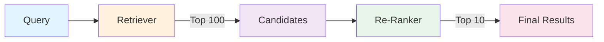
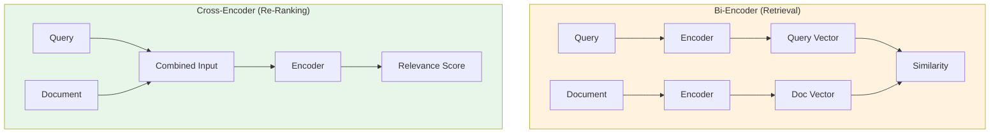
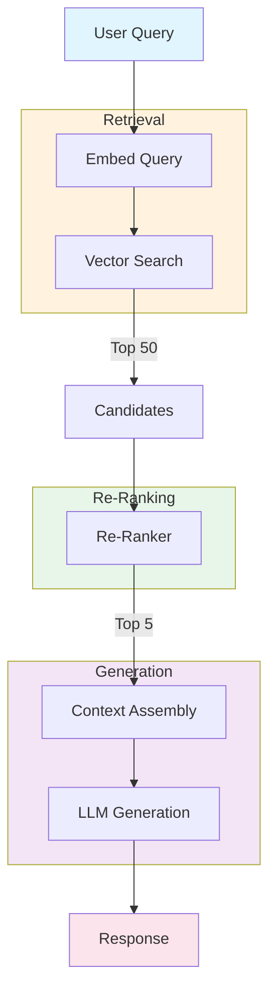

# How to Create Re-Ranking

Author: [nawazdhandala](https://github.com/nawazdhandala)

Tags: RAG, Search, AI, NLP

Description: A practical guide to implementing re-ranking in search and RAG systems to dramatically improve result relevance by scoring and reordering initial retrieval results.

---

> Initial retrieval gets you candidates. **Re-ranking gets you the right answers.**

When building search systems or Retrieval-Augmented Generation (RAG) pipelines, the first-pass retrieval (whether vector similarity, BM25, or hybrid) often returns "good enough" results. But "good enough" leaves precision on the table. Re-ranking is the technique that takes those initial candidates and reorders them using a more sophisticated model to surface the most relevant documents first.

This guide walks through:

1. Why re-ranking matters (and when to skip it)
2. How re-ranking fits into the retrieval pipeline
3. Popular re-ranking approaches (cross-encoders, LLM-based, learned)
4. Practical implementation in Python and TypeScript
5. Performance considerations and production patterns

---

## What is Re-Ranking?

Re-ranking is a two-stage retrieval pattern:

1. **Stage 1 (Retrieval)**: Fast, approximate search returns top-k candidates (e.g., 100 documents)
2. **Stage 2 (Re-ranking)**: A more accurate (but slower) model scores each candidate against the query and reorders them

The key insight: retrieval models optimize for recall (finding relevant documents), while re-rankers optimize for precision (ordering them correctly).



---

## Why Re-Ranking Matters

| Without Re-Ranking | With Re-Ranking |
|-------------------|-----------------|
| Vector search returns semantically similar but not always relevant | Cross-encoder evaluates query-document pairs for true relevance |
| BM25 matches keywords but misses intent | Re-ranker understands context and nuance |
| Results ordered by embedding distance | Results ordered by actual relevance score |
| Fast but imprecise | Precise where it matters (top results) |

Real-world impact: Re-ranking typically improves Mean Reciprocal Rank (MRR) by 10-30% and NDCG@10 by 15-40% depending on your baseline retriever quality.

---

## When to Use Re-Ranking

**Use re-ranking when:**
- Search quality directly impacts user experience or business outcomes
- Your retrieval candidates are "close but not quite right"
- You have latency budget for the additional computation (50-200ms typical)
- You're building RAG and context window is limited (need the best 3-5 docs, not 20)

**Skip re-ranking when:**
- Retrieval quality is already excellent
- Latency requirements are extremely tight (< 50ms total)
- You're processing thousands of queries per second without GPU resources
- The use case is exploratory (users will scroll through results anyway)

---

## Re-Ranking Approaches

### 1. Cross-Encoder Re-Ranking

Cross-encoders process query and document together, allowing full attention between them. This produces much better relevance scores than bi-encoders (used in vector search) which encode query and document separately.



### 2. LLM-Based Re-Ranking

Use a language model to score or compare documents. More expensive but can leverage world knowledge and handle complex relevance judgments.

### 3. Learned Re-Rankers

Train a model on your specific domain with labeled relevance data. Best precision but requires training infrastructure and labeled data.

---

## Implementation: Cross-Encoder Re-Ranking

### Python with sentence-transformers

The sentence-transformers library provides pre-trained cross-encoder models that work out of the box.

```python
# Install: pip install sentence-transformers

from sentence_transformers import CrossEncoder
from typing import List, Tuple

# Load a pre-trained cross-encoder model optimized for re-ranking
# ms-marco models are trained on search relevance data
model = CrossEncoder('cross-encoder/ms-marco-MiniLM-L-6-v2', max_length=512)

def rerank_documents(
    query: str,
    documents: List[str],
    top_k: int = 10
) -> List[Tuple[int, str, float]]:
    """
    Re-rank documents based on relevance to query.

    Args:
        query: The search query
        documents: List of document texts from initial retrieval
        top_k: Number of top results to return

    Returns:
        List of (original_index, document, score) tuples, sorted by relevance
    """
    # Create query-document pairs for the cross-encoder
    # Each pair will be scored independently
    pairs = [[query, doc] for doc in documents]

    # Get relevance scores for all pairs
    # The model outputs a single score per pair
    scores = model.predict(pairs)

    # Combine with original indices and sort by score descending
    scored_docs = [
        (idx, doc, float(score))
        for idx, (doc, score) in enumerate(zip(documents, scores))
    ]
    scored_docs.sort(key=lambda x: x[2], reverse=True)

    return scored_docs[:top_k]


# Example usage
if __name__ == "__main__":
    query = "How do I monitor Kubernetes pods?"

    # Simulated retrieval results (in practice, from vector search or BM25)
    retrieved_docs = [
        "Kubernetes pod monitoring requires metrics collection from the kubelet.",
        "Docker containers can be monitored using cAdvisor metrics.",
        "To check pod status, use kubectl get pods command.",
        "Prometheus is commonly used for Kubernetes monitoring.",
        "Pod resource limits should be set in the deployment spec.",
        "OneUptime provides real-time Kubernetes monitoring dashboards.",
        "Container orchestration platforms need observability solutions.",
        "The kubectl logs command shows container output.",
    ]

    # Re-rank the documents
    results = rerank_documents(query, retrieved_docs, top_k=5)

    print(f"Query: {query}\n")
    print("Re-ranked results:")
    for idx, doc, score in results:
        print(f"  [{score:.3f}] (orig #{idx}): {doc[:60]}...")
```

### Output explanation

The cross-encoder assigns relevance scores where higher means more relevant. Documents about Kubernetes monitoring will score higher than generic container docs, even if the vector embeddings were similar.

---

## Implementation: Batch Re-Ranking for Production

For production systems, batch processing improves throughput significantly.

```python
# Production-ready re-ranker with batching and caching

import hashlib
from functools import lru_cache
from typing import List, Dict, Any, Optional
from dataclasses import dataclass
import numpy as np
from sentence_transformers import CrossEncoder

@dataclass
class RerankResult:
    """Structured result from re-ranking."""
    document_id: str
    text: str
    score: float
    original_rank: int

class ProductionReranker:
    """
    Production-ready re-ranker with batching, caching, and error handling.
    """

    def __init__(
        self,
        model_name: str = 'cross-encoder/ms-marco-MiniLM-L-6-v2',
        batch_size: int = 32,
        max_length: int = 512,
        device: Optional[str] = None  # 'cuda', 'cpu', or None for auto
    ):
        self.model = CrossEncoder(
            model_name,
            max_length=max_length,
            device=device
        )
        self.batch_size = batch_size
        self._cache: Dict[str, float] = {}

    def _cache_key(self, query: str, doc: str) -> str:
        """Generate cache key for query-document pair."""
        combined = f"{query}|||{doc}"
        return hashlib.md5(combined.encode()).hexdigest()

    def rerank(
        self,
        query: str,
        documents: List[Dict[str, Any]],
        top_k: int = 10,
        score_threshold: Optional[float] = None,
        use_cache: bool = True
    ) -> List[RerankResult]:
        """
        Re-rank documents with production features.

        Args:
            query: Search query
            documents: List of dicts with 'id' and 'text' keys
            top_k: Maximum results to return
            score_threshold: Minimum score to include (optional)
            use_cache: Whether to use score caching

        Returns:
            List of RerankResult objects sorted by relevance
        """
        if not documents:
            return []

        # Separate cached and uncached pairs
        pairs_to_score = []
        cached_scores = {}

        for doc in documents:
            cache_key = self._cache_key(query, doc['text'])
            if use_cache and cache_key in self._cache:
                cached_scores[doc['id']] = self._cache[cache_key]
            else:
                pairs_to_score.append((doc, cache_key))

        # Score uncached pairs in batches
        if pairs_to_score:
            all_pairs = [[query, doc['text']] for doc, _ in pairs_to_score]

            # Process in batches for memory efficiency
            all_scores = []
            for i in range(0, len(all_pairs), self.batch_size):
                batch = all_pairs[i:i + self.batch_size]
                batch_scores = self.model.predict(batch)
                all_scores.extend(batch_scores)

            # Update cache and scores
            for (doc, cache_key), score in zip(pairs_to_score, all_scores):
                score_float = float(score)
                if use_cache:
                    self._cache[cache_key] = score_float
                cached_scores[doc['id']] = score_float

        # Build results
        results = []
        for idx, doc in enumerate(documents):
            score = cached_scores[doc['id']]

            # Apply threshold filter
            if score_threshold is not None and score < score_threshold:
                continue

            results.append(RerankResult(
                document_id=doc['id'],
                text=doc['text'],
                score=score,
                original_rank=idx
            ))

        # Sort by score descending
        results.sort(key=lambda x: x.score, reverse=True)

        return results[:top_k]

    def clear_cache(self):
        """Clear the score cache."""
        self._cache.clear()


# Usage example
if __name__ == "__main__":
    reranker = ProductionReranker(device='cpu')  # Use 'cuda' for GPU

    query = "best practices for incident response"

    documents = [
        {"id": "doc1", "text": "Incident response requires clear communication channels."},
        {"id": "doc2", "text": "Database backups should be tested regularly."},
        {"id": "doc3", "text": "On-call rotations help distribute incident load."},
        {"id": "doc4", "text": "Post-incident reviews improve future response times."},
        {"id": "doc5", "text": "Server monitoring detects issues before users report them."},
    ]

    results = reranker.rerank(
        query=query,
        documents=documents,
        top_k=3,
        score_threshold=0.0  # Only include positive relevance
    )

    for r in results:
        print(f"[{r.score:.3f}] {r.document_id}: {r.text}")
```

---

## Implementation: TypeScript/Node.js Re-Ranker

For Node.js applications, you can use the Transformers.js library or call a Python service.

### Option 1: Using Transformers.js (runs in Node.js)

```typescript
// Install: npm install @xenova/transformers

import { pipeline, env } from '@xenova/transformers';

// Configure model caching directory
env.cacheDir = './.cache/models';

interface Document {
  id: string;
  text: string;
}

interface RerankResult {
  documentId: string;
  text: string;
  score: number;
  originalRank: number;
}

// Singleton pattern to avoid reloading the model
let rerankerPipeline: any = null;

async function getReranker() {
  if (!rerankerPipeline) {
    // Load cross-encoder model for text classification
    // This model outputs relevance scores for query-document pairs
    rerankerPipeline = await pipeline(
      'text-classification',
      'Xenova/ms-marco-MiniLM-L-6-v2'
    );
  }
  return rerankerPipeline;
}

export async function rerankDocuments(
  query: string,
  documents: Document[],
  topK: number = 10
): Promise<RerankResult[]> {
  const reranker = await getReranker();

  // Score each document against the query
  const scoredDocs: RerankResult[] = [];

  for (let i = 0; i < documents.length; i++) {
    const doc = documents[i];

    // Format input as query-document pair
    // The model expects this specific format
    const input = `${query} [SEP] ${doc.text}`;

    // Get relevance score
    const result = await reranker(input);
    const score = result[0]?.score ?? 0;

    scoredDocs.push({
      documentId: doc.id,
      text: doc.text,
      score: score,
      originalRank: i
    });
  }

  // Sort by score descending and return top-k
  scoredDocs.sort((a, b) => b.score - a.score);
  return scoredDocs.slice(0, topK);
}

// Example usage
async function main() {
  const query = "How to set up alerting for service downtime?";

  const documents: Document[] = [
    { id: "1", text: "Configure alert thresholds based on SLO targets." },
    { id: "2", text: "Kubernetes deployments use YAML manifests." },
    { id: "3", text: "OneUptime sends alerts via email, Slack, and PagerDuty." },
    { id: "4", text: "Downtime alerts should trigger within 60 seconds." },
    { id: "5", text: "Container images are stored in registries." },
  ];

  const results = await rerankDocuments(query, documents, 3);

  console.log(`Query: ${query}\n`);
  console.log("Re-ranked results:");
  for (const r of results) {
    console.log(`  [${r.score.toFixed(3)}] ${r.documentId}: ${r.text}`);
  }
}

main().catch(console.error);
```

### Option 2: Calling a Python Re-Ranking Service

For better performance, run the re-ranker as a separate service.

```typescript
// reranker-client.ts
// Calls a Python FastAPI re-ranking service

interface Document {
  id: string;
  text: string;
}

interface RerankResult {
  document_id: string;
  text: string;
  score: number;
  original_rank: number;
}

interface RerankRequest {
  query: string;
  documents: Document[];
  top_k: number;
}

export class RerankerClient {
  private baseUrl: string;

  constructor(baseUrl: string = 'http://localhost:8000') {
    this.baseUrl = baseUrl;
  }

  async rerank(
    query: string,
    documents: Document[],
    topK: number = 10
  ): Promise<RerankResult[]> {
    const request: RerankRequest = {
      query,
      documents,
      top_k: topK
    };

    const response = await fetch(`${this.baseUrl}/rerank`, {
      method: 'POST',
      headers: { 'Content-Type': 'application/json' },
      body: JSON.stringify(request)
    });

    if (!response.ok) {
      throw new Error(`Rerank request failed: ${response.statusText}`);
    }

    return response.json();
  }
}

// Corresponding FastAPI service (Python)
/*
# reranker_service.py
# Run with: uvicorn reranker_service:app --host 0.0.0.0 --port 8000

from fastapi import FastAPI
from pydantic import BaseModel
from typing import List
from sentence_transformers import CrossEncoder

app = FastAPI()
model = CrossEncoder('cross-encoder/ms-marco-MiniLM-L-6-v2')

class Document(BaseModel):
    id: str
    text: str

class RerankRequest(BaseModel):
    query: str
    documents: List[Document]
    top_k: int = 10

class RerankResult(BaseModel):
    document_id: str
    text: str
    score: float
    original_rank: int

@app.post("/rerank", response_model=List[RerankResult])
async def rerank(request: RerankRequest):
    pairs = [[request.query, doc.text] for doc in request.documents]
    scores = model.predict(pairs)

    results = [
        RerankResult(
            document_id=doc.id,
            text=doc.text,
            score=float(score),
            original_rank=idx
        )
        for idx, (doc, score) in enumerate(zip(request.documents, scores))
    ]

    results.sort(key=lambda x: x.score, reverse=True)
    return results[:request.top_k]
*/
```

---

## LLM-Based Re-Ranking

For cases where you need more nuanced relevance judgments, use an LLM to score documents.

```python
# LLM-based re-ranker using OpenAI or similar

import json
from typing import List, Dict, Any
from openai import OpenAI

client = OpenAI()  # Uses OPENAI_API_KEY env var

def llm_rerank(
    query: str,
    documents: List[Dict[str, Any]],
    top_k: int = 5
) -> List[Dict[str, Any]]:
    """
    Use an LLM to re-rank documents based on relevance to query.

    This approach is more expensive but can handle complex relevance
    judgments that cross-encoders might miss.
    """

    # Format documents for the prompt
    doc_list = "\n".join([
        f"[{i}] {doc['text'][:500]}"  # Truncate long docs
        for i, doc in enumerate(documents)
    ])

    prompt = f"""You are a search relevance expert. Given a query and a list of documents,
rank the documents by relevance to the query.

Query: {query}

Documents:
{doc_list}

Return a JSON array of document indices ordered by relevance (most relevant first).
Only include indices of documents that are actually relevant to the query.
Format: [index1, index2, index3, ...]

Respond with only the JSON array, no explanation."""

    response = client.chat.completions.create(
        model="gpt-4o-mini",  # Fast and cost-effective for ranking
        messages=[{"role": "user", "content": prompt}],
        temperature=0,  # Deterministic output
        max_tokens=100
    )

    # Parse the ranking from the response
    ranking_text = response.choices[0].message.content.strip()
    try:
        ranked_indices = json.loads(ranking_text)
    except json.JSONDecodeError:
        # Fallback to original order if parsing fails
        ranked_indices = list(range(len(documents)))

    # Build results in ranked order
    results = []
    for rank, idx in enumerate(ranked_indices[:top_k]):
        if 0 <= idx < len(documents):
            doc = documents[idx].copy()
            doc['rerank_position'] = rank
            doc['original_position'] = idx
            results.append(doc)

    return results


# Pairwise comparison for higher accuracy (more expensive)
def llm_rerank_pairwise(
    query: str,
    documents: List[Dict[str, Any]],
    top_k: int = 5
) -> List[Dict[str, Any]]:
    """
    Compare documents pairwise for more accurate ranking.
    O(n^2) comparisons, use only for small candidate sets.
    """

    n = len(documents)
    wins = [0] * n  # Count wins for each document

    for i in range(n):
        for j in range(i + 1, n):
            prompt = f"""Which document is more relevant to the query?

Query: {query}

Document A: {documents[i]['text'][:300]}

Document B: {documents[j]['text'][:300]}

Reply with only "A" or "B"."""

            response = client.chat.completions.create(
                model="gpt-4o-mini",
                messages=[{"role": "user", "content": prompt}],
                temperature=0,
                max_tokens=1
            )

            winner = response.choices[0].message.content.strip().upper()
            if winner == "A":
                wins[i] += 1
            else:
                wins[j] += 1

    # Sort by win count
    ranked = sorted(
        enumerate(documents),
        key=lambda x: wins[x[0]],
        reverse=True
    )

    return [doc for _, doc in ranked[:top_k]]
```

---

## Integration with RAG Pipeline

Here is how re-ranking fits into a complete RAG system.



### Complete RAG Example with Re-Ranking

```python
# Complete RAG pipeline with re-ranking

from typing import List, Optional
from dataclasses import dataclass
from sentence_transformers import SentenceTransformer, CrossEncoder
import numpy as np
from openai import OpenAI

@dataclass
class Document:
    id: str
    text: str
    embedding: Optional[np.ndarray] = None

class RAGPipeline:
    """
    RAG pipeline with two-stage retrieval:
    1. Vector search for initial candidates
    2. Cross-encoder re-ranking for precision
    """

    def __init__(self):
        # Bi-encoder for fast retrieval
        self.embedder = SentenceTransformer('all-MiniLM-L6-v2')

        # Cross-encoder for accurate re-ranking
        self.reranker = CrossEncoder('cross-encoder/ms-marco-MiniLM-L-6-v2')

        # LLM for generation
        self.llm = OpenAI()

        # Document store (in production, use a vector database)
        self.documents: List[Document] = []

    def add_documents(self, texts: List[str]):
        """Index documents with embeddings."""
        embeddings = self.embedder.encode(texts, convert_to_numpy=True)

        for i, (text, emb) in enumerate(zip(texts, embeddings)):
            self.documents.append(Document(
                id=f"doc_{len(self.documents)}",
                text=text,
                embedding=emb
            ))

    def retrieve(self, query: str, top_k: int = 50) -> List[Document]:
        """Stage 1: Fast vector similarity search."""
        query_embedding = self.embedder.encode(query, convert_to_numpy=True)

        # Compute similarities (in production, use vector DB)
        similarities = []
        for doc in self.documents:
            sim = np.dot(query_embedding, doc.embedding) / (
                np.linalg.norm(query_embedding) * np.linalg.norm(doc.embedding)
            )
            similarities.append((doc, sim))

        # Sort by similarity
        similarities.sort(key=lambda x: x[1], reverse=True)
        return [doc for doc, _ in similarities[:top_k]]

    def rerank(self, query: str, docs: List[Document], top_k: int = 5) -> List[Document]:
        """Stage 2: Cross-encoder re-ranking for precision."""
        if not docs:
            return []

        pairs = [[query, doc.text] for doc in docs]
        scores = self.reranker.predict(pairs)

        scored = list(zip(docs, scores))
        scored.sort(key=lambda x: x[1], reverse=True)

        return [doc for doc, _ in scored[:top_k]]

    def generate(self, query: str, context_docs: List[Document]) -> str:
        """Generate answer using retrieved context."""
        context = "\n\n".join([
            f"[{i+1}] {doc.text}"
            for i, doc in enumerate(context_docs)
        ])

        response = self.llm.chat.completions.create(
            model="gpt-4o-mini",
            messages=[
                {
                    "role": "system",
                    "content": "Answer the question based on the provided context. "
                               "Cite sources using [1], [2], etc."
                },
                {
                    "role": "user",
                    "content": f"Context:\n{context}\n\nQuestion: {query}"
                }
            ],
            temperature=0.7,
            max_tokens=500
        )

        return response.choices[0].message.content

    def query(
        self,
        question: str,
        retrieve_k: int = 50,
        rerank_k: int = 5
    ) -> str:
        """
        Full RAG pipeline: retrieve -> rerank -> generate
        """
        # Stage 1: Get candidates
        candidates = self.retrieve(question, top_k=retrieve_k)

        # Stage 2: Re-rank for precision
        top_docs = self.rerank(question, candidates, top_k=rerank_k)

        # Stage 3: Generate answer
        answer = self.generate(question, top_docs)

        return answer


# Example usage
if __name__ == "__main__":
    pipeline = RAGPipeline()

    # Add knowledge base documents
    knowledge_base = [
        "OneUptime provides real-time monitoring for web applications and APIs.",
        "Incident management includes alert routing, on-call schedules, and escalations.",
        "Status pages communicate service health to customers during outages.",
        "Synthetic monitoring runs automated checks from multiple global locations.",
        "Log management helps debug issues by searching and analyzing log data.",
        "APM traces show request flow across microservices for performance analysis.",
        "SLOs define reliability targets and track error budgets over time.",
        "The alerting system supports multiple channels: email, Slack, PagerDuty, and webhooks.",
    ]

    pipeline.add_documents(knowledge_base)

    # Query the system
    question = "How can I notify my team when a service goes down?"
    answer = pipeline.query(question)

    print(f"Question: {question}\n")
    print(f"Answer: {answer}")
```

---

## Performance Optimization

### Latency Budget Breakdown

| Stage | Typical Latency | Optimization |
|-------|----------------|--------------|
| Vector search | 10-50ms | Use approximate nearest neighbors (HNSW) |
| Re-ranking (50 docs) | 50-150ms | Batch processing, GPU acceleration |
| LLM generation | 500-2000ms | Streaming, model selection |

### Caching Strategies

```python
# Efficient caching for re-ranking scores

from functools import lru_cache
import hashlib
from typing import Tuple

class CachedReranker:
    """Re-ranker with query-document score caching."""

    def __init__(self, model_name: str = 'cross-encoder/ms-marco-MiniLM-L-6-v2'):
        self.model = CrossEncoder(model_name)
        self._score_cache = {}

    def _cache_key(self, query: str, doc_text: str) -> str:
        """Create stable cache key for query-doc pair."""
        combined = f"{query}:::{doc_text}"
        return hashlib.sha256(combined.encode()).hexdigest()[:16]

    def score_pair(self, query: str, doc_text: str) -> float:
        """Get cached or compute relevance score."""
        key = self._cache_key(query, doc_text)

        if key not in self._score_cache:
            score = float(self.model.predict([[query, doc_text]])[0])
            self._score_cache[key] = score

        return self._score_cache[key]

    def rerank_with_cache(
        self,
        query: str,
        documents: List[Dict[str, str]],
        top_k: int = 10
    ) -> List[Tuple[Dict[str, str], float]]:
        """Re-rank using cached scores where available."""

        # Separate cached vs uncached
        uncached_docs = []
        cached_scores = {}

        for doc in documents:
            key = self._cache_key(query, doc['text'])
            if key in self._score_cache:
                cached_scores[doc['id']] = self._score_cache[key]
            else:
                uncached_docs.append(doc)

        # Batch score uncached documents
        if uncached_docs:
            pairs = [[query, doc['text']] for doc in uncached_docs]
            scores = self.model.predict(pairs)

            for doc, score in zip(uncached_docs, scores):
                key = self._cache_key(query, doc['text'])
                self._score_cache[key] = float(score)
                cached_scores[doc['id']] = float(score)

        # Sort all documents by score
        results = [(doc, cached_scores[doc['id']]) for doc in documents]
        results.sort(key=lambda x: x[1], reverse=True)

        return results[:top_k]
```

---

## Evaluation Metrics

Track these metrics to measure re-ranking effectiveness.

```python
# Evaluation utilities for re-ranking quality

from typing import List, Dict
import numpy as np

def mean_reciprocal_rank(
    relevance_labels: List[List[int]]
) -> float:
    """
    Calculate MRR across multiple queries.
    relevance_labels: List of binary relevance lists (1=relevant, 0=not)
    """
    rr_sum = 0.0
    for labels in relevance_labels:
        for i, rel in enumerate(labels):
            if rel == 1:
                rr_sum += 1.0 / (i + 1)
                break
    return rr_sum / len(relevance_labels)


def ndcg_at_k(
    relevance_scores: List[int],
    k: int = 10
) -> float:
    """
    Normalized Discounted Cumulative Gain at position k.
    relevance_scores: Graded relevance (0, 1, 2, 3...)
    """
    relevance_scores = relevance_scores[:k]

    # DCG
    dcg = sum(
        rel / np.log2(i + 2)
        for i, rel in enumerate(relevance_scores)
    )

    # Ideal DCG (perfect ranking)
    ideal = sorted(relevance_scores, reverse=True)
    idcg = sum(
        rel / np.log2(i + 2)
        for i, rel in enumerate(ideal)
    )

    return dcg / idcg if idcg > 0 else 0.0


def evaluate_reranker(
    queries: List[str],
    documents: List[List[Dict]],
    relevance: List[List[int]],
    rerank_fn
) -> Dict[str, float]:
    """
    Evaluate a re-ranking function on a test set.
    """
    mrr_scores = []
    ndcg_scores = []

    for query, docs, rels in zip(queries, documents, relevance):
        # Get re-ranked order
        reranked = rerank_fn(query, docs)
        reranked_ids = [d['id'] for d in reranked]

        # Map relevance to new order
        id_to_rel = {doc['id']: rel for doc, rel in zip(docs, rels)}
        new_rels = [id_to_rel.get(did, 0) for did in reranked_ids]

        # Calculate metrics
        mrr_scores.append([new_rels])
        ndcg_scores.append(ndcg_at_k(new_rels, k=10))

    return {
        'mrr': mean_reciprocal_rank(mrr_scores),
        'ndcg@10': np.mean(ndcg_scores)
    }
```

---

## Common Pitfalls and Solutions

| Pitfall | Problem | Solution |
|---------|---------|----------|
| Re-ranking too few candidates | Miss relevant docs | Retrieve 50-100, re-rank to 5-10 |
| Re-ranking too many | Latency blows up | Cap at 100 candidates |
| Ignoring document length | Long docs dominate | Truncate or chunk documents |
| No caching | Repeated computation | Cache query-doc scores |
| Wrong model size | Speed vs accuracy tradeoff | Start small (MiniLM), scale up if needed |
| Mixing domains | Model trained on web search, used for code | Fine-tune or use domain-specific models |

---

## Model Selection Guide

| Model | Speed | Accuracy | Best For |
|-------|-------|----------|----------|
| ms-marco-MiniLM-L-6-v2 | Fast | Good | General web search, production |
| ms-marco-MiniLM-L-12-v2 | Medium | Better | Higher quality needs |
| BGE Reranker | Medium | Excellent | Multilingual, diverse domains |
| Cohere Rerank API | Fast | Excellent | No GPU, managed service |
| GPT-4 / Claude | Slow | Best | Complex relevance, small sets |

---

## Summary

Re-ranking is the precision layer in modern search and RAG systems. The key takeaways:

1. **Two-stage retrieval** (fast recall + accurate re-ranking) beats single-stage
2. **Cross-encoders** are the sweet spot for most use cases
3. **Batch processing** and **caching** are essential for production
4. **Measure** with MRR and NDCG to track improvements
5. **Start simple** (MiniLM) and scale up only if needed

The retriever finds the haystack. The re-ranker finds the needle.

---

**Related Reading:**

- [What are Traces and Spans in OpenTelemetry](https://oneuptime.com/blog/post/2025-08-27-traces-and-spans-in-opentelemetry/view)
- [How to reduce noise in OpenTelemetry](https://oneuptime.com/blog/post/2025-08-25-how-to-reduce-noise-in-opentelemetry/view)
