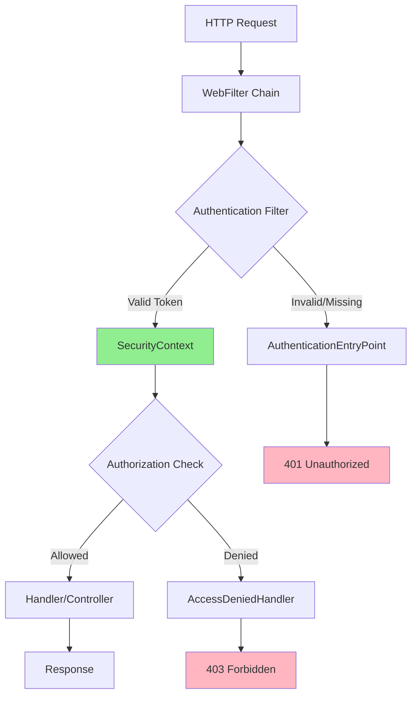
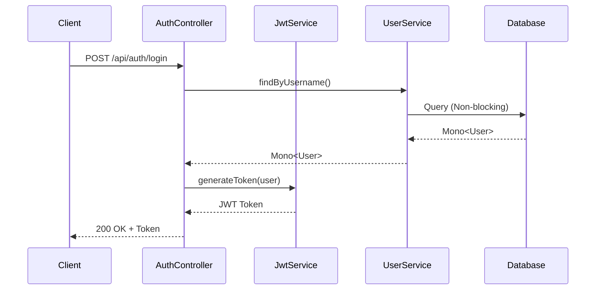
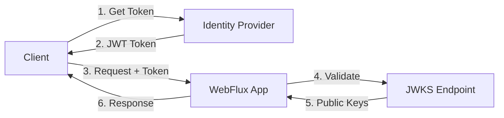
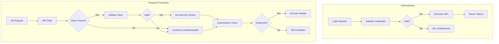

# How to Build Reactive Security in Spring WebFlux

Author: [nawazdhandala](https://github.com/nawazdhandala)

Tags: Spring WebFlux, Spring Security, Reactive Programming, Java, Authentication, Authorization, JWT, OAuth2

Description: A comprehensive guide to implementing security in reactive Spring WebFlux applications. Learn how to configure authentication, authorization, JWT tokens, and OAuth2 while maintaining non-blocking behavior throughout your security chain.

---

> Security in reactive applications requires a different approach than traditional Spring MVC. This guide shows you how to implement production-ready security in Spring WebFlux without blocking the event loop.

Traditional Spring Security uses servlet filters and thread-local storage for authentication context. In WebFlux, everything must be non-blocking, and the security context flows through the reactive stream using Reactor's `Context`. Let's build a secure reactive application from the ground up.

---

## Reactive Security Architecture

Understanding how security flows through a reactive application is essential before writing code.



---

## Project Setup

Add the required dependencies to your `pom.xml`:

```xml
<!-- pom.xml -->
<dependencies>
    <!-- Spring WebFlux for reactive web support -->
    <dependency>
        <groupId>org.springframework.boot</groupId>
        <artifactId>spring-boot-starter-webflux</artifactId>
    </dependency>

    <!-- Reactive Security for WebFlux applications -->
    <dependency>
        <groupId>org.springframework.boot</groupId>
        <artifactId>spring-boot-starter-security</artifactId>
    </dependency>

    <!-- JWT library for token handling -->
    <dependency>
        <groupId>io.jsonwebtoken</groupId>
        <artifactId>jjwt-api</artifactId>
        <version>0.12.3</version>
    </dependency>
    <dependency>
        <groupId>io.jsonwebtoken</groupId>
        <artifactId>jjwt-impl</artifactId>
        <version>0.12.3</version>
        <scope>runtime</scope>
    </dependency>
    <dependency>
        <groupId>io.jsonwebtoken</groupId>
        <artifactId>jjwt-jackson</artifactId>
        <version>0.12.3</version>
        <scope>runtime</scope>
    </dependency>

    <!-- Reactive MongoDB for user storage -->
    <dependency>
        <groupId>org.springframework.boot</groupId>
        <artifactId>spring-boot-starter-data-mongodb-reactive</artifactId>
    </dependency>
</dependencies>
```

---

## Basic Security Configuration

The foundation of reactive security starts with `SecurityWebFilterChain`. Unlike the servlet-based `SecurityFilterChain`, this works with Project Reactor types.

This configuration sets up CSRF protection, endpoint security rules, and authentication handling for a reactive application:

```java
// SecurityConfig.java
package com.example.security.config;

import org.springframework.context.annotation.Bean;
import org.springframework.context.annotation.Configuration;
import org.springframework.http.HttpMethod;
import org.springframework.http.HttpStatus;
import org.springframework.security.config.annotation.method.configuration.EnableReactiveMethodSecurity;
import org.springframework.security.config.annotation.web.reactive.EnableWebFluxSecurity;
import org.springframework.security.config.web.server.SecurityWebFiltersOrder;
import org.springframework.security.config.web.server.ServerHttpSecurity;
import org.springframework.security.crypto.bcrypt.BCryptPasswordEncoder;
import org.springframework.security.crypto.password.PasswordEncoder;
import org.springframework.security.web.server.SecurityWebFilterChain;
import org.springframework.security.web.server.authentication.HttpStatusServerEntryPoint;
import org.springframework.security.web.server.authorization.HttpStatusServerAccessDeniedHandler;
import reactor.core.publisher.Mono;

@Configuration
@EnableWebFluxSecurity
@EnableReactiveMethodSecurity
public class SecurityConfig {

    private final JwtAuthenticationFilter jwtAuthenticationFilter;

    public SecurityConfig(JwtAuthenticationFilter jwtAuthenticationFilter) {
        this.jwtAuthenticationFilter = jwtAuthenticationFilter;
    }

    @Bean
    public SecurityWebFilterChain securityWebFilterChain(ServerHttpSecurity http) {
        return http
            // Disable CSRF for stateless JWT authentication
            .csrf(ServerHttpSecurity.CsrfSpec::disable)

            // Configure exception handling for authentication failures
            .exceptionHandling(exceptionHandling -> exceptionHandling
                .authenticationEntryPoint(new HttpStatusServerEntryPoint(HttpStatus.UNAUTHORIZED))
                .accessDeniedHandler(new HttpStatusServerAccessDeniedHandler(HttpStatus.FORBIDDEN))
            )

            // Define authorization rules for different endpoints
            .authorizeExchange(exchanges -> exchanges
                // Public endpoints that don't require authentication
                .pathMatchers("/api/auth/**").permitAll()
                .pathMatchers("/actuator/health").permitAll()
                .pathMatchers(HttpMethod.OPTIONS).permitAll()

                // Admin-only endpoints
                .pathMatchers("/api/admin/**").hasRole("ADMIN")

                // User endpoints require authentication
                .pathMatchers("/api/users/**").hasAnyRole("USER", "ADMIN")

                // All other requests require authentication
                .anyExchange().authenticated()
            )

            // Add JWT filter before the authentication filter
            .addFilterAt(jwtAuthenticationFilter, SecurityWebFiltersOrder.AUTHENTICATION)

            // Disable form login and HTTP basic for API
            .formLogin(ServerHttpSecurity.FormLoginSpec::disable)
            .httpBasic(ServerHttpSecurity.HttpBasicSpec::disable)

            .build();
    }

    @Bean
    public PasswordEncoder passwordEncoder() {
        return new BCryptPasswordEncoder(12);
    }
}
```

---

## JWT Token Service

The JWT service handles token creation, validation, and claims extraction. All operations must be non-blocking to maintain the reactive nature of the application.



The JWT service encapsulates all token operations including generation, validation, and claims extraction:

```java
// JwtService.java
package com.example.security.service;

import io.jsonwebtoken.Claims;
import io.jsonwebtoken.JwtException;
import io.jsonwebtoken.Jwts;
import io.jsonwebtoken.security.Keys;
import org.springframework.beans.factory.annotation.Value;
import org.springframework.security.core.GrantedAuthority;
import org.springframework.security.core.authority.SimpleGrantedAuthority;
import org.springframework.stereotype.Service;
import reactor.core.publisher.Mono;

import javax.crypto.SecretKey;
import java.nio.charset.StandardCharsets;
import java.time.Instant;
import java.util.Collection;
import java.util.Date;
import java.util.List;
import java.util.stream.Collectors;

@Service
public class JwtService {

    private final SecretKey secretKey;
    private final long accessTokenExpiration;
    private final long refreshTokenExpiration;

    public JwtService(
            @Value("${jwt.secret}") String secret,
            @Value("${jwt.access-token-expiration:3600000}") long accessTokenExpiration,
            @Value("${jwt.refresh-token-expiration:604800000}") long refreshTokenExpiration) {

        // Create signing key from secret
        this.secretKey = Keys.hmacShaKeyFor(secret.getBytes(StandardCharsets.UTF_8));
        this.accessTokenExpiration = accessTokenExpiration;
        this.refreshTokenExpiration = refreshTokenExpiration;
    }

    // Generate access token with user details and roles embedded as claims
    public String generateAccessToken(String username, Collection<? extends GrantedAuthority> authorities) {
        Instant now = Instant.now();

        // Extract role names from authorities
        List<String> roles = authorities.stream()
            .map(GrantedAuthority::getAuthority)
            .collect(Collectors.toList());

        return Jwts.builder()
            .subject(username)
            .claim("roles", roles)
            .claim("type", "access")
            .issuedAt(Date.from(now))
            .expiration(Date.from(now.plusMillis(accessTokenExpiration)))
            .signWith(secretKey)
            .compact();
    }

    // Generate refresh token for obtaining new access tokens
    public String generateRefreshToken(String username) {
        Instant now = Instant.now();

        return Jwts.builder()
            .subject(username)
            .claim("type", "refresh")
            .issuedAt(Date.from(now))
            .expiration(Date.from(now.plusMillis(refreshTokenExpiration)))
            .signWith(secretKey)
            .compact();
    }

    // Validate token and return claims wrapped in Mono for reactive processing
    public Mono<Claims> validateToken(String token) {
        return Mono.fromCallable(() -> {
            try {
                return Jwts.parser()
                    .verifyWith(secretKey)
                    .build()
                    .parseSignedClaims(token)
                    .getPayload();
            } catch (JwtException e) {
                throw new InvalidTokenException("Invalid JWT token: " + e.getMessage());
            }
        });
    }

    // Extract username from token claims
    public Mono<String> extractUsername(String token) {
        return validateToken(token)
            .map(Claims::getSubject);
    }

    // Extract authorities from token claims for security context
    public Mono<List<GrantedAuthority>> extractAuthorities(String token) {
        return validateToken(token)
            .map(claims -> {
                @SuppressWarnings("unchecked")
                List<String> roles = claims.get("roles", List.class);

                if (roles == null) {
                    return List.of();
                }

                return roles.stream()
                    .map(SimpleGrantedAuthority::new)
                    .collect(Collectors.toList());
            });
    }

    // Check if the token is a refresh token
    public Mono<Boolean> isRefreshToken(String token) {
        return validateToken(token)
            .map(claims -> "refresh".equals(claims.get("type", String.class)));
    }
}
```

Create a custom exception for invalid tokens:

```java
// InvalidTokenException.java
package com.example.security.exception;

public class InvalidTokenException extends RuntimeException {
    public InvalidTokenException(String message) {
        super(message);
    }
}
```

---

## JWT Authentication Filter

The authentication filter intercepts requests, extracts JWT tokens, validates them, and populates the reactive security context.

This filter runs on every request and must not block the event loop:

```java
// JwtAuthenticationFilter.java
package com.example.security.filter;

import com.example.security.service.JwtService;
import org.springframework.http.HttpHeaders;
import org.springframework.http.server.reactive.ServerHttpRequest;
import org.springframework.security.authentication.UsernamePasswordAuthenticationToken;
import org.springframework.security.core.Authentication;
import org.springframework.security.core.context.ReactiveSecurityContextHolder;
import org.springframework.stereotype.Component;
import org.springframework.web.server.ServerWebExchange;
import org.springframework.web.server.WebFilter;
import org.springframework.web.server.WebFilterChain;
import reactor.core.publisher.Mono;

@Component
public class JwtAuthenticationFilter implements WebFilter {

    private static final String BEARER_PREFIX = "Bearer ";

    private final JwtService jwtService;

    public JwtAuthenticationFilter(JwtService jwtService) {
        this.jwtService = jwtService;
    }

    @Override
    public Mono<Void> filter(ServerWebExchange exchange, WebFilterChain chain) {
        // Extract token from Authorization header
        String token = extractToken(exchange.getRequest());

        if (token == null) {
            // No token present, continue without authentication
            return chain.filter(exchange);
        }

        // Validate token and create authentication
        return jwtService.validateToken(token)
            .flatMap(claims -> {
                String username = claims.getSubject();

                // Extract authorities from token
                return jwtService.extractAuthorities(token)
                    .map(authorities -> {
                        // Create authentication object
                        Authentication auth = new UsernamePasswordAuthenticationToken(
                            username,
                            null,
                            authorities
                        );
                        return auth;
                    });
            })
            // Continue filter chain with security context populated
            .flatMap(auth -> chain.filter(exchange)
                .contextWrite(ReactiveSecurityContextHolder.withAuthentication(auth)))
            // If token validation fails, continue without authentication
            .onErrorResume(e -> chain.filter(exchange));
    }

    // Extract Bearer token from Authorization header
    private String extractToken(ServerHttpRequest request) {
        String authHeader = request.getHeaders().getFirst(HttpHeaders.AUTHORIZATION);

        if (authHeader != null && authHeader.startsWith(BEARER_PREFIX)) {
            return authHeader.substring(BEARER_PREFIX.length());
        }

        return null;
    }
}
```

---

## Reactive User Details Service

The user details service loads user information from the database reactively. This replaces the traditional blocking `UserDetailsService`.

```java
// ReactiveUserDetailsServiceImpl.java
package com.example.security.service;

import com.example.security.model.User;
import com.example.security.repository.UserRepository;
import org.springframework.security.core.authority.SimpleGrantedAuthority;
import org.springframework.security.core.userdetails.ReactiveUserDetailsService;
import org.springframework.security.core.userdetails.UserDetails;
import org.springframework.security.core.userdetails.UsernameNotFoundException;
import org.springframework.stereotype.Service;
import reactor.core.publisher.Mono;

import java.util.stream.Collectors;

@Service
public class ReactiveUserDetailsServiceImpl implements ReactiveUserDetailsService {

    private final UserRepository userRepository;

    public ReactiveUserDetailsServiceImpl(UserRepository userRepository) {
        this.userRepository = userRepository;
    }

    @Override
    public Mono<UserDetails> findByUsername(String username) {
        return userRepository.findByUsername(username)
            .switchIfEmpty(Mono.error(
                new UsernameNotFoundException("User not found: " + username)
            ))
            .map(this::toUserDetails);
    }

    // Convert domain User to Spring Security UserDetails
    private UserDetails toUserDetails(User user) {
        return org.springframework.security.core.userdetails.User.builder()
            .username(user.getUsername())
            .password(user.getPassword())
            .authorities(user.getRoles().stream()
                .map(role -> new SimpleGrantedAuthority("ROLE_" + role))
                .collect(Collectors.toList()))
            .accountExpired(!user.isActive())
            .accountLocked(user.isLocked())
            .credentialsExpired(false)
            .disabled(!user.isEnabled())
            .build();
    }
}
```

Define the User entity and repository:

```java
// User.java
package com.example.security.model;

import org.springframework.data.annotation.Id;
import org.springframework.data.mongodb.core.index.Indexed;
import org.springframework.data.mongodb.core.mapping.Document;

import java.time.Instant;
import java.util.HashSet;
import java.util.Set;

@Document(collection = "users")
public class User {

    @Id
    private String id;

    @Indexed(unique = true)
    private String username;

    @Indexed(unique = true)
    private String email;

    private String password;

    private Set<String> roles = new HashSet<>();

    private boolean active = true;
    private boolean locked = false;
    private boolean enabled = true;

    private Instant createdAt;
    private Instant lastLoginAt;

    // Getters and setters
    public String getId() { return id; }
    public void setId(String id) { this.id = id; }

    public String getUsername() { return username; }
    public void setUsername(String username) { this.username = username; }

    public String getEmail() { return email; }
    public void setEmail(String email) { this.email = email; }

    public String getPassword() { return password; }
    public void setPassword(String password) { this.password = password; }

    public Set<String> getRoles() { return roles; }
    public void setRoles(Set<String> roles) { this.roles = roles; }

    public boolean isActive() { return active; }
    public void setActive(boolean active) { this.active = active; }

    public boolean isLocked() { return locked; }
    public void setLocked(boolean locked) { this.locked = locked; }

    public boolean isEnabled() { return enabled; }
    public void setEnabled(boolean enabled) { this.enabled = enabled; }

    public Instant getCreatedAt() { return createdAt; }
    public void setCreatedAt(Instant createdAt) { this.createdAt = createdAt; }

    public Instant getLastLoginAt() { return lastLoginAt; }
    public void setLastLoginAt(Instant lastLoginAt) { this.lastLoginAt = lastLoginAt; }
}
```

```java
// UserRepository.java
package com.example.security.repository;

import com.example.security.model.User;
import org.springframework.data.mongodb.repository.ReactiveMongoRepository;
import reactor.core.publisher.Mono;

public interface UserRepository extends ReactiveMongoRepository<User, String> {

    Mono<User> findByUsername(String username);

    Mono<User> findByEmail(String email);

    Mono<Boolean> existsByUsername(String username);

    Mono<Boolean> existsByEmail(String email);
}
```

---

## Authentication Controller

The authentication controller handles login, registration, and token refresh operations.

```java
// AuthController.java
package com.example.security.controller;

import com.example.security.dto.AuthRequest;
import com.example.security.dto.AuthResponse;
import com.example.security.dto.RegisterRequest;
import com.example.security.dto.RefreshRequest;
import com.example.security.service.AuthService;
import org.springframework.http.HttpStatus;
import org.springframework.http.ResponseEntity;
import org.springframework.web.bind.annotation.*;
import reactor.core.publisher.Mono;

import jakarta.validation.Valid;

@RestController
@RequestMapping("/api/auth")
public class AuthController {

    private final AuthService authService;

    public AuthController(AuthService authService) {
        this.authService = authService;
    }

    // Login endpoint returns access and refresh tokens
    @PostMapping("/login")
    public Mono<ResponseEntity<AuthResponse>> login(@Valid @RequestBody AuthRequest request) {
        return authService.authenticate(request)
            .map(ResponseEntity::ok)
            .onErrorResume(e -> Mono.just(
                ResponseEntity.status(HttpStatus.UNAUTHORIZED)
                    .body(new AuthResponse(null, null, e.getMessage()))
            ));
    }

    // Registration endpoint creates a new user
    @PostMapping("/register")
    public Mono<ResponseEntity<AuthResponse>> register(@Valid @RequestBody RegisterRequest request) {
        return authService.register(request)
            .map(response -> ResponseEntity.status(HttpStatus.CREATED).body(response))
            .onErrorResume(e -> Mono.just(
                ResponseEntity.status(HttpStatus.BAD_REQUEST)
                    .body(new AuthResponse(null, null, e.getMessage()))
            ));
    }

    // Refresh endpoint exchanges a refresh token for new tokens
    @PostMapping("/refresh")
    public Mono<ResponseEntity<AuthResponse>> refresh(@Valid @RequestBody RefreshRequest request) {
        return authService.refreshToken(request.getRefreshToken())
            .map(ResponseEntity::ok)
            .onErrorResume(e -> Mono.just(
                ResponseEntity.status(HttpStatus.UNAUTHORIZED)
                    .body(new AuthResponse(null, null, e.getMessage()))
            ));
    }
}
```

Define the DTOs for authentication:

```java
// AuthRequest.java
package com.example.security.dto;

import jakarta.validation.constraints.NotBlank;

public class AuthRequest {

    @NotBlank(message = "Username is required")
    private String username;

    @NotBlank(message = "Password is required")
    private String password;

    public String getUsername() { return username; }
    public void setUsername(String username) { this.username = username; }

    public String getPassword() { return password; }
    public void setPassword(String password) { this.password = password; }
}

// AuthResponse.java
package com.example.security.dto;

public class AuthResponse {

    private String accessToken;
    private String refreshToken;
    private String error;

    public AuthResponse(String accessToken, String refreshToken, String error) {
        this.accessToken = accessToken;
        this.refreshToken = refreshToken;
        this.error = error;
    }

    public String getAccessToken() { return accessToken; }
    public String getRefreshToken() { return refreshToken; }
    public String getError() { return error; }
}

// RegisterRequest.java
package com.example.security.dto;

import jakarta.validation.constraints.Email;
import jakarta.validation.constraints.NotBlank;
import jakarta.validation.constraints.Size;

public class RegisterRequest {

    @NotBlank(message = "Username is required")
    @Size(min = 3, max = 50, message = "Username must be between 3 and 50 characters")
    private String username;

    @NotBlank(message = "Email is required")
    @Email(message = "Invalid email format")
    private String email;

    @NotBlank(message = "Password is required")
    @Size(min = 8, message = "Password must be at least 8 characters")
    private String password;

    public String getUsername() { return username; }
    public void setUsername(String username) { this.username = username; }

    public String getEmail() { return email; }
    public void setEmail(String email) { this.email = email; }

    public String getPassword() { return password; }
    public void setPassword(String password) { this.password = password; }
}

// RefreshRequest.java
package com.example.security.dto;

import jakarta.validation.constraints.NotBlank;

public class RefreshRequest {

    @NotBlank(message = "Refresh token is required")
    private String refreshToken;

    public String getRefreshToken() { return refreshToken; }
    public void setRefreshToken(String refreshToken) { this.refreshToken = refreshToken; }
}
```

---

## Authentication Service

The authentication service implements the business logic for user authentication, registration, and token management.

```java
// AuthService.java
package com.example.security.service;

import com.example.security.dto.AuthRequest;
import com.example.security.dto.AuthResponse;
import com.example.security.dto.RegisterRequest;
import com.example.security.model.User;
import com.example.security.repository.UserRepository;
import org.springframework.security.core.authority.SimpleGrantedAuthority;
import org.springframework.security.crypto.password.PasswordEncoder;
import org.springframework.stereotype.Service;
import reactor.core.publisher.Mono;

import java.time.Instant;
import java.util.Set;
import java.util.stream.Collectors;

@Service
public class AuthService {

    private final UserRepository userRepository;
    private final PasswordEncoder passwordEncoder;
    private final JwtService jwtService;

    public AuthService(
            UserRepository userRepository,
            PasswordEncoder passwordEncoder,
            JwtService jwtService) {
        this.userRepository = userRepository;
        this.passwordEncoder = passwordEncoder;
        this.jwtService = jwtService;
    }

    // Authenticate user and return tokens
    public Mono<AuthResponse> authenticate(AuthRequest request) {
        return userRepository.findByUsername(request.getUsername())
            .switchIfEmpty(Mono.error(new RuntimeException("Invalid credentials")))
            .filter(user -> passwordEncoder.matches(request.getPassword(), user.getPassword()))
            .switchIfEmpty(Mono.error(new RuntimeException("Invalid credentials")))
            .filter(user -> user.isEnabled() && user.isActive() && !user.isLocked())
            .switchIfEmpty(Mono.error(new RuntimeException("Account is disabled or locked")))
            .flatMap(user -> {
                // Update last login timestamp
                user.setLastLoginAt(Instant.now());
                return userRepository.save(user);
            })
            .map(user -> {
                // Generate authorities from user roles
                var authorities = user.getRoles().stream()
                    .map(role -> new SimpleGrantedAuthority("ROLE_" + role))
                    .collect(Collectors.toList());

                // Generate tokens
                String accessToken = jwtService.generateAccessToken(user.getUsername(), authorities);
                String refreshToken = jwtService.generateRefreshToken(user.getUsername());

                return new AuthResponse(accessToken, refreshToken, null);
            });
    }

    // Register a new user
    public Mono<AuthResponse> register(RegisterRequest request) {
        return userRepository.existsByUsername(request.getUsername())
            .flatMap(exists -> {
                if (exists) {
                    return Mono.error(new RuntimeException("Username already exists"));
                }
                return userRepository.existsByEmail(request.getEmail());
            })
            .flatMap(exists -> {
                if (exists) {
                    return Mono.error(new RuntimeException("Email already exists"));
                }

                // Create new user
                User user = new User();
                user.setUsername(request.getUsername());
                user.setEmail(request.getEmail());
                user.setPassword(passwordEncoder.encode(request.getPassword()));
                user.setRoles(Set.of("USER"));
                user.setCreatedAt(Instant.now());
                user.setActive(true);
                user.setEnabled(true);
                user.setLocked(false);

                return userRepository.save(user);
            })
            .map(user -> {
                var authorities = user.getRoles().stream()
                    .map(role -> new SimpleGrantedAuthority("ROLE_" + role))
                    .collect(Collectors.toList());

                String accessToken = jwtService.generateAccessToken(user.getUsername(), authorities);
                String refreshToken = jwtService.generateRefreshToken(user.getUsername());

                return new AuthResponse(accessToken, refreshToken, null);
            });
    }

    // Refresh access token using refresh token
    public Mono<AuthResponse> refreshToken(String refreshToken) {
        return jwtService.isRefreshToken(refreshToken)
            .filter(isRefresh -> isRefresh)
            .switchIfEmpty(Mono.error(new RuntimeException("Invalid refresh token")))
            .flatMap(isRefresh -> jwtService.extractUsername(refreshToken))
            .flatMap(userRepository::findByUsername)
            .switchIfEmpty(Mono.error(new RuntimeException("User not found")))
            .filter(user -> user.isEnabled() && user.isActive() && !user.isLocked())
            .switchIfEmpty(Mono.error(new RuntimeException("Account is disabled or locked")))
            .map(user -> {
                var authorities = user.getRoles().stream()
                    .map(role -> new SimpleGrantedAuthority("ROLE_" + role))
                    .collect(Collectors.toList());

                String newAccessToken = jwtService.generateAccessToken(user.getUsername(), authorities);
                String newRefreshToken = jwtService.generateRefreshToken(user.getUsername());

                return new AuthResponse(newAccessToken, newRefreshToken, null);
            });
    }
}
```

---

## Method-Level Security

Use `@PreAuthorize` and `@PostAuthorize` annotations for fine-grained access control on methods.

```java
// UserController.java
package com.example.security.controller;

import com.example.security.dto.UserDto;
import com.example.security.service.UserService;
import org.springframework.security.access.prepost.PreAuthorize;
import org.springframework.security.core.annotation.AuthenticationPrincipal;
import org.springframework.web.bind.annotation.*;
import reactor.core.publisher.Flux;
import reactor.core.publisher.Mono;

@RestController
@RequestMapping("/api/users")
public class UserController {

    private final UserService userService;

    public UserController(UserService userService) {
        this.userService = userService;
    }

    // Only the authenticated user can access their own profile
    @GetMapping("/me")
    public Mono<UserDto> getCurrentUser(@AuthenticationPrincipal String username) {
        return userService.findByUsername(username);
    }

    // Only admins can list all users
    @GetMapping
    @PreAuthorize("hasRole('ADMIN')")
    public Flux<UserDto> getAllUsers() {
        return userService.findAll();
    }

    // Users can only access their own data, admins can access any user
    @GetMapping("/{id}")
    @PreAuthorize("hasRole('ADMIN') or @userService.isOwner(#id, authentication.name)")
    public Mono<UserDto> getUserById(@PathVariable String id) {
        return userService.findById(id);
    }

    // Only admins can update user roles
    @PutMapping("/{id}/roles")
    @PreAuthorize("hasRole('ADMIN')")
    public Mono<UserDto> updateRoles(
            @PathVariable String id,
            @RequestBody Set<String> roles) {
        return userService.updateRoles(id, roles);
    }

    // Users can update their own profile, admins can update any
    @PutMapping("/{id}")
    @PreAuthorize("hasRole('ADMIN') or @userService.isOwner(#id, authentication.name)")
    public Mono<UserDto> updateUser(
            @PathVariable String id,
            @RequestBody UserDto userDto) {
        return userService.update(id, userDto);
    }

    // Only admins can delete users
    @DeleteMapping("/{id}")
    @PreAuthorize("hasRole('ADMIN')")
    public Mono<Void> deleteUser(@PathVariable String id) {
        return userService.delete(id);
    }
}
```

The UserService with ownership checking:

```java
// UserService.java
package com.example.security.service;

import com.example.security.dto.UserDto;
import com.example.security.repository.UserRepository;
import org.springframework.stereotype.Service;
import reactor.core.publisher.Flux;
import reactor.core.publisher.Mono;

import java.util.Set;

@Service
public class UserService {

    private final UserRepository userRepository;

    public UserService(UserRepository userRepository) {
        this.userRepository = userRepository;
    }

    public Mono<UserDto> findByUsername(String username) {
        return userRepository.findByUsername(username)
            .map(this::toDto);
    }

    public Mono<UserDto> findById(String id) {
        return userRepository.findById(id)
            .map(this::toDto);
    }

    public Flux<UserDto> findAll() {
        return userRepository.findAll()
            .map(this::toDto);
    }

    public Mono<UserDto> updateRoles(String id, Set<String> roles) {
        return userRepository.findById(id)
            .flatMap(user -> {
                user.setRoles(roles);
                return userRepository.save(user);
            })
            .map(this::toDto);
    }

    public Mono<UserDto> update(String id, UserDto dto) {
        return userRepository.findById(id)
            .flatMap(user -> {
                if (dto.getEmail() != null) {
                    user.setEmail(dto.getEmail());
                }
                return userRepository.save(user);
            })
            .map(this::toDto);
    }

    public Mono<Void> delete(String id) {
        return userRepository.deleteById(id);
    }

    // Check if a user owns a resource - used in @PreAuthorize
    public Mono<Boolean> isOwner(String userId, String username) {
        return userRepository.findById(userId)
            .map(user -> user.getUsername().equals(username))
            .defaultIfEmpty(false);
    }

    private UserDto toDto(com.example.security.model.User user) {
        UserDto dto = new UserDto();
        dto.setId(user.getId());
        dto.setUsername(user.getUsername());
        dto.setEmail(user.getEmail());
        dto.setRoles(user.getRoles());
        dto.setActive(user.isActive());
        return dto;
    }
}
```

---

## OAuth2 Resource Server

For applications that validate tokens from an external identity provider, configure the OAuth2 resource server.



Configure OAuth2 resource server for JWT validation:

```java
// OAuth2ResourceServerConfig.java
package com.example.security.config;

import org.springframework.beans.factory.annotation.Value;
import org.springframework.context.annotation.Bean;
import org.springframework.context.annotation.Configuration;
import org.springframework.security.config.annotation.web.reactive.EnableWebFluxSecurity;
import org.springframework.security.config.web.server.ServerHttpSecurity;
import org.springframework.security.oauth2.jwt.ReactiveJwtDecoder;
import org.springframework.security.oauth2.jwt.ReactiveJwtDecoders;
import org.springframework.security.oauth2.server.resource.authentication.JwtGrantedAuthoritiesConverter;
import org.springframework.security.oauth2.server.resource.authentication.ReactiveJwtAuthenticationConverter;
import org.springframework.security.oauth2.server.resource.authentication.ReactiveJwtGrantedAuthoritiesConverterAdapter;
import org.springframework.security.web.server.SecurityWebFilterChain;

@Configuration
@EnableWebFluxSecurity
public class OAuth2ResourceServerConfig {

    @Value("${spring.security.oauth2.resourceserver.jwt.issuer-uri}")
    private String issuerUri;

    @Bean
    public SecurityWebFilterChain oauth2SecurityFilterChain(ServerHttpSecurity http) {
        return http
            .csrf(ServerHttpSecurity.CsrfSpec::disable)
            .authorizeExchange(exchanges -> exchanges
                .pathMatchers("/api/public/**").permitAll()
                .pathMatchers("/api/admin/**").hasAuthority("SCOPE_admin")
                .anyExchange().authenticated()
            )
            .oauth2ResourceServer(oauth2 -> oauth2
                .jwt(jwt -> jwt
                    .jwtAuthenticationConverter(jwtAuthenticationConverter())
                )
            )
            .build();
    }

    @Bean
    public ReactiveJwtDecoder jwtDecoder() {
        // Automatically fetches JWKS from issuer
        return ReactiveJwtDecoders.fromIssuerLocation(issuerUri);
    }

    // Configure how JWT claims are converted to authorities
    @Bean
    public ReactiveJwtAuthenticationConverter jwtAuthenticationConverter() {
        JwtGrantedAuthoritiesConverter grantedAuthoritiesConverter = new JwtGrantedAuthoritiesConverter();

        // Extract authorities from custom claim
        grantedAuthoritiesConverter.setAuthoritiesClaimName("roles");
        grantedAuthoritiesConverter.setAuthorityPrefix("ROLE_");

        ReactiveJwtAuthenticationConverter jwtAuthenticationConverter = new ReactiveJwtAuthenticationConverter();
        jwtAuthenticationConverter.setJwtGrantedAuthoritiesConverter(
            new ReactiveJwtGrantedAuthoritiesConverterAdapter(grantedAuthoritiesConverter)
        );

        return jwtAuthenticationConverter;
    }
}
```

---

## CORS Configuration

Configure CORS for reactive applications:

```java
// CorsConfig.java
package com.example.security.config;

import org.springframework.context.annotation.Bean;
import org.springframework.context.annotation.Configuration;
import org.springframework.web.cors.CorsConfiguration;
import org.springframework.web.cors.reactive.CorsConfigurationSource;
import org.springframework.web.cors.reactive.UrlBasedCorsConfigurationSource;

import java.util.List;

@Configuration
public class CorsConfig {

    @Bean
    public CorsConfigurationSource corsConfigurationSource() {
        CorsConfiguration config = new CorsConfiguration();

        // Allowed origins - configure for your frontend
        config.setAllowedOrigins(List.of(
            "http://localhost:3000",
            "https://yourapp.com"
        ));

        // Allowed HTTP methods
        config.setAllowedMethods(List.of(
            "GET", "POST", "PUT", "DELETE", "OPTIONS", "PATCH"
        ));

        // Allowed headers
        config.setAllowedHeaders(List.of(
            "Authorization",
            "Content-Type",
            "X-Requested-With"
        ));

        // Expose these headers to the client
        config.setExposedHeaders(List.of(
            "X-Total-Count",
            "X-Page-Number"
        ));

        // Allow credentials (cookies, authorization headers)
        config.setAllowCredentials(true);

        // Cache preflight response
        config.setMaxAge(3600L);

        UrlBasedCorsConfigurationSource source = new UrlBasedCorsConfigurationSource();
        source.registerCorsConfiguration("/api/**", config);

        return source;
    }
}
```

Update the security configuration to use CORS:

```java
// Add to SecurityConfig.java
@Bean
public SecurityWebFilterChain securityWebFilterChain(
        ServerHttpSecurity http,
        CorsConfigurationSource corsConfigurationSource) {
    return http
        .cors(cors -> cors.configurationSource(corsConfigurationSource))
        // ... rest of configuration
        .build();
}
```

---

## Rate Limiting for Authentication

Protect authentication endpoints from brute force attacks:

```java
// RateLimitFilter.java
package com.example.security.filter;

import org.springframework.http.HttpStatus;
import org.springframework.stereotype.Component;
import org.springframework.web.server.ServerWebExchange;
import org.springframework.web.server.WebFilter;
import org.springframework.web.server.WebFilterChain;
import reactor.core.publisher.Mono;

import java.time.Duration;
import java.util.Map;
import java.util.concurrent.ConcurrentHashMap;
import java.util.concurrent.atomic.AtomicInteger;

@Component
public class RateLimitFilter implements WebFilter {

    // Track login attempts per IP
    private final Map<String, RateLimitEntry> loginAttempts = new ConcurrentHashMap<>();

    private static final int MAX_ATTEMPTS = 5;
    private static final Duration WINDOW = Duration.ofMinutes(15);

    @Override
    public Mono<Void> filter(ServerWebExchange exchange, WebFilterChain chain) {
        String path = exchange.getRequest().getPath().value();

        // Only rate limit auth endpoints
        if (!path.startsWith("/api/auth/login")) {
            return chain.filter(exchange);
        }

        String clientIp = getClientIp(exchange);
        RateLimitEntry entry = loginAttempts.computeIfAbsent(
            clientIp,
            k -> new RateLimitEntry()
        );

        // Check if window expired
        if (entry.isExpired()) {
            entry.reset();
        }

        // Check rate limit
        if (entry.getCount() >= MAX_ATTEMPTS) {
            exchange.getResponse().setStatusCode(HttpStatus.TOO_MANY_REQUESTS);
            exchange.getResponse().getHeaders().add(
                "Retry-After",
                String.valueOf(entry.getSecondsUntilReset())
            );
            return exchange.getResponse().setComplete();
        }

        // Increment counter
        entry.increment();

        return chain.filter(exchange);
    }

    private String getClientIp(ServerWebExchange exchange) {
        // Check for forwarded header first
        String forwarded = exchange.getRequest().getHeaders().getFirst("X-Forwarded-For");
        if (forwarded != null && !forwarded.isEmpty()) {
            return forwarded.split(",")[0].trim();
        }

        var remoteAddress = exchange.getRequest().getRemoteAddress();
        return remoteAddress != null ? remoteAddress.getAddress().getHostAddress() : "unknown";
    }

    private static class RateLimitEntry {
        private final AtomicInteger count = new AtomicInteger(0);
        private long windowStart = System.currentTimeMillis();

        public int getCount() {
            return count.get();
        }

        public void increment() {
            count.incrementAndGet();
        }

        public boolean isExpired() {
            return System.currentTimeMillis() - windowStart > WINDOW.toMillis();
        }

        public void reset() {
            count.set(0);
            windowStart = System.currentTimeMillis();
        }

        public long getSecondsUntilReset() {
            long elapsed = System.currentTimeMillis() - windowStart;
            return Math.max(0, (WINDOW.toMillis() - elapsed) / 1000);
        }
    }
}
```

---

## Testing Reactive Security

Write tests for your security configuration using `WebTestClient`:

```java
// SecurityIntegrationTest.java
package com.example.security;

import com.example.security.dto.AuthRequest;
import com.example.security.dto.AuthResponse;
import org.junit.jupiter.api.Test;
import org.springframework.beans.factory.annotation.Autowired;
import org.springframework.boot.test.autoconfigure.web.reactive.AutoConfigureWebTestClient;
import org.springframework.boot.test.context.SpringBootTest;
import org.springframework.http.MediaType;
import org.springframework.test.web.reactive.server.WebTestClient;

import static org.assertj.core.api.Assertions.assertThat;

@SpringBootTest(webEnvironment = SpringBootTest.WebEnvironment.RANDOM_PORT)
@AutoConfigureWebTestClient
class SecurityIntegrationTest {

    @Autowired
    private WebTestClient webTestClient;

    @Test
    void publicEndpoint_shouldBeAccessible() {
        webTestClient.get()
            .uri("/api/auth/health")
            .exchange()
            .expectStatus().isOk();
    }

    @Test
    void protectedEndpoint_withoutToken_shouldReturn401() {
        webTestClient.get()
            .uri("/api/users/me")
            .exchange()
            .expectStatus().isUnauthorized();
    }

    @Test
    void protectedEndpoint_withValidToken_shouldSucceed() {
        // First, login to get a token
        AuthRequest loginRequest = new AuthRequest();
        loginRequest.setUsername("testuser");
        loginRequest.setPassword("password123");

        AuthResponse authResponse = webTestClient.post()
            .uri("/api/auth/login")
            .contentType(MediaType.APPLICATION_JSON)
            .bodyValue(loginRequest)
            .exchange()
            .expectStatus().isOk()
            .expectBody(AuthResponse.class)
            .returnResult()
            .getResponseBody();

        assertThat(authResponse).isNotNull();
        assertThat(authResponse.getAccessToken()).isNotBlank();

        // Use the token to access protected endpoint
        webTestClient.get()
            .uri("/api/users/me")
            .header("Authorization", "Bearer " + authResponse.getAccessToken())
            .exchange()
            .expectStatus().isOk();
    }

    @Test
    void adminEndpoint_withUserRole_shouldReturn403() {
        // Login as regular user
        AuthRequest loginRequest = new AuthRequest();
        loginRequest.setUsername("regularuser");
        loginRequest.setPassword("password123");

        AuthResponse authResponse = webTestClient.post()
            .uri("/api/auth/login")
            .contentType(MediaType.APPLICATION_JSON)
            .bodyValue(loginRequest)
            .exchange()
            .expectStatus().isOk()
            .expectBody(AuthResponse.class)
            .returnResult()
            .getResponseBody();

        // Try to access admin endpoint
        webTestClient.get()
            .uri("/api/admin/users")
            .header("Authorization", "Bearer " + authResponse.getAccessToken())
            .exchange()
            .expectStatus().isForbidden();
    }

    @Test
    void tokenRefresh_withValidRefreshToken_shouldReturnNewTokens() {
        // Login first
        AuthRequest loginRequest = new AuthRequest();
        loginRequest.setUsername("testuser");
        loginRequest.setPassword("password123");

        AuthResponse initialAuth = webTestClient.post()
            .uri("/api/auth/login")
            .contentType(MediaType.APPLICATION_JSON)
            .bodyValue(loginRequest)
            .exchange()
            .expectStatus().isOk()
            .expectBody(AuthResponse.class)
            .returnResult()
            .getResponseBody();

        // Use refresh token
        webTestClient.post()
            .uri("/api/auth/refresh")
            .contentType(MediaType.APPLICATION_JSON)
            .bodyValue(Map.of("refreshToken", initialAuth.getRefreshToken()))
            .exchange()
            .expectStatus().isOk()
            .expectBody()
            .jsonPath("$.accessToken").isNotEmpty()
            .jsonPath("$.refreshToken").isNotEmpty();
    }
}
```

---

## Application Configuration

Configure your application properties:

```yaml
# application.yml
spring:
  data:
    mongodb:
      uri: mongodb://localhost:27017/security_demo

jwt:
  # Use a strong secret in production (at least 256 bits)
  secret: ${JWT_SECRET:your-256-bit-secret-key-here-make-it-long-enough}
  access-token-expiration: 3600000    # 1 hour
  refresh-token-expiration: 604800000 # 7 days

# For OAuth2 Resource Server (optional)
spring:
  security:
    oauth2:
      resourceserver:
        jwt:
          issuer-uri: https://your-auth-server.com

logging:
  level:
    org.springframework.security: DEBUG
```

---

## Security Flow Summary



---

## Best Practices

1. **Never store secrets in code.** Use environment variables or a secrets manager for JWT secrets and database credentials.

2. **Use short-lived access tokens.** Access tokens should expire in minutes to hours. Use refresh tokens for longer sessions.

3. **Validate all inputs.** Use Bean Validation (`@Valid`) on all request DTOs to prevent malformed requests.

4. **Log security events.** Track login attempts, failed authentications, and authorization failures for security monitoring.

5. **Use HTTPS in production.** Never transmit tokens over unencrypted connections.

6. **Implement token revocation.** Store invalidated tokens in a blocklist (Redis works well) for logout functionality.

7. **Rate limit authentication endpoints.** Protect against brute force attacks with rate limiting.

---

## Conclusion

Building reactive security in Spring WebFlux requires understanding how the security context flows through reactive streams. The key differences from traditional Spring Security are:

- Use `ReactiveSecurityContextHolder` instead of `SecurityContextHolder`
- Implement `ReactiveUserDetailsService` instead of `UserDetailsService`
- Configure `SecurityWebFilterChain` instead of `SecurityFilterChain`
- All operations must return `Mono` or `Flux` to maintain non-blocking behavior

With these patterns, you can build secure, high-performance reactive applications that handle thousands of concurrent requests without blocking threads.

---

*Want to monitor your WebFlux application in production? [OneUptime](https://oneuptime.com) provides comprehensive observability for reactive applications, including request tracing, error tracking, and performance monitoring.*

**Related Reading:**
- [How to Build Non-Blocking APIs with Spring WebFlux](https://oneuptime.com/blog/post/spring-webflux-non-blocking-apis/view)
