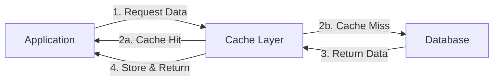
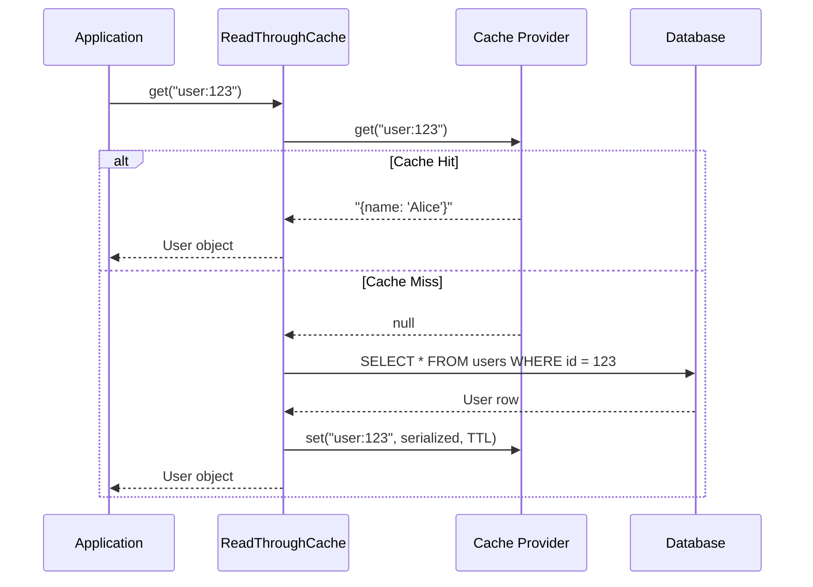
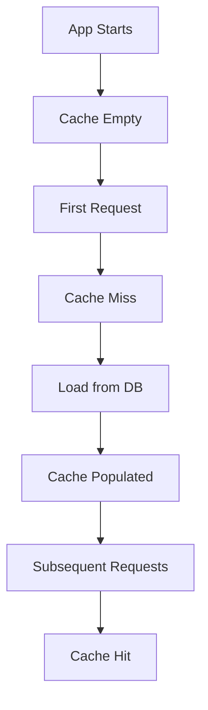
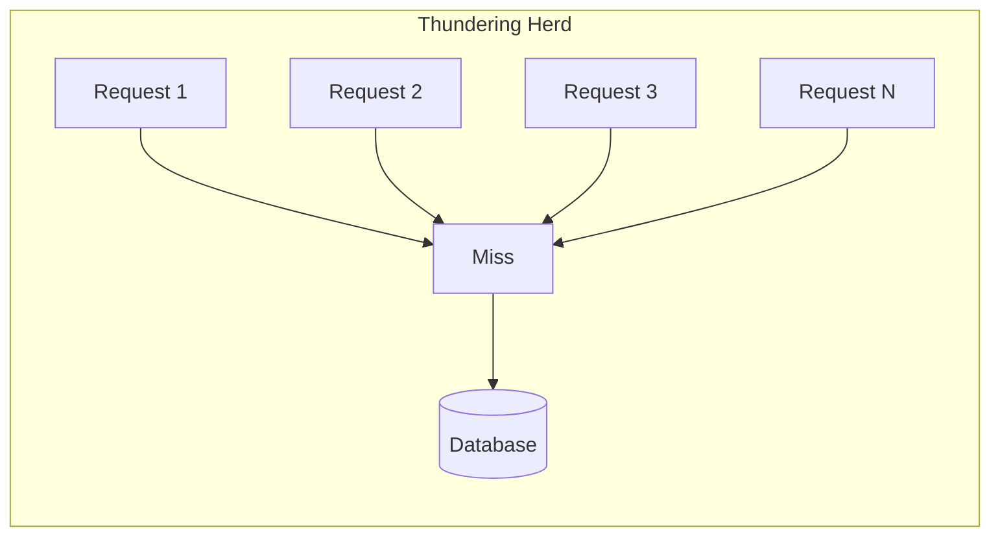

# How to Build Read-Through Pattern

Author: [nawazdhandala](https://github.com/nawazdhandala)

Tags: Caching, Read-Through, Performance, Architecture

Description: A practical guide to implementing the read-through caching pattern for faster reads, simpler code, and better reliability.

---

Your database is sweating. Every request hits the same tables, runs the same queries, returns the same rows. You've tuned indexes, added read replicas, and still the latency climbs during peak traffic. The fix isn't more database. It's smarter caching.

The read-through pattern puts a cache layer between your application and your data store. When you request data, the cache handles the lookup. If the data exists in cache, you get it instantly. If not, the cache fetches it from the database, stores it, and returns it. Your application code stays clean. The cache does the heavy lifting.

This post walks through implementing read-through caching from scratch, covering cache providers, lazy loading, consistency strategies, and production considerations.

## What Is Read-Through Caching?

Read-through caching delegates data fetching to the cache itself. Your application asks the cache for data. The cache either returns it from memory or fetches it from the underlying store transparently.



Compare this to cache-aside (lazy loading), where your application explicitly checks the cache, fetches from the database on miss, and populates the cache manually. Read-through moves that logic into the cache layer.

| Pattern | Who fetches on miss? | Code complexity | Consistency control |
|---------|---------------------|-----------------|---------------------|
| Cache-Aside | Application | Higher | Application handles |
| Read-Through | Cache | Lower | Cache handles |

Read-through wins when you want simpler application code and consistent cache population behavior across your codebase.

## Building a Read-Through Cache

Let's build a read-through cache in TypeScript. The core idea: wrap your data source with a cache layer that intercepts reads.

### Basic Implementation

```typescript
interface CacheProvider {
  get(key: string): Promise<string | null>;
  set(key: string, value: string, ttlSeconds?: number): Promise<void>;
  delete(key: string): Promise<void>;
}

interface DataLoader<T> {
  load(key: string): Promise<T | null>;
}

class ReadThroughCache<T> {
  private cache: CacheProvider;
  private loader: DataLoader<T>;
  private ttlSeconds: number;
  private keyPrefix: string;

  constructor(options: {
    cache: CacheProvider;
    loader: DataLoader<T>;
    ttlSeconds?: number;
    keyPrefix?: string;
  }) {
    this.cache = options.cache;
    this.loader = options.loader;
    this.ttlSeconds = options.ttlSeconds ?? 300;
    this.keyPrefix = options.keyPrefix ?? '';
  }

  async get(key: string): Promise<T | null> {
    const cacheKey = this.keyPrefix + key;

    // Try cache first
    const cached = await this.cache.get(cacheKey);
    if (cached !== null) {
      return JSON.parse(cached) as T;
    }

    // Cache miss: load from source
    const data = await this.loader.load(key);

    if (data !== null) {
      await this.cache.set(
        cacheKey,
        JSON.stringify(data),
        this.ttlSeconds
      );
    }

    return data;
  }

  async invalidate(key: string): Promise<void> {
    await this.cache.delete(this.keyPrefix + key);
  }
}
```

### Usage Example

```typescript
// Define your data loader
const userLoader: DataLoader<User> = {
  async load(userId: string): Promise<User | null> {
    const result = await db.query(
      'SELECT id, name, email FROM users WHERE id = $1',
      [userId]
    );
    return result.rows[0] ?? null;
  }
};

// Create the read-through cache
const userCache = new ReadThroughCache<User>({
  cache: redisProvider,
  loader: userLoader,
  ttlSeconds: 600,
  keyPrefix: 'user:'
});

// Application code stays simple
async function getUser(userId: string): Promise<User | null> {
  return userCache.get(userId);
}
```

Your application just calls `getUser()`. The cache handles everything else.

## Cache Provider Configuration

The cache provider is your storage backend. Redis is the common choice, but the pattern works with any key-value store.

### Redis Provider

```typescript
import { Redis } from 'ioredis';

class RedisCacheProvider implements CacheProvider {
  private client: Redis;

  constructor(redisUrl: string) {
    this.client = new Redis(redisUrl, {
      maxRetriesPerRequest: 3,
      retryDelayOnFailover: 100,
      enableReadyCheck: true,
    });
  }

  async get(key: string): Promise<string | null> {
    return this.client.get(key);
  }

  async set(key: string, value: string, ttlSeconds?: number): Promise<void> {
    if (ttlSeconds) {
      await this.client.setex(key, ttlSeconds, value);
    } else {
      await this.client.set(key, value);
    }
  }

  async delete(key: string): Promise<void> {
    await this.client.del(key);
  }
}
```

### In-Memory Provider (for testing or single-node apps)

```typescript
class MemoryCacheProvider implements CacheProvider {
  private store = new Map<string, { value: string; expiresAt: number }>();

  async get(key: string): Promise<string | null> {
    const entry = this.store.get(key);
    if (!entry) return null;

    if (Date.now() > entry.expiresAt) {
      this.store.delete(key);
      return null;
    }

    return entry.value;
  }

  async set(key: string, value: string, ttlSeconds?: number): Promise<void> {
    const expiresAt = ttlSeconds
      ? Date.now() + ttlSeconds * 1000
      : Number.MAX_SAFE_INTEGER;

    this.store.set(key, { value, expiresAt });
  }

  async delete(key: string): Promise<void> {
    this.store.delete(key);
  }
}
```

## The Flow in Detail

Here's how a read-through request flows through the system:



The application never knows whether data came from cache or database. That's the point.

## Handling Cache Consistency

Stale data is the price of caching. You have three main strategies to manage it.

### Strategy 1: TTL-Based Expiration

Set a time-to-live on cached entries. Data eventually refreshes.

```typescript
const productCache = new ReadThroughCache<Product>({
  cache: redisProvider,
  loader: productLoader,
  ttlSeconds: 300, // 5 minutes
  keyPrefix: 'product:'
});
```

Good for: Data that changes infrequently. Catalog items, user profiles, configuration.

Bad for: Data where staleness causes real problems. Inventory counts, account balances.

### Strategy 2: Explicit Invalidation

Invalidate cache entries when you know the data changed.

```typescript
async function updateUser(userId: string, updates: Partial<User>) {
  await db.query(
    'UPDATE users SET name = $1, email = $2 WHERE id = $3',
    [updates.name, updates.email, userId]
  );

  // Invalidate the cache
  await userCache.invalidate(userId);
}
```

The next read will fetch fresh data from the database and repopulate the cache.

### Strategy 3: Write-Through Companion

Pair read-through with write-through. Writes update both cache and database atomically.

```typescript
class ReadWriteThroughCache<T> extends ReadThroughCache<T> {
  private serializer: (data: T) => string;
  private writer: (key: string, data: T) => Promise<void>;

  constructor(options: {
    cache: CacheProvider;
    loader: DataLoader<T>;
    writer: (key: string, data: T) => Promise<void>;
    serializer?: (data: T) => string;
    ttlSeconds?: number;
    keyPrefix?: string;
  }) {
    super(options);
    this.writer = options.writer;
    this.serializer = options.serializer ?? JSON.stringify;
  }

  async set(key: string, data: T): Promise<void> {
    const cacheKey = this.keyPrefix + key;

    // Write to database
    await this.writer(key, data);

    // Update cache
    await this.cache.set(
      cacheKey,
      this.serializer(data),
      this.ttlSeconds
    );
  }
}
```

This keeps cache and database in sync during writes, but adds complexity and latency to write operations.

## Lazy Loading vs Eager Loading

Read-through is inherently lazy: data loads into cache only when requested. This has trade-offs.

### Lazy Loading (Default Read-Through)



Pros:
- Only caches data that's actually used
- No upfront loading time
- Memory efficient

Cons:
- First request is slow (cold cache penalty)
- Thundering herd on cold start

### Eager Loading (Cache Warming)

Pre-populate the cache before traffic arrives.

```typescript
async function warmCache(userIds: string[]): Promise<void> {
  const batchSize = 100;

  for (let i = 0; i < userIds.length; i += batchSize) {
    const batch = userIds.slice(i, i + batchSize);
    await Promise.all(batch.map(id => userCache.get(id)));
  }
}

// On application startup
const activeUserIds = await db.query(
  'SELECT id FROM users WHERE last_active > NOW() - INTERVAL \'7 days\''
);
await warmCache(activeUserIds.rows.map(r => r.id));
```

Use this for data you know will be requested. Popular products, active users, frequently accessed configurations.

## Handling Thundering Herd

When cache expires on a popular key, many requests simultaneously hit the database. This is the thundering herd problem.



### Solution: Request Coalescing

Only one request actually loads from the database. Others wait for that result.

```typescript
class CoalescingReadThroughCache<T> extends ReadThroughCache<T> {
  private pending = new Map<string, Promise<T | null>>();

  async get(key: string): Promise<T | null> {
    const cacheKey = this.keyPrefix + key;

    // Check cache
    const cached = await this.cache.get(cacheKey);
    if (cached !== null) {
      return JSON.parse(cached) as T;
    }

    // Check if another request is already loading this key
    const pendingRequest = this.pending.get(cacheKey);
    if (pendingRequest) {
      return pendingRequest;
    }

    // Load and share the promise
    const loadPromise = this.loadAndCache(key, cacheKey);
    this.pending.set(cacheKey, loadPromise);

    try {
      return await loadPromise;
    } finally {
      this.pending.delete(cacheKey);
    }
  }

  private async loadAndCache(key: string, cacheKey: string): Promise<T | null> {
    const data = await this.loader.load(key);

    if (data !== null) {
      await this.cache.set(cacheKey, JSON.stringify(data), this.ttlSeconds);
    }

    return data;
  }
}
```

Now only one database query runs per key, regardless of concurrent requests.

## Error Handling

What happens when the database is down? Your cache becomes your only source of truth, until TTLs expire.

### Graceful Degradation

```typescript
async get(key: string): Promise<T | null> {
  const cacheKey = this.keyPrefix + key;

  // Always try cache first
  const cached = await this.cache.get(cacheKey);
  if (cached !== null) {
    return JSON.parse(cached) as T;
  }

  try {
    const data = await this.loader.load(key);

    if (data !== null) {
      await this.cache.set(cacheKey, JSON.stringify(data), this.ttlSeconds);
    }

    return data;
  } catch (error) {
    // Log the error, but don't crash
    console.error(`Failed to load key ${key}:`, error);

    // Option 1: Return null (data unavailable)
    return null;

    // Option 2: Throw (let caller handle it)
    // throw error;

    // Option 3: Return stale data if available (requires separate stale storage)
  }
}
```

### Stale-While-Revalidate

Serve stale data while fetching fresh data in the background.

```typescript
class StaleWhileRevalidateCache<T> {
  private cache: CacheProvider;
  private loader: DataLoader<T>;
  private ttlSeconds: number;
  private staleTtlSeconds: number;
  private keyPrefix: string;

  async get(key: string): Promise<T | null> {
    const cacheKey = this.keyPrefix + key;
    const metaKey = cacheKey + ':meta';

    const [cached, meta] = await Promise.all([
      this.cache.get(cacheKey),
      this.cache.get(metaKey)
    ]);

    if (cached === null) {
      // No data at all, must load
      return this.loadAndCache(key, cacheKey, metaKey);
    }

    const metadata = meta ? JSON.parse(meta) : null;
    const isStale = metadata && Date.now() > metadata.freshUntil;

    if (isStale) {
      // Return stale data, refresh in background
      this.loadAndCache(key, cacheKey, metaKey).catch(console.error);
    }

    return JSON.parse(cached) as T;
  }

  private async loadAndCache(
    key: string,
    cacheKey: string,
    metaKey: string
  ): Promise<T | null> {
    const data = await this.loader.load(key);

    if (data !== null) {
      const now = Date.now();
      await Promise.all([
        this.cache.set(cacheKey, JSON.stringify(data), this.staleTtlSeconds),
        this.cache.set(metaKey, JSON.stringify({
          freshUntil: now + this.ttlSeconds * 1000,
          cachedAt: now
        }), this.staleTtlSeconds)
      ]);
    }

    return data;
  }
}
```

Users always get fast responses. Freshness happens in the background.

## Monitoring Your Cache

You can't optimize what you don't measure. Track these metrics:

- **Hit rate**: Percentage of requests served from cache
- **Miss rate**: Percentage requiring database lookup
- **Latency**: p50, p95, p99 for cache hits vs misses
- **Eviction rate**: How often entries are removed before TTL
- **Memory usage**: Cache size over time

```typescript
class InstrumentedReadThroughCache<T> extends ReadThroughCache<T> {
  private metrics: MetricsClient;

  async get(key: string): Promise<T | null> {
    const start = Date.now();
    const cacheKey = this.keyPrefix + key;

    const cached = await this.cache.get(cacheKey);

    if (cached !== null) {
      this.metrics.increment('cache.hit', { prefix: this.keyPrefix });
      this.metrics.timing('cache.latency', Date.now() - start, {
        result: 'hit',
        prefix: this.keyPrefix
      });
      return JSON.parse(cached) as T;
    }

    this.metrics.increment('cache.miss', { prefix: this.keyPrefix });

    const data = await this.loader.load(key);

    if (data !== null) {
      await this.cache.set(cacheKey, JSON.stringify(data), this.ttlSeconds);
    }

    this.metrics.timing('cache.latency', Date.now() - start, {
      result: 'miss',
      prefix: this.keyPrefix
    });

    return data;
  }
}
```

A healthy cache should have a hit rate above 80% for read-heavy workloads. Below that, examine your TTLs, key design, and access patterns.

## When to Use Read-Through

Read-through caching fits well when:

- You have read-heavy workloads (10:1 or higher read-to-write ratio)
- Data can tolerate some staleness (seconds to minutes)
- You want to simplify application code
- Multiple services read the same data

It doesn't fit when:

- Data must always be fresh (use write-through or bypass cache)
- Writes are frequent (cache invalidation overhead)
- Data is highly personalized with low reuse (poor hit rates)
- You need complex queries (caching works best for key-value access)

## Production Checklist

Before deploying read-through caching:

- [ ] Define TTLs based on data freshness requirements
- [ ] Implement request coalescing for popular keys
- [ ] Add monitoring for hit rates and latency
- [ ] Plan cache warming strategy for cold starts
- [ ] Document invalidation triggers for each cached entity
- [ ] Set up alerts for low hit rates or high eviction
- [ ] Test cache failure scenarios (what happens when Redis is down?)
- [ ] Verify serialization handles all edge cases (nulls, empty arrays, special characters)

---

Read-through caching gives you faster reads with cleaner code. The cache becomes a smart intermediary that knows how to fetch data when needed. Your application just asks for what it wants.

Start simple: pick one high-traffic read endpoint, wrap its data access with a read-through cache, and measure the difference. Once you see the latency drop and database load decrease, you'll want to apply it everywhere reads dominate your workload.

**Related Reading:**
- [When Performance Matters, Skip the ORM](https://oneuptime.com/blog/post/2025-11-13-when-performance-matters-skip-the-orm/view)
- [The Hidden Costs of Dependency Bloat in Software Development](https://oneuptime.com/blog/post/2025-09-02-the-hidden-costs-of-dependency-bloat-in-software-development/view)
