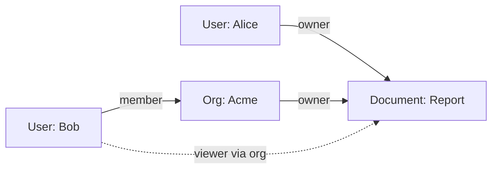
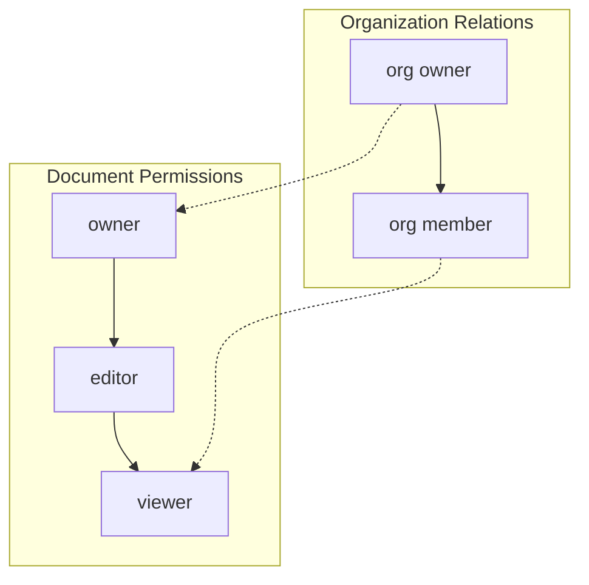

# How to Implement ReBAC Implementation

Author: [nawazdhandala](https://github.com/nawazdhandala)

Tags: Security, ReBAC, Authorization, Graph-Based

Description: Learn to implement relationship-based access control (ReBAC) for fine-grained authorization.

---

Traditional role-based access control (RBAC) often falls short when you need to model complex permissions based on how users relate to resources. Relationship-Based Access Control (ReBAC) solves this by making relationships between entities the foundation of your authorization logic. This post walks you through implementing ReBAC from scratch.

## What is ReBAC?

ReBAC determines access by evaluating relationships between users and resources. Instead of assigning static roles, you define how entities connect to each other. For example, a user can edit a document if they are the owner, or if they belong to an organization that owns the document.

The core concept revolves around three elements:

| Element | Description | Example |
|---------|-------------|---------|
| Subject | The entity requesting access | User, Service Account |
| Relation | The type of connection | owner, editor, viewer, member |
| Object | The resource being accessed | Document, Folder, Organization |

## The Relationship Graph

ReBAC models your authorization data as a directed graph where nodes represent entities and edges represent relationships.



In this graph, Alice directly owns the document. Bob is a member of Acme, and Acme owns the document. Through this chain, Bob inherits viewer access to the document.

## Data Model Design

Start by defining your schema. You need to store relationships as tuples containing the subject, relation, and object.

Here is a TypeScript interface for the relationship tuple:

```typescript
// Core tuple structure for storing relationships
interface RelationshipTuple {
  subject: {
    type: string;  // e.g., "user", "organization"
    id: string;    // unique identifier
  };
  relation: string;  // e.g., "owner", "member", "viewer"
  object: {
    type: string;  // e.g., "document", "folder"
    id: string;    // unique identifier
  };
}
```

For the database layer, a simple SQL schema works well:

```sql
-- Store all relationships in a single table
CREATE TABLE relationships (
    id UUID PRIMARY KEY DEFAULT gen_random_uuid(),
    subject_type VARCHAR(64) NOT NULL,
    subject_id VARCHAR(256) NOT NULL,
    relation VARCHAR(64) NOT NULL,
    object_type VARCHAR(64) NOT NULL,
    object_id VARCHAR(256) NOT NULL,
    created_at TIMESTAMP DEFAULT NOW(),

    -- Ensure no duplicate relationships
    UNIQUE(subject_type, subject_id, relation, object_type, object_id)
);

-- Index for fast permission checks
CREATE INDEX idx_relationships_lookup
ON relationships(object_type, object_id, relation);
```

## Defining Permission Rules

Your authorization schema needs rules that define how permissions flow through relationships. Here is how to model permission inheritance:



The dashed lines show inherited permissions. Organization owners automatically get owner access to organization resources. Members get viewer access.

Implement this rule engine in TypeScript:

```typescript
// Define how permissions inherit from each other
type PermissionRules = {
  [objectType: string]: {
    [relation: string]: {
      // Direct relations that grant this permission
      directRelations: string[];
      // Inherited through other object relationships
      inheritedFrom?: {
        relation: string;
        throughRelation: string;
        targetType: string;
      }[];
    };
  };
};

const rules: PermissionRules = {
  document: {
    viewer: {
      directRelations: ["viewer", "editor", "owner"],
      inheritedFrom: [
        {
          relation: "member",
          throughRelation: "owner",
          targetType: "organization"
        }
      ]
    },
    editor: {
      directRelations: ["editor", "owner"]
    },
    owner: {
      directRelations: ["owner"]
    }
  }
};
```

## The Permission Check Algorithm

The core of ReBAC is the check algorithm. It traverses the relationship graph to determine if a path exists from the subject to the object with the required permission.

```typescript
class ReBAC {
  private db: RelationshipStore;
  private rules: PermissionRules;

  constructor(db: RelationshipStore, rules: PermissionRules) {
    this.db = db;
    this.rules = rules;
  }

  // Main entry point for permission checks
  async check(
    subject: { type: string; id: string },
    permission: string,
    object: { type: string; id: string }
  ): Promise<boolean> {
    const rule = this.rules[object.type]?.[permission];
    if (!rule) return false;

    // Check direct relationships first
    for (const relation of rule.directRelations) {
      const exists = await this.db.exists({
        subject,
        relation,
        object
      });
      if (exists) return true;
    }

    // Check inherited permissions through related objects
    if (rule.inheritedFrom) {
      for (const inheritance of rule.inheritedFrom) {
        const granted = await this.checkInherited(
          subject,
          inheritance,
          object
        );
        if (granted) return true;
      }
    }

    return false;
  }

  // Traverse relationships to find inherited permissions
  private async checkInherited(
    subject: { type: string; id: string },
    inheritance: {
      relation: string;
      throughRelation: string;
      targetType: string;
    },
    object: { type: string; id: string }
  ): Promise<boolean> {
    // Find all objects related to target through the specified relation
    const relatedObjects = await this.db.findRelated({
      relation: inheritance.throughRelation,
      object
    });

    // Check if subject has the required relation to any related object
    for (const related of relatedObjects) {
      if (related.type !== inheritance.targetType) continue;

      const exists = await this.db.exists({
        subject,
        relation: inheritance.relation,
        object: related
      });
      if (exists) return true;
    }

    return false;
  }
}
```

## Usage Example

Here is how to use the ReBAC system in practice:

```typescript
// Initialize the system
const rebac = new ReBAC(relationshipStore, rules);

// Create relationships
await relationshipStore.create({
  subject: { type: "user", id: "alice" },
  relation: "owner",
  object: { type: "document", id: "doc-123" }
});

await relationshipStore.create({
  subject: { type: "user", id: "bob" },
  relation: "member",
  object: { type: "organization", id: "acme" }
});

await relationshipStore.create({
  subject: { type: "organization", id: "acme" },
  relation: "owner",
  object: { type: "document", id: "doc-456" }
});

// Check permissions
const canAliceEdit = await rebac.check(
  { type: "user", id: "alice" },
  "editor",
  { type: "document", id: "doc-123" }
);
// Returns: true (Alice is owner, owners can edit)

const canBobView = await rebac.check(
  { type: "user", id: "bob" },
  "viewer",
  { type: "document", id: "doc-456" }
);
// Returns: true (Bob is member of Acme, Acme owns doc-456)
```

## Performance Considerations

ReBAC queries can become expensive when traversing deep relationship graphs. Consider these optimizations:

| Strategy | When to Use | Trade-off |
|----------|-------------|-----------|
| Caching | High read volume | Cache invalidation complexity |
| Denormalization | Deep hierarchies | Storage overhead |
| Batch checks | Multiple permissions at once | Implementation complexity |
| Graph databases | Complex relationships | Infrastructure cost |

For most applications, caching permission results with a short TTL provides good performance without adding too much complexity.

## Conclusion

ReBAC provides a flexible and intuitive way to model authorization based on real-world relationships. The key components are the relationship tuple storage, the permission rule definitions, and the graph traversal algorithm. Start with a simple implementation and add caching or denormalization as your scale requires.

The pattern works well for applications with hierarchical resources like documents in folders, team membership, or multi-tenant systems where permissions naturally flow through organizational structures.
