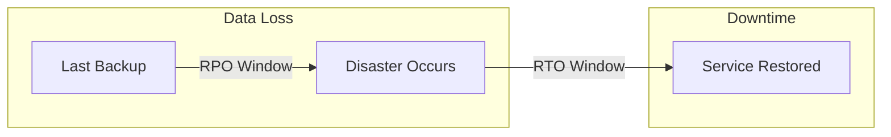
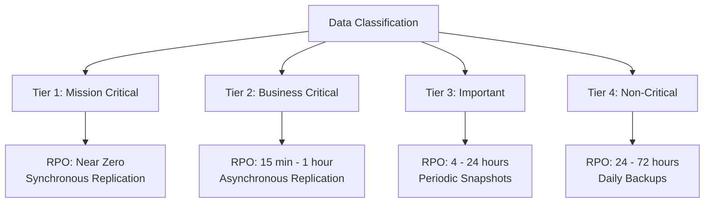
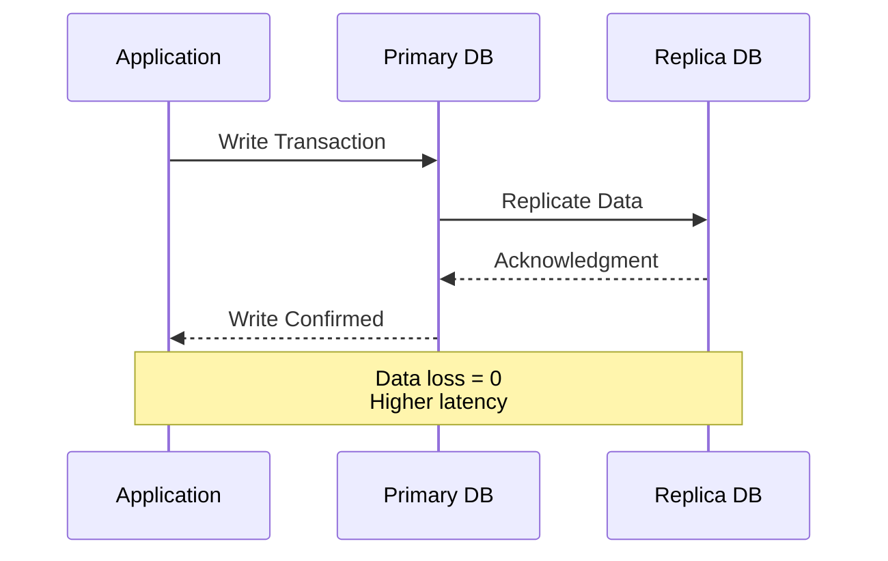
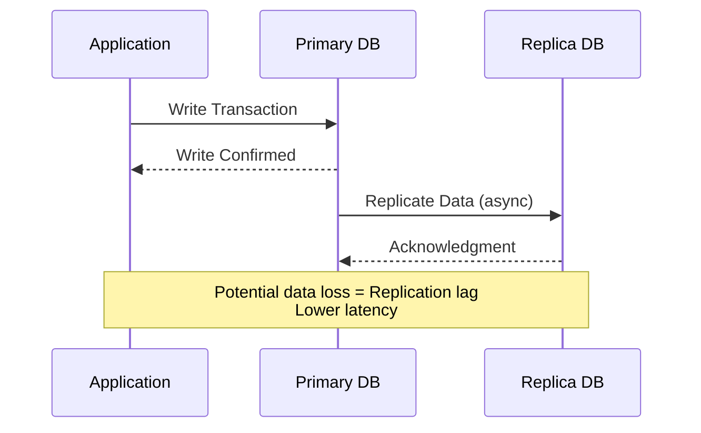
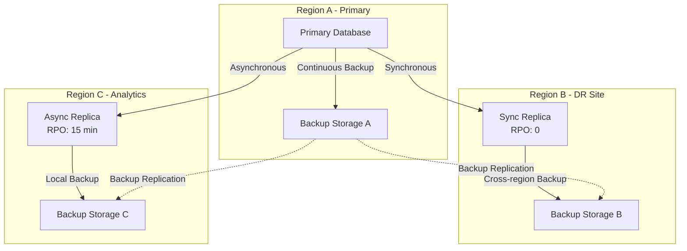
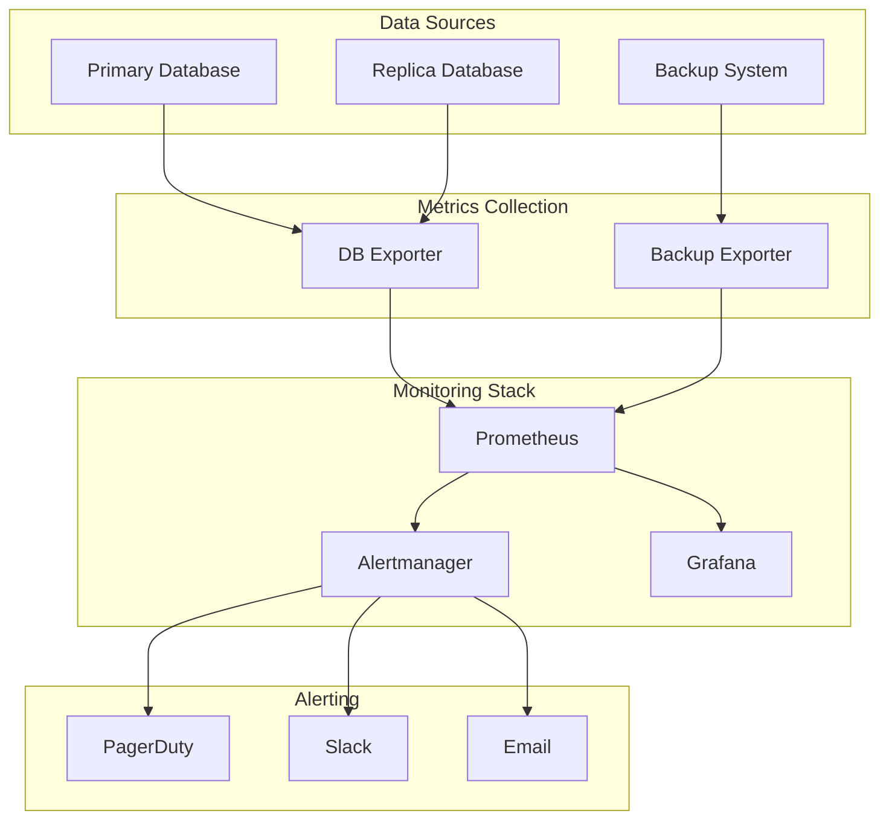
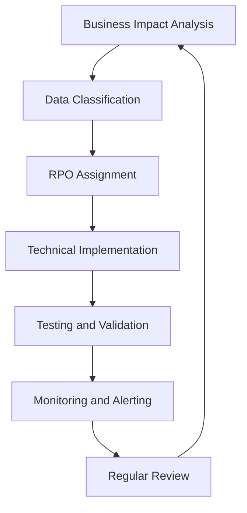

# How to Implement Recovery Point Objectives

Author: [nawazdhandala](https://github.com/nawazdhandala)

Tags: Disaster Recovery, RPO, Data Protection, SRE

Description: Learn how to define and achieve recovery point objectives for minimal data loss.

---

Recovery Point Objective (RPO) defines the maximum acceptable amount of data loss measured in time. If your RPO is 1 hour, you can afford to lose up to 1 hour of data. Implementing RPO correctly is critical for business continuity and data protection strategies.

## Understanding RPO in the Recovery Landscape

RPO works alongside Recovery Time Objective (RTO) to form your disaster recovery strategy. While RTO focuses on how quickly you restore services, RPO focuses on how much data you can afford to lose.



## RPO Tiers and Classification

Different data types require different RPO levels. Classifying your data into tiers helps allocate resources efficiently.

### Tier Classification Framework



### RPO Tier Definitions

| Tier | RPO Range | Data Types | Backup Method |
|------|-----------|------------|---------------|
| Tier 1 | Near Zero (seconds) | Financial transactions, real-time systems | Synchronous replication |
| Tier 2 | 15 minutes to 1 hour | Customer databases, order systems | Asynchronous replication, WAL shipping |
| Tier 3 | 4 to 24 hours | Internal applications, development data | Scheduled snapshots |
| Tier 4 | 24 to 72 hours | Archives, logs, non-critical data | Daily or weekly backups |

## Backup Frequency Strategies

Your backup frequency directly determines your achievable RPO. Here is a Python script to calculate optimal backup schedules based on RPO requirements.

```python
# rpo_calculator.py
# Calculate backup frequency based on RPO requirements

from dataclasses import dataclass
from datetime import timedelta
from enum import Enum
from typing import Optional


class BackupType(Enum):
    """Types of backup strategies available."""
    CONTINUOUS = "continuous"           # Real-time replication
    INCREMENTAL = "incremental"         # Changes since last backup
    DIFFERENTIAL = "differential"       # Changes since last full backup
    FULL = "full"                       # Complete data copy


@dataclass
class RPORequirement:
    """Defines RPO requirements for a data tier."""
    tier_name: str
    max_data_loss: timedelta           # Maximum acceptable data loss
    data_change_rate_per_hour: float   # Percentage of data that changes per hour
    total_data_size_gb: float          # Total size of data to protect


@dataclass
class BackupSchedule:
    """Calculated backup schedule to meet RPO."""
    backup_type: BackupType
    frequency: timedelta
    estimated_backup_size_gb: float
    meets_rpo: bool


def calculate_backup_schedule(requirement: RPORequirement) -> BackupSchedule:
    """
    Calculate the optimal backup schedule to meet RPO requirements.

    The backup frequency must be less than the RPO to ensure
    data loss never exceeds the maximum acceptable threshold.

    Args:
        requirement: The RPO requirement to satisfy

    Returns:
        BackupSchedule with recommended configuration
    """
    # Backup frequency should be at most 80% of RPO
    # This provides a safety margin for backup completion time
    safety_factor = 0.8
    max_backup_interval = requirement.max_data_loss * safety_factor

    # Determine backup type based on RPO stringency
    rpo_hours = requirement.max_data_loss.total_seconds() / 3600

    if rpo_hours < 0.25:  # Less than 15 minutes
        # Near-zero RPO requires continuous replication
        backup_type = BackupType.CONTINUOUS
        frequency = timedelta(seconds=0)  # Real-time
        estimated_size = requirement.total_data_size_gb * 0.01  # Initial sync overhead

    elif rpo_hours < 4:  # 15 minutes to 4 hours
        # Short RPO uses incremental backups
        backup_type = BackupType.INCREMENTAL
        frequency = max_backup_interval
        # Estimate incremental size based on change rate
        hours_between = frequency.total_seconds() / 3600
        estimated_size = (
            requirement.total_data_size_gb *
            (requirement.data_change_rate_per_hour / 100) *
            hours_between
        )

    elif rpo_hours < 24:  # 4 to 24 hours
        # Medium RPO can use differential backups
        backup_type = BackupType.DIFFERENTIAL
        frequency = max_backup_interval
        # Differential grows over time until next full backup
        estimated_size = requirement.total_data_size_gb * 0.15  # Average estimate

    else:  # 24+ hours
        # Long RPO can use full backups
        backup_type = BackupType.FULL
        frequency = max_backup_interval
        estimated_size = requirement.total_data_size_gb

    return BackupSchedule(
        backup_type=backup_type,
        frequency=frequency,
        estimated_backup_size_gb=round(estimated_size, 2),
        meets_rpo=True
    )


def main():
    """Example usage of RPO calculator."""
    # Define requirements for different data tiers
    requirements = [
        RPORequirement(
            tier_name="Tier 1 - Financial Transactions",
            max_data_loss=timedelta(minutes=5),
            data_change_rate_per_hour=25.0,
            total_data_size_gb=500
        ),
        RPORequirement(
            tier_name="Tier 2 - Customer Database",
            max_data_loss=timedelta(hours=1),
            data_change_rate_per_hour=10.0,
            total_data_size_gb=2000
        ),
        RPORequirement(
            tier_name="Tier 3 - Internal Apps",
            max_data_loss=timedelta(hours=12),
            data_change_rate_per_hour=5.0,
            total_data_size_gb=5000
        ),
        RPORequirement(
            tier_name="Tier 4 - Archives",
            max_data_loss=timedelta(hours=48),
            data_change_rate_per_hour=0.5,
            total_data_size_gb=50000
        ),
    ]

    print("RPO Backup Schedule Recommendations")
    print("=" * 60)

    for req in requirements:
        schedule = calculate_backup_schedule(req)
        print(f"\n{req.tier_name}")
        print(f"  RPO Target: {req.max_data_loss}")
        print(f"  Backup Type: {schedule.backup_type.value}")
        if schedule.frequency.total_seconds() > 0:
            print(f"  Frequency: Every {schedule.frequency}")
        else:
            print(f"  Frequency: Continuous (real-time)")
        print(f"  Estimated Size: {schedule.estimated_backup_size_gb} GB")


if __name__ == "__main__":
    main()
```

## Replication Strategies

### Synchronous Replication

Synchronous replication ensures zero data loss by waiting for confirmation from the replica before acknowledging writes. This is essential for Tier 1 RPO requirements.



### Asynchronous Replication

Asynchronous replication provides better performance at the cost of potential data loss during failover.



### Implementation Example: PostgreSQL Streaming Replication

```yaml
# postgresql-replication.yaml
# Kubernetes ConfigMap for PostgreSQL streaming replication

apiVersion: v1
kind: ConfigMap
metadata:
  name: postgres-primary-config
  namespace: database
data:
  # Primary server configuration
  postgresql.conf: |
    # Connection settings
    listen_addresses = '*'
    port = 5432

    # WAL (Write-Ahead Log) settings for replication
    wal_level = replica                    # Enable replication
    max_wal_senders = 5                    # Maximum replication connections
    wal_keep_size = 1GB                    # WAL retention for replicas

    # Synchronous replication for Tier 1 RPO (near-zero data loss)
    # Set to 'on' for synchronous, 'off' for asynchronous
    synchronous_commit = on

    # Name of synchronous standby servers
    # Use '*' for any standby or specific names for control
    synchronous_standby_names = 'replica1'

    # Archive settings for point-in-time recovery
    archive_mode = on
    archive_command = 'cp %p /var/lib/postgresql/archive/%f'

  pg_hba.conf: |
    # Allow replication connections from replica servers
    # TYPE  DATABASE        USER            ADDRESS                 METHOD
    host    replication     replicator      10.0.0.0/8              scram-sha-256
    host    all             all             10.0.0.0/8              scram-sha-256

---
apiVersion: v1
kind: ConfigMap
metadata:
  name: postgres-replica-config
  namespace: database
data:
  # Replica server configuration
  postgresql.conf: |
    # Connection settings
    listen_addresses = '*'
    port = 5432

    # Hot standby allows read queries on replica
    hot_standby = on

    # Feedback to primary about replica status
    hot_standby_feedback = on

  # Recovery configuration (PostgreSQL 12+)
  # This file signals that this server is a standby
  standby.signal: ""

  # Primary connection info stored in postgresql.auto.conf
  # Created during base backup or configured here
  recovery.conf: |
    primary_conninfo = 'host=postgres-primary port=5432 user=replicator password=secure_password application_name=replica1'
    primary_slot_name = 'replica1_slot'
```

### Multi-Region Replication Architecture



## Implementing Continuous Data Protection (CDP)

For Tier 1 systems requiring near-zero RPO, implement Continuous Data Protection.

```python
# cdp_manager.py
# Continuous Data Protection implementation for near-zero RPO

import asyncio
import hashlib
import json
import logging
from dataclasses import dataclass, field
from datetime import datetime, timedelta
from typing import Any, Callable, Dict, List, Optional
from collections import deque

# Configure logging
logging.basicConfig(level=logging.INFO)
logger = logging.getLogger(__name__)


@dataclass
class ChangeEvent:
    """Represents a single data change event."""
    event_id: str
    timestamp: datetime
    table_name: str
    operation: str          # INSERT, UPDATE, DELETE
    primary_key: Any
    old_data: Optional[Dict] = None
    new_data: Optional[Dict] = None
    checksum: str = ""

    def __post_init__(self):
        """Calculate checksum after initialization."""
        if not self.checksum:
            content = f"{self.table_name}:{self.operation}:{self.primary_key}:{self.new_data}"
            self.checksum = hashlib.sha256(content.encode()).hexdigest()[:16]


@dataclass
class CDPJournal:
    """
    Journal that captures all changes for point-in-time recovery.

    The journal maintains a rolling window of changes that can be
    replayed to restore data to any point within the retention period.
    """
    retention_period: timedelta = field(default_factory=lambda: timedelta(hours=24))
    max_events: int = 1_000_000
    events: deque = field(default_factory=deque)
    _last_checkpoint: datetime = field(default_factory=datetime.utcnow)

    def append(self, event: ChangeEvent) -> None:
        """
        Append a change event to the journal.

        Automatically prunes old events beyond retention period.
        """
        self.events.append(event)

        # Prune old events
        cutoff = datetime.utcnow() - self.retention_period
        while self.events and self.events[0].timestamp < cutoff:
            self.events.popleft()

        # Enforce max events limit
        while len(self.events) > self.max_events:
            self.events.popleft()
            logger.warning("CDP journal exceeded max events, pruning oldest entries")

    def get_events_since(self, timestamp: datetime) -> List[ChangeEvent]:
        """Get all events since a specific timestamp for replay."""
        return [e for e in self.events if e.timestamp >= timestamp]

    def get_events_for_recovery(
        self,
        target_time: datetime
    ) -> List[ChangeEvent]:
        """
        Get events needed to recover to a specific point in time.

        Returns events from the last checkpoint before target_time
        up to and including target_time.
        """
        # Find last checkpoint before target
        checkpoint = self._last_checkpoint

        return [
            e for e in self.events
            if checkpoint <= e.timestamp <= target_time
        ]


class ContinuousDataProtection:
    """
    CDP system for achieving near-zero RPO.

    Captures every change in real-time and replicates to
    secondary storage for instant recovery.
    """

    def __init__(
        self,
        journal: CDPJournal,
        replication_targets: List[Callable],
        rpo_threshold: timedelta = timedelta(seconds=5)
    ):
        """
        Initialize CDP system.

        Args:
            journal: The change journal for storing events
            replication_targets: List of async functions to replicate to
            rpo_threshold: Maximum acceptable replication lag
        """
        self.journal = journal
        self.replication_targets = replication_targets
        self.rpo_threshold = rpo_threshold
        self._replication_lag: timedelta = timedelta(0)
        self._last_replicated: Optional[datetime] = None
        self._event_queue: asyncio.Queue = asyncio.Queue()
        self._running = False

    async def start(self) -> None:
        """Start the CDP replication process."""
        self._running = True
        logger.info("CDP system started")

        # Start replication worker
        asyncio.create_task(self._replication_worker())

        # Start lag monitoring
        asyncio.create_task(self._monitor_replication_lag())

    async def stop(self) -> None:
        """Stop the CDP system gracefully."""
        self._running = False

        # Wait for queue to drain
        await self._event_queue.join()
        logger.info("CDP system stopped")

    async def capture_change(
        self,
        table_name: str,
        operation: str,
        primary_key: Any,
        old_data: Optional[Dict] = None,
        new_data: Optional[Dict] = None
    ) -> ChangeEvent:
        """
        Capture a data change event.

        This method should be called for every write operation
        to maintain continuous protection.
        """
        event = ChangeEvent(
            event_id=f"{table_name}_{primary_key}_{datetime.utcnow().timestamp()}",
            timestamp=datetime.utcnow(),
            table_name=table_name,
            operation=operation,
            primary_key=primary_key,
            old_data=old_data,
            new_data=new_data
        )

        # Add to journal immediately
        self.journal.append(event)

        # Queue for async replication
        await self._event_queue.put(event)

        logger.debug(f"Captured change: {event.event_id}")
        return event

    async def _replication_worker(self) -> None:
        """Worker that processes replication queue."""
        while self._running:
            try:
                # Get event with timeout to allow checking _running flag
                event = await asyncio.wait_for(
                    self._event_queue.get(),
                    timeout=1.0
                )

                # Replicate to all targets
                replication_tasks = [
                    target(event) for target in self.replication_targets
                ]

                await asyncio.gather(*replication_tasks)

                self._last_replicated = event.timestamp
                self._event_queue.task_done()

            except asyncio.TimeoutError:
                continue
            except Exception as e:
                logger.error(f"Replication error: {e}")
                # Re-queue event for retry
                await self._event_queue.put(event)
                await asyncio.sleep(1)

    async def _monitor_replication_lag(self) -> None:
        """Monitor replication lag and alert if RPO threshold exceeded."""
        while self._running:
            if self._last_replicated:
                self._replication_lag = datetime.utcnow() - self._last_replicated

                if self._replication_lag > self.rpo_threshold:
                    logger.warning(
                        f"RPO THRESHOLD EXCEEDED! "
                        f"Lag: {self._replication_lag.total_seconds():.2f}s, "
                        f"Threshold: {self.rpo_threshold.total_seconds():.2f}s"
                    )
                    # Trigger alert (integrate with your alerting system)
                    await self._trigger_rpo_alert()

            await asyncio.sleep(1)

    async def _trigger_rpo_alert(self) -> None:
        """Trigger an alert when RPO threshold is exceeded."""
        # Integration point for alerting systems
        # Examples: PagerDuty, Opsgenie, custom webhook
        alert_payload = {
            "severity": "critical",
            "title": "RPO Threshold Exceeded",
            "description": f"Replication lag is {self._replication_lag.total_seconds():.2f} seconds",
            "timestamp": datetime.utcnow().isoformat()
        }
        logger.critical(f"ALERT: {json.dumps(alert_payload)}")

    async def recover_to_point_in_time(
        self,
        target_time: datetime,
        apply_func: Callable
    ) -> int:
        """
        Recover data to a specific point in time.

        Args:
            target_time: The point in time to recover to
            apply_func: Function to apply each change event

        Returns:
            Number of events replayed
        """
        events = self.journal.get_events_for_recovery(target_time)

        logger.info(f"Recovering to {target_time}, replaying {len(events)} events")

        for event in events:
            await apply_func(event)

        return len(events)

    def get_current_rpo(self) -> timedelta:
        """Get the current actual RPO based on replication lag."""
        return self._replication_lag


# Example replication target functions
async def replicate_to_standby(event: ChangeEvent) -> None:
    """Replicate change to standby database."""
    # Implement actual replication logic
    logger.debug(f"Replicated to standby: {event.event_id}")


async def replicate_to_cloud_storage(event: ChangeEvent) -> None:
    """Replicate change to cloud storage for disaster recovery."""
    # Implement cloud storage upload
    logger.debug(f"Replicated to cloud: {event.event_id}")
```

## RPO Monitoring and Alerting

Monitoring your actual RPO against targets is essential for maintaining data protection guarantees.

### RPO Monitoring Architecture



### Prometheus Metrics and Alerts

```yaml
# prometheus-rpo-rules.yaml
# Alerting rules for RPO monitoring

groups:
  - name: rpo_alerts
    interval: 30s
    rules:
      # Calculate replication lag in seconds
      - record: database:replication_lag_seconds
        expr: |
          pg_replication_lag_seconds{job="postgres"}

      # Track time since last successful backup
      - record: backup:time_since_last_seconds
        expr: |
          time() - backup_last_success_timestamp_seconds{job="backup-exporter"}

      # Tier 1 RPO Alert: Near-zero tolerance (5 minutes)
      - alert: Tier1RPOExceeded
        expr: database:replication_lag_seconds{tier="1"} > 300
        for: 1m
        labels:
          severity: critical
          tier: "1"
        annotations:
          summary: "Tier 1 RPO exceeded - Critical data at risk"
          description: |
            Replication lag for {{ $labels.instance }} is {{ $value | humanizeDuration }}.
            Tier 1 RPO target is 5 minutes.
            Immediate action required to prevent data loss.
          runbook_url: "https://wiki.example.com/runbooks/rpo-tier1"

      # Tier 2 RPO Alert: 1 hour tolerance
      - alert: Tier2RPOExceeded
        expr: database:replication_lag_seconds{tier="2"} > 3600
        for: 5m
        labels:
          severity: high
          tier: "2"
        annotations:
          summary: "Tier 2 RPO exceeded - Business critical data at risk"
          description: |
            Replication lag for {{ $labels.instance }} is {{ $value | humanizeDuration }}.
            Tier 2 RPO target is 1 hour.

      # Tier 3 RPO Alert: 12 hour tolerance
      - alert: Tier3RPOExceeded
        expr: backup:time_since_last_seconds{tier="3"} > 43200
        for: 30m
        labels:
          severity: warning
          tier: "3"
        annotations:
          summary: "Tier 3 RPO at risk - Important data backup delayed"
          description: |
            Last backup for {{ $labels.instance }} was {{ $value | humanizeDuration }} ago.
            Tier 3 RPO target is 12 hours.

      # Backup failure alert
      - alert: BackupFailed
        expr: backup_last_success_timestamp_seconds < backup_last_attempt_timestamp_seconds
        for: 5m
        labels:
          severity: high
        annotations:
          summary: "Backup job failed"
          description: |
            Backup for {{ $labels.job_name }} failed at {{ $labels.instance }}.
            RPO may be at risk if not resolved quickly.

      # Approaching RPO threshold warning (80% of RPO)
      - alert: Tier1RPOWarning
        expr: database:replication_lag_seconds{tier="1"} > 240
        for: 1m
        labels:
          severity: warning
          tier: "1"
        annotations:
          summary: "Tier 1 approaching RPO threshold"
          description: |
            Replication lag is at 80% of RPO threshold.
            Current lag: {{ $value | humanizeDuration }}

---
# alertmanager-config.yaml
# Alertmanager routing configuration for RPO alerts

route:
  receiver: 'default'
  group_by: ['alertname', 'tier']
  group_wait: 30s
  group_interval: 5m
  repeat_interval: 4h

  routes:
    # Critical Tier 1 alerts go to PagerDuty immediately
    - match:
        severity: critical
        tier: "1"
      receiver: 'pagerduty-critical'
      group_wait: 0s
      repeat_interval: 5m

    # High severity alerts
    - match:
        severity: high
      receiver: 'pagerduty-high'
      group_wait: 1m
      repeat_interval: 30m

    # Warning alerts go to Slack
    - match:
        severity: warning
      receiver: 'slack-warnings'
      group_wait: 5m
      repeat_interval: 2h

receivers:
  - name: 'default'
    email_configs:
      - to: 'oncall@example.com'
        send_resolved: true

  - name: 'pagerduty-critical'
    pagerduty_configs:
      - service_key: '<pagerduty-service-key>'
        severity: critical
        description: '{{ .CommonAnnotations.summary }}'
        details:
          tier: '{{ .CommonLabels.tier }}'
          description: '{{ .CommonAnnotations.description }}'

  - name: 'pagerduty-high'
    pagerduty_configs:
      - service_key: '<pagerduty-service-key>'
        severity: error

  - name: 'slack-warnings'
    slack_configs:
      - api_url: '<slack-webhook-url>'
        channel: '#data-protection-alerts'
        title: 'RPO Warning: {{ .CommonAnnotations.summary }}'
        text: '{{ .CommonAnnotations.description }}'
```

### Custom RPO Monitoring Service

```python
# rpo_monitor.py
# Comprehensive RPO monitoring service

import asyncio
import time
from dataclasses import dataclass, field
from datetime import datetime, timedelta
from enum import Enum
from typing import Dict, List, Optional, Callable, Any
import logging

logging.basicConfig(level=logging.INFO)
logger = logging.getLogger(__name__)


class RPOStatus(Enum):
    """Status levels for RPO compliance."""
    HEALTHY = "healthy"           # Within 50% of RPO target
    WARNING = "warning"           # Between 50-80% of RPO target
    CRITICAL = "critical"         # Between 80-100% of RPO target
    BREACHED = "breached"         # Exceeded RPO target


@dataclass
class RPOTarget:
    """Defines an RPO target for monitoring."""
    name: str
    tier: int
    target_seconds: float
    description: str

    def get_status(self, current_lag_seconds: float) -> RPOStatus:
        """Determine status based on current lag."""
        ratio = current_lag_seconds / self.target_seconds

        if ratio <= 0.5:
            return RPOStatus.HEALTHY
        elif ratio <= 0.8:
            return RPOStatus.WARNING
        elif ratio <= 1.0:
            return RPOStatus.CRITICAL
        else:
            return RPOStatus.BREACHED


@dataclass
class RPOMetric:
    """A single RPO measurement."""
    target: RPOTarget
    current_lag_seconds: float
    timestamp: datetime
    source: str
    status: RPOStatus = field(init=False)

    def __post_init__(self):
        self.status = self.target.get_status(self.current_lag_seconds)


@dataclass
class DataSource:
    """Configuration for a data source to monitor."""
    name: str
    target: RPOTarget
    lag_query_func: Callable[[], float]  # Function that returns lag in seconds
    last_backup_query_func: Optional[Callable[[], datetime]] = None


class RPOMonitor:
    """
    Monitors RPO compliance across multiple data sources.

    Provides real-time visibility into data protection status
    and triggers alerts when thresholds are approached or breached.
    """

    def __init__(
        self,
        alert_callback: Optional[Callable[[RPOMetric], Any]] = None,
        check_interval_seconds: float = 30.0
    ):
        """
        Initialize the RPO monitor.

        Args:
            alert_callback: Function called when status changes or breaches occur
            check_interval_seconds: How often to check RPO metrics
        """
        self.data_sources: Dict[str, DataSource] = {}
        self.alert_callback = alert_callback
        self.check_interval = check_interval_seconds
        self._running = False
        self._metrics_history: Dict[str, List[RPOMetric]] = {}
        self._last_status: Dict[str, RPOStatus] = {}

    def register_source(self, source: DataSource) -> None:
        """Register a data source for monitoring."""
        self.data_sources[source.name] = source
        self._metrics_history[source.name] = []
        logger.info(f"Registered data source: {source.name}")

    async def start(self) -> None:
        """Start the monitoring loop."""
        self._running = True
        logger.info("RPO Monitor started")

        while self._running:
            await self._check_all_sources()
            await asyncio.sleep(self.check_interval)

    async def stop(self) -> None:
        """Stop the monitoring loop."""
        self._running = False
        logger.info("RPO Monitor stopped")

    async def _check_all_sources(self) -> None:
        """Check RPO for all registered sources."""
        for name, source in self.data_sources.items():
            try:
                metric = await self._collect_metric(source)
                await self._process_metric(metric)
            except Exception as e:
                logger.error(f"Error checking source {name}: {e}")

    async def _collect_metric(self, source: DataSource) -> RPOMetric:
        """Collect RPO metric from a data source."""
        # Get current replication lag
        lag_seconds = source.lag_query_func()

        return RPOMetric(
            target=source.target,
            current_lag_seconds=lag_seconds,
            timestamp=datetime.utcnow(),
            source=source.name
        )

    async def _process_metric(self, metric: RPOMetric) -> None:
        """Process a collected metric and trigger alerts if needed."""
        source_name = metric.source

        # Store in history (keep last 1000 entries)
        self._metrics_history[source_name].append(metric)
        if len(self._metrics_history[source_name]) > 1000:
            self._metrics_history[source_name] = self._metrics_history[source_name][-1000:]

        # Check for status change
        previous_status = self._last_status.get(source_name)
        current_status = metric.status

        # Log status
        logger.info(
            f"RPO Check - {source_name}: "
            f"lag={metric.current_lag_seconds:.1f}s, "
            f"target={metric.target.target_seconds}s, "
            f"status={current_status.value}"
        )

        # Trigger alert on status change or if breached
        if (previous_status != current_status or
            current_status == RPOStatus.BREACHED):

            if self.alert_callback:
                await self._trigger_alert(metric, previous_status)

        self._last_status[source_name] = current_status

    async def _trigger_alert(
        self,
        metric: RPOMetric,
        previous_status: Optional[RPOStatus]
    ) -> None:
        """Trigger an alert for RPO status change."""
        alert_data = {
            "source": metric.source,
            "tier": metric.target.tier,
            "current_lag_seconds": metric.current_lag_seconds,
            "target_seconds": metric.target.target_seconds,
            "status": metric.status.value,
            "previous_status": previous_status.value if previous_status else None,
            "timestamp": metric.timestamp.isoformat()
        }

        logger.warning(f"RPO Alert: {alert_data}")

        if self.alert_callback:
            await self.alert_callback(metric)

    def get_current_status(self) -> Dict[str, Dict]:
        """Get current RPO status for all sources."""
        result = {}

        for name, history in self._metrics_history.items():
            if history:
                latest = history[-1]
                result[name] = {
                    "status": latest.status.value,
                    "current_lag_seconds": latest.current_lag_seconds,
                    "target_seconds": latest.target.target_seconds,
                    "percentage_of_target": (
                        latest.current_lag_seconds / latest.target.target_seconds * 100
                    ),
                    "last_check": latest.timestamp.isoformat()
                }

        return result

    def get_compliance_report(
        self,
        hours: int = 24
    ) -> Dict[str, Dict]:
        """
        Generate compliance report for the specified time period.

        Returns uptime percentage and breach statistics.
        """
        cutoff = datetime.utcnow() - timedelta(hours=hours)
        report = {}

        for name, history in self._metrics_history.items():
            # Filter to time period
            period_metrics = [m for m in history if m.timestamp >= cutoff]

            if not period_metrics:
                continue

            total_checks = len(period_metrics)
            breached_checks = sum(
                1 for m in period_metrics
                if m.status == RPOStatus.BREACHED
            )
            warning_checks = sum(
                1 for m in period_metrics
                if m.status in [RPOStatus.WARNING, RPOStatus.CRITICAL]
            )

            compliance_rate = (total_checks - breached_checks) / total_checks * 100

            report[name] = {
                "compliance_rate_percent": round(compliance_rate, 2),
                "total_checks": total_checks,
                "breached_checks": breached_checks,
                "warning_checks": warning_checks,
                "average_lag_seconds": sum(
                    m.current_lag_seconds for m in period_metrics
                ) / total_checks,
                "max_lag_seconds": max(
                    m.current_lag_seconds for m in period_metrics
                )
            }

        return report


# Example usage and integration
async def example_alert_handler(metric: RPOMetric) -> None:
    """Example alert handler that could integrate with PagerDuty, Slack, etc."""
    if metric.status == RPOStatus.BREACHED:
        # Critical alert
        print(f"CRITICAL: RPO BREACHED for {metric.source}!")
        # await send_pagerduty_alert(metric)
    elif metric.status == RPOStatus.CRITICAL:
        # High priority warning
        print(f"WARNING: RPO critical for {metric.source}")
        # await send_slack_alert(metric)


async def main():
    """Example main function demonstrating RPO monitoring setup."""

    # Define RPO targets
    tier1_target = RPOTarget(
        name="Financial Transactions",
        tier=1,
        target_seconds=300,  # 5 minutes
        description="Mission critical financial data"
    )

    tier2_target = RPOTarget(
        name="Customer Database",
        tier=2,
        target_seconds=3600,  # 1 hour
        description="Business critical customer data"
    )

    # Simulated lag query functions
    # In production, these would query actual databases
    def get_primary_lag() -> float:
        # Simulate varying lag
        import random
        return random.uniform(10, 400)

    def get_customer_db_lag() -> float:
        import random
        return random.uniform(60, 2400)

    # Create monitor
    monitor = RPOMonitor(
        alert_callback=example_alert_handler,
        check_interval_seconds=10
    )

    # Register data sources
    monitor.register_source(DataSource(
        name="primary-db-replica",
        target=tier1_target,
        lag_query_func=get_primary_lag
    ))

    monitor.register_source(DataSource(
        name="customer-db-replica",
        target=tier2_target,
        lag_query_func=get_customer_db_lag
    ))

    # Run for demonstration
    print("Starting RPO Monitor...")

    # Run monitoring in background
    monitor_task = asyncio.create_task(monitor.start())

    # Let it run for a bit
    await asyncio.sleep(35)

    # Get compliance report
    print("\nCompliance Report:")
    report = monitor.get_compliance_report(hours=1)
    for source, data in report.items():
        print(f"\n{source}:")
        for key, value in data.items():
            print(f"  {key}: {value}")

    # Stop monitor
    await monitor.stop()
    monitor_task.cancel()


if __name__ == "__main__":
    asyncio.run(main())
```

## Best Practices for RPO Implementation

### 1. Document RPO Requirements

Create clear documentation mapping business requirements to technical implementation.



### 2. Test Recovery Procedures

Regular testing ensures your RPO targets are achievable in real disaster scenarios.

```bash
#!/bin/bash
# rpo_validation_test.sh
# Script to validate RPO compliance through controlled testing

set -euo pipefail

# Configuration
PRIMARY_DB="primary-db.example.com"
REPLICA_DB="replica-db.example.com"
RPO_TARGET_SECONDS=300  # 5 minutes
TEST_DURATION_MINUTES=60

echo "=== RPO Validation Test ==="
echo "Start Time: $(date -u +%Y-%m-%dT%H:%M:%SZ)"
echo "RPO Target: ${RPO_TARGET_SECONDS} seconds"
echo ""

# Function to get current replication lag
get_replication_lag() {
    # PostgreSQL example - adjust for your database
    psql -h "$REPLICA_DB" -U monitor -d postgres -t -c \
        "SELECT EXTRACT(EPOCH FROM (now() - pg_last_xact_replay_timestamp()))::integer;"
}

# Function to check RPO compliance
check_rpo_compliance() {
    local lag=$1
    if [ "$lag" -le "$RPO_TARGET_SECONDS" ]; then
        echo "PASS"
    else
        echo "FAIL"
    fi
}

# Initialize counters
total_checks=0
passed_checks=0
max_lag=0

echo "Starting ${TEST_DURATION_MINUTES}-minute monitoring period..."
echo ""

# Monitor for specified duration
end_time=$(($(date +%s) + TEST_DURATION_MINUTES * 60))

while [ "$(date +%s)" -lt "$end_time" ]; do
    current_lag=$(get_replication_lag)
    compliance=$(check_rpo_compliance "$current_lag")

    total_checks=$((total_checks + 1))

    if [ "$compliance" = "PASS" ]; then
        passed_checks=$((passed_checks + 1))
    fi

    if [ "$current_lag" -gt "$max_lag" ]; then
        max_lag=$current_lag
    fi

    printf "[%s] Lag: %4ds | Status: %s\n" \
        "$(date -u +%H:%M:%S)" "$current_lag" "$compliance"

    # Check every 30 seconds
    sleep 30
done

# Calculate results
compliance_rate=$(echo "scale=2; $passed_checks * 100 / $total_checks" | bc)

echo ""
echo "=== Test Results ==="
echo "Total Checks: $total_checks"
echo "Passed Checks: $passed_checks"
echo "Compliance Rate: ${compliance_rate}%"
echo "Maximum Lag Observed: ${max_lag} seconds"
echo ""

if [ "$(echo "$compliance_rate >= 99.9" | bc)" -eq 1 ]; then
    echo "RESULT: RPO target VALIDATED"
    exit 0
else
    echo "RESULT: RPO target NOT MET - Review required"
    exit 1
fi
```

### 3. Plan for Different Failure Scenarios

| Scenario | Impact on RPO | Mitigation |
|----------|---------------|------------|
| Network partition | Async replication may fall behind | Multi-path networking, synchronous option |
| Primary failure | Data since last replication lost | Synchronous replication for Tier 1 |
| Storage failure | All recent data at risk | RAID, multiple replicas |
| Region outage | Regional data at risk | Cross-region replication |
| Ransomware | All accessible data compromised | Air-gapped backups, immutable storage |

## Conclusion

Implementing Recovery Point Objectives effectively requires a systematic approach that includes data classification, appropriate backup and replication strategies, comprehensive monitoring, and regular testing. By following the practices outlined in this post, you can build a robust data protection strategy that minimizes data loss while optimizing resource utilization.

Key takeaways:

1. **Classify your data** into tiers based on business criticality to allocate resources appropriately
2. **Match backup frequency** to RPO requirements with appropriate safety margins
3. **Choose the right replication strategy** based on your latency tolerance and RPO needs
4. **Implement comprehensive monitoring** with alerts at multiple threshold levels
5. **Test regularly** to validate that your RPO targets are achievable in real scenarios
6. **Review and update** your RPO strategy as business requirements evolve

Remember that RPO is not just a technical metric but a business commitment. Ensure that stakeholders understand the trade-offs between stricter RPO targets (higher cost, potential performance impact) and the risk of data loss.
