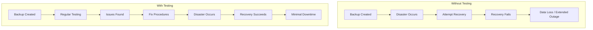
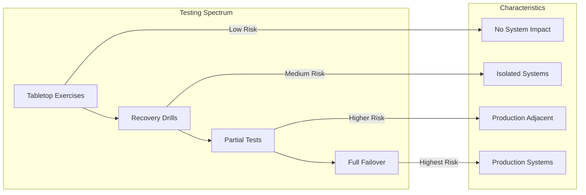
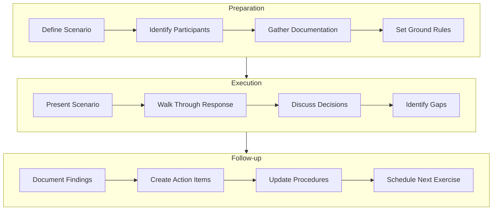
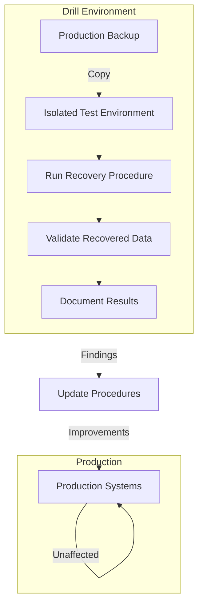
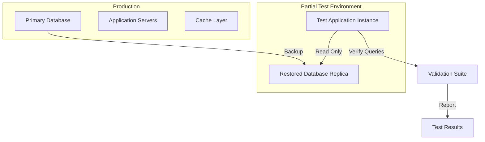
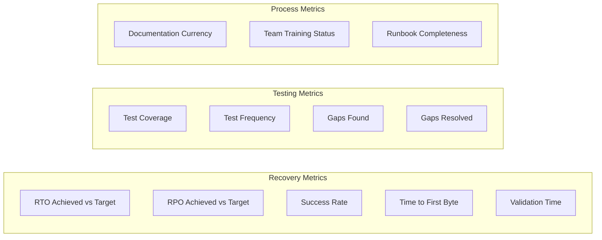

# How to Implement Recovery Testing Procedures

Author: [nawazdhandala](https://github.com/nawazdhandala)

Tags: Disaster Recovery, Testing, SRE, Best Practices

Description: Learn how to test backup and recovery procedures to ensure they work when needed.

---

Backups are worthless if you cannot restore from them. The only way to know your disaster recovery plan works is to test it regularly. This guide covers the full spectrum of recovery testing, from low-impact tabletop exercises to full-scale failover tests.

## Why Recovery Testing Matters

Organizations often discover their backups are corrupted, incomplete, or impossible to restore only when disaster strikes. Recovery testing eliminates this uncertainty by validating your procedures before you need them.



## Types of Recovery Tests

Recovery testing exists on a spectrum from low-risk discussion exercises to full production failovers.



## 1. Tabletop Exercises

Tabletop exercises are discussion-based sessions where teams walk through disaster scenarios without touching any systems. They are low-cost, low-risk, and highly effective at finding gaps.

### Planning a Tabletop Exercise



### Tabletop Exercise Script

```python
#!/usr/bin/env python3
"""
tabletop_exercise.py

A framework for conducting and documenting tabletop disaster recovery exercises.
Tracks scenarios, participant responses, and identified gaps.
"""

import json
import datetime
from dataclasses import dataclass, field, asdict
from typing import Optional
from enum import Enum


class SeverityLevel(Enum):
    """Classification of disaster severity levels."""
    LOW = "low"           # Minor service degradation
    MEDIUM = "medium"     # Significant impact, workarounds available
    HIGH = "high"         # Major outage, no workarounds
    CRITICAL = "critical" # Complete system failure


@dataclass
class Scenario:
    """
    Represents a disaster scenario for the tabletop exercise.
    Each scenario describes a specific failure condition to discuss.
    """
    name: str                                    # Short identifier for the scenario
    description: str                             # Detailed description of what happened
    severity: SeverityLevel                      # Impact level of the disaster
    affected_systems: list[str]                  # Systems impacted by this scenario
    expected_rto: int                            # Expected Recovery Time Objective in minutes
    expected_rpo: int                            # Expected Recovery Point Objective in minutes
    trigger_conditions: list[str] = field(       # What caused this disaster
        default_factory=list
    )


@dataclass
class ResponseStep:
    """
    A single step in the incident response during the exercise.
    Captures what action would be taken and by whom.
    """
    action: str                                  # What action would be taken
    responsible_role: str                        # Who is responsible for this action
    estimated_duration_minutes: int              # How long this step takes
    dependencies: list[str] = field(             # What must happen before this step
        default_factory=list
    )
    tools_required: list[str] = field(           # Tools or access needed
        default_factory=list
    )


@dataclass
class Gap:
    """
    An identified gap or issue found during the exercise.
    These become action items to address after the exercise.
    """
    description: str                             # What gap was identified
    category: str                                # Category: documentation, tooling, training, etc.
    priority: str                                # Priority: P1, P2, P3
    remediation: str                             # Proposed fix
    owner: Optional[str] = None                  # Person assigned to fix this


@dataclass
class TabletopExercise:
    """
    Main class representing a complete tabletop exercise session.
    Tracks all scenarios, responses, participants, and findings.
    """
    exercise_id: str                             # Unique identifier for this exercise
    date: str                                    # Date of the exercise (ISO format)
    facilitator: str                             # Person running the exercise
    participants: list[str]                      # All people participating
    scenarios: list[Scenario] = field(           # Scenarios to walk through
        default_factory=list
    )
    response_steps: dict = field(                # Response steps by scenario name
        default_factory=dict
    )
    gaps: list[Gap] = field(                     # Identified gaps
        default_factory=list
    )
    observations: list[str] = field(            # General observations
        default_factory=list
    )

    def add_scenario(self, scenario: Scenario) -> None:
        """Add a disaster scenario to the exercise."""
        self.scenarios.append(scenario)
        # Initialize empty response list for this scenario
        self.response_steps[scenario.name] = []

    def add_response_step(
        self,
        scenario_name: str,
        step: ResponseStep
    ) -> None:
        """
        Add a response step for a specific scenario.
        Steps are added in order of execution.
        """
        if scenario_name not in self.response_steps:
            self.response_steps[scenario_name] = []
        self.response_steps[scenario_name].append(step)

    def add_gap(self, gap: Gap) -> None:
        """Record a gap identified during the exercise."""
        self.gaps.append(gap)

    def calculate_total_response_time(self, scenario_name: str) -> int:
        """
        Calculate total estimated response time for a scenario.
        Assumes sequential execution of all steps.
        Returns time in minutes.
        """
        steps = self.response_steps.get(scenario_name, [])
        return sum(step.estimated_duration_minutes for step in steps)

    def check_rto_compliance(self, scenario_name: str) -> dict:
        """
        Check if estimated response time meets RTO for a scenario.
        Returns compliance status and details.
        """
        # Find the matching scenario
        scenario = next(
            (s for s in self.scenarios if s.name == scenario_name),
            None
        )
        if not scenario:
            return {"error": "Scenario not found"}

        total_time = self.calculate_total_response_time(scenario_name)
        compliant = total_time <= scenario.expected_rto

        return {
            "scenario": scenario_name,
            "expected_rto_minutes": scenario.expected_rto,
            "estimated_time_minutes": total_time,
            "compliant": compliant,
            "gap_minutes": max(0, total_time - scenario.expected_rto)
        }

    def generate_report(self) -> dict:
        """
        Generate a comprehensive report of the tabletop exercise.
        Includes all scenarios, responses, gaps, and RTO analysis.
        """
        report = {
            "exercise_id": self.exercise_id,
            "date": self.date,
            "facilitator": self.facilitator,
            "participant_count": len(self.participants),
            "participants": self.participants,
            "scenario_count": len(self.scenarios),
            "scenarios": [],
            "gaps": {
                "total": len(self.gaps),
                "by_priority": {
                    "P1": len([g for g in self.gaps if g.priority == "P1"]),
                    "P2": len([g for g in self.gaps if g.priority == "P2"]),
                    "P3": len([g for g in self.gaps if g.priority == "P3"])
                },
                "details": [asdict(g) for g in self.gaps]
            },
            "observations": self.observations
        }

        # Add detailed analysis for each scenario
        for scenario in self.scenarios:
            scenario_report = {
                "name": scenario.name,
                "severity": scenario.severity.value,
                "affected_systems": scenario.affected_systems,
                "rto_analysis": self.check_rto_compliance(scenario.name),
                "response_steps": len(
                    self.response_steps.get(scenario.name, [])
                )
            }
            report["scenarios"].append(scenario_report)

        return report

    def export_to_json(self, filepath: str) -> None:
        """Export the exercise results to a JSON file."""
        report = self.generate_report()
        with open(filepath, 'w') as f:
            json.dump(report, f, indent=2)


def run_example_exercise():
    """
    Example: Run a tabletop exercise for a database failure scenario.
    Demonstrates how to use the framework.
    """
    # Initialize the exercise
    exercise = TabletopExercise(
        exercise_id="TTE-2026-001",
        date=datetime.date.today().isoformat(),
        facilitator="SRE Lead",
        participants=[
            "DBA Team Lead",
            "Platform Engineer",
            "Application Owner",
            "Security Engineer",
            "Operations Manager"
        ]
    )

    # Define a database failure scenario
    db_scenario = Scenario(
        name="primary-database-failure",
        description=(
            "The primary PostgreSQL database becomes unavailable due to "
            "hardware failure. All write operations are failing."
        ),
        severity=SeverityLevel.CRITICAL,
        affected_systems=["user-service", "order-service", "payment-service"],
        expected_rto=30,  # 30 minutes to recover
        expected_rpo=5,   # Can lose up to 5 minutes of data
        trigger_conditions=[
            "Disk controller failure",
            "Complete node failure",
            "Network partition"
        ]
    )
    exercise.add_scenario(db_scenario)

    # Add response steps that would be discussed
    exercise.add_response_step("primary-database-failure", ResponseStep(
        action="Acknowledge alert and assess situation",
        responsible_role="On-call Engineer",
        estimated_duration_minutes=2,
        tools_required=["PagerDuty", "Monitoring Dashboard"]
    ))

    exercise.add_response_step("primary-database-failure", ResponseStep(
        action="Verify database status and identify failure type",
        responsible_role="DBA",
        estimated_duration_minutes=5,
        dependencies=["Alert acknowledged"],
        tools_required=["psql", "Database monitoring"]
    ))

    exercise.add_response_step("primary-database-failure", ResponseStep(
        action="Initiate failover to replica",
        responsible_role="DBA",
        estimated_duration_minutes=10,
        dependencies=["Failure type identified"],
        tools_required=["Patroni CLI", "kubectl"]
    ))

    exercise.add_response_step("primary-database-failure", ResponseStep(
        action="Verify application connectivity to new primary",
        responsible_role="Platform Engineer",
        estimated_duration_minutes=5,
        dependencies=["Failover complete"],
        tools_required=["Application logs", "Health checks"]
    ))

    exercise.add_response_step("primary-database-failure", ResponseStep(
        action="Update status page and notify stakeholders",
        responsible_role="Operations Manager",
        estimated_duration_minutes=3,
        dependencies=["Service restored"],
        tools_required=["Status page admin", "Slack"]
    ))

    # Record gaps identified during discussion
    exercise.add_gap(Gap(
        description="No documented procedure for manual failover",
        category="documentation",
        priority="P1",
        remediation="Create runbook for database failover",
        owner="DBA Team Lead"
    ))

    exercise.add_gap(Gap(
        description="Replica lag monitoring not alerting",
        category="monitoring",
        priority="P2",
        remediation="Add alert for replica lag > 1 minute",
        owner="SRE Team"
    ))

    exercise.add_gap(Gap(
        description="Team unsure who has database admin credentials",
        category="access",
        priority="P1",
        remediation="Document credential access in vault",
        owner="Security Engineer"
    ))

    # Add general observations
    exercise.observations.append(
        "Team was unclear on escalation path after 15 minutes"
    )
    exercise.observations.append(
        "Status page update process needs automation"
    )

    # Generate and print report
    report = exercise.generate_report()
    print(json.dumps(report, indent=2))

    # Check RTO compliance
    rto_check = exercise.check_rto_compliance("primary-database-failure")
    print(f"\nRTO Compliance: {rto_check}")

    return exercise


if __name__ == "__main__":
    run_example_exercise()
```

### Sample Tabletop Scenarios

Create scenarios that challenge different aspects of your recovery capabilities:

| Scenario | Description | Tests |
|----------|-------------|-------|
| Primary database corruption | Transaction logs corrupted, data inconsistent | Point-in-time recovery, data validation |
| Ransomware attack | All systems encrypted, backups targeted | Offline backups, incident response |
| Region-wide outage | Cloud provider region unavailable | Multi-region failover, DNS cutover |
| Key employee unavailable | Primary DBA unreachable during incident | Knowledge sharing, documentation |
| Backup failure discovered | Last 7 days of backups are corrupted | Backup monitoring, retention policies |

## 2. Recovery Drills

Recovery drills involve actual recovery procedures but in isolated environments. They validate technical procedures without risking production.



### Recovery Drill Automation Script

```bash
#!/bin/bash
#
# recovery_drill.sh
#
# Automated recovery drill script that tests backup restoration
# in an isolated environment. Runs without affecting production.
#
# Usage: ./recovery_drill.sh --backup-date 2026-01-29 --target-env drill
#

set -euo pipefail

# =============================================================================
# CONFIGURATION
# =============================================================================

# Script metadata
SCRIPT_NAME="recovery_drill.sh"
VERSION="1.0.0"
LOG_FILE="/var/log/recovery-drills/drill-$(date +%Y%m%d-%H%M%S).log"

# Default values
BACKUP_DATE=""
TARGET_ENV="drill"
SKIP_CLEANUP="false"
VERBOSE="false"

# Database configuration (override via environment variables)
DB_HOST="${DRILL_DB_HOST:-localhost}"
DB_PORT="${DRILL_DB_PORT:-5432}"
DB_NAME="${DRILL_DB_NAME:-app_drill}"
DB_USER="${DRILL_DB_USER:-drill_admin}"

# Backup storage location
BACKUP_BUCKET="${BACKUP_BUCKET:-s3://company-backups/postgres}"

# Validation thresholds
MIN_TABLE_COUNT=50           # Minimum tables expected after restore
MAX_RESTORE_TIME_SECONDS=600 # Maximum acceptable restore time (10 min)

# =============================================================================
# HELPER FUNCTIONS
# =============================================================================

# Log message with timestamp
log() {
    local level=$1
    shift
    local message="$*"
    local timestamp=$(date '+%Y-%m-%d %H:%M:%S')
    echo "[$timestamp] [$level] $message" | tee -a "$LOG_FILE"
}

# Log info message
info() {
    log "INFO" "$@"
}

# Log warning message
warn() {
    log "WARN" "$@"
}

# Log error message
error() {
    log "ERROR" "$@"
}

# Print usage information
usage() {
    cat << EOF
Usage: $SCRIPT_NAME [OPTIONS]

Automated recovery drill script for testing backup restoration.

Options:
    -d, --backup-date DATE    Date of backup to restore (YYYY-MM-DD)
    -e, --target-env ENV      Target environment (default: drill)
    -s, --skip-cleanup        Do not clean up after drill
    -v, --verbose             Enable verbose output
    -h, --help                Show this help message

Examples:
    # Run drill with yesterday's backup
    $SCRIPT_NAME --backup-date 2026-01-29

    # Run drill and keep environment for inspection
    $SCRIPT_NAME --backup-date 2026-01-29 --skip-cleanup

    # Run drill with verbose logging
    $SCRIPT_NAME --backup-date 2026-01-29 --verbose

Environment Variables:
    DRILL_DB_HOST     Database host (default: localhost)
    DRILL_DB_PORT     Database port (default: 5432)
    DRILL_DB_NAME     Database name (default: app_drill)
    DRILL_DB_USER     Database user (default: drill_admin)
    BACKUP_BUCKET     S3 bucket for backups

EOF
}

# Parse command line arguments
parse_args() {
    while [[ $# -gt 0 ]]; do
        case $1 in
            -d|--backup-date)
                BACKUP_DATE="$2"
                shift 2
                ;;
            -e|--target-env)
                TARGET_ENV="$2"
                shift 2
                ;;
            -s|--skip-cleanup)
                SKIP_CLEANUP="true"
                shift
                ;;
            -v|--verbose)
                VERBOSE="true"
                shift
                ;;
            -h|--help)
                usage
                exit 0
                ;;
            *)
                error "Unknown option: $1"
                usage
                exit 1
                ;;
        esac
    done

    # Validate required arguments
    if [[ -z "$BACKUP_DATE" ]]; then
        error "Backup date is required"
        usage
        exit 1
    fi

    # Validate date format
    if ! date -d "$BACKUP_DATE" >/dev/null 2>&1; then
        error "Invalid date format: $BACKUP_DATE (use YYYY-MM-DD)"
        exit 1
    fi
}

# =============================================================================
# DRILL PHASES
# =============================================================================

# Phase 1: Pre-flight checks
preflight_checks() {
    info "=== Phase 1: Pre-flight Checks ==="

    local errors=0

    # Check required tools are installed
    for tool in aws psql pg_restore jq; do
        if ! command -v $tool &> /dev/null; then
            error "Required tool not found: $tool"
            ((errors++))
        fi
    done

    # Check backup exists
    local backup_file="backup-${BACKUP_DATE}.dump"
    if ! aws s3 ls "${BACKUP_BUCKET}/${backup_file}" &> /dev/null; then
        error "Backup not found: ${BACKUP_BUCKET}/${backup_file}"
        ((errors++))
    else
        info "Backup file verified: ${backup_file}"
    fi

    # Check target database is accessible
    if ! PGPASSWORD="${PGPASSWORD:-}" psql -h "$DB_HOST" -p "$DB_PORT" \
         -U "$DB_USER" -d postgres -c "SELECT 1" &> /dev/null; then
        error "Cannot connect to database server"
        ((errors++))
    else
        info "Database server connection verified"
    fi

    # Check sufficient disk space (need 2x backup size)
    local backup_size=$(aws s3 ls "${BACKUP_BUCKET}/${backup_file}" | awk '{print $3}')
    local required_space=$((backup_size * 2))
    local available_space=$(df /tmp --output=avail -B1 | tail -1)

    if [[ $available_space -lt $required_space ]]; then
        error "Insufficient disk space. Need: $required_space, Available: $available_space"
        ((errors++))
    else
        info "Disk space check passed"
    fi

    if [[ $errors -gt 0 ]]; then
        error "Pre-flight checks failed with $errors errors"
        exit 1
    fi

    info "All pre-flight checks passed"
}

# Phase 2: Download backup
download_backup() {
    info "=== Phase 2: Download Backup ==="

    local backup_file="backup-${BACKUP_DATE}.dump"
    local local_path="/tmp/drill-${backup_file}"

    info "Downloading backup from ${BACKUP_BUCKET}/${backup_file}"

    local start_time=$(date +%s)

    aws s3 cp "${BACKUP_BUCKET}/${backup_file}" "$local_path"

    local end_time=$(date +%s)
    local duration=$((end_time - start_time))

    # Verify download integrity
    local expected_size=$(aws s3 ls "${BACKUP_BUCKET}/${backup_file}" | awk '{print $3}')
    local actual_size=$(stat -f%z "$local_path" 2>/dev/null || stat -c%s "$local_path")

    if [[ "$expected_size" != "$actual_size" ]]; then
        error "Download size mismatch. Expected: $expected_size, Actual: $actual_size"
        exit 1
    fi

    info "Backup downloaded in ${duration}s (${actual_size} bytes)"

    echo "$local_path"
}

# Phase 3: Prepare target database
prepare_database() {
    info "=== Phase 3: Prepare Target Database ==="

    # Drop existing drill database if it exists
    info "Dropping existing drill database (if exists)"
    PGPASSWORD="${PGPASSWORD:-}" psql -h "$DB_HOST" -p "$DB_PORT" \
        -U "$DB_USER" -d postgres \
        -c "DROP DATABASE IF EXISTS ${DB_NAME};" 2>/dev/null || true

    # Create fresh database
    info "Creating fresh drill database"
    PGPASSWORD="${PGPASSWORD:-}" psql -h "$DB_HOST" -p "$DB_PORT" \
        -U "$DB_USER" -d postgres \
        -c "CREATE DATABASE ${DB_NAME};"

    info "Target database prepared: ${DB_NAME}"
}

# Phase 4: Restore backup
restore_backup() {
    local backup_path=$1

    info "=== Phase 4: Restore Backup ==="
    info "Restoring from: $backup_path"

    local start_time=$(date +%s)

    # Perform restore with verbose output if enabled
    local verbose_flag=""
    [[ "$VERBOSE" == "true" ]] && verbose_flag="-v"

    PGPASSWORD="${PGPASSWORD:-}" pg_restore \
        -h "$DB_HOST" \
        -p "$DB_PORT" \
        -U "$DB_USER" \
        -d "$DB_NAME" \
        --no-owner \
        --no-privileges \
        --jobs=4 \
        $verbose_flag \
        "$backup_path" 2>&1 | tee -a "$LOG_FILE"

    local restore_exit_code=${PIPESTATUS[0]}
    local end_time=$(date +%s)
    local duration=$((end_time - start_time))

    # Check restore time against threshold
    if [[ $duration -gt $MAX_RESTORE_TIME_SECONDS ]]; then
        warn "Restore took ${duration}s, exceeding threshold of ${MAX_RESTORE_TIME_SECONDS}s"
    fi

    info "Restore completed in ${duration}s with exit code ${restore_exit_code}"

    echo "$duration"
}

# Phase 5: Validate restored data
validate_data() {
    info "=== Phase 5: Validate Restored Data ==="

    local validation_errors=0
    local results=()

    # Check 1: Table count
    local table_count=$(PGPASSWORD="${PGPASSWORD:-}" psql -h "$DB_HOST" -p "$DB_PORT" \
        -U "$DB_USER" -d "$DB_NAME" -t -c \
        "SELECT count(*) FROM information_schema.tables WHERE table_schema = 'public';")
    table_count=$(echo "$table_count" | tr -d ' ')

    if [[ $table_count -lt $MIN_TABLE_COUNT ]]; then
        error "Table count validation failed. Expected >= $MIN_TABLE_COUNT, Got: $table_count"
        ((validation_errors++))
    else
        info "Table count validation passed: $table_count tables"
    fi
    results+=("table_count:$table_count")

    # Check 2: Critical tables exist
    local critical_tables=("users" "orders" "products" "payments")
    for table in "${critical_tables[@]}"; do
        local exists=$(PGPASSWORD="${PGPASSWORD:-}" psql -h "$DB_HOST" -p "$DB_PORT" \
            -U "$DB_USER" -d "$DB_NAME" -t -c \
            "SELECT EXISTS (SELECT FROM information_schema.tables WHERE table_name = '$table');")
        exists=$(echo "$exists" | tr -d ' ')

        if [[ "$exists" != "t" ]]; then
            error "Critical table missing: $table"
            ((validation_errors++))
        else
            info "Critical table verified: $table"
        fi
    done

    # Check 3: Row counts for critical tables
    for table in "${critical_tables[@]}"; do
        local row_count=$(PGPASSWORD="${PGPASSWORD:-}" psql -h "$DB_HOST" -p "$DB_PORT" \
            -U "$DB_USER" -d "$DB_NAME" -t -c \
            "SELECT count(*) FROM $table;" 2>/dev/null || echo "0")
        row_count=$(echo "$row_count" | tr -d ' ')
        info "Row count for $table: $row_count"
        results+=("${table}_rows:$row_count")
    done

    # Check 4: Data integrity with checksums
    info "Running data integrity checks..."
    local checksum=$(PGPASSWORD="${PGPASSWORD:-}" psql -h "$DB_HOST" -p "$DB_PORT" \
        -U "$DB_USER" -d "$DB_NAME" -t -c \
        "SELECT md5(string_agg(id::text, '')) FROM users ORDER BY id LIMIT 1000;")
    checksum=$(echo "$checksum" | tr -d ' ')
    info "Users table checksum (first 1000): $checksum"
    results+=("users_checksum:$checksum")

    # Check 5: Foreign key integrity
    info "Checking foreign key constraints..."
    local fk_errors=$(PGPASSWORD="${PGPASSWORD:-}" psql -h "$DB_HOST" -p "$DB_PORT" \
        -U "$DB_USER" -d "$DB_NAME" -t -c \
        "SELECT count(*) FROM orders o
         LEFT JOIN users u ON o.user_id = u.id
         WHERE u.id IS NULL;")
    fk_errors=$(echo "$fk_errors" | tr -d ' ')

    if [[ $fk_errors -gt 0 ]]; then
        error "Foreign key integrity errors found: $fk_errors orphaned orders"
        ((validation_errors++))
    else
        info "Foreign key integrity check passed"
    fi

    # Check 6: Timestamp validation
    info "Checking data timestamps..."
    local latest_timestamp=$(PGPASSWORD="${PGPASSWORD:-}" psql -h "$DB_HOST" -p "$DB_PORT" \
        -U "$DB_USER" -d "$DB_NAME" -t -c \
        "SELECT max(updated_at) FROM users;")
    latest_timestamp=$(echo "$latest_timestamp" | tr -d ' ')
    info "Latest data timestamp: $latest_timestamp"
    results+=("latest_timestamp:$latest_timestamp")

    if [[ $validation_errors -gt 0 ]]; then
        error "Data validation failed with $validation_errors errors"
        return 1
    fi

    info "All data validations passed"

    # Return results as JSON
    printf '%s\n' "${results[@]}" | jq -R 'split(":") | {(.[0]): .[1]}' | jq -s 'add'
}

# Phase 6: Cleanup
cleanup() {
    info "=== Phase 6: Cleanup ==="

    if [[ "$SKIP_CLEANUP" == "true" ]]; then
        info "Skipping cleanup as requested. Environment preserved for inspection."
        info "Database: ${DB_NAME}"
        info "Remember to clean up manually when done."
        return 0
    fi

    # Remove downloaded backup
    rm -f /tmp/drill-backup-*.dump
    info "Removed downloaded backup files"

    # Drop drill database
    PGPASSWORD="${PGPASSWORD:-}" psql -h "$DB_HOST" -p "$DB_PORT" \
        -U "$DB_USER" -d postgres \
        -c "DROP DATABASE IF EXISTS ${DB_NAME};"
    info "Dropped drill database"

    info "Cleanup completed"
}

# Generate drill report
generate_report() {
    local restore_time=$1
    local validation_results=$2

    info "=== Generating Drill Report ==="

    local report_file="/var/log/recovery-drills/report-$(date +%Y%m%d-%H%M%S).json"

    cat > "$report_file" << EOF
{
    "drill_id": "DRILL-$(date +%Y%m%d-%H%M%S)",
    "timestamp": "$(date -Iseconds)",
    "backup_date": "$BACKUP_DATE",
    "target_environment": "$TARGET_ENV",
    "results": {
        "restore_time_seconds": $restore_time,
        "restore_time_threshold_seconds": $MAX_RESTORE_TIME_SECONDS,
        "restore_within_threshold": $([ $restore_time -le $MAX_RESTORE_TIME_SECONDS ] && echo "true" || echo "false"),
        "validation": $validation_results
    },
    "status": "SUCCESS",
    "log_file": "$LOG_FILE"
}
EOF

    info "Report generated: $report_file"
    cat "$report_file"
}

# =============================================================================
# MAIN EXECUTION
# =============================================================================

main() {
    # Create log directory
    mkdir -p /var/log/recovery-drills

    info "========================================"
    info "Recovery Drill Starting"
    info "Version: $VERSION"
    info "Backup Date: $BACKUP_DATE"
    info "Target Environment: $TARGET_ENV"
    info "========================================"

    local drill_start=$(date +%s)

    # Execute drill phases
    preflight_checks

    local backup_path=$(download_backup)

    prepare_database

    local restore_time=$(restore_backup "$backup_path")

    local validation_results=$(validate_data)

    generate_report "$restore_time" "$validation_results"

    cleanup

    local drill_end=$(date +%s)
    local total_time=$((drill_end - drill_start))

    info "========================================"
    info "Recovery Drill Completed Successfully"
    info "Total Duration: ${total_time}s"
    info "========================================"
}

# Parse arguments and run
parse_args "$@"
main
```

## 3. Partial Recovery Tests

Partial tests restore specific components in production-adjacent environments. They test integration points and verify that recovered systems can communicate properly.



### Partial Test Orchestrator

```python
#!/usr/bin/env python3
"""
partial_recovery_test.py

Orchestrates partial recovery tests by restoring specific components
and validating their functionality against production baselines.
"""

import subprocess
import json
import time
import hashlib
import logging
from dataclasses import dataclass, field
from datetime import datetime
from typing import Callable, Any
from enum import Enum

# Configure logging
logging.basicConfig(
    level=logging.INFO,
    format='%(asctime)s - %(levelname)s - %(message)s'
)
logger = logging.getLogger(__name__)


class TestStatus(Enum):
    """Possible outcomes for a recovery test."""
    PENDING = "pending"
    RUNNING = "running"
    PASSED = "passed"
    FAILED = "failed"
    SKIPPED = "skipped"


@dataclass
class ValidationCheck:
    """
    A single validation check to run against recovered data.
    Each check compares recovered state against expected values.
    """
    name: str                           # Descriptive name for the check
    description: str                    # What this check validates
    check_function: Callable            # Function that performs the check
    expected_value: Any = None          # Expected value (if applicable)
    tolerance: float = 0.0              # Acceptable deviation percentage
    critical: bool = True               # If True, failure stops the test


@dataclass
class RecoveryTestResult:
    """Results from a single validation check."""
    check_name: str
    status: TestStatus
    actual_value: Any
    expected_value: Any
    message: str
    duration_ms: int


@dataclass
class PartialRecoveryTest:
    """
    Orchestrates a partial recovery test for a specific component.
    Handles restoration, validation, and reporting.
    """
    test_id: str                                    # Unique test identifier
    component_name: str                             # Component being tested
    backup_source: str                              # Where to get the backup
    target_environment: str                         # Where to restore
    validation_checks: list[ValidationCheck] = field(default_factory=list)
    results: list[RecoveryTestResult] = field(default_factory=list)
    start_time: datetime = None
    end_time: datetime = None

    def add_validation_check(self, check: ValidationCheck) -> None:
        """Add a validation check to run after restoration."""
        self.validation_checks.append(check)

    def restore_component(self) -> bool:
        """
        Restore the component from backup.
        Override this method for specific component types.
        """
        logger.info(f"Restoring {self.component_name} from {self.backup_source}")

        # This would be implemented based on component type
        # Example for a database:
        try:
            # Simulate restoration process
            restore_cmd = f"""
            pg_restore \
                --host={self.target_environment} \
                --dbname={self.component_name}_test \
                --no-owner \
                {self.backup_source}
            """
            logger.info(f"Running: {restore_cmd}")
            # subprocess.run(restore_cmd, shell=True, check=True)

            # Simulated success
            time.sleep(2)
            return True

        except subprocess.CalledProcessError as e:
            logger.error(f"Restoration failed: {e}")
            return False

    def run_validation(self, check: ValidationCheck) -> RecoveryTestResult:
        """Run a single validation check and return results."""
        logger.info(f"Running validation: {check.name}")

        start = time.time()

        try:
            # Execute the check function
            actual_value = check.check_function()

            # Compare with expected value
            if check.expected_value is not None:
                if check.tolerance > 0:
                    # Numeric comparison with tolerance
                    diff = abs(actual_value - check.expected_value)
                    tolerance_value = check.expected_value * check.tolerance
                    passed = diff <= tolerance_value
                else:
                    # Exact match required
                    passed = actual_value == check.expected_value
            else:
                # No expected value means check function returns bool
                passed = bool(actual_value)

            status = TestStatus.PASSED if passed else TestStatus.FAILED
            message = "Check passed" if passed else f"Expected {check.expected_value}, got {actual_value}"

        except Exception as e:
            status = TestStatus.FAILED
            actual_value = None
            message = f"Check failed with exception: {str(e)}"

        duration_ms = int((time.time() - start) * 1000)

        return RecoveryTestResult(
            check_name=check.name,
            status=status,
            actual_value=actual_value,
            expected_value=check.expected_value,
            message=message,
            duration_ms=duration_ms
        )

    def run(self) -> dict:
        """
        Execute the complete partial recovery test.
        Returns a summary of all results.
        """
        self.start_time = datetime.now()
        logger.info(f"Starting partial recovery test: {self.test_id}")

        # Phase 1: Restore component
        if not self.restore_component():
            logger.error("Restoration failed, aborting test")
            self.end_time = datetime.now()
            return self._generate_report(success=False)

        # Phase 2: Run all validation checks
        critical_failure = False

        for check in self.validation_checks:
            if critical_failure and check.critical:
                # Skip remaining critical checks after a critical failure
                self.results.append(RecoveryTestResult(
                    check_name=check.name,
                    status=TestStatus.SKIPPED,
                    actual_value=None,
                    expected_value=check.expected_value,
                    message="Skipped due to prior critical failure",
                    duration_ms=0
                ))
                continue

            result = self.run_validation(check)
            self.results.append(result)

            if result.status == TestStatus.FAILED and check.critical:
                logger.error(f"Critical check failed: {check.name}")
                critical_failure = True

        self.end_time = datetime.now()

        # Phase 3: Generate report
        return self._generate_report(success=not critical_failure)

    def _generate_report(self, success: bool) -> dict:
        """Generate a comprehensive test report."""
        total_checks = len(self.results)
        passed_checks = len([r for r in self.results if r.status == TestStatus.PASSED])
        failed_checks = len([r for r in self.results if r.status == TestStatus.FAILED])
        skipped_checks = len([r for r in self.results if r.status == TestStatus.SKIPPED])

        duration = (self.end_time - self.start_time).total_seconds()

        report = {
            "test_id": self.test_id,
            "component": self.component_name,
            "backup_source": self.backup_source,
            "target_environment": self.target_environment,
            "start_time": self.start_time.isoformat(),
            "end_time": self.end_time.isoformat(),
            "duration_seconds": duration,
            "overall_status": "PASSED" if success else "FAILED",
            "summary": {
                "total_checks": total_checks,
                "passed": passed_checks,
                "failed": failed_checks,
                "skipped": skipped_checks,
                "pass_rate": f"{(passed_checks/total_checks)*100:.1f}%" if total_checks > 0 else "N/A"
            },
            "results": [
                {
                    "check": r.check_name,
                    "status": r.status.value,
                    "actual": r.actual_value,
                    "expected": r.expected_value,
                    "message": r.message,
                    "duration_ms": r.duration_ms
                }
                for r in self.results
            ]
        }

        return report


def create_database_checks(db_connection: dict) -> list[ValidationCheck]:
    """
    Create standard validation checks for database recovery.
    These verify data integrity, consistency, and completeness.
    """
    checks = []

    # Check 1: Table count matches expected
    def check_table_count():
        # Would execute: SELECT count(*) FROM information_schema.tables
        return 75  # Simulated result

    checks.append(ValidationCheck(
        name="table_count",
        description="Verify all expected tables exist",
        check_function=check_table_count,
        expected_value=75,
        tolerance=0.0,
        critical=True
    ))

    # Check 2: User count within tolerance
    def check_user_count():
        # Would execute: SELECT count(*) FROM users
        return 10250  # Simulated result

    checks.append(ValidationCheck(
        name="user_count",
        description="Verify user count matches production baseline",
        check_function=check_user_count,
        expected_value=10200,
        tolerance=0.05,  # Allow 5% variance
        critical=True
    ))

    # Check 3: Data checksum validation
    def check_data_checksum():
        # Would compute checksum of critical data
        return "a1b2c3d4e5f6"  # Simulated result

    checks.append(ValidationCheck(
        name="data_checksum",
        description="Verify data integrity via checksum",
        check_function=check_data_checksum,
        expected_value="a1b2c3d4e5f6",
        critical=True
    ))

    # Check 4: Foreign key integrity
    def check_fk_integrity():
        # Would check for orphaned foreign keys
        orphaned_count = 0  # Simulated result
        return orphaned_count == 0

    checks.append(ValidationCheck(
        name="foreign_key_integrity",
        description="Verify no orphaned foreign key references",
        check_function=check_fk_integrity,
        critical=True
    ))

    # Check 5: Index health
    def check_indexes():
        # Would verify all indexes are valid
        return True  # Simulated result

    checks.append(ValidationCheck(
        name="index_health",
        description="Verify all indexes are valid and usable",
        check_function=check_indexes,
        critical=False  # Non-critical, indexes can be rebuilt
    ))

    # Check 6: Sequence values
    def check_sequences():
        # Would verify sequences are ahead of max IDs
        return True  # Simulated result

    checks.append(ValidationCheck(
        name="sequence_values",
        description="Verify sequence values are correct",
        check_function=check_sequences,
        critical=True
    ))

    return checks


def run_database_recovery_test():
    """Example: Run a partial recovery test for a database."""

    # Create the test
    test = PartialRecoveryTest(
        test_id=f"PRT-{datetime.now().strftime('%Y%m%d-%H%M%S')}",
        component_name="user_database",
        backup_source="s3://backups/postgres/2026-01-29.dump",
        target_environment="test-db.internal.example.com"
    )

    # Add validation checks
    db_checks = create_database_checks({
        "host": "test-db.internal.example.com",
        "port": 5432,
        "database": "user_database_test"
    })

    for check in db_checks:
        test.add_validation_check(check)

    # Run the test
    report = test.run()

    # Output report
    print(json.dumps(report, indent=2))

    return report


if __name__ == "__main__":
    run_database_recovery_test()
```

## 4. Full Failover Tests

Full failover tests are the most comprehensive validation. They simulate complete disaster scenarios and verify end-to-end recovery capabilities.

```mermaid
flowchart TB
    subgraph Before Failover
        P1[Primary Region Active]
        S1[Secondary Region Standby]
        U1[Users] --> P1
    end

    subgraph During Failover
        P2[Primary Region Down]
        S2[Secondary Region Activating]
        D1[DNS Update]
    end

    subgraph After Failover
        P3[Primary Region Down]
        S3[Secondary Region Active]
        U2[Users] --> S3
    end

    Before Failover --> |Initiate| During Failover
    During Failover --> |Complete| After Failover
```

### Full Failover Test Orchestrator

```python
#!/usr/bin/env python3
"""
full_failover_test.py

Orchestrates full failover tests including traffic switching,
data synchronization verification, and automated rollback.
"""

import time
import json
import logging
from dataclasses import dataclass, field
from datetime import datetime
from typing import Optional
from enum import Enum
from abc import ABC, abstractmethod

logging.basicConfig(
    level=logging.INFO,
    format='%(asctime)s - %(levelname)s - %(message)s'
)
logger = logging.getLogger(__name__)


class FailoverPhase(Enum):
    """Phases of a failover test."""
    PREPARATION = "preparation"
    PRE_CHECKS = "pre_checks"
    TRAFFIC_DRAIN = "traffic_drain"
    DATA_SYNC = "data_sync"
    DNS_SWITCH = "dns_switch"
    VALIDATION = "validation"
    ROLLBACK = "rollback"
    COMPLETE = "complete"


class FailoverMode(Enum):
    """Types of failover operations."""
    PLANNED = "planned"       # Graceful failover with full preparation
    UNPLANNED = "unplanned"   # Simulate sudden failure
    PARTIAL = "partial"       # Failover specific components only


@dataclass
class HealthCheckResult:
    """Result of a health check during failover."""
    component: str
    healthy: bool
    latency_ms: int
    message: str
    timestamp: datetime = field(default_factory=datetime.now)


@dataclass
class FailoverCheckpoint:
    """
    A checkpoint in the failover process.
    Used for tracking progress and enabling rollback.
    """
    phase: FailoverPhase
    timestamp: datetime
    success: bool
    details: dict
    rollback_action: Optional[str] = None


class FailoverComponent(ABC):
    """Abstract base class for components that can be failed over."""

    @abstractmethod
    def pre_failover_check(self) -> bool:
        """Check if component is ready for failover."""
        pass

    @abstractmethod
    def execute_failover(self) -> bool:
        """Execute the failover for this component."""
        pass

    @abstractmethod
    def verify_failover(self) -> bool:
        """Verify failover was successful."""
        pass

    @abstractmethod
    def rollback(self) -> bool:
        """Rollback to previous state."""
        pass


class DatabaseFailover(FailoverComponent):
    """Handles database failover operations."""

    def __init__(self, primary_host: str, secondary_host: str):
        self.primary = primary_host
        self.secondary = secondary_host
        self.original_primary = primary_host

    def pre_failover_check(self) -> bool:
        """Verify replication lag is acceptable."""
        logger.info(f"Checking replication lag from {self.primary} to {self.secondary}")
        # Would check: SELECT pg_last_wal_replay_lsn()
        replication_lag_bytes = 1024  # Simulated
        max_acceptable_lag = 10240    # 10KB

        if replication_lag_bytes > max_acceptable_lag:
            logger.error(f"Replication lag too high: {replication_lag_bytes} bytes")
            return False

        logger.info(f"Replication lag acceptable: {replication_lag_bytes} bytes")
        return True

    def execute_failover(self) -> bool:
        """Promote secondary to primary."""
        logger.info(f"Promoting {self.secondary} to primary")

        try:
            # Would execute: pg_ctl promote
            # Or: SELECT pg_promote() on PostgreSQL 12+
            time.sleep(2)  # Simulated promotion time

            # Swap roles
            self.primary, self.secondary = self.secondary, self.primary

            logger.info(f"New primary: {self.primary}")
            return True

        except Exception as e:
            logger.error(f"Failover failed: {e}")
            return False

    def verify_failover(self) -> bool:
        """Verify new primary is accepting writes."""
        logger.info(f"Verifying {self.primary} accepts writes")

        try:
            # Would execute: INSERT INTO failover_test VALUES (...)
            # Then: SELECT * FROM failover_test WHERE ...
            return True

        except Exception as e:
            logger.error(f"Write verification failed: {e}")
            return False

    def rollback(self) -> bool:
        """Rollback to original primary."""
        logger.info(f"Rolling back to original primary: {self.original_primary}")

        # Swap back to original configuration
        self.primary = self.original_primary
        return True


class DNSFailover(FailoverComponent):
    """Handles DNS cutover operations."""

    def __init__(self, domain: str, primary_ip: str, secondary_ip: str, ttl: int = 60):
        self.domain = domain
        self.primary_ip = primary_ip
        self.secondary_ip = secondary_ip
        self.ttl = ttl
        self.original_ip = primary_ip

    def pre_failover_check(self) -> bool:
        """Verify DNS is responsive and records are correct."""
        logger.info(f"Checking DNS for {self.domain}")

        # Would execute: dig +short {domain}
        current_ip = self.primary_ip  # Simulated lookup

        if current_ip != self.primary_ip:
            logger.warning(f"DNS mismatch: expected {self.primary_ip}, got {current_ip}")

        return True

    def execute_failover(self) -> bool:
        """Update DNS to point to secondary."""
        logger.info(f"Updating DNS: {self.domain} -> {self.secondary_ip}")

        try:
            # Would use DNS provider API to update record
            # Example: route53.change_resource_record_sets(...)
            time.sleep(1)  # Simulated API call

            logger.info(f"DNS updated. TTL: {self.ttl}s")
            logger.info(f"Waiting for propagation...")

            return True

        except Exception as e:
            logger.error(f"DNS update failed: {e}")
            return False

    def verify_failover(self) -> bool:
        """Verify DNS resolves to new IP."""
        logger.info(f"Verifying DNS resolution for {self.domain}")

        # Wait for TTL to expire
        time.sleep(min(self.ttl, 5))  # Cap at 5s for testing

        # Would execute: dig +short {domain}
        # Verify it returns secondary_ip
        return True

    def rollback(self) -> bool:
        """Rollback DNS to original IP."""
        logger.info(f"Rolling back DNS: {self.domain} -> {self.original_ip}")
        return True


class LoadBalancerFailover(FailoverComponent):
    """Handles load balancer traffic switching."""

    def __init__(self, lb_name: str, primary_pool: str, secondary_pool: str):
        self.lb_name = lb_name
        self.primary_pool = primary_pool
        self.secondary_pool = secondary_pool
        self.original_pool = primary_pool

    def pre_failover_check(self) -> bool:
        """Verify secondary pool is healthy."""
        logger.info(f"Checking health of pool: {self.secondary_pool}")

        # Would check LB API for pool health
        healthy_members = 3  # Simulated
        min_healthy = 2

        if healthy_members < min_healthy:
            logger.error(f"Insufficient healthy members: {healthy_members}/{min_healthy}")
            return False

        return True

    def execute_failover(self) -> bool:
        """Switch traffic to secondary pool."""
        logger.info(f"Switching traffic from {self.primary_pool} to {self.secondary_pool}")

        try:
            # Would update LB configuration
            # Example: Set primary pool weight to 0, secondary to 100
            time.sleep(1)  # Simulated

            self.primary_pool, self.secondary_pool = self.secondary_pool, self.primary_pool
            return True

        except Exception as e:
            logger.error(f"Traffic switch failed: {e}")
            return False

    def verify_failover(self) -> bool:
        """Verify traffic is flowing to new pool."""
        logger.info(f"Verifying traffic flow to {self.primary_pool}")

        # Would check LB metrics for traffic distribution
        return True

    def rollback(self) -> bool:
        """Rollback to original pool."""
        logger.info(f"Rolling back to pool: {self.original_pool}")
        return True


@dataclass
class FullFailoverTest:
    """
    Orchestrates a complete failover test across all components.
    Manages phases, checkpoints, and rollback capabilities.
    """
    test_id: str
    mode: FailoverMode
    components: list[FailoverComponent] = field(default_factory=list)
    checkpoints: list[FailoverCheckpoint] = field(default_factory=list)
    current_phase: FailoverPhase = FailoverPhase.PREPARATION
    auto_rollback: bool = True              # Automatically rollback on failure
    max_duration_seconds: int = 1800        # 30 minute maximum
    start_time: Optional[datetime] = None
    end_time: Optional[datetime] = None

    def add_component(self, component: FailoverComponent) -> None:
        """Add a component to the failover test."""
        self.components.append(component)

    def _create_checkpoint(
        self,
        phase: FailoverPhase,
        success: bool,
        details: dict,
        rollback_action: str = None
    ) -> None:
        """Record a checkpoint in the failover process."""
        checkpoint = FailoverCheckpoint(
            phase=phase,
            timestamp=datetime.now(),
            success=success,
            details=details,
            rollback_action=rollback_action
        )
        self.checkpoints.append(checkpoint)
        logger.info(f"Checkpoint: {phase.value} - {'SUCCESS' if success else 'FAILED'}")

    def _pre_checks(self) -> bool:
        """Run pre-failover checks on all components."""
        self.current_phase = FailoverPhase.PRE_CHECKS
        logger.info("=== Phase: Pre-Failover Checks ===")

        all_passed = True
        details = {}

        for component in self.components:
            component_name = component.__class__.__name__
            try:
                result = component.pre_failover_check()
                details[component_name] = "PASSED" if result else "FAILED"
                if not result:
                    all_passed = False
            except Exception as e:
                details[component_name] = f"ERROR: {str(e)}"
                all_passed = False

        self._create_checkpoint(
            FailoverPhase.PRE_CHECKS,
            all_passed,
            details
        )

        return all_passed

    def _execute_failover(self) -> bool:
        """Execute failover for all components."""
        self.current_phase = FailoverPhase.DATA_SYNC
        logger.info("=== Phase: Execute Failover ===")

        failed_components = []

        for component in self.components:
            component_name = component.__class__.__name__
            logger.info(f"Failing over: {component_name}")

            try:
                if not component.execute_failover():
                    failed_components.append(component_name)
                    if self.auto_rollback:
                        logger.warning(f"{component_name} failed, initiating rollback")
                        break
            except Exception as e:
                logger.error(f"{component_name} error: {e}")
                failed_components.append(component_name)
                if self.auto_rollback:
                    break

        success = len(failed_components) == 0

        self._create_checkpoint(
            FailoverPhase.DATA_SYNC,
            success,
            {"failed_components": failed_components},
            rollback_action="rollback_all" if not success else None
        )

        return success

    def _verify_failover(self) -> bool:
        """Verify failover was successful for all components."""
        self.current_phase = FailoverPhase.VALIDATION
        logger.info("=== Phase: Verify Failover ===")

        all_verified = True
        details = {}

        for component in self.components:
            component_name = component.__class__.__name__
            try:
                result = component.verify_failover()
                details[component_name] = "VERIFIED" if result else "FAILED"
                if not result:
                    all_verified = False
            except Exception as e:
                details[component_name] = f"ERROR: {str(e)}"
                all_verified = False

        self._create_checkpoint(
            FailoverPhase.VALIDATION,
            all_verified,
            details
        )

        return all_verified

    def _rollback(self) -> bool:
        """Rollback all components to original state."""
        self.current_phase = FailoverPhase.ROLLBACK
        logger.info("=== Phase: Rollback ===")

        all_rolled_back = True
        details = {}

        # Rollback in reverse order
        for component in reversed(self.components):
            component_name = component.__class__.__name__
            try:
                result = component.rollback()
                details[component_name] = "ROLLED_BACK" if result else "FAILED"
                if not result:
                    all_rolled_back = False
            except Exception as e:
                details[component_name] = f"ERROR: {str(e)}"
                all_rolled_back = False

        self._create_checkpoint(
            FailoverPhase.ROLLBACK,
            all_rolled_back,
            details
        )

        return all_rolled_back

    def run(self, perform_rollback: bool = True) -> dict:
        """
        Execute the complete failover test.

        Args:
            perform_rollback: If True, rollback after successful test.
                            This is recommended for testing purposes.

        Returns:
            Complete test report as a dictionary.
        """
        self.start_time = datetime.now()
        logger.info(f"========================================")
        logger.info(f"Starting Full Failover Test: {self.test_id}")
        logger.info(f"Mode: {self.mode.value}")
        logger.info(f"Components: {len(self.components)}")
        logger.info(f"========================================")

        success = True

        # Phase 1: Pre-checks
        if not self._pre_checks():
            logger.error("Pre-checks failed, aborting test")
            success = False

        # Phase 2: Execute failover (only if pre-checks passed)
        if success and not self._execute_failover():
            logger.error("Failover execution failed")
            success = False
            if self.auto_rollback:
                self._rollback()

        # Phase 3: Verify failover (only if execution succeeded)
        if success and not self._verify_failover():
            logger.error("Failover verification failed")
            success = False
            if self.auto_rollback:
                self._rollback()

        # Phase 4: Rollback (if requested and test succeeded)
        if success and perform_rollback:
            logger.info("Test successful, performing planned rollback")
            self._rollback()

        self.end_time = datetime.now()
        self.current_phase = FailoverPhase.COMPLETE

        return self._generate_report(success)

    def _generate_report(self, success: bool) -> dict:
        """Generate comprehensive test report."""
        duration = (self.end_time - self.start_time).total_seconds()

        report = {
            "test_id": self.test_id,
            "mode": self.mode.value,
            "start_time": self.start_time.isoformat(),
            "end_time": self.end_time.isoformat(),
            "duration_seconds": duration,
            "overall_status": "SUCCESS" if success else "FAILED",
            "components_tested": len(self.components),
            "checkpoints": [
                {
                    "phase": cp.phase.value,
                    "timestamp": cp.timestamp.isoformat(),
                    "success": cp.success,
                    "details": cp.details
                }
                for cp in self.checkpoints
            ],
            "recommendations": self._generate_recommendations()
        }

        return report

    def _generate_recommendations(self) -> list[str]:
        """Generate recommendations based on test results."""
        recommendations = []

        # Check for failed phases
        failed_phases = [cp for cp in self.checkpoints if not cp.success]

        if failed_phases:
            for cp in failed_phases:
                if cp.phase == FailoverPhase.PRE_CHECKS:
                    recommendations.append(
                        "Review component health and replication status before next test"
                    )
                elif cp.phase == FailoverPhase.DATA_SYNC:
                    recommendations.append(
                        "Investigate failover procedure for failed components"
                    )
                elif cp.phase == FailoverPhase.VALIDATION:
                    recommendations.append(
                        "Review validation criteria and component configuration"
                    )

        # Check duration
        duration = (self.end_time - self.start_time).total_seconds()
        if duration > 300:  # More than 5 minutes
            recommendations.append(
                f"Failover took {duration:.0f}s. Consider optimizing for faster RTO"
            )

        if not recommendations:
            recommendations.append("Test completed successfully. Schedule next drill.")

        return recommendations


def run_full_failover_test():
    """Example: Execute a full failover test."""

    # Create the test
    test = FullFailoverTest(
        test_id=f"FFT-{datetime.now().strftime('%Y%m%d-%H%M%S')}",
        mode=FailoverMode.PLANNED,
        auto_rollback=True
    )

    # Add components in failover order
    test.add_component(DatabaseFailover(
        primary_host="db-primary.us-east-1.internal",
        secondary_host="db-secondary.us-west-2.internal"
    ))

    test.add_component(LoadBalancerFailover(
        lb_name="app-lb",
        primary_pool="us-east-1-pool",
        secondary_pool="us-west-2-pool"
    ))

    test.add_component(DNSFailover(
        domain="app.example.com",
        primary_ip="10.0.1.100",
        secondary_ip="10.0.2.100",
        ttl=60
    ))

    # Run the test with automatic rollback
    report = test.run(perform_rollback=True)

    # Output report
    print(json.dumps(report, indent=2))

    return report


if __name__ == "__main__":
    run_full_failover_test()
```

## Automated Recovery Testing Pipeline

Integrate recovery testing into your CI/CD pipeline to ensure continuous validation.

```mermaid
flowchart TB
    subgraph Daily Pipeline
        T1[Trigger: Daily Schedule] --> B1[Create Test Backup]
        B1 --> R1[Restore to Test Env]
        R1 --> V1[Run Validations]
        V1 --> C1[Cleanup]
        C1 --> N1[Notify Results]
    end

    subgraph Weekly Pipeline
        T2[Trigger: Weekly Schedule] --> P2[Partial Recovery Test]
        P2 --> V2[Validate Integration]
        V2 --> R2[Generate Report]
    end

    subgraph Monthly Pipeline
        T3[Trigger: Monthly Schedule] --> TT[Tabletop Exercise]
        TT --> D3[Document Findings]
        D3 --> U3[Update Runbooks]
    end

    subgraph Quarterly Pipeline
        T4[Trigger: Quarterly Schedule] --> FF[Full Failover Test]
        FF --> V4[Comprehensive Validation]
        V4 --> R4[Executive Report]
    end
```



### GitHub Actions Workflow for Recovery Testing

```yaml
# .github/workflows/recovery-testing.yml
#
# Automated recovery testing pipeline
# Runs daily validations and weekly partial tests

name: Recovery Testing Pipeline

on:
  # Daily backup validation at 2 AM UTC
  schedule:
    - cron: '0 2 * * *'

  # Manual trigger for ad-hoc testing
  workflow_dispatch:
    inputs:
      test_type:
        description: 'Type of test to run'
        required: true
        default: 'daily'
        type: choice
        options:
          - daily
          - weekly
          - full_failover
      backup_date:
        description: 'Backup date to test (YYYY-MM-DD)'
        required: false

env:
  # Test environment configuration
  TEST_DB_HOST: ${{ secrets.TEST_DB_HOST }}
  TEST_DB_NAME: recovery_test
  BACKUP_BUCKET: ${{ secrets.BACKUP_BUCKET }}
  SLACK_WEBHOOK: ${{ secrets.SLACK_WEBHOOK }}

jobs:
  # ===========================================================================
  # Daily Backup Validation
  # ===========================================================================
  daily-validation:
    name: Daily Backup Validation
    runs-on: ubuntu-latest
    if: github.event.inputs.test_type == 'daily' || github.event_name == 'schedule'

    steps:
      - name: Checkout repository
        uses: actions/checkout@v4

      - name: Set up Python
        uses: actions/setup-python@v5
        with:
          python-version: '3.11'

      - name: Install dependencies
        run: |
          pip install boto3 psycopg2-binary pytest

      - name: Configure AWS credentials
        uses: aws-actions/configure-aws-credentials@v4
        with:
          aws-access-key-id: ${{ secrets.AWS_ACCESS_KEY_ID }}
          aws-secret-access-key: ${{ secrets.AWS_SECRET_ACCESS_KEY }}
          aws-region: us-east-1

      - name: Determine backup date
        id: backup-date
        run: |
          # Use input date or default to yesterday
          if [ -n "${{ github.event.inputs.backup_date }}" ]; then
            echo "date=${{ github.event.inputs.backup_date }}" >> $GITHUB_OUTPUT
          else
            echo "date=$(date -d 'yesterday' +%Y-%m-%d)" >> $GITHUB_OUTPUT
          fi

      - name: Download backup
        id: download
        run: |
          BACKUP_FILE="backup-${{ steps.backup-date.outputs.date }}.dump"

          echo "Downloading: ${BACKUP_BUCKET}/${BACKUP_FILE}"

          aws s3 cp "${BACKUP_BUCKET}/${BACKUP_FILE}" /tmp/backup.dump

          # Record backup size for reporting
          BACKUP_SIZE=$(stat -c%s /tmp/backup.dump)
          echo "size=${BACKUP_SIZE}" >> $GITHUB_OUTPUT

      - name: Restore backup
        id: restore
        run: |
          START_TIME=$(date +%s)

          # Create fresh database
          PGPASSWORD=${{ secrets.TEST_DB_PASSWORD }} psql \
            -h ${TEST_DB_HOST} -U test_admin -d postgres \
            -c "DROP DATABASE IF EXISTS ${TEST_DB_NAME};"

          PGPASSWORD=${{ secrets.TEST_DB_PASSWORD }} psql \
            -h ${TEST_DB_HOST} -U test_admin -d postgres \
            -c "CREATE DATABASE ${TEST_DB_NAME};"

          # Restore backup
          PGPASSWORD=${{ secrets.TEST_DB_PASSWORD }} pg_restore \
            -h ${TEST_DB_HOST} -U test_admin -d ${TEST_DB_NAME} \
            --no-owner --no-privileges \
            /tmp/backup.dump

          END_TIME=$(date +%s)
          DURATION=$((END_TIME - START_TIME))

          echo "duration=${DURATION}" >> $GITHUB_OUTPUT

      - name: Run validation tests
        id: validate
        run: |
          pytest tests/recovery/ \
            --db-host=${TEST_DB_HOST} \
            --db-name=${TEST_DB_NAME} \
            --junitxml=test-results.xml \
            -v

      - name: Cleanup test database
        if: always()
        run: |
          PGPASSWORD=${{ secrets.TEST_DB_PASSWORD }} psql \
            -h ${TEST_DB_HOST} -U test_admin -d postgres \
            -c "DROP DATABASE IF EXISTS ${TEST_DB_NAME};"

      - name: Generate report
        if: always()
        run: |
          cat << EOF > report.json
          {
            "test_type": "daily_validation",
            "backup_date": "${{ steps.backup-date.outputs.date }}",
            "backup_size_bytes": ${{ steps.download.outputs.size }},
            "restore_duration_seconds": ${{ steps.restore.outputs.duration }},
            "status": "${{ job.status }}",
            "timestamp": "$(date -Iseconds)"
          }
          EOF

          cat report.json

      - name: Notify Slack on failure
        if: failure()
        run: |
          curl -X POST $SLACK_WEBHOOK \
            -H 'Content-Type: application/json' \
            -d '{
              "text": "Recovery Test Failed",
              "attachments": [{
                "color": "danger",
                "fields": [
                  {"title": "Test Type", "value": "Daily Validation", "short": true},
                  {"title": "Backup Date", "value": "${{ steps.backup-date.outputs.date }}", "short": true},
                  {"title": "Status", "value": "FAILED", "short": true}
                ]
              }]
            }'

  # ===========================================================================
  # Weekly Partial Recovery Test
  # ===========================================================================
  weekly-partial-test:
    name: Weekly Partial Recovery Test
    runs-on: ubuntu-latest
    if: github.event.inputs.test_type == 'weekly'

    steps:
      - name: Checkout repository
        uses: actions/checkout@v4

      - name: Set up Python
        uses: actions/setup-python@v5
        with:
          python-version: '3.11'

      - name: Install dependencies
        run: |
          pip install -r requirements-test.txt

      - name: Run partial recovery test
        run: |
          python scripts/partial_recovery_test.py \
            --component database \
            --environment staging \
            --report-file report.json

      - name: Upload test report
        uses: actions/upload-artifact@v4
        with:
          name: partial-recovery-report
          path: report.json

      - name: Post results to monitoring
        run: |
          # Send metrics to your monitoring system
          python scripts/send_test_metrics.py \
            --report report.json \
            --endpoint ${{ secrets.METRICS_ENDPOINT }}

  # ===========================================================================
  # Full Failover Test (Manual Only)
  # ===========================================================================
  full-failover-test:
    name: Full Failover Test
    runs-on: ubuntu-latest
    if: github.event.inputs.test_type == 'full_failover'
    environment: production-dr  # Requires manual approval

    steps:
      - name: Checkout repository
        uses: actions/checkout@v4

      - name: Notify team of pending test
        run: |
          curl -X POST $SLACK_WEBHOOK \
            -H 'Content-Type: application/json' \
            -d '{
              "text": "Full Failover Test Starting",
              "attachments": [{
                "color": "warning",
                "text": "A full failover test has been approved and is starting. Monitor the #incidents channel for updates."
              }]
            }'

      - name: Run full failover test
        run: |
          python scripts/full_failover_test.py \
            --mode planned \
            --auto-rollback \
            --report-file report.json

      - name: Upload test report
        uses: actions/upload-artifact@v4
        with:
          name: failover-test-report
          path: report.json

      - name: Notify completion
        if: always()
        run: |
          STATUS="${{ job.status }}"
          COLOR="good"
          [ "$STATUS" != "success" ] && COLOR="danger"

          curl -X POST $SLACK_WEBHOOK \
            -H 'Content-Type: application/json' \
            -d "{
              \"text\": \"Full Failover Test Complete\",
              \"attachments\": [{
                \"color\": \"${COLOR}\",
                \"fields\": [
                  {\"title\": \"Status\", \"value\": \"${STATUS}\", \"short\": true},
                  {\"title\": \"Report\", \"value\": \"See workflow artifacts\", \"short\": true}
                ]
              }]
            }"
```

## Recovery Testing Schedule

Establish a regular cadence for different types of recovery tests.

| Test Type | Frequency | Duration | Participants | Systems Affected |
|-----------|-----------|----------|--------------|------------------|
| Automated backup validation | Daily | 15-30 min | None (automated) | Test environment only |
| Tabletop exercise | Monthly | 1-2 hours | SRE, Dev leads, Ops | None |
| Partial recovery drill | Weekly | 1-2 hours | SRE team | Test/staging environment |
| Full failover test | Quarterly | 4-8 hours | All teams | Production (planned window) |

## Metrics to Track

Monitor these metrics to measure recovery testing effectiveness:



### Key Performance Indicators

1. **Recovery Time Objective (RTO) Achievement**: Percentage of tests meeting RTO targets
2. **Recovery Point Objective (RPO) Achievement**: Data loss measured in tests vs targets
3. **Test Success Rate**: Percentage of tests completing without critical failures
4. **Gap Resolution Rate**: Time to close issues identified in tests
5. **Documentation Accuracy**: Percentage of procedures that work as documented

## Best Practices

### Before Testing

- Document all procedures before testing them
- Ensure test environments mirror production configuration
- Notify stakeholders of planned tests
- Have rollback procedures ready

### During Testing

- Follow documented procedures exactly
- Record all deviations and issues
- Take timestamps at each step
- Capture screenshots and logs

### After Testing

- Conduct immediate debrief while details are fresh
- Document all findings, including successes
- Create action items with owners and deadlines
- Update procedures based on learnings
- Schedule follow-up tests for failed scenarios

## Common Pitfalls to Avoid

1. **Testing only in ideal conditions**: Real disasters happen at inconvenient times
2. **Skipping validation steps**: A restored backup is worthless if data is corrupt
3. **Not testing the full recovery path**: Include DNS, load balancers, and caches
4. **Ignoring test failures**: Every failure is a learning opportunity
5. **Testing infrequently**: Skills and procedures decay without practice
6. **Not involving all stakeholders**: Recovery is a team effort

## Conclusion

Recovery testing transforms your disaster recovery plan from a theoretical document into a proven capability. By implementing tabletop exercises, recovery drills, and full failover tests, you build confidence that your systems can survive real disasters.

Start with low-risk tabletop exercises, progress to isolated recovery drills, and work up to full failover tests. Automate validation where possible, track metrics religiously, and treat every test failure as an opportunity to improve.

The time to discover your recovery procedures do not work is during a test, not during an actual disaster.
